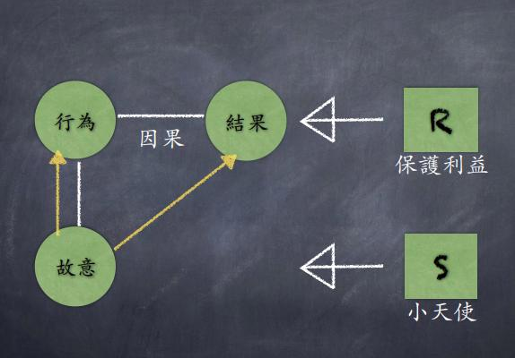
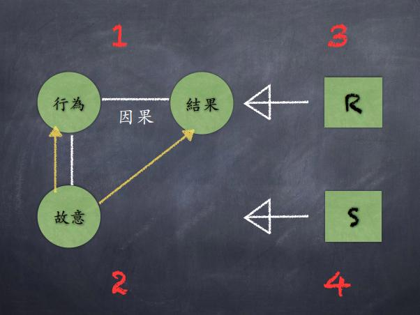
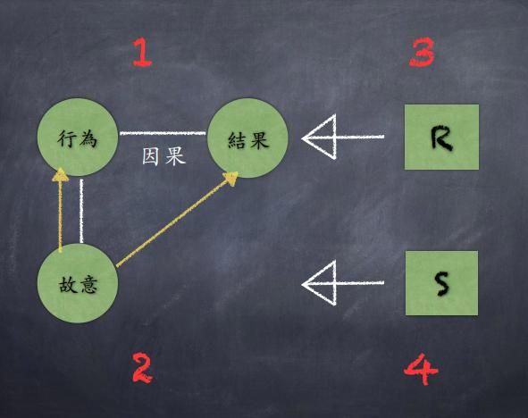
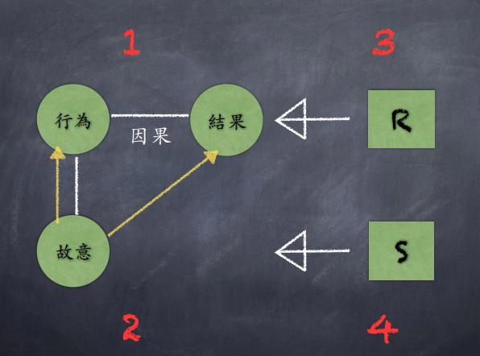
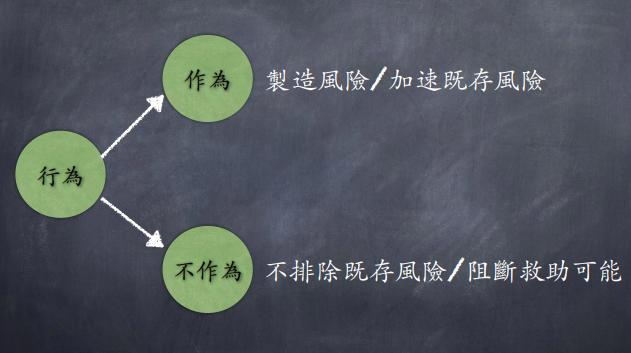
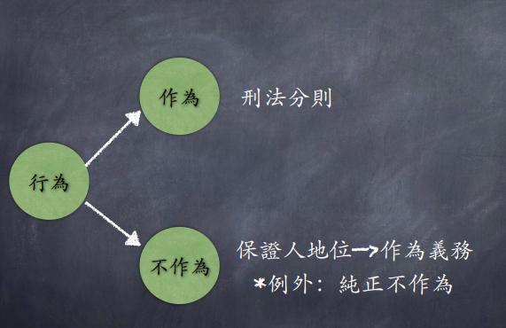

# 刑法總則

## 01 架構篇

### p2

甲、⼄⼆⼈為情敵，甲不僅於公眾場所⼤罵⼄為畜牲，並邀請⼄⾄家裡談判時，意圖讓⼄拉肚⼦，遂於飲料中放⼊瀉藥，端給⼄飲用，⼄喝了⼀⼝後覺得味道有異，先告辭回家，不久⼄隨即⼤瀉三天，⼄痊癒後⾄警局報案，司法警察官以通知
書，通知甲到場說明，甲在害怕之下離家⾄花蓮躲避後，始發現放有瀉藥之飲料仍放在冰箱，故致電給其好友丙，告知前述情事，請丙將該飲料處理掉，丙應允並立即⾄甲家將該飲料處理掉。試論甲於刑法成立何罪？（104年司法三等）

* 解題前提
  * 侵害個⼈：⽣命身體、自由、財產、⼈際關係
  * 侵害社會：⽣命身體恐慌、信用恐慌、道德恐慌
  * 侵害國家：內部侵害（收賄圖利）、外部侵害（妨礙司法）

甲、⼄⼆⼈為情敵，甲不僅於公眾場所⼤罵⼄為畜牲，並邀請⼄⾄家裡談判時，意圖讓⼄拉肚⼦，遂於飲料中放⼊瀉藥，端給⼄飲用，⼄喝了⼀⼝後覺得味道有
異，先告辭回家，不久⼄隨即⼤瀉三天，⼄痊癒後⾄警局報案，司法警察官以通知書，通知甲到場說明，甲在害怕之下離家⾄花蓮躲避後，始發現放有瀉藥之
飲料仍放在冰箱，故致電給其好友丙，告知前述情事，請丙將該飲料處理掉，丙應允並立即⾄甲家將該飲料處理掉。試論甲於刑法成立何罪？

### p5

解題前提

（⼀）某甲放瀉藥，可能成立傷害罪（刑法277條）
（⼆）某甲罵⼄畜⽣，可能構成公然侮辱罪（309）
（三）某甲請託丙處理飲料，可能構成湮滅證據罪
（165/29）

（⼀）某甲放瀉藥，可能成立傷害罪（刑法277條）
1. ⾏為、因果、結果
2. 故意
3. 有無保護利益？
4. 有無小天使問題？
5. 綜上所述，某甲成立/不成立傷害罪

（⼆）某甲罵⼄畜⽣，可能構成公然侮辱罪（309）
1. ⾏為、因果、結果
2. 故意
3. 有無保護利益？
4. 有無小天使問題？
5. 綜上所述，某甲成立/不成立公然侮辱罪。

* 出題老師能考你什麼？
  * ⾏為
  * 因果
  * 結果
  * 故意/過失
  * 阻卻違法（R）
  * 阻卻罪責（S）

## 02 行爲篇

<!--  -->

* 行爲
  * 作爲：製造風險/加速既存風險
  * 不作爲：不排除既存風險/阻斷救助可能
<!--  -->

* 甲與友⼈⼄⾄ PUB 飲酒慶⽣,甲自恃酒量好,堅持載⼄回家,途中不慎撞傷⾏⼈丙,在警察抵達前,甲哀求⼄留在現場佯裝其才是駕駛,自⼰迅速逃離現場,⼄愈想
愈不對,也迅速離開。等到警察到現場時,丙已因傷重死亡。請問甲、⼄是否有刑責?（97檢事官）

* 針對受傷，標題為何？
* 針對死亡，標題⼆選⼀
  * 某甲撞傷的⾏為，可能構成XX罪
  * 某甲離開的⾏為，可能構成XX罪

* 如果是作為，只需要判斷是「危險的⾏為」即可過關。⽽⼀個⾏為是不是危險的⾏為，刑法分則的條⽂有時會有定義。
* 如果是不作為，則需要判斷此⼈是否為「被⼤眾信任應該做某事的⼈」，刑法上稱此為「保證⼈地位」。需要通過保證⼈地位的檢驗，才能說這個不作為有危險性。
  * 保證⼈地位—>具備作為義務（刑法15條）

* 學說上有七種保證⼈地位，需熟記。
  * 法令規定：民法148，道交管理條例62，警察法第2條。
    * 陷阱：醫療法60條
  * 密切⽣活關係
  * 自願承擔義務
  * 危險共同體
  * 危險前⾏為
    * 陷阱：未違背義務的危險前⾏為，非危險前⾏為
  * 監督危險源
  * 場所管理者

* 有保證⼈地位，理論上就有作為義務
* 有作為義務的⼈，依照刑法第15條，其不作為即有處罰依據
* <u>因此，只要遇到⾏為是不作為，就必須審查有無保證⼈地位，來決定⾏為可不可以處罰。</u>
  * 例外：純正不作為犯不用審查保證⼈地位

<!--  -->

* 行爲
  * 作爲：刑法分則
  * 不作爲：保證⼈地位—>作為義務
    * 例外：純正不作為
<!--  -->

甲舉辦⽣日晚宴，席間友⼈ A 頻頻喝酒，終⾄酒醉當場睡著。宴席結束後，甲將 A
叫醒，並建議其先休息，完全酒醒後再離開，惟 A 堅持自⼰尚可開車回家。甲見 A 腳步蹣跚，雖知酒醉駕車的危險性，卻也沒積極阻攔 A 開車離去。A 於回家時，因不勝酒⼒撞倒電線桿死亡。試問甲的⾏為，依刑法如何評價？（101原特三等）

（⼀）某甲未勸阻的⾏為，可能構成XX罪
1. 客觀上，某甲未勸阻的⾏為，造成A受傷，其間有因果關係。然⽽某甲未勸阻之⾏為，屬於對既存風險之不排除之不作為，依刑法第15條，不作為需有作為義務之處罰依據....  
   —— 開始分點論述
2. 主觀上...
3. 違法
4. 有責
5. 有罪/無罪

母親甲,攜同三歲的小兒在便利商店購物。甲先裝滿⼀⼤盒熱騰騰的關東煮,放置在結帳櫃臺上,又⾛回貨架,挑選物品。此時,小兒伸⼿拿取桌上的關東煮,卻打翻利在頭臉上,導致多處燙傷。店員⼄雖注意到小孩的舉動,但忙於幫其他顧客結帳,且立於櫃臺之內,來不及防⽌。問對於小孩的燙傷,甲、⼄是否有罪?【101 觀護⼈】

甲經營傳統相館⽣意已久,因數位化浪潮決定結束營業,卻忘記將外牆看板拆除。該看板⼗年前雖係依法令設置,但其間未曾進⾏檢查維護,支架早已嚴重鏽蝕鬆脫。某日凌晨,甲被門外巨響驚醒,起身查看發現原來是自⼰的看板落下砸中路⼈ A 頭部,A 當場陷⼊昏迷。甲此時才想起這個看板,見四下無⼈,為了逃避責任,趕緊將看板收進店內。甲雖有想到將 A 留在原地會有遭來車輾斃或延誤急 救時機的死亡可能,但⼼想如此反⽽死無對證,於是將 A留置於原地不顧(事後確認,A 雖顱內出⾎,但若於當時送醫處理,
仍有幾近 確定的治癒可能性)。翌日清晨,清潔⼯⼈始發現業已死亡多時的 A。警⽅於現場查訪時,發現甲神⾊詭異,便請其回警局協助辦案,甲突然想到自⼰裝在門⼝的監視錄影機可能錄下了整起事件經過,便趁警詢空檔偷偷打電話給昔日的相館員⼯⼄,央求其前往相館將監 視錄影銷燬。⼄於觀看錄影內容後,將上開部分的錄影檔案刪除。 試問: ⼄構成何罪名?甲構成何罪名? 【101律師】

（⼀）某甲未檢查維護，可能構成XX罪
1. 客觀上，某甲未檢查維護的⾏為，造成A受傷，其間有因果關係。然⽽某甲未檢查維護之⾏為，屬於對既存風險之不排除之不作為，依刑法第15條，不作為需有作為義務之處罰依據....  
   ——開始分點論述
2. 主觀上...
3. 違法
4. 有責
5. 有罪/無罪

⼋歲小孩 A ⽗母雙亡，與墓園管理員之叔⽗甲獨自⽣活。甲素來不喜歡 A，明知 A 個性極為膽小，仍不顧其⼼理健康可能受到影響，總在睡前對 A 講述恐怖的鬼故事，並常在 A 不聽話時，趁著夜半墓園無⼈，將 A 獨自⼀⼈關在墓園中數小時，任憑 A ⼼裡極度害怕，情緒崩潰哭喊，⽽不予理會。某夜晚甲又將 A 關進墓
園，並因為臨時有要事處理，請其友⼈⼄暫代看管墓園，並告訴⼄「我把小孩 A 關在墓園以練膽，不論他如何哭鬧，等我回來後，我再帶他出來」，⼄應允。其實⼄也不喜歡小孩，甚⾄曾經建議甲將 A 殺死，詐領 A 之鉅額保險⾦，但甲未為其說動。是夜 A 被關在墓園後極為驚恐，嘗試爬樹越牆逃出，卻不小⼼從⾼處跌下，A 落地時頭部著地，A 因頭部劇痛⼤聲哭鬧，並叫喊：「救命」、「我好痛，快帶我出去」等語。⼄在遠處之管理室，雖聽到 A 求救聲，但不知 A 已經受傷，所以未予理會。幾小時過後，甲回到墓園欲放 A 回家時，發現 A 倒在地上，並已經死亡。經法醫鑑定A 如能及時就醫，應可避免死亡情事發⽣。試問：甲⼄之刑責？（102律師）

### 進階考點

* 有保證⼈地位就⼀定有作為義務嗎？
  * ⼤部分是，但未必。
  * 有保證⼈地位的⼈，未必有「**排他支配性**」，不要忘記，保證⼈地位只是⼀個形式判斷。排他支配性的判斷在於「**誰有資訊優勢**？」
  * 另外，有保證⼈地位的⼈，也未必有「**作為可能性**」。從⽽未必有作為義務。

## 03 結果

### p2

⾏為客體

* 犯罪的對象

### p3

結果：狀態＋法益侵害

### p4

* 如何描述狀態？
  * ⾏為客體的變動
  * ⼈死亡的狀態（殺⼈罪）
  * 動產被破壞持有並建⽴持有的狀態（竊盜罪）
  * 無⾃救能⼒者無援助的狀態（遺棄罪）
  * ⽣理機能被妨礙的狀態（傷害罪）

### p5

實害犯與危險犯

法益侵害分兩種：法益實害與法益危險

### p6

有狀態就等於有法益侵害嗎？

### p7

* 實害犯：原則上有狀態即等於有法益實害
* 危險犯：有狀態不代表有法益侵害（法益危險），需個案認定

### p8

抽象危險犯/具體危險犯

* 抽象危險犯：有狀態就當做有法益危險
* 具體危險犯：有狀態不代表有法益危險

### p9

甲到外國旅遊，不慎拿回⼀張百元美⾦偽鈔。甲不願遭受損失，於是將該美⾦拿到銀⾏，想存到⾃⼰的外幣帳⼾內，以便往後提領出真鈔。不料，⾏員識破該張美⾦偽鈔，並要求甲換⼀張或逕⾏取回。甲不依，堅持該張美⾦不是僞鈔，執意要⾏員收下。⾏員不得已，只好報警處理。試問甲的罪責？(104年四等原住民特考)

### p10

甲單⾝，其⽗ A 已年滿 70 歲，體⼒衰弱，無⼯作能⼒，須坐輪椅始能移動，平⽇與甲⼀起⽣活。⾃ 104 年 1 ⽉ 1 ⽇起，甲將其⽗委由開設養護之家之⼄照料，並簽訂契每⽉養護費新臺幣 2 萬元，3 個⽉⼀期，期前繳交費⽤，若有⼀期不繳，契約即⾃動終⽌，甲應將 A 帶回。俟甲與⼄簽約繳交頭期款後，⾄5 ⽉下旬尚未繳交第⼆期養護費。⼄不堪賠累，4 次催繳並要甲將 A 帶回，但甲均置之不理。⼄遂於 104 年 6 ⽉ 15 ⽇ 10時將 A 以輪椅帶⾄甲居住處所，⾒甲不在家後，將 A 棄於⾨⼝逕⾃離去。直⾄夜間 10 時，甲仍未返家，但 A 已氣息微弱，陷⼊昏迷，鄰⼈⾒狀不忍，遂報警處理，警乃將 A 送醫，幸未死亡。問:甲之所為若依我國判例⾒解，是否成⽴刑法第 294 條違背義務之遺棄罪?理由為何?(13 分)⼄之所為若依不純正不作為犯之學理，是否有罪?理由為何?(12 分)(104年調查局)

### p11

甲、⼄⼀起承包鐵路管理局某無⼈看管平交道柵欄修復⼯程。⼀⽇經鐵路管理局告知該柵欄故障，並限定於交通管制時間內完成修復。兩⼈前往查看後，發現分別有電⼦訊號與⿒輪機械兩處故障。由於甲、⼄與鐵路管理局另有⼯程款糾紛，⼆⼈竟不惜容任柵欄未修復可能發⽣重⼤交通事故的⾵險，約定在取得前次⼯程款後，始由甲先修復電⼦訊號，再由⼄完成機械部分之修繕。甲、⼄謀定且各⾃回家後，甲突然想起⾃⼰即將出國旅遊，為免⽇後時間安排不易，於是在鐵路管理局通知的交通管制時間內，將柵欄電⼦訊號異常部分修復，但並未告訴⼄。交通管制時間後，由於甲、⼄皆未告知鐵路管理局柵欄未完成修繕情事，致使該處平交道在柵欄未能正常起落時，仍有⼆班列⾞經過。所幸列⾞經過時，均無汽⾞與⾏⼈通過平交道。試問甲、⼄的⾏為成⽴何罪？（104年律師）

### p12

犯罪⼈和被害⼈是同⼀⼈,並無法益之保護必要
⾃我毀損，⾃我傷害
