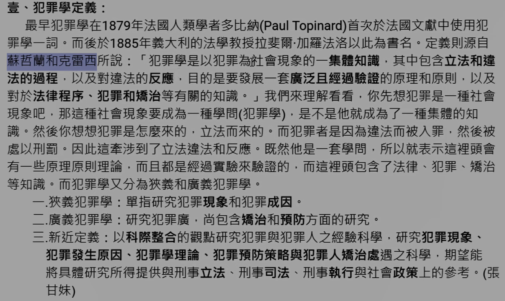

# 主題二：犯罪學

## 壹、犯罪學之定義

犯罪學一詞的出現：最早 1879 年法國學者<b>多比納 (Topinard)</b> 提出概念，1885 加<b>洛法羅</b>以之為書名，沿用至今。

定義：源自<b>蘇哲蘭和克雷西</b>所說：「犯罪學是以犯罪為社會現象的一<u>集體知識</u>，其中包含<u>立法和違法的過程</u>，以及對違法的<u>反應</u>，目的是要發展一套<u>廣泛且經過驗證</u>的原理和原則，以及對於<u>法律程序</u>、<u>犯罪和矯治</u>等有關的知識。

> （這部分沒有很重要）

一、<b>狹義犯罪學</b>：單指研究<u>犯罪現象和犯罪成因</u>。又稱犯罪原因學。

二、<b>廣義犯罪學</b>：研究範圍廣,尚包含<u>矯治和預防</u>方面的研究。

三、<b>新近定義</b>：以<u>科際整合</u>的觀點研究犯罪與犯罪人之經驗科學，研究<u>犯罪現象、犯罪發原因、犯罪學理論、犯罪預防策略與犯罪人矯治處遇</u>之科學，期望能將具體研究所得提供與<u>刑事立法、刑事司法、刑事執行與社會政策</u>上的参考。（張甘妹）

> 孔德（Comte）：以科學方法研究犯罪人，強調從實質的犯罪定義作研究分析。
> 
> 曼海姆（Hermann Mannheim）：犯罪學分為狹義與廣義。

## 貳、犯罪學的發展

一、遲緩誕生的犯罪學：原本是社會學下面一個學科，不受重視。

二、受到忽視的犯罪學：開始發展後仍被忽視 
（一）犯罪學建立當時並無完全獨立的學術性。 
（二）研究重點在於犯罪原因的探討。 
（三）科際整合的研究方式並非一蹴可就。 
（四）部分學者將犯罪偵查納入犯罪學領域。 
（五）法學教育不重視犯罪學。

三、蓬勃發展的犯罪學： 
（一）犯罪與監禁人口的逐年攀升。 
（二）政府對抗犯罪政策的入法實行。 
（三）保守派與自由派對於矯治效能的爭論。

## 参、犯罪學之研究目標

一、衡量、瞭解、控制：（蔡德輝、楊士隆） 
（一）<b>衡量犯罪</b>：透過測量犯罪，了解整個社會犯罪的狀況，加以擬定相關政策和法律。 
（二）<b>瞭解犯罪</b>：了解犯罪發生之性質、原因，進而預測犯罪。 
（三）<b>控制犯罪</b>：根據研究成果，提出犯罪防制對策，控制犯罪行為至最低程度。

二、創造社會最大幸福：（許春金） 
（一）預防犯罪，防範未然：預防犯罪為罪學研究之出發點。 
（二）降低刑罰，減少監禁：藉由研究制定適當之刑罰，避免過高的社會成本。 
（三）協助賦歸，減少再犯：藉由矯治處遇的功效，使悔向上，適於社會生活。 
（四）發掘不義，維護正義：犯罪學的重要目的就是構建正義，健康的生活。

## 肆、犯罪學之研究價值

> （考申論機會不高）

\* 口訣：改革、預防、處遇

一、制度改革：（簡記：刑罰、法律和社會制度） 
（一）改進刑罰制度，並提供刑事司法和立法之依據。 
（二）對現行法律和社會制度研究並改革。

二、犯罪原因和預防：（簡記：解釋、預防、預測、被害者） 
（一）以實證的態度，建立犯罪體系，對各種犯罪現象和型態做解釋。 
（二）對犯罪預防做出適當建議。 
（三）以犯罪預測來達到犯罪預防的效果。 
（四）被害者學之研究，降低被害。

三、犯罪處遇：（簡記：處遇、習慣犯） 
（一）研究評估犯處遇的方法，提出最人道最合適的處遇方式。 
（二）研究一些無法矯治的習慣犯，並提出應對措施。

## 伍、犯罪學之研究困難

一、找尋資料方面的困難點：<u>犯罪黑數、研究對象不配合、隱私問題。</u>

二、研究者方面的困難點：<u>依喜好挑選研究主題、過於主觀判斷、經費不足。</u>

\* 小節記憶點：基本上朝人和物兩方面去然後論述即可。

## 陸、犯罪學的研究方法：

> （考申論機會不高）

一、追蹤研究法：又稱<u>縱貫型研究</u>,係對同一樣本族群,在既定的時間點進行調查並記錄、統計、分析其變化。

二、實驗研究法：以實驗的方式控制環境和變項,設立不同組別來研究。

三、質性個案研究法：相對於量化研究,是利用<u>深度訪談</u>的方式來研究。

四、觀察研究法：以研究者本身的學識和理論當作基礎,藉由自身感官的觀察。

五、調查研究法：從母群體中以<u>抽樣方式</u>,選出代表性樣本後加以分析。

六、評估研究法：評估各方案是否符合效益,有助於了解各種方案的是否適宜。

\* 小節記憶點：口訣：追石子關茶瓶

## 柒、科際整合的犯罪學研究

> （重點記住 4 個學科）

一、科際整合的意義： 

犯罪學研究犯罪現象與犯罪人均同時涉及許多學科，但現今單一學科力求專精化的情況下，某些學科難免陷入孤立隔絕的窘境，導致單一學科發展停留在某一階段。而學術界為了擺脫上述的窘境，避免單一學科專精化的不良副作用，乃慢慢又孕育出科際整合的觀念，整合與犯罪學有關的學科，如法學、心理學、社會學、醫學等理論與方法來從事犯罪現象與犯罪人的研究。

二、科際整合的四個支柱： 

（一）法學：個人因為破壞刑事法規範，成為犯罪人，而成為犯罪學的研究客體。而法學作為社會學科的一種，研究與發展都不能脫離社會現實，因此不管是從事立法或司法的實務工作，都有借重社會學專有知識的必要，因此造成法學與社會學整合的趨勢。

（二）社會學：社會學很早就從事犯罪問題的研究工作，犯罪學者如蘇哲蘭（E.H.Sutherland）及克雷西（D.R.Cressey）將犯罪學視為社會學中的一個特殊領域。畢竟某一偏差行為必定基於其與社會及社會組成份子間的關係，才可以斷定為犯罪行為，而成為犯罪學的研究客體，這一系列人們對於犯罪的反應態度，都足以影響犯罪的形成與演變。

（三）心理學：心理學乃研究人類行為與經驗的科學，他描述與測量人類行為與經驗的各種變項，並分析此等變項的條件，而後基於研究所得的規則性來預測人類行為。在犯罪學的研究中，犯罪學者希望以心理學的專門知識與測驗方法來探測罪犯的人格與形成犯罪的心理因素。在心理學的領域中有下列五種類別對於犯罪學之研究較為重要：動態心理學、人格心理學、發展心理學、社會心理學、變態心理學。

（四）醫學：醫學觀點點的部分偏向於生物學，主要再研究犯罪人的生理狀態、體，型、遺傳或精神狀態等，故醫學亦應為科際整合的犯罪學在整合上的一大支柱，特別是法醫學與精神醫學。
