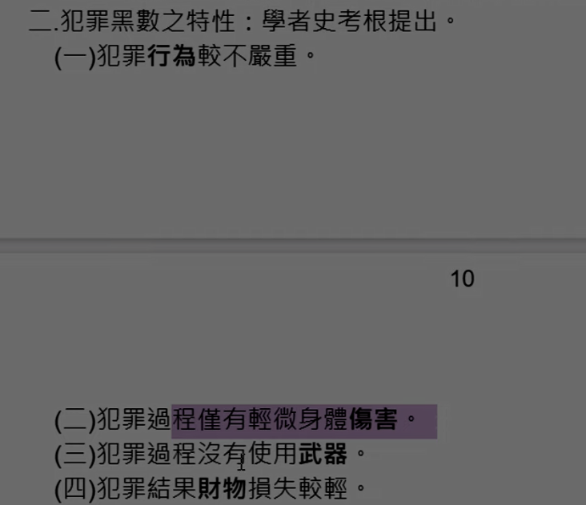

# 主題三:犯罪測量★★★

犯罪學的研究需要大量資料,這些資料怎麼來,則需要從犯罪測量中得來,目前的犯 罪測量方法共有三種,分別是<b>官方統計、自陳報告和被害者統計</b>。

## 壹、犯罪測量之目的：

一、<b>瞭解</b>犯罪之人、事、時、地、原因

二、提供犯罪<b>原因</b>探討之基礎。

三、提供犯罪司法機構<b>決策</b>之參考

四、提供刑事政策及犯罪矯治對策之<b>評估</b>依據

五、提高犯罪學之科學性及<b>精確</b>性

小節記憶點：口訣:決策、評估、原因、精確、瞭解。(決評因經瞭=絕品陰莖鳥)

我們由犯罪這個點開始想好了,犯罪往前想犯罪有其原因,犯罪後有司法機構判決,大環境的政策面有刑事政策及矯治對策,而這些測量都是為了犯罪學研究。

## 貳、犯罪測量的方法：★★★

### 一、官方統計：

[意義、優點、缺點、結論]

（一）意義： 
顧名思義就是這些資料都是由官方所整理編輯而成的犯罪統計資料。例如我國刑事警察局每年都會發行的刊物「台聞刑案統計」，以及法務部犯罪研究中心所發行的「犯罪狀況及其分析」等書，都是藉由官方從偵查、起訴、判決到入監等資料統計集結而來。

（二）優點： 
1.參考價值高（正確性高）。 
2.資料豐富詳盡。 
3.可瞭解犯罪消長趨勢。 

（三）缺點： 
1.犯罪黑數問題。 
2.無法研究犯罪人人格。 
3.會受到法律修改或是吃案等因素影響。 
4.統計方式受政策影響。 

（四）結論： 
官方的資料雖然較為詳盡且正確，具有參考價值。但是因為犯罪黑數等問題的存在並無法全面的作為犯罪研究以及制定政策的參考依據，因此仍然需要其他的測量方式來彌補他的不足。

小節記憶點： 
優點口訣：政風室 
缺點口訣：黑人吃桶(經過政風室的調查黑人都去吃桶吧)。

### 二、自陳報告：

（一）意義： 
讓犯罪的人自己陳述自己犯罪事實並做成招生，使用的方式就是問卷，形式有記名不記名以及郵寄、直接填寫或是電話訪問等方式來進行調查。主要目的是為了填補官方統計的缺失「犯罪黑數」。

（二）優點： 
1.可以探索犯罪黑數 
2.顯現各階層的犯罪 
3.輕微案件較容易顯現 
4.補足關於犯罪人格的資料 
5.擴展犯罪學研究範疇

（三）缺點： 
1.可信度受到質疑：受訪人不誠實。 
2.效度有問題：成年人不願意受訪，常侷限在青少年。 
3.調查對象受到侷限：有問題的受訪人常不接受調查。 
4.無法探得隱密或是重大犯罪：怕被起訴偵查，寧願隱瞞。

(四) 結論： 
自陳報告雖然可以彌補犯罪黑數,但是因為調查的方式畢竟是採用問卷或是訪談,較無法分辨對方敘述真假。另外因為成年人忙於社會經濟活動，對於調查興趣度不高，因此多以青少年為主的調查也會讓調查容易失真。

小節記憶點： 
優點口訣：黑街圍補犯 
缺點口訣：信孝菊探(探索信孝的菊花)

### 三、被害者調查：

（一）意義： 
針對犯罪被害者調查其於特定期間害之經驗，與被害當時之情境。藉由犯罪被害人親自陳述當時被害之經過，透過不同立場來研究犯罪，發掘犯罪黑數並瞭解害特性和害人和犯罪人之關聯性。

（二）優點： 
1.降低犯罪黑數 
2.瞭解被害特性 
3.瞭解被害情境 
4.有助被害者學研究

（三）缺點： 
1.犯罪類型有限：例如<u>無被害者犯罪</u>不認為自己遭到侵害。 
2.適用性不健全：調查之結果常常<u>受限於被害人對於犯罪之定義</u>。 
3.可信度（正確性）不高：因為被害人<u>刻意隱瞞事實或是遺忘</u>都會導致研究不正確。

(四) 結論： 
被害者調查依然是為了填補官方統計之不足,也確實有產生功效,並且為犯罪被害的研究提供許多珍貴資料。但是還是有它先天上的缺陷,例如無被害者根本不認為自己受害,那麼也不會接受所謂的被害者調查，就算接受了也不是受害者的角色。而這些非官方的調查都沒有公權力也無法防堵調查者的作假，或是因為被調查找自身的認知錯誤或是記憶力衰退都會導致調查結果的失真。

小節記憶點： 
優點口訣：黑特情學(HATE情色文學) 
缺點口訣：類適正(拉史菌-某車車品牌)-開拉史菌的缺點是怕被害

## 參、犯罪測量的困境(難處):

一、犯罪的<b>稀少性</b>：大部分的人都不會犯罪，為了調查還要特別找到犯罪人。

二、犯罪的<b>隱密性</b>：犯罪者大都不願意自己曝光，犯罪時也會對自己犯行多加以隱密。

三、樣本<b>不平均</b>：犯罪的樣本會因為時空背景或是地點而有所不一致。例如：財產犯罪總集中在繁華地區。

## 肆、關於犯罪黑數：★★★

### 定義：★★★

指實際上發生之犯罪事件,因種種因素而尚未眾所皆知,或未報案為受刑事追訴之現象。可分為三種類型：

（一）已發生未發現 
（二）已發生已發現未報案（如：親屬包庇） 
（三）已發生已發現已報案未<b>登錄</b>（如：吃案） 

若是已發現登錄在案，但未破案叫做<b>犯罪灰數</b>（如：懸案）。

### 二、犯罪黑數之特性：

犯罪行為較不嚴重。

### 三、導致犯罪黑數的因素：★★★

（損害） 
（一）被害人不知損害之發生 
（二）損害輕微不願意報案 
（人的因素） 
（三）被害人與加害人關係親密 
（四）無被害者犯罪 
（司法體系問題） 
（五）破案率低，訴訟過程冗長 
（六）執法機構統計或執法的偏誤 
（七）被害人害怕報復不願報案 

### 四、如何降低犯罪黑數:★★★

（一）加強法律知識的宣導。 
（二）提供破案獎金。 
（三）減少告訴乃論罪名，鼓勵報案。（增加公訴） 
（四）立法限制自由裁量權。 
（五）加強執法機關政風之查核。 
（六）健全對被害人之保護措施。 

### 五、發掘方式:

(一) 被害人之問卷調查 
(二) 自我報告犯罪調查統計 

### 六、研究犯罪黑數的限制:★

（案件本身問題） 
（一）極少接觸<b>特殊案件</b>：例如：煙毒、政治、白領、組織。 
（二）案件<b>隱匿</b>：輕微的案件犯罪或受害者很快遺忘，嚴重的行為人不願意說明，牽扯到名譽的性侵類案件被害者不願意敘述。 
（人的問題） 
（三）<b>研究者本身</b>：研究者自身偏好，研究者無法引導被調查者做合適的回答，或是問卷設計方式、內容不合適。 
（侷限性） 
（四）自陳報告的侷限性（缺點） 
（五）被害者調查的侷限性（缺點）

### 七、犯罪黑數在犯罪研究上之重要性：

（一）開拓犯罪學之<b>新領域</b>。
（二）彌補官方統計在<b>輕微犯罪</b>上之數量。
（三）瞭解警方偵辦過程及態度，進而瞭解正式<b>社會控制部門</b>是否有效的運作。
（四）可以獲知社會<b>大眾法意識</b>是否轉變，進一步瞭解人民對於犯罪告發之意願。
（五）使得國際間犯罪問題，可以做進一步的<b>比較分析</b>。
