# 主題五：犯罪分析與預測（不常考）

（犯罪分析偏警察，犯罪預測則是監獄官重要考點）

## 壹、犯罪分析

（選擇題為主，不太會考）

### 一、意義：<++> 

1.<++> 
2.<++> 
3.<++> 
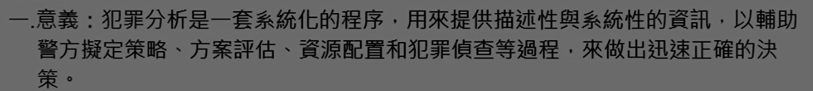

### 二、犯罪分析的作用： 

（一）<++> 
（二）<++> 
（三）<++> 
（四）<++> 
（五）<++>
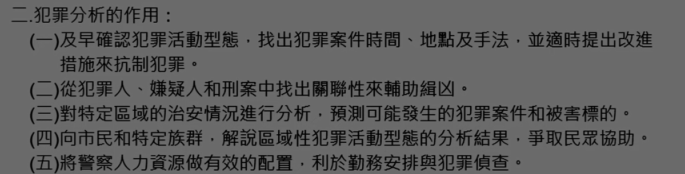

### 三、犯罪分析的程序： 

（一）收集資料：<++> 
（二）整理資料：<++> 
（三）犯罪分析：<++> 
（四）分送結果：<++> 
（五）檢討評估：<++>

### 四、犯罪分析的方式： 

（一）犯罪趨勢分析：<++> 
（二）地區模式分析：<++> 
（三）近似犯罪模式分析：<++> 
（四）犯罪手法、犯罪模式、簽名特徵：<++>
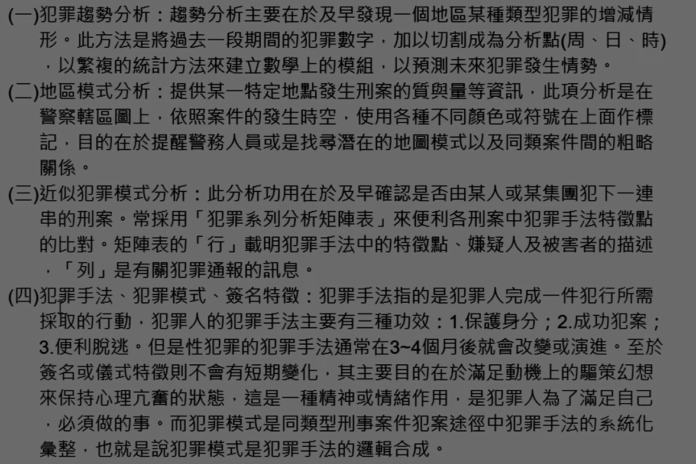

### 五、犯罪剖繪： 

（一）犯罪剖繪的<b>意義</b>：<++> 
1.評量兇嫌的社會背景和心理素質。 
2.評估兇嫌可能持有的物品。 
3.提供偵訊策略和審訊資料。 
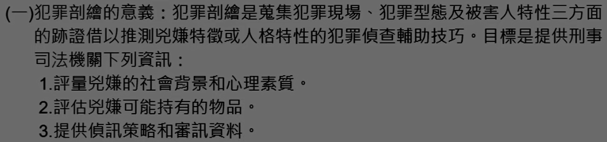

（二）犯罪剖繪的<b>原理</b>：<++> 
1.兇嫌人格不變：<++> 
2.現場反映人格：<++> 
3.犯罪手法相似：<++> 
3.簽名特徵相同：<++> 
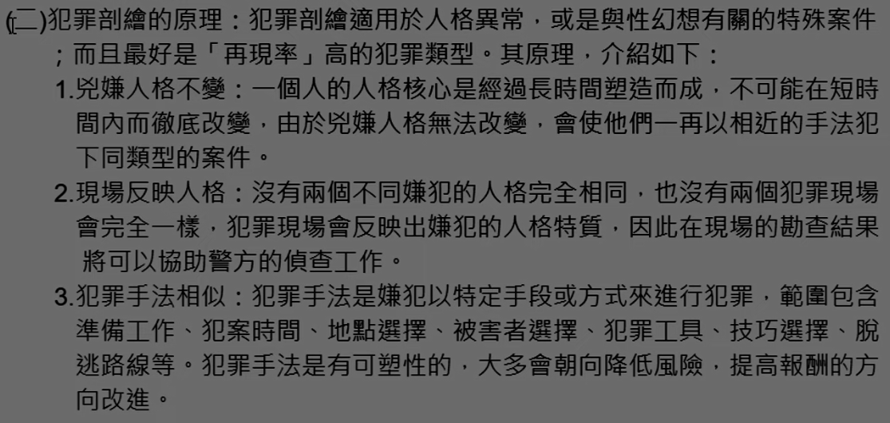
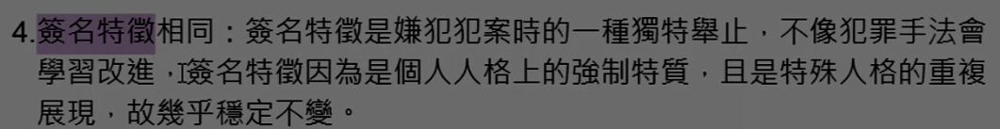

（三）犯罪現場與嫌犯人格：<++> 
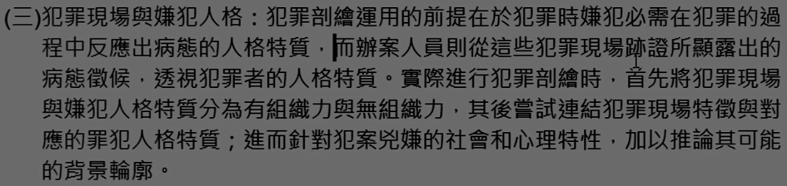

（四）犯罪剖繪的<b>過程</b>：<++> 
1.剖繪輸入：<++> 
2.犯意決選型模<++> 
3.犯罪評量<++> 
4.犯罪剖繪<++> 
5.偵查：<++> 
6.逮捕：<++>
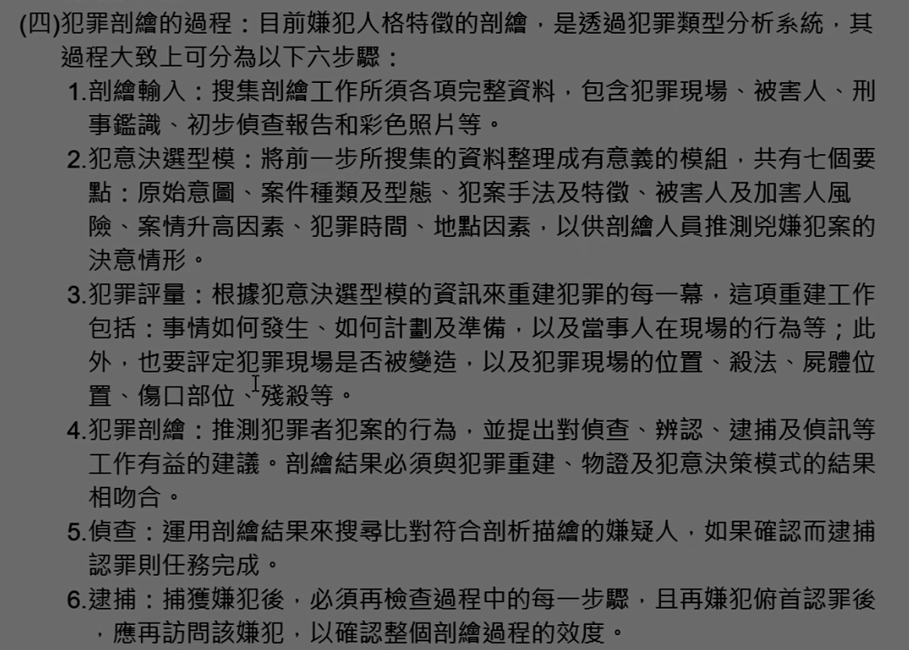

（五）、犯罪剖繪的展望：<++>

### 六、地緣剖繪：

環境犯罪學者認為犯罪是犯罪和周遭環境互動的產物，犯罪者搜尋被害標的通常會偏向於他所熟悉的地方。<++>

（一）距離遞減：<++> 
（二）圓圈假設：<++> 
（三）緩衝區：（颱風眼？）<++> 
1.通勸型：<++> 
2.劫掠型：<++> 
（四）犯行偏角：最大犯行偏角、續行偏角<++> 
（五）作案路程<++>
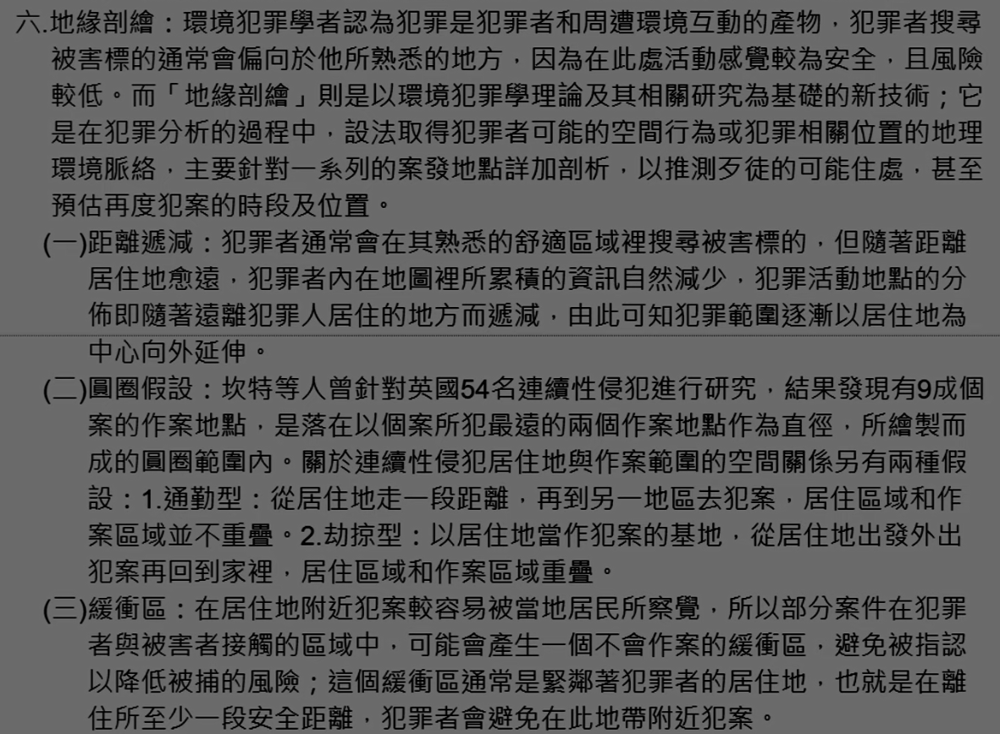

## 貳、再犯預測

（<b>只有第六點 犯罪預測於刑事政策之關係 有考過</b>）

### 一、意義：

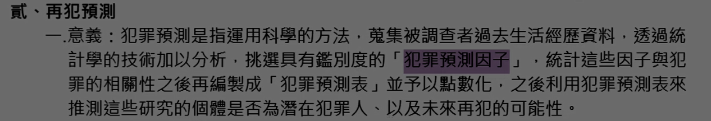

### 二、再犯預測種類（型態）

（一）以預測對象區分：
1.<++>
2.<++>
(1)<++>
(2)<++>
(3)<++>
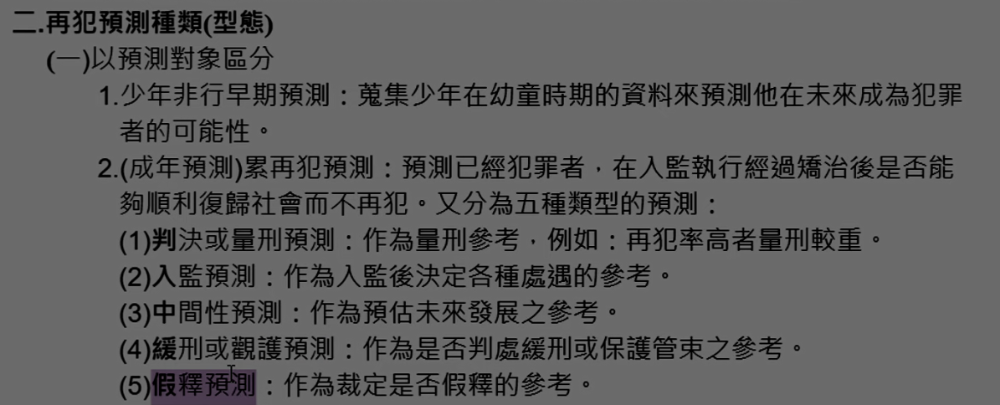

（二）以預測範圍不同來區分：
1.<++>
2.<++>
(1)<++>
(2)<++>
(3)<++>
(4)<++>
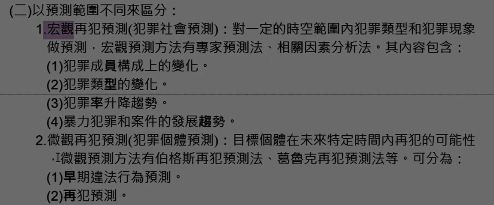

（三）以預測時間區分：
1.
2.
3.
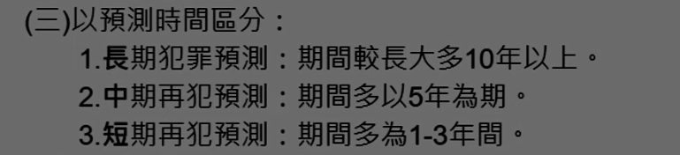

### 三、犯罪預測方法：（林山田等）

（一）直覺法：<++>
（二）臨床法：<++>
（三）統計法：<++>
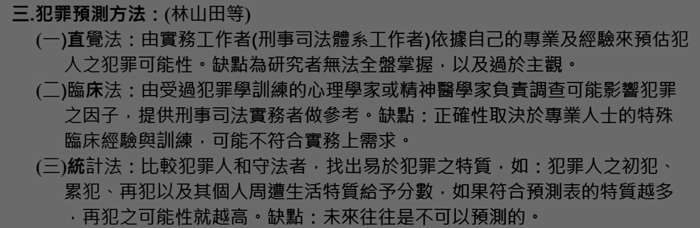

### 四、犯罪預測的程序：（馬傳鎮）

（一）形成理論或研究架構：<++> 
（二）決定研究變項：<++> 
（三）設計研究工具：<++> 
（四）決定抽樣技術與調查方法，並實施：<++> 
（五）犯罪預測因子之選擇及量化：<++> 
（六）建立犯罪預測表：<++> 
（七）從事效度檢定，並應用：<++> 
1.追蹤研究法：<++> 
2.回溯研究法：<++>
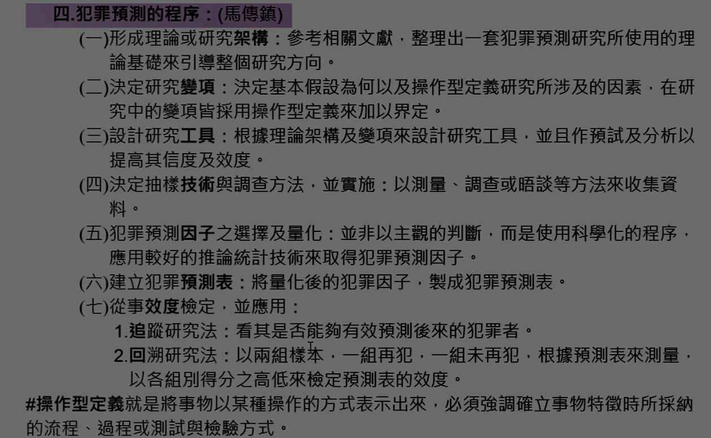

### 五、犯罪預測技術：（張甘妹、林山田）

（不重要）

（一）伯格斯的再犯預測法：是也界最早的再犯預測表，共有21個預測因子：<++>
（二）葛魯克的再犯預測法：對少年進行追蹤研究，<++>
（三）歐林的再犯預測法：較先進<++>
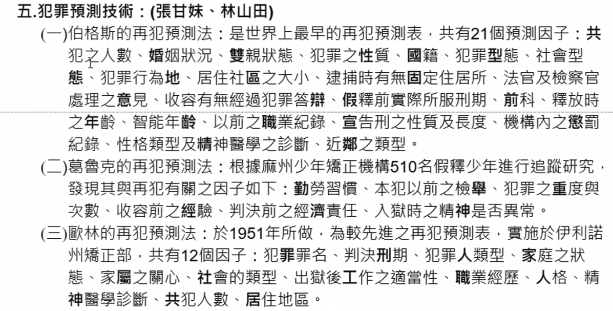

## 六、犯罪預測於刑事政策之關係（功用）★

（較重要）

（一）早期預測：<++>
（二）再預測之目的（功用）：（林山田）
1.
2.
3.
4.
5.
6.
7.
8.
9.
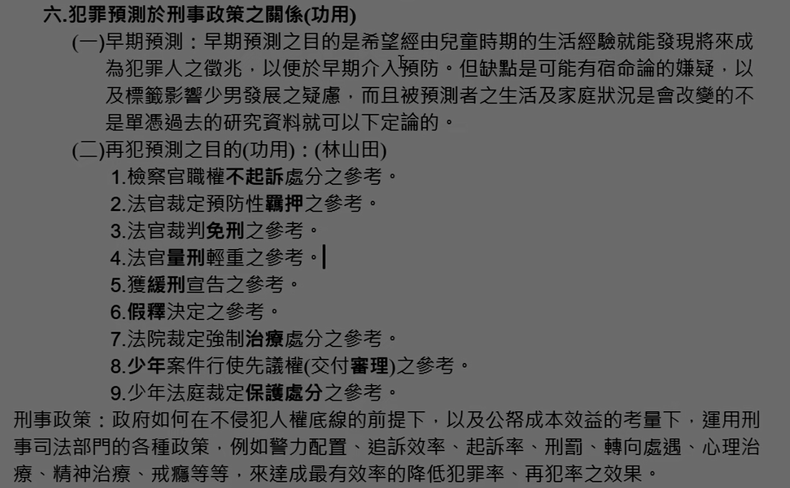

## 七、成年犯罪人影響再犯因素：（李明謹）

()
()
()
()
()
()
()
()
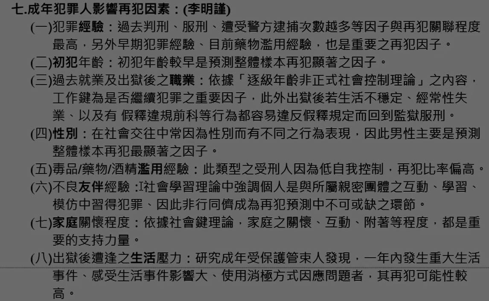

## 
## 
## 

