# 主題五：犯罪分析與預測（不常考，讀完理論再回來看這一章）

（犯罪分析偏警察，犯罪預測則是監獄官重要考點）

## 壹、犯罪分析

> 選擇題為主，不太會考

### 一、意義：**<++>** 

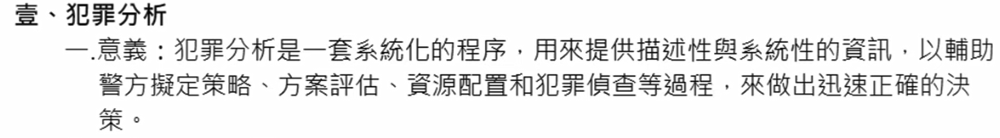

### 二、犯罪分析的作用： 

（一）**<++>** 
（二）**<++>** 
（三）**<++>** 
（四）**<++>** 
（五）**<++>**
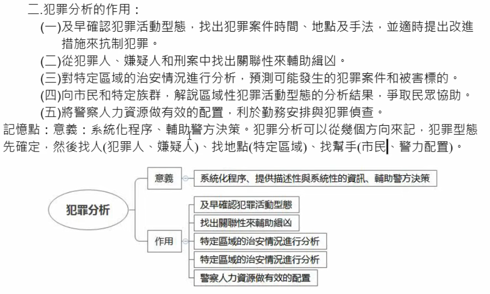

### 三、犯罪分析的程序： 

（一）收集資料：**<++>** 
（二）整理資料：**<++>** 
（三）犯罪分析：**<++>** 
（四）分送結果：**<++>** 
（五）檢討評估：**<++>**
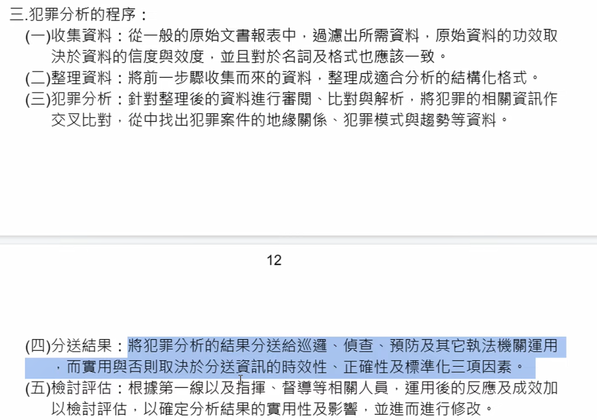

### 四、犯罪分析的方式： 

（一）犯罪趨勢分析：**<++>** 
（二）地區模式分析：**<++>** 
（三）近似犯罪模式分析：**<++>** 
（四）犯罪手法、犯罪模式、簽名特徵：**<++>**
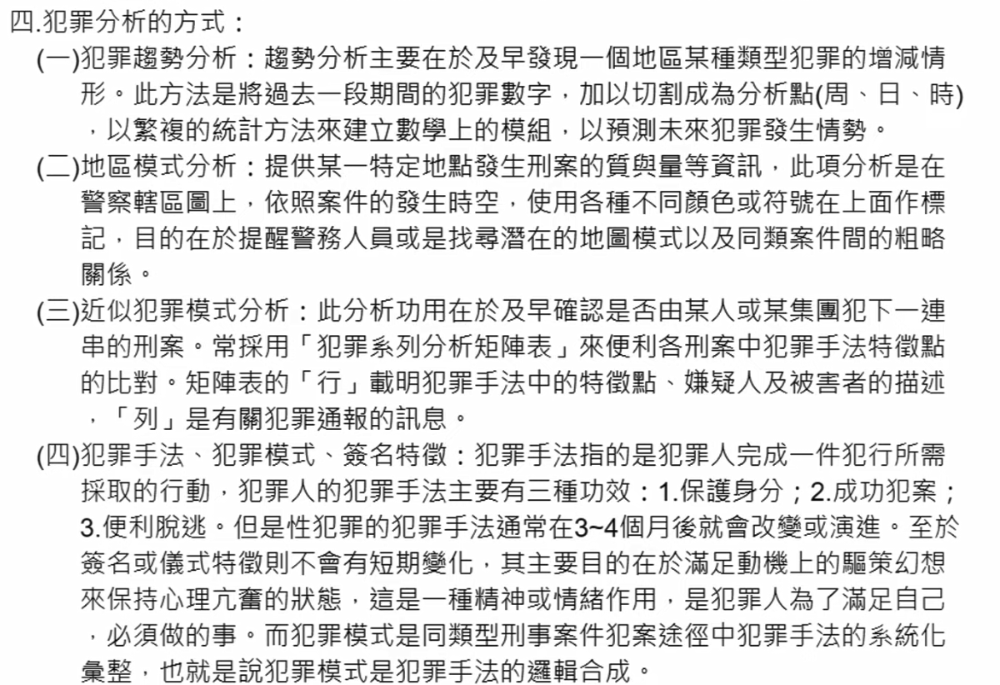

### 五、犯罪剖繪：

> 如果考申論的話，寫（一）、（二）、（四）點，第（五）作結論

（一）犯罪剖繪的<b>意義</b>：**<++>** 
1.評量兇嫌的社會背景和心理素質。 
2.評估兇嫌可能持有的物品。 
3.提供偵訊策略和審訊資料。 

（二）犯罪剖繪的<b>原理</b>：**<++>** 
1.兇嫌人格不變：**<++>** 
2.現場反映人格：**<++>** 
3.犯罪手法相似：**<++>** 
3.簽名特徵相同：**<++>** 

（三）犯罪現場與嫌犯人格：**<++>** 

> 下一點（四）記標題，後面自己寫

（四）犯罪剖繪的<b>過程</b>：**<++>** 
1.剖繪輸入：**<++>** 
2.犯意決選型模**<++>** 
3.犯罪評量**<++>** 
4.犯罪剖繪**<++>** 
5.偵查：**<++>** 
6.逮捕：**<++>**

（五）、犯罪剖繪的展望：**<++>**
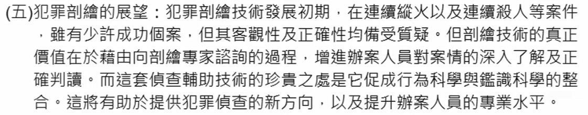

### 六、地緣剖繪：

環境犯罪學者認為犯罪是犯罪和周遭環境互動的產物，犯罪者搜尋被害標的通常會偏向於他所熟悉的地方。**<++>**

（一）距離遞減：**<++>** 
（二）圓圈假設：**<++>** 
（三）緩衝區：（颱風眼？）**<++>** 
1.通勸型：**<++>** 
2.劫掠型：**<++>** 
（四）犯行偏角：最大犯行偏角、續行偏角**<++>** 
（五）作案路程**<++>**

## 貳、再犯預測

（<b>只有第六點——犯罪預測於刑事政策之關係有考過</b>）

### 一、意義：

### 二、再犯預測種類（型態）

（一）以預測對象區分：
1.**<++>**
2.**<++>**
(1)**<++>**
(2)**<++>**
(3)**<++>**

（二）以預測範圍不同來區分：
1.**<++>**
2.**<++>**
(1)**<++>**
(2)**<++>**
(3)**<++>**
(4)**<++>**

（三）以預測時間區分：
1.
2.
3.

### 三、犯罪預測方法：（林山田等）

（一）直覺法：**<++>**
（二）臨床法：**<++>**
（三）統計法：**<++>**

### 四、犯罪預測的程序：（馬傳鎮）

（一）形成理論或研究架構：**<++>** 
（二）決定研究變項：**<++>** 
（三）設計研究工具：**<++>** 
（四）決定抽樣技術與調查方法，並實施：**<++>** 
（五）犯罪預測因子之選擇及量化：**<++>** 
（六）建立犯罪預測表：**<++>** 
（七）從事效度檢定，並應用：**<++>** 
1.追蹤研究法：**<++>** 
2.回溯研究法：**<++>**

### 五、犯罪預測技術：（張甘妹、林山田）

（不重要）

（一）伯格斯的再犯預測法：是也界最早的再犯預測表，共有21個預測因子：**<++>**
（二）葛魯克的再犯預測法：對少年進行追蹤研究，**<++>**
（三）歐林的再犯預測法：較先進**<++>**

### 六、犯罪預測於刑事政策之關係（功用）★

（較重要）

（一）早期預測：**<++>**
（二）再預測之目的（功用）：（林山田）
1.
2.
3.
4.
5.
6.
7.
8.
9.

### 七、成年犯罪人影響再犯因素：（李明謹）

()
()
()
()
()
()
()
()

### 八、再犯預測之優缺點：

（一）再犯預測之優點： 
1.預測標準<u>客觀且科學</u>：自己掰**<++>** 
2.預測<u>迅速且經濟</u>：自己掰**<++>** 
3.使用<u>簡單而方便</u>：自己掰**<++>** 
4.可<u>具體</u>獲知犯罪危險性程度：自己掰**<++>** 

（二）再犯預測之缺點： 
1.有失<u>偏頗</u>：自己掰**<++>** 
2.<u>犯罪黑數</u>：自己掰**<++>** 
3.造成<u>標籤效應</u>。
4.<u>因子未必客觀</u>：自己掰**<++>** 
5.<u>宿命</u>論：自己掰**<++>** 
6.<u>技術不足</u>：自己掰**<++>** 
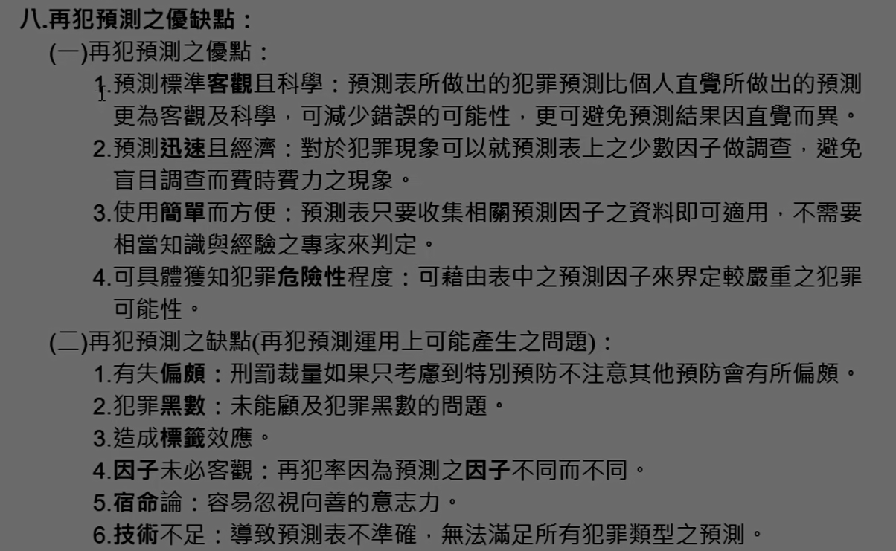

### 九、再犯預測之實證研究：（張聖照）

（一）彼得森 Peterson et al.(1981): 在加州矯治中心以重刑犯為樣本、低自我控制**<++>**
（二）林德奎斯特 Lindquist et al.(1985): 社會鍵**<++>**
（三）奔達 Benda et al.(2001): 1.犯罪史 2.靜態因子 3. 動態因子**<++>**
（四）李和麥肯奇 Li & MacKenzie(2003): 成人社會鍵、對男女受刑人之影響力**<++>**
（五）國內學者陳玉書、簡惠霠（2000）：**<++>**
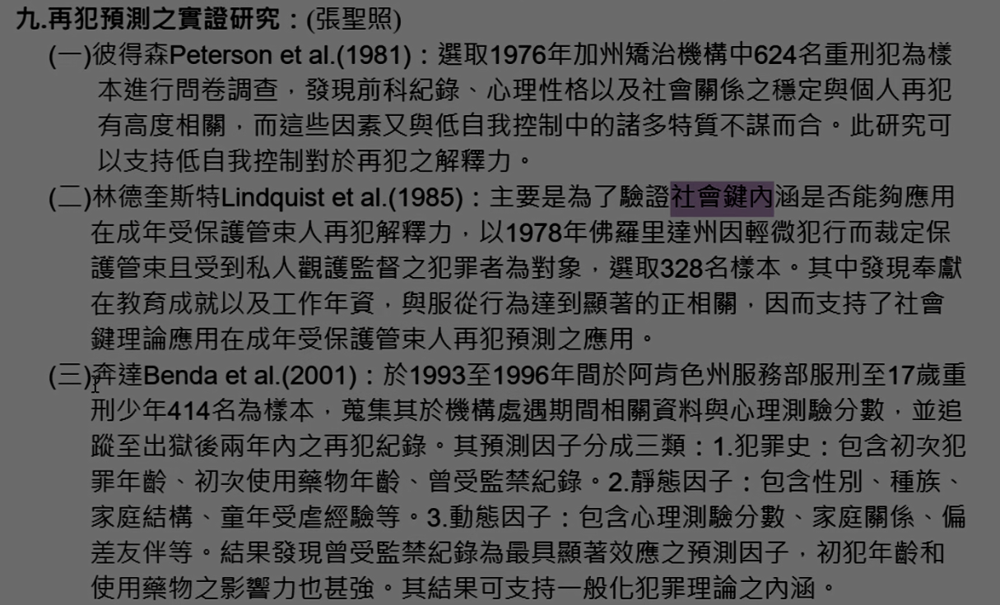
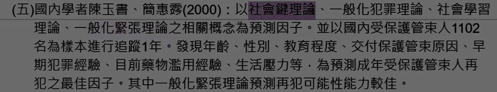

### 十、再犯預測國內發展方向：（張聖照）

（一）新刑罰之趨勢： 
1.新課題：危險性的預測**<++>** 
2.新目標：控制犯罪**<++>** 
3.新技術：電子監控**<++>** 
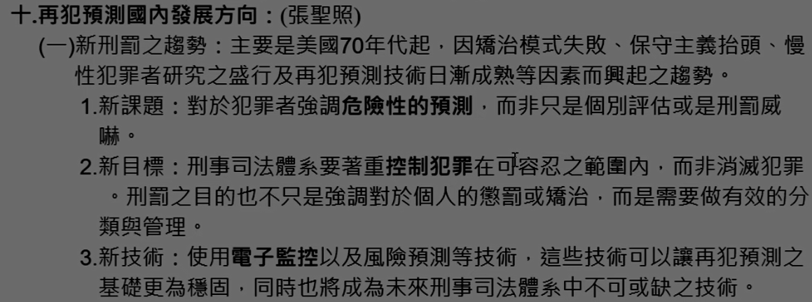

（二）正面以及負面效應： 
1.
(1)
(2)
(3)
(4)
2.
(1)
(2)
(3)
(4)
3.
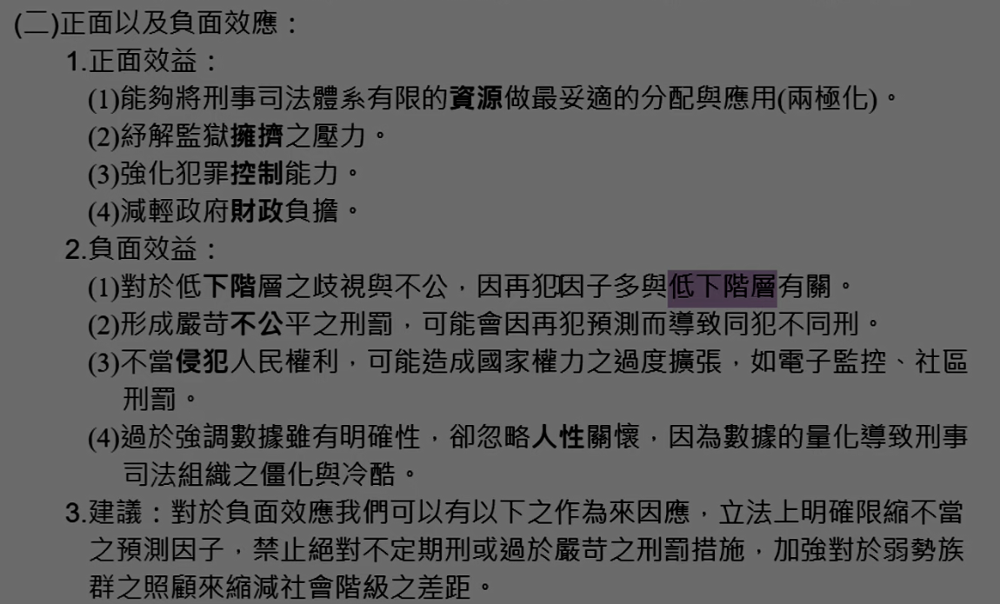

### 十一、使用犯罪學理論來評估再犯預測：

（一）社會鍵理論：**<++>** 
（二）差別接觸理論：**<++>** 
（三）一般化緊張論：**<++>** 
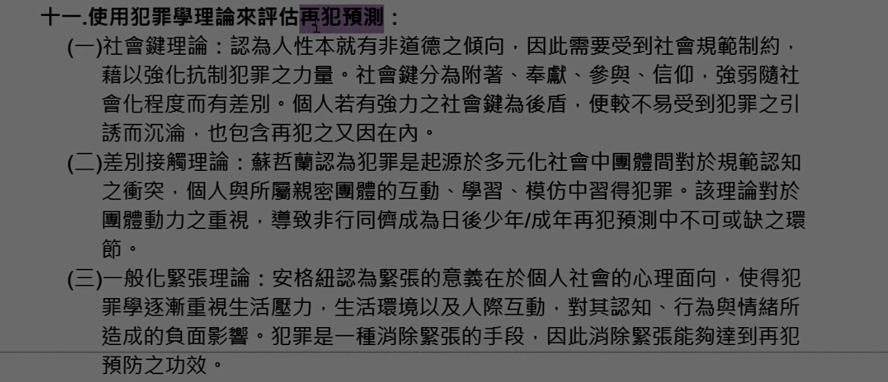
