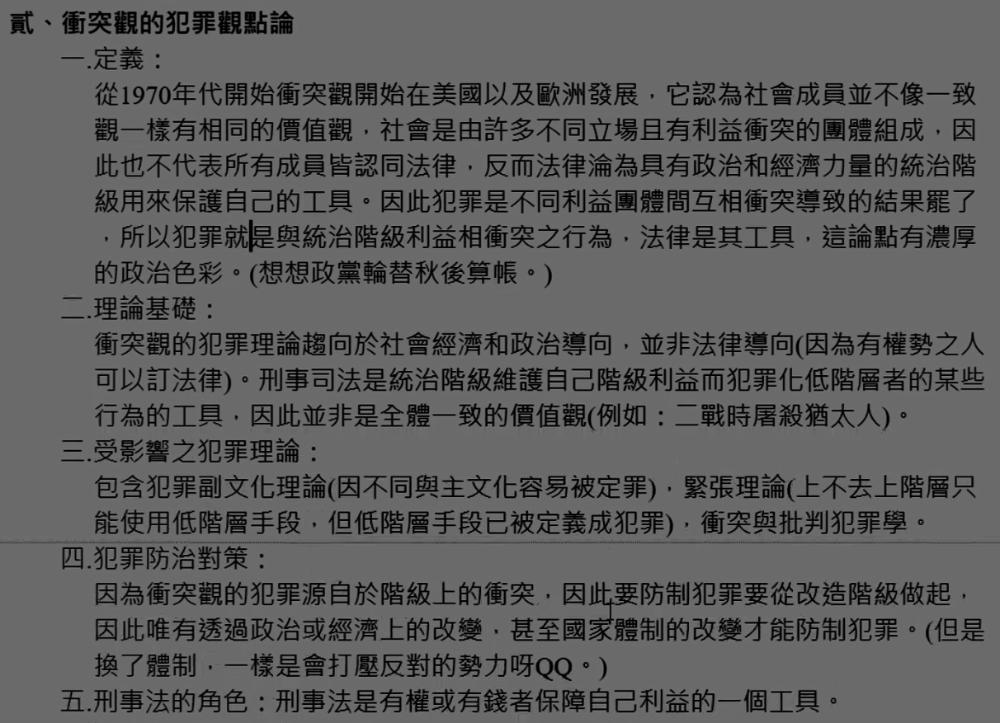

# 主題六：犯罪學之基本觀點★

> 這邊一定要熟，選擇題這邊幾乎一定會考，申論題不常考，但有考過。

犯罪學者依照自己對於犯罪的定義而有不同的觀點，這些觀點會影響其研究犯罪的方向，目前大致上分為下列三種犯罪論點論：

## 壹、一致觀的犯罪觀點論

一、定義：這個<b>一致觀的意思指的是社會大眾擁有相同一致的觀念</b>，在這些相同觀念下所認同的犯罪，就經<b>由立法律來規範</b>。而一致觀比較<b>偏重於法律觀點</b>，認為犯罪是違反刑事法，而且不見容於社會的行為。簡單的說就是多數人認為是犯罪，它就是犯罪。

二、理論基礎：一致觀的理論基礎是來自於<b>社會學中的功能學派</b>，社會是由不同的群體組合而成的，每一部分的改變都會對社會有重大的影響（例如：最近很夯的同婚議）。在完整正常的社會中，成員對於各種規範、價值、目標、習俗都會有一套一致的見解，這會成為我們習以為常遵守的圭臬，<u>而刑事法則從中將規範以及價值觀以法律的形式表現出來</u>。

三、受影響之犯罪理論：除了<b>犯罪副文化、標籤理論以及犯罪衝突理論</b>外，<u>大部分的犯罪理論都持一致觀的觀點來看犯罪</u>。

四、犯罪防治對策：主張<b>從家庭、學校、社區等非正社會控制的單位來預防犯罪</b>，因為犯罪是因為共同的觀念所導致的，所以在這些我們從小就成長的環境中就應該養成良好的觀念。至於<u>已經犯罪的人或是累犯</u>，就表示他觀和社會大眾的觀念不同，則<u>應該使用嚴厲的社會控制機制（刑事司法）來嚇阻犯罪</u>。

五、刑事法的角色：刑事法反映了社會共同的價值觀或規範，人人都應該守，<b>違反刑事法就是犯罪行為</b>。

## 貳、衝突觀的犯罪觀點論

一、定義：**<++>**法律淪為具有政治和經濟力量和統治階級用來保護自己和工具。**<++>**

二、理論基礎：

三、受影響之犯罪理論：

四、犯罪防治對策：

五、刑事法的角色：

## 参、互動觀的犯罪觀點論

一、定義：

二、理論基礎：

三、受影響之犯罪理論：

四、犯罪防治對策：

五、刑事法的角色：

