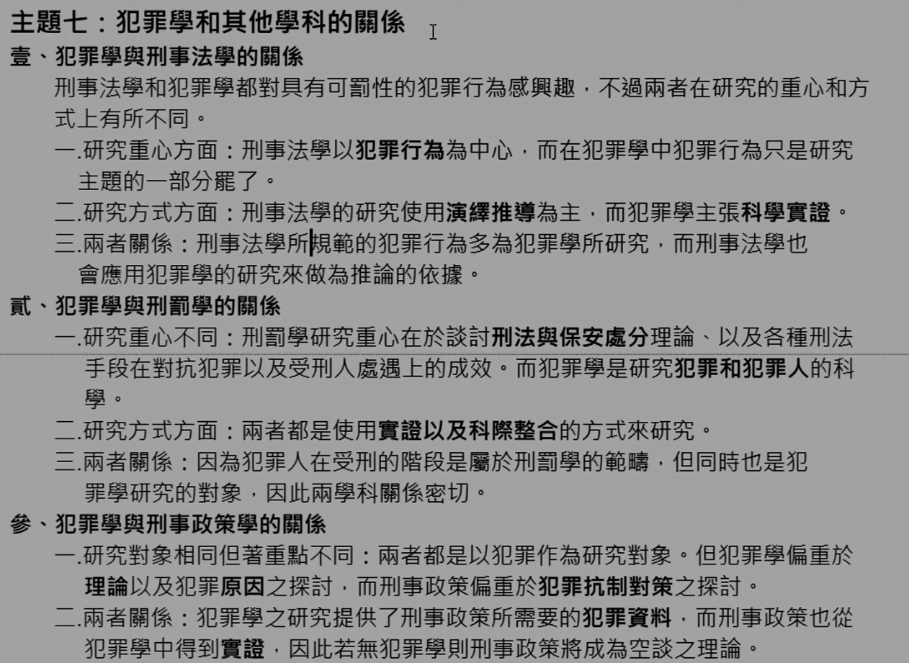

# 主題七：犯罪學和其他學科的關係

<!-- v12 -->

> 不是很重要，頂多選擇題會考

## 壹、犯罪學與刑事法學和關係

（把什麼行為定為犯罪）

刑事法學和犯罪學都對具有可罰性的犯罪行為感興趣，不過兩者在研究的重心和方式上有所不同。

一、研究重心方面：刑事法學以犯罪行為為中心，而在犯罪學中犯罪行為只是研究主題的一部分罷了。  
二、研究方式方面：刑事法學的研究使用演繹推導為主，而犯罪學主張科學實證。  
三、兩者關係：刑事法學所規範的犯罪行為多為犯罪學所研究，而刑事法學也會應用犯罪學的研究來做為推論的依據。

## 貳、犯罪學與刑罰學和關係

一、研究重心不同：刑罰學研究重心在於談討刑法與保安處分理論、以及各種刑法手段在對抗犯罪以及受刑人處遇上的成效。而犯罪學是研究犯罪和犯罪人的科  
二、研究方式方面：兩者都是使用實證以及科際整合的方式來研究。  
三、兩者關係：因為犯罪人在受刑的階段是屬於刑罰學的範疇，但同時也是犯罪學研究的對象，因此兩學科關係密切。

## 参、犯罪學與刑事政策學和關係

一、研究對相同但著重點不同：兩者都是以犯罪作為研究對象。但犯罪學偏重於理論以及犯罪原因之探討，而刑事政策偏重於犯罪抗制對策之探討。（如何降低犯罪）。  
二、兩者關係:犯罪學之研究提供了刑事政策所需要的犯罪資料，而刑事政策也從犯罪學中得到實證，因此若無犯罪學則刑事政策將成為空談之理論。

