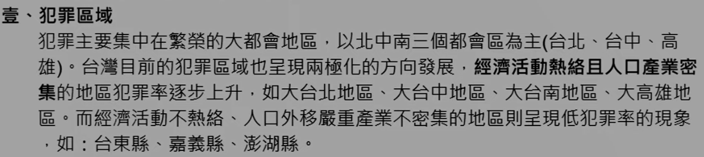
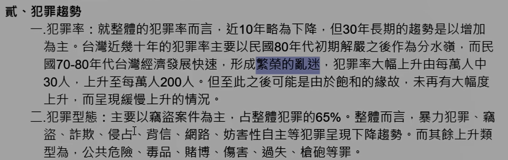
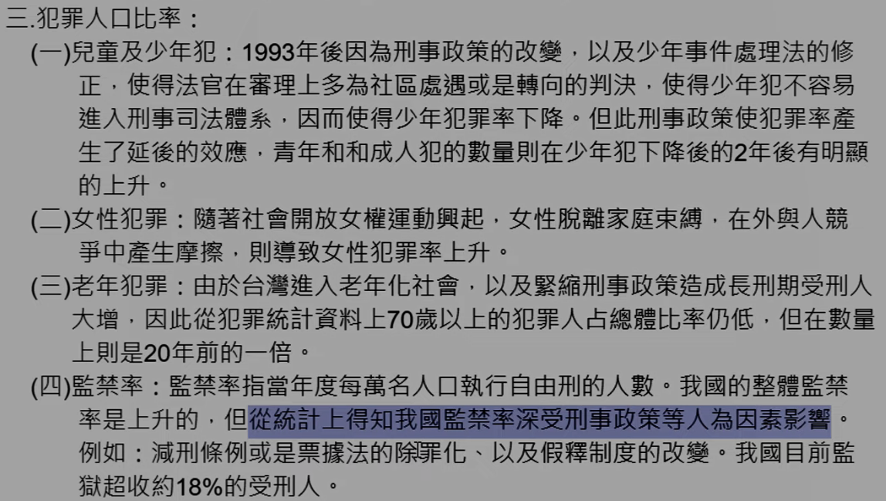
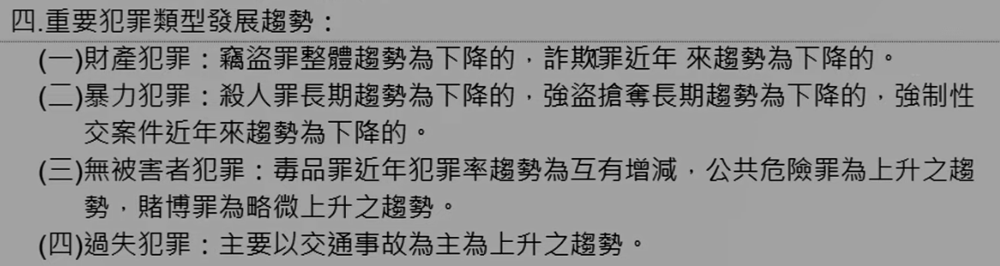

# 主題八：近年台灣地區犯罪發展趨勢

> 不是很重要，可能選擇題會考

## 壹、犯罪區域

## 貳、犯罪趨勢

> 每本書內容都略有不同，所以可能不太會考

一、犯罪率：

二、犯罪型態： 

三、犯罪人口比率： 
（一）兒童及少年犯： 
（二）女性犯罪： 
（三）老年犯罪： 
（四）監禁率： 

四、重要犯罪類型發展趨勢： 
（一）財產犯罪： 
（二）暴力犯罪： 
（三）無被害者犯罪： 
（四）過失犯罪：

