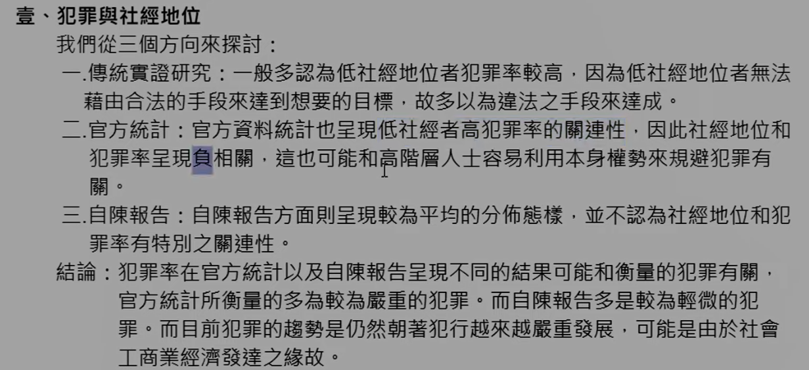
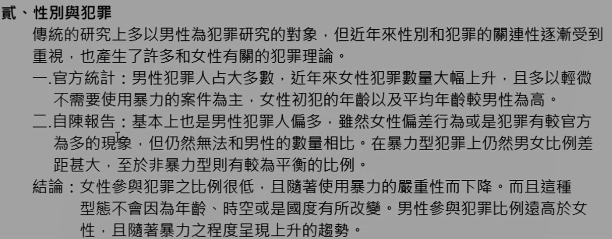
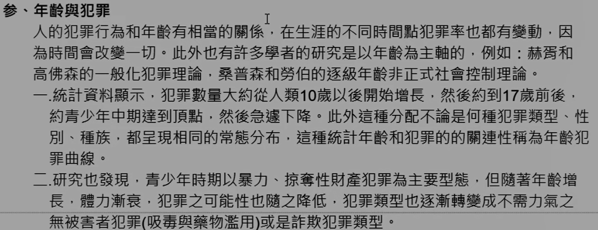
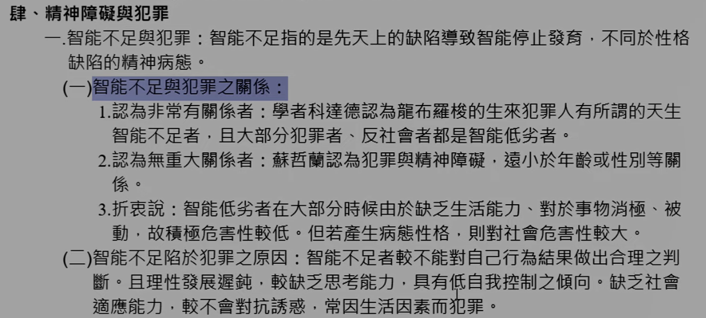
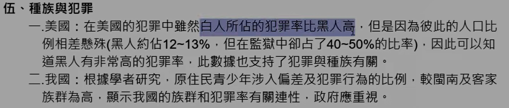

# 主題九：導致犯罪的個人因素

> 有概念會選就好，考申論機率極低

## 壹、犯罪與社經地位

一、傳統實證研究：低社經地位者犯罪率較高**<++>**

二、官方統計：低社經地位者犯罪率較高**<++>**

三、自陳報告：（如之前所說，通常只能探求到比較輕微的犯罪）**<++>**

結論：**<++>**

## 貳、性別與犯罪

一、傳統實證研究：**<++>**

二、官方統計：**<++>**

三、自陳報告：**<++>**

結論：**<++>**

## 参、年齡與犯罪

**<++>**

一、<b>17 歲前後，約青少年中期達到頂點，然後急遽下降</b>（兵役）
二、研究**<++>**

## 肆、精神障礙與犯罪

> 很多理論都是正、反、中論述

一、智能不足與犯罪：**<++>**
（一）智能不足與犯罪之關係：
1. 認為非常有關係：**<++>**
2. 認為無重大關係：**<++>**
3. 折衷說：**<++>**
（二）智能不足限於犯罪之原因：**<++>**

二、酒精中毒與犯罪：**<++>**
（一）病態急性中毒：**<++>**
（二）慢性中毒：**<++>**
（三）普通急性中毒：**<++>**

## 伍、種族與犯罪

一、美國：**<++>**

二、我國：**<++>**

