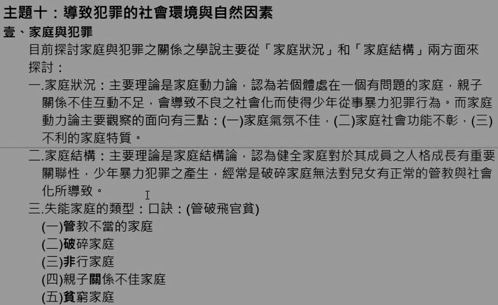
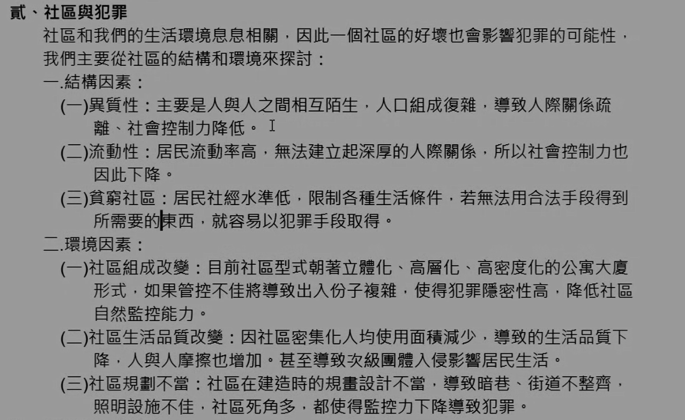
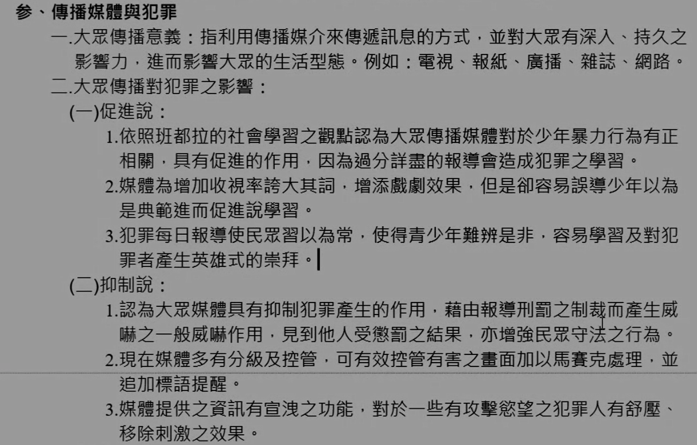
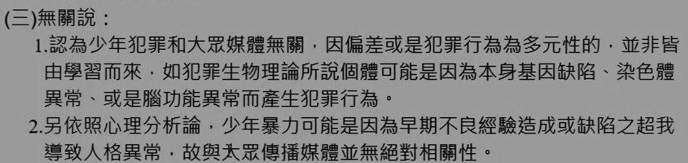
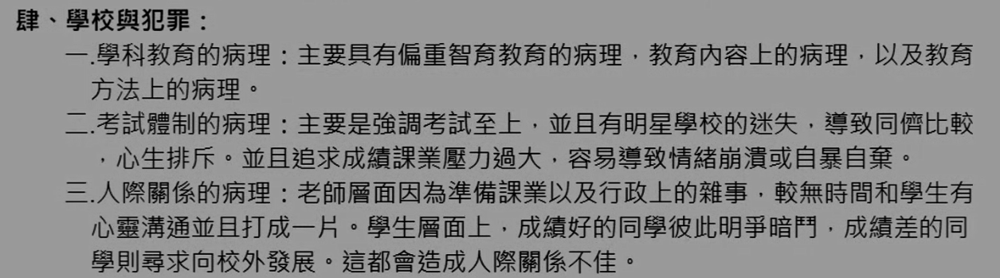
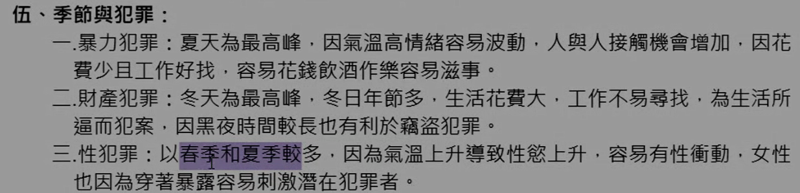
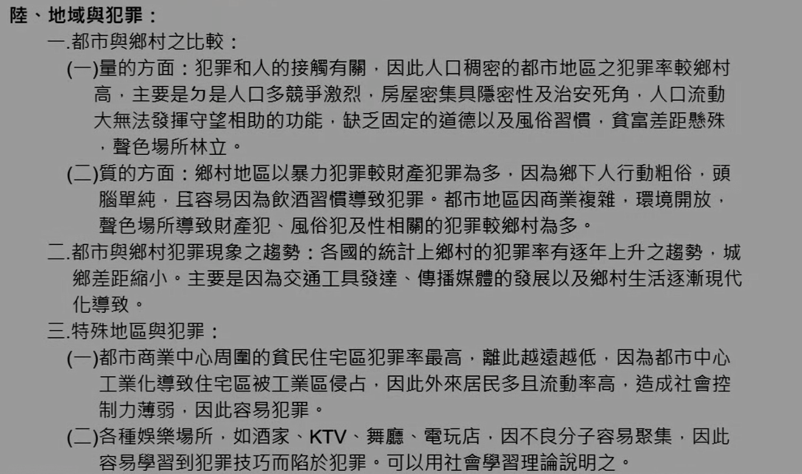

# 主題十：導致犯罪的社會環境與自然因素

> 以前有考過申論，但目前應該只會考選擇

## 壹、家庭與犯罪

目前探討家庭與犯罪之關係之學說主要從「家庭狀況」和「家庭結構」兩方面來探討：

### 一、家庭狀況：

主要理論是家庭動力論，認為若個體處在一個有問題的家庭，親子關係不佳互動不足，會導致不良之社會化而使得少年從事暴力犯罪行為。而家庭動力論主要觀察的面向有三點： 
（一）家庭氣氛不佳，  
（二）家庭社會功能不彰，  
（三）不利的家庭特質。

### 二、家庭結構：

主要理論是家庭結構論，認為健全家庭對於其成員之人格成長有重要關聯性，少年暴力犯罪之產生，經常是破碎家庭無法對兒女有正常的管教與社會化所導致。

### 三、失能家庭的類型：（管破飛官貧）

（一）管教不當的家庭  
（二）破碎家庭  
（三）非行家庭  
（四）親子關係不佳家庭  
（五）貧窮家庭

## 貳、社區與犯罪

社區和我們的生活環境息息相關，因此一個社區的好壞也會影響犯罪的可能性，我們主要從社區的結構和環境來探討：

### 一、結構因素：

（一）異質性：主要是人與人之間相互陌生，人口組成復雜，導致人際關係疏離、社會控制力降低。  
（二）流動性：居民流動率高，無法建立起深厚的人際關係，所以社會控制力也因此下降。  
（三）貧窮社區：居民社經水準低，限制各種生活條件，若無法用合法手段得到所需要的東西，就容易以犯罪手段取得。

### 二、環境因素：

（一）社區組成改變：目前社區型式朝著立體化、高層、高密度化的公寓大廈形式，如果管控不佳將導致出入份子複雜，使得犯罪隱密性高，降低社區自然監控能力。  
（二）社區生活品質改變：因社區密集化人均使用面積減少，導致的生活品質下降，人與人摩擦也增加。甚至導致次級團體入侵影響居民生活。  
（三）社區規劃不當：社區在建造時的規畫設計不當，導致暗巷、街道不整齊，照明設施不佳，社區死角多，都使得監控力下降導致犯罪。

## 参、傳播媒體與犯罪

### 一、大眾傳播意義：

指利用傳播媒介來傳遞訊息的方式，並對大眾有深入、持久之影響力，進而影響大眾的生活型態。例如：電視、報紙、廣播、雜誌、網路。

### 二、大眾傳播對犯罪之影響：

#### （一）促進說：

1\. 依照班都拉的社會學習之觀點認為大眾傳播媒體對於少年暴力行為有正相關，具有促進作用，因為過分詳盡的報導會造成犯罪之學習。  
2\. 媒體為增加收視率誇大其詞，增添戲劇效果，但是卻容易誤導少年以為是典範進而促進說學習。  
3\. 犯罪每日報導使民眾習以為常，使得青少年難辨是非，容易學習及對犯罪者產生英雄式的崇拜。

#### （二）抑制說：

1\. 認為大眾媒體具有抑制犯罪產生的作用，藉由報導刑罰之制裁而產生威「嚇之一般嚇作用，見到他人受懲罰之結果，亦增強民眾守法之行為。
2\. 現在媒體多有分級及控管，可有效控管有害之畫面加以馬賽克處理，並追加標語提醒。
3\. 媒體提供之資訊有宣洩之功能，對於一些有攻擊慾望之犯罪人有舒壓、「移除刺激之效果。

#### （三）無關說：

1\. 認為少年犯罪和大眾媒體無關，因偏差或是犯罪行為為多元性的，並非皆由學習而來，如犯罪生物理論所說個體可能是因為本身基因缺陷、染色體異常、或是腦功能異常而產生犯罪行為。  
2\. 另依照心理分析論，少年暴力可能是因為早期不良經驗造成或缺陷之超我導致人格異常，故與大眾傳播媒體並無絕對相關性。

## 肆、學校與犯罪

一、學科教育的病理：主要具有偏重智育教育的病理，教育內容上的病理，以及教育方法上的病理。

二、考試體制的病理：主要是強調考試至上，並且有明星學校的迷失，導致同儕比較，心生排斥。並且追求成績課業壓力過大，容易導致情緒崩潰或自暴自棄。

三、人際關係的病理：老師層面因為準備課業以及行政上的雜事，較無時間和學生有心靈溝通並且打成一片。學生層面上，成績好的同學彼此明爭暗鬥，成績差的同學則尋求向校外發展。這都會造成人際關係不佳。

## 伍、季節與犯罪

一、暴力犯罪：夏天為最高峰，因氣溫高情緒容易波動，人與人接觸機會增加，因花費少且工作好找，容易花錢飲酒作樂容易滋事。

二、財產犯罪：冬天為最高峰，冬日年節多，生活花費大，工作不易尋找，為生活所逼而犯案，因黑夜時間較長也有利於竊盜犯罪。

三、性犯罪：以春季和夏季較多，因為氣溫上升導致性慾上升，容易有性衝動，女性也因為穿著暴露容易刺激潛在犯罪者。

## 陸、地域與犯罪

### 一、都市與鄉村之比較：

（一）量的方面：犯罪和人的接觸有關，因此人口稠密的都市地區之犯罪率較鄉村高，主要是力是人口多競爭激烈，房屋密集具隱密性及治安死角，人口流動大無法發揮守望相助的功能，缺乏固定的道德以及風俗習慣，貧富差距懸殊，聲色場所林立。

（二）質的方面：鄉村地區以暴力犯罪較財產犯罪為多，因為鄉下人行動粗俗，頭腦單純，且容易因為飲酒習慣導致犯罪。都市地區因商業複雜，環境開放，聲色場所導致財產犯、風俗犯及性相關的犯罪較鄉村為多。

### 二、都市與鄉村犯罪現象之趨勢：

各國的統計上鄉村的犯罪率有逐年上升之趨勢，城鄉差距縮小，主要是因為交通工具發達、傳播媒體的發展以及鄉村生活逐漸現代化導致。

### 三、特殊地區與犯罪：

（一）都市商業中心周圍的貧民住宅區犯罪率最高，離此越遠越低，因為都市中心工業化導致住宅區被工業區侵占，因此外來居民多且流動率高，造成社會控制力薄弱，因此容易犯罪。

（二）各種娛樂場所，如酒家、KTV、舞廳、電玩店，因不良分子容易聚集，因此容易學習到犯罪技巧而陷於犯罪。可以用社會學習理論說明之。

