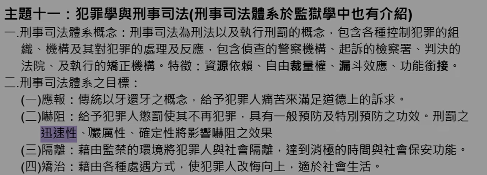
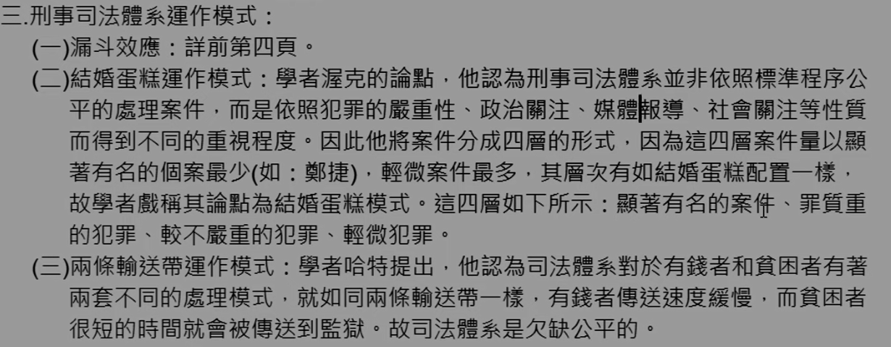

# 主題十一：犯罪學與刑事司法

> 刑事司法體系於監獄學中也有介紹

### 一、刑事司法體系概念：

刑事司法為刑法以及執行刑罰的概念，包含各種控制犯罪的組織、機構及其對犯罪的處理及反應，包含偵查的警察機構、起訴的檢察署、判決的法院、及執行的矯正機構。特徵：資源依賴、自由裁量權、漏斗效應、功能銜接。

### 二、刑事司法體系之目標：

（一）應報：傳統以牙還牙之概念，給予犯罪人痛苦來滿足道德上的訴求。  
（二）嚇阻：給予犯罪人懲罰使其不再犯罪，具有一般預防及特別預防之功效。刑罰之迅速性、魔属性、確定性將影響嚇阻之效果  
（三）隔離：藉由監禁的環境將犯罪人與社會隔離，達到消極的時間與社會保安功能。  
（四）矯治：藉由各種處遇方式，使犯罪人改悔向上，適於社會生活。

### 三、刑事司法體系運作模式：

（一）漏斗效應：詳前第四頁。

（二）結婚蛋糕運作模式：學者渥克的論點，他認為刑事司法體系並非依照標準程序公平的處理案件，而是依照犯罪的嚴重性、政治關注、媒體嚴導、社會關注等性質而得到不同的重視程度。因此他將案件分成四層的形式，因為這四層案件量以顯著有名的個案最少（如：鄭捷），輕微案件最多，其層次有如結婚蛋糕配置一樣，故學者戲稱其論點為結婚蛋糕模式。這四層如下所示：顯著有名的案件、罪質重的犯罪、較不嚴重的犯罪、輕微犯罪。

（三）兩條輸送帶運作模式：學者哈特提出，他認為司法體系對於有錢者和貧困者有著兩套不同的處理模式，就如同兩條輸送帶一樣，有錢者傳送速度緩慢，而貧者很短的時間就會被傳送到監獄。故司法體系是欠缺公平的。

