# 第二章 犯罪學理論

---

# 主題一：犯罪理論的歷史發展

16 - 23

## 壹、18 世紀之前的犯罪學思想

在 **18 世紀** 犯罪學派理論出現之前，對於犯罪原因的討論，常見的有三種說法：

一、<b>神學說</b>：以宗教信仰之思想來箝制人民，主張<b>犯罪是一種原罪</b>，依照聖經唯有向上帝懺悔，接受上帝的原諒才能夠重生。

二、<b>魔鬼說</b>：源自於歐洲中古世紀主張犯罪就視被惡魔或是魔鬼附身，認為如果不是被<b>惡靈附身</b>怎麼可能會做出如此違反社會規範的行為，也成為宗教人士剷除異己的手段。

三、<b>世俗說</b>：中古世紀後人們開始意識到對人本身的觀察，開始從生理、心裡、社會的角度來看待犯罪，只是這時的時空背景只是推論，還未開始用實證的手段來研究。

## 貳、犯罪古典學派★

<b>注重刑罰</b>，犯罪是<b>理性選擇</b>的結果。矯治不重要。<b>重視刑罰</b>嚇阻，不划算就不會犯罪。 **[]**

### 一、歷史背景：

i. <b>18 世紀</b>開始受到<b>啟蒙運動</b>的影響，新興的中產階級崛起，推翻君權神授的體制，貴族的勢力漸漸消退。而為了把持權力，<u>貴族掌握司法來打壓中下階層</u>，因此常常有<u>罪刑擅斷</u>，隨意懲罰的情況。而且<u>刑罰暴虐無道，只憑個人喜好沒有標準</u>。 
ii. 因此古典學派學者開始強調「<b>罪刑法定</b>」、「<b>罪刑均衡</b>」等方式。認為<u>刑罰不應該因為身分階級的不同而有不同的判決</u>。（法律之前人人平等） 
iii. 要明白古典學派之學者本意不在於犯罪行為的研究，主要在謀求刑法的改革， 
iiii. 此時代表性的學者有<b>貝加利亞</b>和<b>邊沁</b>。

### 二、對人性的四種基礎假設：

> 速記ar： 
> 對人性的四種基礎假設：自由、理性、趨避、追求

認為人的本性是自私且邪惡的，犯罪是人性本能的表現，若無懲罰之恐懼來制衡，任何人都有犯罪的可能性。

(一)自由意志：主張任何人都有同樣的意志，都能根據自己的意志做出決定，人們可能選擇犯罪也可能選擇守法。犯罪行為既然是<b>個人選擇的結果</b>，那麼就應該對這個決定負責而受到懲罰。 
(二)理性思考：人的理性思考中是具有<b>功利主義</b>或是<b>享樂主義</b>的傾向決定的。
(三：趨樂避苦：如果犯罪得到的利益大於守法,則人人都會從事犯罪行為。 
(四)追求自我利益：人類行為的目標就是要極大化個人快樂和極小化個人痛苦。

### 三、對於犯罪原因的看法（為何人會犯罪）：

> 速記ar： 
> 對於犯罪原因的看法（為何人會犯罪）：自由、報酬、社會限制、刑罰預防最有效、三要素

（一）有<b>自由意志</b>可以選擇手法或犯罪，來滿足需求。 

（二）採取犯罪方式來滿足需求是因為可以獲得<b>較大的報酬</b>。 

（三）選擇犯罪時可能會因為社會反應或受到懲罰而受限制。 

（四）社會反應及懲罰越<b>嚴厲、迅速及確定</b>，就更能控制犯罪。 

（五）最有效的犯罪預防方式就是使用<b>足夠的刑罰</b>，使犯罪人覺得不值得犯罪。 

（六）嚇阻犯罪的<b>三要素</b>： 
1\. 刑罰之<b>迅速性</b>：是指犯罪與刑罰之回應時間應該縮短，犯罪人應該迅速受到懲罰，如此可以給予人民感受司法的公平性和效率性。 
2\. 刑罰之<b>確定性</b>：是指犯罪遭受逮捕與定罪懲罰之肯定機率，也就是所謂的定罪率，定罪率高對於罪犯才有嚇阻效果。 
3\. 刑罰之<b>嚴属性</b>：是指對於犯罪人，應該依照犯罪嚴重性，給予足夠的刑罰，使犯罪者認為犯罪是一項不划算的 

### 四、理論的內容（基礎）：

> 如果申論考 ”何謂古典學派？“ 就寫這個加上 《一、歷史背景》，代表人物就 貝加利亞、邊沁，再加上優缺點
>
> 我：
> 對人性的四種基礎假設 + 刑罰目的、刑罰功能、刑罰主張、刑罰原則

（一）自由意志：人有辨別是非之能力及自由意志，能夠決定是否<b>為善或為惡</b>。  

（二）人性假設：人追求享樂以及追求<b>功利主義</b>，追求最大的快樂的最少的痛苦。  

（三）刑罰目的：刑罰能夠給予犯罪人<b>痛苦</b>，抵消他犯罪所帶來的快樂。 

（四）刑罰功能：刑罰是用來<b>預防</b>犯罪而非報復犯罪人，最好的預防基礎來自於<b>教育與法治</b>觀念。 

（五）刑罰主張： 
i. <b>反對死刑</b>、流放刑、身體刑等不人道之刑罰， 
ii. 普遍實施自由刑 
iii. 並改善監獄制度與環境。（時代背景，避免淪為統治者的手段，反對者都被弄死了） 

（六）刑罰原則： 
i. 犯罪應透過國家立機制訂定且每一種犯罪都有固定之刑罰，即<b>罪刑法定</b>與<b>罪刑均衡</b>之概念。 
ii. 並且使用刑罰上不因各種條件而有所不同，即<b>法律之前人人平等之概念</b>。 

### 五 刑罰之重點：

> 記個五點差不多

國家刑罰權之來源是基於<b>社會契約說</b>，即是一群人為共同之利益，放棄一部分自由交由國家管理，由國家來懲罰犯罪人給予人民保障。

（一）從<b>法律觀點</b>探討犯罪利益。 
（二）定期刑：每一種犯罪皆有<b>固定刑罰</b>。（時代背景，避免淪為統治者的手段） 
（三）運用<b>刑罰才能威嚇</b>犯罪人。 
（四）刑法應採取<b>嚴格解釋</b>。 
（五）採取<b>罪刑均衡原則</b>，刑罰與犯罪輕重應成正比，才能彰顯正義。 
（六）法律之前人人平等 
（七）<b>廢除死刑</b>，死刑是一種暴虐、殘忍、無人道的刑罰措施。 
（八）人類本性追求自我滿足，若因此犯罪應為其行為付出代價。 

### 六、代表人物及其主張：

> 早期申論有考過，但目前應該只會考選擇
>
> 古典學派的學者，其實都不是犯罪學者

#### （一）貝加利亞：

被認為是<b>刑法學之父</b>（龍布羅梭是<u>犯罪學之父</u>），主張自由意志，利用啟蒙運動時期的社會契約論來建構他的學說，在1764年出版了「犯罪與處罰」一書。 

1\. 理論內涵： 
(1) <b>刑罰的起源</b>：<b>社會契約論</b>人們為了彼此利益而結合在共存的社會中，而願意犧牲掉自己一部分的自由接受共同的制度規範，受到大家同意的管理者管理。 
(2) 刑罰權：刑罰權是為了公共利益的需要產生的屬於<b>國家管理</b>，而國家只能在維護公共利益所必需的範圍內使用刑罰，因此若將刑罰當作個人私刑的利器，隨意的使用，這就是專制的表現，並非正義。

2\. 法律的特徵：懲罰的目的不是只是將痛苦帶給犯罪者，其目的是要讓犯罪者避免重覆他的犯罪行為，並且對其他犯罪者有嚇阻警惕作用。 
(1) <b>罪刑法定</b>：只有法律有規定的才是犯罪，才可以使用刑罰，為了防止法官的擅斷，因此主張罪刑法定化。 
(2) <b>罪刑明確</b>：法律必須通俗明確讓大眾都能明白，以避免當權者利用含糊不清的解釋手法來控制刑罰，因此懲罰的確定性比嚴属性有更好的嚇阻作用。 
(3) <b>罪刑均衡</b>：犯罪和刑罰之間要相稱，刑罰要以客觀上的惡害輕重做為依據所訂定，而在犯罪對社會的危害超過一定比例時給予更嚴厲的處罰。這個罪刑均衡是讓刑罰超過犯罪一定比例的罪刑均衡，也就是讓犯罪者感到犯罪是不划算的，如此才有一般預防的效果。而任何多餘、過量的刑罰都是無效且殘暴的。 

3\. 法官並沒有解釋法律的權力，只能照本宣科決定是否有罪，成為法匠。 
4\. 貝氏預防犯罪的手段：（大概抓三個） 
(1) 簡單通俗的<b>法律</b>， 
(2) 擺脫愚昧思想啟蒙， 
(3) 獎勵善良與美德， 
(4) 普及改善<b>教育</b>， 
(5) 使用有效的<b>刑罰</b>。 

#### （二）邊沁：

（多才多藝）英國功利主義的哲學家、經濟學家、法學家。 以融合了犯罪學與經濟學的觀點，提出功利主義，影響了 19 世紀後究犯罪學的學者。 

1\. 理論內涵：邊沁認為人的本性就是「<b>趨樂避苦</b>」(講難聽點有87%像好逸惡勞)，這種本性支配人類一切的行為。因此人性受到追求最大的快樂與最小痛苦的原則所支配。人們藉由利益的考量，會去判斷犯罪的利益和所可能遭受到的刑罰做一個比較，來決定是否犯罪。所以他主張只要刑罰所帶來的痛苦大於犯罪所得到的快樂就可以抑制犯罪的發生。刑罰和快樂要符合一個比例性，而且<b>刑罰的價值要高於快樂所得</b>。 

2\. 犯罪原因：人類一切行為都是追求「趨樂避苦」，因此<u>犯罪亦然</u>。 

3\. 刑罰因素: 
(1) 刑罰的目的:圍繞功利原則產生的四個目標 
a. 預防犯罪， 
b. 預防更嚴重的犯罪（兩著取其輕）， 
C. 減輕危害性行為時注意不造成多餘的罪）， 
d. 用最少的代價來預防犯罪(較低成本)。

(2) 刑罰六原則： 
a.罪刑均衡， 
b.選擇較輕犯罪， 
c.懲罰適度（避免無效、濫用、過分、昂貴之刑）， 
d.考慮環境， 
e.重視自由刑， 
f.預防犯罪。

4\. <b>監獄改革</b>：邊沁很討厭當時監獄的建築方式，覺得會讓犯人懶惰且只有單純監禁的功用。他主張要將監獄設計的讓罪犯悔改且能讓一般人也產生警惕作用。因此他設計了一種<b>圓形監獄</b>，監獄周圍有許多房間，中間則有|高塔，處於高塔的管理人員可以輕易的監視人犯，這是一種包含自然監控概念的監獄。此外他也希望監獄能蓋在城市中心的附近，讓<u>大眾都能看</u>到高聳的監獄就產生警惕，對想要犯罪的人一看到這棟建築就會產生威嚇作用。在監獄中也十分強調教誨的功能，希望受刑人在此學到可以謀生的技能出獄後不要再犯。 

5\.邊沁主張預防犯罪手段：（較冷門）  
(1) <u>滿足或轉移犯罪之慾望</u>：透過教育或參與活動將犯罪得慾望轉移，就不容易從事犯罪。 
(2) <b>適當的使用刑罰</b>：刑罰之痛苦必須超過所犯之罪行。 
(3) <b>補償被害人</b>：如果罪犯沒有被要求對受害人給予補償，罪犯仍然保有了犯罪的快樂和利益，必然會刺激人的慾望，使同類犯罪再次發生。 
(4) 使用<b>約制體系</b>（許春金人犯罪學） 
A. <b>自然</b>約制：人類成長中自然而然會學會的約制，就是所謂的因果報「應，例如：知道會漫不能碰。 
B. <b>道德或社會</b>約制：主要是他人對於此種行為的反應，例如：被孤立、情感喪失。今日社會道德淪喪因此道德約制已式微。 
C. <b>政治</b>（法律）約制：使用刑罰來達到約制，犯罪者看到刑罰就會不敢犯罪。 
D. <b>宗教</b>約制：以宗教的意識形態，將犯罪下地獄等思想來深植人心。

### 七、古典學派的優點（貢獻）及缺點：

> 我： 
> 優點：保護、新司法、改革、教育 
> 缺點：差異、消極、抽象、欠缺 
> 影響：刑罰權、廢死、現代化

（一）優點： 
1\. <b>保護犯罪人</b>不會受到過於嚴苛以及隨便的刑罰：<b>罪刑法定</b>、<b>罪刑均衡</b> 
2\. <b>建立一套新的司法制度</b>：法官只能照本判決不能隨便解釋法律。 
3\. 開啟了<b>獄政改革</b>：邊沁提倡圓形監獄。 
4\. <b>倡導法治教育</b>：強調教育的功效，如果大家都知道犯罪會被處罰那麼就能降低犯罪率。 

（二）缺點： 
1\. <b>未考量個別差異</b>：並未考量刑案的差異度以及行為人的特質等客觀條件，一律判處相同刑罰並不公平。 
2\. <b>監禁過於消極</b>：（治標不治本）只注重監禁作用，<u>未考量到刑罰應該具備保護、教育、以及個別化處遇等矯治</u>作用。 
3\. <b>犯罪概念抽象難以理解</b>：對於所謂的罪刑均衡，犯罪和快樂之衡量過於抽象，造成執行上的不便。 
4\. <b>欠缺科學實證</b>：只憑哲學來推論犯罪，可信度受到質疑。

（三）對犯罪矯治的影響： 
1\. <b>國家刑罰權</b>：將刑罰權收歸國有且符合迅速、嚴厲、確定等原則。 
2\. <b>廢除死刑</b>：認為國家只有判處刑罰的權力，沒有剝奪生的權力。 
3\. 監獄建築<b>現代化</b>：逐漸改善監獄環境，例如：圓形監獄的概念。

## 参、犯罪實證學派★★

> 若考 《何謂犯罪實學派？》，寫時代背景（稍微）、理論主張、代表人物（各寫一兩行即可）、然後貢獻（獄政？）

### 一、時代背景： 

> 古典 18 世紀

i. 19 世紀工業革命，造成了原本應用在自然科學領域的實證方法世開始被使用在社會科學的範疇當中。 
ii. 其中犯罪實證學派的興起是受到以<u>孔德的實證主義</u>及<u>達爾文的進化論</u>所影響。 
iii. 因工業革命，社會從 18 世紀的農業社會邁入工商業社會。社會越來越複雜，犯罪數量暴增。古典學認為犯罪是因為自由意志的假設已經無法符合時代的潮流了。這時候犯罪學家終於開始以科學研究的態度來研究犯罪為什麼會發 生了，實證學派也因此興起。 

### 二、興起背景： 

（一）古典犯罪學派不能有效抑制犯罪：古典學派之刑罰理論，無法適應<u>工業革命後犯罪量急劇增加</u>的社會，因此人們開始主張使用科學研究方式的實證。 
（二）科學方法成為研究的主要工具：19世紀產生許多發明，因此連帶著使用科學方式來驗證各種學問。 
（三）社會結構轉變，人們開始關心社會議題：由原本<b>農業「機械連帶」</b>之社會轉成<b>工業化的「有機連帶」</b>社會，因此人們關心的議題轉向社會問題。

### 三、對犯罪原因的看法： 

（一）非自由意志：不再認為人會犯罪是因為自由意志，而是受到外在力量或內在生心理因素所影響。 
（二）生、心理異常：有些人具有特殊的生、心理特質，因此具有犯罪之傾向，這些特質是與生俱來的。 
（三）科學方法：主張以科學方法研究犯罪，並同時相信人類行為是受到外在生心理因素所影響。 

### 四、理論主張： 

（一）主張<b>行為決定論否定人有自由意志</b>：行為決定論主張任何結果的出現都有其原因，因此各種犯罪的出現也有其原因，絕不是單純的自由意志能夠概括解釋的。 
（二）主張<b>以矯治處遇取代監禁隔離</b>：認為處置犯人不該只是使用傳統的監禁隔離方式，應該運用科學的方式研究，使用對症下藥的方式矯治他們，這樣才不會造成一直再犯。 
（三）<b>拒絕對刑罰的研究</b>，主張以科學方法研究犯罪：排斥古典學派專注於法典以及刑罰的研究，主張以科學的方式來研究各類型的的犯罪問題。（<u>研究重點在於犯罪</u>） 
（四）由<b>社會的觀點</b>來探討犯罪：接受社會定義的犯罪，行為只要不被社會群眾接受就是犯罪，而且應對犯罪者矯治使其重返社會。

### 五、代表人物：義大利三聖 

#### （一）龍布羅梭（人類學）：

被稱為<b>犯罪學之父</b>的偉大學者，將犯罪學帶入了科學研究的時代，本身是學醫學起家的，20 幾歲就擁有博士學位的猛人，之後戰爭期間破徵招去當軍醫，利用自身的研究長才，解剖犯罪人來研究。之後則是回大學任教，但是仍然兼任軍醫的工作，因為可以方便研究。

1\. 基本觀點： 
i. 龍布羅梭主張<b>生物決定論</b>，否定自由意志的說法。 
ii. <b>祖型重現</b>：由於受到物種原始學說的影響以及自身解剖犯罪人的研究的發現，他認為犯罪人和其他正常人相比是屬於一種較為原始、退化的狀態，這種現象稱為祖型重現。 
iii. 因此他認為犯罪並非是因為自由意志所導致。而是遺傳的緣故，讓這些犯罪人擁有如同祖先一樣較為退化的生理結構所導致的。

2\. <b>將犯罪人分類</b>：龍布羅梭解剖了383名犯罪人的顱骨後，發現有210名犯罪人的頭部有一些組織構造是屬於類似原始人類的組成方式，依據這些解副所建立起來的研究資料，他認為有些異常特徵如果出現在人的身上就表示較為退化野蠻，因此犯罪的可能性非常的高生來犯罪人)。他將犯罪人分成 5 種類型,生來犯罪人、準生來犯罪人、精神病犯罪人、激情犯罪人、偶發犯罪人。
(1) <b>生來犯罪人</b>：先天上具有異於常人的特徵，有祖型重現的或是較為退化的組織結構。例如：頭型異常、臉不對稱、鷹勾鼻。 
(2) <b>精神病犯罪人</b>：主要是因為精神疾病而發生衝動及殘忍暴力的犯罪行為，並非是身體上有不同之處。 
(3) <b>激情犯罪人</b>：可能因為宗教情操或是利他主義所導致的狂熱行為。例如：自殺炸彈客、革命份子。 
(4) <b>準生來犯罪人</b>：沒有祖型重現的生理特徵，但是依然有犯罪因子在身上，在精神或是情感上雖不至於有神經病但是特殊的思維容易導致他們犯罪。 
(5) <b>偶發犯罪人</b>：並非身體或是精神上有缺失而想要犯罪，有時候是因為情境或是受到誘惑而導致犯罪。

3\. 貢獻：（龍布羅梭的貢獻等於實證學貢獻） 
(1) 創立犯罪人類學派，使用人類學和社會學統計方式。 
(2) 首開以科學方式研究犯罪，從哲學轉向科學。 
(3) 開啟實證學派風潮，自由意志轉變為科學實證。 
(4) 將重點從犯罪行為轉變成探討犯罪原因。 
(5) 使用科學化、個別化的處遇對策，而非只使用應報的方式。 
(6) 開啟了監獄中教化矯治的思潮。

4\. 批評： 
(1) 研究樣本過於集中單調：大多是研究軍監的人犯，並無控制組實驗組之概念。 
(2) 許多異常特質不是遺傳導致：晚年時才開始自我修正，認為環境也很 
(3) 犯罪人的生理狀態可能是特殊環境造成的：例如：監獄生活所造成。

5.對於刑事政策之影響： 
（1）**<++>** 
（2）**<++>** 
（3）**<++>** 
（4）**<++>** 
（5）**<++>** 
（6）**<++>** 
（7）**<++>** 
（8）**<++>** 
（9）**<++>** 
6.晚年承認犯罪與社會因素及自然因素有關係： 
（1）**<++>** 
（2）**<++>** 
**<++>**提供了一個新的思維以及為往後的犯罪學者樹立了一個典範（可以用科學的方式來研究犯罪）
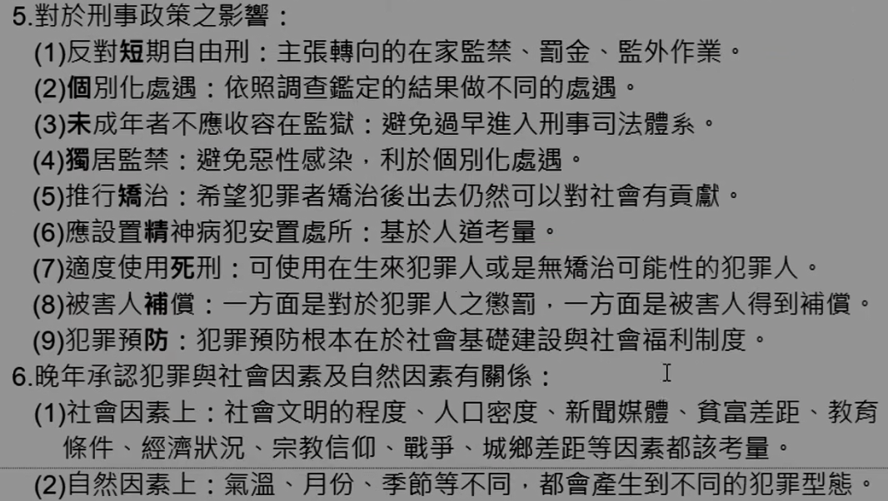

#### （二）費利（社會學）： 

社會學 犯罪飽和論 犯罪三論**<++>**

1.理論要點：**<++>** 
（1）**<++>** 
（2）**<++>** 
（3）**<++>** 
2.<b>犯罪三元說</b>：**<++>** 
（1）**<++>** 
（2）**<++>** 
（3）**<++>** 
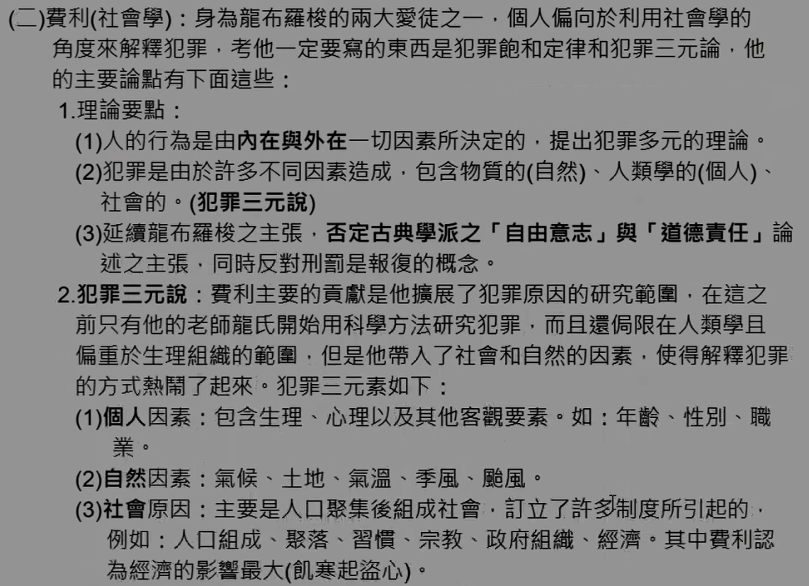
3.犯罪飽和原則：**<++>** 
（1）**<++>** 
（2）**<++>** 
（3）**<++>** 
4.社會責任論：**<++>** 
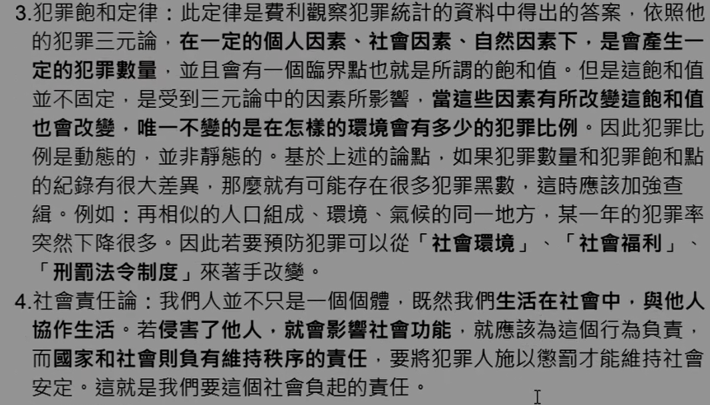
5.貢獻與評論：（實證學派加犯罪三元論也行） 
（1）**<++>** 
（2）**<++>** 
（3）**<++>** 
（4）**<++>** 
（5）**<++>** 
（6）**<++>** 
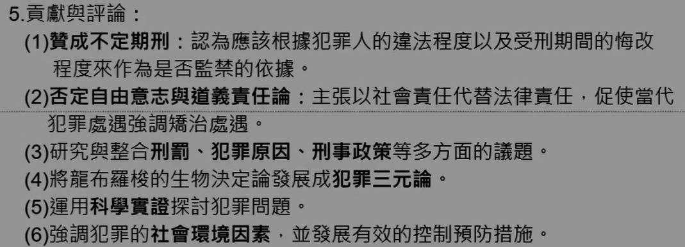

#### （三）蓋洛法羅：

心理學 **<++>**

1.將犯罪分為「自然犯罪」與「法定犯罪」： 
（1）自然犯罪：**<++>** 
（2）法定犯罪：**<++>** 
2.犯罪人分類：**<++>** 
（1）**<++>** 
（2）**<++>** 
（3）**<++>** 
（4）**<++>** 
3.淘汰犯罪人的方式：**<++>** 
（1）**<++>** 
（2）**<++>** 
（3）**<++>** 
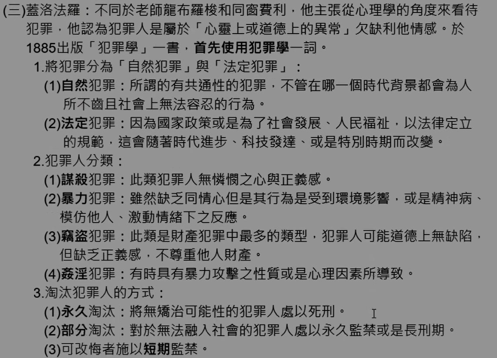
4.刑事政策：**<++>** 
（1）**<++>** 
（2）**<++>** 
（3）**<++>** 
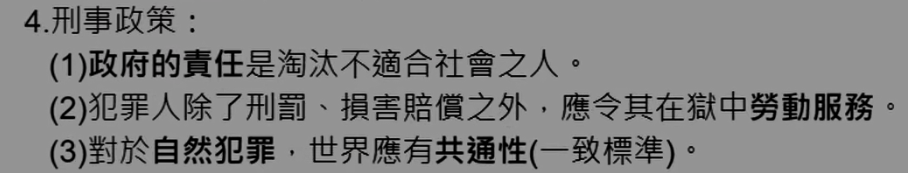
5.貢獻與評論：**<++>** 
（1）**<++>** 
（2）**<++>** 
（3）**<++>** 
（4）**<++>** 
（5）**<++>** 
（6）**<++>** 

### 六、實證學派之影響與貢獻：

#### （一）對於實證研究之貢獻： 

1\. 使用<b>科學方法</b>研究犯罪原因，奠定良好基礎，帶動犯罪學蓬勃發展。 
2\. 採用<b>科際整合</b>方式研究犯罪問題，使犯罪學在各領域紮根。 
3\. 開啟了現在實證學派的<b>兩大支派</b>： 
i. 採<b>生物決定論</b>的<u>犯罪生物學及犯罪心理學</u>，
ii. 採<b>文化決定論</b>的<u>社會控制理論、緊張理論、犯罪副文化理論。</u> 
4\. 主張犯罪由無法控制之<b>內外在因素</b>所導致，開啟犯罪研究新領域。 
5\. 主張由<b>社會觀點</b>探討犯罪定義，不以古典學派的法律觀點來探討。

#### （二）對於治療處遇之貢獻: 

1\. 強調犯罪人之<b>背景以及心理狀態</b>研究，提供行刑個別處遇之參考，協助日後更生與復健。 
2\. 獄政政開始推動<b>教育刑</b>，以處遇、矯治更生復健之概念取代應報、嚇阻等刑罰思潮。 
3\. 將犯罪人當作<b>病人</b>，<u>監獄應具有醫院之功能</u>，誕生了醫療模式。 
4\. 發展出調查分類、技能訓練、<b>假釋及不定期刑</b>、觀護制度及社區處遇等制 度。（偏監獄學） 

#### （三）對獄政（矯治對策）之貢獻： 

1\. <b>調查分類</b>：針對新入監之受刑人進行各種調查並分類，使其分配到最合適的處遇計畫。 
2\. <b>教化輔導</b>：對於各種類型之受刑人施以不同程度之教化矯治課程，例如：團體療法、認知行為療法、家族療法....等療法，使其化除惡性。 
3\. <b>職業技能訓練</b>：許多犯罪者都是因為生活所逼迫，因此給予技能訓練使其有一技之長，重返社會後有一定之收入來源而不至於再犯。 
4\. <b>假釋及縮刑</b>：對於表現良好者，以不定期刑之概念，使其早日脫離監禁之痛苦，鼓勵其改悔向上。 
5\. <b>更生保護計畫</b>：設置中途之家、日間報到中心、就業訓練中心、社區處遇，等制度，協助出獄人賦歸社會，適應社會生活而不至於再犯。 

### 補充:犯罪實證學派與犯罪古典學派的比較

| 不同點       | 古典           | 實證                     |
|--------------|----------------|--------------------------|
| 產生時代不同 | 18世紀中期     | 19世紀中期               |
| 產生背景不同 | 啟蒙運動       | 孔德實證、達爾文進化論   |
| 研究對象不同 | 犯罪行為       | 犯罪人                   |
| 代表學者不同 | 貝加利亞、邊沁 | 龍布羅梭、費利、蓋洛法羅 |
| 理論基礎不同 | 自由意志       | 生物決定論               |
| 犯罪定義不同 | 法律定義       | 社會定義                 |
| 研究標的不同 | 犯罪行為       | 犯罪人之生理、心理、環境 |
| 死刑觀點不同 | 廢除死刑       | 選擇性適用               |
| 刑罰目的不同 | 應報主義、威嚇 | 矯治教育、不定期刑       |
| 研究方法不同 | 哲學           | 科學                     |
| 量刑依據不同 | 只考量犯罪行為 | 注意犯罪人個別之差異     |

只是列舉一些較為重要的部分，大部分都是同樣的基礎點去推就可以理解了，或是沒時間只記一邊，用推導的去寫另一邊。

## 肆、新古典犯罪學派★

**<++>**

### 一、興起背景：**<++>** 

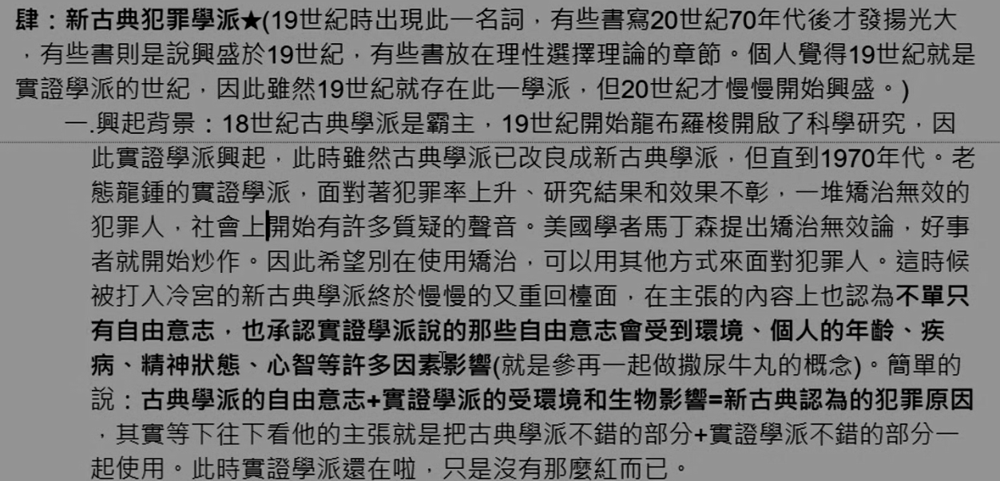

### 二、新古典犯罪學派的主張：（古典學派缺點進化） 

（一）**<++>** 
（二）**<++>** 
（三）**<++>** 
（四）**<++>** 
（五）**<++>** 
（六）**<++>** 
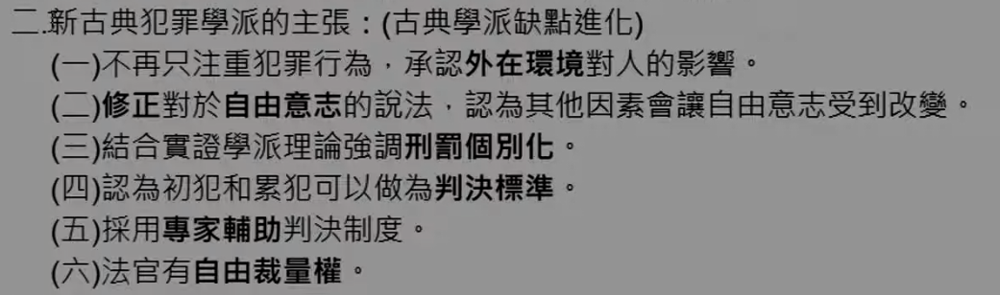

### 三、對刑事政之影響： 

（一）**<++>** 
（二）**<++>** 
（三）**<++>** 
（四）**<++>** 
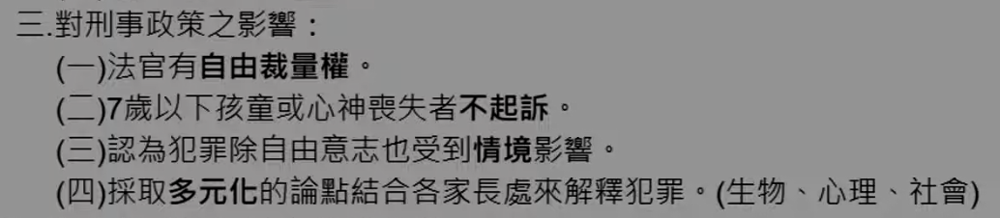
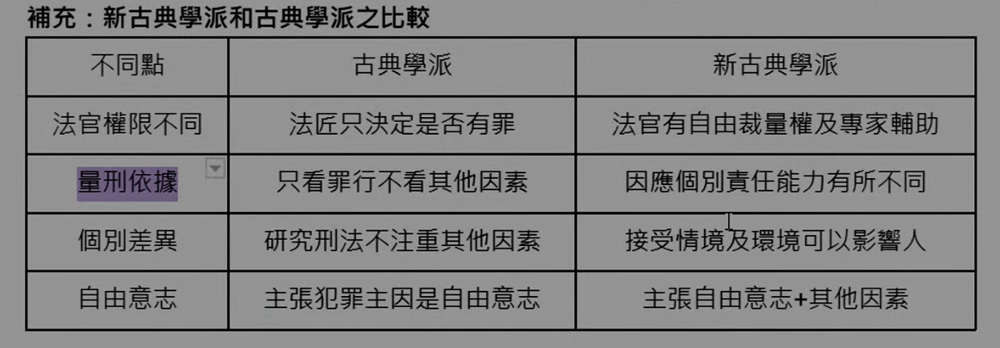

## 伍、當代古典學派

**<++>** 

### 一、理論觀點：

（一）**<++>** 
（二）**<++>** 
（三）**<++>** 
（四）**<++>** 
（五）**<++>** 
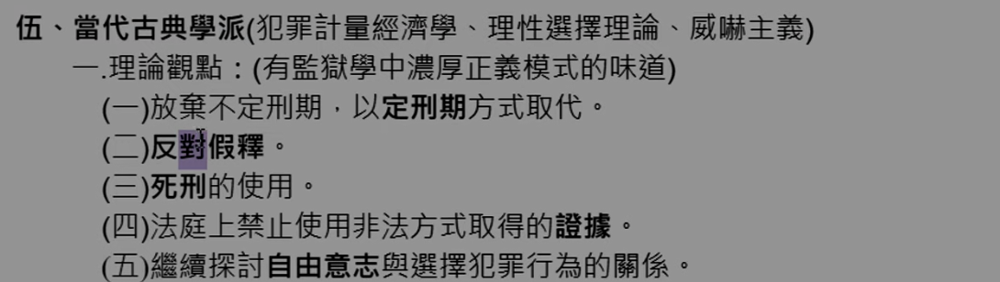

### 二、約 1960 **<++>**

（一）犯罪計量經濟學： 
1.**<++>** 
2.**<++>** 
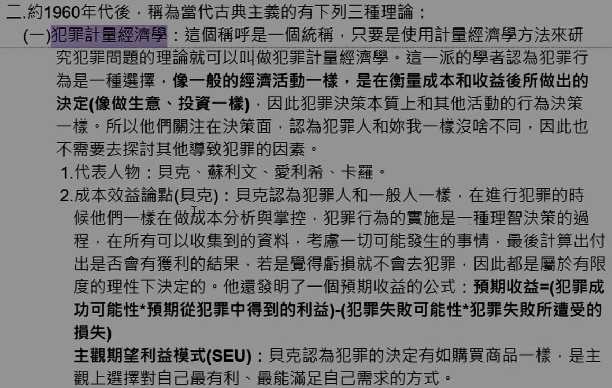
3.**<++>** 
(1)**<++>** 
(2)**<++>** 
(3)**<++>** 
(4)**<++>** 
(4)**<++>** 
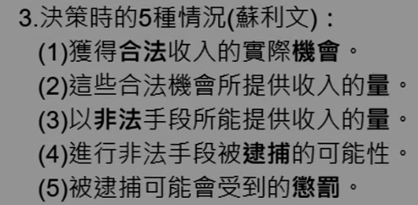

（二）理性選擇理論： 

1.**<++>** 

2.**<++>** 

3.**<++>** 
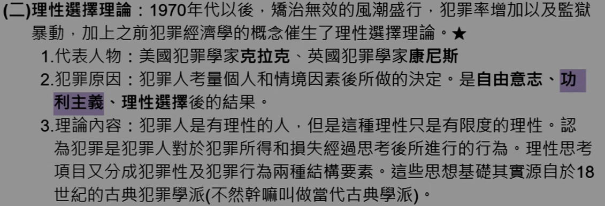

(1)**<++>** 
A.**<++>** 
B.**<++>** 
C.**<++>** 
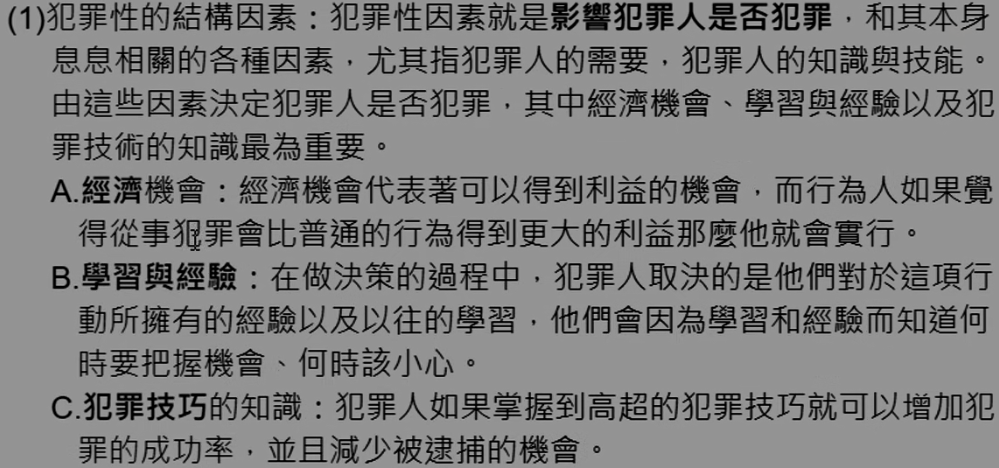
(2)**<++>** 
A.**<++>** 
B.**<++>** 
C.**<++>** 
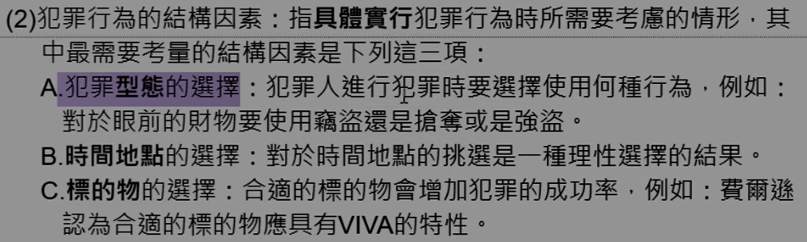

4.**<++>** 
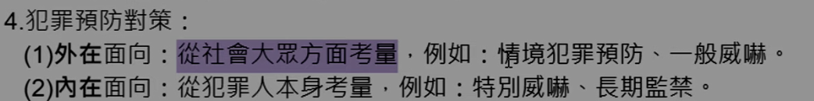

（三）威嚇主義： 
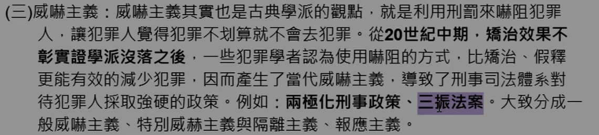
1.一般威嚇主義： 
(1)**<++>** 
(2)**<++>** 
(3)**<++>** 
A.**<++>** 
B.**<++>** 
C.**<++>** 
D.**<++>** 
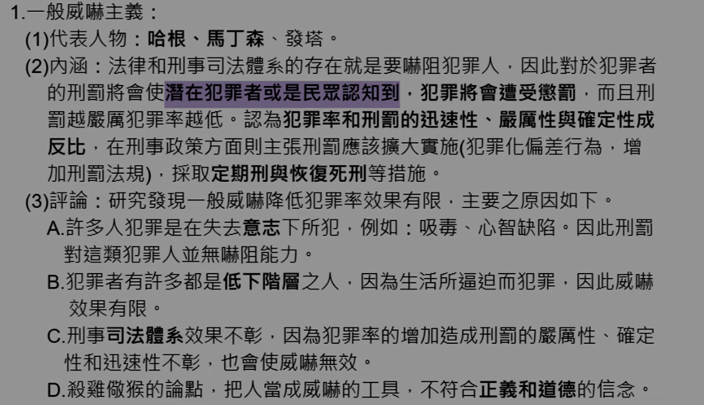

2.特殊威嚇主義與隔離主義： 
(1)**<++>** 
A.**<++>** 
B.**<++>** 
(2)**<++>** 
A.**<++>** 
B.**<++>** 
(3)**<++>** 
A.**<++>** 
B.**<++>** 
C.**<++>** 
(4)**<++>** 
A.**<++>** 
B.**<++>** 
C.**<++>** 
D.**<++>** 
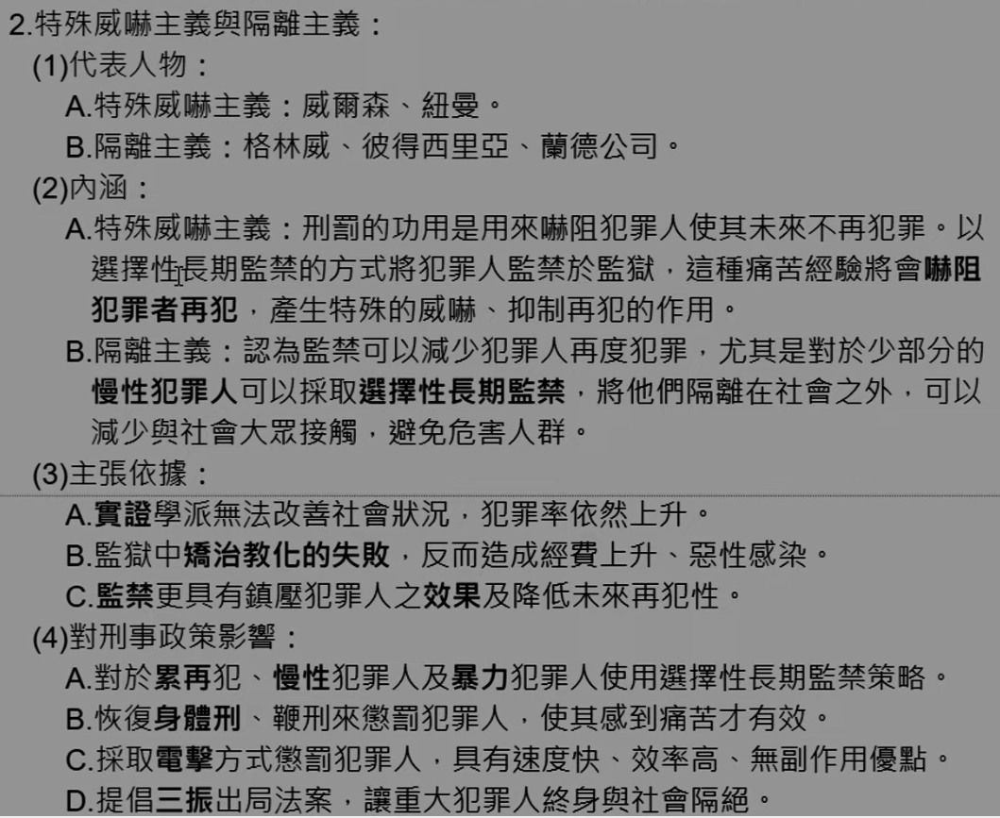
(5)**<++>** 
A.**<++>** 
B.**<++>** 
(A)**<++>** 
(B)**<++>** 
(C)**<++>** 
(D)**<++>** 
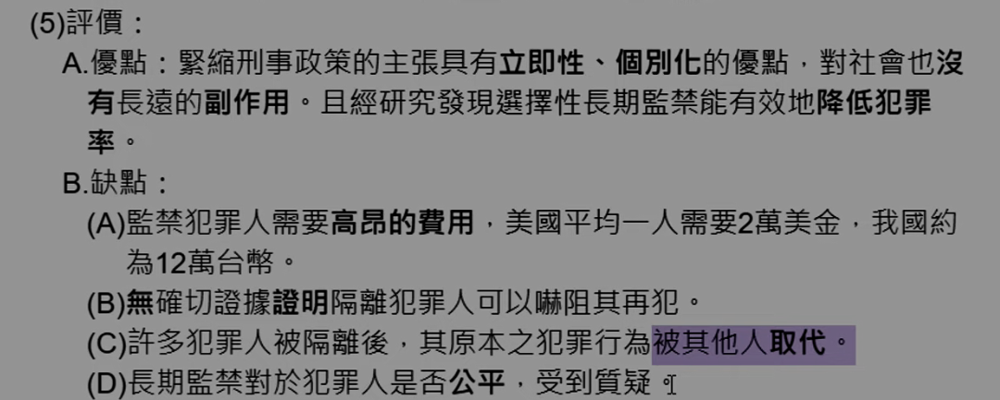
(6)**<++>** 
A.**<++>** 
B.**<++>** 
C.**<++>** 
D.**<++>** 
E.**<++>** 
F.**<++>** 
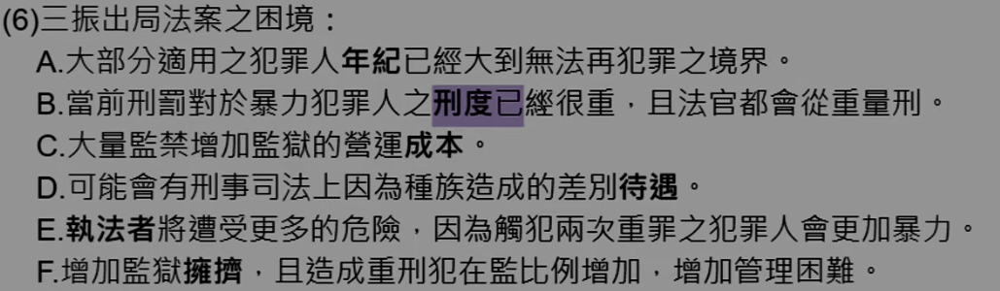

3.報應主義： 
(1)**<++>** 
(2)**<++>** 
A.**<++>** 
B.**<++>** 
C.**<++>** 
(3)**<++>** 
A.**<++>** 
B.**<++>** 
C.**<++>** 
(4)**<++>** 
(5)**<++>** 
A.**<++>** 
B.**<++>** 
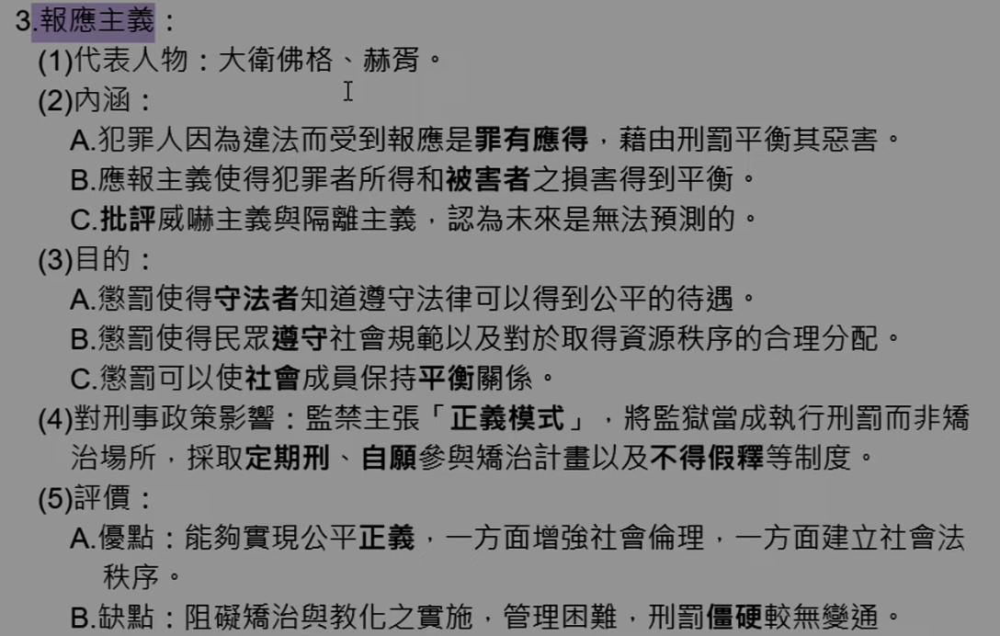

4.威嚇主義對刑事政策學造成之影響：**<++>** 
(1)**<++>** 
(2)**<++>** 
(3)**<++>** 
(4)**<++>** 
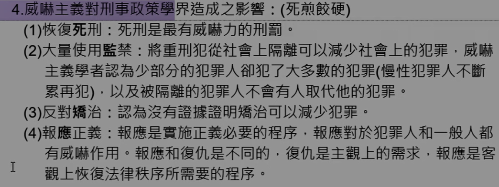
