# 第二章 犯罪學理論

---

# 主題一：犯罪理論的歷史發展

## 壹、18世紀之前的犯罪學思想

一、神學說：以宗教 **<++>** 

二、魔鬼說： **<++>** 

三、世俗說： **<++>** 

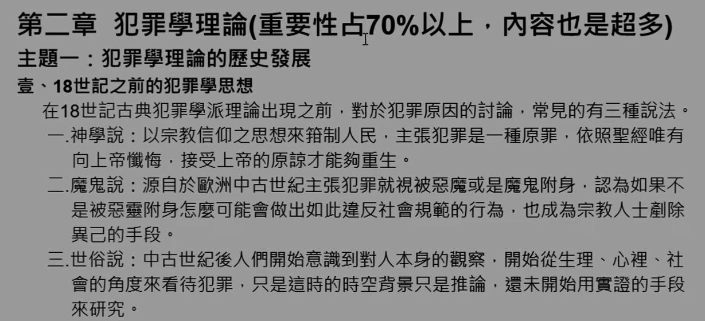

## 貳、犯罪古典學派★

 **<++>**  古典學派較注重<b>刑罰</b> 理性選擇 嚇阻

### 一、歷史背景：

 **<++>**  18 世紀 啟蒙運動 罪刑法定 罪刑均衡 貝加利亞 邊沁
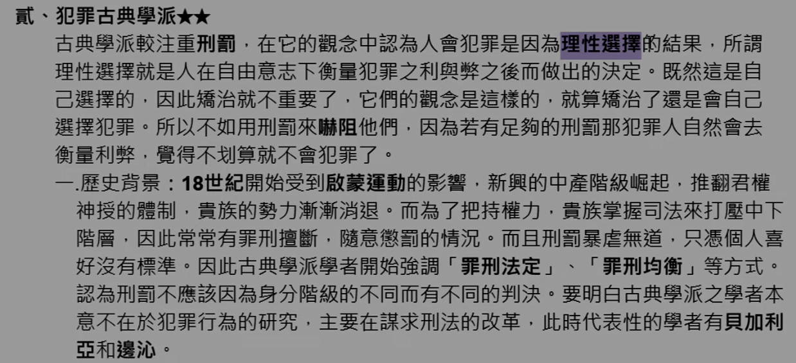

### 二、對人性的四種基礎假設：

 **<++>**  

（一）自由意志： **<++>**  
（二）理性思考： **<++>**  
（三）趨樂避苦： **<++>**  
（四）追求自我利益： **<++>**  
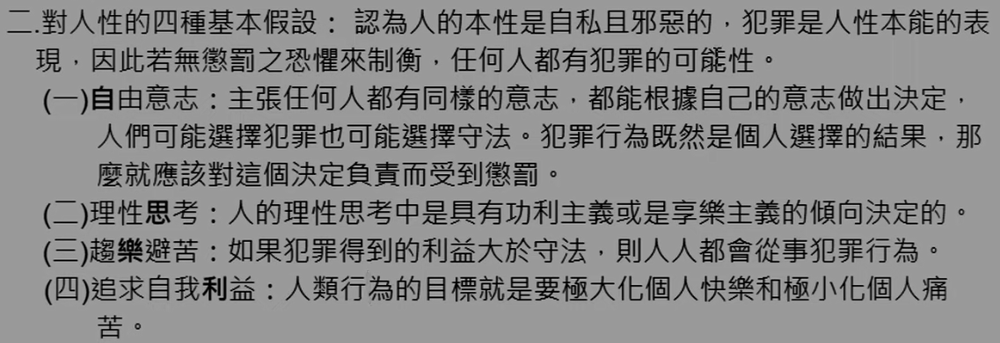

### 三、對於犯罪原因的看法（為何人會犯罪）：

（一）自由意志 **<++>**  
（二）較大的報酬 **<++>**  
（三）限制 **<++>**  
（四） **<++>**  
（五） **<++>**  
（六）嚇阻犯罪的三要素： **<++>**  
1\. 刑罰之迅速性： **<++>**  
2\. 刑罰之確定性： **<++>**  
3\. 刑罰之嚴厲性： **<++>**  
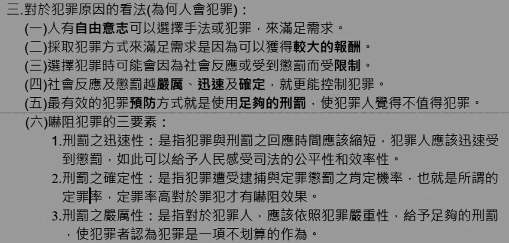

### 四、理論的內容（基礎）：

> 如果申論考 ”何謂古典學派？“ 就寫這個加上 《一、歷史背景》，代表人物就 貝加利亞、邊沁，再加上優缺點

（一）自由意志： **<++>**  
（二）人性假設： **<++>**  
（三）刑罰目的： **<++>**  
（四）刑罰功能： **<++>**  
（五）刑罰主張：<b>反對死刑</b>、流放刑、身體刑等不人道之刑罰（時代背景，避免淪為統治者的手段，反對者都被弄死了） **<++>**  
（六）刑罰原則： **<++>**  
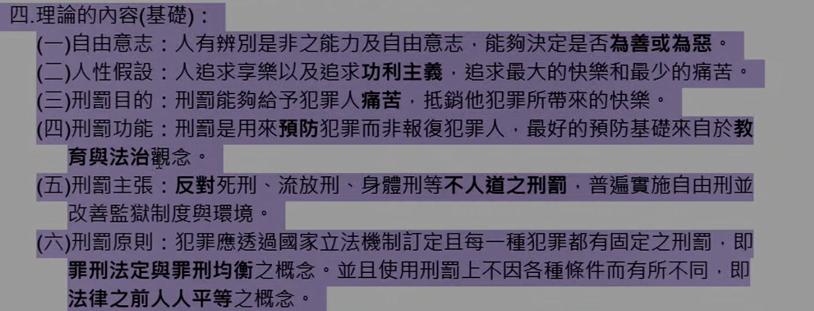

### 五 刑罰之重點：

> 記個五點差不多

 **<++>** 

（一） **<++>**  
（二）定期刑：（時代背景，避免淪為統治者的手段） **<++>**  
（三） **<++>**  
（四） **<++>**  
（五） **<++>**  
（六） **<++>**  
（七）<b>廢除死刑</b> **<++>**  
（八） **<++>**  
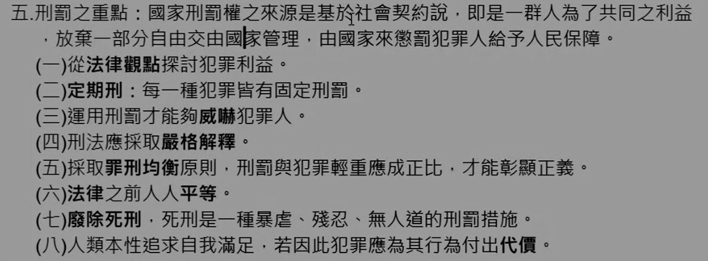

### 六、代表人物及其主張：

> 早期申論有考過，但目前應該只會考選擇

#### （一）貝加利亞：<b>刑法學之父</b>  **<++>**  

1\.理論內涵： 
(1)刑罰的起源：社會契約論 **<++>**  
(2)刑罰權：國家管理 **<++>**  
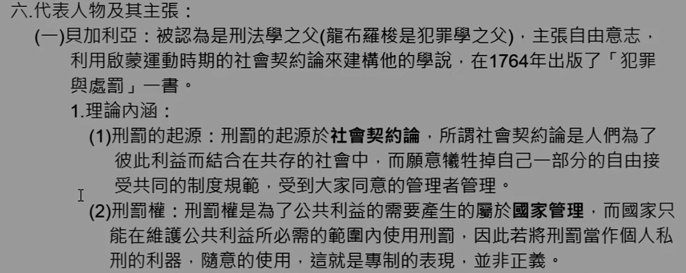

2\.法律的特徵：嚇阻警惕 **<++>**  
(1)罪刑法定： **<++>**  
(2)罪刑明確： **<++>**  
(3)罪刑均衡： **<++>**  
3\. **<++>** 法匠 **<++>**  
4\.貝氏預防犯罪的手段： **<++>**  
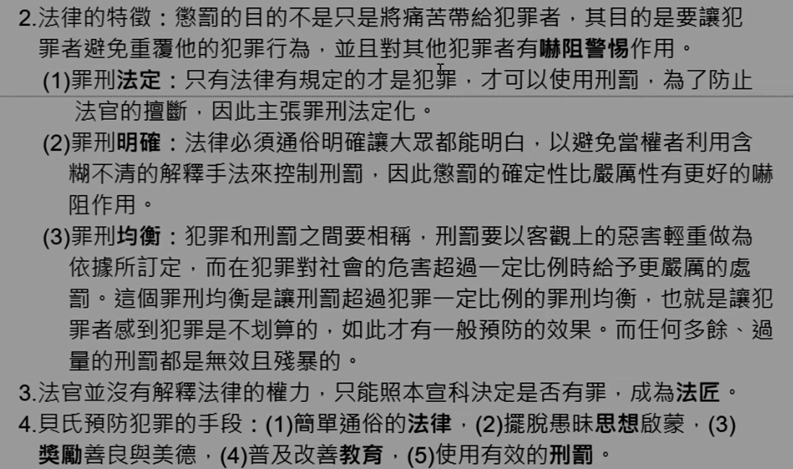

#### （二）邊沁：

多才多藝 **<++>**  

1\.理論內涵：趨樂避苦……（刑罰應大於快樂） **<++>**  
2\.犯罪原因：趨樂避苦 **<++>**  
3\.刑罰因素： **<++>**  
(1)刑罰的目的： **<++>**  
(2)刑罰六原則： **<++>**  
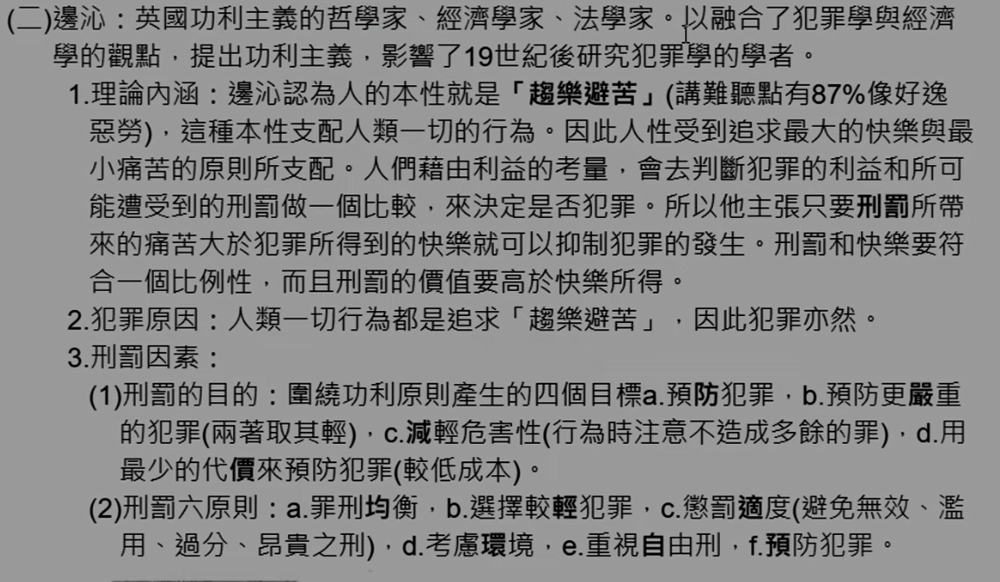

4\.監獄改革： **<++>**  
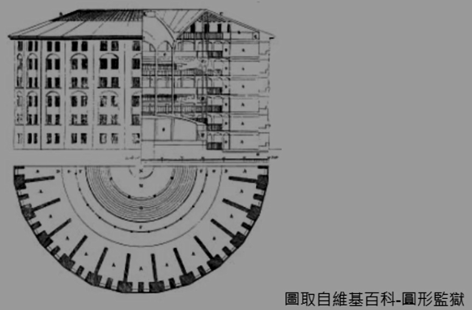
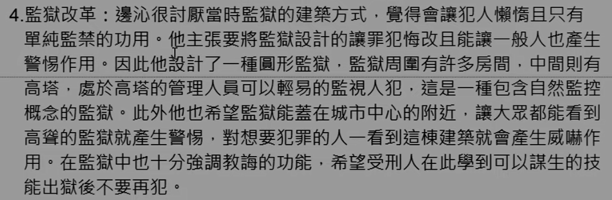

5\.邊沁主張預防犯罪手段：（較冷門）  
(1)滿足或轉移犯罪之慾望： **<++>**  
(2)適當的使用刑罰： **<++>**  
(3)補償被害人： **<++>**  
(4)使用約制體系： **<++>**  
A.自然約制： **<++>**  
B.道德或社會約制： **<++>**  
C.政治（法筆）約制： 
D.宗教約制： **<++>**  
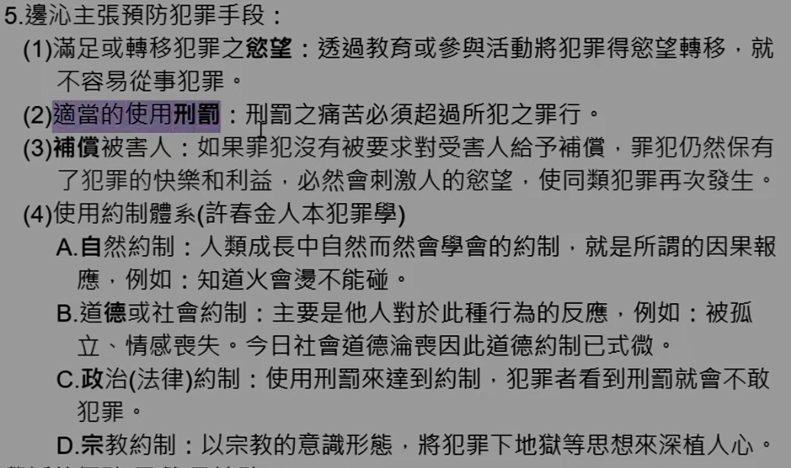

### 七、古典學派的優點（貢獻）及缺點：

（一）優點： 
1\.罪刑法定、罪刑均衡 **<++>** 
2\. **<++>** 
3\. **<++>** 
4\. **<++>** 
（二）缺點： 
1\.未考量個別差異： **<++>**  
2\.監禁過於消極：（治標不治本） **<++>**  
3\.犯罪概念抽象難以理解： **<++>**  
4\.久缺科學實證： **<++>** 
（三）對犯罪矯治的影響： 
1\.國家刑罰權： **<++>**  
2\.<b>廢除死刑</b>： **<++>**  
3\.監獄建築<b>現代化</b>： **<++>**  
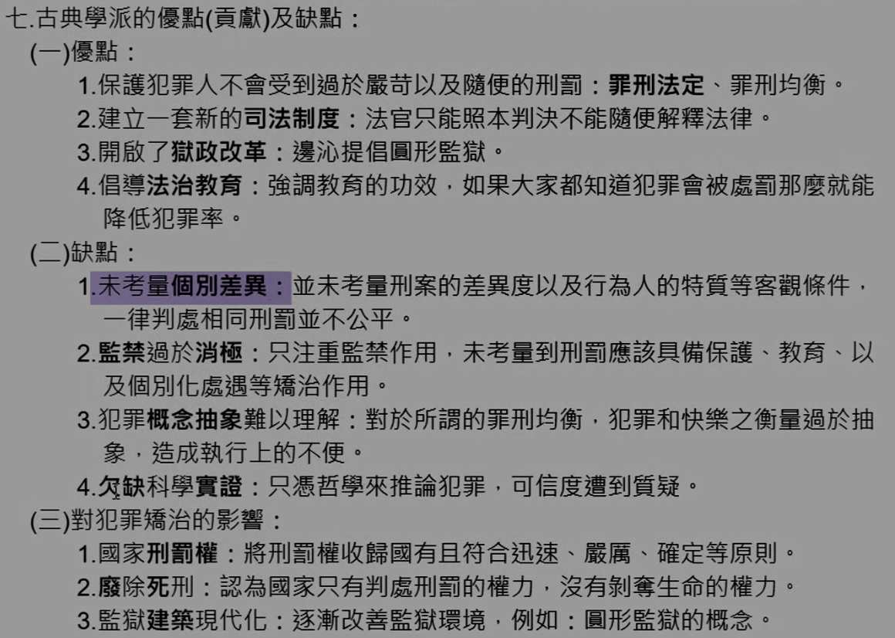

## 参、犯罪實證學派★★

> 若考 《何謂犯罪實學派？》，寫時代背景（稍微）、理論主張、代表人物（各寫一兩行即可）、然後貢獻（獄政？）

### 一、時代背景： 

> 古典 18 世紀

19 世紀工業革命 **<++>** 

### 二、興起背景： 

（一）古典犯罪學派不能有效抑制犯罪： **<++>** 
（二）科學方法成為研究的主要工具： **<++>** 
（三）社會結構轉變，人們開始關心社會議題： **<++>** 

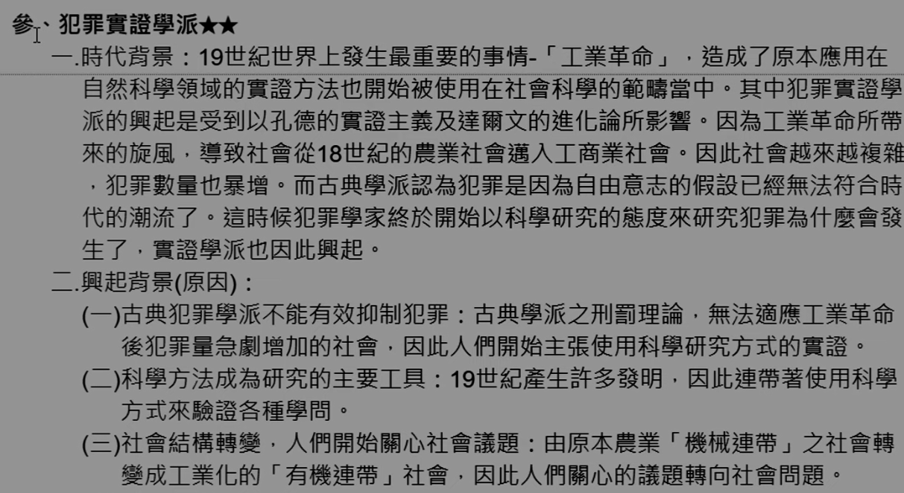

### 三、對犯罪原因的看法： 

（一）非自由意志： **<++>**  
（二）生、心理異常： **<++>**  
（三）科學方法： **<++>**  

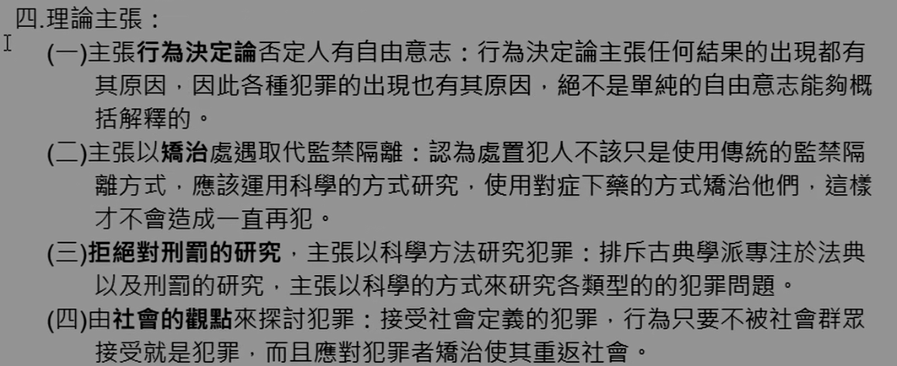

### 四、理論主張： 

（一）主張<b>行為決定論</b>否定人有自由意志：： **<++>**  
（二）主張以<b>矯治處遇</b>取代監禁隔離： **<++>**  
（三）<b>拒絕對刑罰的研究</b>，主張以科學方法研究犯罪：（關注於為什麼會去犯罪。古典學派重視對刑罰的研究) **<++>**  
（四）由<b>社會的觀點</b>來探討犯罪： **<++>**  

### 五、代表人物：義大利三聖 

#### （一）龍布羅梭（人類學）：

<b>犯罪學之父</b> **<++>**

A.基本觀點： 
生物決定論、<b>祖型重現</b>、遺傳 **<++>**  

[2022-10-25-18-54-48](.assets/c02.s01/_2022-10-25-18-54-48.png)

B.將犯罪人分類： **<++>**  
（1） **<++>**  
（2） **<++>**  
（3） **<++>**  
（4） **<++>**  
（5） **<++>**  
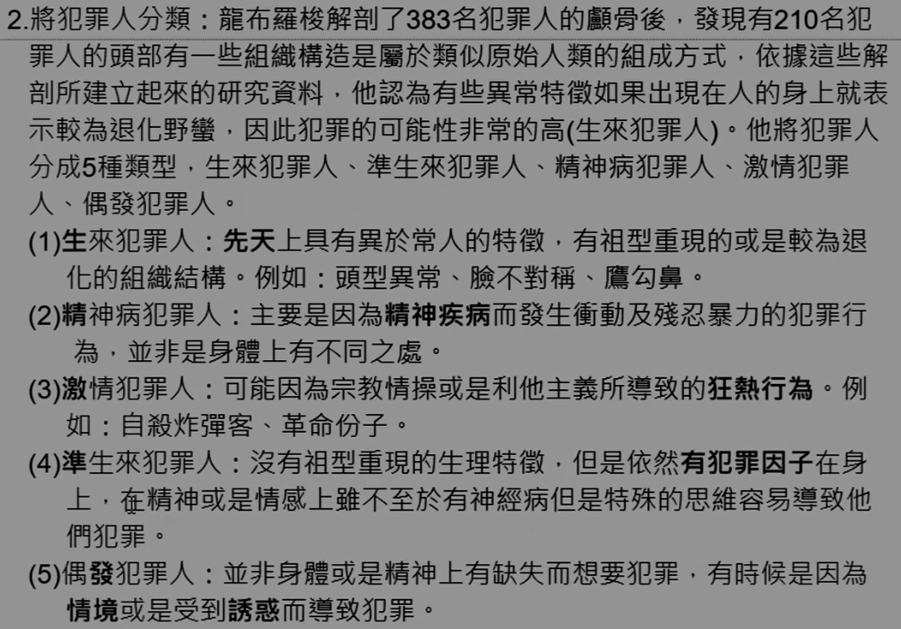

3.貢獻： **<++>**  
（1） **<++>**  
（2） **<++>**  
（3） **<++>**  
（4） **<++>**  
（5） **<++>**  
（6） **<++>**  
4.批評： **<++>**  
（1） **<++>**  
（2） **<++>**  
（3） **<++>**  
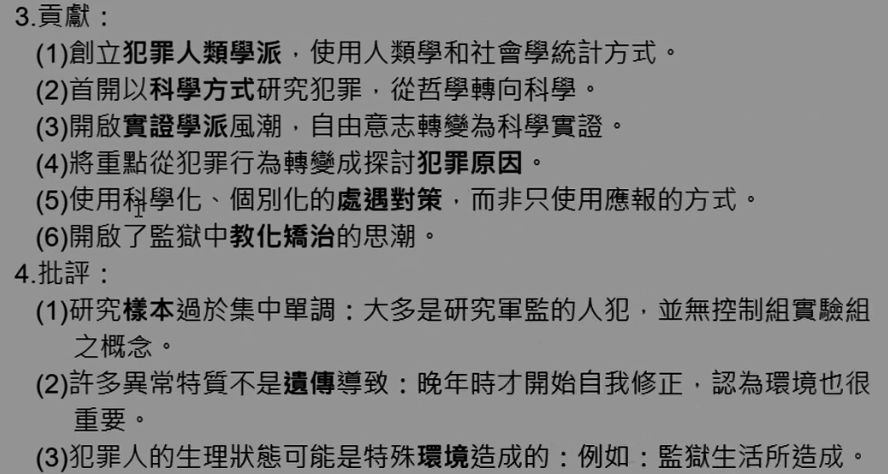

5.對於刑事政策之影響： 
（1） **<++>**  
（2） **<++>**  
（3） **<++>**  
（4） **<++>**  
（5） **<++>**  
（6） **<++>**  
（7） **<++>**  
（8） **<++>**  
（9） **<++>**  
6.晚年承認犯罪與社會因素及自然因素有關係： 
（1） **<++>**  
（2） **<++>**  
 **<++>** 

#### （二）費利（社會學）： **<++>** 

1.理論要點： **<++>**  
（1） **<++>**  
（2） **<++>**  
（3） **<++>**  
2.犯罪三元說： **<++>**  
（1） **<++>**  
（2） **<++>**  
（3） **<++>**  

3.犯罪飽和原則： **<++>**  
（1） **<++>**  
（2） **<++>**  
（3） **<++>**  
4.社會責任論： **<++>**  

5.貢獻與評論： **<++>**  
（1） **<++>**  
（2） **<++>**  
（3） **<++>**  
（4） **<++>**  
（5） **<++>**  
（6） **<++>**  

#### 蓋洛法羅： **<++>** 

1.將犯罪分為「自然犯罪」與「法定犯罪」： 
（1） **<++>**  
（2） **<++>**  
2.犯罪人分類： **<++>**  
（1） **<++>**  
（2） **<++>**  
（3） **<++>**  
（4） **<++>**  
3.淘汰犯罪人的方式： **<++>**  
（1） **<++>**  
（2） **<++>**  
（3） **<++>**  

4.刑事政策： **<++>**  
（1） **<++>**  
（2） **<++>**  
（3） **<++>**  

5.貢獻與評論： **<++>**  
（1） **<++>**  
（2） **<++>**  
（3） **<++>**  
（4） **<++>**  
（5） **<++>**  
（6） **<++>**  

### 六、實證學派之影響與貢獻：

（一）對於實證研究之貢獻：
1. **<++>**  
2. **<++>**  
3. **<++>**  
4. **<++>**  
5. **<++>**  
（二）對於治療處遇之貢獻：
1. **<++>**  
2. **<++>**  
3. **<++>**  
4. **<++>**  
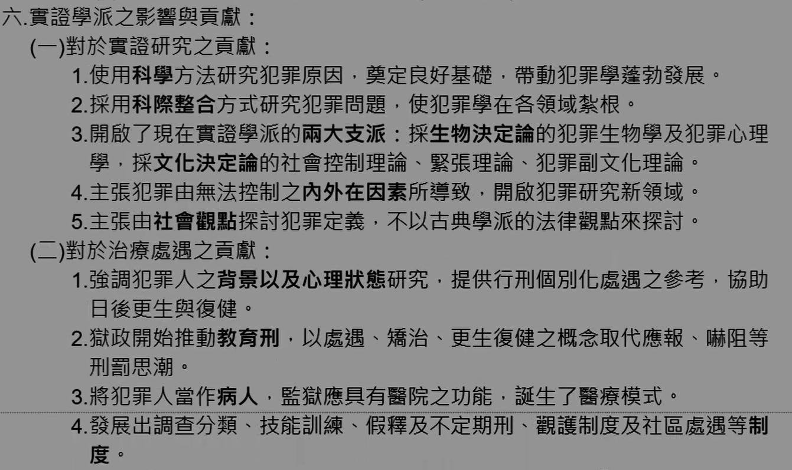
（三）對獄政（矯治對策）之貢獻： 
1. **<++>**  
2. **<++>**  
3. **<++>**  
4. **<++>**  
5. **<++>**  
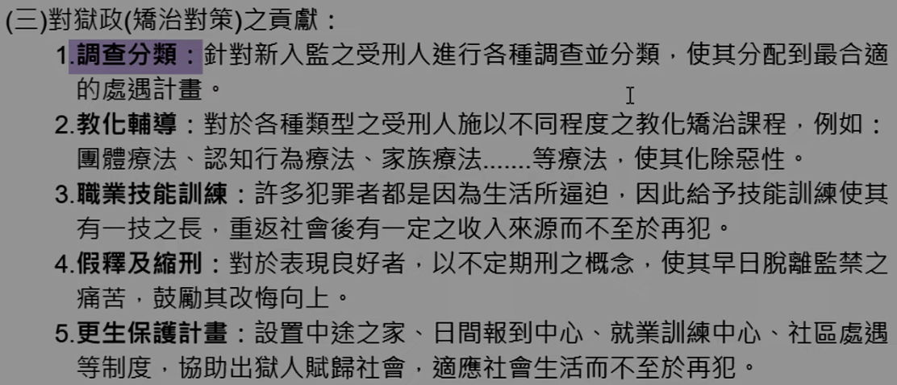
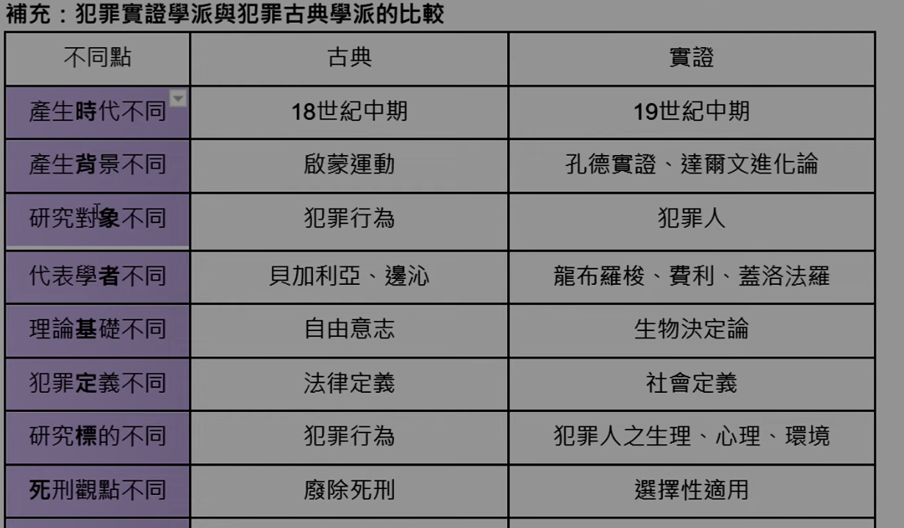
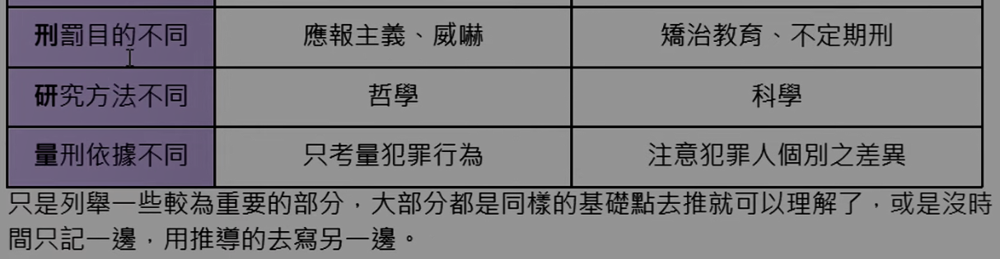
