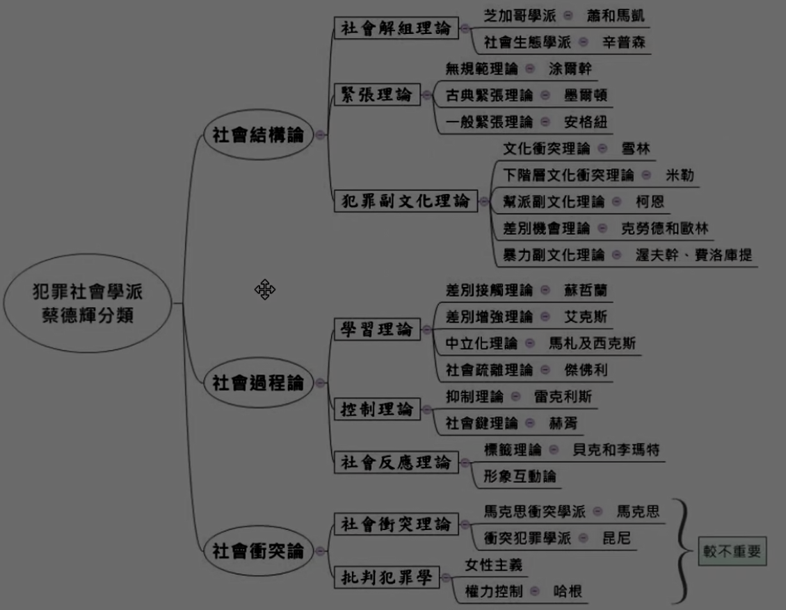
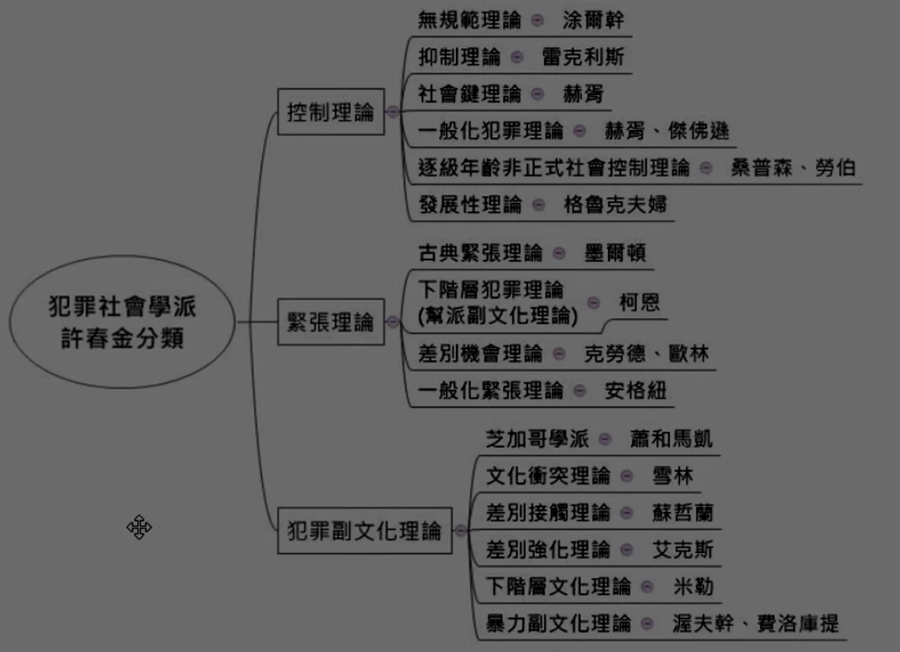

# 主題四：犯罪社會學派概念與分類

<!-- 33-34 -->
犯罪社會學派為20世紀的犯罪學的主流學派，在此前的犯罪生物學派以及犯罪心理學派，較重視個人自身的原因來探討犯罪成因。而犯罪社會學派是以社會學的角度來探討犯罪，強調犯罪行為與社會環境文化間的互動關係。

## 壹、基本觀點：

（）括號內為舉例之理論。

一、犯罪行為是一種社會現象（社會結構理論）。
二、犯罪行為模式與犯罪人的社經地位（社會衝突理論）、種族（副文化理論）、性別和年齡（發展性理論）都密切相關。
三、犯罪行為和社會變遷有關社會亂迷理論）。
四、技術的發展及對社會制度的影響導致犯罪的產生（緊張理論）。
五、群體與人和人之間的互動對犯罪有重要關係（標籤理論）。
六、犯罪本身是一種人際互動學習關係（差別接觸理論）。

## 貳、犯罪社會學派之分類：

目前我國高等教育對於犯罪學派的體系分類較有名的就兩種，一種是蔡德輝老師的分法也是採用美國犯罪學家西格爾一派的分法，另一種是許春金老師的分法。雖然考架構的機率很低，因為會有爭議，但至少還是要有個架構概念。因為分法略有不同，未免體系混亂我主要介紹西格爾一派的分法（和蔡師細節部分略有不同），許老師的分法就只附圖供參考了。

[2022-11-01-15-53-36](.assets/c02.s04/_2022-11-01-15-53-36.png)

### 一、西格爾的犯罪學體系：

先記住大方向分為社會結構理論、社會過程理論、社會衝突理論。（社會結構和社會過程理論各有3分支，社會衝突理論有2分支，然後每個分支都有數個理論QQ。然後記起這幾十種理論的內容以及弄清楚它們的關係就是你考高分的關鍵）

#### （一）社會結構理論：

社會結構理論強調社會文化的環境，主要都是圍繞在下階層的在整個社會中處於不利的經濟地位，來當做他們犯罪的主因創寒起盜）。文字很抽象，所以我在這邊告訴各位怎麼從字面推敲：結構兩字，就要想到結衣，然後想到新垣結衣..誤。是想到社會是由什麼東西組成的，這邊不要想的太復雜就分兩派就好，就有錢的和沒錢的，有錢的叫做上階層，沒錢的叫作下階層。晉升上階層的名額很少呀，就像上榜的人一樣少，那下階層的上不去就會怎樣，就會做些上階層不高興的事呀，或是加入幫派一起取暖呀。這些事通常會被定為犯罪啦，幫派就會被定做不良組織想想衝突觀和互動觀的犯罪論）。社會結構理論又分為3個分支：社會館組理論、緊張理論、副文化理論。

1\. 社會解組理論：犯罪是因為社會變遷、文化解組、次文化與身分挫折造成的。較著明的是芝加哥學派、無規範理論（社會生態學派）。  

2\. 緊張理論：下階層無法用合法手段達到社會共同的價值與目標時，就會以非法手段來達成。較有名的是古典緊張理論、一般化緊張理論。  

3\. 副文化理論：因無法和主流文化結合，而發展出另一套和主流文化不同的文化，而這些副文化的生活方式常常容易導致犯罪的發生。較有名的是文化衝突理論、下階層文化衝突理論、暴力副文化理論、次文化理論（幫派副文化理論）、差別機會理論。

#### （二）社會過程理論：

認為犯罪是人在成長的社會化過程中與不同的社會組織、制度和社會產生互動的結果，而且各個階級的人都有成為犯罪者之可能。這個理論的重點在於過程這兩個字眼，想像自己在成長的過程中，是否有機會接觸到犯罪，或是曾經加入幫派或是差點走錯路之類的感覺。然後你去想為何人會變壞?可能是因為家庭或是學校得不到溫暖，總是被欺負。這些得不到溫暖和重視或是被欺負都會產生負面的情緒，需要尋求發洩、尋求慰藉。如果你沒被欺負過，你也試著想想心情不好總要找人說說話，希望家人支持之類的感覺。既然正面的方向得不到安慰，沒有人教導社會的規則。這時候負面的力量就會入侵，可能就會容易走錯路。簡單的說就是成長的過程中沒有教好就容易犯罪。這邊也有3個分支：

1\. 社會學習理論（sociallearningtheory）：這邊是做為社會過程理論中分類使用，不是班都拉的社會學習理論（socialleaminatheow），名稱相同是翻譯的問題。此理論認為犯罪是和周遭的朋友密切交往中學習而來，包含學習罪惡感、羞恥感、中立化技巧等。包含了差別接觸理論（蘇哲蘭）、差別增強理論（艾克斯）、中立化理論（馬札和西克斯）。

2\. .社會控制理論：認為每個人天生都會傾向於犯罪，而犯罪是由於社會控制力量薄弱所導致。包含了社會鍵理論（赫胥）、社會疏離理論（傑佛利）、抑制理論（雷克利斯）。

3\. 社會反應理論：主要代表是標籤理論（貝克和李瑪特），認為當自己的重要他人都將這個人標籤為犯罪人後，這個人就會慢慢接受自己是犯罪者。

#### （三）社會衝突理論：

這理論的論點比較接近衝突觀的犯罪論，法律是統治階級的信念和價值觀的表現，所有和統治階層相左的意見都會被定義成犯罪。法律是被上階層者差別制定與差別執行的，統治階級利用刑事司法制度來控制社會。簡單的說非我族類，其心必異。社會衝突理論又分成兩類：

1.衝突犯罪學：資本家為了獲得利益而制定法律犯罪化勞工的行為。因此犯罪就被視為無產階級的一種對抗方式。

2.批判犯罪學（激進犯罪學）：認為資本主義產生的有產者和無產者都會犯罪，批判犯罪學使用客觀的角度來看，認為犯罪是一種對社會有害的行為，犯罪在客觀上具有危險性且社會上並不需要的。

（體系僅為方便理解，並沒有絕對，考試也因為有爭議而不常考，因此不需要太在意體系內容為何某種理論分配到這，別的老師分配到那，因為許多理論的性質上都是複合式的，所以要分到哪其實都說得過去，就是每個老師方便教學自己分爽的，才會有如此大的差異。）

[2022-11-01-15-57-50](.assets/c02.s04/_2022-11-01-15-57-50.png)  
[2022-11-01-15-59-57](.assets/c02.s04/_2022-11-01-15-59-57.png)  
[2022-11-01-16-06-28](.assets/c02.s04/_2022-11-01-16-06-28.png)  
[2022-11-01-16-08-24](.assets/c02.s04/_2022-11-01-16-08-24.png)  
[2022-11-01-16-10-38](.assets/c02.s04/_2022-11-01-16-10-38.png)

### 二、蔡德輝老師的犯罪學體系：（只供參考）

* 社會結構論
  * 社會解組理論
    * 芝加哥學派 —— 蕭和馬凱
    * 社會生態學派 —— 辛普森
  * 緊張理論
    * 無規範理論 —— 涂爾幹
    * 古典緊張理論 —— 墨爾頓
    * 一般緊張理論 —— 安格紐
  * 犯罪副文化理論
    * 文化衝突理論 —— 雪森
    * 下階層理論 —— 米勒
    * 幫派副文化理論 —— 柯恩
    * 差別機會理論 —— 克勞德和歌林
    * 暴力副文化理論 —— 渥夫幹、費洛庫提
* 社會過程論
  * 學習理論
    * 差別接觸理論 —— 蘇哲蘭
    * 差別增強理論 —— 艾克斯
    * 中立化理論 —— 馬札及西克斯
    * 社會疏離理論 —— 傑佛利
  * 控制理論
    * 抑制理論 —— 雷克利斯
    * 社會鍵理論 —— 赫胥
  * 社會反應理論
    * 標籤理論 —— 貝克和李瑪特
    * 形象互動論
* 社會衝突論
  * 社會衝突理論
    * 馬克思衝突學派 —— 馬克思
    * 衝突犯罪學派 —— 昆尼
  * 批判犯罪學
    * 女性主義
    * 權力控制 —— 哈根

### 三、許春金老師的犯罪學體系：（只供參考）

* 控制理論
  * 無規範理論 —— 涂爾幹
  * 抑制理論 —— 雷克利斯
  * 社會鍵理論 —— 赫胥
  * 一般化犯罪理論 —— 赫胥、傑佛遜
  * 逐級年齡非正式社會控制理論 —— 桑普森、勞伯
  * 發展性理論 —— 格魯克夫婦
* 緊張理論
  * 古典緊張理論 —— 墨爾頓
  * 下階層犯罪理論（幫派副文化理論） —— 柯恩
  * 差別機會理論 —— 克勞德和歌林
  * 一般化緊張理論 —— 安格紐
* 犯罪副文化理論
  * 芝加哥學派 —— 蕭和馬凱
  * 文化衝突理論 —— 雪森
  * 差別接觸理論 —— 蘇哲蘭
  * 差別強化理論 —— 艾克斯
  * 下階層文化理論 —— 米勒
  * 暴力副文化理論 —— 渥夫幹、費洛庫提
