# 主題五：犯罪結構理論★★★★★

<!-- 34 - 44 -->
<!-- 34 -->
> :memo: Recite:
> _____
> 解組、緊張、副文化。
          

直接來介紹 3 種分支的理論吧：**解組**、**緊張**、**副文化**。

## toc

* 壹、社會解組理論
  * 一、無規範理論（亂迷理論）理論背景：
  * 一、無規範理論 / （一）機械社會與有機社會：
  * 一、無規範理論 / （二）無規範理論：
  * 一、無規範理論 / （三）**犯罪正常論**：
  * 一、無規範理論 / （四）犯罪的功能：
  * 一、無規範理論 / （五）預防犯罪的對策：
  * 二、芝加哥學派（犯罪區位學）：
  * 二、芝加哥學派 / （一）派克的社會生態理論：
  * 二、芝加哥學派 / （二）伯格斯的同心圓理論：★
  * 二、芝加哥學派 / （三）犯罪區域相關因素：
  * 二、芝加哥學派 / （四）蕭和馬凱的少年犯罪研究：★
    * 1. 繪圖研究法：
    * 2. 少年犯罪區：
    * 3. 犯罪防治對策：
    * 4. 研究貢獻與缺失：
  * 二、芝加哥學派 / （五）芝加哥區域計畫：★
  * 二、芝加哥學派 / （六）集體效能理論：
* 貳、緊張理論
  * 一、古典緊張理論：
    * （一）代表人物：
    * （二）理論內涵：
    * （三）社會適應的方式：
    * （四）缺點：
    * （五）預防犯罪方式：
  * 二、一般化緊張理論：
    * （一）代表人物：
    * （二）理論內涵：
      * 1. 安格紐：
      * 2. 緊張與犯罪的關係：
      * 3. 排除緊張的方式：
    * （三）一般化緊張理論和古典緊張理論的差別：
  * 補充：緊張理論對於性別犯罪之論述：
    * （一）安格紐研究男女產生緊張的不同處：
    * （二）緊張導致的不同的犯罪行為種類：
  * 三、制度性緊張理論（機構性亂迷）：（美國夢）
    * （一）代表人物：
    * （二）理論概說：
    * （三）理論內涵：
    * （三）結論：
* 参、犯罪副文化理論
  * 一、文化衝突理論：
    * （一）代表人物：
    * （二）理論內涵：
    * （三）預防文化衝突的政策：針對歪果仁）
    * （四）缺點：
  * 二、下階層文化衝突理論：
    * （一）代表學者：
    * （二）理論內涵：
    * （三）焦點關心：
    * （四）缺點：
  * 三、幫派副文化理論（犯罪次文化理論）：
    * （一）代表學者：
    * （二）理論內涵：
      * 1. 柯恩認為：
      * 2. 中產階級衡量尺度：
      * 3. 下階層少年產生挫折的反應：
      * 4. 犯罪副文化的特徵：
    * （三）優點：
    * （四）缺點：
  * 四、差別機會理論：
    * （一）代表學者：
    * （二）理論內涵：
    * （三）差別機會下的犯罪副文化類型：
    * （四）反貧窮戰爭：
  * 五、暴力副文化理論：
    * （一）代表學者：
    * （二）理論內涵：
    * （三）暴力副文化的七項定理：
    * （四）理論啟示：

## 壹、社會解組理論

我們將焦點放在解組 2 字上，這個社會是由一定的人口、制度、土地等元素組成的。那麼這個社會崩毀了，我們就叫它「**解組**」這個字眼。社會的組成是由一定且調合的元素組成，那麼解組就是這些元素出問題了。*例如：失業率、中輟生比率、空屋率、低收入戶增加、戰爭、法律改變、政變*。簡單的想，這個社會如果不是你熟悉的社會，你原本用來謀生的手段突然都沒用了，那麼你可能會使用犯罪的手段來謀生。

### 一、無規範理論（亂迷理論）：

> :memo: Recite:
> _____
> 無規範 亂迷 法國 涂爾幹  
> 機械社會與有機社會  
> 無規範理論
          

（**法國**社會學家**涂爾幹**）

理論背景：

涂爾幹所處的時代是19世紀後半期的法國，因為經歷了**法國大革命**和**工業革命**，因此社會十分動盪不安。而涂爾幹藉此研究了社會分工、自殺、犯罪等主題，也寫了「社會分工論」、「社會學方法論」、「自殺論」等書。

### 一、無規範理論 / （一）機械社會與有機社會：

> :memo: Recite:
> _____
> 機械農村、有機工商業
          

在涂爾幹的第一本書「社會分工論」中，從觀察工業化的過程中，他將這些社會變遷的過程，*看成是由原始的「機械連帶社會」發展成進步的「有機連帶社會」*，而機械連帶社會和有機連帶社會之特徵不盡相同，如下圖所示：

（記最左邊一列，差異自己推即可）

|          | 機械連帶社會（農村）  | 有機連帶社會（工商業） |
|----------|-----------------------|------------------------|
| 人口流動 | 流動小                | 流動大                 |
| 人口數量 | 少                    | 多                     |
| 分工     | 勞動分工少            | 普遍分工合作           |
| 文化     | 同質                  | 異質                   |
| 情感     | 利他、集體主義        | 淡薄、無規範           |
| 觀念     | 傳統                  | 創新                   |

### 一、無規範理論 / （二）無規範理論：

> :memo: Recite:
> _____
> 1. 規範：
> 2. 無規範：
> 3. 整合：
          

對於**目標**感到迷惘，**社會規範**不清楚，人民無所適從。

1. 規範：人天生就有無止盡的欲望，因此需要受到**約束**，而只有發揮社會*群體的力量才能夠抑制*這些個人的欲望，因為我們受到這些規範之後就能夠明白自己的欲望是有界限的，而且能夠明白自己可以做到哪裡，而不至於放縱自己無止盡的欲望。
2. 無規範：當這個平穩的社會**突然**間發生了一些重大的事件或是**危機**發生，就會導致原有的社會**規範**、道德規範被**打亂**，因此社會失去對個人的影響力。因此個人的欲望就得不到控制，就會隨意的發展產生一種無規範的狀態。在無規範的狀態中，個人不明白是非對錯的標準，也不明白道德的界限，在這樣的混亂狀態中就會產生大量的犯罪、自殺。也用來解釋何以經濟繁榮的社會也有很高的自殺率。
3. 整合：社會秩序之維持需要從*個人開始做起*，當個人捨棄了本位主義 而遵守社會規範與道德規範後，社會秩序就會開始改善。

### 一、無規範理論 / （三）**犯罪正常論**：

在涂爾幹的第二本書「社會學方法論」中，他提出*犯罪是正常的觀點*，尤其是在機械連帶的社會當中，如果沒有犯罪可能是受到了過度的控制。

1. *人與人之間的差異*造成犯罪，有些人就是不會遵守集體的規範。
2. 犯罪是社會所固定擁有的，犯罪產生於**個體間的交互作用**。
3. 犯罪和人性無關，是社會必要組成份子之一。

### 一、無規範理論 / （四）犯罪的功能：

1. **促進社會改革的動力**：社會會有所變化或是改變都是由那些反對體制的人或團體開始的，但是這些表現創新的思想往往會被定義為叛亂份子。例如：班上的人都很聽老師的話，但有人要是提出新的意見即使是好的，但是因為不給老師面子，所以就會被刻意打壓。
2. **加強社會凝聚力**：簡單的說就是我們這些所謂自認為善良的人，就會團結起來對付共同的敵人-犯罪者。
3. **明確劃分道德的界限**：犯罪存在可以讓我們明白何種事情可以做，何種事情不能做，因為每個人內心衡量道德的標準都不一樣，因此藉由法律來規定，較為一致且公平。唯有道德因素才能維繫著社會成為一個團結聚合合的整體
4. **降低社會內部緊張**：可以讓社會得到宣洩，人們可以將一些問題歸咎犯罪人身上來轉移焦點。

### 一、無規範理論 / （五）預防犯罪的對策：

1. 政府要有**明確規範**讓人民遵守：犯罪歸咎於社會的無規範，因此政府應該訂立明確的規範讓人民遵守，否則會產生偏差犯罪行為。
2. 透過**團體整合**方式約束人民：整合是由下到上的，由個人趨向於團體，因此政府可以透過團體力量來使人民接受團體規範。
3. 政府應致力**防止經濟不景氣**：經濟不景氣會產生社會解組的現象，導致社會亂迷，因此防止經濟不景氣就可以預防犯罪的產生。

<!-- 
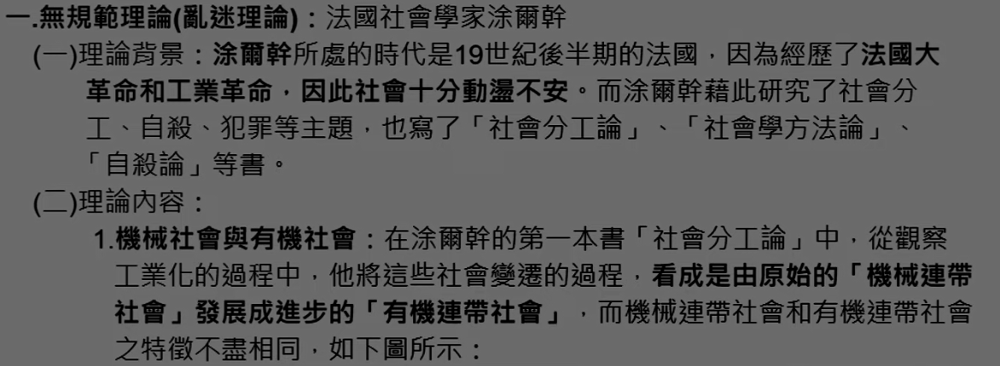
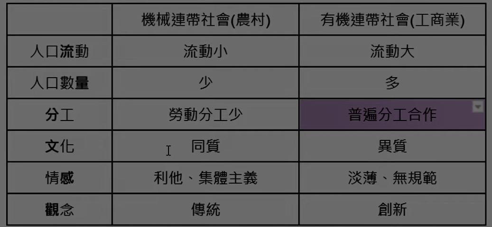
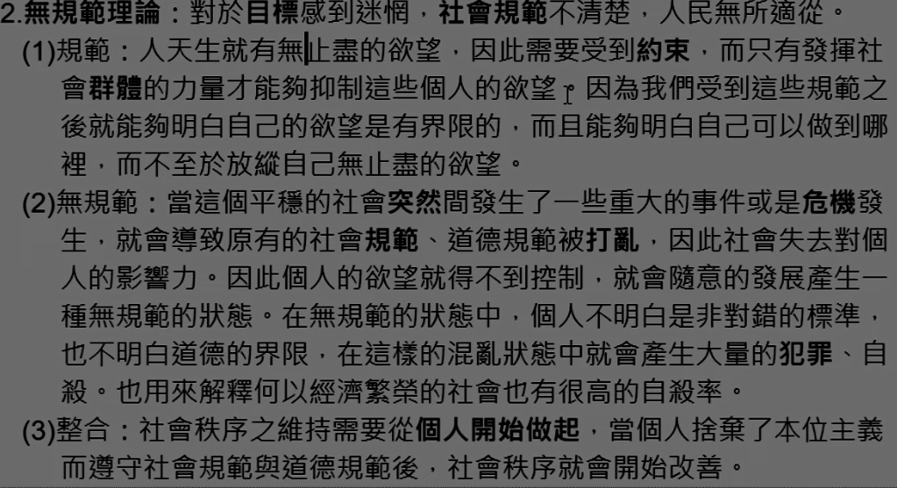
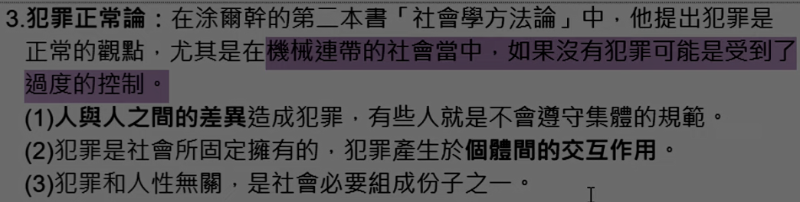
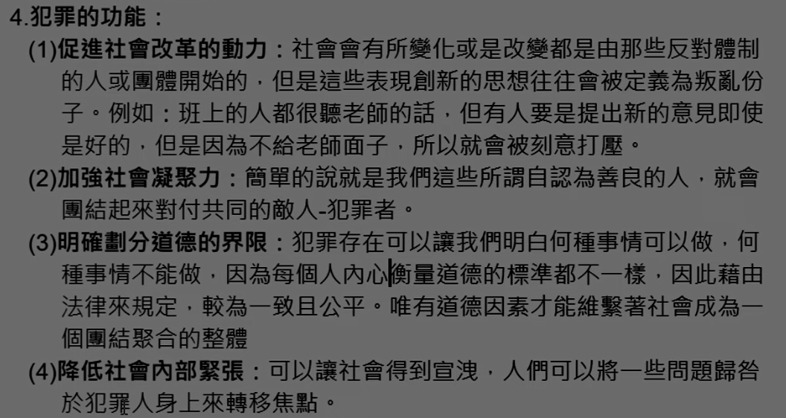
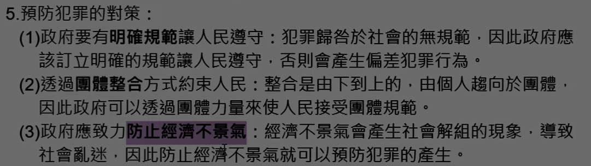
 -->

### 二、芝加哥學派（犯罪區位學）：

<!-- v35 -->

### 二、芝加哥學派 / （一）派克的社會生態理論：

派克研究社會學的當中發現了人類依附彼此的生存方式，類似於生態學的觀念，再導入了生態學的觀念後，他提出了兩個概念：

1. **共生**現象：人群與社區之間是一個共生互相的關係，並非只是單純的地理上的關係。
2. **侵入、統治、接替**的過程：在生態學中，一個物種侵入一個區域會導致弱的物種被驅趕，派克發現人類社會也是如此，優勢團體或人種侵入一個地區後會利用自身的優勢慢慢的形成統治的情況，最後完全的將舊有的弱勢團體剔除達成接替的作用。例如：南美洲的馬雅和阿茲特克文明因為西班牙入侵而毀滅。

<!-- 
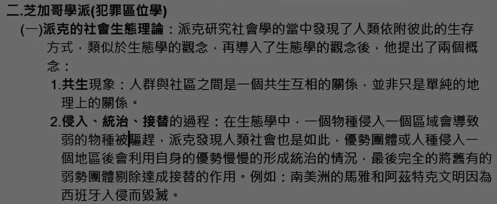
 -->

### 二、芝加哥學派 / （二）伯格斯的**同心圓理論**：★

伯格斯發現城市的發展也有類似侵入、統治、接替的過程。

1. 他將芝加哥市由內到外分成了5個同心圓的主要區域，依序如下：  
   A. **中心商業區**：商業大樓、百貨商場、政府部門所在地。  
   B. **過渡區域**：包含鄰近市中心的工廠，這裡總是居住著最貧窮的居民。  
   C. **工人住宅區**：居住者為了擺脫目前貧困生活的工人們。  
   D. **中產階級住宅區**：有著獨門獨戶的房舍或是昂貴的公寓。  
   E. **通勤區**：由一些小都市、城鎮和村落構成，有工作能力的居民白天到中心區商業區工作，夜晚才回到住處。
2. **自然區域**：在城市的發展中，每個區域中都有一些種族相同、風俗習慣和價值觀相同的群體聚集在同一區域範圍，形成一些較小的區域。
3. **間隙區**：由於原本在此的居民經濟條件好之後就前往更高階的區域，而此地就剩下新來的移民，當新移民有能力又會再前往更好的區域，而此地的*文化風俗、價值觀將難以共同一致*，就形成間隙區。例如：同心圓模式第2圈的過渡區域。

<!-- 
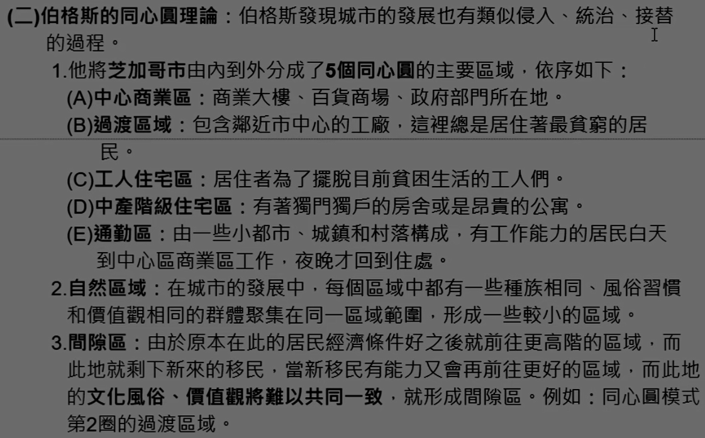  
 -->

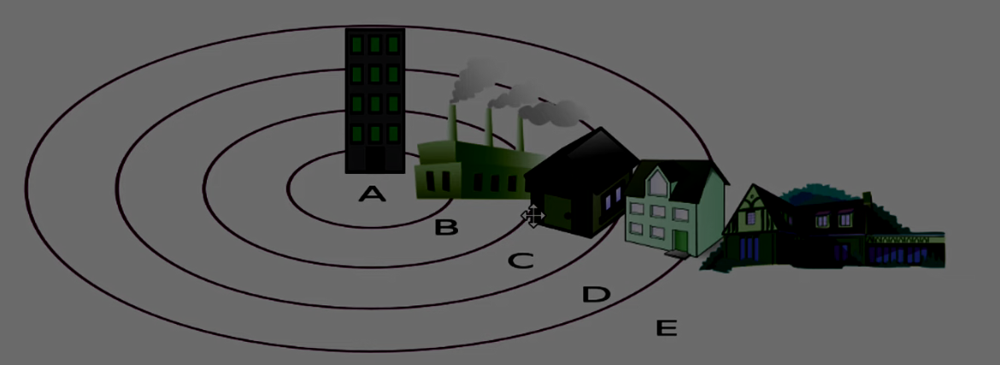

### 二、芝加哥學派 / （三）犯罪區域相關因素：

1. **物理**因素：犯罪率最高之區域大多是*重工業區或商業區*。  
2. **經濟**因素：低經濟條件容易導致高犯罪率。  
3. **人口**組合：高犯罪率與外國移民和黑人的數量有高相關。

<!-- 
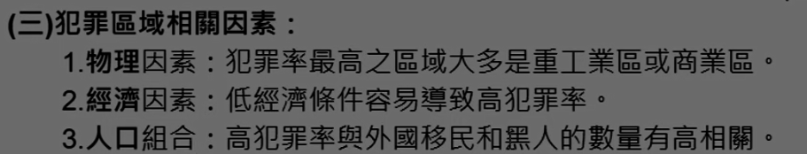
-->

### 二、芝加哥學派 / （四）蕭和馬凱的少年犯罪研究：★

1920 年代蕭和馬凱利用了派克的社會生態學論和伯格斯的同心圓理論來研究犯罪，尤其著重於研究少年犯罪。他們認為少年之所以會犯罪不一定是因為生物或心理因素，而是因為他們「*脫離了傳統的群體*」。他們認為少年犯罪和所處的區域和環境有關，因此它們主要在分析少年犯罪率最高的鄰里，找出是哪些特徵導致少年犯罪。

#### 1. 繪圖研究法：

蕭和馬凱使用了一種繪圖技術，將處於「*刑事司法系統不同階段*」的少年的居住區域標示出來，另外繪製了比率圖顯示*捲入犯罪的人口百分比*。他們比較這兩種圖發現，少年犯罪率最高的地區，不一定是少年犯罪人數最多的地區。最後利用了一種區域圖來顯示少年犯罪在同心圓理論中各區的發生率，並且發現少年犯罪有集中於**市中心**的趨勢。

#### 2. 少年犯罪區：

城市中確實存在著一些少年犯罪率特別高的區域，這些區域具有下列特徵： 
(1) **集中**原則：少年犯罪率最高的區域位於重工業或商業區或是與其相鄰，也就是所謂的*過渡區*或*去間隙區域*。  

(2) **距離**原則：犯罪通常和金錢有關，金錢則和商業有關，因此犯罪會依附於商業區，反倒是離市區較遠的高級住宅區或是通勤區的犯罪率較低。  

(3) **傳承**原則：這些少年犯罪區域，不論人口的遞嬗組成，都維持著高犯罪率不會改變。因為犯罪副文化已經形成，因此這些犯罪與偏差行為會一代一代的傳下去。  
（少年犯罪與侵入、統治、接替的過程關係圖）「新移民侵入，共生關係被破壞，然後重新融合。

_____

**社區解組、外來團體入侵** —— 新移民侵入，共生關係被破壞要然後重新融合。最後會成為新的自然區域。但該區自然組織已被破壞。

\>>>>

**青少年缺乏鄰里控制** —— 最初的人口離去，原本控制的力量不在。鄰里處於變化之中，居民情感疏離，青少年也得不到關注。

\>>>>

**產生自有犯罪副文化** —— 入侵的文化和位於本未離開的文化相衝突。

\>>>>

**持續犯罪偏差行為** —— 第二圈的地區會不斷的被新移民入侵，不斷的重複上述過程。

<!-- 
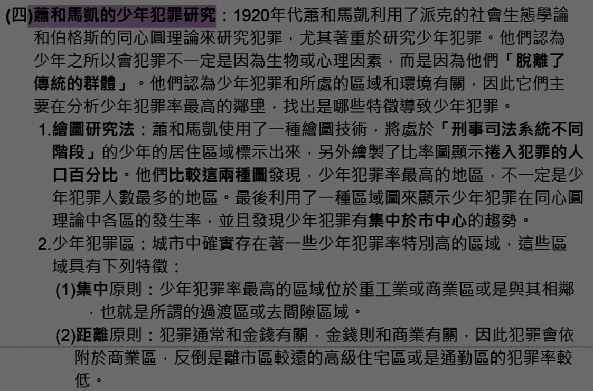  
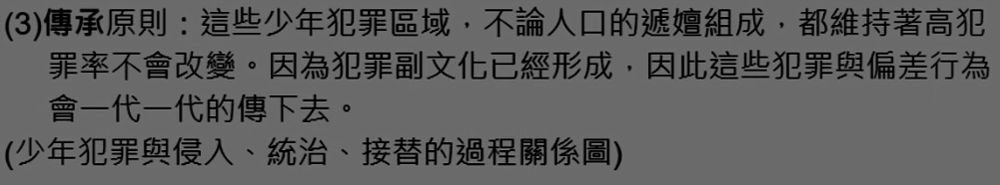  
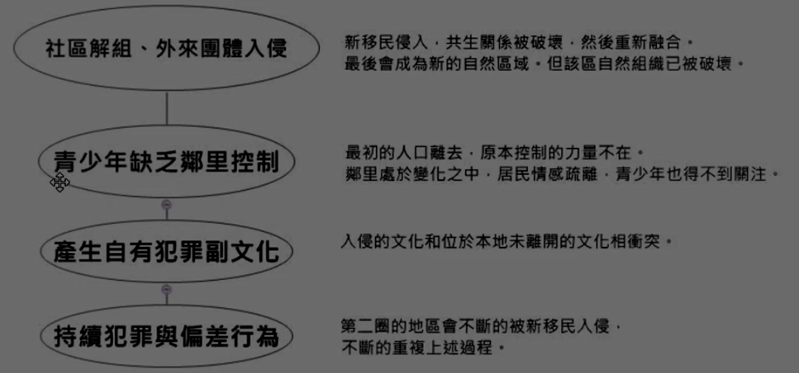
 -->

#### 3. 犯罪防治對策：

(1) **改造社區**：會造成青少年犯罪率高主要是因為社區內不斷的產生侵入、統治、接替的作用，產生社會解組、文化衰退所導致。所以希望由改造社區形成強力的社會控制力量來抑制犯罪的發生。

(2) 加強**共同社區意識**：預防犯罪需要社區內民眾擁有共同之意識，共同參與活動，並結合各種資源。當社區民眾都結合再一起，犯罪在這些社區自然就會減少。

(3) **實施區域計劃**：擁有美滿的家庭以及良好的生活環境可以預防犯罪，自 **1932** 年起提倡「芝加哥區域計畫」，由芝加哥市的6個地32個鄰里組成，雖然最後宣告失敗，但仍然有其研究價值。

#### 4. 研究貢獻與缺失：

(1) 貢獻：開啟了研究的**新領域**，從過去的生物以及心理方面的研究進入犯罪社會學以及環境犯罪領域的研究。

(2) 缺失：
A. **犯罪假設過於簡單**：犯罪形成原因並非都只是團體進出遞嬗所導「致無法解釋有些人雖長期居住高犯罪區仍不犯罪。
B. **信度不足**：理論多使用官方資料，有高犯罪黑數。
C. **犯罪率假設有偏差**：犯罪率未必如圖所示越外圈犯罪率越低。

<!-- 
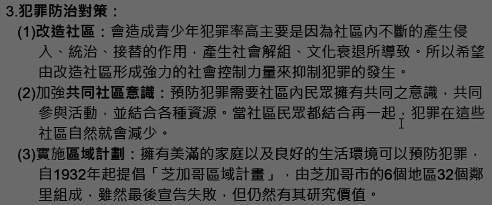
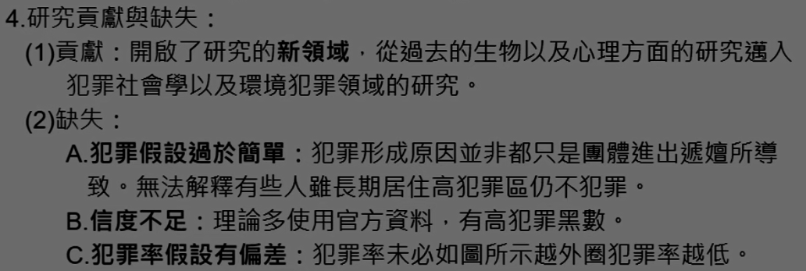
 -->

### 二、芝加哥學派 / （五）芝加哥區域計畫：★

<!-- v36 -->

此計畫是在 **1932** 年由**蕭**發起的美國**第一個**「重大的預防犯罪計畫」。依照萧和馬凱對於芝加哥地區少年犯罪的研究，他們發現造成犯罪率高的主因是貧民區的物理環境和價值觀造成的。因此想要*改變犯罪率就要從改變環境、更新價值觀*，使用其他的傳統文化來代替原本的犯罪副文化。因此它們挑選了芝加哥少年犯罪率最高的 **6** 個區域建立了 **23** 個鄰里中心，管理了約 **7500** 名兒童。而在此鄰里的主要功能有3個：

1. 協調教堂、學校、公會間的**資源分配**。
2. 辦理多項有益於青少年的**活動**，使當地居民更緊密結合。
3. 擴建娛樂設施，改善學校和社區的**關係**。

此外這計畫最重要的就是釋放後的**更生計畫**，鼓勵犯人在釋放後回到社區參加委員會的工作，並且幫助他們融入社區。這個計畫創造了一個能就接納釋放後犯罪人的氣氛，讓他們能夠重新被接受，能夠有認同感。這個計畫實施到 1957 年蒂去世為止，也使得美國各地也有許多類似的計畫。

<!-- 
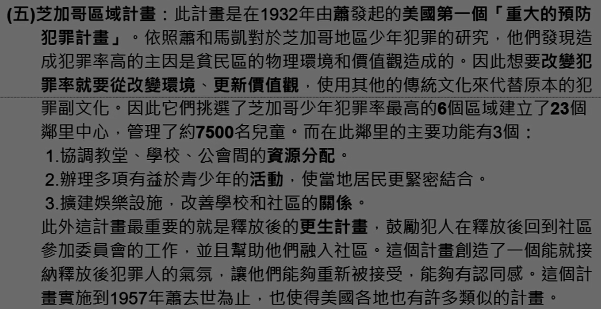
 -->

### 二、芝加哥學派 / （六）集體效能理論：

**集體效能理論**源自於芝加哥學派社會解組的觀點。在鄰里中因為熟悉、信任和支持，彼此建立起一個超越家庭的**社會網絡**，並且形成某種**規範**讓社區內的居民遵守，這就叫做**社會資本**。*當社會資本減少的時候就會產生社會解組效應導致犯罪率提升*，因為這時候並沒有一個大家會遵守的規範，社區並沒有一個有效的社會控制機制。因此有學者提出「**集體效能**」的概念，集體效能是一種**社會凝聚力**的機制，當居民都彼此信任且團結的時候就會產生非正式社會控制的力量。因此提出此理論的學者**辛普森和格洛斯**指出，只有在住戶都具有信任、團結、具有共識的時候，社區的集體效能才可以凝聚，這效能可以**緩和資源分配不均**的現象以及**居民流動率**和**維持良好的治安**。也會讓社區較少產生侵入及解組的情況。

<!-- 
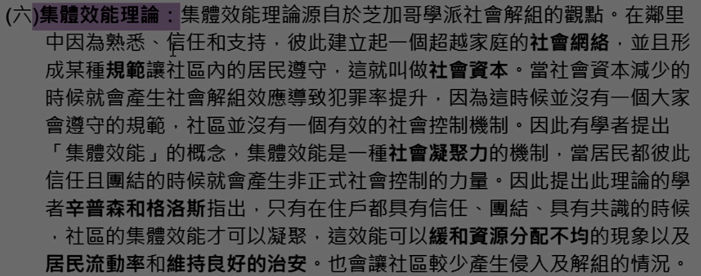
 -->

## 貳、緊張理論

雖然緊張是翻譯後的結果，但是我們從字面上開始想，既然叫作緊張理論，那麼就代表緊張會讓人犯罪，然後你就覺得很怪，緊張就會犯罪？當然這邊的緊張不只有那麼單純的解釋，這邊的*緊張代表的是挫折、憤怒、不甘心之類的情緒*。這些情緒讓人犯罪你就比較好理解了吧！那這些緊張情緒）怎麼來的呢？既然緊張理論是社會結構的分支，就是因為*社會結構導致這些緊張*（情緒）的。社會結構上我們社會看似平等其實有各種階級，統治者、白领、藍領、貧民之類的階級。如果你是一個貧民，你在正常情況下會用正常方式努力往上爬，當你*尋求正常管道往上爬卻永遠爬不上去，就會產生這些挫折、憤怒、不甘心的情緒了。於是正路不通但是又想成功，只好走歪路（犯罪）*。簡單的說就是一個下階層的人，使用正常手段往上爬如果沒用，就會產生緊張情緒，然後就會使用非法手段。

### 一、古典緊張理論：★★★

<!-- v37 -->
> （申論必寫 內涵、社會適應的方式。選擇題易出題）

#### （一）代表人物：

美國社會學家**墨爾頓**將涂爾幹的無規範理論運用於美國社會，提出了他自己的緊張理論，為了要和後面*安格紐的一般化緊張理論*名稱區隔開來，通稱墨爾頓的緊張理論為古典緊張理論。

#### （二）理論內涵：

我們所存在的社會中有一個**共同一致的文化目標**，但是要達到這個目標的**方法**，卻因為社會階層和地位的不同而**有所差別**，因此當下階層的人無法用合法的手段來達到社會上承認的目標時，就會產生挫折、憤怒等情緒。這些就是所謂的緊張情緒，會導致無法用合法手段達成目標的人改用犯罪的手段來達成。墨爾頓認為，各種文化社會都有以下的特徵：

1. **確定的文化目標**：每個文化社會中都會建立一些每個人都認為值得追求的目標，這鼓勵了每個社會中的成員為了目標而努力奮鬥。例如美國夢，在美國追求財富就是一切，如果沒有財富就沒有地位。但這樣的目標並非每個人都可以達到的。
2. **規定的文化手段**：在任何一個社會中都會以規範、制度等形式規定達到目標的手段、方法，這種稱為「制度性手段」，代表著每個人都該使用這個方式去達到目標。這些手段仍然以文化價值為基礎，雖然有些人會以暴力或是欺騙的手段來獲得財富，但這並不是受到認可的方式。因此如果不使用文化規範的手段去獲得財富，就會被定義為犯罪行為。
3. **當手段和目標矛盾時**：當個人無法利用制度性的手段來達成目標，就會產生一種失調不平衡的狀態，墨爾頓稱作為緊張，這可能是憤怒、悲傷一些不好的情緒。人們會使用一些「社會適應方式」來舒解這些壓力和情緒。緊張特別集中於下階層，因為獲得財富不只是受到個人能力和努力的限制，還會受到這個社會結構本身不利於下階層的限制。而在上流社會的人緊張較不明顯，因為他們可以使用許多制度性的手段來獲得財富。

#### （三）社會適應的方式：

（選擇題易出題）

1. **順從型**：*接受著傳統目標使用著制度性的手段來達成目標*，也是大多數人的選擇方式，不管成功與否都會繼續這樣去做。
2. **儀式型**：*拒絕傳統的文化目標但是卻使用制度性的手段來達成*，其實並不明白自己真正要的是什麼，只是看著別人怎麼做自己就怎麼做。因為沒有目標，即使沒有達到目標也不會沮喪。
3. **革新型**：*接受社會認可的文化目標但是拒絕使用制度性的手段來達成*，這些人雖然明白要朝著這些目標前進，但同時也明白自己無法使用這些公認的制度性手段來達成，因此就會想另闢蹊徑使用其他旁門左道的方式來達成，就很容易造成犯罪。
4. **反叛型**：*希望使用新的文化目標和手段來取代目前的文化目標和手段*，這種完全的拒絕現行的目標和制度，期望自己創造一個新的社會秩序，例如：革命份子。
5. **退縮型**：*這種人也是不接受社會上的文化目標和手段*，但是也沒有想要建立起新的秩序，只是慢慢地退出社會之中。實際上這種人是所謂的*雙重失敗者*，因為無法用正常手段達到目標也無法使用非法手段達到目標，只能消極的逃避然後退出。例如：吸毒者。

|   | 適應方式 | 文化目標 | 文化手段 |
|---|----------|----------|----------|
| 1 | 順從型   |    +     |    +     |
| 2 | 革新型   |    +     |    -     |
| 3 | 儀式型   |    -     |    +     |
| 4 | 退編型   |    -     |    -     |
| 5 | 反叛型   |    +-    |    +-    |

#### （四）缺點：

1. 對*一致的文化目標感到質疑*，因為社會是多元的並非一致的。
2. 無法解釋*為何有人成為犯罪者，有人仍然守法*。
3. *無法解釋中產階級的犯罪*，例如：白領犯罪。

#### （五）預防犯罪方式：

1. 給予*實現目標的管道*：既然造成犯罪的原因是因為本身的環境造成無法使用合法手段達到目標，那麼給予更多的合法管道就可以有效的抑制犯罪。例如：提供更多的就業和教育機會。
2. *改善下階層*的生活：低下階層的環境因為缺乏成功的手段因此容易用非法的手段來達成目標，因此改善他們的生活也是讓他們擁有更多資源使用正確的手段來競爭。
3. 給予*明確的規範和法治教育*：有的時候犯罪是因為不了解法律和規範，因此若能夠使法令明確並且配合學校的法治教育，可以教導青少年明白那些行為不能做，有效的防治青少年使用非法手段來達成目標。

<!-- 
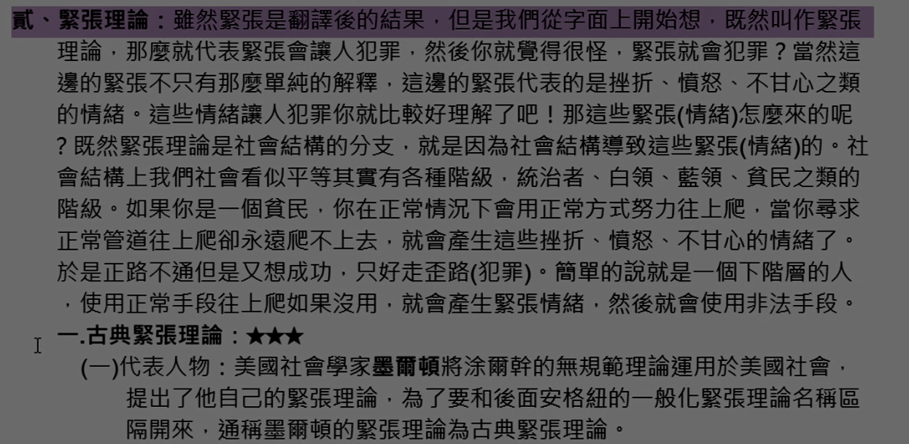
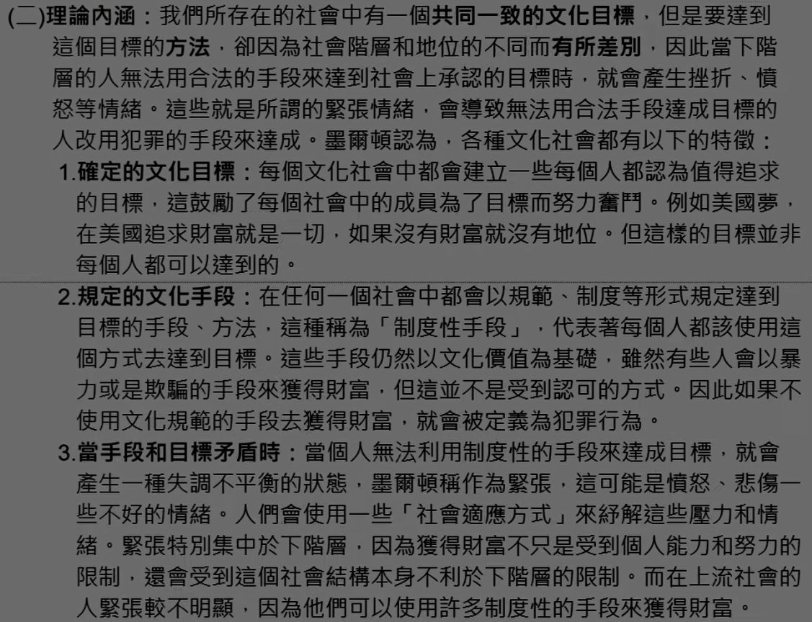
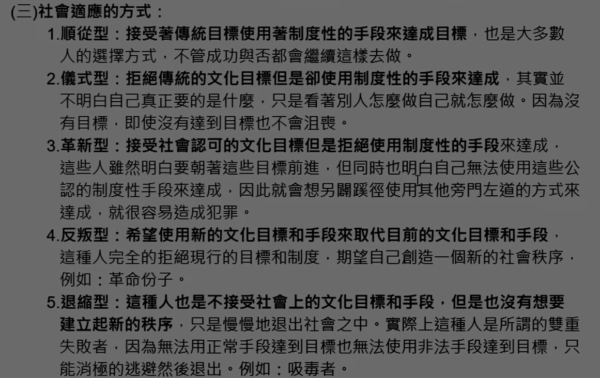
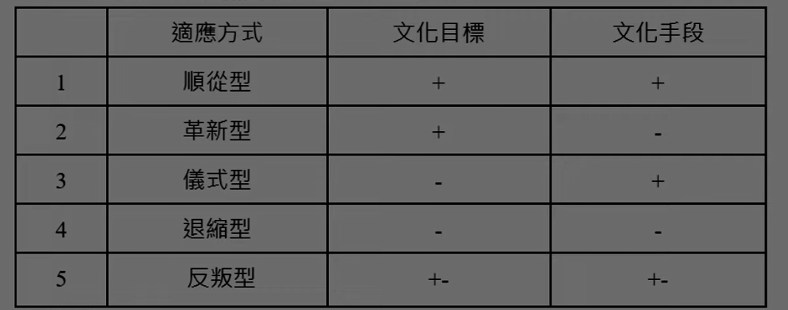
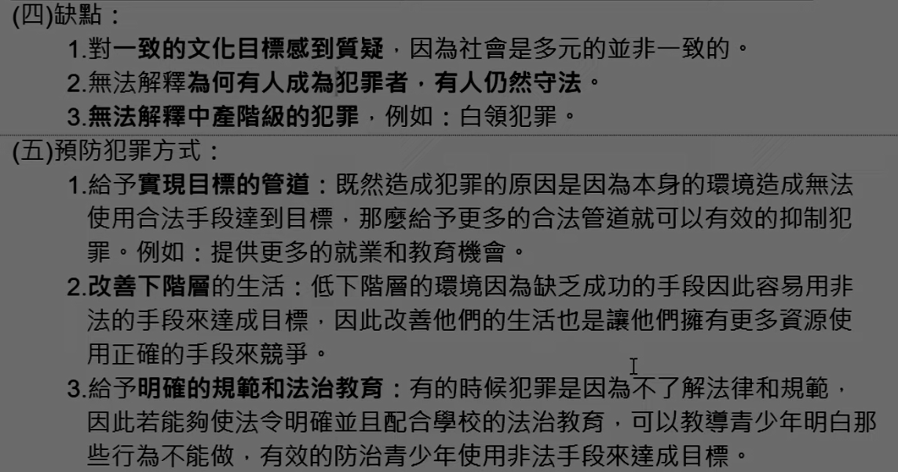
 -->

<!-- v37 -->
### 二、一般化緊張理論：★★★★★

<!-- v38 -->

### 二、一般化緊張理論 / （一）代表人物：

美國犯罪學家**安格紐**覺得墨爾頓的緊張理論太強調低階層青少 年的犯罪，忽略中上階層的犯罪，因此他**修正了墨爾頓**的理論提出了「一般化緊張理論」，採取微觀的角度來觀察犯罪人，認為**負面的人際關係**產生負面的情緒，**負面的情緒**則容易**產生犯罪行為**，而且這標準是放在各階層都通用的。

### 二、一般化緊張理論 / （二）理論內涵：

#### 1. 安格紐：★★★★★

安格紐期望可以用緊張來解釋社會各階層的犯罪，他認為物質或經濟並非造成犯罪的唯一因素，犯罪是因為「**負面影響狀態**」（或稱負面情緒狀態）所導致，所謂的負面影響狀態主要是一些像*憤怒、挫折、悲傷等負面情緒的集合*。這些情緒主要是一些重要的社會關係受到破壞而引起的，安格紐的緊張類型主要有下列四種：

(1) **未達到正面評價的目標**：這種緊張即是墨爾頓緊張理論中的緊張，也就是追求著社會上認可的文化目標，使用社會認可的手段卻達不到目標時會產生的緊張。

(2) **期望和成就的差距**：我們常會和朋友或同輩比較，當發現自己和別人差距太大或是非常努力卻怎麼都比不上別人時會產生緊張

(3) **移除個體所擁有之正面刺激**：當個人所重視的刺激失去後，可能會產生緊張感，例如：失戀、被父母罵、失業、失怕。當產生這類型的緊張後，為了得到補償或是重新得到失去的正面評價，可能會對造成緊張的人報復。（EX恐怖情人）

(4) **加諸個體之負面刺激**：負面刺激指的是讓個體受傷害的事物，例如：虐待、霸凌、疏忽、挫折、生活壓力等。這時候會為了減輕痛苦與壓力而犯罪。

#### 2. 緊張與犯罪的關係：

緊張是各種不同的負面影響情緒，這些情緒都是獨立存在的，而隨著緊張的強度和頻率增加，可能會造成思考上的失控因而犯罪。其中*最重要的負面情緒是憤怒*，憤怒會增加傷害、侮辱的感受度，會讓人容易失去理智，產生報復的慾望進而有攻擊的行為。

#### 3. 排除緊張的方式：

緊張會引起負面情緒，因此我們可以把負面情緒當成是一種預兆。雖然個別的緊張都有可能引發犯罪，但是也有許多人在同樣的情境下沒有犯罪，他們會利用調整情緒、心理狀態、行為來應付這些負面情緒，這些因應的策略可分為下列3種：

(1) **認知應對策略**：經由思考將負面的遭遇轉向為正面。
(2) **行為應對策略**：以非偏差的行為來排解壓力，例如：運動、參加活動、找人聊天。
(3) **情感應對策略**：修復導致負面的情感關係，例如：接受輔導、尋求他人的慰藉。

### 二、一般化緊張理論 / （三）一般化緊張理論和古典緊張理論的差別：

<table>
	<!-- row 1 --> 
	<tr>
		<td align="center"></td>
		<td align="center">古典緊張理論</td>
		<td align="center">一般化緊張理論</td>
	</tr>
	<!-- row 2 --> 
	<tr>
		<td align="center"><b>學者</b></td>
		<td>墨爾頓</td>
		<td>安格紐</td>
	</tr>
	<!-- row 3 --> 
	<tr>
		<td align="center"><b>探討角度不同</b></td>
		<td>巨觀角度 以整個社會結構為主軸</td>
		<td>微觀角度 強調個人之緊張</td>
	</tr>
	<!-- row 4 --> 
	<tr>
		<td align="center"><b>研究對象不同</b></td>
		<td>主要以下階層青少年為主要研究對象</td>
		<td>研究對象各階層都有</td>
	</tr>
	<!-- row 5--> 
	<tr>
		<td align="center"><b>緊張定義不同</b></td>
		<td>是對於所處的環境或階級無法達到目標時的一種反動結果</td>
		<td>每個個體都會有緊 張情緒，無關階級</td>
	</tr>
	<!-- row 5 final --> 
	<tr>
		<td align="center"><b>緊張來源不同</b></td>
		<td>文化目標與文化手段產生了誤差導致身分挫折而產生壓力，使用犯罪手段當作文化手段來達達到文化目標</td>
		<td>吸收古典緊張理論後提出數種會讓人產生緊張情緒的緊張類型。未到正面評價、期望和成就的差距、移除正面刺激、加諸負面刺激</td>
	</tr>
</table>

### 補充：緊張理論對於性別犯罪之論述：

#### （一）安格紐研究男女產生緊張的不同處：

1. 古典緊張類型上的不同：
   1. 男性：關注於**物質**、**成就**，在乎競爭是否公平，資源分配的公平。  
   2. 女性：關注**人際關係**維持及生活的目的和意義，在碎的是互動中被對待公平，也就是過程的公平。

2. 其他緊張類型上的不同：
   1. 男性：常處於競爭與衝突中，較可能被他人**攻擊**或是成為情緒宣洩的出口。
   2. 女性：較多來自於加諸於**性別上的壓力**，例如：性別歧視、行為受限制。

#### （二）緊張導致的不同的犯罪行為種類：

1. 男性：有較多經濟上的責任因此產生經濟上的緊張，容易導致**財產型**犯罪，也容易有人際衝突產生的**暴力**犯罪。  
2. 女性：因為較高的社會控制力和較少的犯罪機會，導致將情緒壓抑。因此容易形成退縮型的**性犯罪**或是**自殘**等傷害自己的偏差行為。

<!-- 
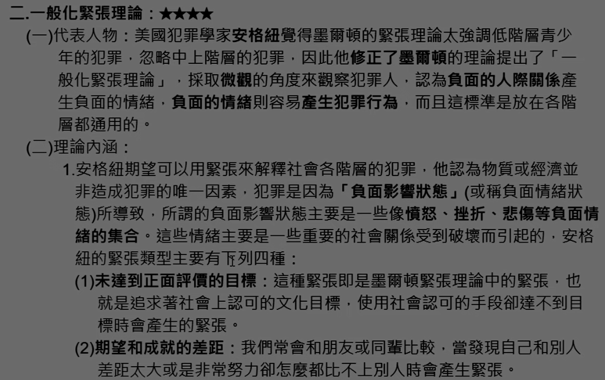  
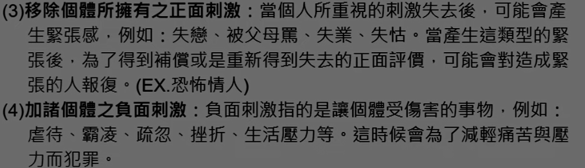  
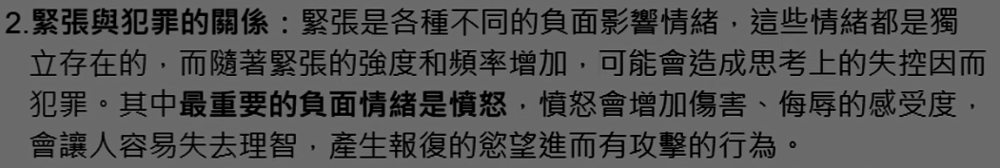  
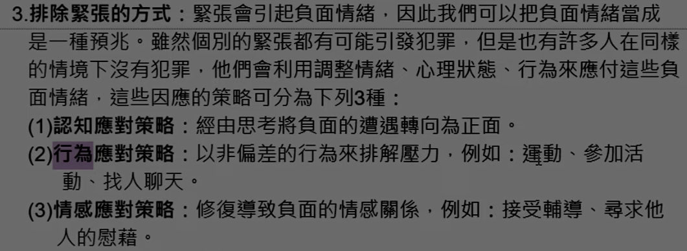  
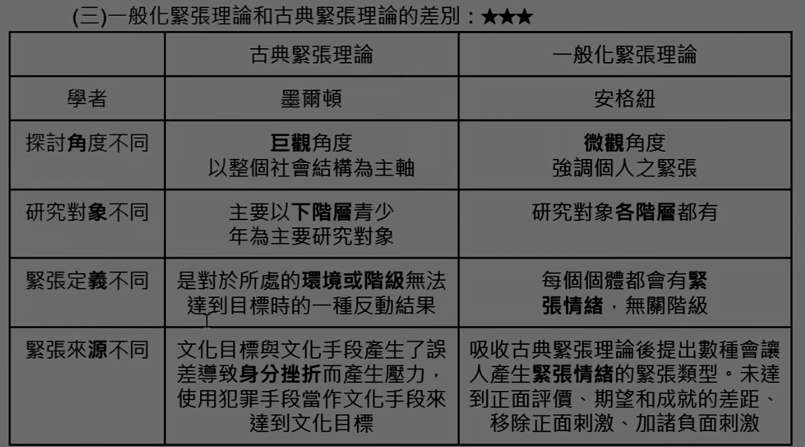  
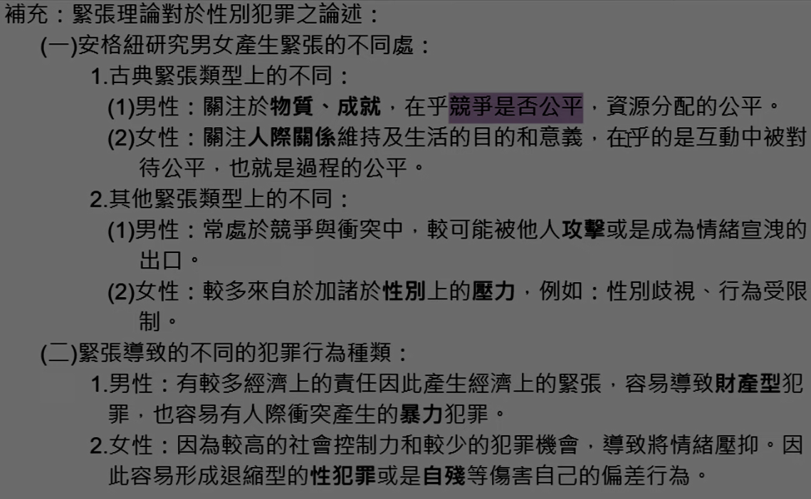
 -->

### 三、制度性緊張理論（機構性亂迷）：（美國夢）
<!-- v39 -->

### 三、制度性緊張理論（機構性亂迷）： / （一）代表人物：

梅斯納 & 羅森菲爾

### 三、制度性緊張理論（機構性亂迷）： / （二）理論概說：

梅斯納 & 羅森菲爾在其 1994 年出版的《犯罪與美國夢》一書中提出了制度性緊張理論。此理論*復興了墨爾頓的緊張理論*，主要是專注於研究美國人擁有的「美國夢」，以及為了*達到美國夢要可以用盡一切手段*去達成的共識，因此常導致犯罪的發生。

### 三、制度性緊張理論（機構性亂迷）： / （三）理論內涵：

1. 復興了黑爾頓的古典緊張理論：黑爾頓的緊張理論於1970年代後逐漸沒落，此理論以美國社會中追求財富的美國夢為主題，也是以宏觀的角度來看待社會上的緊張。
2. 美國夢與亂迷：
   1. 美國夢*強調成功，但是不強調手段*。
   2. 強調**個人主義**，他人都是對手，不理他人感受。
   3. 強調**財富與經濟能力**，可能會導致下階層的人達成目標就使用犯罪手段來達成。
3. **資本主義**的經濟力量主導一切：這是一個迴圈式的循環。
   1. 首先太過**重視經濟實力**，導致經濟制度影響了家庭與教育等非經濟制度的功能。  
   2. 然後發生衝突時都會以**經濟制度為考量**，因此這些家庭和教育等非經濟制度，會努力適應經濟制度，所有學習與成長一切都是為了長大後的就業，也是為了經濟。  
   3. 經濟制度**滲透**到所有的非經濟制度讓人習以為常，導致人們不管做任「何事情都會以利益、經濟為老备。因此美國社會十分現實。

#### 三、制度性緊張理論（機構性亂迷）： / （三）結論：

為了減少這種對於追求美國夢導致的緊張感，應該*多重視非經濟制度*。在家庭方面勿讓父母過於追求經濟而忽略**家庭教育**，學校方面應多開發各方面的**興趣和技能**而不是只關注於就業和賺錢，文化方面應多鼓勵民眾重視彼此間的關係以及社區間的關懷與支持減少對於特權、利益的強調。政府方面應多鼓勵民眾參與社區活動、組織關懷行動。

<!-- 
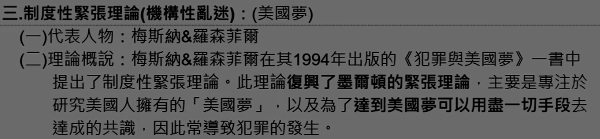  
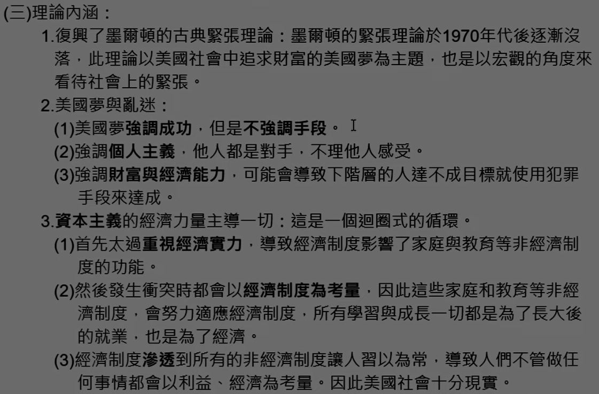  
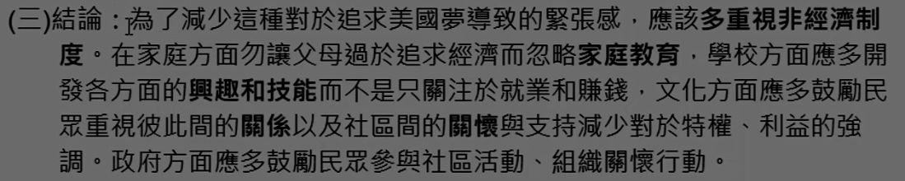
 -->

## 参、犯罪副文化理論

副文化是指在特定階級、團體或是族群中所發展的*生活方式、價值觀、規範、信念*。次文化本身並沒有對錯，但如果和主流文化不合則容易被冠上犯罪的名稱形成犯罪次文化，也因此犯罪次文化多出於下階層。以下介紹5種常見的犯罪次文化理論。

口訣：下次不暴衝（下階層文化衝突理論、犯罪次文化理論、不同機會理論、暴力副文化理論、文化衝突理論）

<!-- 
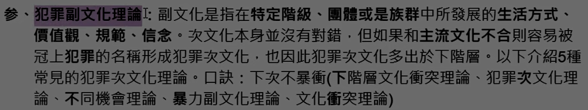
 -->

<!-- v40 -->
### 一、文化衝突理論：

### 一、文化衝突理論： / （一）代表人物：

瑞典犯罪學家雪林在1938年出版的《文化衝突與犯罪》一書中提出文化衝突理論。

### 一、文化衝突理論： / （二）理論內涵：

1. 犯罪是**中產階級犯罪化下層階級**：文化衝突理論充滿著衝突觀和互動觀的概念，社會上有一種文化稱為主流文化就是傳統的中產階級文化。而刑法就是用來保護中產階級利益，犯罪化不遵從主流文化的行為。
2. 以**法律定義犯罪是有缺失**的：刑法定義的犯罪會隨著時空的不同而改變，在犯罪研究上不應以法律為基礎，而是要以犯罪行為為基礎。
3. 犯罪是遵守**非主流文化的行為標準**：在一個多元的社會中我們可能都會隸屬與不同的文化團體，當我們所遵守的團體規範可能不利於另一個團體時即可能產生衝突，若對方是主流團團體就可能運用本身實力犯罪化敵對的團體。因此雲林認為「人並不會犯罪，只是遵守一套與主流文化標準不同的行為標準而已。」
4. 文化衝突的類型：
   1. **移民**產生的文化衝突：移民者的文化和移民地的文化格格不入，導致無法適應產生文化衝突。
   2. **社會轉型**的文化衝突：例如涂爾幹亂迷理論中，從機械連帶社會變成有機連帶社會的過程中產生不適應導致的衝突。
   3. **空隙區**的文化衝突：空隙區因為進進出出很多，沒有一個主流文化的存在，導致遵守的次級文化是被視為犯罪的。

### 一、文化衝突理論： / （三）預防文化衝突的政策：

（針對歪果仁）

1. 落實外籍人士對本國語言及風俗習慣之學習。
2. 暢通外籍人士諮詢與申訴管道。
3. 政府管控入台人數及去處。
4. 注重外籍人士之母文化，舉辦相關活動。
5. 重視外籍人士之人權及工作權。
6. 灌輸法治觀念。
7. 對子女不可差別對待，若有需要社福單位應介入幫助。

### 一、文化衝突理論： / （四）缺點：

1. 無法解釋中產階級的犯罪如何產生。
2. 缺乏驗證方法。
3. 概念不明確，太類似於衝突觀之犯罪論。
4. 有許多犯罪行為未必源自於文化衝突。

<!-- 
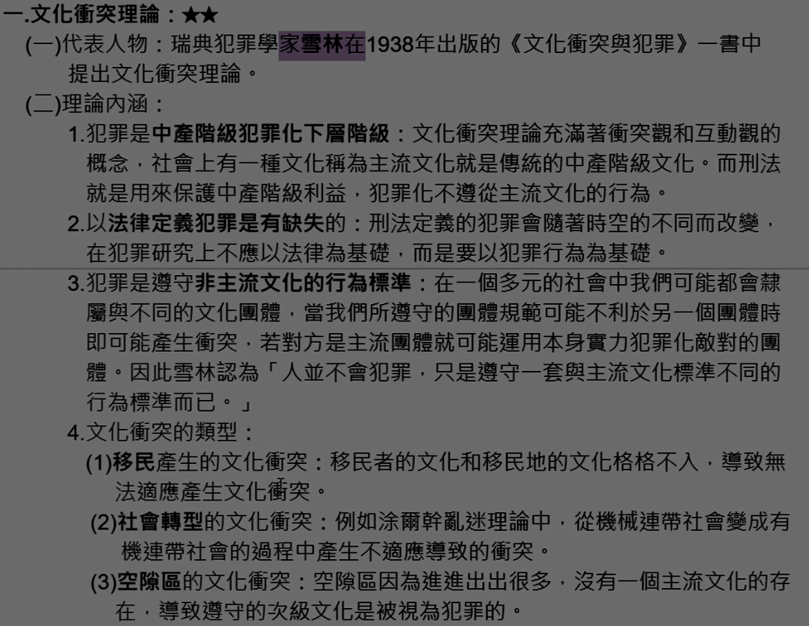  
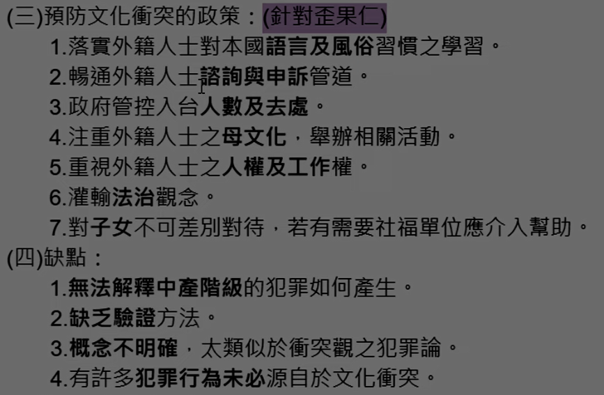
 -->

### 二、下階層文化衝突理論：
<!-- v41 -->
### 二、下階層文化衝突理論： / （一）代表學者：

美國犯罪學家米勒在1958年發表的論文中提出了下階層文化理論。認為犯罪是*下層階級吸收其文化環境中的行為規範和價值觀所做的正常反應*。因為下階層文化生來就和中產階級的文化不一致或是衝突，因此本來就容易包含犯罪的成分。吸收這樣的文化，遵守這樣的行為規範和價值觀而行動，就必然會產生犯罪，而且下階層文化會代代相傳下去。米勒並以「**焦點關心**」來解釋下階層幫派產生及活動的原因。

### 二、下階層文化衝突理論： / （二）理論內涵：

米勒在研究工人和少年黑幫的活動中發現這些貧民區和工人群聚的區域有著一種特殊的文化價值觀。這些下階層的文化自成一個體系，卻未必和中產階級的文化接軌，但是卻很適合在這些貧困階層的生活環境，*而犯罪就是遵守這些文化價值觀的產物*，因此下階層文化有幾點基本假設如下：

1. **下階層文化有犯罪要素**，犯罪是其價值觀和文化的表現，且會代代相傳。
2. **安心於自我文化**：下階層人民無法達到中產階級的文化目標，於是遵從下「階層文化與價值觀在其中得到安心與滿足。
3. 與主文化對立中學習到犯罪惡習。
4. 犯罪是順從下階層文化的結果，並非有不適應或緊張的反應。

### 二、下階層文化衝突理論： / （三）焦點關心：

焦點關心是一種使青少年易於犯罪的特殊價值觀，這是為了適應下階層的特殊生活所發展而來的。其內容如下：

（搶了炸雞認性）

1. **逞強**（強悍）：青少年藉由打架或是運動來展現自我或作為一種防衛的展示。在下階層的文化中若不這樣做就會被被嘲笑，若是在缺乏男性的家庭中成長的少年，這種情況會更嚴重。
2. **惹麻煩**：在下階層的文化中，人們以是否能製造麻煩做為衡量其能力的指標，麻煩種類例如：打架、挑釁執法人員、不正當性行為。但麻煩除了可能替自己帶來威望之外也是一個雙面刃，如果表現不好會導致嘲笑和販低。
3. **狡詐**：諸如小聰明、賭博、詐欺等技巧，利用本身的機智和最小的付出來得到豐盛的成果，這在下階層文化中值得尊崇的是傳統行為。
4. **刺激**：下階層成員時時刻刻都想要追求刺激來調劑其乏味的生活，其中包含飆車、酗酒、吸毒、打架等，這些行為都容易牵扯到暴力和性。
5. **認命**（命運）：相信宿命論，認為自己的生活和命運都是受到不可控制的力量在操控的，自己是無法決定自己的命運的。他們覺得就算是努力也無法擺脫貧困，反而喜歡算命等猜測天命的活動。
6. **任性**（自主）：喜歡自由和自主，不喜歡受到權威的束縛。它們藐視權威的來源，父母、學校，努力擺脫束縛。

### 二、下階層文化衝突理論： / （四）缺點：

1. 研究欠缺實證支持。
2. 忽視中產階級的影響：許多下階層青少年仍追求中產階級的價值觀，並非此理論中認為一律都會形成犯罪。
3. 無法適用所有下階層：主要研究集中在波士頓地區，但是在其他地區或種族的下階層中未必有如此情況產生。
4. 焦點關心並非必然造成犯罪：下階層文化中焦點關心只是一部分文化，也未必所有人都會遵循。況且犯罪率高的原因也有可能只是上下階層之互動及衝突所導致。

<!-- 
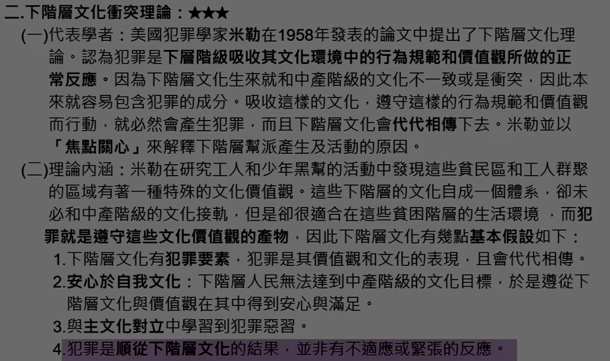
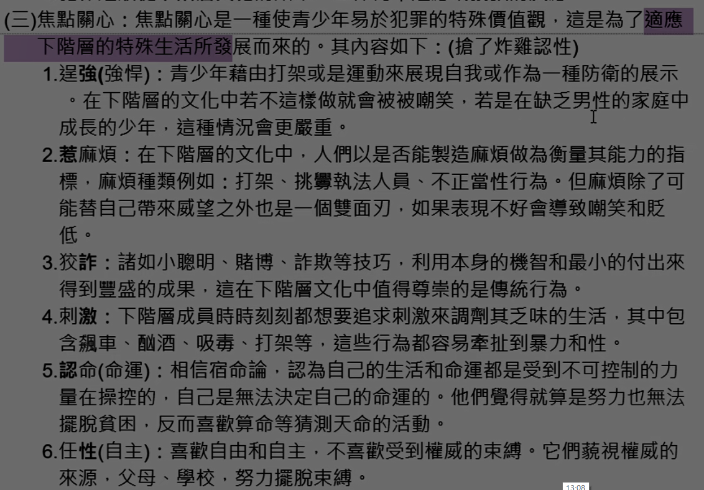
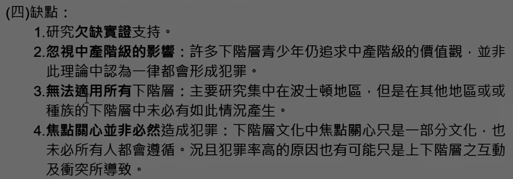
 -->

<!-- v42 -->
### 三、幫派副文化理論（犯罪次文化理論）：

### 三、幫派副文化理論（犯罪次文化理論）： / （一）代表學者：

美國犯罪學家柯恩，1955年在其書《少年犯罪人：幫派副文化》中提出幫派副文化理論，*下階級的少年因為無法達到中產階級的標準，產生了身分挫折後因而聚集再一起產生了一種適應下階層環境的副文化*。而這種副文化和中產階級的文化相矛盾，尊崇這種次文化必然導致犯罪的產生。

### 三、幫派副文化理論（犯罪次文化理論）： / （二）理論內涵：

#### 1. 柯恩認為：

結合了*墨爾頓的緊張理論和蘇哲蘭的差別接觸理論*，並將緊張理論做為其核心的觀點，柯恩認為下階層青少年的犯罪行為是對美國中產階級主流文化規範和價值觀的一種反抗。

#### 2. 中產階級衡量尺度：

美國社會是由中產階級所統治，因此人們不論種族、地位、文化有何不同，在社會上的任何表現都是用中產階級的尺度來衡量的。

#### 3. 下階層少年產生挫折的反應：

下階層少年對於自身的身分挫折通常會用下列三種方式來適應社會：

(1) **街角小孩**：有些青少年接受街角的生活方式，從事一些群體性的活動，偶爾也會犯罪，明白自己沒有能力達到中產階級的目標和地位，因此降低自己的生活目標，只要能以下階層的生活方式生活即可。因為已滿足自身的生活方式，不想因為犯罪而破壞掉目前的生活，因此最終會成為社會中穩定的份子。

(2) **大學小孩**：在下階層中有一些青少年奮發向上，以達成中產階級的衡量尺度為目標，然而因為大部分人的條件較差，因此只有少部分優秀人才可以達到成功。

(3) **偏差小孩**：這類型的青少年對於中產階級的價值觀採取一種對抗的態度，由於他們無法達到中產階級的衡量尺度，於是就對中產階級的成功採取嘲笑、敵對的態度。而這些青少年又很容易集結成幫派，形成一種特殊的文化，並藉由次文化中的活動來填補其無法進入中產階級的缺懷。

#### 4. 犯罪副文化的特徵：

這些是少年犯罪幫派中流行的一套價值觀和行為模式，參加少年幫派的人都會昭這些模式來思考、行動：（懷裡面多享團）

(1) 破壞性（邪惡）：喜歡故意違反規定，不為他人著想，將自己快樂建築在別人痛苦上。透過讓別人痛苦來感到快樂。  
(2) 非理性（非功利性）：犯罪本身並非是一種手段，而是一種目的，為了破壞而破壞，為了犯罪而犯罪。再從行動中宣洩緊張感來得到滿足。  
(3) 負面性：青少年的行為故意與大環境之主文化規範相悖離。  
(4) 多樣性：青少年犯罪不是很專業，但是嘗試的種類樣貌繁多。  
(5) 即時享樂主義：想到什麼就會馬上去做，不會考慮太多，主要是為了滿足自己之慾望。  
(6) 團體自主性：不能忍受合法權威人士所給予之限制及管教，但是卻接受次級文化團體的管理，因為在那邊才有歸屬感。例如：不良友伴、幫派。

### 三、幫派副文化理論（犯罪次文化理論）： / （三）優點：

1. 引起學界對於少年幫派和研究的興趣。  
2. 闡述了幫派少年副文化和少年犯罪間的關係。  
3. 提出少年使用三種方式來適應社會，有效解釋為何有人不犯罪。  

### 三、幫派副文化理論（犯罪次文化理論）： / （四）缺點：

1. 推論欠缺明顯證據工後續許多自陳報告的研究發現少年犯罪和社會地位以及身分挫折無關。  
2. 少年犯罪副文化未必和中產階級文化對立：例如中立化理論中提出少年仍遵崇中產階級價值觀，所以利用中立化技術來調適。  
3. 犯罪副文化的特徵未必都是非理性或無意義的破壞型，有時也是理性選擇下的決定。  

<!-- 
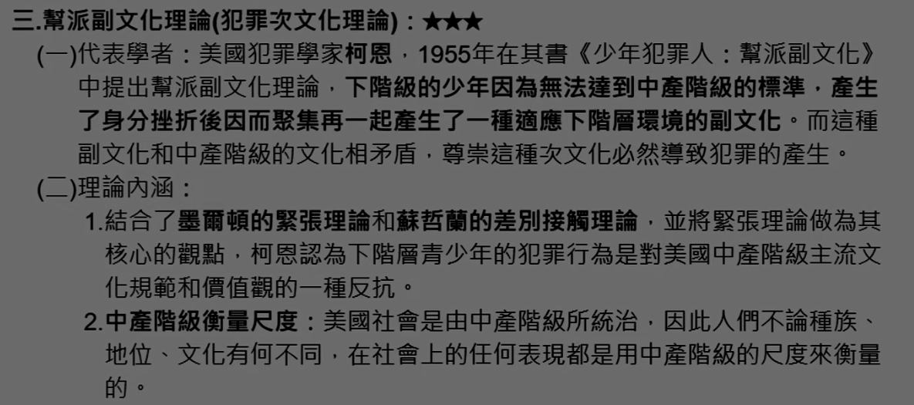
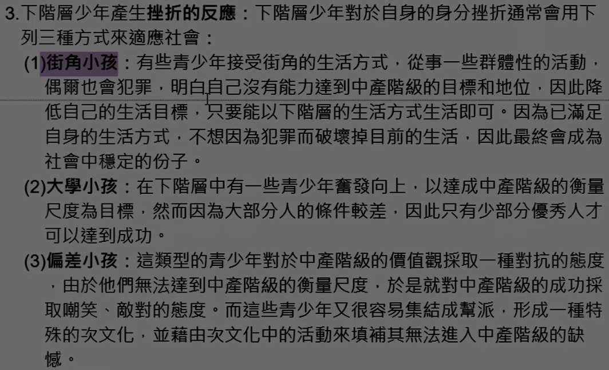

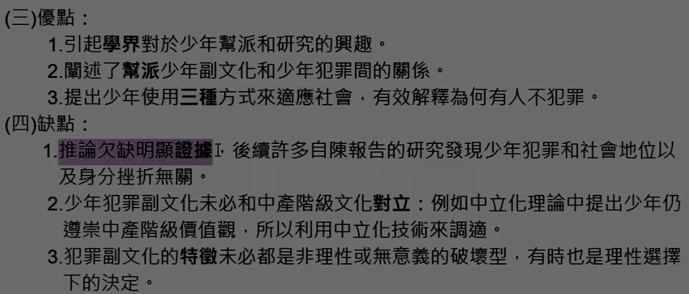
 -->

### 四、差別機會理論：
<!-- v43 -->

### 四、差別機會理論： / （一）代表學者：

美國犯罪學家**克勞德和歐林**，整合了*古典緊張理論、差別接觸理論、副文化理論*並加入了**機會**的元素提出差別機會理論。這個機會就是每個人追求成功過程中所擁有的**合法機會**和**非法機會**。

### 四、差別機會理論： / （二）理論內涵：

1. **整合古典緊張理論和副文化理論**：在這個社會上要成功要用合法的手段以及合法的機會，下階層的青少年當然也希望能夠成功，他們也利用各種不同機會的手段來達成，當如此努力還是無法成功時就會產生挫折感、憤怒等負面情緒。當無法用合法手段來達成目標後，下階層青少年就會尋求以非法的手段來達成，而這些人往往會聚集再一起形成犯罪副文化。
2. **整合差別接觸理論並引進機會的概念**：當少年有身分挫折後會開始學習用非法的手段來達到成功的目的，但學習到何種手段要看青少年所在的環境是否有這個學習機會。因為假如所處的環境並沒有學習非法手段的機會，那麼青少年還是無法從事犯罪或偏差行為。

### 四、差別機會理論： / （三）差別機會下的犯罪副文化類型：

青少年從事非法活動是取決於他**接觸各種不同副文化的機會而定**，而接觸的副文化種類會影響其之後的犯罪類型。

1. **犯罪副文化**：這種類型的副文化中要有成年犯罪人的存在，若沒有成年犯罪人教導如何犯罪就會偏向於衝突或退縮副文化。成年犯罪者在此扮演著導師的角色，教導著犯罪價值觀、犯罪技巧、犯罪的一切，而且有一種傳承的作用在，類似電影中的大哥帶入門教小弟一切犯罪手法，之後大哥走後小弟慢慢坐大，最終成為大哥。
2. **衝突副文化**：上面的犯罪副文化是有組織有傳承的，而這邊的衝突副文化傾向於所謂的小屁孩集團（筆者比喻）。衝突副文化的區域並沒有成年犯罪人教導犯罪也沒有正常獲得成功的機會，因此整個衝突副文化中崇尚原始的暴力行為，使用暴力來獲得尊敬與地位，解除緊張和挫折。
3. **退縮副文化**：這類型的副文化類似於墨爾頓古典緊張理論中的退縮型副文化，喜歡逃避追求解脱。因為無法以正常方式達到成功也無法用犯罪的方式達到成功而成為雙重失敗者。因此以逃避現實的態度來過生活，經常會曲酒、吸毒。而為了維持生活所需會從事販毒、仲介賣淫或其他不使用暴力的犯罪。

### 四、差別機會理論： / （四）反貧窮戰爭：

1960年代**甘迺迪**總統以差別機會理論為基礎展開了「反貧窮戰爭」。主要是以解決教育問題、創造就業機會，增加下階層成功機會為主的一連串活動，來減少青少年的犯罪問題。

<!-- 
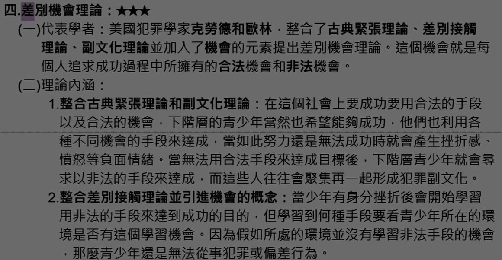
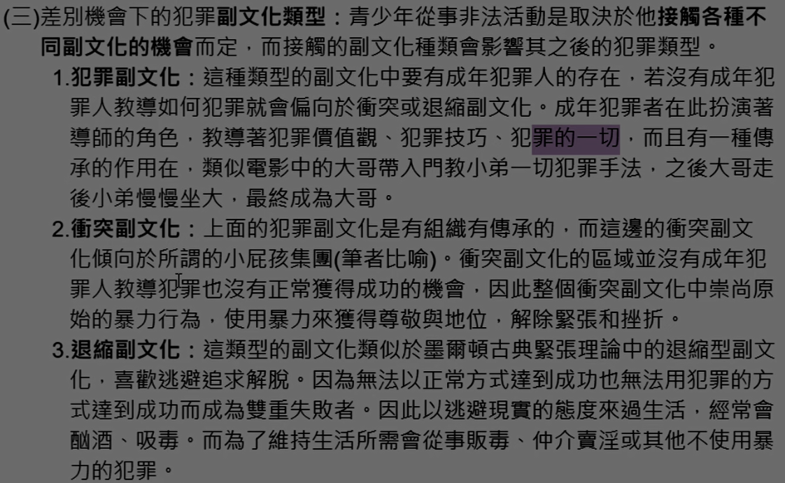
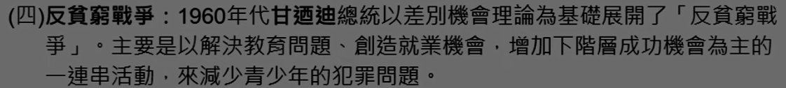
 -->

<!-- v44 -->
### 五、暴力副文化理論：

### 五、暴力副文化理論： / （一）代表學者：

美國犯罪學家**渥夫幹**和義大利犯罪學家**費洛庫提**在其合著的書中提出了暴力副文化理論。理論中指出*暴力已經是某些種族副文化中的一部分*，它已經滲透到生活當中，在這些副文化中的組成份子常常用暴力的手段來解決問題因此形成犯罪。

### 五、暴力副文化理論： / （二）理論內涵：

1950年代渥夫幹對**費城**的殺人案件進行了研究，在這些研究中發現了下階層的人發生殺人犯罪的比率很高，而且並不是因為太重大的原因，有的時候只是一些小事。因此泽夫幹認為在這些地區的文化環境中帶有一種允許使用暴力來捍衛自己保護自己以及家人甚至整個家族的價值觀。當有相同價值觀的行為人互相產生衝突時就有可能造成暴力事件，甚至是殺人案件。

### 五、暴力副文化理論： / （三）暴力副文化的七項定理：

1. *暴力副文化與主文化間必有交點*：暴力副文化並非完全以暴力為主，其與主文化必有交集的地方。
2. 暴力副文化之存在並*不表示其組成份子會隨時使用暴力*：暴力副文化成只是崇尚暴力，並非鼓勵將暴力當作解決問題的方式，其成員是否使用暴力仍有選擇性。
3. 暴力副文化之組成份子，使用暴力的多寡，代表其吸收該文化的多寡。
4. 暴力副文化的成員若違反副文化的目標或規定，將會被排擠、驅逐。
5. 暴力是一種學習的自然反應，其學習過程和學習一般行為相同，但也並
 . 所有的組成份子都會吸收這些價值觀。
6. 因為犯罪和力量情慾成正比，故暴力副文化雖存在於各個角落，但以存在於青少年和中年團體較為明顯。
7. 暴力副文化之組成份子使用暴力後沒有罪惡感，因為暴力已是其生活型態之一部分。（已經將行為合理化了）

### 五、暴力副文化理論： / （四）理論啟示：

1. 在這些副文化中「**種族**」只是引起暴力重要的因素。
2. 人們只是遵守副文化的規範去執行罷了，只是這些規範往往和大環境相衝突。
3. 太重視種族和暴力的連結，可能會帶有種族歧視的觀感而受到抨擊。

<!-- 
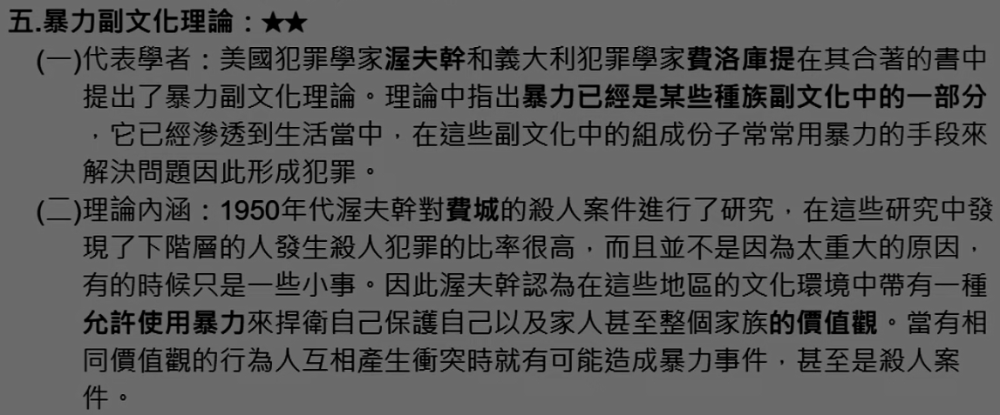
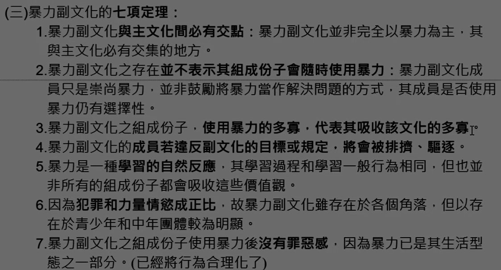
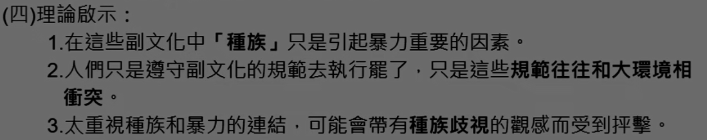
 -->

