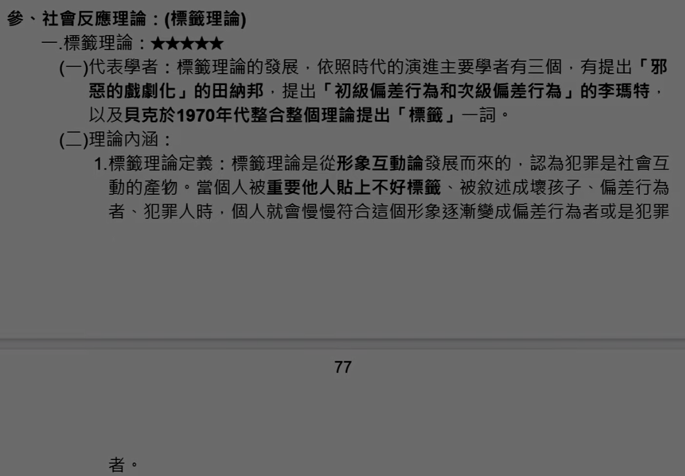

# 主題六：社會過程理論

<!-- 45 - 52 -->
定義往前翻吧,這邊直接介紹三種分支理論。

<!-- v45 -->
## 壹、社會過程理論

直接照字面來理解就好，認為犯罪是學習而來的，是在社會化的過程中學習而來的，在這過程中學習犯罪的規範、價值觀、技巧，也學習犯罪後如何收尾，包含羞恥心和罪惡感該如何割除（中立化理論）。有名的理論包含了差別接觸理論（蘇哲蘭）、差別增強理論（艾克斯）、中立化理論（馬札和西克斯）。

### 一、差別（不同）接觸理論：

#### （一）代表學者：

美國社會學者蘇哲蘭在1939年其著作《犯罪學原理》中提出了差別接觸理論，在當時是以微觀的角度從個人本身來探討犯罪如何形成，認為犯罪是在社會解組、衝突下與差別學習而來。

#### （二）理論內涵：

1\. 差別接觸的意義：差別接觸的意思在於和「犯罪人以及非犯罪人接觸」，犯罪人和非犯罪人是有差別的，而我們在成長的過程中會分別和這些人接觸因此叫做差別接觸。當和犯罪人接觸的較多時，就有可能因為學習過多犯罪的事物而傾向於犯罪。

2\. 犯罪學習內容：
（1）學習犯罪的內容：學習從事犯罪的特殊情形、動機、驅力、合理化態度以及違法是有利的態度。  
（2）學習犯罪的過程：透過和親密團體接觸而學習，這邊的學習影響是否會犯罪，在這些經驗傳承中學習到達法有利和不利的觀念，當遇見各種狀況會自行判斷得出是否犯罪的結果。  
（3）學習犯罪的程度：社會上有維持社會秩序與破壞社會秩序的兩種力量，因此行為人所接觸的團體中所賦予的觀念有很大的影響，且會受到頻率、強度、先後順序、時間所影響。

#### （三）差別接觸理論的9項命題：

1\. 犯罪是學習而來的：沒有學習就不會犯罪，本質上和學習唱歌、騎車等行為是相同的。  

2\. 犯罪是在和別人的互動交流過程中學習而來：犯罪行為是藉由習慣犯和常業犯協助而認真學習而來的，並非因生、心理因素而陷入犯罪。  

3\. 犯罪行為是與親近之社會團體於生活中互動學習而來：所謂的親近團體指的是家庭、學校、社團，因為這些與個人之關係密切，若是這些團體中有犯罪者，則有可能影響其他成員來犯罪。  

4\. 犯罪學習之內容包括外在的犯罪之技巧，內在的合理化技巧、犯罪態度以及犯罪動機。  

5\. 不同接觸之學習會因為接觸的頻率、持久性、先後次序和強度而有所不同：認為被學習者之身分地位及重要性與犯罪率有強相關。  

6\. 犯罪行為之學習過程和其他一般行為之學習過程相同。  

7\. 犯罪之動機驅力，是一個人學習對法律有利或不利之多寡而得，社會大眾對於是否應該信仰法律規範，每個人的反應都不一樣，因此如果一個人常與犯罪者接觸，學習過多覺得犯罪有利的訊息而與守法者疏遠，則其犯罪率大增。  

8\. 如果一個人接觸有利於犯罪之定義多於不利犯罪之定義，則容易陷入犯罪：如果某一犯罪行為之獎賞大於懲罰時，就是所謂的有利於犯罪之定義，如果一個行為懲罰大於獎賞那就是不利於犯罪之定義。  

9\. 犯罪行為雖然可以解釋一般之需要和價值，但卻不為這些需要和價值所完全解釋，因為非犯罪行為也解釋了這些需要和價值，是否犯罪完全看所接觸到的行為所決定。（例如：偷錢是為了用錢買東西吃，工作賺錢也是為了買東西吃，偷和工作都是為了得到錢買東西吃。得到錢買東西這個驅力不管是否犯罪都是一樣的，也就是說為了得到錢買東西不管是犯罪或是工作都是可以的，那會犯罪是因為接觸竊盜者較多，接觸努力工作者較少，因此會以為竊盜是正確的行為而去竊盜。）  

#### （四）理論缺失：

1\. 忽略個別的差異性，並非所有接觸犯罪較多的人都會傾向於犯罪，例如監所管理人員或是警察常常接觸犯罪者，可是還是沒有傾向犯罪呀。  
2\. 無法解釋衝動或是激情的犯罪，因為往往是突發的，並非經過學習而來，也學不來。  
3\. 無法解釋變態的犯罪行為，因為只注重社會因素忽略生、心理因素。  
4\. 難以用實證方式來驗證理論有效  
5\. 無法解釋第一個犯罪者如何產生的，因為沒有老師教，要向誰學習。  
6\. 社會上許多犯罪並不是互動學習而來，例如：電視、媒體、網路。  
7\. 只提出為何犯罪的原因，沒提出犯罪預防對策。

<!-- v46 -->
### 二、差別增強理論：

#### （一）代表學者：

美國社會學者艾克斯在1966年發表論文中，修正蘇哲蘭的差別接觸理論並且融合史基納的增強理論和班都拉的社會學習理論，艾克斯發現差別接觸理論的一些缺失，例如：無法解釋一個人是怎樣變成犯罪者、沒有說明甚麼原因使犯罪重複發生，沒有說明甚麼因素讓犯罪者決定犯罪行為方式，因此提出差別增強理論來解決上述問題。

#### （二）理論內涵：

1\. 在社會中行為的學習主要還是受到操作制約所影響，也就是增強和削弱所影響。
2\. 在學習的過程中會因為行為結果好壞而影響行為的實施。
3\. 社會行為可以透過直接操作而學習也可以由模仿別人而學習。
4\. 行為會受到正增強、負增強而得到加強，或是受到懲罰而被削弱，無論是犯罪或是正常的行為的學習和使用以及持續都會受到這些行為結果所得到的獎賞或懲罰而決定，這就是所謂的差別強化（同時學習但並不是全都強化，只有那些獲得增強的學習會強化）。

#### （三）犯罪預防：

犯罪的出現、維持、重復都受到增強和削弱的刺激所控制，因此要抑制犯罪的發生就是要使用刑罰來懲罰犯罪行為，來削弱犯罪的慾望。並且減少犯罪外在增強的力量，如此才能減少犯罪的發生。

#### （四）差別接觸理論和差別增強理論之比較：

1.相同點： 
(1) 都認為犯罪是在理性下與重要他人互動中學習而來。  
(2) 都可以解釋犯罪如何產生、持續，但未能說明為何同樣情境有人並不會犯罪。  
(3) 只強調學習和互動的過程，但未考慮這些學習在每個人心中的運作方式是不同的，只是結果相同。  
(4) 都認為行為的開始和持續受到增強作用之影響。

2.相異點： 

|          | 差別接觸理論   | 差別增強理論               |
|----------|----------------|----------------------------|
| 自由意志 | 未討論自由意志 | 自由意志會影響學習         |
| 學說觀點 | 偏向社會學     | 操作制約 + 心理學 + 社會學 |
| 犯罪預防 | 未說明如何預防 | 懲罰可預防犯罪             |

<!-- v47 -->
### 三、中立化理論（漂浮理論）：太太太太

#### （一）代表學者：

由美國犯罪學者瑪札和西克斯在其合寫的論文中提出以少年犯罪人為主角的論點，敘述少年犯罪人將犯罪行為合理化的心路歷程。

#### （二）理論內涵：

少年在違反社會規範的時候，發展出了一套獨特的合理化技巧，使它們暫時可以脫離社會規範的束縛，合理化自己違法規範的行為。並不完全贊同柯恩犯罪次文化理論的論點。

1\. 少年犯罪人對於自己的違法行為有罪惡感：少年犯罪人並不完全遵從少年犯罪體系的價值觀。  
2\. 少年犯罪人羨慕、尊敬那些誠實、守法的人：例如：英雄、運動員、父母。  
3\. 少年犯罪人會分辨什麼可以侵害、什麼不能侵害：例如：自身親近的家人，神職人員。也因此代表少年知道自己的行為的正當性。  
4\. 少年犯罪人也會遵從正常的行為來解決事情：大多數時間少年的活動仍然是正常的社會活動。

#### （三）中立化技巧：

瑪札和西克斯透過觀察上述的內容發現，少年仍然遵守傳統，社會規範，因此在從事犯罪的時候要利用中立化技術合理化自己的犯罪行為，這樣子至少心理上才不會和自己遵守的傳統規範相衝突。這些中立化技術主要有下列5項：（4項否定，1項肯定）

1\. 責任否定：青少年認為自己不該對自己的行為負責，將責任推給其他因素，例如：父母害的、家庭沒溫暖、朋友帶壞我。  
2\.  害否定：不認為自己的行為對他人造成損害，例如：偷說成借用、打架認為只是在運動。  
3\. 被害者否定：將違法行為當作正當的行為，認為都是對方的錯。例如：偷有錢人的東西認為是對方錢太多、強制性交說是因為女性穿太露。  
4\. 責備責備者：認為社會上的管教者都是虛偽、邪惡故意和自己作對的，不管是父母、老師、警察都一樣。經由譴責這些邪惡的人，青少年就可以減輕自己的罪惡感。  
5\. 訴諸較高權威團體：青少年的一些犯罪是在加入幫派組織之後產生的，「因為他們會認為自己只是效忠幫規、遵守老大的指示。覺得在效忠幫派之下產生的行為並非犯罪，而且甚至覺得有榮譽感。

#### （四）理論優缺點：

1\. 優點：解釋了為何大部分青少年犯罪人沒有變成成年犯罪人的原因，因為他們心中仍然尊崇傳統社會規範，因此隨著年齡成長，他們會放棄這些犯罪行為，專心於合法的工作和生活。  
2\. 缺點：本理論並沒有指出少年犯罪人何時使用中立化技術，是在犯罪前？犯罪中？犯罪後？並沒有明確指出。

<!-- v48 -->
## 貳、社會控制理論：

由字面上想，控制？為何要受控制？不乖才要受控制，誰不乖？犯罪人不乖。控制理論認為人從出生後就會傾向於犯罪，也就是性惡論的感覺。那麼有些人為何不犯罪？是因為在社會化的過程中受到抑制或是某些力量讓他不會去犯罪，而那些犯罪人都是因為社會控制力量薄弱導致他們去犯罪的，並非真的有力量驅使他們去犯罪。

### 一、社會疏離理論：太太

#### （一）代表學者：

由美國犯罪學家傑佛利於1960年代整合犯罪社會學派和犯罪心理學派的觀點提出。

#### （二）理論內涵：

犯罪心理學派認為犯罪之原因都是心理和情緒等因素引起的，但是事實上大多數犯罪人並沒有心理上的毛病。此外對於犯罪社會學派主要以蘇哲蘭的差別接觸理論為代表，認為差別接觸理論排除了心理學和生物學的觀點，導致犯罪學等於社會學的現象產生。因此不論是犯罪社會學派和犯罪心理學派都有其缺失，因此傑佛利認為要整合起來才能完整的說明犯罪發生的原因，基於此理念提出了「犯罪疏離理論」，並以此來說明貧民區的青少年犯罪率為何較高。

1\. 結合犯罪社會學派：強調與團體的互動，如果社會互動越缺乏，人際關係因而產生隔閱而疏離，則犯罪發生率就越高。  
2\. 結合犯罪心理學派：強調犯罪人是在情感上、心理上與他人疏離，一般犯罪人及少年犯之所以犯罪多是因為缺乏良好的人際關係導致。

#### （三）社會疏離三種型態：

1\. 個人疏離：指個人缺乏與他人溝通交流之機會，無法與他人正常往來，也無法認同社會規範和主流的價值觀，和正常社會嚴重疏離，因而容易有犯罪行為。  
2\. 團體疏離：指部分人所屬團體與社會疏離，其遵從之規範與文化價值和主流文化互不相容或背道而馳，使其成員和主流文化產生衝突或無法適應社會生活的現象，例如：特殊的宗教組織、幫派組織。3.法律疏離：指各階層都會受到法律不同的待遇，因此法律地位並不平等，所以低階層者的犯罪行為較容易被定罪，或者低階層者較缺乏法律概念，較容易觸犯刑事法規，遭到刑事追訴。

#### （四）預防犯罪的方式：

1\. 避免個人疏離： 
(1) 注重學校和家庭教育：與人相處是需要教導的，因此學校和家庭身負重任需要教導如何與人相處，塑造良好人際關係，避免孤獨。  
(2) 鼓勵參加團體活動：舉辦各種類型的團體活動或是競賽活動，激發少年的榮譽心和責任感，並奉獻精力在這些活動當中。  

2.避免團體疏離： 
(1) 尊重少數團體：兼顧各種團體存在之價值，增進青少年對於團體和社區的歸屬感，並避免偏差副文化的發展。  
(2) 提供弱勢團體協助，給予弱勢團體必要的協助與輔導，並給予公平的對待，避免其偏離社會規範引發偏差行為。  

3.避免法律疏離： 
(1) 提倡程序正義：政府單位應依法行事，秉持著法律之前人人平等之原則，避免法律不公之情況發生。  
(2) 宣導法律知識：加強青少年的法律知識，培養法律素養，勿讓其因為無知而誤觸法網。

<!-- v49 -->
### 二、抑制理論：太太太

#### （一）代表學者：

美國犯罪學者雷克利斯在1961年發表的論文中提出了抑制理論，他認為社會上存在著引誘個人犯罪的拉力和驅力，如果這時候個人內在的控制能力以及社會的外部控制因素缺乏就很容易導致犯罪發生。

#### （二）理論內涵：

雷克利斯認為社會上存在著兩種力量，一種是引導犯罪的力量，一種是抑制犯罪的力量。而犯罪是這兩種力量較量後的結果，當引導犯罪的力量大於抑制犯罪的力量就容易導致偏差行為或犯罪。

1\. 抑制犯罪的力量：内、外在抑制力。 
(1) 內在抑制力：內在從心出發，主要是自我的控制能力。自我要有良好的控制能力則要有良好的自我概念、良好的超我、挫折忍受能力、降低緊張的合理化技巧等。  
(2) 外在抑制力：外在抑制從社會及家庭出發，這包含一些結構性的成分，例如：社會規範、責任、道德觀、監督、紀律等社會控制的因素，以及健全的家庭、有效的家庭紀律和管理等家庭對個人的抑制。

2\. 引導犯罪的力量：內在推力、外在拉力與壓力。 
(1) 內在推力：也是從心出發的，主要是一些容易將人推向犯罪的生、心理力量，例如：挫折、不安，失望、叛逆、動機、敵意、自卑感及本能。  
(2) 外在壓力：又稱為環境壓力，主要是我們在社會上會遇到結構性壓力，也是所謂的緊張感包括：貧窮與相對剝奪感、文化衝突、少數民族、緊張，等，都會將人推向犯罪。  
(3) 外在拉力：拉力屬於一種類似誘惑的力量，外在會產生拉力將人拉往犯罪的方向，容易讓個人的決定偏向於犯罪，例如：結交損友、受到誘惑、偏差的榜樣、生長在犯罪副文化的團體中。

#### （三）預防犯罪的方式：

雷克利斯研究犯罪密集區內沒有犯罪的少年，發現良好的「自我概念，可以降低少年犯罪率。因此預防犯罪應加強：

1\. 各種社會措施，健全環境，減少犯罪誘因。
2\. 加強少年自我控制、發展超我及責任感，以及身份挫折時的轉化能力。或是以提高內在、外在抑制力，降低內在推力、外在壓力及拉力來論述。

#### （四）優點：

1\. 適合解釋多種類型犯罪，尤其是侵害他人身體的犯罪。
2\. 精神、心理、社會、臨床等學者都可以輕易使用的理論。
3\. 任何個案都可以分析其内外在抑制的情況。
4\. 贊成重建受刑人之環境或是自我，有助於處遇。
5\. 可以有效的適用在犯罪預防上。
6\. 內外在抑制可以透過研究表現出其強弱。

#### （五）缺點：

1\. 自我概念並沒有完全的和少年犯罪率相關，只存在中等的聯繫。
2\. 壓力、拉力等概念混淆不清，並且難以驗證。

<!-- v50 -->
### 三、社會鍵理論（社會控制理論）：太太太太太

#### （一）代表學者：

美國社會學、犯罪學者赫胥在1969年出版的書中提出了一種關於少年犯罪的社會控制理論，又稱為社會鍵理論。

#### （二）理論內涵：社會鍵）

赫胥認為人本來就是非道德的動物而有犯罪的傾向，如果不進行控制的話任何人都會進行犯罪。而個人和社會的連繫是控制犯罪的關鍵，赫胥稱之為社會鍵。當個人的社會鍵薄弱的時候就會導致少年犯罪行為。社會鍵關係的組成主要以家人、學校、朋友、親近團體為主要聯結。而當少年犯罪則可能失去這些關係，因為對於失去這些關係的恐懼會控制少年不去實施犯罪行為。社會鍵主要由下列四種要素圍繞著親人、家庭、學校、團體組成：

1\. 附著鍵：（情感依附）主要是代表著個人與其他個人或團體的情感鏈結，當個人與這些個人或團體產生情感依附時，就會在犯罪的時後考慮到這些他人或團體對於自己的重要性，會因為不想要破壞這些情感的聯繫而不去犯罪。附著的對象主要有三種： 
(1) 對父母的附著：為最重要的附著，父母是我們成長中最早接觸的對象，因此若連父母都無法建立附著，就更難以對他人產生附著，犯罪的可能性就會很高。  
(2) 對學校的附著：學校是讓我們由傳統的家庭前往工作、婚姻等社會化過程的橋樑，因此學校是我們由少年成長到成年時重要的附著機構，能夠有效控制少年犯罪。
(3) 對同儕團體的附著：這邊的同儕團體指的是好的同儕團體，在團體中我們能夠學習正確的價值觀，若沒有附著好的團體則有可能會導致和犯罪76人交往。

2\. 奉獻鍵：（物質要素）指的是青少年奉獻自己的心力去追求傳統的人生目標，對於自己的未來有抱負希望並且努力去達成，因為將時間、精力都花費在這些目標上就沒有多餘的力氣去犯罪。而人們之所以不犯罪有兩個因素，一個是理性地致力於抱負和目標，另一個是恐懼失去這些抱負和目標。

3\. 參與鍵：（時間要素）指的是花費精神和時間參加傳統的活動，因為全力參與這些活動就沒有參與偏差活動的時間和精力。而參與團體活動所受到的制約，會將個人與犯罪隔離開來。許多少年犯罪的防治計畫中都有讓少年參與有益活動的規劃。

4\. 信仰鍵：（道德要素）又稱為信念，是對於所在的社會中共同擁有的價值觀和道德觀的贊同，這些價值觀可能是宗教、法律、或是社會規範。而相信這些價值觀和規範就等於遵守著大家一致的觀念，就不容易犯罪。

#### （三）預防犯罪的方式：

著重在使少年附著於家庭、學校、以及找尋興趣和參加團體活動。

#### （四）優點：

1\. 具有實證性：赫胥的研究是利用大量的調查和問卷所得的資料作為理論研究的基礎，因此是經得起考驗的。  
2\. 適用範圍廣：社會鍵理論適用於不同文化、不同社會地位、不同類型犯罪，具有一般性和普遍性。  
3\. 可操作性：社會鍵理論沒有太過於艱深或模糊不清的詞語，例如：無規範、漂浮。他只確立了四種清楚的概念方便使用。  
4\. 科際整合：吸收了許多少年犯罪的結果，同時整合了許多理論、概念、方法。

#### （五）缺點：

1\. 對於重大犯罪難以解釋：許多學者認為社會鍵理論只能解釋輕微的少年犯罪，因為赫胥多使用陳報告來取得研究的資料。
2\. 命題假設的瑕疵：人出生就有犯罪的傾向的假設，導致社會鍵理論不是研究人為何犯罪，而是研究人為何不犯罪。
3\. 忽視了結構性的因素：社會鍵理論忽視了社會結構面的因素，如同前頭社會結構理論所說的，人口組成結構、貧富差距，這些都沒有考慮。
4\. 未解釋四種鍵的許多問題：例如：社會鏈如何產生的、削弱後是否可以「復、四種鍵的地位是否都相等之類的問題。

<!-- v51 -->
## 参、社會反應理論：（標籤理論）

### 一、標籤理論：

####（一）代表學者：

標籤理論的發展，依照時代的演進主要學者有三個，有提出「邪「惡的戲劇化」的田納邦，提出「初級偏差行為和次級偏差行為」的李瑪特，以及貝克於1970年代整合整個理論提出「標籤」一詞。

#### （二）理論內涵：

##### 1. 標籤理論定義：

標籤理論是從形象互動論發展而來的，認為犯罪是社會互動的產物。當個人被重要他人貼上不好標籤、被敘述成壞孩子、偏差行為者、犯罪人時，個人就會慢慢符合這個形象逐漸變成偏差行為者或是犯罪者。

##### 2. 標籤理論對於犯罪的定義：

對於犯罪的定義較偏向於互動觀的觀點，認為本質上的犯罪並不存在，行為是依照外在的社會反應來訂定的。犯罪是道德企業家將自己的價值觀來制定法律和規範，再利用法律將某些人貼上標籤，將之稱為犯罪人，行為稱之為犯罪行為，因此偏差和犯罪行為並不是行為的本質，而是那些道德企業家制定的法律被成功使用後的結果。

##### 3. 差別執法：

因為採取互動觀的理論，因此法律在此主要是反映權力在社會上的使用方式，法律是由社會上階層者將自己的價值觀帶入所訂定的。所以法律會反映出權力關係，例如：白領犯罪判刑都很輕，而暴力犯罪、竊盗等反倒較重。因此受到法律制裁方面也和個人的社經地位、種族、性別有關。

##### 4. 標籤後的影響：

(1) 烙印：在標籤的過程中通常會經過一種「公開的譴責」將犯罪人烙印在受標籤者身上，這也算是一種「身分貶低的儀式」，在這個過程中被標籤者會慢慢地接受自己是犯罪人的身分，而將標籤給予的身分替代原本的身分。例如：小明只是不小心拿了隔壁的橡皮擦使用，就被一直小偷、小偷的叫，而且老師還公開在大家的面前稱他是小偷，久而久之小明的身上就被烙印了小偷的形象。此外周邊的人開始對被標籤者產生「追溯既往之閱讀」，開始以這個烙印所代表的意義和他往來、互動，在以原本真實的態度來對待他，並且以現在的情況來重新解讀他以往過去的一切行為。例如：小明周邊的同學也開始用異樣的眼光看他，並且開始竊竊私語說些以前小明怎樣的壞話，甚至說小明一臉小偷樣這樣做不意外之類的話語。  

(2) 修正自我形象：當被烙印後被標籤者會慢慢接受這個形象，開始相信自己和大家說的一樣是個犯罪者，因此行為上也漸漸表現出一副犯罪者的姿態，這樣才符合大家的期待，也就是所謂的「自我預言的實現」。

##### 5. 標籤理論流程：

(1) 初次偏差行為，多為輕微或不重要的偏差行為，甚至行為人自己也不知道。  
(2) 社區或關係人給予懲罰與標籤。  
(3) 更進一步的偏差行為，較為嚴重的偏差行為。  
(4) 管教者使用更嚴厲的懲罰和標籤。  
(5) 次級偏差行為，青少年以此防衛、適應社會對他的負面反應，並對標籤者產生怨恨和敵意。  
(6) 社區或關係人將偏差者送入正式刑事司法體系。  
(7) 個人加強偏差行為，並以偏差行為當做懲罰的反應手段。  
(8) 「自我預言的實現」接受偏差者的身分，並做出此身分相對應的行為（犯罪）。

#### （三）優點：

1\. 更正司法系統的運作觀念：司法系統一方面打擊犯罪，一方面標籤又造成再犯新的犯罪。  
2\. 詳細解釋後續違法行為如何產生：初犯-標籤-再犯。  
3\. 提供了刑事司法改革的方向：趨向於4D。  
4\. 明白表示法律被差別使用：因種族、經濟、性別等不同。  
5\. 開啟新的研究方向：將犯罪研究的焦點放在社會控制機構上。

#### （四）缺點：

1\. 無法解釋初級犯罪行為如何產生。  
2\. 忽略本質上的犯罪。  
3\. 無法解釋犯罪率的變化。  
4\. 法律的使用未必和種族、社經地位有關。  
5\. 忽略自我意志的選擇。  
6\. 無法解釋被標籤者為何有人向善有人向惡。  
7\. 無法證明自我修正如何影響犯罪。

#### （五）對刑事政策之影響（4D）：

主要講求不要進入刑事司法體系來避免標籤。

1\. 轉向：既然標籤會引起少年的不適感，因此要從頭開始去除標籤，青少年在進入刑事司法系統前，先讓他進入社會機構接受處遇，不要進入刑事司法體系接受懲罰就不會產生標籤。  
2\. 除罪化：對於過輕或是不必要的犯罪行為給予除罪化，就不會進入刑事司法體系了。  
3\. 非機構化：這個政策主要是和轉向政策相配合，轉向是再進入前就予以轉向。而非機構化是對於已經進入在教養院、看守所、拘留所的少年，將其遷移出去以減輕刑事司法機構的負擔以及減少標籤。  
4\. 適法程序：個人不同的種族、特徵、地位、财富都會受到不同的標籤，也可能會影響判決的公正性，因此適法程序是保證刑事司法機構法律的公正性，以保證兒童少年在司法判決中得到公平的處理。

<!-- v52 -->
## 補充名詞解釋：

這些詞都在作答時都可以帶入內容之中。）

1\. 形象互動論：強調符號和意義在人類互動中的重要性，理論核心是社會互動，社會互動是人對他人採取行動和做出反應的過程。而我們對於互動中他人對於我們的定義做出反應。

2\. 隱形的偏差者：大多數的人都有過輕微的偏差行為（翹課、飆車車），但是大多數人的偏差行為都沒有被發現，只有自己知道，這就是「隱形的偏差者」。

3\. 初級偏差行為：李瑪特認為在青少年初期的偏差行為中，有很多是沒有人發現或是非常輕微的偏差行為。

4\. 次級偏差行為：青少年被貼上壞的標籤後，青少年會按照其少年犯罪人身分進行更加嚴重的偏差行為。因此當一個人以偏差或犯罪行為作為防衛、攻擊、適應社會給他的標籤時，就產生次級偏差行為。

5\. 身分貶低模式：犯罪者在公開審判儀式中被定罪判刑，目的就是將犯罪人的烙印加在「她身上，並公開宣告她被合法社會隔離。

6\. 追溯既往之閱讀：當一般人修正被標籤者之形象後，人們開始以該烙印所代表的意義來和他來往，不在以他行為的真實意義來看待他，過去的行為也會被翻出來以事後諸葛的角度來說明其以往就有如此之行徑，以符合他現在之形象。

7\. 邪惡的戲劇化：是一種自我預言實現，原本我們的刑事司法體系對於犯罪青少年的處置是希望他們能夠向善，但是因為標籤反倒使得原本正常看待他們的社區或是親近之人以特別眼光看待他們，雖然社區和親近之人也希望他們能夠變好，但是因此反倒使得他們越來越壞，產生相反之結果。

8\. 自我預言實現：當初次犯罪行為被貼上標籤後，青少年就會開始修正其自我形象，開始慢慢地朝向標籤所言之偏差行為者邁進。

