# 主題七：社會衝突理論

<!-- 52 - 59 -->

社會衝突理論只有和平建構犯罪學理論以及修復式正義近年來較為熱門，其餘理論為較冷門考題。而導致社會衝突學派的興起主要原因之一是因為自陳報告時發現其實犯罪的分布較官方統計平均，官方犯罪多偏向於低階層，因此反思刑事司法淪為官方的打手。此外標籤理論否定道德上的錯誤導致犯罪，主張犯罪都是刑事司法體系所控制也引起了學者的注意。以及1970年代興起的社會政治運動，使犯罪學家思考政府使用法律的正當性和合法性。

結構圖：

* 社會衝突理論
  * 衝突犯罪學
    * 馬克思學派理論
    * 衝突犯罪學理論
      * 多元文化衝突理論
        * 團體衝突理論-淫南德
        * 權威衝突理論-塔克
        * 文化衝突理論-雪林（犯罪副文化章節）
        * 身分差別壓迫理論-雷格利和海威特（少年犯罪章節）
      * 激進派衝突理論
        * 社會真相理論
        * 強迫協調結合理論-達倫道夫
        * 激進突理論-普拉特
  * 批判犯罪學
    * 工具與結構理論
    * 左派現责主義-李和根格
    * 批判女性主義理論梅瑟史密特
    * 權力控制理論-哈根
    * 和平建構理論一倍平斯基、昆尼傑爾、烏布莱特、懷特
  * 修復式正義

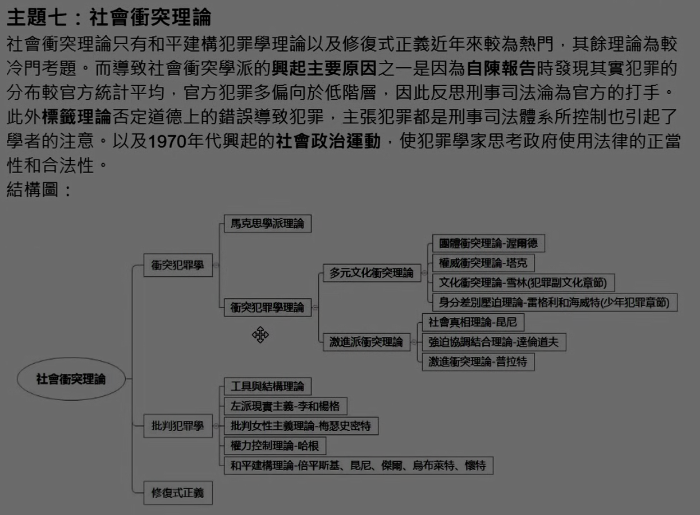

<!-- v52 -->
## 壹、馬克斯主義
### 一、代表學者：

德國學者馬克思提出，馬克思逝世後，好友恩格斯替他整理出版了大量的著作。但這兩個學者並沒有提出犯罪學理論，馬克思主義只是針對社會現象加以觀察後提出的。之後由荷蘭學者龐格將馬克思主義發展成犯罪學。

### 二、理論內涵：

（一）資產階級和無產階級：工業革命後社會發展產生了「掌握生產工具的資產階級」以及「出賣勞力的無產階級」，而資產階級憑著自身的優勢會剝削無產階級，因此會造成社會不公、貧富差距大、衝突（和慣老闆有87%像）。因為這些衝突無法調和，因此馬克斯認為資本主義是造成犯罪的原因，只有推翻資產階級，建立起無產階級專政的社會主義社會才能擺脫犯罪。

（二）思想重點： 
1\. 唯物論：主要因為資本主義興起，因此思想都會受到物質所引導，因此物質影響思想而思想主導了社會和歷史發展。  
2\. 資本論：因為資本家擁有生產工具因此剝削無產階級霸占財富，因此社會階級地位是取決於是否擁有生產工具，經濟因素成為社會發展的基礎。

（三）犯罪原因：主要是因為資本家剝削無產階級，制定法律差別執法。以及無產階級被剝削到連基本生活都產生問題後，逐漸喪失道德無法克制慾望而犯

（四）犯罪的功能：使社會需要刑事司法體系成員來處理犯罪後的各種需求。

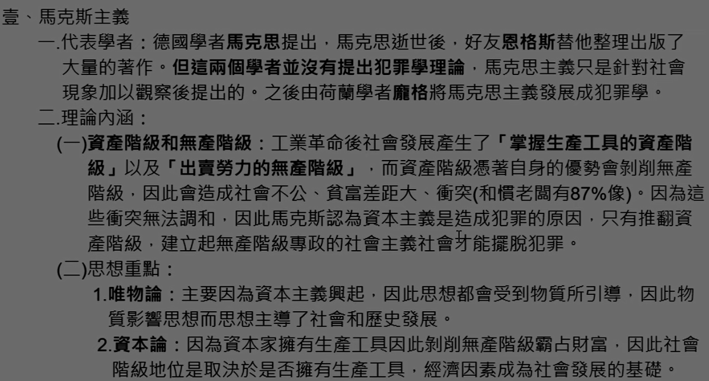
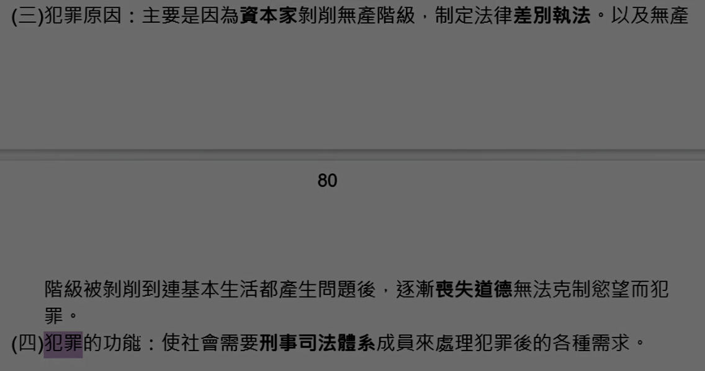

## 貳、多元文化衝理理論

### 一、團體衝突理論：

用來解釋各種團體和個人間的衝突導致犯罪。

（一）代表學者：渥爾德於1958年寫下《犯罪學理論》，這本教科書的目的便在於建構他衝突學派的理論。

（二）理論內涵： 
1\. 社會上有許多團體，而團體間為了自身的利益會產生各種不同的衝突。
2\. 犯罪是團體衝突的結果，藉由立法來訂定處罰犯罪的規範來排解衝突。
3\. 犯罪的訂立是由強勢的團體為了保護利益，利用在政治經濟上的自身優勢犯罪化其他團體。

（三）容易被定義為犯罪之四種現象：基本上都是弱打強）
1\. 政治運動：未取得政權之團體對抗取得政權之團體。
2\. 工會運動：無權勢工人對抗有錢有權之業主。
3\. 改變種族或階級的運動：直接抵觸既得利益者之底線。
4\. 工會間在司法上的衝突：工會間也必有強弱之分。

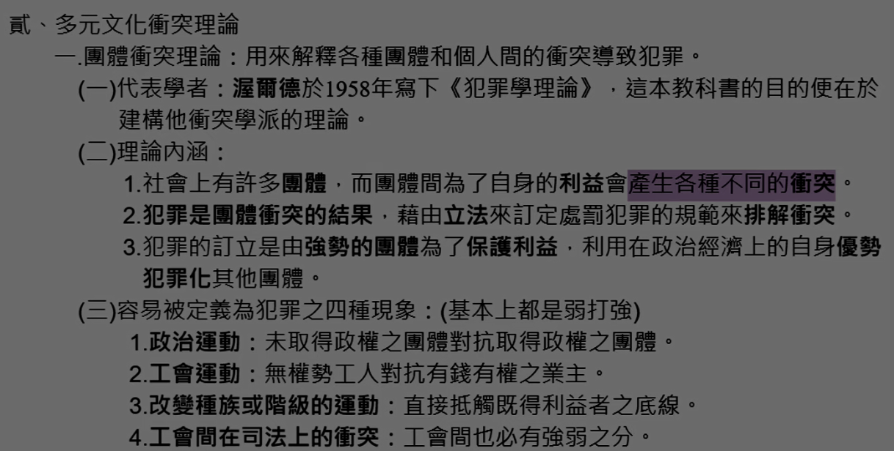

<!-- v54 -->
### 二、權威衝突理論：

社會秩序是建立在權威者維持的「一致性強制平衡」，人們依照其安排的角色去生活。

（一）代表學者： 
塔克德克認為社會上分為權威的人和受控制的人，犯罪是由權威階層訂定的，犯罪就是和權威產生衝突的結果。

（二）理論內涵： 
1\. 重視權威衝突：不強調階級衝突，而強調權威衝突。

2\. 社會規範與文化規範的衝突;若兩種規範不一致時，則會產生衝突並被加上不良標籤。例如：原住民打獵動物為生是他們的化，但是現今的法律規定打獵動物是犯罪就會侵犯到原住民的權利。

3\. 犯罪與法秩序之說明： 
(1) 每一個人對於社會現象之了解或概念不同，不同意見導致人們衝突。  
(2) 每一個團體或個人都會盡力提升自己的思考或行為方式，希望社會能夠接受。  
(3) 具有共同了解或信仰的人會聚集在一起，團體成員會因為信仰和了解而相互強化，衝突團體逐漸形成社會結構的一份子。  
(4) 權力是決定團體在社會結構中地位的重要因素，團體社會地位之變化，反映團體社會權力分配的變化。  
(5) 人類的關係是動態的，且不斷變化的，因此社會是充滿衝突的。

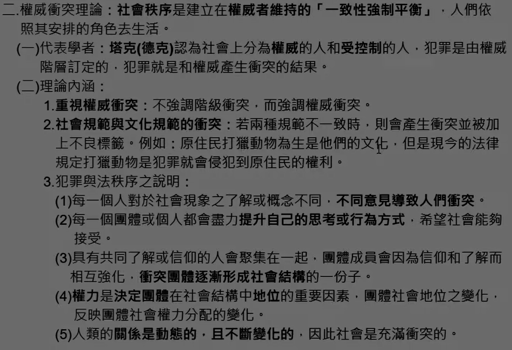

## 参、激進派衝突理論：

### 一、社會真相理論：

（一）代表學者：昆尼

（二）理論內涵：犯罪是衝突後權力的表現，刑事司法體系為當權者服務，犯罪是有權力者所訂定。

（三）犯罪事實的六個命題： 
1\. 犯罪是官方界定的。  
2\. 犯罪定義為與上階層利益衝突之行為。  
3\. 犯罪透過刑罰應用於下階層。  
4\. 犯罪由上階層定義造成某些行為型態容易被定義為犯罪。  
5\. 犯罪概念的建立是利用大眾媒體傳播。  
6\. 犯罪的社會真實，綜合上面的命題會造成更多的犯罪產生。

（四）「國家犯罪」的五種型式： 
1\. 犯罪之控制：指重刑犯與輕微的犯罪者，他們被刑事司法體系的人逮捕，控訴違反刑法或其他國家法律。  
2\. 政府犯罪：社會選舉出來的官員或者指派的官員，此種犯罪在於維持其政治上的優勢，例如：政治迫害。  
3\. 經濟支配犯罪：這是白領階級的犯罪，其目的在於保護資本家的利益。例如：聯合壟斷、污染、操縱物價、生產不完全物品、組織犯罪等等。  
4\. 社會傷害：否決社會基本人權，包括有：性別主義議題、族群中心主義、經濟剝削等，這些皆未被定義為犯罪行為，但會造成社會對立。  
5\. 掠奪性犯罪：為人身犯罪，認為這種犯罪通常是低下階級者無意識的對於他們被剝削的憤怒所導致，例如：謀殺、強姦、搶奪。

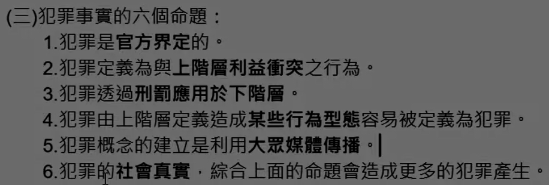
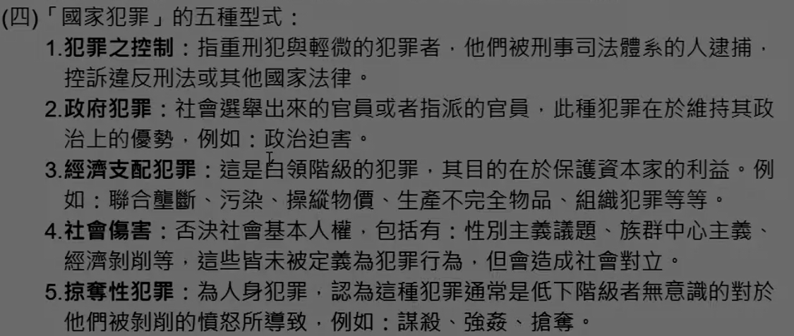

### 二、強迫協結合理論：

（一）代表學者：達倫道夫

（二）理論內涵： 
1\. 延續並修正馬克思主義：主張現今的社會無產的勞工可以透過團結組成團體和有產階級對抗，並非一昧的被剝削。（工會）  
2\. 權力代替階級：以權力取代階級的觀念，社會是由許多權力團體組成。  
3\. 權力分配不均產生衝突：社會是靠強制協調式的結合，因為權力分配不均造成有權團體支配無權團體而產生衝突。  
4\. 犯罪是不同團體衝突的產物：各種團體擁有不同的權力，例如政府圖體握有政治權力，工商團體握有經濟權力，勞工團體握有人群的力量，社會是彼此協調而成，而犯罪是彼此衝突而產生。  

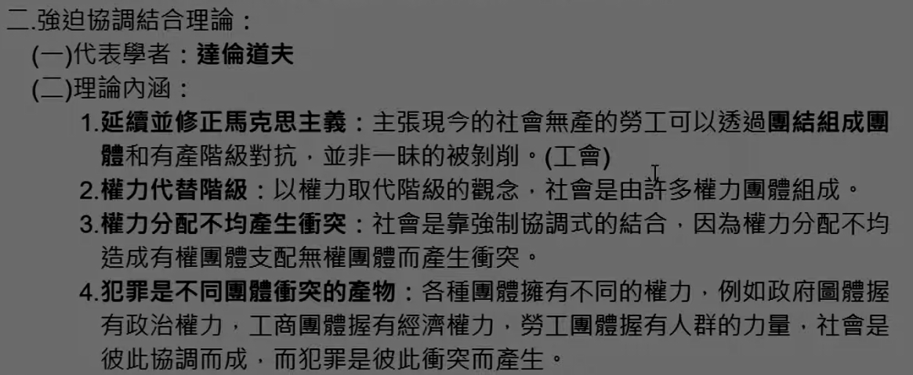

<!-- v55 -->
### 三、激進派衝突理論：（蔡德輝、楊士隆）

（一）代表學者：普拉特

（二）理論內涵： 
1\. 他們認為少年犯罪也是資本主義社會之產物，某些少年之行為違反資產階層之利益，因此被標籤化形成少年犯。  
2\. 期望以少年法院的方式能夠更人道的處理少年犯罪事件，但實際上並未達到此目標。  
3\. 因為美國1980年代經濟不景氣，認為要控制社會要先平息犯罪的混亂情況，應致力於資本社會的穩定。  
4\. 認為犯罪者皆來自下階層，具危險性且偏離傳統道德。  
5\. 批判兒童救助運動，認為此運動導致將以往不是犯罪的行為犯罪化。  
6\. 認為美國少年刑事司法體系仍存有種族、性別及對於下階層社會之歧視，造成大多數犯罪者都來自於下階層或少數民族，目前的司法體系及改革失效。

（三）批評： 
1\. 理論看法與資料不一致，雖然一再強調犯罪來自於下階層，但是依據自陳報告顯示社會上各階層皆有犯罪，激進派學者忽略掉中上階層的犯罪資料。  
2\. 認為貧窮與失業會導致犯罪增加，但是研究顯示有時候經濟繁榮時，因為社會控制力減弱，反而造成高犯罪率。

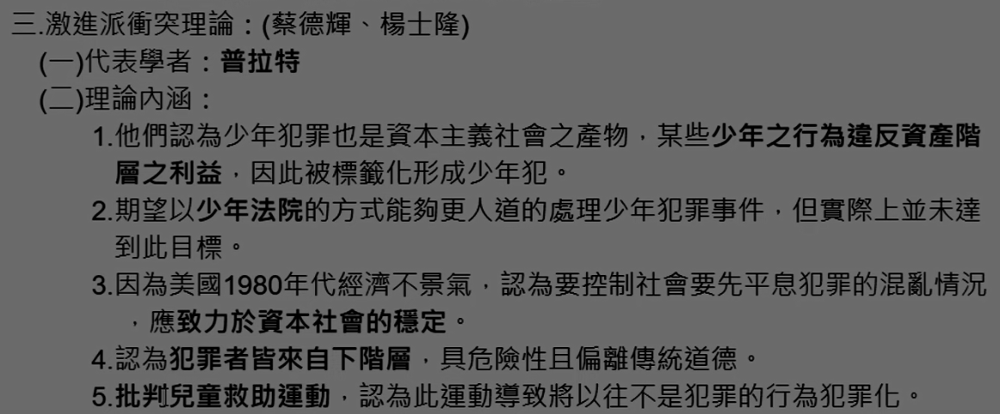
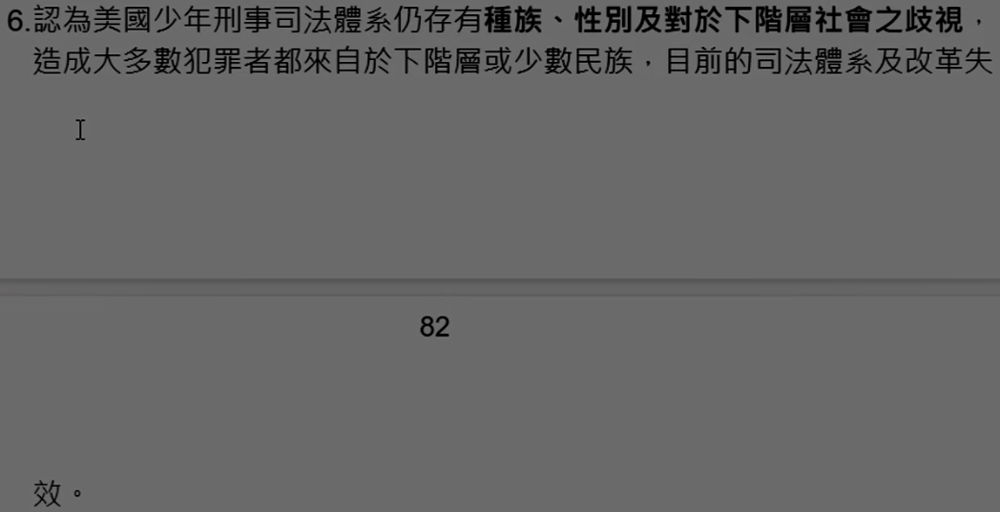
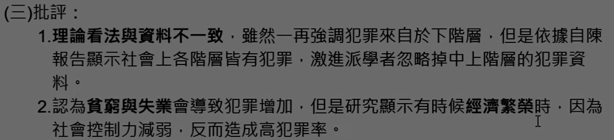

## 肆、批判犯罪學理論

### 一、工具與結構理論：

主要分為兩個派別，工具性理論以及結構性理論。

（一）工具性理論觀點：（資本家以法律和司法當作工具） 
1\. 以法律和刑事司法作為統治工具：在資本主義的社會中，資本家因為有權有勢，因此將自己的價值觀強加在法律條文中，要求社會大眾遵循，以謀求自身利益的永存。  
2\. 犯罪是階級衝突後的結果：無權勢之人受到法律之壓迫，其犯罪之可能性遠大於有權勢之人，當無權勢之人受限於法律之規定努力也無法翻身之時，即產生挫折進而起身對抗產生暴動。
3\. 目標是減少社會衝突：希望能夠讓無權勢之團體也有機會參與到法律與刑事司法的制訂與運作，這樣可以減少社會衝突的發生。

（二）結構性理論觀點：（法律是維持社會結構的工具） 
1\. 否定工具性理論的觀點：法律是用來維持資本主義的長期發展，使用法律可以控制那些威脅資本主義發展的團體或成員，因此並非只是有權有勢之人的工具。  
2\. 法律並非只服務單一資本家，是服務於整體資本主義：法律的設計是保障資本主義系統的運作，因此只要是違抗資本主義的，不論是資本家或是無產階級之人都該接受法律的制裁（反托拉斯法）。  
3\. 政府能夠整頓或破壞資本主義的發展：政府透過法律來整頓這些想要壟斷市場的資本家或財團，以維持資本主義社會的運作。因此法律並非只為某一團體或個人所服務。
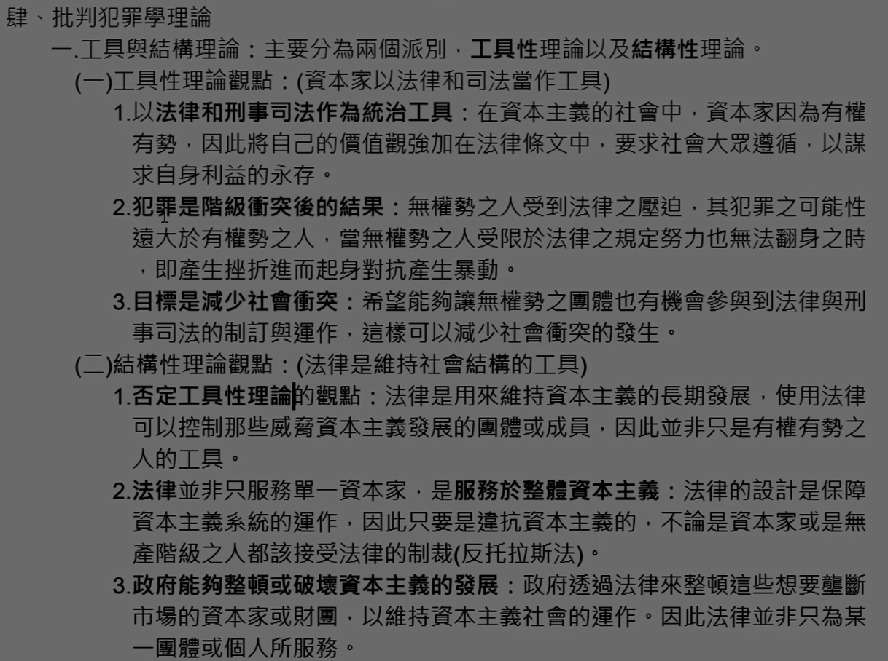

<!-- v56 -->
### 二、左派現實主義：

（一）代表人物：英國學者李和楊格。

（二）基本主張： 
1\. 使用現實主義來詮釋犯罪：反對烏托邦式的理想主義認為犯罪人或街頭混混是革命者的主張，對於現實主義來說，犯罪人或街頭混混掠奪了更為貧窮的下階層成員，因此這些下階層的人被資本家和犯罪人雙重迫害。  
2\. 犯罪的公式：剝奪感+對社會的不滿情緒+缺乏政治權力。因此貧窮的中下階層對社會的不滿產生了犯罪行為。

（三）犯罪預防對策： 
1\. 刑事司法體系為整體大眾服務：犯罪被害人存在於社會各階層需要保護，因此產生犯罪控制的需求，因此刑事司法機制是為了社會大眾服務的，希望警察能減少使用致命武器而以耐心來對待。  
2\. 先發制人的嚇阻犯罪：指的是社區組織在警察部門介入之前就能夠消除或嚇阻犯罪。因此支持以社區為基礎的犯罪預防策略，並認同緊張理論、芝加哥學派。

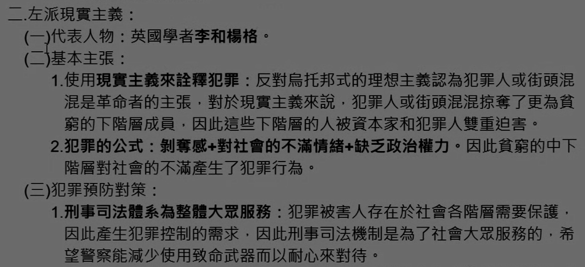
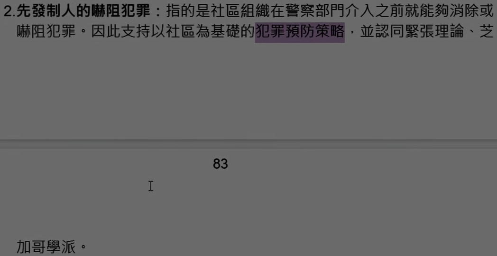

### 三、社會女性主義理論：

（一）代表人物：梅瑟史密特。

（二）理論內涵： 
1\. 女性犯罪率低的原因：主要是被資本家以及父權主義雙重剝削雙重邊緣性），在家庭中因為被孤立較少接觸到犯罪行為，在資本主義社會中因為充斥父權色彩因此也不容易接觸菁英犯罪。在資本主義下的低階層女性是沒有權力的，他們被迫從事的犯罪行為也多半是些不嚴重且、非暴力且自我傷害的行為，如：賣淫、吸毒。
2\. 女性的無權力特性導致被害：在資本主義社會裡下階層男性追求溫飽或物質享受，其遭到挫折時就會採取暴力手段對待柔弱的女性，這就是為何下階層家庭常發生家庭暴力或是親密暴力的犯罪。
3\. 男子氣概與女性被害：在每一種文化中都鼓勵男性表現出男子氣概，這代表著權力、負責、好鬥及控制慾。無法達到的男子會被鄙視，所以他們會在家庭以及職場上主導控制女性，以證明他們的男子氣概。因此在資本主義中為了贏得尊重及經濟大權，對女性施暴是必然的。

（三）女性犯罪人於刑事司法的不公平： 
1\. 刑事司法體系與父權官僚：認為刑事司法體系與父權官僚對女性不公平的待遇，導致某些性早熟的少女過早被監控這是不人道與剝奪自由的。
2\. 偏差行為被放大檢視：在父權嚴密的社會控制下，女性偏差行為被放大檢視，刑事司法體系以雙重標準來審判這些案件，導致相同的偏差行為，女性被視為比男性還嚴重而施以較重的刑罰，這對女性並不公平。

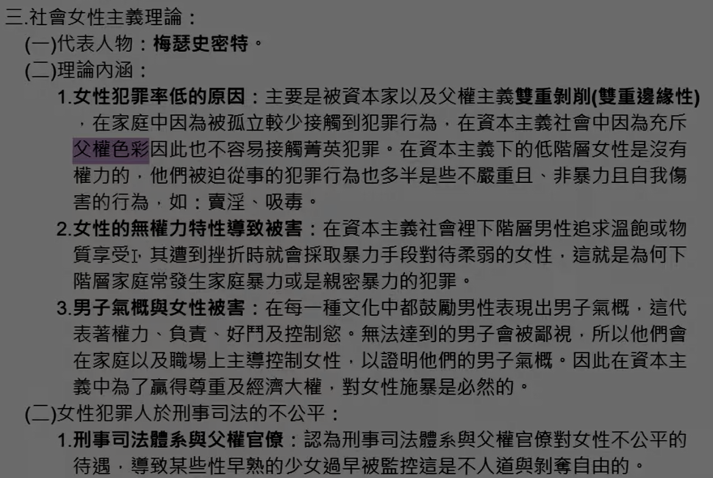
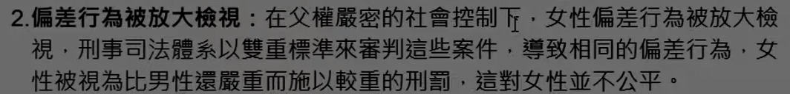

<!-- v57 -->
### 四、權力控制理論：太

#### （一）代表學者：

加拿大學者哈根於1980年代中期，整合了馬克思主義、社會控制理論（赫胥）、古典學派等概念，加以整合發展的一種新的理論，簡稱權力控制理論。

#### （二）理論內涵：

1\. 哈根發現少年犯罪和性別、階級、家庭功能密切相關。其中性別影響了犯罪類型，階級越高男性犯罪比率越高，階級越低越趨向平均。因為階級高的家庭對於男孩的管教較鬆散，對於女孩的管教嚴格，但是在下階層中父母忙於賺錢，則較沒時間管教，因此對於男女的管教上較為平等。

2\. 在1987年哈根使用了另一種階級概念來解釋少年犯罪的性別差異。首先他將人們分成控制階級和服從階級，而父母在工作中是處於何種階級會影響其對兒女的教養而呈不同的犯罪情形。 
(1) 父權式家庭：此類家庭通常父親負責賺錢，母親負責家管，父親擁有經濟能力便是屬於控制階級，而母親沒有經濟能力屬於服從階級因此對於男孩女孩的管教也將趨向於此模式。一般母親通常採取對男孩較為放任之態度期望他們長大後成為像父親的樣子。但對於女孩則採取較嚴格之管教，期望她們長大後像母親的樣子。由於管教之態度寬嚴不同導致男孩犯罪率較高，而女孩因受到嚴格之管教所以犯罪率較低。  
(2) 平權式家庭：在此類之家庭中，父母常常都是處於同一個階級，皆是控制階級的上層階級家庭或是皆是服從階級的下層階級家庭。因為父母親彼此的地位較為平等，因此父母親對子女之管教態度也較為平等，女孩子並不會受較嚴格之管教方式，所以男女犯罪率在平權家庭會較為平

3\. 評價：促進了犯罪學研究的新觀點，包含了性別差異、階級地位與家庭結構的研究觀點。  

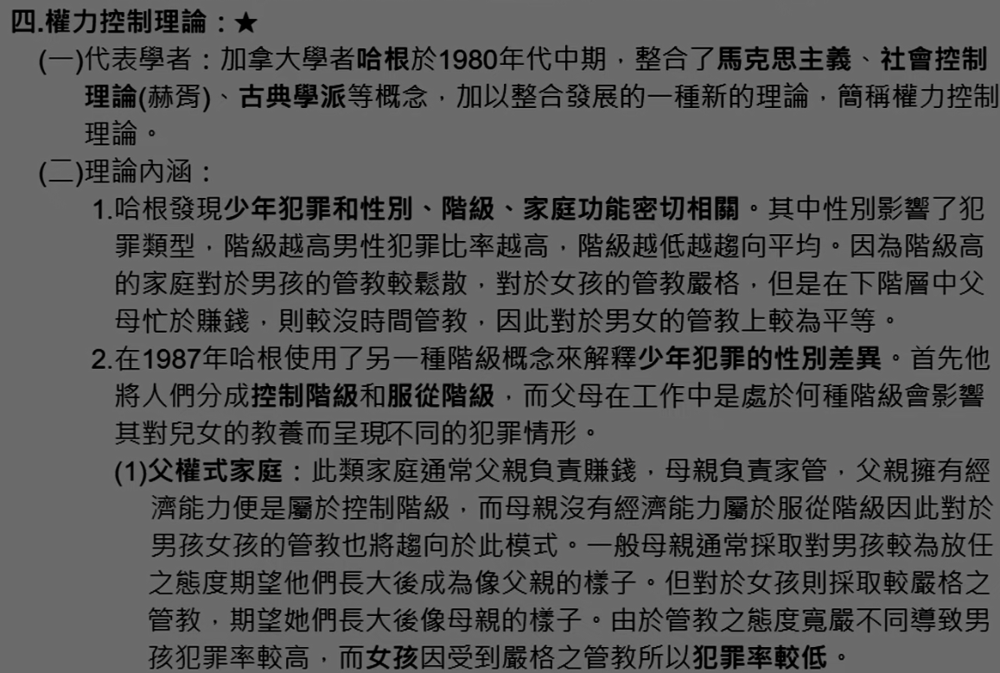
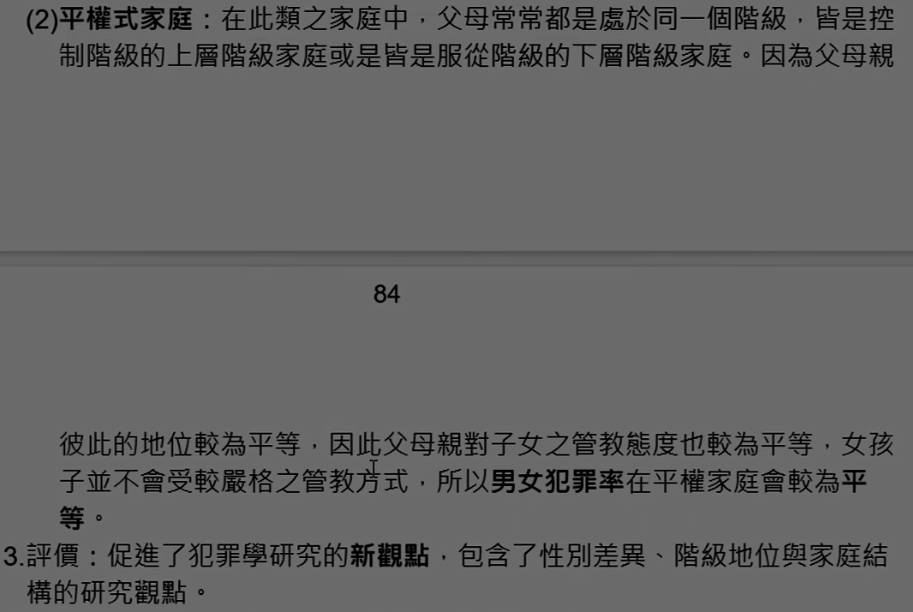
<!-- v58 -->

### 補充：另一個權力控制理論（翻譯問題，並非分類於批判犯罪學）。

（一）代表學者：美國學者歐布萊恩於1991年整合「性別比例論」和「日常活動理論」，提出所謂的「權力控制理論」，企圖解釋女性犯罪與被害現象。

（二）理論內涵：歐布萊恩認為，社會中性別分配比例會影響到社會對於女性的價值觀，並進而影響女性的社會角色與生活型態。而女性社會地位的高低會影響其參與犯罪或被害之可能性。

（三）依性別比例論的觀點，當社會中男性比例較高時，社會便會珍視女性，並強調女性傳統家庭角色，此時女性便會以家庭生活為重心。當社會中性別比例接近時，社會便較不會重視和強調女性傳統角色，女性因而亦不以家庭生活為重心。

（四）依日常活動理論的觀點，女性以家庭生活為重的結果，其犯罪和被害之可能性便會減少。女性若不以家庭生活為重心，而開始致力於向外發展尋求成就，其從事犯行與被害之可能性將會大大提高。

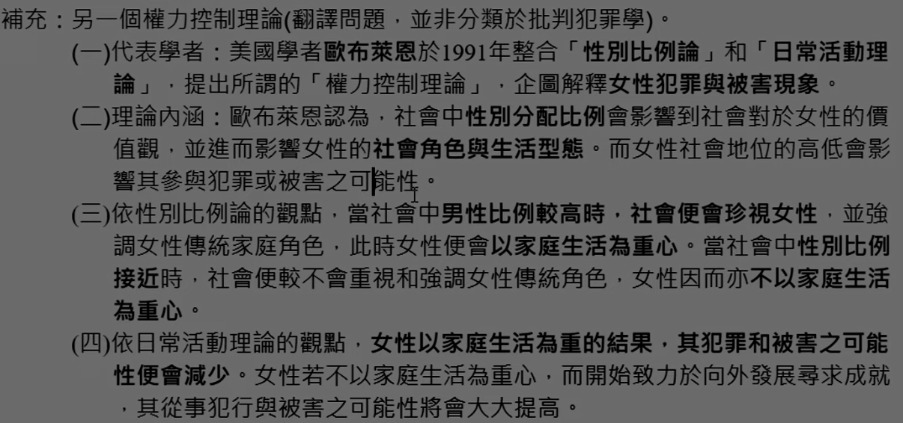

### 五、和平建構犯罪學理論：

（一）代表學者：倍平斯基、昆尼、傑爾、烏布萊特、懷特。

（二）理論內涵： 
1\. 避免社會衝突：屬於對於前面社會衝突理論的反思，認為此前的犯罪學理論效果不大，更可能導致社會的分裂和衝突。主張以和平、宗教哲學的思考模式來探討犯罪。  
2\. 以和平方式取代刑罰：主張以調停、調解、和解等方式來取代刑罰，如此更能使犯罪人回歸社會達成族群的融合，修復式正義為此理論核心。

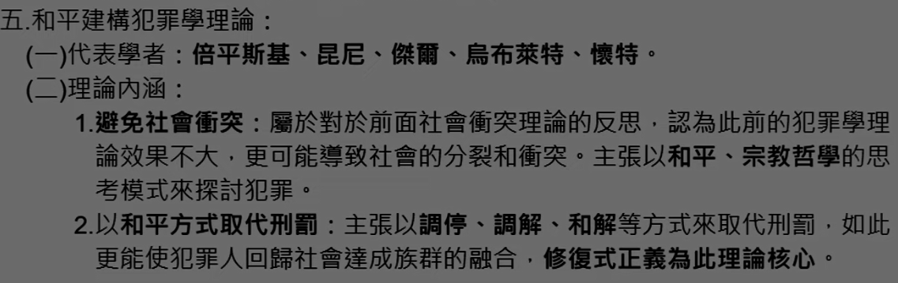

## 伍、修復式正義：太太

### 一、定義：

自1970年代起，刑事政策出現分水嶺，主張和平建構犯罪學之學者受到啟發，主張修復式正義。根據學者傑爾的說法「修復式正義是一種要修復被害人從犯罪中得到傷害與需要的程序，這種程序必須課以加害人責任，並邀請被害人、加害人與社區代表共同參與此程序。」而國內台北大學許春金教授將修復式正義定義為：「在一個特定的犯罪事件中，利害相關的人聚集在一起，討論與因應如何處置該犯罪後果的一種過程。」總而言之就是被害人損害的權利和尊嚴要得到滿足，加害人、被害人、社區彼此間已損壞的關係要得到應有之修復。

### 二、理論基礎：

源於犯罪衝突學派的和平建構理論以建構安全正義的修復式正義目標，此外澳洲犯罪學家布列斯偉特提出的明恥整合理論中也提出整合性羞恥與修復式正義的結合，可以有效降低犯罪率。

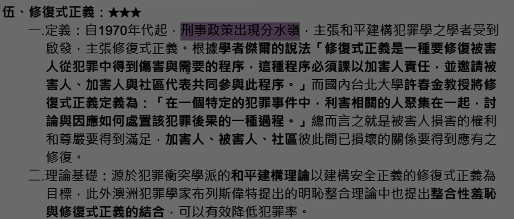

### 三、興起原因：（許春金）

（一）高監禁率：高監禁率表示使用懲罰方式的犯罪防治方式效果不大。  
（二）高再犯率：表示使用懲罰方式並沒有使犯罪人改悔向上。  
（三）財政困難：因為懲罰方式導致的高監禁率和高再犯率造成財政負擔很重。  
（四）被害者犯罪統計的實施：被害者普遍對於懲罰式司法不滿，因為並未注重他們被害者的權益。  
（五）開始重視被害者權益：1970年代開始女權和被害者權利運動興起，開始注重被害者之損害恢復。  
（六）社區處遇和私人保全受到重視：1970年代以後，減少刑事司法機構的介入由私人以賠償方式處理犯罪的觀點獲得許多支持。

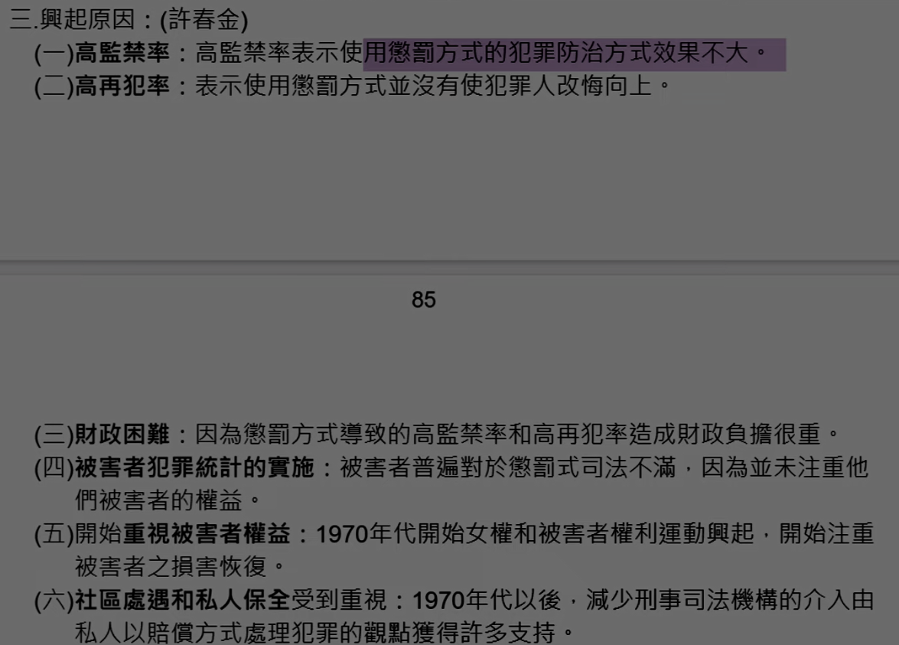

### 四、基本原則：（許春金）

（一）以社會、衝突的觀點來看待犯罪事件，而非法律的觀點：認為犯罪事件法律不是件大事，但是破壞了社會與社區的關係就很重要，因此考量的點是「回復損害、回復和平，而非懲罰加害人。  
（二）修復式正義是回復損害的關係式正義：主張讓彼此的關係回復到傷害發生前的原狀或是等價的賠償。  
（三）修復式正義的目的是和平與福祉;主張發現問題、回復損害、治療創傷而能進行廣泛有意義的社會革新，從而替社會創建更多美好的和平與福祉。  
（四）修復式正義尋求加害者、被害者、社區的共同參與與治療：透過三方的調解、斡旋達到三贏的局面。使被害人回復原狀，加害人付出賠償，社區給予整合及賠償的機會，回到犯罪前的和諧狀態。  
（五）以社區為最基本處理犯罪的機制：社區有義務提供並強化支持的力量，幫助居民終止犯罪及修補傷害，使加害人能夠真正的改悔向上。

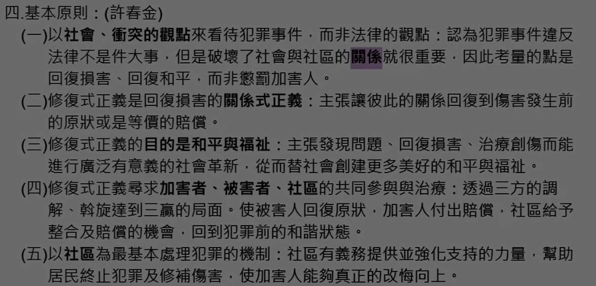

### 五、在少年體系的作法與限制：

#### （一）參考使用家庭團體會議制度：

參考紐西蘭在1989年的「兒童、青少年及其家庭法案」，使用該法案的對象為14-17的青少年，引用毛利族在處理違法事件時讓家庭及社區共同參與的傳統，來建立一個適合青少年的司法制度。

#### （二）使用非正式社會控制與轉向計畫：

使用非正式社會控制以及轉向處遇制度，可以避免機構性處遇造成的惡性感染和標籤化作用。

#### （三）成效與限制：

1\. 成效：初期會議制度以及轉向向計畫的實施成效不佳，但是近年來大部分的被害人已經可以接受這個制度。此一制度實施後與1980年代相比，進入少年法庭及監獄的人口已大幅下降，也證實轉向有發揮其作用。

2\. 限制： 
(1) 少年法院人力不足。  
(2) 國人情感上難以接受。  
(3) 參與人員不夠專業。  
(4) 經濟能力造成處遇不公。  
(5) 犯罪類型適用性不一。

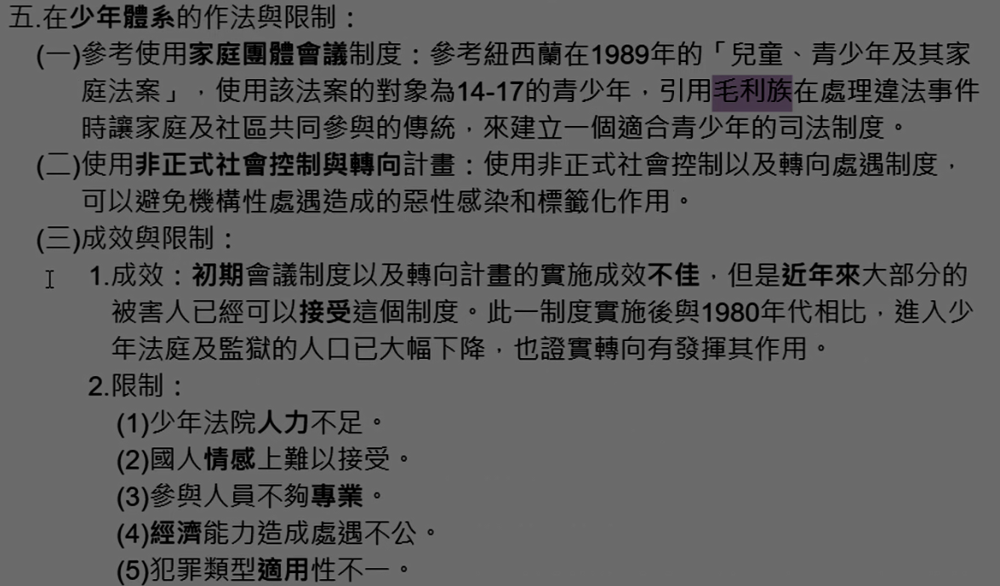

<!-- v59 -->
### 六、應用於實務上的型態：

（一）被害者與加害者調解制度：指的是由被害人、利害關係人、加害人三方在安全的環境中會面，通常會有一位經過訓練的仲裁者來協助，被害人告訴加害人犯罪對他造成的傷害並討論賠償事宜。

（二）家庭團體會議：將受到犯罪影響的所有成員都聚集在一起，包含被害人、加害人及其家庭成員，共同討論事情的解決方式。這種會議也是由受過專業訓練的人員所召集，加害人要先承認自己的罪行，且參與者都要自願的。

（三）審判圈：亦稱為和平圈，運用傳統印第安人儀式將被害人、加害人、法官、檢察官、辯護律師、警察等相關人士聚集一起，大家以誠懇的態度共同解決事件，無論是少年犯或成年犯，均可適用審判圈。

（四）社區修復委員會：由受過專業訓練之社區居民所組成，與加害人公開討論後，共同擬訂一套修復和補償計畫，而加害人必須承諾在特定時間內完成此計畫，委員會向法院提出報告執行情形。

（五）其他類型： 
1\. 被害者陳述事件影響判决：由被害人以書面、口頭方式描述犯罪事件如何影響本人及周遭朋友，可提供法院做為量刑的參考。  
2\. 補償：通常是法院命令加害人對造成的損失加以回復，也是被害人權利的核心。  
3\. 社區服務：加害人對所屬社區提供公益服務，以便能修補其對社區的傷害與損失，一般為刑罰附加的一部分，目前台灣對於輕刑者已在實施（酒駕判決）。
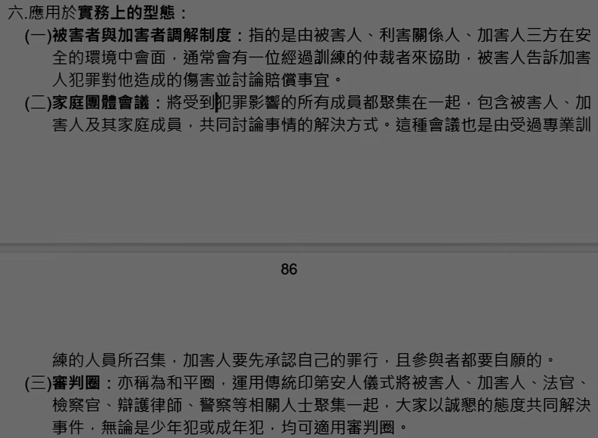
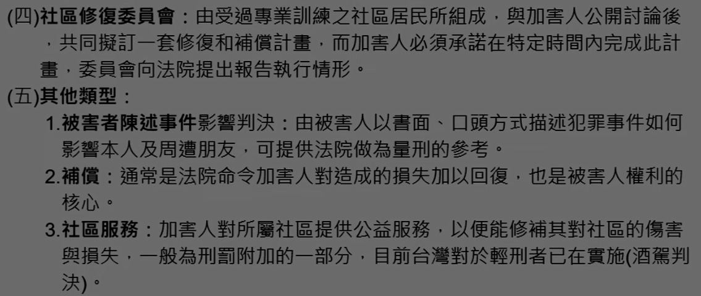

### 七、理論優缺點：

（一）優點： 
1\. 重整功能：使犯罪人能夠復歸社會。  
2\. 修復功能：修復被害者、加害者、社區的關係。  
3\. 刑罰經濟：比司法程序耗費較少資源。  
4\. 新的刑罰替代方式：是一種解決社會衝突，回復彼此關係的新方法。

（二）缺點： 
1\. 應報主義學者認為太過仁慈。  
2\. 沒有實質威嚇力，無法達到一般預防與特別預防的效果。  
3\. 造成刑事司法的差別待遇，有錢人藉由賠償脫罪。  
4\. 造成司法網路過度擴張，此制度赋予了許多原本沒有社會控制力人權力，會造成更多案件進入司法程序。  
5\. 因無法隔離犯罪人，容易造成重複被害且被害人不一定得到補償。

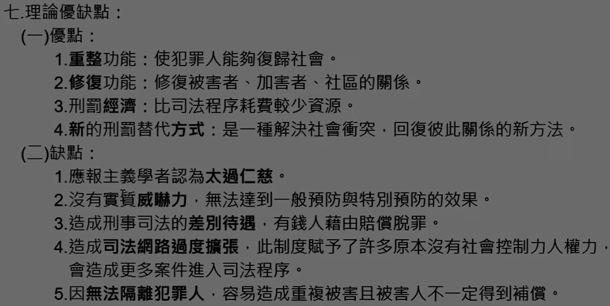

### 八、我國實務上具有修復式正義理念的相關制度：太

（一）緩起訴：依照刑事訴訟法253條之2規定，檢察官為緩起訴時得命被告於一定「時間內遵守或履行各款事項，例如向被害人道歉、立悔過書、損害賠償、向特定機構提供義務勞務，等。  
（二）緩刑：依照刑法74條第2項規定，命行為人向被害人道歉、立悔過書、損害賠償、向特定機構提供義務勞務，等。  
（三）認罪協商：依照刑事訴訟法455條之2規定，檢察官訊問被害人意見後，就下列事項進行協商，犯罪人需接受緩刑宣告、對被害人道歉、支付相當數額賠償金。  
（四）少年不付裁定之審理：依照少年事件處理法29條規定，認為情節輕微不付審理為適當者，得為不付審理之裁定，並轉介適當之機構進行輔導。為上述裁定前，得斟酌情形，經少年、法定代理人、被害人同意，向被害人道歉、立悔過書、損害賠償。  
（五）少年保護處分：依照少年事件處理法42條規定，可對少年裁定保護管束並得命勞動服務之保護處分。

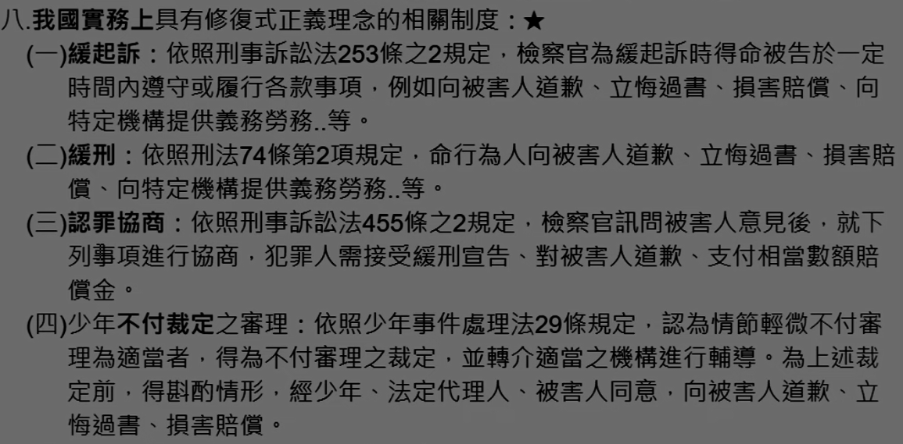
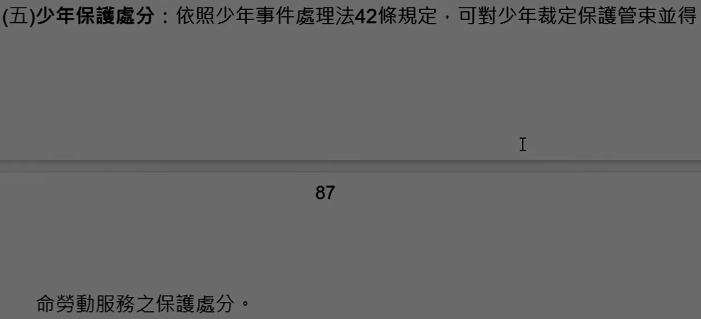

## 陸、傳統犯罪學理論和衝突犯罪學理論的差別：

|                                    | 傳統犯罪學                 | 衝突犯罪學                               |
|------------------------------------|----------------------------|------------------------------------------|
| 犯罪本質                           | 犯罪和非犯罪本質上是不同的 | 犯罪和非犯罪本質上沒有區別，             |
| 核心                               | 解釋人為何犯罪             | 解釋為何某些行為是犯罪，某些行為不是犯罪 |
| 對犯罪人「從生物和心理關心個人特質 | 重視社會和法律觀點         |
| 犯罪與犯罪人                       | 犯罪和犯罪人本身有關       | 犯罪是社會和階級制度的問題               |
| 法律定義                           | 接受法律對於犯罪定義       | 法律中的犯罪是威權團體所訂定             |
| 社會反應                           | 認同威嚇和治療、矯正的功用 | 4D，致力於實質平等                       |
| 犯罪預防                           | 以現有社會科序來預防犯罪   | 創造平等社會消除犯罪                     |

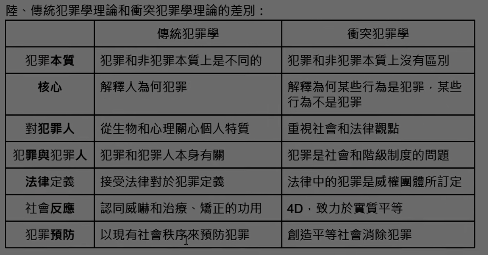

