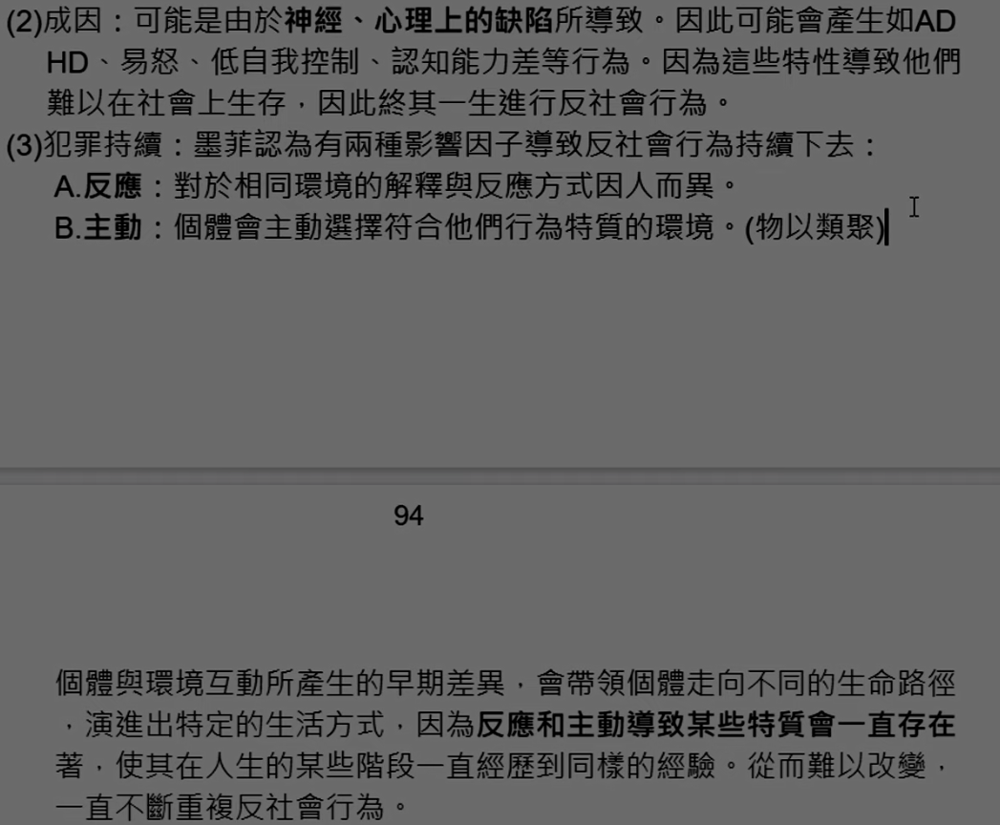

# 主題八：發展性犯罪學理論

<!-- 60 - 67 -->
發展性理論主要是因為1970年代前的犯罪學理論都採取靜態或是單一原因論的研究方式，因此無法全面解釋複雜的犯罪現像。因此發展性理論以動態、多因的方式來研究犯罪，主要分為潛伏特質理論和生活周期理論。

<!-- v60 -->
## 壹、潛伏特質理論：

每個人出生後不久形成了犯罪性，在日後的人生過程中呈現穩定的狀態且不容易改變。

### 一、人格特質理論：

（可和心理學派歐波特的人格特質理論一起背）

#### （一）代表學者：

格魯克夫婦分析比較並追蹤美國麻州少輔院500名少年和一般少年，研究反社會行為之因素，於1950年代出版的書中主張少年犯罪與人格特質有關。

#### （二）理論內涵：

1\. 犯罪研究應重視生物、心理、環境、社會等各層面之因素。  
2\. 屬於低智商、身心障礙、鬥士型體格較容易持續犯罪（生物），兒童時適應不良將影響成年適應狀態。  
3\. 家庭關係差、經濟不良、學業成就差，容易陷於犯罪。  
4\. 犯罪少年人格特徵：虛偽多詐、無愛人與被愛的能力、反抗權威、情感不成熟、自我中心、超我不彰..等。  
5\. 早期反社會行為可能持續犯罪生涯到成年。

### 二、慢性犯罪者研究（同生群縱貫研究）：太太

#### （一）代表學者：

渥夫幹、雪林、費格利歐於1972年共同提出。

#### （二）研究內容：

1\. 透過同生群縱貫研究的方式來探討同生群偏差行為少年犯罪的成因和相關因素，他們發現少年的非行行為與犯罪生涯有密切關係。  
2\. 渥夫幹等人追蹤了1945年出生的9945名少年至18歲，發現樣本中6%的人竟然累犯高達5次以上，並且觸犯了51.9%的犯罪數量，這些常常累犯的青少年已經成為了「慢性犯罪人」。不但犯罪會持續而且嚴重性會增加，因此這些人會成為刑事政策上使用長期監禁優先處置的對象。  
3\. 「種族」成為預測少年犯罪最重要的原因，社經地位、教育、智商和學業成績都透過種族與青少年犯罪有關。

#### （三）對刑事政策影響：

1\. 對於慢性犯罪人使用選擇性長期監禁。  
2\. 累犯、重大犯罪採取王振法案。  
3\. 我國為：(1) 提高數罪併罰有期徒刑上限至30年，(2) 假釋門檻提高至25年，(3) 重罪三犯、性侵犯治療無效者不得假釋。

#### （四）缺點：

根據個人特徵來評定犯罪可能性並不妥當，研究存在種族歧視和階級的偏見，違反罪刑均衡原則。

<!-- v61 -->
### 三、一般化犯罪理論:太太

#### （一）代表學者：

赫胥、高佛森於1990年出版的《一般化犯罪理論》一書中整合了古典學派和實證學派的觀點後提出本理論，屬赫胥之前提出的社會鍵理論的延伸，又稱為「自我控制理論」或是「犯罪共通性理論」。整合了社會鍵、生物社會學、心理學、日常活動理論及理性選擇理論。

#### （二）理論內涵：

將犯罪區分成犯罪性+犯罪行為所造成，犯罪行為是古典學派所探討的重點，而犯罪性是實證學派所重視的。

1\. 犯罪性：又稱為「低自我控制」或「衝動性」，指的是抑制不良行為的能力不佳，行為人有追求短暫的快樂而無視於長遠後果的一種傾向。犯罪性並不是犯罪的充分條件，不依附犯罪存在，只是產生犯罪的一種必要因素罷了。其主要特徵有： 
(1) 自我中心取向。  
(2) 衝動性格。  
(3) 喜好刺激性、好冒險。  
(4) 短視近利，追求暴力及性的快樂。  
(5) 懶惰，缺乏勤奮、執著、持續。  
(6) 挫折容忍力低，容易用暴力解決事情。  
(7) 不穩定的人際關係。  
(8) 偏好肢體活動，不熱衷學習。  
(9) 認知與學業技術拙劣。

2\.犯罪行為：指的是以暴力或是詐欺來追求自我滿足的行為，發生須與其他「條件配合（如：活動、機會、被害者）。

3\. 犯罪性與犯罪行為的關連性： 
(1) 低自我控制的衝動性格，讓青少年經常追求冒險、刺激、暴力等偏差行為，而不喜好傳統的活動，如：讀書、上教堂。  
(2) 具有犯罪傾向的青少年雖不至於馬上犯罪，但常常沉溺於獲得立即滿足的偏差行為，例如：抽菸、喝酒、賭博、不正常的性行為。

4\. 形成低自我控制（犯罪性）的原因：家庭+學校。 
(1) 家庭拙劣的育兒技術：家庭為早期社會化的場所，若沒有好的教養則容易形成低自我控制。
(2) 學校功能不健全：學校是第二個養成社會化的場所，若未能和家庭好好配合則容易使低自我控制加劇。

5\. 犯罪生涯發展：赫胥和高佛森認為青少年早期的低自我控制形成後，結合外在環境因素，所導致的犯罪或偏差行為在青少年中期達到最高峰，然後因為兵役等因素急遽下降。但是只有「自我控制，並不會隨著年齡而變化，終其一生都難以改變。犯罪之所以下降是因為外在的因素所導致，例如：體型器官的變化、生活型態改變。雖然赫胥的理論也有探討核心犯罪者，但是他並不主張選擇性長期監禁。

#### （三）綜合上述形成的的犯罪歷程：

低自我控制特質（前述9點） + 低自我控制 + 弱的社會聯結（附著、奉獻、參與、信仰） + 犯罪機會（幫派、自由時間、藥物、適合標的物） -> 犯罪（包括偏差行為）。

#### （四）問題行為症候群：

容易發生意外事故以及追求短暫享樂的問題行為，和犯罪行為有高度關聯性，可視為犯罪發生的前兆，自我控制越低，問題行為會越

#### （五）一般犯罪理論與社會控制理論之比較：

<table>
	<!-- row 1 --> 
	<tr>
		<td align="center"></td>
		<td align="center"><b>一般犯罪理論</b></td>
		<td align="center"><b>社會控制理論</b></td>
	</tr>
	<!-- row 2 --> 
	<tr>
		<td align="center"><b>探討層面</b></td>
		<td>微觀，探討個體內在與外在社會環境互動產生何種結果。</td>
		<td>微觀，探討個體社會化的過程</td>
	</tr>
	<!-- row 3 --> 
	<tr>
		<td align="center"><b>兩者關係</b></td>
		<td>弱的社會鍵是低自我控制產生的原因。</td>
		<td>低自我控制容易造成弱的社會鍵。</td>
	</tr>
	<!-- row 4 --> 
	<tr>
		<td align="center"><b>犯罪成因</b></td>
		<td>擁有低自我控制（犯罪性）+外在環境誘發</td>
		<td>四種社會鏈（附著、參與、奉獻、信仰），決定人是否犯罪</td>
	</tr>
	<!-- row 5 final --> 
	<tr>
		<td align="center"><b>預防對策</b></td>
		<td>從家庭、學校、社會等方面來治本，並整合從被害者面相的犯罪預防策略，如：情境犯罪預防、一般威嚇。</td>
		<td>良好的社會政策，改善社會問 題、教育問題、提供社會服務。</td>
	</tr>
</table>

<!-- v62 -->
### 四、差別壓迫理論：

#### （一）代表學者：

美國學者柯文於2000年提出差別壓迫理論，著墨於自我控制如何維持的論點。他認為一個人的自我控制和生活週期中對於各種壓迫經驗的適應有關。也就是對於壓迫適應得好就有好的自我控制，適應不好就會低自我
控制。

#### （二）理論內涵：

1\. 生活壓迫力：自我控制的強度會受到壓迫而改變，而生活中常見的兩種壓迫力，是由別人給的以及從自己身上發生的。如果適應不良會對我們產生危害。 
(1) 人際壓迫力：是一種來自於重要關係人直接的壓迫，方式有威脅、恐「嚇、暴力等。  
(2) 個人的壓迫力：個人無法控制的且發生在個人身上的壓力，例如：失業、失戀、貧窮等社會、經濟上的壓力。

2\. 面對壓迫的適應： 
(1) 在個人方面：如果在高壓下如果產生了高憤怒，本身又屬於低自尊以及社會鍵不佳的個體，則可能會產生一些絕望的反應，而產生低自我控制「而引發犯罪行為。
(2) 在人際關係上：如果人際關係差而個人又受到壓迫交互影響，形成無力感和低自我控制，也會造成沮喪引發犯罪行為。

3\.結論：個體之所以會產生低自我控制，是因為面對不良的人際關係以及個人的壓迫時，身心調適不當所造成的。

## 貳、生活周期理論：

犯罪的因素包含個人、社會、經濟、等因素，因此在犯罪的生涯中會受到這些因素的影響而改變。

<!-- v63 -->
### 一、互動犯罪理論（相互作用理論）：

#### （一）代表學者：

宋貝利將犯罪社會學理論和犯罪心理學整合後於1978年提出了「少年非行互動理論」。在傳統的理論中會把少年犯罪看成是社會發展的結果所導致的。但宋貝利認為少年犯罪也是社會發展過程中的一部分，犯罪是與其它社會因素相互作用而確定了內容，少年犯罪是許多因素相互作用的結果。該理論認為當代犯罪學理論有以下缺失：

1\. 單向作用：當代的理論在時間順序上認為都是因為早期的因素影響後期的因素（例如小時偷牽牛，長大搶銀行。），但有時不全然都是早期因素所導致。  
2\. 短時間性：大多數的理論都侷限在某一個時間點來探討，無法解釋整個少年犯罪從開始、發展到終止的整個過程。  
3\. 靜止不變性：現有的理論都假定整個社會結構中的因果關係是不變的，忽視青少年本人在因果關係的作用，因此無法解釋少年犯罪及其犯罪原因為何會變化。（可以用社會鍵理論為例說明：四個鍵即為固定因果關係。）

#### （二）理論內涵：

1\. 相互作用：宋貝利認為人類的行為在社會的相互作用中發生的，因此少年犯罪也是如此，少年為何犯罪，可能是由於社會對於少年的控制減弱。而相互作用理論就是再探討這些傳統的社會規範如何被削弱的?以及為何削弱會導致少年犯罪?因此宋貝利提出六個連結和三種因果關係模組來解釋在青少年的生涯中犯罪和這些社會規範的削弱之間的關係。

2\. 六個連結：前3屬於正向連結和社會鍵理論較相關，後3是學習變項和差別接觸理論較為相關，此六種連結相互影響。 
(1) 附著於父母  
(2) 致力於學業  
(3) 對於傳統價值的信念  
(4) 接觸犯罪同齊  
(5) 接受非行價值觀  
(6) 參與犯罪行為

3\. 三種因果關係模組：宋貝利的理論吸收了心理學中認知理論的內容，認為犯罪會隨著個人的成長過程而有不同的變化，犯罪也是一種人生的發展過程，也是一種動能的過程。 
(1) 少年早期：父母與家庭是促使少年和社會連結的重要因素。  
(2) 少年中期：朋友、學校、少年次級文化成為影響少年的重要變項。  
(3) 成年時期：傳統活動與對家庭的奉獻又讓青少年恢復以往和社會連結的方式。

### 二、少年犯罪路徑研究：

#### （一）代表學者：

羅伯在1993年進行同生群少年縱貫研究時，提出少年犯罪路徑的觀點，用來解釋少年是如何通往犯罪生涯的。

#### （二）理論內涵：

少年犯罪三路徑。

1\. 權威衝突路徑：主要是指少年早期利用一些叛逆行為來對抗父母、老師等管教上的權威，常見的態樣多為虞犯行為，有我行我素、不服管教、逃學、逃家等。  
2\. 內隱路徑：少年一開始犯行為較為靜態的犯罪但慢慢會演變成重大犯罪，例如一開始只是說謊或是侵占、偷拿東西，慢慢的會演變成毀損、偷竊、搶奪。  
3\. 外顯路徑：主要以暴力行為為主，態樣有騷擾、霸凌、鬥毆、強盜之類的較為嚴重的暴力行為。

#### （三）結論：

每一種路徑都會使少年繼續犯行，而且有些人會同時進入數個路徑，這種少年成年後就很容易成為持續性犯罪者。多數的持續性犯罪者從事多樣性的犯罪行為和反社會行為。

<!-- v64 -->
### 三、逐級年齡非正式社會控制理論：太太太

#### （一）代表學者：

由美國社會學家桑普森和勞伯於1993年提出，其基本内容是將格魯克夫婦（詳119頁）於1939年對麻州少年輔育院的研究資料重新整理、並進行次級資料分析後創新而成。他們提出轉捩點和生命重要因素的概念認為犯罪生涯會因此而改變。

#### （二）理論內涵：

##### 1. 內容：

(1) 結構變項（年齡、性別、種族、社經地位可以透過家庭和學校的中介作用來解釋兒童和少年時期的犯罪行為。  
(2) 兒童或少年時期的反社會行為會以各種不同的偏差行為，如：酗酒、竊盗、藥物濫用，延續到成年以後。  
(3) 但是無論早期人格特質如何，成年以後在家庭、職業、環境或重要生命事件的發生（轉捩點），都可以解釋犯罪的變化，包括犯罪的發生和終止。

##### 2. 修正一般化犯罪理論：

(1) 一般化犯罪理論認為低自我控制終其一生都不會改變。本理論認為兒童和少年早期的經驗和自我控制，可以解釋生命早期的偏差行為，但日後的人生經驗和生命事件對自我控制的影響仍然深遠（低自我控制會改變）。  

(2) 人生各階段的非正式社會控制對於個人是否開始或持續犯罪影響重大。例如：家庭、學校、職業、婚姻。

##### 3. 轉捩點：

(1)意義：會影響個人非正式社會控制力量的增強或降低的生命事件，這些生命事件會產生一種里程碑式的感覺，可以很明顯的感受個體在生命事件前後的不同。例如：婚姻、家庭、就業、環境改變。

(2)終止犯罪：
A. 切斷過去不良影響。（就業）  
B. 提供監督、監控以及社會支持成長的機會。（家庭、學校）  
C. 改變日常生活的結構或型態。（環境改變）  
D. 提供自我認同。（婚姻）

##### 4.理論新發展（生命史理論）：

桑普森與勞伯於2003年再度擴充原本的理論，增加了三個影響不同發展的因素，並將理論正名為「生命史理論」。此外也增加了兵役、服刑、戒治等正式社會控制的轉捩點也可以遏止犯罪之發生。

（1）個人意志力因素：人類的行為是有目的和系統性的，可以透過堅定的意志力來改變。例如：贖罪心態。  
（2）歷史脈絡因素：轉捩點也受到時代影響，經濟蕭條和經濟發達各有不同之影響。  
（3）情境脈絡因素：情境可以影響犯罪，若能夠避免或轉化不良之情境也能有效控制犯罪。

#### （三）犯罪預防的啟示：

依照各種轉捩點來看，有家庭面（婚姻、家庭）、工作面（就業）、鄰里環境面（環境改變）、正式社會控制兵役、服刑、戒治）、優化假釋與觀護制度（服刑、戒治）。

#### （四）結論：

1\. 贊同一般化理論的低自我控制，但認為低自我控制是可以改變的。  
2\. 成年後的生活對於犯罪之終止有其重要性。  
3\. 正式社會控制也會終止犯罪。  
4\. 犯罪的轉折和終止是一個動態的演化過程。  
5\. 意志力可以改變犯罪。  
6\. 核心犯罪者具有邊緣化以及與社會低度連結的特性。

#### （五）與一般化犯罪理論的比較：

1\. 相同點： 
(1) 犯罪原因：犯罪多因性觀點。
(2) 研究方法：同生群縱貫性研究。
(3) 低自我控制形成原因：家庭、學校等非正式社會控制單位，是影響兒童與少年社會化初期低自我控制的主因。
(4) 自我控制與犯罪關連性：低自我控制與犯罪有高度關連性。

2\. 相異點：

<table>
	<!-- row 1 --> 
	<tr>
		<td align="center"><b></b></td>
		<td align="center"><b>逐級年齡非正式社會控制理論</b></td>
		<td align="center"><b>一般化犯罪理論</b></td>
	</tr>
	<!-- row 2 --> 
	<tr>
		<td align="center"><b>少年偏差行為可否預測成年犯罪</b></td>
		<td>成年時期的重要生命事件，可以改變少年時的低自我控制。</td>
		<td>低自我控制一生難以改變</td>
	</tr>
	<!-- row 3 --> 
	<tr>
		<td align="center"><b>非正式社會控制的意義</b></td>
		<td>是導致成年後不再犯罪的重要原因。</td>
		<td>非正式社會控制薄弱會形成低自我控制，因此是犯罪或偏差行為之來源。</td>
	</tr>
	<!-- row 4 final --> 
	<tr>
		<td align="center"><b>理論核心</b></td>
		<td>社會資本、轉捩點。</td>
		<td>低自我控制。</td>
	</tr>
</table>

<!-- v65 -->

## 参、其他觀點介紹：

### 一、社會互動發理論：

#### （一）代表學者：

由派特森於1989年提出，認為越早發展出犯罪特質的個體，其犯罪惡性通常會持續到成年後。這些早期的反社會行為既然如此容易造成長大後的犯罪，那就要找出是何種機制造成早期的反社會行為。這種機制就叫做「社會互動」。

#### （二）理論內涵：

1\. 派特森也主張反社會行為和家庭有高度相關，但他不認同社會控制理論強調的連結（附著）程度。他認為是因為家庭的喪失功能性（例如：無法監督、照顧）或是使用高壓管教手段才會導致反社會行為的產生，因為在這樣的情況下會給予個體刺激，而個體則使用反社會行為來回應。

2\. 派特森根據個體形成反社會人格的早晚，指出少年時期的犯罪軌跡有兩種

(1) 早發犯;由兒童末期延續到成人階段，形成的原因主要是因為家庭喪失功能性以及不當的管教。
(2) 遲發犯：由少年中期開始後持續下降，形成原因在家庭方面並未失能但是較為縱容導致接觸不良友伴。

<!-- v66 -->
### 二、兩分類犯罪人理論：

#### （一）代表學者：

美國學者墨菲於1993年使用非官方資料檢視了少年第一次犯罪的年龄分布情形，提出了兩分類犯罪人理論。他發現多數人第一次犯罪的年龄在青少年時期，而在青少年期（7-11歲）之前有犯罪記錄者較少，因此表示有些人的犯罪期是從童年時期開始的。

#### （二）理論內涵：

對於青少年時期為何犯罪率特別高的情況，墨菲推測可能是由於某種原因所導致。他發現青少年犯罪者分為兩個族群，一種是從童年開始就有偏差行為，另一種是在青少年時期才突然的出現偏差行為。因此他將年齡曲線15-17歲中，犯罪率達到最高峰的青少年犯罪人，區分為一生都會持續犯罪的「生活周期持續性犯罪人」（LCP）以及只會在青少年時期犯罪的「侷限於青少年時期犯罪人」（ALO）。

##### 1. 生活周期持續性犯罪人（LCP）：

(1) 特質：此類型的犯罪者的特質就是連續性，從少年早期就出現犯罪行為並且在各種不同時期以不同的形式來表現出反社會行為。這種犯罪者是穩定且持續的犯罪者，不論何時何地都會有犯罪的可能。

(2) 成因：可能是由於神經、心理上的缺陷所導致。因此可能會產生如ADHD、易怒、低自我控制、認知能力差等行為。因為這些特性導致他們難以在社會上生存，因此終其一生進行反社會行為。

(3) 犯罪持續：墨菲認為有兩種影響因子導致反社會行為持續下去： 
A.反應：對於相同環境的解釋與反應方式因人而異。  
B.主動：個體會主動選擇符合他們行為特質的環境。（物）個體與環境互動所產生的早期差異，會帶領個體走向不同的生命路徑，演進出特定的生活方式，因為反應和主動導致某些特質會一直存在著，使其在人生的某些階段一直經歷到同樣的經驗。從而難以改變，一直不斷重複反社會行為。  

##### 2.侷限於青少年時期犯罪人（ALO）：

(1) 特質：此類型犯罪人不具有連續性，犯罪生涯只有在青少年時期，約占青少年犯罪人數的95%，屬於一種短暫的犯罪行為態樣。他們有較短的犯罪生涯和較少類型的犯罪型態。

(2) 成因：古代社會在青少年階段就要開始承擔成人的角色和義務，但現今社會對於醫療、營養的進步，加速了青少年的生理成熟，但是另一方面由於社會分工需要高度的技術因此需要經過訓練的人才，使得青少年反而較遲進入勞動市場。因此個體的生理發展和社會發展呈現了5-10年左右的落差，這落差稱為「成熟缺口」。而此時期的青少年犯罪者主要是因為不習慣「成熟缺口」所導致。簡單的說就是青少年覺得自己是大人了不要在當他們是小孩子，可是社會卻對他們限制，因此他們為了尋求自我認同和價值，就容易和已經解決成熟缺口問題的偏差朋友混在一起，進而學習他們的偏差行為。

(3) 犯罪終止：墨菲認為大部分的犯罪理論都只提到犯罪的持續性和嚴重性，卻沒提到許多青少年犯罪並不會持續到成年。他提出的「成熟缺口」論述了犯罪中止的情況。當跨越成熟缺口的青少年取得了成年人的地位，他們的犯罪動機就會變得薄弱，因為犯罪會給他們諸多限制甚至會失去現在所擁有的一切，因此不管是正式的處罰或是非正式的處罰都會讓他們重新衡量犯罪的代價。

<!-- v67 -->
### 三、贖罪腳本理論：

以終止犯為核心。

#### （一）代表學者：

英國學者馬魯納主張「終止」的概念，提出本理論。終止的意義是「一個人長期的避免回到過去從事持續性犯罪的生活模式」，他認為終止是一種持續的過程，而不是一個轉捩點突然造成個人的改變。因此應該從主觀的態度來探討為何終止犯罪者和持續犯罪者，有著類似的情境但是有人持續犯罪，有人卻選擇終止犯罪。

#### （二）理論內涵：

持續犯罪者和終止犯罪者在類似的情境下，對於自己的遭遇有不同的詮釋方式。

1\. 持續犯罪者：這些犯罪者都有很深的宿命論，動不動就將宿命放在嘴邊，認為一切無法改變，覺得自己無助缺乏機會，用宿命將自己標籤化，因此陷入一種貧窮的循環。他們的人生腳本充滿著譴責，認為自己的行為雖然不對但是因為這是宿命，因此即使遭到許多人的譴責，他們依然故我。

2\. 終止犯罪者：這種犯罪者是有能力抓住機會讓自己變好的一群，就算是在最悲慘的時候，他們也是會找尋任何方式讓自己變好。他們的訪談透露出救贖的感覺，講述著現在的自己是解放後的真實自己，但不悔恨以往的自己，認為也是因為過去的經驗才讓自己現在那麼好。這樣的真我由三個部分組成： 
(1) 不管情況多壞，自己都是一個好人，比其他犯罪人好。  
(2) 過去會犯罪都是環境所逼，自己無力控制。  
(3) 改過向善是一個由外在逆境解放自己真實自我的過程。

#### （三）馬魯納認為：

馬魯納認為可以使犯罪人維持不犯罪比較重要，並認為內在改變才是 犯罪的主因，因此提出可以使犯罪人維持不犯罪狀態的三種因素：

1\. 生產力動機：工作會帶來成就感，滿足生存意義並提供了正面形象，也讓罪人有機會對社區補償，來獲得接受與認可。

2\. 羞恥與真我：馬魯納發現對於犯罪次數少的犯罪者，羞恥的情感是可以幫助他們不犯罪的。但是對於一個有十年以上犯罪生涯的長期犯罪者來說，羞恥會造成反效果，他們需要的是希望與肯定，因此中立化技術可以讓他們保護自己免於羞恥，並且認為自己是善良的，是可以回歸社會的。

3\. 救贖儀式：犯罪人因為過去的犯行，被標籤成犯罪者，在社會中地位較低，因此需要透過社會地位升高的儀式來去標籤化。因此救贖的儀式包含了許多讚美和認可，並提供他們賦歸社會的機會，使他們重新塑造一個新的自我。

### 發展性犯罪學理論比較表：

| 理論             | 犯罪持續性                            | 犯罪改變                            |
|------------------|---------------------------------------|-------------------------------------|
| 一般性犯罪理論   | 持續一生                              | 犯罪性終身不變                      |
| 社會互動發展理論 | 只有早發犯會持續                      | 遲發犯罪會改變                      |
| 兩分類犯罪人理論 | 生活周期持續性犯罪人（LCP）會持續犯罪 | 侷限於青少年時期犯罪人（ALO）會改變 |
| 逐級年齡理論     | 可能持續，看社會資本和社會連結        | 可以改變、轉捩點、個人意志          |

