# 主題九：犯罪理論的整合

<!-- 68 - 73 -->
整合理論是1970年代之後興起的新趨勢，傳統犯罪學解釋犯罪多偏於微觀、片段，不夠全面。因此開始有學者截長補短的整合各種理論創出新理論，因此學習本節之前最好是熟悉前項的各種理論，不然會更看不懂喔!

<!-- v68 -->
## 壹、理論整合：

### 一、意義：

傳統犯罪學理論，多著重於某些特定犯罪來研究，因此有失偏頗，也容易忽視其他學科，也導致研究結果常常是單方面的武斷。因此學者期望能夠建立起一個可以完全解釋各種犯罪知識體系，期望能將各種不同的學科，如法學、社會學、心理學、醫學以及其他犯罪學理論或觀點加以整合，如此才能解釋複雜的犯罪現象。

### 二、發展原因：

（一）犯罪原因複雜：犯罪現象不是單一學科、因素可以解釋的。  
（二）理論蓬勃發展：各種理論都有其優缺點點，具有整合觀點的學者認為有些理論是可以互相整合的，可以更全面的解釋犯罪。  
（三）理論競爭：傳統理論認為「非我族類，其心必異。」通常不太能接受別的理論的觀點，但這種想法在學理上並不合理，為了避免互相殘殺導致研究停滞不前，故有倡導整合的聲音出現。  
（四）統計技術更新：運用多變項的統計分析方式，可以得到更多結果增加對犯罪的詮釋能力。

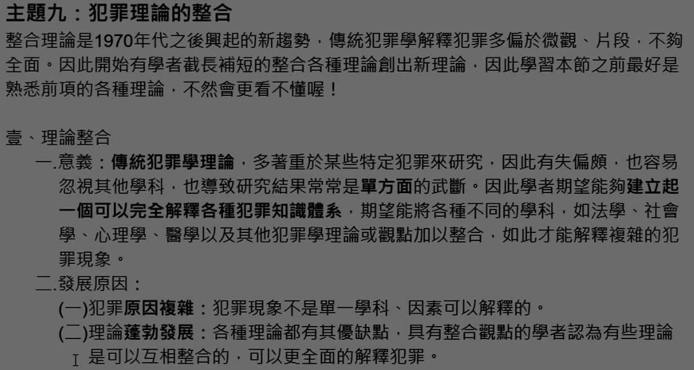
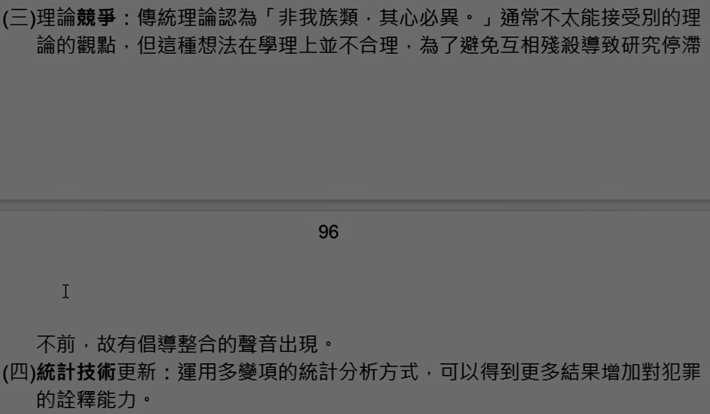

### 三、整合方式：太

（一）上下整合型：以一個比較容易類推使用的理論為主要核心，再去吸收其他理論的內容加以整合。例如：一般化犯罪理論吸收了社會控制理論，差別增強理論吸收了差別接觸理論。

（二）前後相加型：找出各種理論的關鍵變項，並依照因果關係將其排列組合，以發揮彼此的效用。例如：艾利歐的緊張、控制及學習理論就是將緊張理論、控制理論、差別接觸理論加以整合，以及明恥整合理論。

（三）重點抽離型（水平整合、命題整合）：找出理論共通的部分，適當的加以抽離後進一步整合，以形成一致性的整合理論。例如：明恥整合理論、風險樹理論。

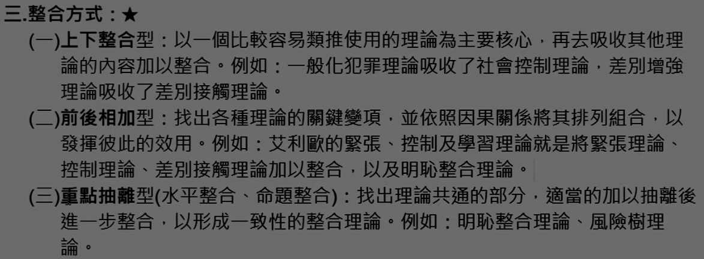

### 四、評價：

（一）優點：解決犯罪學理論彼此衝突的問題，以多元的方式解釋犯罪，並提出具體對策。

（二）缺點： 
1\. 犯罪理論對犯罪的適用性有限。  
2\. 各理論的基本概念難以整合，例如：人性假設、基本命題、產生背景。  
3\. 犯罪現象不斷變化，理論難以解釋。  
4\. 現存理論也可以繼續擴展，不至於要整合。

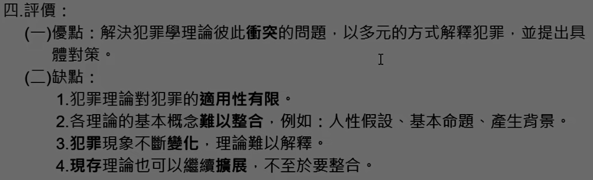

<!-- v69 -->
## 貳、各種犯罪整合理論：

這邊介紹幾種較有名的整合性理論。此外差別增強理論（艾克斯）、一般化犯罪理論（赫胥和高佛森）及權力控制理論（哈根）也是屬於整合理論的類型，已於前文介紹，不多闡述。

### 一、生物社會學習理論：

#### （一）代表學者：

傑佛利在《透過環境設計預防犯罪CPTED》一書中提出此理論，認為研究犯罪原因如果只注意到社會因素而忽視生物因素是不對的，例如蘇哲蘭的差別接觸理論排斥生物和遺傳對行為的影響。重視生物學習的學者史基納雖然是重視生物因素，但是又忽略了腦和中樞神經的功用。因此，傑佛利認為「犯罪行為是生物因素和社會環境因素交互作用之結果。」兩者都不可忽視。

#### （二）理論內涵：

##### 1. 三種系統：

產生犯罪行為是因為生物因素和社會環境因素交互作用之結果。我們每個人都有三種系統，即遺傳、腦、環境。遺傳因子在腦中與中樞神經系統交互作用，我們的大腦接觸了環境會學習各種行為，也會學習到犯罪行為。因此犯罪行為是社會、心理和生理因素交互作用的結果。

##### 2. 犯罪行為模式：

(1) 內省模式：以蘇哲蘭的差別接觸理論為代表。 
A.認為人有理性、自由意志，能夠獨立思考。  
B.身心二元論：人的所有行為都是由自由意志，經過思考後才行動的。因此行為都是人對環境的單項反應並沒有交互作用，行為不受到環境影響。因為人思考的是社會規範而忽略了環境。

(2) 行為模式：以史基納的制約學習理論為代表。 
A. 認為行為是受到外界刺激所引起的機械式反應。(動物實驗)   
B. 環境一元論：認為個體是空洞的，認為個體、腦、中樞神經並不會對犯罪有任何影響。

(3) 生物社會學習理論模式：整合蘇哲蘭史基納的理論。 
A. 認為行為是遺傳、腦、環境，這三點交互作用下的產物。
B. 身心環境多元論：個體對於外在的刺激會先經由腦吸收，做出決定，然後藉由中樞神經輸出形成行為。

### （三）預防犯罪之啟示：

1\. 瞭解犯罪形成的原因：要兼顧生物和環境因素，並且用科際整合的觀點來整合研究。  
2\. 控制遺傳因子和環境：遺傳因子可以尋求醫學的幫助，環境可以藉由社區內大家的努力而改變。  
3\. 控制生物因素：對於一些生理激素過多或是長腦瘤之人可以使用藥物或是開刀處理。  
4\. 使用環境設計：藉由妥善的設計可以降低人們的疏離感，可以增加人們的互動，良好的設計還可以形成天然的防衛。  
5\. 管制酒精及藥品：這些有刺激性的物品如果濫用會有產生犯罪的可能，因此要接受管制。

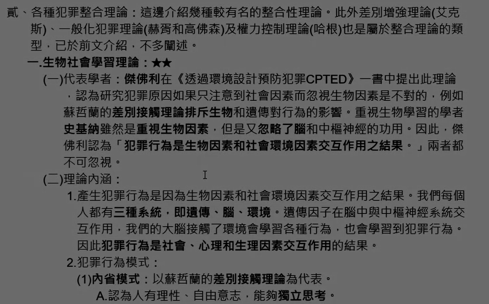
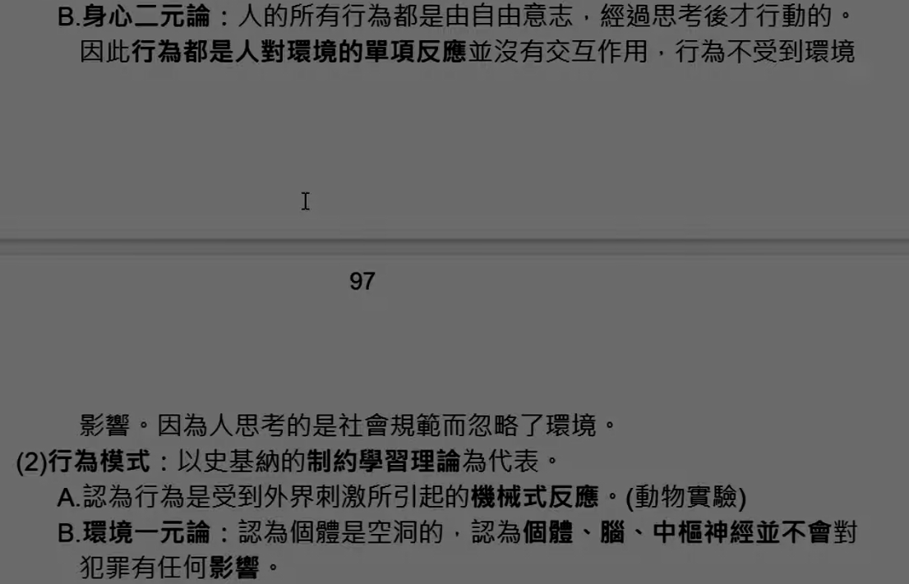
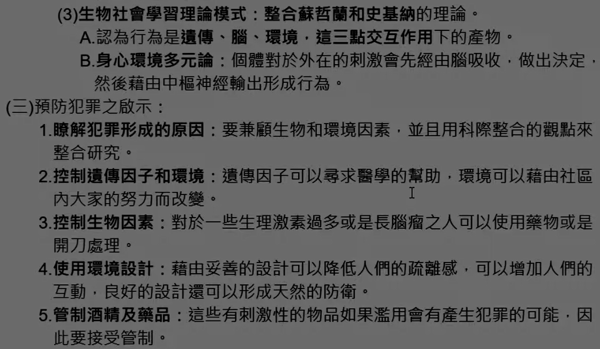

<!-- v70 -->
### 二、明恥整合理論：

#### （一）代表學者：

澳大利亞學者布列斯偉特在1979年提出了一種重整羞恥的理論，他的觀點是：在一些文化當中，會將犯罪當成是一種羞恥的事情，而犯罪感到羞恥的觀念，有助於減少犯罪的發生，因此為了預防和控制犯罪，應該在社會中復興與重整羞恥的觀念。

#### （二）理論內涵：

##### 1. 背景：

布列斯偉特觀察日本這個國家，發現在日本對犯罪人定罪會使犯罪人產生極大的羞恥感，因為犯罪人要承受社會上給予的非難與羞辱，因此在這種國家犯罪率很低。因為羞恥在這邊是一種強力的非正式社會控制工具。如果在犯罪並不感到羞恥的國家，犯罪人受到懲罰時會將自己看成是司法制度下的被害者，也不會覺得自己傷害到別人，覺得這些懲罰是被強加在自己身上的。

##### 2. 借用現存理論：

這學者是太閒嗎?竟然整合了5種理論，前面如果學沒熟的都倒了。他以控制理論說明初級偏差產生的原因，以標籤理論說明級偏差為何形成，以犯罪副文化理論說明了次級偏差行為的持續，最後以學習理論和機會理論來補充說明，屬於前後相加型的整合方式。

##### 3. 自我創新部分：

羞恥：羞恥分成兩種，效果也兩極化，真的是好的羞恥帶你上天堂，壞的羞恥帶你入監獄。 

###### (1) 烙印式羞恥：

這是一種不斷貶低行為人的過程，在這個過程中最主要的工作是烙印，將犯罪烙印上邪惡的標籤，並且希望將他們驅除或隔離。這個羞辱的過程可能是在學校或是在司法體系中發生，這些被烙印的人沒有團體會接納他們，於是只能加入偏差的副文化團體繼續實施犯罪行為。

###### (2) 整合式羞恥（明恥整合）：

這是一種如果你誠心誠意的道歉，我就大發慈悲的原諒你的概念。犯罪者認錯改正，社會接納他們，他們再重新復歸社會時會對於過往產生強烈的羞恥感，會因為這種羞恥感而不再犯。

A. 互賴：這是屬於微觀面個人因素方面的，我們在社會上生活會和周圍的人群產生連結感，也就是類似於社會鍵的概念，當我們的社會連結夠強，彼此互相依賴的程度夠高，則犯罪後就容易形成整合性羞恥而不再犯罪。

B. 共信：屬於巨觀以及社會因素方面的，指社會中各個組成份子間彼此互助信任是否有共同意識的程度，當社會變動快速互信程度就會降低，則犯罪者犯罪後就不容易形成整合性羞恥。

##### 4.結論：

明恥整合理論吸收了五種理論的優點，核心觀點：整合性羞恥有效降低犯罪，烙印式羞恥會導致犯罪不斷的發生。

#### （三）犯罪預防之啟示：

在犯罪預防方面多注重羞恥與避免標籤以及建立互賴、共信的方向著手。

1\. 提倡社會運動，使已犯罪或潛在犯罪人感到羞恥。  
2\. 發展社區警政系統使居民守望相助。  
3\. 凝聚社區意識，使社區建立起共信的信念。  
4\. 修復式正義的運用，以真心悔改和寬恕來建立起明恥整合。

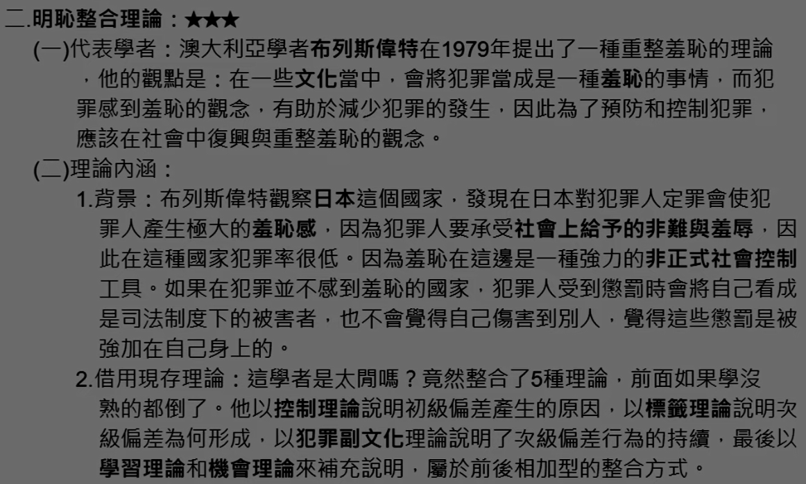
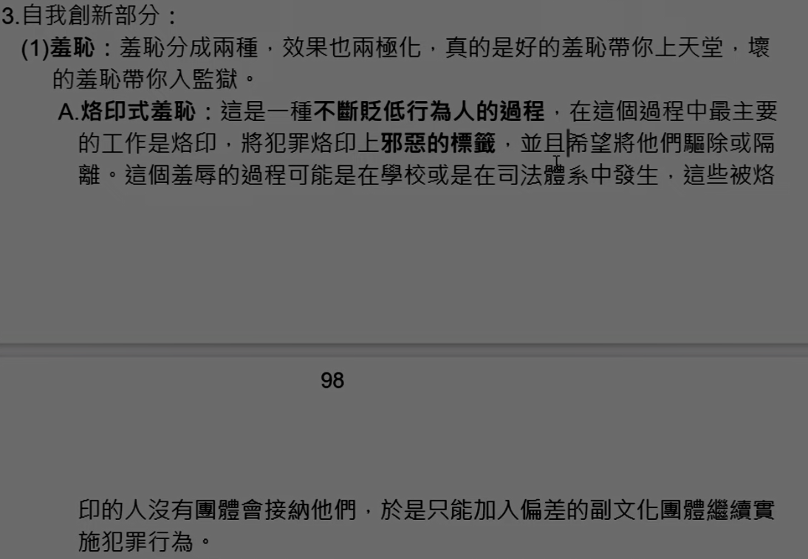
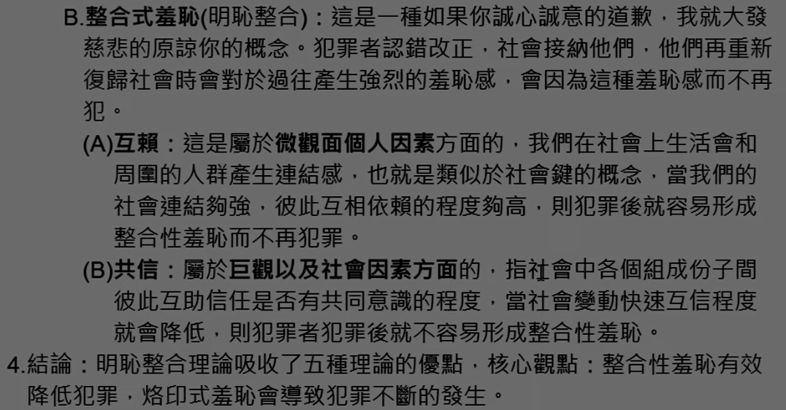
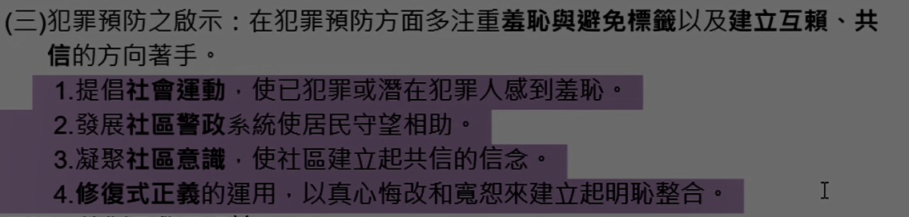

<!-- v71 -->
### 三、緊張、控制及學習理論：太

#### （一）代表學者：

艾利歐於1985年，將緊張理論、社會控制理論和社會學習理論加「以整合，提出一種新的整合理論。

#### （二）理論內涵：

1\. 運用緊張理論：少年在家庭以及學校中感覺到到緊張的情緒，認為自己無法使用傳統方式得到成功。  
2\. 運用控制理論：緊張引發出憤怒與挫折的情緒使得青少年與家庭和學校的情感鍵連結薄弱。而薄弱的情感鍵又會產生高度緊張，因此迫使少年加入不良組織或團體。  
3\. 運用學習理論：少年和這些不良組織或團體接觸後就開始學習不良的價值觀以及犯罪技巧，進而從事犯罪。  
4\. 屬於前後相加型的整合理論，各理論出場具有順序性，先因為緊張後開始削弱社會控制，最後學習犯罪技巧。

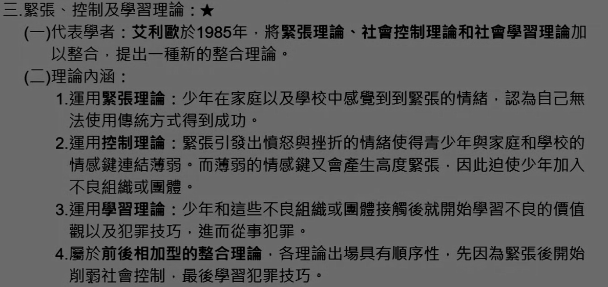

### 四、風險樹（危機樹）理論：古

#### （一）代表學者：

學者麥克懷特使用一種從細部的微觀結合起來成為巨觀的方式來研究青少年的犯罪情形，提出了風險樹的理論，以樹幹、土壤、樹枝、樹葉、花朵、果實等物對應危機少年、社區、家庭、學校等因素。屬於重點抽離型態的整合理論。

#### （二）理論內涵：

##### 1. 危機：

既然叫做危機樹要先來談談危機在此的意義為何?這邊的危機指的是會導致少年偏差行為的因素，通常不會只有單一種原因，這會是一種組合式的，而且互相有關連性有連鎖性的因果關係，而且稍不注意常常演變成嚴重的危機，而這些處於犯罪邊緣的少年，就被稱為危機少年。例如：家中經濟差+遇到壞朋友+學校沒在管=逃學之類的情形。要避免危機要靠許多人的努力，例如：教師、心理諮商人員、社工師、養育者、教育人士等等的在成長過程中給予支持與輔導。

##### 2. 危機樹的系統與結構：

###### （1）土壤：社會環境

A. 意義：少年在這個社會上的地位如何就如同樹需要土壤的營養一樣的重要。即社經地位、階層、經濟條件、文化背景、社會變遷、都市化程度、弱勢族群、貧窮等因素就是孕育少年的養分來源。若這些地位處於劣勢，就容易產生危機少年。

B. 理論：緊張理論：地位差，則達成目標，於是產生緊張。

###### （2）樹根：家庭與學校

A. 意義：學校和家庭都是早期中介我們和社會接觸的橋樑，也是讓我們學習道德、養成人格的場所。因此家庭功能不彰、學校教育出問題，就如同腐爛的樹根難以傳送養分給樹一樣，少年沒有好的教養就容易形成危機少年。  

B. 理論：社會鍵理論：若附著弱則容易形成危機少年。

###### （3）樹幹：先天個人特質

A. 意義：指個人先天的個人特質、行為與心理傾向，這些會決定個人抵抗外在負面因素的能力。如果學習能力差、低自我控制、人際關係差的少年，則犯罪風險會偏高，容易變成危機少年。

B. 理論：一般化犯罪理論：自我控制能力好壞影響少年。

###### （4）樹枝：適應社會能力

A. 意義：代表適應社會的情形，如果有良好的機會和好的人事物互動，學習正面的事物，也順利在社會上生存，就會朝正向發展。相反的如果和不良同齊混在一起，學習不良事物，傳承犯罪手段，就會成為危機少年。

B. 理論：差別接觸理論：犯罪是和親近之人學習而來。

###### （5）花朵、果實、樹葉：個別少年

A. 意義：這些都代表者個別的少年，如果土壤貧脊、樹根腐壞、樹幹不佳、樹枝生長不良，則這些花、果、葉就容易受傷成為犯罪者。這些情形會形成一種循環，危機的果實掉落土中，再孕育出先天不良、後天失調危機的下一代。

B. 理論：犯罪區位理論：重視文化傳遞，同一區塊代代相傳。

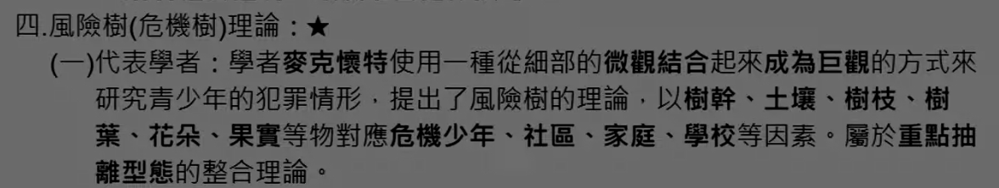
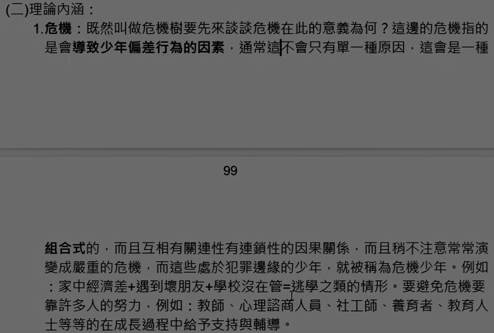
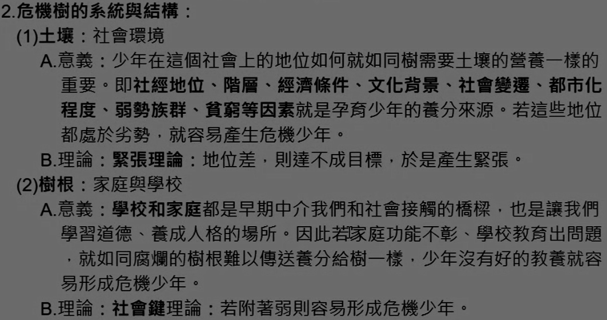
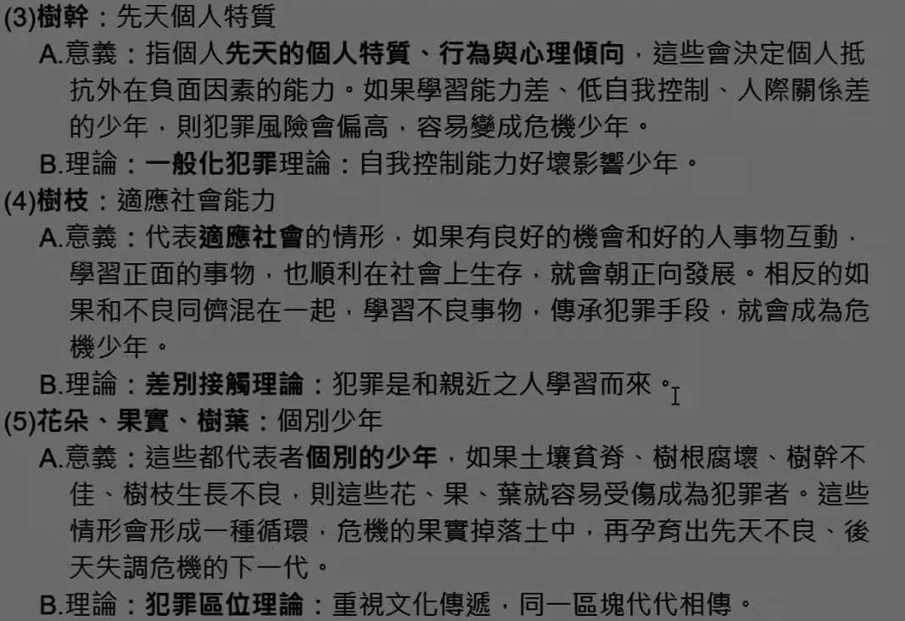

<!-- v72 -->
### 五、一般化犯罪暨非行理論（完形犯罪學）：（冷門）

#### （一）代表學者：

美國社會學者安格紙（就是那個一般化緊張的安格紐）於2005年提出，此理論強調犯罪行為的整體性，且在應用方面較為完整目全面，故為國內學者鄧煌發教授引進研究。

#### （二）理論內涵：

##### 1. 意義：

研究犯罪動機和犯罪抑制之間的關係，當擁有犯罪動機而犯罪抑制薄弱的時候就容易產生犯罪行為。安格紐認為的犯罪動機包含了引誘或拉力與壓力或推力。引誘或拉力與社會學習理論相關，而推力與壓力則與緊張理論相關。

##### 2. 影響犯罪動機與犯罪抑制的因素：

(1) 個人因素：具有情緒過敏與低自我控制之人格特質。  
(2) 家庭因素：具有教養不足與未婚或不良婚姻之家庭。  
(3) 學校因素：在學校遭到負面之經驗與教育程度低落。  
(4) 同濟因素：結交非行同齊，認識不良友伴。  
(5) 職業因素：失業與從事低劣之職業。

##### 3. 生涯領域：

安格紐將個體之生涯領域分為兒童時期、青少年時期、成年時期等階段。在這些生涯領域中，各自擁有影響犯罪之重要因素未必相同。就算相同，影響力也未必一致。

###### (1) 兒童時期及青少年時期：

兒童與青少年時期影響犯罪之重要因素均為個人、家庭、學校、同齊等因素，包含：情緒過敏、低自控、教養不足、負面之學校經驗、非行同齊等。其他重要性方面，成長至青少年時期之後，家庭生涯領域重要性逐漸被非行同齊所取代，教養不足對犯罪之影響減弱，但依然為重要因素之一。

###### (2) 成年時期：

進入成年時期後多出婚姻、職業等生涯領域。學校負面經驗被教育程度低落取代，家庭管教不足對成年犯罪影響仍屬重要;自我情緒過敏、低自控的人格特質及非行同齊因素，依然重要。成年時期未婚、婚姻不良與失業、從事低劣工作等因素，均對成年時期之犯罪形成極其顯著之影響。

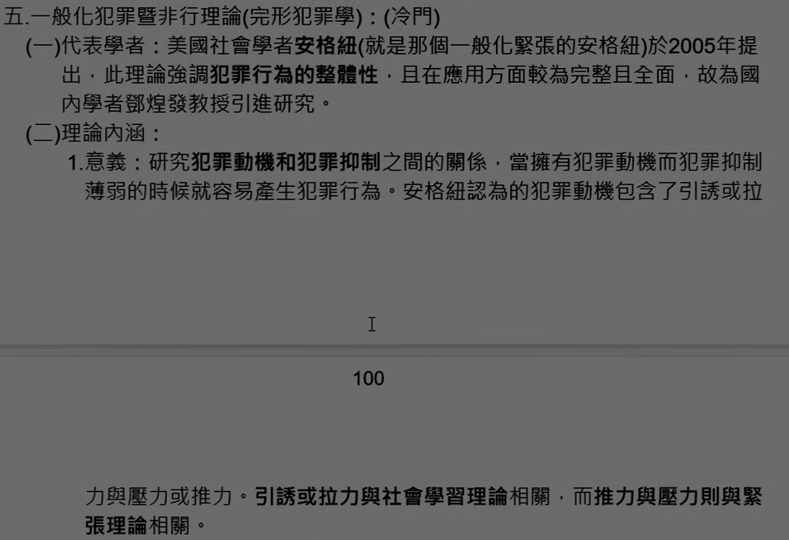
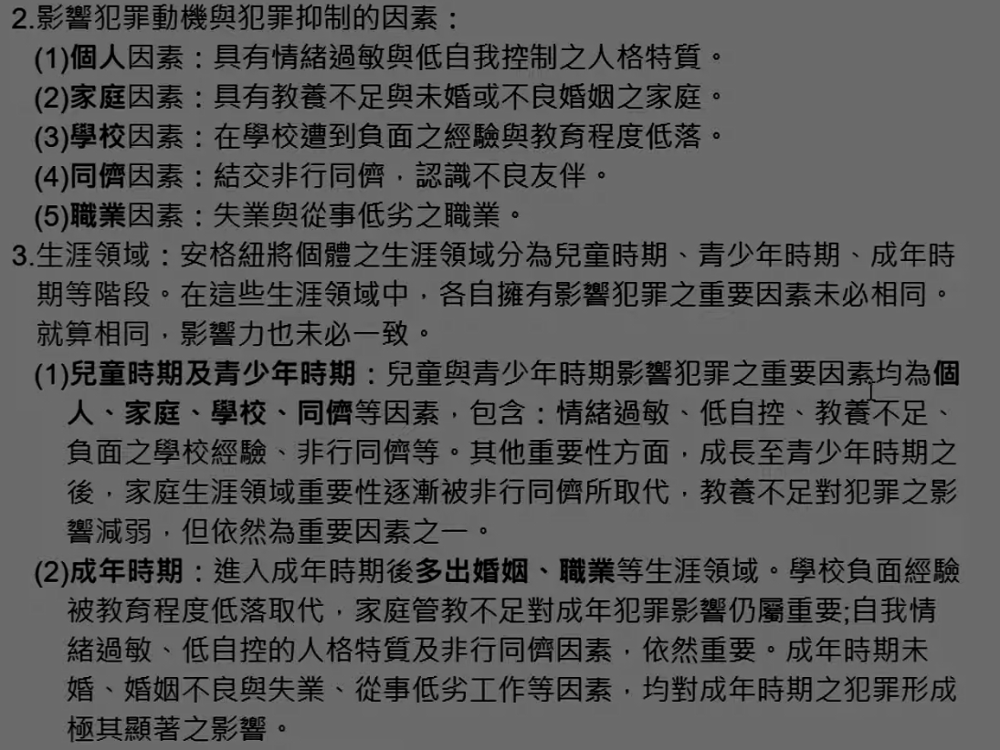

<!-- v73 -->
### 六、悌托的權力平衡理論：

#### （一）代表學者：

悌托（C.Title）主張個體不只是控制的目標也是控制的個體，每一「個人都有一定程度的控制在他之下，也有一定程度的控制供他行使。他整合了差別接觸理論、古典緊張理論、馬克思衝突理論、控制理論、標籤理論、阻理論以及日常活動理論，提出這個權力平衡理論。

#### （二）理論內涵：

1\. 意義;對大部分個體來說，相對的控制數量是存在且平衡的，但有一些個體遭受到「控制缺陷」或是「控制過多」的現象。控制平衡的人傾向於守法，控制失衡者傾向於和偏差行為有連結。」

2\. 控制比值：個人受到控制的程度相對於行使控制的程度，會決定其從事偏差行為的可能性及可能從事何種偏差行為的態樣。

3\. 偏差行為類型論：總計有七種行為類型並被編排在一個連續光譜中，光譜中間的行為型態為「守法」，是控制平衡的個體。往左邊的連續光譜為控制缺陷，命名為「壓抑，又分為三種，由左至右依序為「屈服、蔑視、掠套」。右邊的光譜稱為自主，代表個體有較多的控制權，由左至右依序為「剝削、侵吞、墮落」。

4\. 最嚴重的犯罪型態：最嚴重的犯罪型態可能發生在最少控制缺陷的「掠套」之中。因為較少的缺陷，讓個體可以清楚的判斷使用一個偏差行為來消除他所經歷過的控制失衡狀況。而控制缺陷過大的情況會容易屈服於這樣的權力失衡狀況或是觸犯一些輕微的偏差行為。

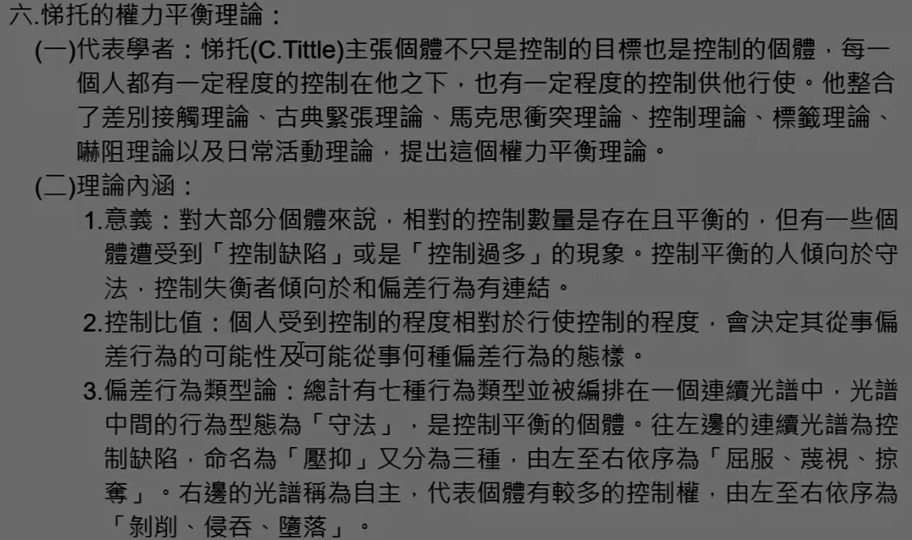
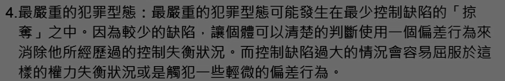

## 參、整合理論之困境與改進：

#### （一）困境：

1\. 各種理論之基本主張和假設其實並不相容：例如：緊張結構、控制過程、學習理論，原本的設計就是不相容的。  
2\. 整合後會降低理論的解釋能力：以多變項統計分析整合理論，發現有部分原本犯罪理論獨特的解釋力會消失。  
3\. 代表各理論的變項選擇不易：例如：差別接觸理論有九大命題、社會鍵理論有四個鍵、暴力副文化理論有七個要點，如何選擇是個難題。  
4\. 類推各種犯罪的能力受到限制：雖然是整合，但是骨子裡犯罪學者仍然是運用到自己研究的主題上，因此仍然是侷限在某一犯罪類型之解釋。

#### （二）改進：

1\. 概念上整合：既然從整個命題上來整合有所困難，那麼部分學者認為可以從概念來整合。有些理論的變項、名稱雖有不同，但是意涵可能是相似工的。  
2\. 現有理論的發展與敘述：學者表示不如專注於現有的理論、精心去敘述與研究發展，充分改善現有理論來取代整合理論。  
3\. 小型或中型層級的整合：各理論間有些命題和變項可以互相援用，因此可以選擇合適的作一些中小型層級的整合。例如：差別機會理論。

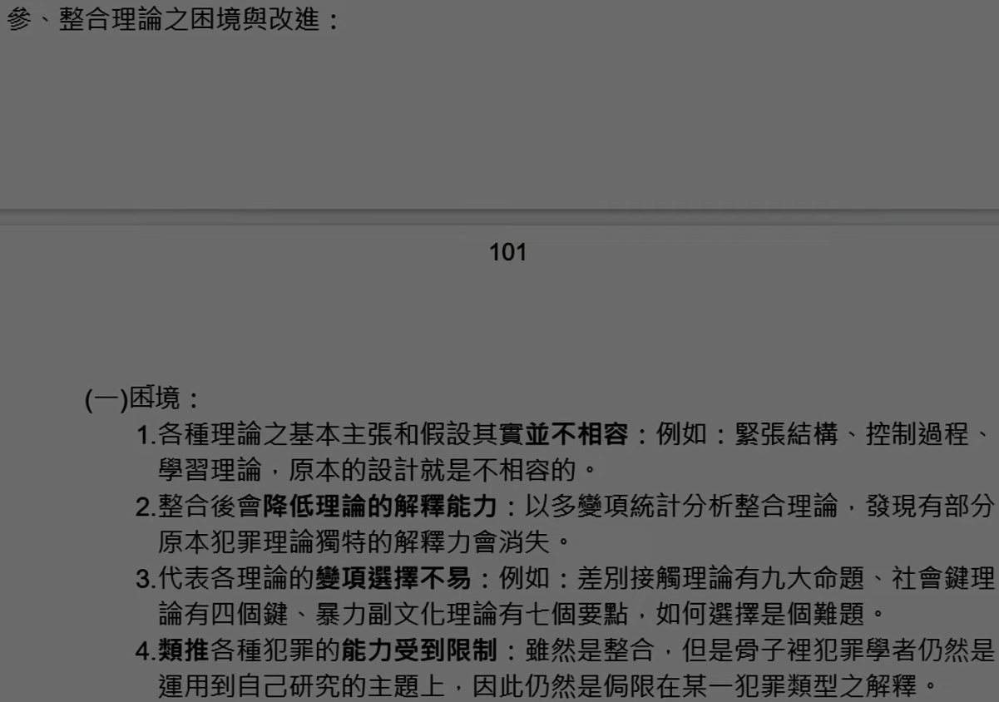
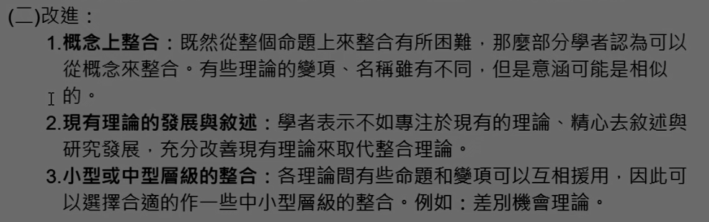
