# 主題十：被害者學與環境犯罪學

<!-- 74 - 84 -->
被害者學和環境犯罪學都是1970年代以後興起的，因為傳統犯罪學研究焦點都在犯罪人和犯罪原因上。所以學者開始注意到這些被忽略的外在因素，於是開始探討被害者本身可能是可以避開犯罪的，以及如何透過環境來預防犯罪，這兩個學問的關聯性較大因此常常放在同一主題討論。

<!-- v74 -->
## 壹、被害者學簡介：
### 一、被害者學的起源：

是一種被害者地位轉變的過程。

（一）刑罰執行者：古代原始社會發生糾紛時，會由部落中的長老或酋長主持公道，通常都是用以牙還牙以眼還眼的方式來解決，這時候受害者是執行刑罰的角色。

（二）犯罪起訴者：慢慢人民集合產生國家後有法律遵行，被害者不再是執行者在法國大革命前，案件也都經由法官來偵查、起訴、判決，此時被害者處於犯罪起訴者的訴訟地位。

（三）刑事程序的消失者：法國大革命後建立了檢察制度，司法制度也漸漸成型，認為犯罪不但侵害個人法益也侵害國家的利益，因此除了少數輕罪保留自訴權外，一律都由國家起訴犯罪者，此時被害者似乎隱形了一樣。

（四）被害者的再度重視：被害者長期不受刑事司法體系重視，直到1970年代以後，因為全國被害人組織興起、女權運動興起，等因素，促使學術界及司法界開始重視犯罪與被害者的關係以及被害者的救助與補償。

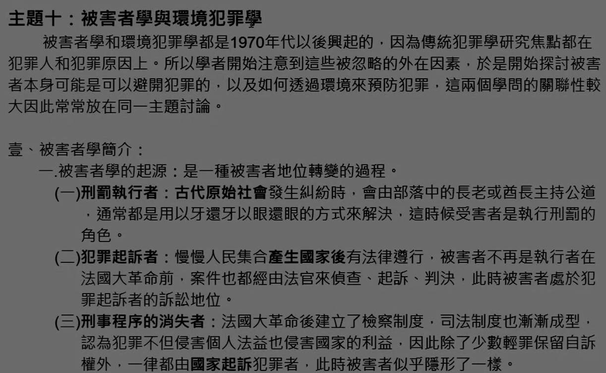

### 二、被害者學意義：

（一）被害者：狹義來說專指個人而言，廣義來說團體也可算是被害者。

（二）被害者學：學者孟德爾遜認為被害者學是以被害者為研究對象的門與犯罪學併立的科學。

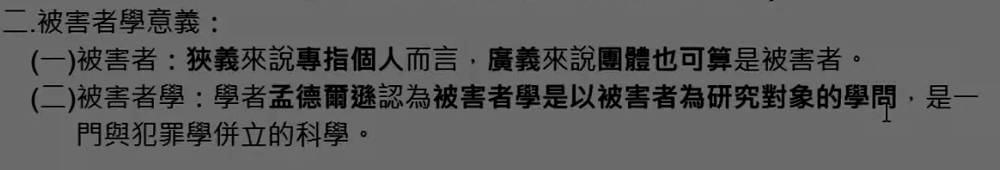

### 三、被害者學發展：

18世紀古典學派研究犯罪行為，19世紀實證學派研究犯罪人，直到20世紀中葉後被害者研究才漸漸受到重視。以下是一些被害者學的重要歷程：

（一）封亨替於1941研究指出被害人在犯罪歷程中有時候處於積極的角色而應對犯罪負責，例如：平時穿著暴露、平時故意招惹別人。

（二）孟德爾遜於1947年創立「被害者學」一詞，從犯罪被害者的行為、特性、角色來解釋為何被害，被尊為被害者學創始人。

（三）渥夫幹研究殺人犯罪，發現加害者和被害者有某些關係，使得加害者更傾向於加害此被害者，這表示殺人事件中雙方的互動是關鍵。

（四）1966年在蒙特婁舉行的第五屆國際犯罪學大會，首度將犯罪被害者納入了討論的議題中。

（五）薛弗提出了「功能責任」的觀點，分析犯罪被害者在犯罪行為中所扮演的角色，認為犯罪的起源是被害者的責任，被害者要積極的預防被害。

（六）1973年舉行了第一屆「國際被害者研究會」，自此之後被害者學成為獨立的學科。

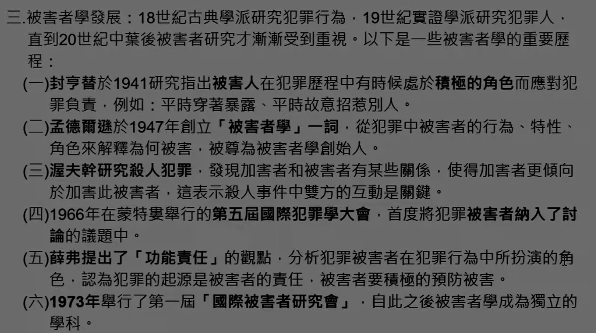

### 四、犯罪被害者的種類：

（一）完全無罪責：加害人需負100%責任，被害者最為單純。例如：嬰兒。

（二）罪責程度輕或疏忽被害者：加害者責任（75%）比被害者大（25%）的犯罪，例如：詐騙案被詐騙的人。

（三）罪責與加害人同等：責任各占50%，多是無被害者犯罪，例如：毒品者、賭博罪。

（四）罪責大於加害人：加害者責任25%，被害者75%，有兩種被害類型。 
1\. 誘發性被害者：自己的行為誘使加害者犯罪，例如：穿著暴露、炫富。  
2\. 忽略性被害者：缺乏謹慎注意而導致被害，例如：在交通事故中有重大過失（玩手機、闖紅燈）。

（五）要負完全責任：被害者需負100%的責任。 
1\. 加害性被害者：本身先動手攻擊對方卻遭受反擊變成被害者。  
2\. 虛偽性被害者：並沒有真實的受到傷害，但是卻有意無意的偽裝成被害者。（例如：釘子戶為求利益裝作被迫害）  
3\. 想像性被害者：因為精神狀況有問題，常常想像自己是被害者。這種人通常有精神病、被害妄想症。

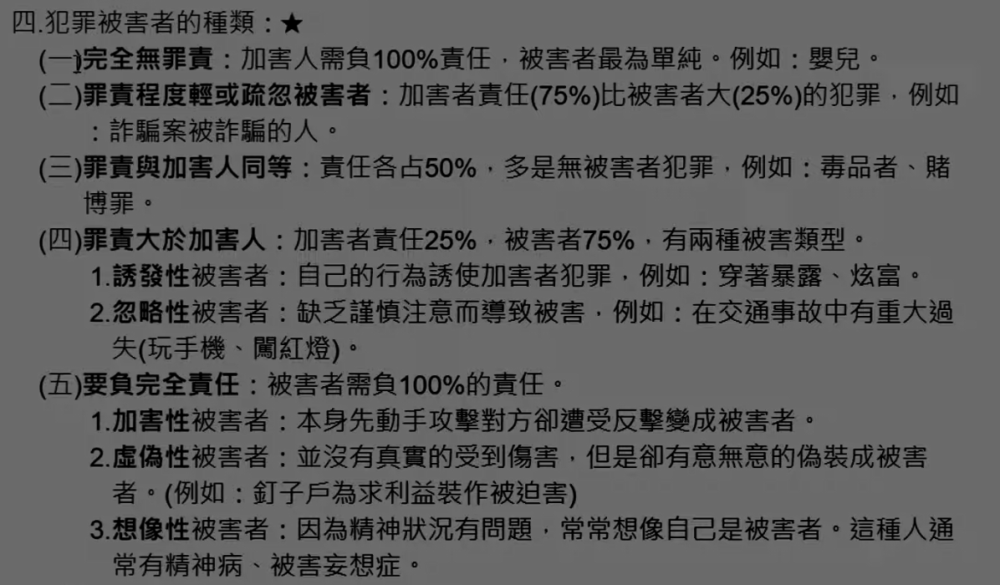

<!-- v75 -->
### 五、被害者學的貢獻與困境：

#### （一）貢獻（重要性）：

1\. 更能瞭解犯罪原因：只由犯罪者提供的資料來研究犯罪是不夠的，因為有犯罪是由被害者引起的。  
2\. 刑事追訴機關的參考來源：經由被害者調查可以得知被害者不願意訴諸法律之原因。  
3\. 刑事審判之參考：案件中被害者亦有責任，因此瞭解案件中責任之分配比例可以做為判決量刑輕重之參考。  
4\. 發掘犯罪黑數：可以彌補官方統計沒有發覺到的犯罪黑數。  
5\. 提供犯罪被害者協助：幫助犯罪被害者在法律體系內得到應有的權利和保護，並協助被害人重建和社會良好的互動關係。  
6\. 有助於被害者預防：經由研究瞭解被害者之生、心理及精神上的特性以及
被害原因，有助於被害預防。

#### （二）困境：

1\. 欠缺研究方法：畢竟是較新的學科，在研究上多借助社會科學之方法，自己的理論基礎尚未穩固，缺乏自己的理論架構，理論大多延續犯罪學的理  
2\. 淪為政治工具：演變成政治手段或社會工作者表演之舞台，使被害者學由學術研究轉向為政治工具，目的是為了激起社會大眾的激情以及強硬刑事政策的改革。  
3\. 缺乏理論與實務經驗：被害者學發展尚淺，且多借助犯罪學及社會學領域之理論，缺乏自身專門的理論也缺乏相關實務經驗。

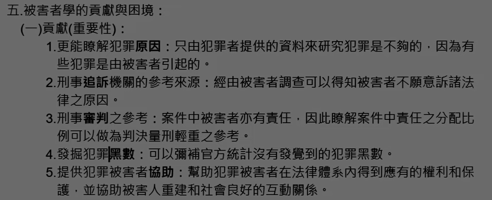
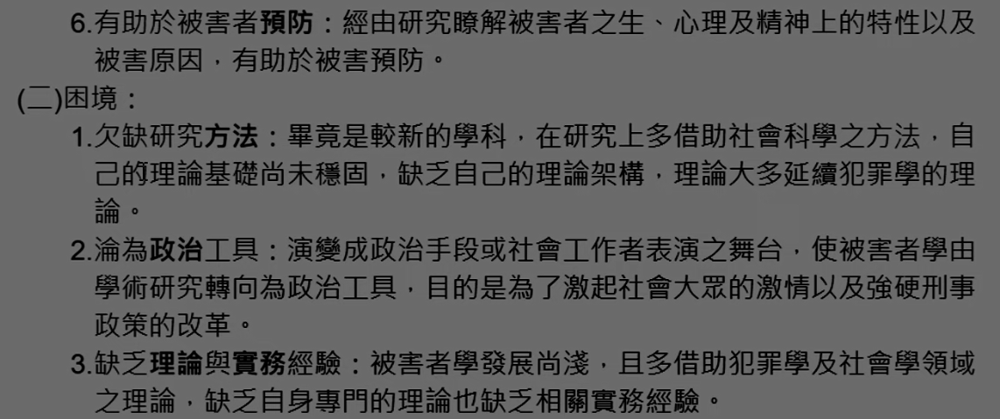

### 六、未來展望：

（一）培養更多專業人才：被害者學和犯罪學相輔相成，更有助於科際整合，應培養更多研究人才。

（二）深入瞭解犯罪原因：被害者學之研究有助於還原更多犯罪真相，讓犯罪探討更為客觀，也提供更多正確、公平之量刑和賠償資料，使刑罰運用的更好。

（三）研究領域的擴充：應將被害者學之領域擴及被害者之生活特性、人格特質、被處遇、社會對被害者態度、被害者在刑事司法中扮演的角色、潛在被害者與被害預防及控制、被害者賠償與補償、提出被害者預防對策，等領域，以達成獨立學科之目的。

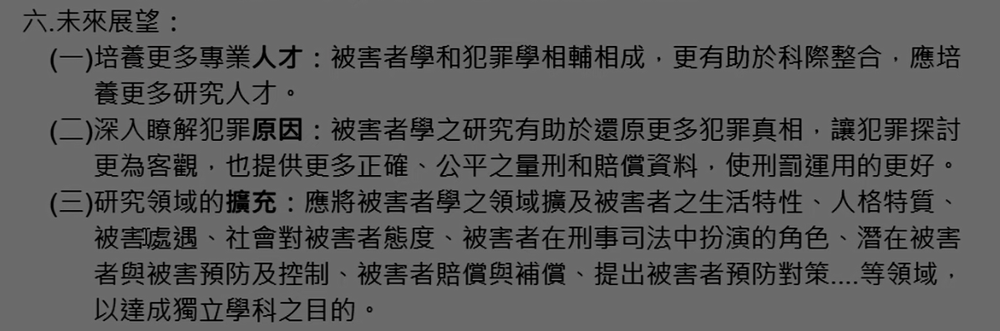

## 貳、被害者補償的意義與理論：

### 一、定義：

所謂被害者補償制度是犯罪被害者故（犯罪者貧困、訴訟過程過長、案件尚未偵破等）無法從犯罪加害者處得到賠償，因而生活陷入困頓時，國家基於社會公義之考量，由國家提供合理補償的一種制度。

### 二、被害者賠償制度的理論依據：

（一）國家責任論：預防犯罪是國家的責任，因此如果被害者遭受損害都是國家沒有盡到預防的責任，因此該負起補償責任。  

（二）政治利益論：政府改革制度使人民感受到政府對人民之保障，致力於贏得被害者對政府之支持和認同。  

（三）司法改革論：目前的司法制度給予犯罪者較多的保障，對於被害者較為忽略，為求公平應該重視司法制度的改革，以實現司法正義。  

（四）社會契約論：政府既然獨佔了防衛的武力（軍、警），那麼人們遭受到危害即是政府之責任，政府應該承擔被害者之補償。  

（五）社會福利論：政府有改善人民生活的義務，因此因為犯罪而受到傷害的人民，政府應予補償、幫助。  

（六）社會防衛論：此說是為了提高犯罪破案率而提出的，保護被害者就是要讓被害者和司法機關合作，被害者得到賠償自然會充分配合，因此使司法機關更能有效打擊犯罪。  

（七）命運說：任何社會都有犯罪存在，被害者只是運氣比較差才遇到，因為他代替了你遇到犯罪，故應該由社會全體成員共同負擔，又稱為保險說、危險分散說。

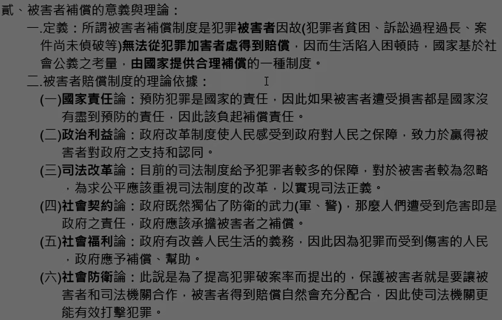
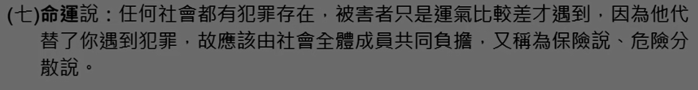

### 三、我國犯罪被害補償制度簡介：

（一）興起背景：我國被害者補償制度發展甚晚，於1995年提出，1998年「犯罪被害人保護法」三讀通過，於同年10月1日實施。

（二）適用要件： 
1\. 申請人：受到犯罪行為 (1) 死亡者之家屬， (2) 重傷者， (3) 遭受性侵者。  
2\. 期限： (1) 知有犯罪被害時起2年內， (2) 自被害發生時起5年內。  
3\. 申請機關：書面向犯罪地之「犯罪被害人補償審議委員會」申請之，如有不服可向「犯罪被害人補償覆審委員會」提出申請。  
4.其他救濟方式：如不服覆審委員會之決定或未於規定期間內為決定者，得於收受決定書或間屆滿後30日內提起「行政訴訟」。

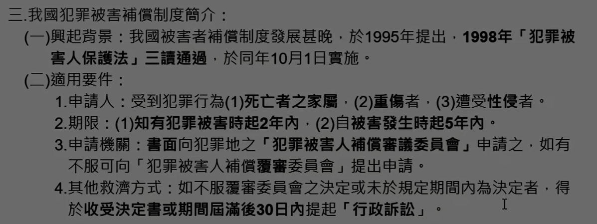

<!-- v76 -->
## 參、被害者學理論：

被害者學的相關理論大多從兩個面向出發，一個是「被害者提供機會」（EX.誰叫妳看起來麼騷，身上带很多錢。），一個是「被害者與犯罪者的互動」（EX談判、吵架森77）

* 被害者學體系
  * 提供機會
    * 犯罪機會理論
      * 生活方式暴
      * 日常活動理論
      * 被害事件和機會
        * 犯罪熱點
        * 被害結構選擇理論
        * 理性選擇理論
  * 雙方互動
    * 被害者與犯罪者互動理論
      * 被害者促發理論
      * 情境互動理論
      * 對等團體假設
      * 偏差鄰坊假設

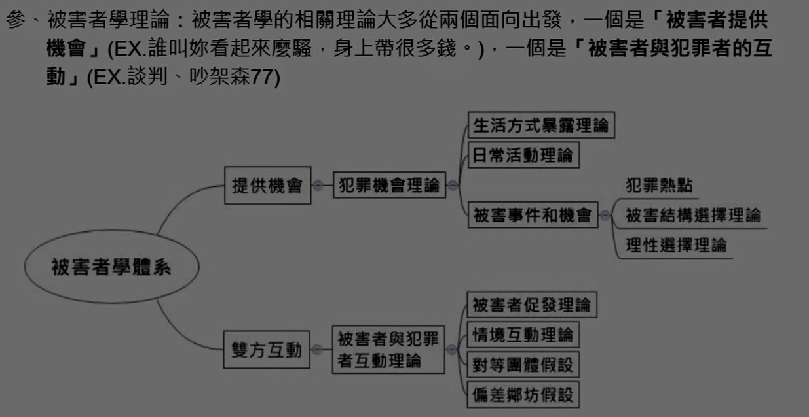

### 一、基本概念：

#### （一）以機會為核心概念之理論：

##### 1. 意義：

探討犯罪者的犯罪意圖通常是著眼於是否有犯罪機會上。這觀點認為一切犯罪都是因為被害者提供了犯罪者犯罪的機會，這是引發犯罪的可或缺的條件。此一觀點關注被害者和環境的因素，不同於傳統學者對犯罪之研究方式，因此也給予犯罪現象更完整的解釋。

##### 2. 在犯罪預防上的意義：

(1) 認為犯罪者和被害者在時空的分布並非隨機分布的，因此有某種特質的人會在某些時間地點產生較高的被害可能。也就是說生活型態的不同會影響犯罪被害的可能性，例如：常與犯罪者交往，被害可能性會增加。常常工作到半夜走入暗巷容易被害。

(2) 發現越不以家庭為中心的生活型態被害機率高，因此保持正常生活、以家庭為中心可以避免被害。

(3) 關心日常生活中的環境，若有良好的監督者，能有效預防犯罪。

#### （二）以被害者和犯罪者互動為核心的理論：

##### 1.意義：

傳統犯罪學認為犯罪是犯罪人自己的意圖對外產生了犯罪行為。以被害者互動的觀點來說，認為被害者在犯罪中並非只是被動的參與者，主要是他的行為和加害者之間存在著一定的互動模式，而導致犯罪的發生。

##### 2.被害者和加害者之關係：

(1) 親屬關係：較常發生家暴、性侵、兒虐等犯罪。  
(2) 熟識關係：地點常在私人場所或隱密處，較常發生強制性交、殺人或傷害等犯罪。  
(3) 陌生關係：地點常在公眾場所，較常發生竊盜、搶奪、強盜或傷害為主的犯罪。

##### 3.被害者與加害者之互動模式：

###### (1) 可利用的被害人模式：

指被害人無意間誘發犯罪之行為，加害人見獵心喜覺得有機可乘予以加害。如：錢財露白、穿著暴露、身體孱弱。

###### (2) 衝突模式：

指被害者與加害者長期的互動不良已積怨已久，當處於衝突的臨界點時任何一件事都有可能成為衝突爆發的催化劑。在此一模式中雙方角色都有可能改變，常常難以判斷事件中誰負的責任較重。

###### (3) 被害人催化模式：

指行為一開始是由被害者挑起的，使犯罪者遭到刺激而反應過當，導致犯罪的發生。例如：被害者主動先用武器攻擊對方，卻遭受反制被打死。

###### (4) 斯德哥爾摩症候群：

是一種被害開始時處於敵對、衝突的狀態，但因為身心遭受重大刺激，最後轉變和犯罪人同一陣線的情況。起源於1973年瑞典斯德哥爾摩的一家銀行發生了搶案，2名歹徒綁架了4名行員，挾持了131小時之久。在這段期間中行員對歹徒逐漸認同、並產生崇拜的心理。事後甚至一名女行員還和歹徒定婚。此轉變的歷程為：恐懼、害怕、同情、幫助

##### 4. 在犯罪預防上的意義：

減少讓自己成為主動誘發犯罪的角色，在與他人互動的過程中，要能減少會引起衝突的舉動，便能有效防止自己的被害。

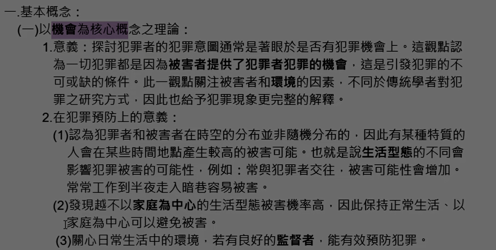
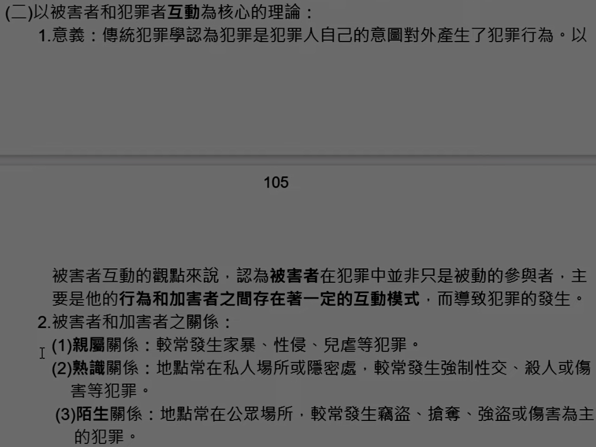
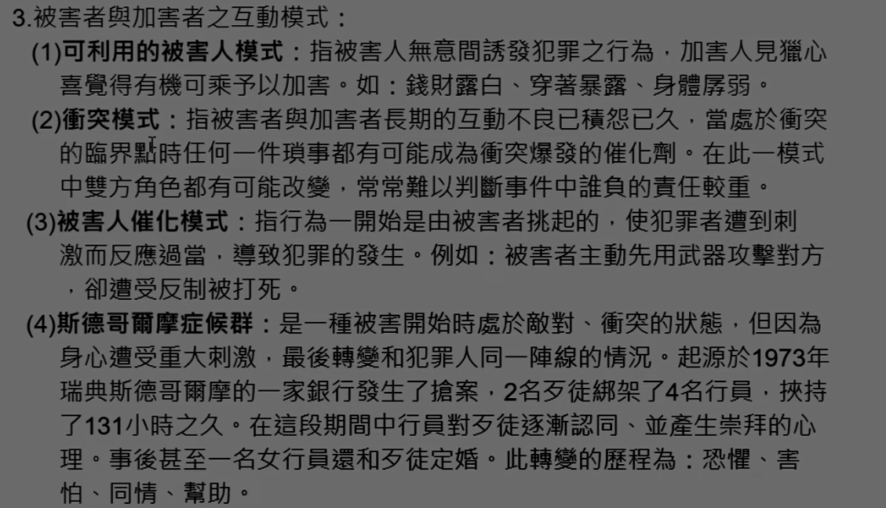
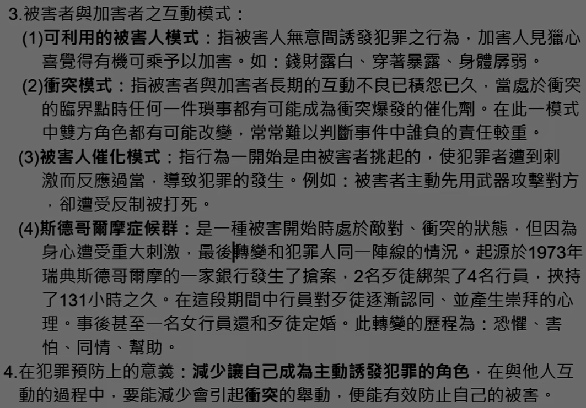

<!-- v77 -->
### 二、被害者促發理論：

#### （一）代表學者：

渥夫幹研究費城588件殺人案件，發現有150件是屬於被害者催化模式，也就是被害者積極促發所導致被害的。因此渥夫幹於1958年提出了「被害者促發理論」，認為殺人事件中被害者常常是直接、積極引發殺人犯罪行為之人。也就是說被害者往往是先攻擊犯罪人的。

#### （二）理論內涵：

1\. 先使用暴力：被害者在犯罪行為中率先發難使用暴力或武器攻擊對方。  
2\. 促發方式： 
(1) 積極促發：被害者有意識的先使用口語攻擊甚至是行為攻擊對方。  
(2) 消極促發：被害者未主動攻擊，但可能是本身的特性使然，在不知情的情況下威脅或鼓動了犯罪者。

#### （三）理論優缺點：

1\. 優點：使社會大眾注意本身行為舉止，謹言慎行為自己的行為負責。  
2\. 缺點：常常會被擴張解釋，都是THEY的錯。例如：強制性交是因為對方太辣。如此會對犯罪被害人造成很大的壓力並引起爭議。

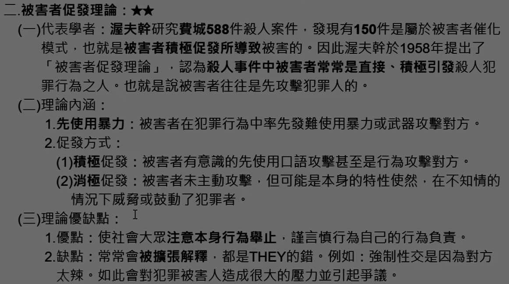

### 三、情境處理論：（情境互動論）

#### （一）代表學者：

洛肯比爾和高夫曼於1977年提出，主張犯罪事件並非被害者或加害者單方面因素所導致，因為雙方在犯罪中各自扮演不同的角色而促使犯罪發生，因此必須觀察兩者與其它因素的互動才能瞭解犯罪的全貌。

#### （二）理論內涵：

1\. 被害者與犯罪者各自扮演引發犯罪的不同角色。

2\. 互動六階段：以殺人案件為例。
(1) 第一階段：被害者的一舉一動導致加害者感覺到威脅，並使其感覺到像是叫他「滾開」。
(2) 第二階段：這些被害者的一舉一動將被解讀成侮辱和挑響。」
(3) 第三階段：犯罪者將以具體行動來挽回他的面子，這些行動包含言語上的以及身體上的報復。
(4) 第四階段：被害人使用了更具攻擊性的方式回擊，這表示告訴他人暴力是個良好的解決方式。如果有旁觀者，常常會鼓課或是起來助長暴力行為的產生。
(5) 第五階段：雙方開始使用暴力互相傷害。
(6) 第六階段：最後犯罪者會因為旁觀者的介入而停止或逃跑。洛肯比爾認為這過程和所謂的密謀殺人不同，這才是日常生活互動中常發生的兇殺暴力案件的型態，常常是因為一些小事所引起的。

3\. 事件的結果是否以暴力收場，是由雙方當事人的互動反應所決定的。

4\. 劇場行為特徵：高夫曼另外指出人類的行為往往是在回應他人的行動。而個體會根據過去的經驗、社會化歷程和他人的互動行為方式形成所謂的「劇本」。這些劇本可以提供我們研究犯罪的軌跡，因為劇本決定了在怎樣的情境下會採取怎樣的行動。

#### （三）理論啟示：

許多被害者並非單純的被害，可能是自身行為引起的。在殺人或暴力案件中我們可以清楚的看出被害人、犯罪人、旁觀者之間的關係，在未完全清楚彼此之間的作用前，所有對於犯罪的理解都有可能是錯誤的。現實中其實只有少數人際衝突會產生嚴重的暴力或殺人事件，多數人會選擇迴避。此外文化也會影響一個人對於衝突行為的反應。

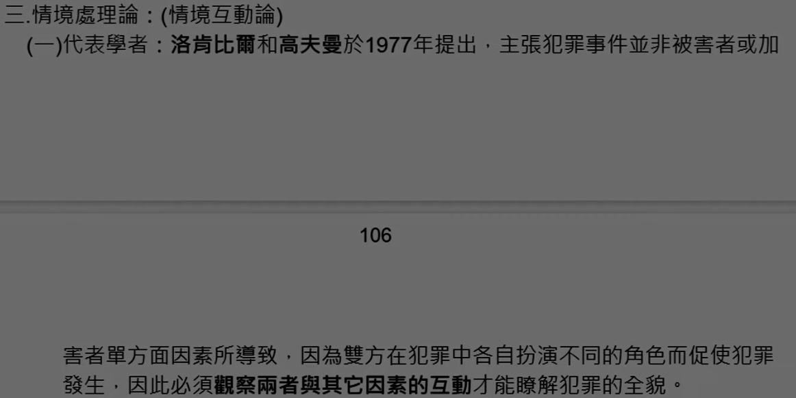
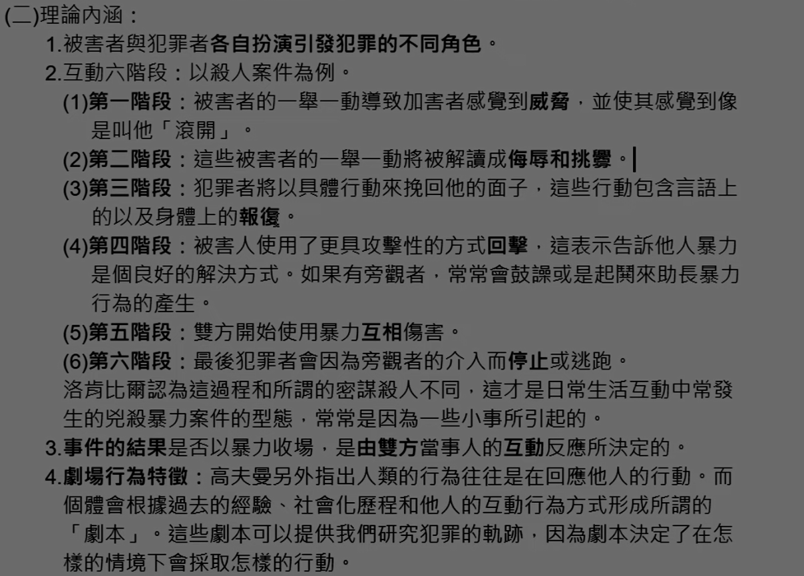
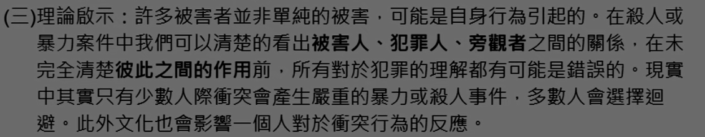

<!-- v78 -->
### 四、生活方式暴露理論：

#### （一）代表學者：

由美國犯罪學辛德朗、蓋佛森、加洛法羅於1978年提出。

#### （二）理論內涵：

個體之所以被害是因為本身具有某些特性導致容易被害，而這些特性主要是個體的生活型態所致。所謂生活型態指個人日常生活活動，包括職業與娛樂休閒活動，而某些特殊的生活方式與個人被害間有密切關係。

##### 1.生活方式的形成與被害：

人們在社會中生活受到角色期待的限制和社會結構的約束，在磨合角色期待和社會約束的過程中，會慢慢發展出一套適應的行為模式，這就是所謂的生活方式。例如：讀書、當兵、工作、結婚。而這些生活方式代表著個人會在某個時間、地點與某種特殊人格之人接觸。若常與高犯罪風險者接觸，則暴露在犯罪之情境也會變多，就有可能被害。

##### 2.個人被害條件：

(1) 加害者對被害者須有所企圖，且有能力達成所求。（壞人）  
(2) 有加害者和被害者存在，且彼此在生活步調及時空相接近。（雙方）  
(3) 情境有利於犯罪。（情境）

##### 3.生活方式與犯罪被害間的關係：

(1) 被害可能與暴露在公共場所的時間多寡成正比。  
(2) 個人置身公共場所的時間，隨其生活方式不同而有差異。  
(3) 生活較類似者，接觸機會較多。  
(4) 個人被害可能性與犯罪者有相近之生活方式有關。  
(5) 個人被害可能性，視其與非家人成員接觸時間多少有關。  
(6) 個人與家人以外成員接觸的多寡，和其生活方式有關。  
(7) 越常與有犯罪特性之人接觸，被害可能性就越大。  
(8) 生活方式的差異會影響個人成為被害者之方便性、誘發性及易侵性。

#### （三）理論啟示：

犯罪被害並非隨機分布，主要和生活方式以及接觸的人有關。對於非行少年，其不正常的娛樂方式，例如：飲酒、飆車、聚眾等，都會增加其被害風險。

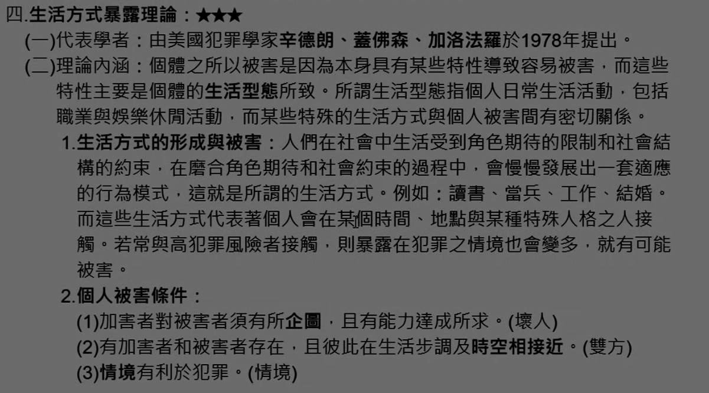
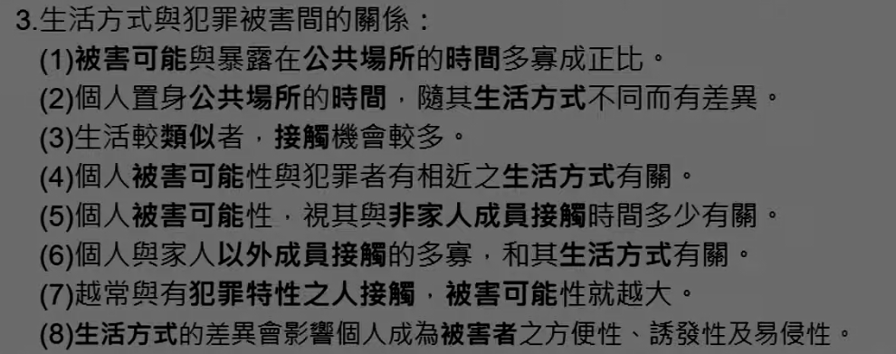

### 五、個人重複被害特徵及重複被害因素：

#### （一）重複被害特徵：

被害者通常有下列特徵導致容易重複被害，

1\. 標的弱點因素：簡單的說就好欺負。  
2\. 標的滿足因素：被害者有某些特質是加害者所需要的，例如：粉有錢。  
3\. 標的憎惡因素：被害者容易激起加害者之憤怒、忌、衝動而受害。

#### （二）重複性被害因素（被害傾向）：

史帕克斯歸納出八點容易重複被害之因素：

1\. 弱點因素：被害人之身心、社會地位較弱勢。  
2\. 機會因素：被害人身上具有利於犯罪發生之情境。  
3\. 吸引因素：被害人本身擁有導致犯罪之目標。  
4\. 免罰因素：被害人不願報案。  
5\. 促進因素：被害者因本身的態度上的缺失或疏忽導致陷入被害。  
6\. 加害因素：被害者主動對另一方犯罪。  
7\. 激惹因素：被害人首先攻擊引起反擊。  
8\. 同意因素：被害者經由雙方同意而成為共犯，多為無被害者犯罪。

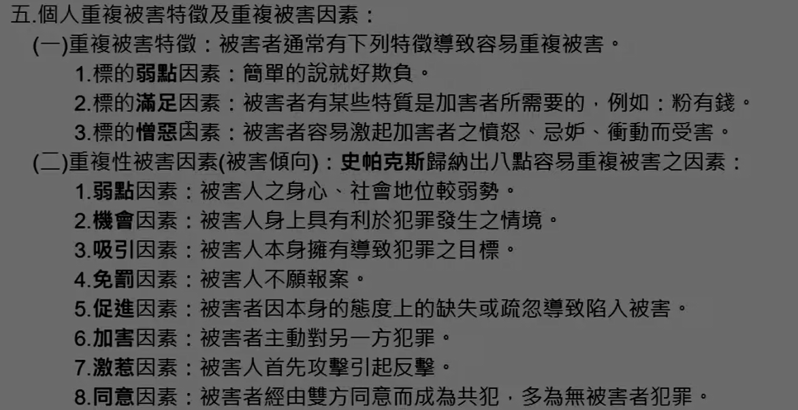

<!-- v79 -->
### 六、日常活動理論：太太太太

#### （一）代表學者：

柯恩及費爾遜於1979年提出日常活動理論，內容是將生活方式暴露理論具體化以及繼續發展理性選擇理論的概念。其基本觀點認為，犯罪的發生和日常生活中的某些因素相關。這些因素在犯罪人和犯罪動機都是常數，因為社會上犯罪不滅，總有些人會犯罪，因此主要是「日常活動」和「生活型態」影響了犯罪發生之機會，進而導致犯罪。

#### （二）理論內涵：

##### 1. 犯罪與機會：

日常活動理論的研究著重在「直接掠奪型犯罪」（EX.強盜、搶奪、傷害、殺人），這種類型的犯罪在時空上較容易觀察，也容易和日常生活的的各種活動相結合。而所謂的日常生活則和一個人的生活型態有關，包含食衣住行育樂及工作，其中重點是越不以家庭為生活中心者，其家庭與個人被害可能性較高。核心概念為「犯罪機會影響犯罪與被害的可能性」。

##### 2. 犯罪的三種要素：

(1) 合適標的物：所謂合適標地物要考慮4個要點，即VIVA。 
A. 價值（value）  
B. 可移動性（inetia）  
C. 可見性（visiblity）  
D. 可接近性（access）

(2) 有力的監控者不在場：這邊指的是所有可以抑制犯罪發生的控制力，也
就是指要現場沒有足以抑制的人存在即容易發生犯罪。（無人看管）

(3) 有能力及犯罪傾向的犯罪者（潜在犯罪者）：有能力犯罪未必會犯罪，但是有能力加上有犯罪倾向，犯罪可能性就提高很多了。

#### （三）理論啟示：

犯罪被害受時間和空間影響，而每個人時間和空間的分配則和生活方式有關。生活方式的不同提供犯罪的機會也不同，因此在犯罪預防上具有機會和環境導向的「情境犯罪預防策略」是合適的預防策略。

#### （四）與理性選擇理論的關係：

1\. 基礎命題相同：都強調犯罪是理性選擇的結果。  
2\. 相互補充：日常活動理論是以巨觀角度分析犯罪，而理性選擇是以微觀角度分析犯罪，彼此互補。  
3\. 互動關係：日常活動的三要素，標的物、監控者、有動機者，皆牽一髮動全身，如有改變也會影響理性選擇之結果。

#### （五）與生活方式暴露理論重合之處：

下述人選犯罪與被害之可能性偏高。

1\. 高犯罪區域居住者。  
2\. 夜歸者。  
3\. 身上常有貴重物品者。  
4\. 少與親友往來者。

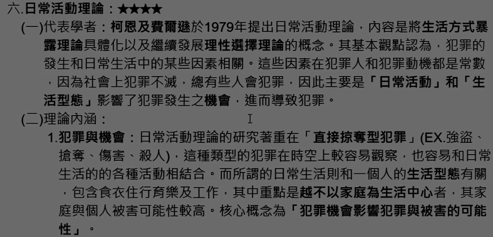
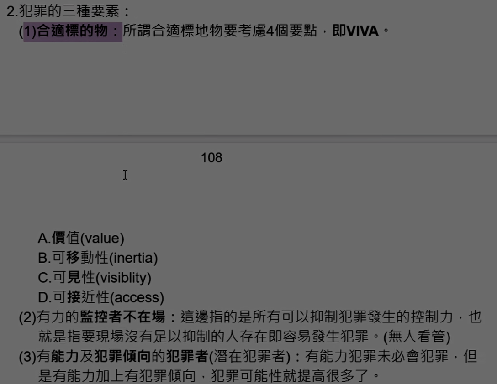
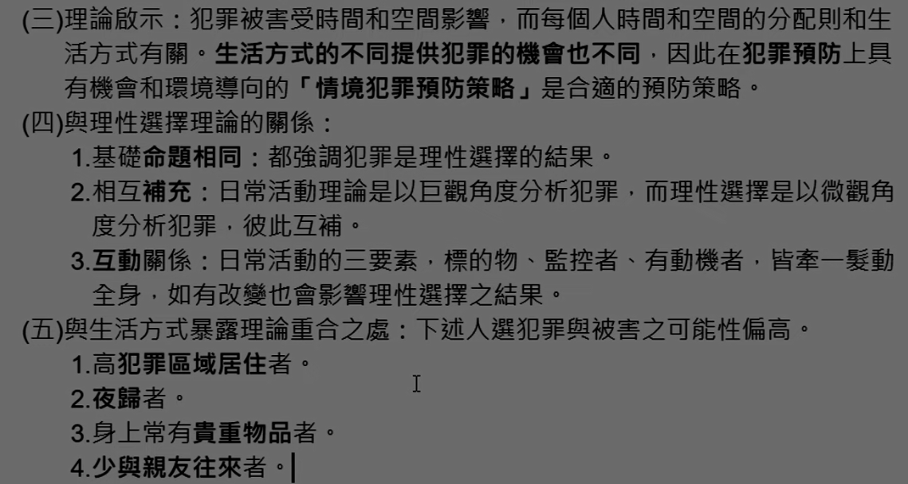

<!-- v80 -->
### 七、對等團體假設：（同團體）

#### （一）代表學者：

由新格·桑普森、勞伯共同提出，對等團體假設是他們從生活方式暴露理論與日常活動理論中發現被害者與犯罪者常有相似的特性發展而來。

#### （二）理論內涵：

1\. 對等團體：主張犯罪者與被害者常屬於同一團體，具有類似的人格和偏差生活型態，也容易從事類似的犯罪或偏差行為，因此稱為「對等團體」。  
2\. 加害者與被害者相似：從生活方式暴露理論與日常活動理論中發現被害者與犯罪者常有相似的特性，彼此都有高度的被害風險。被害者其實本身可能也具有犯罪或偏差行為並非完全正常。例如：常被欺負終於受不了反擊然後再被打趴。

#### （三）理論啟示：

1\. 有些被害者因為長期被欺負而形成反社會人格，之後進行報復行動變成加害者。  
2\. 並非所有被害者都會犯罪，也不是所有犯罪者都曾被害。
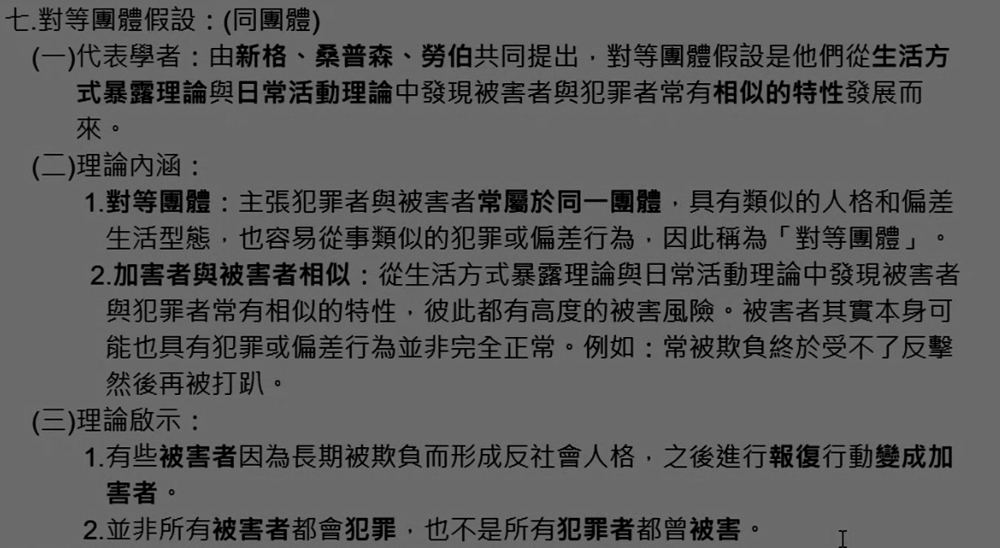

### 八、偏差鄰坊假設（被害結構選擇理論）：（壞鄰居）

（一）代表學者：麥斯和麥爾不贊同「對等團體假設」於1990年整合生活方式暴露理論與日常活動理論提出「偏差鄰坊假設」，主張被害與其居住的地區有關犯罪者和被害者不是同一團體只是住在高犯罪區域且住的比較近。（旁邊住著壞鄰居）

（二）理論內涵：主張被害與如何生活無關與住哪裡比較有關，會被害只是因為在錯誤的時間出現在錯誤的地點所致。簡單的說就是個人高風險特質（年輕、未「婚、失業）加上居住在高犯罪率的「偏差行為地區」就容易被害。

（三）理論啟示：既然被害和居住在哪有關，就要多注意週圍環境是否適合居住，也不要在不適當的時間出現在人煙稀少的地方。（孟母三遷）

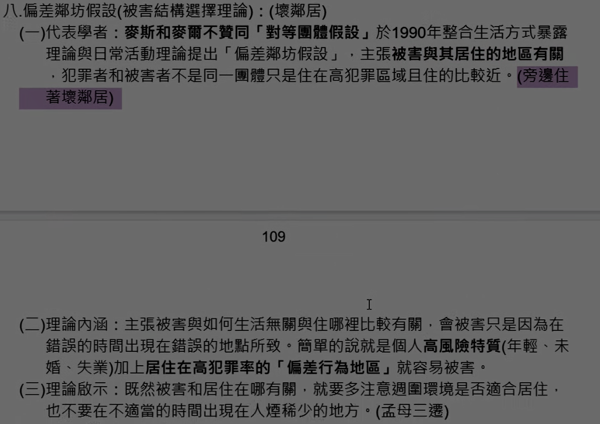

### 九、暴力循環理論：（打老婆的迴圈）

#### （一）主旨：

暴力循環理論主要說明循環暴力行為發生之潛在因素，通常被使用於說明婚姻及家庭暴力行為發生之原因，以及被害人「習得無助感」或「無助學習」而導致暴力行為循環的產生。這樣會讓被害人持續的被害，而加害人則持續的施暴。

#### （二）暴力行為發生三階段

1\. 第一階段（引發階段）：加害者因為承受各方壓力，以及與被害者間累積各式潛伏之爭吵因子，造成加害人無法適時地排除負面情緒，這些長期累積下來會使其情緒常處於不穩定當中。  
2\. 第二階段（發生階段）：加害人為降低壓力及掌握情境而對被害人施以暴力行為，來舒解身心的壓力，若有使用藥物或是酒類，情況將更嚴重。  
3\. 第三階段（蜜月階段）：加害者的情緒和壓力獲得舒減，而對之前暴力感到「後悔，而尋求被害人的原諒，而且通常都會得到原諒。

#### （三）暴力行為循環三階段：

1\. 第一階段循環（再度引發）：加害者的各種壓力迅速累積，但因為慣性作用其承受力卻顯著下降。情緒的累積時間比前次短。
2\. 第二階段循環（再度發生）：加害人食髓知味使用暴力不再有所顧忌，暴行也越趨嚴重。
3\. 第三階段循環（蜜月縮短）：加害人後悔程度降低，懺悔時間變短，並且慢慢不再承諾不施暴。

#### （四）循環階段（不斷重複）：

加害人發覺使用暴力可以迅速排除壓力，其施暴頻率便增加，暴行越來越嚴重，且毫無悔意，最後有可能產生殺人行為。

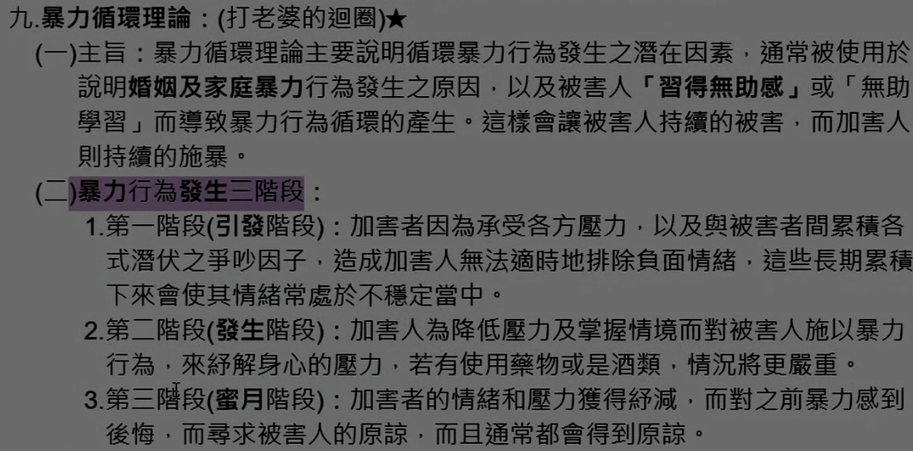
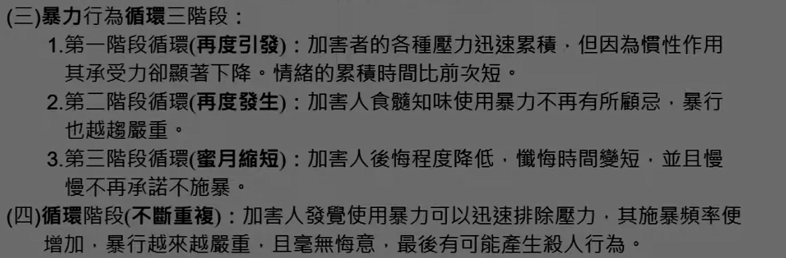

<!-- v81 -->
### 十、無助學習論（習得無助感）：

#### （一）起源：

賓州大學西里曼教授於1975年以狗做的實驗中發現這種現象。將狗分為幾個組別，再分別使用電擊，有些狗的組別可以使用停止電擊的手段，有些狗的組別則不管狗怎麼做都不會停止電擊。實驗後那些可以停止電擊的狗兒恢復情況良好，但是無法停止電擊的狗兒產生了一些消極的憂鬱症狀。之後又將這些狗兒一起放到其他情境去做實驗，那些原本可以停止電擊的狗兒都會逃走，可是原本無法停止電擊的狗兒就算是看到旁邊的同伴使用停止装置逃走，也不會有任何動作了。

#### （二）理論內涵：

1\. 逆來順受不會反抗：當一開始的受害反抗無效或沒有尋求解決管道之後，慢慢的會養成一種即使做出任何反應也沒有效的心態，因此會慢慢養成逆來順受的心態。  
2\. 可以用來解釋家暴循環：在家暴的案件中，受害者常常因為家庭或經濟因素選擇隱忍，久而久之就慢慢的學習到忍耐和無奈感而不會反抗，因此暴力會一直循環的發生。

#### （三）啟示：

說明了為何同樣是面臨自己無法控制的情況時，有人會選擇抵抗找出路，有人則選擇消極承受。個人遭受挫敗時會找尋「內罰」或「外罰」的解釋。內罰解釋是把挫敗歸咎於自己的無能，外罰則是歸咎於自身之外的因素。選擇內罰解釋者其遭受被害的可能性較為嚴重。

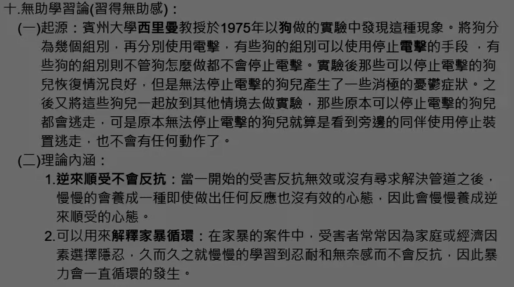
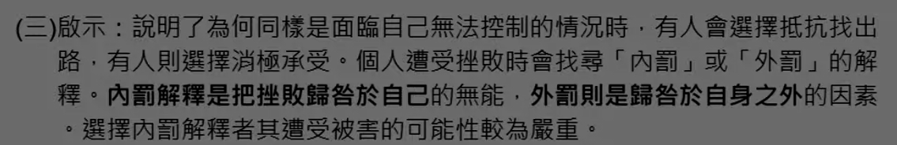

### 十一、犯罪鐵三角：古

#### （一）代表學者：

克拉克和艾克於2003年提出，使用犯罪元素和犯罪場所之間的交互作用來解釋犯罪的發生，為日常活動理論的變化版。

#### （二）理論內涵：

主要分為內外兩個三角形，各有三種因素影響犯罪。

##### 1. 內環：犯罪三要素

(1) 場所（place）  
(2) 犯罪者（offender）  
(3) 被害人（Victim）

##### 2.外環：對內環監控的三要素

(1)場所管理者（managers）
(2)掌控者（handlers）：可以控制犯罪人或是犯罪者之重要他人。
(3)監控者（Quardian）：監視器、保全。

#### （三）理論啟示：

犯罪是內外環交互作用產生的，當內環兼備而外環有缺失時，極有可能產生犯罪。

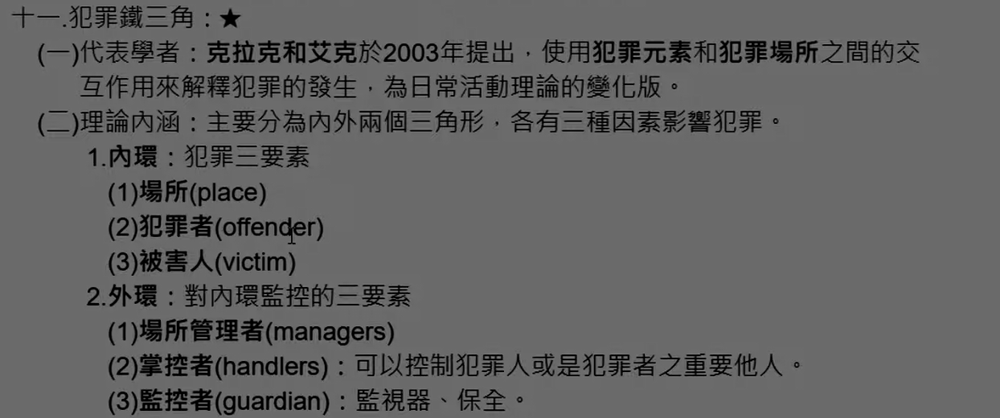

## 肆、環境犯罪學理論：

### 一、環境犯罪學的興起：

#### （一）犯罪預防論的興起：

20世紀中期時犯罪率提高，對於之前18-19世紀以來的刑事司法措施感到失望。1970年代後被害者學興起，學者捨棄犯罪原因論起而探討犯罪預防論，紐曼和傑佛利研究犯罪情境認為只要只要能消除硬體環境之犯罪機會就能救有效防制犯罪的發生，也直接影響了環境犯罪學之發展。

#### （二）理性選擇主義的崛起：

理性選擇主義使犯罪人衡量犯罪的利益和損害後才做決定，因此可以藉由控制環境使犯罪人覺得犯罪風險太高而放棄犯罪。

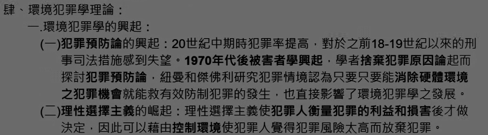

<!-- v82 -->
### 二、環境犯罪學的相關理論：

（日常活動理論也屬於此範疇已於前面介紹）

#### （一）防衛空間理論：

是一種透過建築物的設計以及增進自然監控的方式來預防犯罪以及提升犯罪暴露及逮捕機率的方式。

##### 1.代表學者：

美國學者紐曼於1972年研究紐約市的住宅犯罪，他發現在高密度的集合住宅中，居民關係淡薄、缺乏監控、出入口缺乏管制等原因，造成犯罪率偏高，提出此理論希望能藉由改善環境來預防犯罪。

##### 2.理論內涵：

防衛空間主要藉由下列要素來嚇阻犯罪之發生。

(1) 領域感（Teritoriality）：領域感是社區居民維持生活區域的一種能力，在此生活區域中會自然而然的產生防衛本能，居民對於社區支持、重視、關心、保護，有著親密感和歸屬感。  
(2) 自然監控（Naturalsurveilance）：指個人不透過其他工具可以直接觀察居住環境之能力，如有人貿然進入馬上就會被發現。如果讓居民有更大的視野、更好的觀察以及監控能力，便能有效嚇阻犯罪降低居民恐懼感。  
(3) 建築物之設計（印象Image）：建立起一個不容易察覺弱點為犯罪所侵而有正面形象的建築物，並減少被害的機會，例如：出入口管制、門窗設計、警衛管制。  
(4) 鄰近區域安全性（SafeAdjoiningAreas）：透過對鄰近區域的高監控能力以及出入口管制可以降低被害可能性。

#### （二）環境設計來預防犯罪理論：

##### 1.代表學者：

在紐曼之後傑佛利將其概念發揚光大，認為使環境沒有發生犯罪的機會，將可使犯罪降至最低的程度。而這要靠對環境的妥善設計及管理才能達成。

##### 2.理論內涵：

使用妥善的環境設計與規劃，消除人際間的疏離感並加強互動。重點有二：

(1) 改善都會區的物理環境：翻新破舊、髒亂、壅擠的社區與街道。  
(2) 以環境設計強化人與人之間的關係。

##### 3.實施策略：

(1) 防衛空間：在居住的周遭環境中建立起防衛組織（巡守隊），防止犯罪發生。  
(2) 領域感：領域感是社區居民維持生活區域的一種能力，在此生活區域中會自然而然的產生防衛本能，居民對於社區支持、重視、關心、保護，有著親密感和歸屬感。  
(3) 活動計畫：加強民眾預防犯罪的概念，鼓勵參與社區事務。  
(4) 強化標的物：使個人身家財產受到監控或是更為堅固，例如：上鎖。  
(5) 監控：指的是正式監控力量，例如：監視系統、警衛。  
(6) 自然監控：運用對建築物特殊的設計使居民能夠輕易地看到入侵者，同時也讓入侵者知道自己已被盯上，防止進一步的侵害。  
(7) 通道管制：對於禁止進入或有貴重物品的地方，設立障礙物或標語，讓人知道這是私人區域而非公共區域。

#### （三）情境犯罪預防策略：

指的是以有系統的方式對於某些類型的犯罪常造次的環境加以設計管理，來增加犯罪風險、減少犯罪酬償、降低犯罪機會、增加犯罪羞恥。

##### 1.代表學者：

起源於紐曼的「防衛空間」概念，之後由傑佛利以「環境設計來預防犯罪」發揚光大，最後克拉克於1992年提出情境犯罪預防策略，並於1997年提出4項16點的版本，最近的版本是2003年5項25點的版本。

##### 2. 理論內涵：

目前考試以2003年版本為主，故主要介紹此版本。

(1) 1997年的4項為：增加犯罪困難、提昇犯罪風險、減少犯罪酬償、產生犯罪恥感。  
(2) 2003年的5項為：提昇犯罪阻力、增加犯罪風險、降低犯罪報酬、減少犯罪刺激、移除犯罪藉口。

<table>
	<!-- row 1 --> 
	<tr>
		<td align="center"><b>提昇犯罪阻力</b></td>
		<td align="center"><b>增加犯罪風險</b></td>
		<td align="center"><b>降低犯罪報酬</b></td>
		<td align="center"><b>減少犯罪刺激</b></td>
		<td align="center"><b>移除犯罪藉口</b></td>
	</tr>
	<!-- row 2 --> 
	<tr>
		<td>標的物強化 1.增加鎖 2.門窗強化 3.保險箱</td>
		<td>擴充監控 1.例行提醒 2.結伴同行 3.居住痕跡</td>
		<td>目標物隱匿 1.車輛停車庫 2.運鈔車無標示 3.貴重物隱藏</td>
		<td>避免模仿 1.電視分級 2.立即修復被破壞之物品</td>
		<td>訂立規範 1.租賃契約 2.旅館規則</td>
	</tr>
	<!-- row 3 --> 
	<tr>
		<td>管制通道 1.路口管制 2.團進團出 3.ID卡進出</td>
		<td>增加自然監控 1.防衛空間設計 2.改善街道環境</td>
		<td>目標物移除 1.收銀檯減少現金 2.身上別帶太多錢</td>
		<td>減少情緒挑逗 1.夜歸婦女保全 2.色情暴力片管制 3.財不露白</td>
		<td>敬告守則 1.禁止進入 2.私人土地 3.禁止營火</td>
	</tr>
	<!-- row 4 --> 
	<tr>
		<td>過濾出口 1.出口驗票 2.磁條設備 3.出口管制</td>
		<td>強化正式監控 1.監視用具 2.防盜警鈴 3.正式警衛</td>
		<td>財物之辨識 1.財產標註 2.車輛烙碼</td>
		<td>避免爭執 1.計程車跳表制 2.隔離敵對球迷 3.降低酒吧壅擠</td>
		<td>激發良心 1.速限提醒版 2張貼標語</td>
	</tr>
	<!-- row 5 --> 
	<tr>
		<td>轉移嫌犯 1.男女廁分開 2.道路封閉 3.分散酒吧</td>
		<td>減少匿名性 1.制服 2.身分辨識 3.申訴電話</td>
		<td>揭亂市場 1.監視當鋪 2.取締非法攤販 3.分類廣告管控</td>
		<td>減少同儕壓力 1.避免酒駕 2.僅慎子女交友</td>
		<td>協助遵守規則 1.公共廁所 2.垃圾桶 3.借書管理</td>
	</tr>
	<!-- row 6 final --> 
	<tr>
		<td>管制器械 1.武器管制 2.噴漆管制 3.毒品管制</td>
		<td>職員協助 1.閉路電視 2.增加店員 3.獎勵優良店員</td>
		<td>否定利益 1.防盜墨水 2.塗鴉清除 3.減速路凸</td>
		<td>減緩挫折與壓力 1.柔和音樂光線 2.增加座位 3.良好服務與排隊</td>
		<td>管制藥酒 1.酒駕吊銷駕照 2.管制藥管控 3.路口酒測</td>
	</tr>
</table>

##### 3. 副作用：

(1) 利益擴散（好）：預防一種犯罪能同時起到預防另一種犯罪的效果，預防某一地區的犯罪卻也讓鄰近地區犯罪減少。  
(2) 犯罪轉移（壞）：原本這個地區的犯罪者，轉而去其他防衛薄弱的地區犯案。學者批評，犯罪只是被轉移並沒有被預防。  
(3) 犯罪進化（壞）：也稱效應滅失（EffectExtinction）犯罪人適應環境後可能會用更高超的技巧或方式來犯罪，偷不成就用破壞的方式搶（想想玩[命關頭系列）。

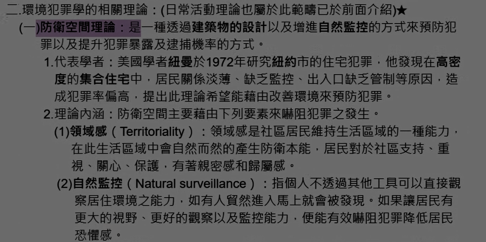
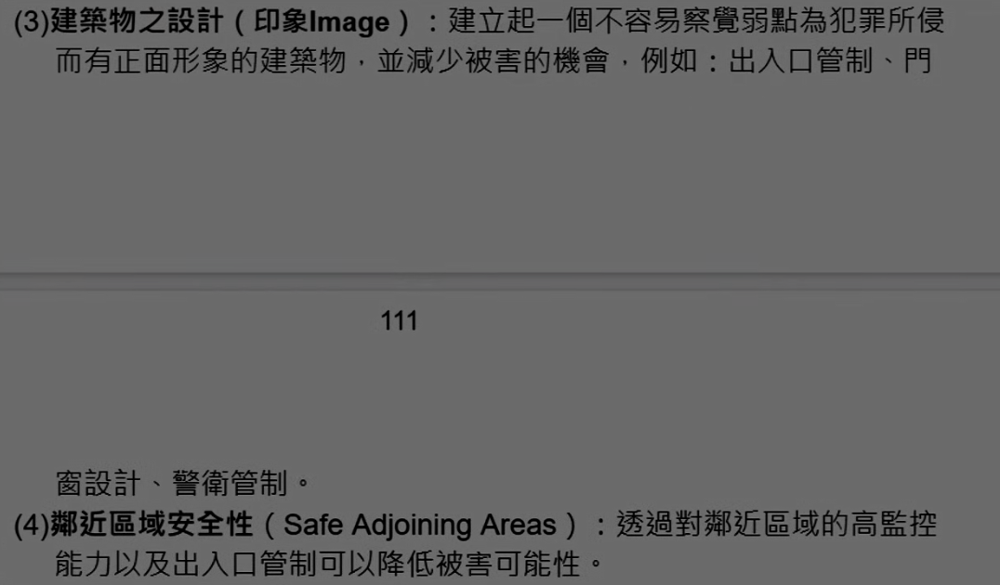
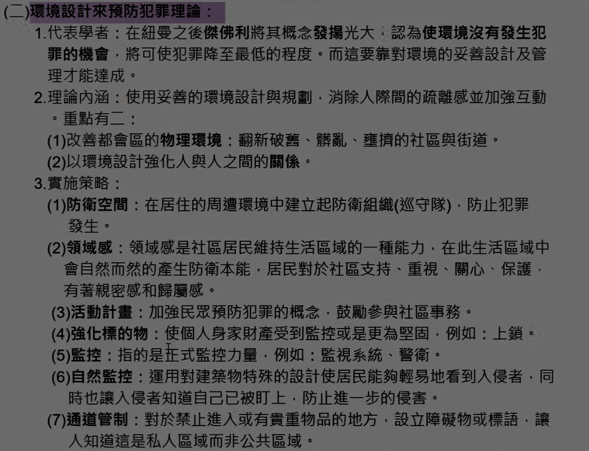

<!-- v83 -->
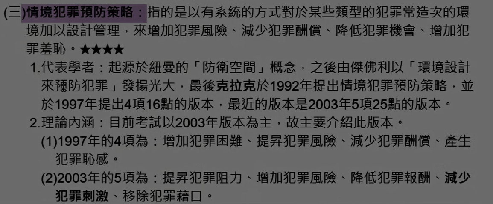
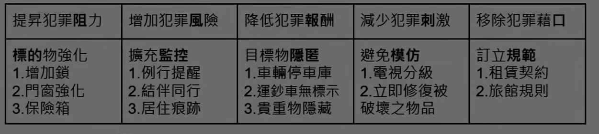
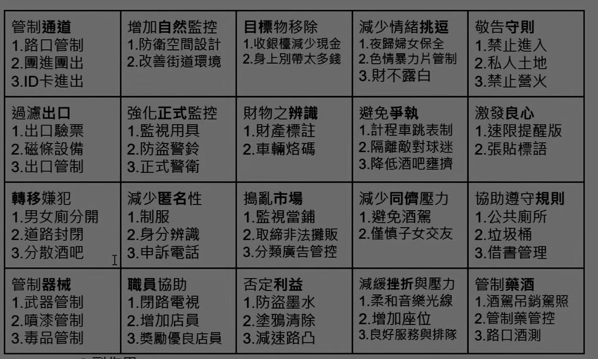
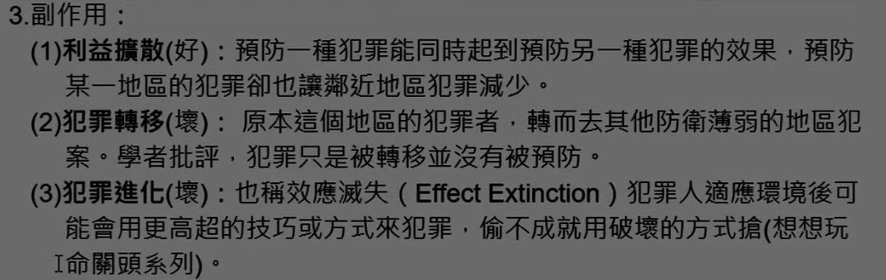

#### （四）新機會犯罪理論：太

##### 1.代表學者：

費爾遜與克拉克於1998年提出，整合了理性選擇理論、日常活動理論、犯罪型態理論，以說明犯罪分布與機會的關係。因為這三種理論都包含「機會」的概念，或是以機會的變化來解釋犯罪數量和型態的改變。

##### 2.理論內涵：

###### (1) 三種理論：

A. 日常活動理論：以大社會的巨觀論點探討犯罪，認為犯罪發生必須要有三種要素： (A) 有能力動機的嫌疑犯， (B) 合適的標的物，(C) 缺乏監控者。

B. 犯罪型態理論：由學者布列亭翰夫婦提出，強調社區的差異以及犯罪型態的分布，會因為個體移動的時間地點不同而影響犯罪機率。因此著重於犯罪的地理分布和活動的頻率。將社區分成中心點（日常活動，的起點或終點）、路徑（點與點的交通路線）、邊緣（日常活動的邊界地帶）。犯罪是因為接觸了邊緣的潛在犯罪人以及潛在犯罪人在路徑及中心點上找尋目標。而犯罪者會發展出認知地圖來找尋合適的犯罪標的物，認知地圖包含認知、預測、評估、行動等四要素。（又稱為犯罪搜尋理論）

C. 理性選擇理論：以微觀的角度探討一個人內在決定犯罪的過程，於犯罪時考慮當下的內外在因素，必須要對自己有利才會進行犯罪。

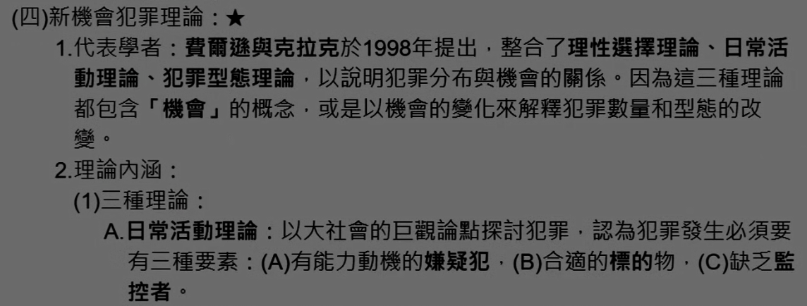
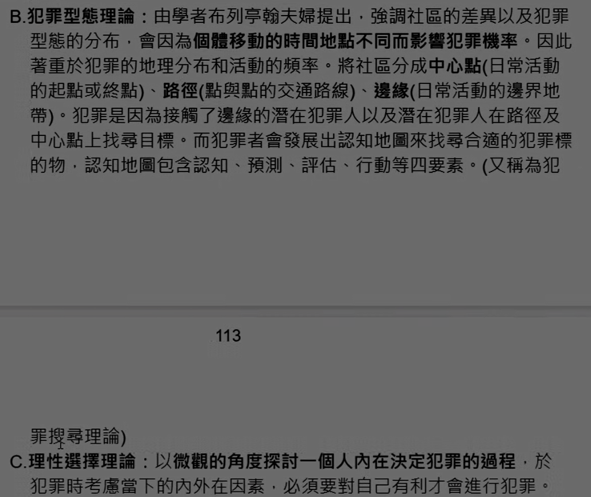

###### （2）新機會犯罪理論：

A. 理論間的互補：我們生活的這個社會中，有巨觀的大社會、小一點的社區以及微觀的個人。因此以日常活動理論，強調大社會注重科技進步以及社會結構型態的改變，會造成的犯罪機會改變。以犯罪型態理論強調社區生活方式的改變會改變犯罪機會。以理性選擇理論強調潛在犯罪人的犯罪決意，是植基於社區大社會給予的犯罪機會。

B. 機會是理論核心：不論是日常活動理論或是犯罪型態理論以及理性選擇理論都是以機會為核心概念，而機會也是整個環境犯罪學的立論根本及核心。

##### 3.機會與犯罪的十項原則：（許春金）

(1) 犯罪機會集中的特殊時空，會形成「犯罪熱點」。
(2) 機會在犯罪發生上扮演重要角色。
(3) 社會與科技的改變會產生新的犯罪機會。
(4) 特定物品會提供更多的犯罪機會。
(5) 減少犯罪機會通常不會造成犯罪轉移的現象。
(6) 犯罪機會和日常活動有關。
(7) 一個犯罪會衍生另一個犯罪機會。
(8) 不同的犯罪型態有不同的犯罪機會。
(9) 致力於機會的降低將會產生更廣泛降低犯罪的效果。
(10) 可以透過減少犯罪機會而達到預防犯罪的目標。

#### （六）名詞解釋：

##### 1. 犯罪地理資訊系統：

由地理資訊系統延伸出來專門為犯罪研究所做的一套軟體，將犯罪數據與地圖街道等資料輸入，即可標示出犯罪熱點與市區街道的位置，進一步方便警察調動人力以及巡守策略的進行。

##### 2. 犯罪熱點：

由官方統計的資料顯示出在都市中的某個地區，犯罪率高於其他地區，表示它有獨特的環境特質，導致犯罪案件層出不窮。這些地區有其特殊的犯罪生態性，例如酒吧林立、廢墟多、貧民窟、風化場所。可安排警察常巡邏或是組成巡守隊來降低犯罪的發生。

##### 3. 犯罪基圖：

結合官方統計和人口普查資料以及犯罪熱點資訊製作而成，概念來自於犯罪區位與環境空間的互動關係，圖上除了標示出各地區重要的區位事實外（景物、公園、街道、機關），並將犯罪現象以不同數量和符號標示於圖上。

##### 4. 破窗理論：

此理論原先是在舊金山的一個實驗，研究者將一台車停在街上，並且不理會它，第一周沒有遭到破壞，因此車子沒事。第二周時一個棒球打破了一個窗子，之後不到4個小時，剩下的5個車窗都被打破，車子也被偷的只剩下輪胎。在社區中若窗子破了沒馬上修補，會讓周圍的潛在犯罪者以為房子沒人管是可以任意破壞的，有如一種暗示許可，這會形成一種犯罪升級的效應。

<!-- v84 -->
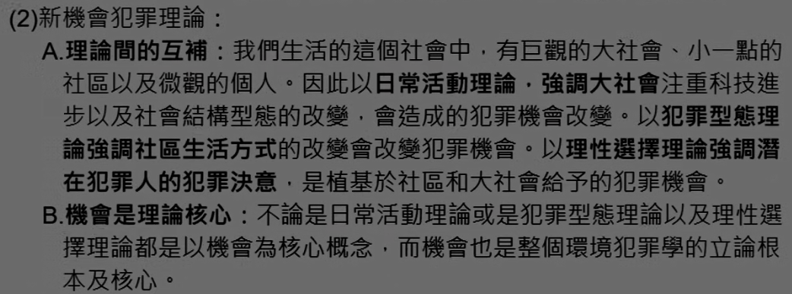
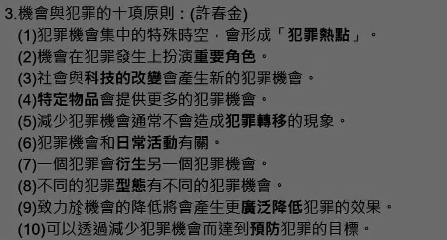
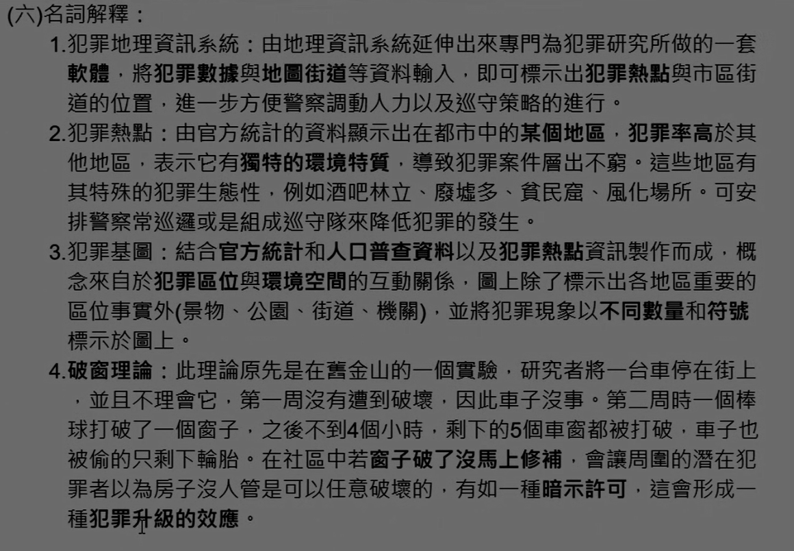

