# 第三章 犯罪防治論

<!-- 85 - 87 -->

<!-- v85 -->
## 壹、犯罪預防簡介
### 一、意義：
### 二、目標：
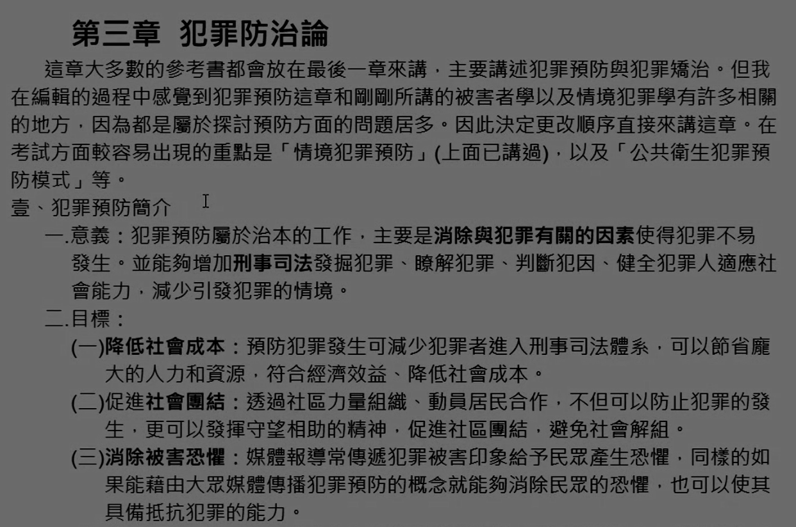

## 貳、犯罪預防模式：**<++>**
### 一、公共衛生三級犯罪預防模式：
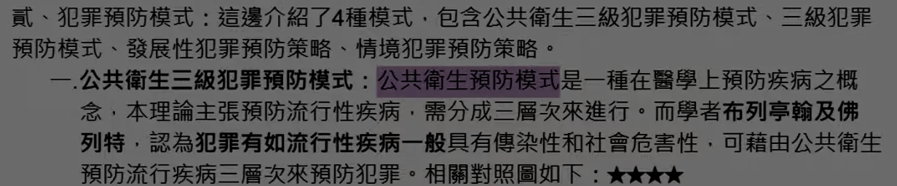
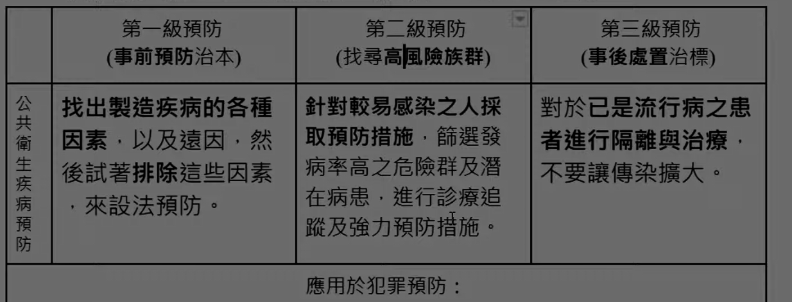
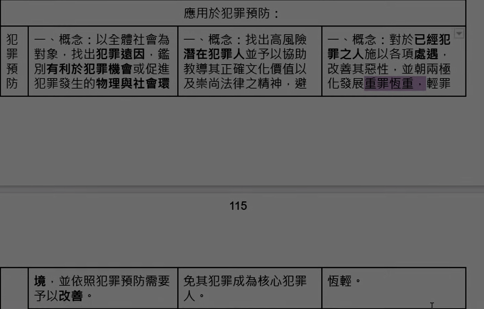
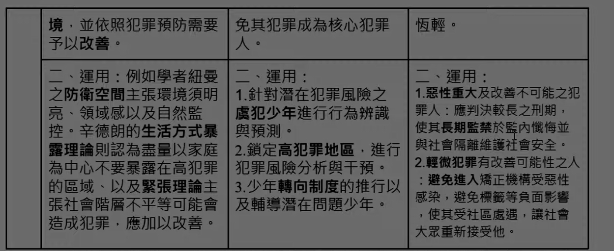

<!-- v86 -->
### 二、三級犯罪預防模式：
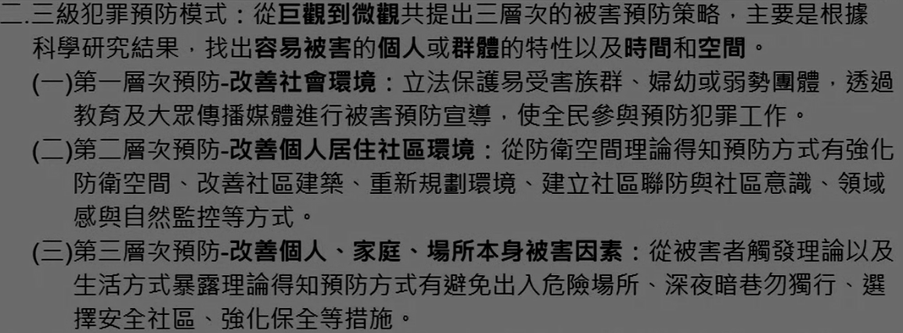

### 三、發展性犯罪預防策略：
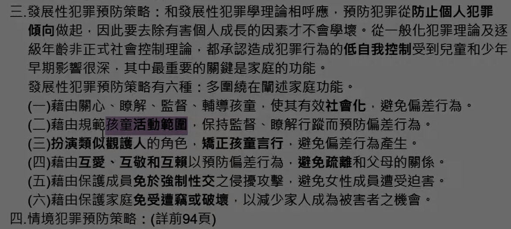

## 參、犯罪矯治：
### 一、機構處遇：
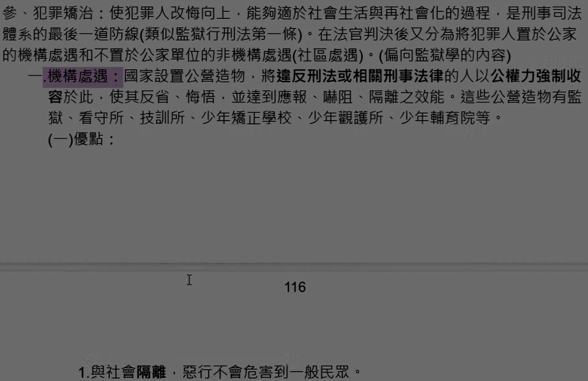

<!-- v87 -->
### 二、非機構處遇（社區處遇）：
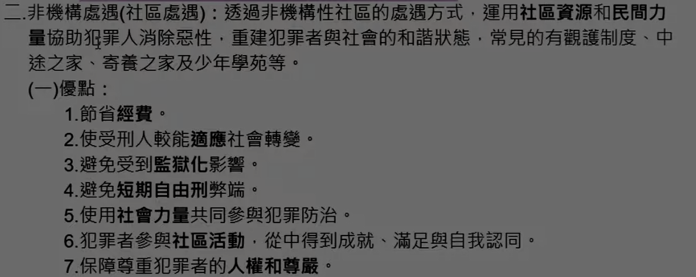
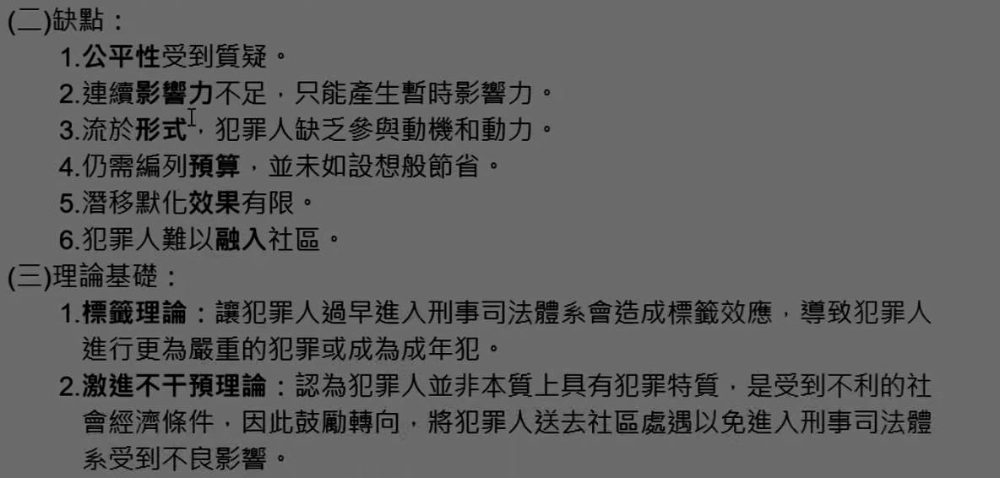
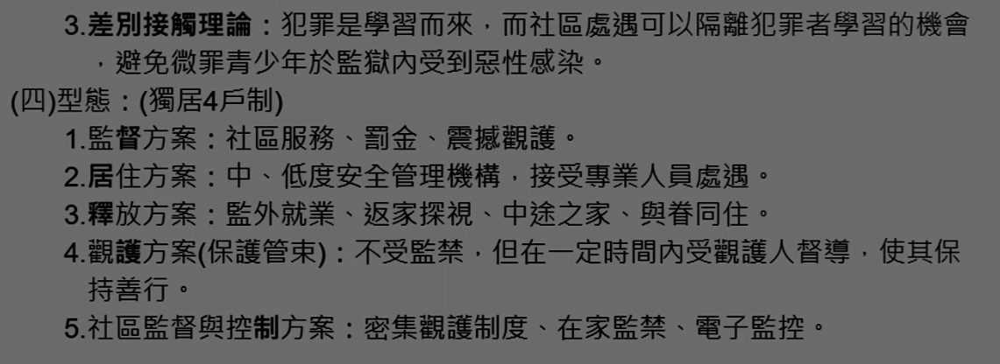
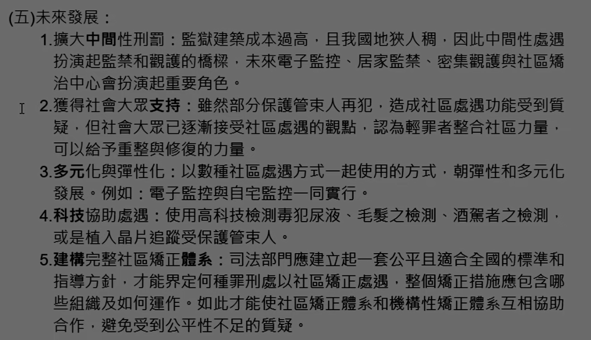
