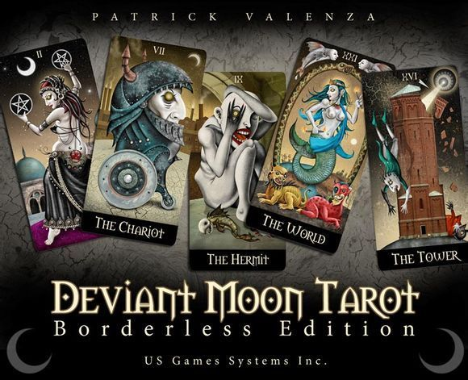

# 邪月(异月)塔罗78张牌意译本｜完整版

ccc

翻譯｜Tang

作者｜Patrick Valenza

譯者按

邪月塔羅牌是才華橫溢的藝術家Patrick Valenza創作，由U.S. Games Systems Inc.出版發行的塔羅牌。Valenza将自己童年的夢境與想象帶入成人世界，對插畫的熱愛與對塔羅的鍾情，讓他花費了三年心血的完成邪月塔羅牌的創作。九歲時他第一次接觸塔羅，他一直把月亮當做自己靈魂的夥伴。月亮作爲黑夜的哨兵，滋養着他的夢境，并爲他所看到的現實世界蒙上了異樣的光芒。

**UM｜Upright meaning 正位**

**RM｜Reversed meaning 逆位**

### 大阿卡納 Major Arcana

**0.愚人 the fool**

Unaware of his surroundings, the fool begins his journey by wandering into the canal. He has no experience with life; therefore he has no fear of it.

愚人沿着蜿蜒的小河開始他的旅程，他并沒有注意到周遭的環境，由于沒有生活經驗，因此也沒有畏懼。

Upright meanings: The beginning of a journey. Innocent or young person. Folly. Acting without thought. Potential.

UM:一段旅行的初始階段。單純或有朝氣的年輕人。愚蠢的；做事不經思考。有潛力的。

Reversed meanings: Failure to seize the moment. Unsure actions. Uncertainty.

RM:未能抓住時機。不确定、沒有把握的行動。半信半疑；難以預料的事。

**1.魔術師 the magician**

Blessed with a great talent, the magician performs skillfully. Although he has only begun to learn his craft, he is already gifted.

魔術師巧妙地演繹着他那受到祝福的偉大天賦。盡管才剛開始學習這門技藝，他早已在這方面擁有天賦。

Upright meanings: Putting creativity to use. Exploring one’s potential abilities. Manual dexterity. Skilled hands. Emerging talent.

UM:施以創造力。探索某人潛在的能力。靈巧的動手能力。熟練的技藝。新興的天才。

Reversed meanings: Putting one’s gift to ill use. Lack of imagination. Confusion. Uncoordinated efforts. Unable to learn new skills.

RM:将天賦運用在不好的地方。缺乏想象力。混亂。不協調的努力。無法學習新的技能。

**2.女祭司 the high priestess**

The high priestess sits as a winged sentinel over the city. She protects the knowledge she holds inside, for wisdom must be earned through the trials of life.

女祭司像一名帶翅膀的哨兵坐在城市之上，庇護着她内在的知識，隻有通過生活的磨練才能獲得智慧。

Upright meanings: Supreme knowledge. Intuition. A woman wise beyond her years. Virtuous. Scholarly.

UM:至高無上的知識。直覺。智慧遠超同齡人的女性。道德的；貞潔的；正直的。博學的；有學者風範的。

Reversed meanings: Ignorance. Lack of vision. Holding back true feelings.

RM:無知愚昧的。缺乏遠見和洞察力。克制真實的情感。

**3.女皇 the empress**

The empress sits on her garden throne holding a flower that emanates from her own body. As the goddess of fertility, she is one with nature.

女皇坐在她的花園裏的寶座上，手裏拿着從她體内長出的花朵。宛如豐饒女神般與自然融爲一體。

Upright meanings: Strong female figure. Fertility. Maternal.

UM:強烈的女性特征。豐饒；繁殖；母性的。

Reversed meanings: Infidelity. Domestic strife. Infertility.

RM:無信仰。國内矛盾；家庭矛盾；内部沖突。不毛之地；貧瘠；不育的。

**4.皇帝 the emperor**

Dominating all that is around him, the emperor sits with confidence. Although pleased with his achievements, he looks towards other areas of conquest.

皇帝統治着他周圍的一切，自信地坐着，盡管很滿意已有的成就，但他依然朝着其他想要征服的地方望去。

Upright meanings: Strong male figure. Leadership. Accomplishment. Ambition.

UM:強烈的男性特征。領導地位和才能。成就；野心。

Reversed meanings: Incompetence. Weakness. Indecision.

RM:沒有資格；無法勝任的。無能軟弱的。優柔寡斷的。

**5.教皇 the hierophant**

The Hierophant prays for the souls of the city. His position wields more than spirituality, for religion holds a man like a doll in a pocket.

教皇爲城市中的靈魂祈禱，他的地位與身份所帶來的影響遠不止在精神上，宗教像玩弄口袋裏的玩偶般操控着人們。

Upright meanings: Divine inspiration. Mercy. Control over spiritual needs. Conformity.

UM:神聖的、非凡的靈感。憐憫；仁慈；寬容。控制精神上的欲求。一緻；合适；符合。

Reversed meanings: Unorthodox ways. Impotence. Poor advice.

RM:非正統的、異端的方式。虛弱；無效；陽痿。糟糕的建議。

**6.戀人 the lovers**

Locked in a passionate hold, two lovers embrace by a desert lake. The moon casts a hypnotic trance upon them. A snake injects them with venom.

被禁锢在激情的牢籠中，一對戀人相擁在沙漠的湖畔。月亮投射了一道催眠的光華在他們身上，一條蛇向他們注入毒液。

Upright meanings: Love. Passion. Romance. Harmony. Union.

UM:愛情。熱情。浪漫。和諧一緻。結合。

Reversed meanings: Separation. Division. Conflict.

RM:分開；分離。沖突；鬥争。對抗。

**7.戰車 the chariot**

The charioteer prepares to venture out of the city. Overcoming past adversities has made him strong; now he takes his experience to new lands.

戰車的禦者準備好到城外去冒險。戰勝逆境和不幸使他變得更強大，現在他帶上他的經驗踏上一塊新的土地。

Upright meanings: A journey to new places. Boldly venturing into the unknown.

UM:到一個新地方旅行。在未知的地方（領域）開展大膽(冒失)的冒險（金錢方面的投機）。

Reversed meanings: Failed plans. Poor strategy.

RM:失敗的計劃。糟糕的計謀、戰略。

**8.正義 justice**

A great judge balances two swords as he presides over the city. Although seemingly fair, corruption often creeps from the seams of a just society.

一位偉大的判官使手中的兩把劍獲得平衡，就像他管理城市一樣。雖然表面上看起來公平，但堕落與貪腐正不知不覺地在公正的社會中蔓延開來。

Upright meanings: Balance. Strong character. Fairness.

UM:平衡。堅強的品格。公平。

Reversed meanings: Abuse. Taking sides. Bias.

RM:濫用；虐待；弊端。偏袒。偏見。

**9.隐士 the hermit**

The hermit hides from the world in his alcove. Even though he shuts himself off from the city, he is never truly alone. The rotted fish beside him is a reminder that we can never hide from ourselves.

隐士把自己關在角落，想要在城市中隐藏起來。盡管他與城市隔絕，但從未做到真正孤單一人。腐壞的魚提醒着我們永遠不可能把自己隐藏起來。

Upright meanings: Solitude. Exile. One who seeks to be alone. Outcast. Hidden knowledge. Secrecy.

UM:孤獨隐居。背井離鄉的流放者。尋找孤獨的人。被抛棄者。隐藏的學識。保密；隐蔽。

Reversed meanings: Social. Sharing information. One with the community.

RM:社會的。分享信息。社會群體的一員。

**10.命運之輪 the wheel of fortune**

The gypsy stares into the future with a blank gaze. She spins the wheel for an uneasy citizen who wishes to know his own fate.

吉普賽人眼神空洞地凝視着未來。她爲一位因想要知道自己命運而心神不甯的人轉動手中的命運之輪。

Upright meanings: Fortune. Chance. Unplanned happenings. Fate. Destiny.

UM:幸運的。機會。意外的事。命運。命中注定的。

Reversed meanings: Unfortunate events. Unexpected results.

RM:不幸的大事件。非預期的結果。

**11.力量 strength**

A man possessing incredible strength imposes his will on a wild beast. The man must beware, for what he seeks to control may ultimately overcome him.

一個擁有難以置信的力量的男人将他的意志強加在一頭野獸上。這個男人必須小心，他所控制的東西可能最終會戰勝他。

Upright meanings: Power. Strength from within. Endurance.

UM:力量；權力。内部的力量。忍耐力；持久。

Reversed meanings: Defeat. Surrender.

RM:失敗；投降。屈服；失敗。

**12.倒吊者 the hanged man**

A citizen hangs suspended in limbo. He is apathetic and feels no urgent need to alter his situation. Time around him does not stand still, however. He must free himself, or his life will pass him by.

一位市民被懸挂在廢棄場，他無動于衷且不急着改變他的處境，環顧四周，時間并非停滞不前。不論如何，他必須讓自己活得自由，否則他的生命将從他的身邊溜走。

Upright meanings: Letting time pass you by. Indecision. Opportunities missed.

UM:時間從身邊溜走。猶豫不決。錯過機會。

Reversed meanings: Wasting time. Lack of progress. Feeling stalled in life.

RM:浪費時間。缺乏進展。生活陷入泥潭。

**13.死神 death**

Two corpses, a mother and child, stand on a polluted beach. The child attempts to reenter the womb of his mother, but is held back. Another will be born soon. With death comes rebirth.

母親和孩子兩具屍體，站在污濁的湖濱，孩子想要回到母親的子宮，但被阻止了。另一個孩子不久後将要降生，死亡伴随着重生。

Upright meanings: Change. Metamorphosis. Loss. End of ways.

UM:改變。變質；變形。失去；虧損。無計可施；無路可走。

Reversed meanings: Turbulent change. Bad situations.

RM:騷亂動蕩的改變。壞形勢；不好的處境。

**14.節制 temperance**

An angel stands by a peaceful stream patiently pouring water from her urns. Although the vessels are different in design, the mixture she creates is a potion of harmony.

一位天使站在平靜的溪流邊，從她的壺中耐心地倒着水。雖然這個器皿和設計中的不一樣，但她所創造的是一劑帶來和諧的混合物。

Upright meanings: Patience. Balance. Channeling one’s energy. Combining elements for new results.

UM:耐心；毅力。平衡。導向某人的能量。爲新結果而結合的要素。

Reversed meanings: Conflict. Bad combinations. Discord. Excess.

RM:沖突矛盾。不好的聯合。不和；不一緻。過量；超額。

**15.惡魔 the devil**

Standing on a volcanic globe, the devil dances in delight over the havoc he has caused in the city. Once a beautiful angel, he now roams the dark depths of men’s hearts and binds their souls to his own.

站在火山噴發的星球上，惡魔爲他在城市中造成的浩劫歡快地手舞足蹈。他曾是美麗的天使，而如今爲了束縛人類的靈魂漫步在黑暗的深淵中，并将這些靈魂據爲己有。

Upright meanings: Oppression. Material bondage. Evil fantasies. Obsessive desires.

UM:壓抑。物質肉體的奴隸。邪惡的幻想。瘋狂的欲望；無法停止的欲望。

Reversed meanings: Unwavering pursuit of material gain. Greed. Mind control.

RM:堅定的追求物質和肉體。貪婪。精神控制。

**16.塔 the tower**

A lightning blast from the sky strikes the tower. Two sinners plummet to their death below as the structure falls to ruin.

一道閃電從天空中劃過，擊中了通天塔。因爲通天塔被閃電擊毀，兩個罪人從塔上墜落緻死。

Upright meanings: Severe or abrupt change. Loss or accident. Traumatic event. Ruin. Upheaval.

UM:不好或突然的變化。虧損；交通事故。創傷性事件。毀壞。動蕩劇變。

Reversed meanings: Inability to break from sad events. Redundancy in life.

RM:對悲傷的事造成的破壞無能爲力。裁員。生活中多餘的事。

**17.星星 the star**

A maiden sits on the shore and pours water into a crystal pool. Seven stars shine behind her, bringing hope to the lands below.

一名少女坐在岸邊并将水倒入一個清澈的小潭裏。七顆星星在她身後閃耀着光芒，将希望帶到的大地上。

Upright meanings: Hope. Sign of good things. Renewed faith. Fulfillment in life’s pleasures.

UM:希望。好事的象征。重建信心。滿足于生活樂事。

Reversed meanings: Doubting one’s abilities. Stagnant creativity.

RM:懷疑某人的能力。創造力停滞不前。

**18.月亮 the moon**

The deviant moon casts its powerful influence over the city, controlling minds like a puppeteer.

邪月将他強大的力量投射到城市上空，像操控木偶一樣操縱人們的思想。

Upright meanings: Brainwashing. Dark influences. Trickery. Illusion. Subconscious control.

UM:洗腦。陰暗的影響。欺騙。幻覺。潛意識的控制。

Reversed meanings: Avoiding reality. Strange forces. Delusional thoughts. Lies and despair.

RM:避開現實。奇怪、陌生的力量。受到欺騙的思想。謊言和絕望。

**19.太陽 the sun**

Twins meet by the city wall. They came as two individuals, yet the sun above unites them into a single soul.

雙胞胎在城牆邊上相遇，他們來自兩個單獨的個體，然而頭頂上的太陽将他們結合成一個靈魂。

Upright meanings: Successful social relationship. Friendship. Engagement. Happy times. Pure joy.

UM:成功的社會關系。友誼。訂婚；諾言。快樂時光。純粹的快樂。

Reversed meanings: Loneliness. Unstable relationships. Separation.

RM:孤獨的。不穩定的關系。分離；分居。

**20.審判 judgement**

Corpses rise from their tombs as the angel awakens them with a blast of his horn. All beg for redemption as judgment is set forth upon the land.

在天使吹響的号角下，被喚醒的屍體從他們的墳墓中複活。所有對于贖罪的乞求因審判的降臨而來到大地上。

Upright meanings: Accountability for one’s actions. New beginnings. Awakening.

UM:對某人的行爲負有責任。新的開始。正在覺醒的。

Reversed meanings: Fearful of death. Guilty feelings. Worry. Delay.

RM:對死亡的害怕。自知有罪的感覺。擔心。延遲；耽擱。

**21.世界 the world**

The young mermaid has made her way around the world. She ends her journey where she started it. However, experience has transformed her. Around her, a large snake completes the circle by devouring its own body. Below her, sit the beasts she has overcome on her travels.

小美人魚已經在這個世界找到了自己的路。她回到開始旅行的地方結束了她的旅程。不過，經曆改變了她。在她的周圍，一條蛇以吞食自己的身體的方式形成了一個圈。在她身下野獸們坐着，她結束了她的旅行。

Upright meanings: Completion of a cycle or journey. Triumph. A hard-fought victory. Successful outcome over adversity.

UM:一個周期或旅程結束。勝利。艱苦的勝利。在逆境中成功的結果。經過激烈戰鬥獲得的勝利。在逆境中獲得的成功。

Reversed meanings: Frustration. Incomplete projects. Failed endeavors.

RM:挫敗。不完整的項目。努力嘗試未果。

### 小阿卡納 Minor Arcana

#### 寶劍 suit of swords

寶劍家族是擁有強大力量的家族，但是家族的成員會因爲沖突或鬥争制造麻煩。盡管他們會遇到很多問題，但是他們通過力量與毅力有着不屈不撓的精神。

**寶劍國王 king of swords**

The mighty king stands with a soldier from his army. He imposes his strong will on those around him and leads with stern determination.

強大的國王和他軍隊中的一名士兵站在一起。他将他強大的力量施加在那些圍繞在他周圍的人身上，并以堅定決心領導他們。

Upright meanings: Using one’s willpower to an end. Controlling leadership. Determination. Disciplined. Lawmaker. Logical.

UM:将某人的意志力進行到底。掌控領導地位、領導力。決心；果斷。立法者。有邏輯頭腦的；符合邏輯的。

Reversed meanings: Brutality. Unfair judge. Selfishness.

RM:無情、殘忍的暴行。不公正的判決、評判。自私的。

**寶劍女王 queen of swords**

The weeping queen is alone in the forest. Her position of power offers no consolation for the loneliness she feels. Blood drips from the end of her blade, for her heart is torn by events around her.

哭泣的女王獨自站在森林中，她的至高無上權位也無法撫慰她内心深處的孤獨。血從她的刀尖滴落，她的心被周遭發生的事撕裂。

Upright meanings: Loneliness. Anxiety. Sadness. A widow. Someone carrying a burden.

UM:孤獨的。焦慮的。悲傷的。一個寡婦。挑負重擔。

Reversed meanings: Cruel and deceitful. Bad tempered.

RM:殘忍的；欺詐的；虛僞的。壞脾氣。

**寶劍騎士 knight of swords**

An open gate awaits the brave knight as he prepares to ride out in search of adventure. Although he is known as the protector of the city, he sometimes leaves his post to pursue acts of aggression.

敞開的大門等待着勇敢的騎士騎着馬去冒險。盡管他是以城市守衛者的身份而廣爲人知，但他有時也會離開自己的崗位，加入侵略的行動。

Upright meanings: Brave but rash. A hero. Quick to respond and take action. Tactless.

UM:勇敢但輕率魯莽。一個英雄。快速反應并采取行動。不機智的；不老練的；笨拙的。

Reversed meanings: A bully. Troublemaker. Impulsive.

RM:一個恃強淩弱的暴徒。惹是生非者。沖動的。

**寶劍侍者 page of swords**

The young page roams the city. He is skilled in perceiving hidden truths and secrets, however he is often underestimated due to his youth.

年輕的侍者在城市中漫步。他善于察覺隐藏的真相和秘密，但他經常因爲年輕而被人低估。

Upright meanings: Insightful. Perceptive. Intuitive. Keeper of secrets.

UM:富有洞察力。有知覺力的。有直覺力的。守密者。

Reversed meanings: Deceit. A liar. False friend.

RM:欺騙；謊言。一個騙子。虛僞的朋友。

**寶劍10 ten of swords**

Ten swords penetrate a wooden box, piercing a man who was hiding inside. His place of shelter has become an unfortunate coffin.

十把寶劍刺入一個木制的箱子，藏在箱中的人被刺穿了。他的避難所成了不幸的棺材。

Upright meanings: Absolute ruin. Misery. Unbearable sorrow. Physical or mental turmoil.

UM:絕對純粹的毀滅。悲慘；痛苦。無法承受的悲傷。肉體或精神上的混亂。

Reversed meanings: Improving situations. A slight edge over one’s hardships. A pause in calamity.

RM:情況或處境正在改善。某人苦難方面的一條輕微界限。災難中止。

**寶劍9 nine of swords**

Unable to fall asleep, an old woman sits up in her bed. Nine swords hang in her thoughts as she is tortured by worry and nightmares.

一位老婦人坐在她的床上無法入睡。因爲被擔憂與噩夢所折磨，九把寶劍懸挂在她的思想中。

Upright meanings: Anxiety. Worry. Stress. Misery. Despair.

UM:憂愁；焦慮。擔心。壓力；緊張。痛苦的。絕望；令人絕望的事。

Reversed meanings: Improved outlook. Better health.

RM:前景有所改善。健康狀況變得更好。

**寶劍8 eight of swords**

Bound by the trance of sleep, a woman is beckoned by the deviant moon. Eight swords threaten her from below as she is pulled from her window. The moon’s influence over her dreams will soon come to an end, for daybreak is near.

受到睡眠恍惚的幹擾，一個女人被邪月所引誘。當她從窗口被向外拉出，窗戶底下的八把寶劍威脅着她的生命。月亮透過夢境對她的影響将要結束，黎明即将到來。

Upright meanings: Bondage. Being controlled by outside forces. Censorship. Restriction.

UM:奴役；束縛。被外界力量所控制。審查制度。限制；約束。

Reversed meanings: Freedom. Ability to think for one’s self. Independence.

RM:自由。反省的能力。自主獨立。

**寶劍7 seven of swords**

The harlequin attempts to swallow his swords in a dramatic display of skill, yet his plan is flawed. The rope, which binds the blades, is frayed and will soon break, leaving him in a tragic predicament.

一個小醜試圖吞下自己的寶劍，以一種引人注目的方式顯示他的能力。可是他的計劃有瑕疵，綁在刀上的繩子已被磨損，很快就要斷裂，讓他處于悲慘的窘境下。

Upright meanings: Ill-conceived plans. A path to failure. A poor attempt.

UM:構想拙劣的的計劃；計劃不周的方案。一條失敗的路。一次不好的嘗試。

Reversed meanings: A plan well thought out. Strong advice.

RM:一個經過慎重考慮後産生的計劃。強有力的勸告。

**寶劍6 six of swords**

The city is ablaze and turmoil has overtaken the land. A lone citizen ferries himself to new shores in hope of finding peace. Six swords aid in creating a vehicle for escape.

城市燃起熊熊大火并陷入混亂與騷動，一個獨身的市民将自己擺渡到希望的彼岸，渴望尋找和平。六把寶劍幫助他制造了一個逃亡的交通工具。

Upright meanings: A journey. Escaping bad situations and entering good ones.

UM:一場旅行。從壞的境況中逃離，進入一個好的狀況。

Reversed meanings: Inability to break free of bad circumstances. Entrapment in miserable events.

RM:無法在糟糕的外部環境中開辟出一條自由之路。陷入痛苦的事情。

**寶劍5 five of swords**

A foreign soldier has entered the city. He shows no respect to the king and dishonors him with his tactics. It is impossible to win against such a foe, so it is best not to fight for now. Gloating over his victory, the soldier collects the five swords surrendered to him.

一名外國士兵進入城市，他不尊重國王，并采取策略使國王蒙羞。想要戰勝這樣的敵人是不可能的，所以現在最好不要挑起戰鬥。對手向那個士兵繳械投降，他因獲得勝利而沾沾自喜，把散落的五把寶劍收集起來。

Upright meanings: A cheat. Dishonorable victory. Unfair tactics. A cruel person who enjoys the suffering of others. A braggart.

UM:一個騙子。無恥的勝利。不公平的戰術。一個将自己的快樂建立在别人痛苦上的殘忍的人。吹牛大王。

Reversed meanings: Exposing a false friend. Less chance of defeat.

RM:暴露出一個虛僞的朋友。更少失敗的可能。

**寶劍4 four of swords**

The girl in the ground is dreaming again. Her visions illuminate the tomb and keep four roses in bloom. Three swords are plunged into the earth to mark her place of sleep. A fourth sword lies buried beside her.

埋在土裏的女孩正再一次做夢，她的目光照亮墳墓并使四朵薔薇綻放。三把寶劍被插在土裏，标明她沉睡的地方，第四把寶劍被埋藏在她的身旁。

Upright meanings: Reenergizing one’s self. Rest. Retreat. Exile. Inverted thought.

UM:再次自我激勵。休息。休息寓所。流放；放逐；被放逐的人；背井離鄉。逆向思維。

Reversed meanings: Renewed vigor. A return to daily life and events. Activity.

RM:恢複活力。重新回歸日常生活和事件。活動。

**寶劍3 three of swords**

A sad woman stands alone in her chamber as a terrible storm looms in the distance. Her heart has been pierced by an act of betrayal. She touches the tip of one of the swords, trying to determine if the pain she feels is real or imagined.

當一場可怕的風暴在遠方若隐若現時，一個悲傷的婦女正獨自站在卧室裏。她的心被背叛刺穿，她觸碰着其中一把寶劍的尖端，想要确認自己感受到的痛苦是真實的，還是幻覺。

Upright meanings: Heartbreak. Separation. Stormy relationship. Longing for an absent love.

UM:心碎。分離；分居。暴風雨般的關系。渴望長期缺乏的愛。

Reversed meanings: Extreme sorrow. Loss of a loved one. Emotional misery.

RM:極端悲哀。失去所愛。痛苦的情緒。

**寶劍2 two of swords**

Two mighty swordsmen of equal skill have reached a stalemate. They rest a moment before resuming their battle.

兩位擁有着相同技巧的強大劍士在對抗中陷入了僵局，在恢複戰鬥前他們休息片刻。

Upright meanings: Stalemate. Balanced powers. An immovable obstacle. Rest before action.

UM:僵局。平衡的力量。不可動搖的障礙。行動前的休息。

Reversed meanings: Falsehoods. Lies. Treachery.

RM:假話；不真實；錯誤的信仰。說謊；謊言。虛妄的；背叛；變節。

**寶劍王牌 ace of swords**

An archangel guards herself with a single sword. Although thorns wrap themselves around the blade, she is protected by her strength, and will triumph over adversities around her.

大天使用一把寶劍捍衛自己，盡管刀刃上布滿荊棘，但她的力量保護着她，并使她在逆境中取得勝利。

Upright meanings: Power. Superior inner strength. Situation leading to victory. Determination. Courage.

UM:力量。較強的内部力量。導緻勝利的形勢。決心。勇氣。

Reversed meanings: Abuse of power. Tyranny. Destruction.

RM:權利濫用。專政；專橫；暴虐。破壞；毀滅；摧毀。

#### 權杖 suit of wands

權杖家族的人是用激情與創造力去生活的。當他們面對問題的時候，用具有獨創性的想象力去擺脫困境。

**權杖國王 king of wands**

The king of wands leads his children on an exciting adventure through the woods. His fatherly guidance inspires his offspring down the path of life, for he always sets good examples for them to follow.

國王領導着他的孩子們在一次激動人心的冒險中穿越叢林。沿着生活的道路，他慈父般地引導着、激勵着後代，因爲他總是樹立着好的榜樣，讓他們追随。

Upright meanings: A father. Loving paternal qualities. A married man. Wise leader.

UM:一位父親。父愛的品質。一個已婚男人。英明的領導者。

Reversed meanings: Rough natured. Showing no compassion. Intolerant. A strict and cruel parent.

RM:粗野的本性。沒有表現出任何同情。無法容忍的；偏狹的；不容異說的。一位嚴格與冷酷的家長。

**權杖女王 queen of wands**

The confident queen of wands stands as a dominant personality in the forest. Her self-assured energy radiates from her soul, attracting everyone she meets with inescapable charm.

充滿自信的女王作爲一個統治者站在森林中，她靈魂中流露出自信的能量，她的魅力緻命地吸引着遇見她的每一個人。

Upright meanings: An attractive and well-liked female. Assertive. A sincere person. Confidence.

UM:迷人且深受喜愛的女性。堅定的自信。真誠的人。自信。

Reversed meanings: Vindictive person. One who brings conflict. Infidelity. Revenge.

RM:複仇者。帶來沖突的人。無信仰的；不忠；不貞行爲；通奸。複仇。

**權杖騎士 knight of wands**

The daring knight rushes across a grassy field, ready to meet his troubles head on. Little does he realize, his rash and impulsive reactions to life are the cause of his conflicts.

勇敢的騎士沖過一片長滿草的田野，準備好勇往直前應對自己的麻煩。他幾乎沒有意識到，他對生命魯莽和沖動的反應才是沖突的真正原因。

Upright meanings: Hasty decisions. A sudden journey. Impulsive behavior.

UM:草率、倉促的決定。一次意外的旅行。沖動的行爲。

Reversed meanings: Unforeseen disruption. Sudden change of plans. Interruption. Delay.

RM:始料未及的破壞。計劃突然改變。打擾；中斷。延遲。

**權杖侍者 page of wands**

Using a pair of hand-made stilts, the page boldly treks across an icy pond. Undaunted by the inherent risk of his actions, he confronts life’s obstacles with youthful optimism and energy.

侍者用一對手工制的高跷，大膽而艱苦地穿過了結冰的池塘。無畏于行動潛在的風險，他用年輕人的樂觀與活力對抗生命中的阻礙。

Upright meanings: Creative thinking. Ingenuity. A genius.

UM:創造性的想法。心靈手巧的；獨創性。一個天才。

Reversed meanings: Dim-witted. Poor choices. Indecisive.

RM:笨的；傻的。幾乎沒有選擇的機會。猶豫不決的；無決斷力。

**權杖10 ten of wands**

An overburdened worker slowly makes his way home after a long day’s labor. Although he struggles, his abilities are sufficient to manage his heavy load.

一個負擔過重的工人在一天的辛勤勞動後拖着緩慢的步伐走回家。雖然他掙紮着奮力前進，但他的能力還足以承載他的負荷。

Upright meanings: Oppression. Having a burden to bear, but being able to handle it. Overwhelming stress.

UM:壓抑；鎮壓；壓迫；沉悶。有負擔需要忍受，但仍在可控範圍内。壓倒性的壓力。

Reversed meanings: Loss. Unable to maintain stability. Treacherous actions.

RM:損失。無法保持穩定。叛逆的行動；背叛的行爲。

**權杖9 nine of wands**

Trapped in an underground maze, the masked lad searches for a way out. Resting upon a ledge, he considers giving in to his seemingly hopeless situation. Eight wands mark the path to a possible exit. A ninth wand ignites his resolve to not give up.

在地下迷宮中失去方向的面具少年在尋找出路。他正在一處壁架上休息，他考慮向看似毫無希望的境況投降。八根權杖标志着一條可能通向出口的道路。第九根權杖點燃了他不放棄的決心。

Upright meanings: Stopping to ponder during challenging events. A pause. Summoning the will to continue with a struggle. Hope.

UM:在挑戰期間停下來深思熟慮。一種暫停。召集意志繼續抗争。希望。

Reversed meanings: Delay. Insurmountable obstacles. Giving up. Lack of motivation or willpower.

RM:延遲。無法克服的障礙。放棄。缺乏動機和意志力。

**權杖8 eight of wands**

A peasant woman prepares to rid her land of the wands growing in the field. An eighth wand serves as a scythe as she readies to cut them all down with a single stroke. Above her, a black crow flies into the scene with important news.

一位農婦打算使生長在田野裏的權杖脫離土地。她用第八根權杖充當長柄大鐮刀，一次性将權杖砍下來。一隻帶着重要消息的烏鴉飛到她頭上。

Upright meanings: Quick actions. Decisions made in haste. Delivery of important news. Voyage by air.

UM:迅速的行動。倉促地做決定。重要消息的傳遞。乘飛機旅行。

Reversed meanings: Stagnation in life. Domestic woes. Envy. Jealousy.

RM:生活停滞不前。國内的災難；家庭内部問題。

**權杖7 seven of wands**

A bewildered child has been lost in the thicket for several days. Against overwhelming odds, she finally discovers a path that will lead her home. Seven blooming wands mark the end of her ordeal.

一個困惑的孩子已經在灌木叢中迷失了好幾天，面對壓倒性的失敗幾率,她最終找到了一條引領她回家的路，七根開花的權杖表明對她的考驗已經結束。

Upright meanings: Beating the odds. Victory over all competition. Winning a fight or struggle.

UM:擊敗賠率。在所有的競争中取得勝利。在戰鬥或鬥争中取勝。

Reversed meanings: Loss. Self doubt. No faith in one’s own ability.

RM:損失。自我懷疑。對自己的能力沒信心。

**權杖6 six of wands**

Tonight, there is celebration in the woods. The grand metamorphosis has finally occurred! A new being emerges victoriously from a moonlit flower bud. Five wands are held high in honor of the event. Grasping a flowering sixth wand, the creature bestows good fortune on all souls present.

今晚，樹林中有慶祝活動。偉大的蛻變（生物的變态，如靜止的蛹變成飛舞的蝴蝶）終于要開始了。月光照耀下的花蕾成功轉變成一個全新的、脫穎而出的物種凱旋歸來。爲了慶祝這個光榮的時刻五根權杖被高高舉起。這個新生物種牢牢地抓住正在開花的第六根權杖，向所有在場的靈魂授予财富和機運。

Upright meanings: A new hero. Change. Metamorphosis. Emerging better than before. Victory.

UM:一個新的英雄。改變。質變。新出現的比以前更好。勝利。

Reversed meanings: Delay. Unfulfilling results of efforts. Failure to adapt to situations.

RM:延遲。就算努力也無法讓人滿意的結果。無法适應環境。

**權杖5 five of wands**

Conflict has broken out! Citizens from various factions are at odds with each other. They turn to a battle of wands to resolve their problems instead of finding peaceful means of negotiation.

沖突已經爆發了！各派系的公民彼此不相退讓，他們采用棍棒武鬥的方式代替尋找和平談判的手段來解決問題。

Upright meanings: Competition. Discord. Struggle. Legal troubles. Conflict with neighbors.

UM:競争。不和。掙紮。法律麻煩。鄰裏間沖突。

Reversed meanings: Negotiation. Working out a solution. Using differences to an advantage.

RM:談判。制定解決方案。将差異轉化爲優勢。

**權杖4 four of wands**

A married couple walks hand-in-hand up the path leading to their new home. Four massive wands serve as a stable foundation for the structure, while providing a strong base on which to build their lives together.

一對新婚夫婦手牽手走在通往新家的路上。四根巨大的棍棒被用作他們新家建築結構中穩固的根基，同時也爲他們共同生活提供了強大的根基。

Upright meanings: Stability. Strong foundations. Marriage. Domestic life.

UM:穩定。強大的基礎。婚姻。家庭生活。

Reversed meanings: Insecure home life. Unstable partnership. Divorce.

RM:不穩定的家庭生活。不穩定的合作關系；不穩定的伴侶關系。離婚。

**權杖3 three of wands**

Upon a grassy hill, an expectant mother patiently awaits the blooming of the three wands. Having committed great energy into the growth of this new life, she reflects on the journey that has brought her to this moment. From afar, the deviant moon nourishes the buds with its silver breath.

在一個長滿草的山崗上，一位懷孕的母親耐心地等待着三根權杖開花。巨大的能量已經供給這不斷成長的新生命，她反省了把她帶到這一刻的旅行。遠方的邪月用它銀色的呼吸滋養着這些蓓蕾。

Upright meanings: Anxiously awaiting the rewards of labor. Reflection on one’s efforts.

UM:焦慮地等待勞動的回報。某人努力成果的反饋。

Reversed meanings: Inability to focus on projects. Bad advice. Mistakes made.

RM:在項目中無法聚焦能力。壞的建議。制造失誤、錯誤。

**權杖2 two of wands**

The farmer has begun planting in the fields. Harnessing the power of two wands, he channels their energy into a single force. Using this unique and creative tool, he digs the first hole with ease.

農民已經開始在田裏耕種了。他利用兩根棍棒，将兩股力量合而爲一。使用這種獨特和創造性的工具，他很容易就挖出第一個洞。

Upright meanings: Creative use of energy. Bringing together ideas. Focusing on a single objective. Working together for a common goal. Unifying forces.

UM:創造性地使用能量。集中想法。着重于單一目标。爲共同的目标一起工作。統一的力量。

Reversed meanings: Unable to think creatively. Divided attention. Separation. Dysfunction.

RM:不能創造性地思考。注意力分散。分離；分居。功能紊亂。

**權杖王牌 ace of wands**

The ace of wands heralds the beginning of all that is good as she cradles new life in her arms. Her massive torch is prepared to spread its fire throughout the woods, igniting minds with creativity and passion.

權杖王牌預示着一切美好的開始，就像她在懷裏撫育新生命一樣。巨大的火炬準備好在整個森林中傳播火種，用創造和激情點燃思想。

Upright meanings: Creativity. Passionate love. Birth. New life. Potential. Good things about to begin.

UM:創造性。充滿激情的愛。誕生。新的生命。潛力。好事情的開始。

Reversed meanings: Indifference. Loss of energy. Passivity. Delay in plans or journeys.

RM:漠不關心；冷淡的。精力損失。被動的消極狀态。計劃或旅行中的延遲。

#### 聖杯 suit of cups

聖杯王國充滿着全新的承諾。聖杯家族代表着那些充滿希望的人，想要與追随他們的市民構建和諧的關系。

**聖杯國王 king of cups**

The insightful king stands proudly on a sand dune. His kingdom by the sea has benefited from his intuitive leadership and creativity. A trading vessel sails across the horizon as a spiritual star shines upon its earthly counterpart.

富有洞察力的國王驕傲地站在沙丘上，他富有直覺的領導能力與創造性讓他的海洋王國受益匪淺。一艘貿易艦船從地平線駛過，如同一顆閃耀的心靈之星在凡塵中的象征。

Upright meanings: Artistic. Creative leadership. Free thinking. Businessman.

UM:藝術的。創造性的領導力。自由思想。商人。

Reversed meanings: Difficult to please. Lack of creativity. An unscrupulous character.

RM:難以獲得快樂。缺少創造性。肆無忌憚的品性；寡廉鮮恥的品性；無恥之徒。

**聖杯女王 queen of cups**

The benevolent queen makes her way along the shoreline. She is careful to catch any drop of water that might spill from the glorious chalice she carries. In the distance, a lighthouse serves as a guiding beacon.

沿着海岸線，仁慈的女王找到了自己的道路。她小心地抓住任何一滴從她手中的聖杯裏灑出的水。在遠方，一座燈塔照亮着前方，指引着方向。

Upright meanings: Kind and caring person. Devoted. Imaginative. A guiding personality.

UM:友善和關懷的人。忠誠的；有獻身精神的。富有想象力。一種具有引導精神的品性。

Reversed meanings: Untrustworthy. Unreliable. Indecision.

RM:不值得信任的。不可靠的。優柔寡斷的；猶豫不決的。

**聖杯騎士 knight of cups**

The loyal knight presents his find to the world; the gift of hope. His long search has taken him over and under a boundless sea. His once magnificent armor now bears a green patina. This journey has changed not only his body, but his soul as well.

忠誠的騎士向世界呈上他找所到的關于希望的禮物。他在廣闊無垠的大海上與海底下進行了長時間的搜尋，他曾經宏偉的盔甲現在長出了綠色的銅鏽。這次旅行不僅改變了他的身體，還有他的靈魂。

Upright meanings: Romantic. Someone who offers new ideas to a situation. An offer of opportunity.

UM:浪漫。某人對形勢提出新的看法。提供一次機會。

Reversed meanings: Deceptive person. Falsehood. A scam.

RM:虛僞的人；騙子。謊言；假話。騙局；詭計，詐騙。

**聖杯侍者 page of cups**

Comforting a hapless sea creature she holds in her cup, the page makes her way to the beach. The fish offers her a glowing pearl as thanks for helping him find the way home.

侍者正在安慰杯中一個不幸的海洋生物，并向海岸走去。杯中的魚爲了感謝她幫助自己找到回家的路，送了一粒閃爍着光芒的珍珠給她。

Upright meanings: Reflective or imaginative person. Compassion. Gratitude.

UM:善于思考或富于想象力的人。同情。感謝；感激。

Reversed meanings: A selfish person. Secretive. A liar or lazy person.

RM:自私的人。詭秘的；神神秘秘的；偷偷摸摸的。一個說謊者或懶惰的人。

**聖杯10 ten of cups**

A wounded soldier returning from war is embraced by his loving family. Ten cups rise up over a full moon in celebration of this joyful reunion.

一名從戰場上返回的受傷士兵，獲得了家人滿懷愛意的擁抱。十隻聖杯高高升起抵達滿月之上，慶祝這一快樂的團聚。

Upright meanings: Home life. Reunion. Family devotion. Loving and peaceful surroundings.

UM:家庭生活。團聚。家庭奉獻。愛與和平的環境。

Reversed meanings: Family strife. Ended friendships. Disruption of normal routines.

RM:家庭沖突。友誼的結束。破壞正常的日常事務。

**聖杯9 nine of cups**

A young man wonders in amazement at the apparition set loose before him. The genie bestows a wish upon the lad, as nine cups levitate in a ring of mystical energy.

少年驚異于出現在他面前的幽靈。在點亮神燈之後，九隻聖杯漂浮在空中形成一個謎一般的能量環，幽靈贈予少年一個願望。

Upright meanings: Material success. Overall well-being. Abundant pleasures. Choices.

UM:物質上的成功。全面的幸福安康。豐盛的喜悅。選擇的機會。

Reversed meanings: Financial worries. Imperfection. Vanity.

RM:金融方面的困擾。不完美的；瑕疵。虛榮自負；空虛；浮華。

**聖杯8 eight of cups**

The woman in red has abandoned her old ways, for they are no longer relevant to her life. Wanting no part of the past, she moves on to new, brighter situations.

紅衣女子放棄了她舊有的生活模式，因爲它們不再與她的生活息息相關。想要得到曾經沒有的生活，她将繼續向前，直到遇見更好、更光明的未來。

Upright meanings: Change of plans. Ending one’s endeavors. Abandoning old ways. Looking for better things.

UM:計劃改變。結束某人的努力。放棄舊方式。尋找更好的東西。

Reversed meanings: Seeing things through. Perseverance. Taking a risk.

RM:透徹地看事情(從頭至尾)。堅持不懈。冒險。

**聖杯7 seven of cups**

Seven cups are positioned in the artist’s studio, where he struggles to depict them on canvas. Relying on his subconscious rather than reality, he interprets his subject with imagination and skill.

七隻聖杯被安放在藝術家的工作室中，藝術家奮力地在畫布上描繪它們。藝術家依賴于他的潛意識而非現實，運用想象力和技巧去闡釋主題。

Upright meanings: Imagination. Daydreams. Having thoughts of fantasy.

UM:幻想。白日夢。對幻想的思考。

Reversed meanings: Realistic goals. Looking for hard facts. Believing what you can see.

RM:現實的目标。尋找無可動搖的事實。相信你所見的。

**聖杯6 six of cups**

In times long gone, children gathered in the town center to enjoy exciting spectaculars. Citizens today often wish for their vanished past, yet time flows ever forward. Six cups, shown in carved relief on the puppet booth, exist like memories; in a tangible form, yet unobtainable.

在很久以前，孩子們聚集在城鎮中心享受令人激動的精彩表。現在的市民往往希望重溫他們消失的過去，然而時間永遠隻會向前流動。木偶攤上雕刻的六隻聖杯，如同回憶有形的存在，卻難以獲得。

Upright meanings: Childhood memories. Nostalgia. The past. Longing for things long gone.

UM:童年記憶。懷舊。過去。憧憬過去很久的事。

Reversed meanings: Future events. Upcoming situation.

RM:未來發生的事件。即将發生（或來臨）的情況。

**聖杯5 five of cups**

The wretched shrew berates her husband over three spilled cups, the contents of which empty slowly onto the floor. A rose lies in remembrance of the romance that once flourished here. Two cups still stand upright, for in spite of the wall that has come between man and wife, some hope for love still remains.

在三隻液體灑出的杯子上方，惡劣的悍婦呵斥她的丈夫。杯中的液體慢慢地向地面流去。一支薔薇倒在了這曾一度充滿浪漫回憶的地方。兩隻聖杯仍然直立着，男人和妻子間盡管已經有了隔閡，但愛的希望仍存。

Upright meanings: Imperfect relationships. Marital disappointment. Regret. Loss.

UM:有瑕疵的關系。對婚姻的失望。遺憾；後悔；痛惜。損失。

Reversed meanings: New relationships. Return of a past friend.

RM:新的關系。恢複一位先前的朋友。

**聖杯4 four of cups**

Alone by the glow of the deviant moon, a maiden has locked herself onto her balcony. Dissatisfied with life’s gifts, she apathetically tosses a golden cup into the sea.

在邪月的銀光下少女獨自一人把自己鎖在陽台。由于對生命(天賦)的禮物不滿意，她無動于衷地将一隻金色的杯子投入大海。

Upright meanings: Unhappiness in spite of success. Apathy. Disappointment in one’s life. Boredom.

UM:盡管成功了也無法感到快樂。冷淡的；無動于衷；無感情。對生活失望。厭倦。

Reversed meanings: Bright outlook on life. New hopes and dreams.

RM:生活中光明的前景。新的希望與夢想。

**聖杯3 three of cups**

Three merry souls celebrate their deliverance as they emerge from the inside of a fearsome sea creature. In spite of personality differences, the trio toasts their shared good fortune. What was once a dark situation has finally been overcome.

當他們從一個十分吓人的海洋生物裏面出來時，三個快樂的靈魂慶祝他們的獲救。盡管性格各異，最後戰勝了曾經一度黑暗的狀況，三人組爲他們的好運幹杯。

Upright meanings: Solution to problems. Celebrating victory over hardships. Merriment.

UM:解決問題的方案。慶祝艱苦結束。歡喜；愉快。

Reversed meanings: Illness. Loss of life’s pleasures.

RM:疾病。失去生活的樂趣。

**聖杯2 two of cups**

Midnight has been tempted by Death and a pact has been made between the two lovers. Raising two cups, they toast the bond of their union.

午夜被死亡引誘，一份契約已經在兩個情人間确立。他們舉杯慶祝他們的結合。

Upright meanings: Love. Harmonious partnership. Coming together.

UM:愛。和諧的合作關系；和諧的伴侶關系。一起到來；在一起。

Reversed meanings: False love. Broken relationships. Conflicting interests.

RM:錯誤的愛。關系破裂。利益沖突。

**聖杯王牌 ace of cups**

An angel lovingly cradles the golden chalice against her body. Her warm spirit invigorates the liquid she holds, inviting the moon to sip of its essence.

一位天使深情地将金色聖杯放在身體之前擁入懷中。她的熱情洋溢使得手中的液體充滿活力，并邀請月亮啜飲其中的精華。

Upright meanings: Abundant pleasure. Fullness of spirit. Beautiful situations in life.

UM:豐富的樂趣。充實的精神。生活中美好的局面。

Reversed meanings: Unfortunate and abrupt changes. Loss of love. Stagnation.

RM:不幸和出乎意料的改變。失去所愛。停滞。

#### 星币 suit of pentacles

居住在星币之城的都是努力工作與勤勞的人。然而，比起精神上的幸福，他們有時會爲了物質利益付出更多的代價。

**星币國王 king of pentacles**

The great king holds the silvery emblem of his industrial dynasty. Although skilled in the ways of business and trade, he focuses too heavily on material gain over spiritual enlightenment.

偉大的國王握住一枚象征他工業王朝的銀色徽章。雖然他精通經商與貿易之道，但是比起精神上的啓迪，他太過于依賴物質利益了。

Upright meanings: Business know-how. Wise investor. Skilled in math. Proficient in financial matters.

UM:商業的實際經驗。明智的投資者。精通數學。專長于金融事務。

Reversed meanings: A swindler. Corrupt money dealings. A cheat.

RM:騙子；詐騙犯。腐敗的金錢交易。欺騙。

**星币女王 queen of pentacles**

The gracious queen revels in her luxurious lifestyle. However, she is somewhat detached from the needs of her people. She shows her royal pentacle to an audience of dolls, mistakenly believing that society will benefit from this act of misplaced charity.

富貴安逸的女王陶醉于她奢華的生活方式，然而，她對她的子民的需求多少有些超脫，她并不清楚子民到底需要什麽。她向一個玩偶觀衆展示她的皇家星币，錯以爲社會将受益于這種錯位的慈善行動。

Upright meanings: Luxury. Affluence. A gracious hostess. Charity and generosity.

UM:奢華；奢侈。豐富；富足；富裕。一個寬厚優雅的女主人。慈善和慷慨。

Reversed meanings: Dependent on others for monetary support. Untrustworthy. Poor social graces.

RM:依賴于其他人的金錢支持。不值得信任；不可靠的。缺少社會風尚；缺乏社交禮儀。

**星币騎士 knight of pentacles**

The passive knight slowly patrols the factory courtyards. He is persistent and always completes his tasks. Life for him has become unerringly monotonous.

消極的騎士在工廠庭院裏慢慢地巡邏，他總是堅持不懈的完成任務，生活對他而言已經變得完全不會出錯和單調乏味。

Upright meanings: Persistent. Methodical. Mundane. Ritualistic.

UM:堅持不懈；執着。有條理的；有條不紊的；有方法的。單調的；平凡的。老套的；固守的；儀式的；例行公事的。

Reversed meanings: Irresponsible. Lack of motivation. Inconsistent.

RM:不負責任的。缺乏動機。不一緻的；前後矛盾的。

**星币侍者 page of pentacles**

The scholarly page reflects upon an old pentacle he has found in a scrap pile. He has built himself with spare parts like these, and knows the value of such a remarkable discovery.

博學的侍者對廢墟裏找到的一枚古老星币産生了思慮，他已經用像這樣的零部件建造了他自己，同時他也知道這樣的發現有着非凡的價值。

Upright meanings: Young student eager to learn. Inventive mind.

UM:渴望學習的年輕學生。創造性思維。

Reversed meanings: One who opposes new ideas. Rebellious youth. Closed-minded.

RM:反對新想法的人。叛逆青年。思想閉塞僵化；固執己見；僵化的心态。

**星币10 ten of pentacles**

A wealthy father schools his son in a game of chess, sharing his knowledge not only of the game, but of life as well. Ten pentacles form an arch around the window, framing the boy’s future inheritance. Unbeknownst to them, a servant has quietly stolen the king piece.

富有的父親通過國際象棋不僅教導兒子遊戲的知識，更有生活的智慧。在窗戶周圍組成拱形的十枚星币，構成了男孩未來将要繼承的财産。然而他們并不知道，一個仆人已經悄悄地偷走了國王棋子。

Upright meanings: Sharing of family values and traditions. Inheritance. Wealthy and prosperous home.

UM:分享家庭觀念和傳統。繼承；遺産；遺傳。富有和興旺的家。

Reversed meanings: Unfortunate family matters. Loss of home or money.

RM:不幸的家庭問題。家或者金錢的流失。

**星币9 nine of pentacles**

An affluent woman strolls through the city streets accompanied by her small pet. Nine pentacles glide down from the sky encircling her in a display of material wealth.

貴婦在小寵物的陪伴下在街道上閑逛橫穿了整個城市，九枚星币從天際滑落将她包圍，以彰顯物質上的富裕。

Upright meanings: Material good fortune. A wealthy and independent female. A pet lover.

UM:物質上的好運。一名富有且獨立的女性。一個寵物情人。

Reversed meanings: Financial hardship. Loss of possessions. Theft of one’s belongings.

RM:金融困難；經濟拮據。财産損失。偷竊某人的所有物。

**星币8 eight of pentacles**

In the bowels of the factory, a laborer toils over his handiwork as he produces eight golden pentacles. Ever vigilant in his craftsmanship, he will not tolerate anything less then perfection.

在工廠深處，當一名工人作制作出第八枚金色星币時，這些手工制品已經使他過度勞累了。但他始終對他的技藝有着高度警覺，他再也無法容忍任何不完美的作品。

Upright meanings: Skilled laborer or craftsman. Attention to detail. Pride in one’s work.

UM:熟練的工人或手藝人。注重細節。爲自己的工作感到驕傲。

Reversed meanings: Carelessness. Sloppy work. Laziness.

RM:粗心。草率的工作。懶惰；偷懶。

**星币7 seven of pentacles**

The young witch practices her spells in the factory garden. Sticking a tree with a rusty nail, she evaluates the growth of her skill. Seven pentacles bloom from the once dead branches.

在工廠花園裏，年輕的女巫在練習魔法咒語。她用一枚生鏽的釘棍刺樹來評價自己技藝的增長。七枚星币從曾經死亡的樹枝上綻放開來。

Upright meanings: Developing skills. Growth in one’s ability. Taking a moment to reflect on progress made.

UM:發展技能。某人能力的成長。反映進步的時刻。

Reversed meanings: Impatience. Doubting one’s own abilities. Little progress.

RM:不耐煩。懷疑某人的能力。幾乎沒有進步。

**星币6 six of pentacles**

Compassion for the plight of the dead has led a wealthy man into the cemetery. Meeting a soul who longs for the material world, the man offers one of his six pentacles in an open act of generosity.

對死者的苦難的憐憫，将這個富有的男人引領到墓地。他遇到一個渴望物質世界的靈魂，并将他六分之一的星币慷慨地送給了這個靈魂。

Upright meanings: Charity. Gifts. Sharing one’s wealth. Material generosity.

UM:慈善。禮物。共享财富。在物質上大方慷慨。

Reversed meanings: Selfishness. Hoarding wealth. Mishandled finances.

RM:自私。囤積财富。财務處理不當。

**星币5 five of pentacles**

A woman of ill repute makes her way through the narrow streets of the city. Having none of the city’s amenities, she searches for a place of refuge amidst the industrial buildings. She soon discovers hope in the form of five pentacles glowing in a church window.

有着壞名聲的女人以她自己的方式穿越城市狹隘的街道。由于完全無法獲得城市生活福利設施的便利，她不得不在工業建築中尋求一個避難所。她很快在有着五枚星币閃耀的教堂窗戶上找到了希望。

Upright meanings: Material hardships. Homelessness. Poverty. A lost soul.

UM:物質艱苦。無家可歸。貧困。一個迷失的靈魂。

Reversed meanings: Improved outlook. Better times. New employment.

RM:前景有所改善。更好的時代。新的就業；新工作。

**星币4 four of pentacles**

Unprepared for his doom, the miser is escorted by a demon leading him into the roaring flames of damnation. Looking back on his life, he clutches four pentacles in an attempt to maintain his worldly possessions.

面對自己的末日毫無準備，守财奴在魔鬼的護送下被引領進入熊熊火焰咆哮着的地獄詛咒中。回顧他的生活，他緊握四枚星币試圖維護他在塵世中的财産。

Upright meanings: One who is tight with money. Greed. Selfishness. Putting material gain over all else. A miser.

UM:一個用錢嚴苛的人。貪婪。自私。把物質視爲高于一切。守财奴。

Reversed meanings: Material delays. Hardships in business affairs.

RM:物質的延遲。商業事務中的困難。

**星币3 three of pentacles**

Three artisans are at work in the studio. Although they often act as a unified team, their unique personalities come through in their creations. The three pentacles represent their individuality.

三個工匠在工作室中工作，雖然經常被當作一個統一的團隊，但透過他們的創作可以看到他們都有着自己獨特的個性。三枚星币分别代表了他們不同的個性。

Upright meanings: Artistic ability. Working with others in a creative environment. Skill and craftsmanship. Collaboration.

UM:藝術創作的能力。在一個創造性的環境中與其他人一起工作。技巧和技藝。合作。

Reversed meanings: Mediocrity. Poor workmanship or quality.

RM:平庸；平常；平庸之人。不好的做工和質量。

**星币2 two of pentacles**

The belly dancer performs under the light of the crescent moon, balancing two silvery pentacles against the sky. Although her moves seem effortless, they come with great practice and concentration.

肚皮舞者在新月的月光下舞蹈，在天空的襯托下她用手将兩枚銀色的星币舉緻平衡。雖然她的行動看似不費力，但源自很大量練習和高度集中的注意力。

Upright meanings: Balance and harmony with effort. Handling multiple situations.

UM:平衡并和諧的努力。處理多重情況。

Reversed meanings: Inability to maintain balance in life. Misplaced priorities.

RM:無法在生活中保持平衡。誤置優先順序。

**星币王牌 ace of pentacles**

The dragon grasps the mystical pentacle, holding the entire universe in his grip. He is a being of pure perfection, in harmony with both the material world and the spiritual realm.

龍抓住神秘的星币，緊握的雙爪将整個宇宙輕松掌控。他是一種完美純粹的存在，在物質世界和精神領域中保持和諧。

Upright meanings: Perfection. Balance of material and spiritual realms. Prosperity. Having the will to succeed.

UM:完美。物質和精神領域的平衡。繁榮；昌盛。有取得成功的意志力。

Reversed meanings: False happiness. Sadness in spite of material gain. Squandering wealth.

RM:錯誤的幸福。盡管物質獲利仍然感到悲傷。浪費财富；揮霍。

**-FIN-**
