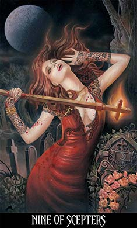
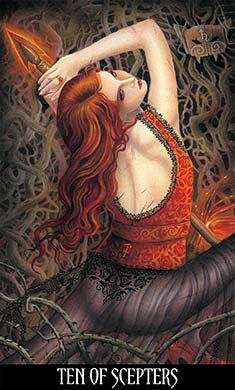
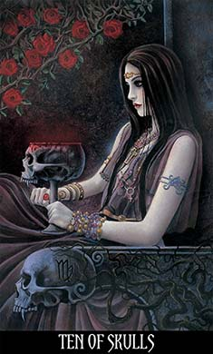

<!DOCTYPE html>
<html lang="en">
<head>
<title>Phantasmagoria - The Tarot of Vampyres</title>
<meta http-equiv="content-type" content="text/html; charset=utf-8" />
</head>
<body style="background-color: LightGray">

&nbsp; 

<!--PAGE-BREAK-->

&nbsp; 

<h2>Phantasmagoria</h2>

 &nbsp; 

<h3>The Tarot of Vampyres</h3>

&nbsp; 

&nbsp; 

<h4>Ian Daniels</h4>

<!--PAGE-BREAK-->

&nbsp; 

Copyright © 2010 by Ian Daniels. All rights reserved. No part of this book may be reproduced, stored in a retrieval system, or transmitted in any form or by any means without the prior written permission of the publisher.

<!--PAGE-BREAK-->

&nbsp; 

&nbsp; 

<i>For John</i>

<i>The Eternal Dreamer</i>

&nbsp; 

&nbsp; 

<!--PAGE-BREAK-->

<h2 id="TOC">Contents</h2>

&nbsp; 

<h3><a href="#Vampyre">The Vampyre</a> 
<i>Preface</i></h3>

&nbsp; 

<h3><a href="#Phantasmagoria">Phantasmagoria</a> 
<i>Introduction &amp; Background</i></h3>

<a href="#Gathering">I. The Gathering</a>

<a href="#Phantoms">II. A Theatre of Phantoms</a>

<a href="#Hunger">III. The Hunger</a>

<a href="#Rose">IV. The Blood Rose</a>

<a href="#Darkness">V. Darkness</a>

<a href="#Tarot">VI. The Tarot of Vampyres</a>

&nbsp; 

<h3><a href="#Alchemy">Alchemy</a> 
<i>About the cards</i></h3>

<a href="#Secrets">I. The Secrets</a>

<a href="#Petals">II. Crimson Petals</a>

<a href="#Courts">III. Courts of the Vampyre</a>

<a href="#Tree">IV. The Tree of Life</a>

&nbsp; 

<h3><a href="#Awakening">The Awakening</a> 
<i>Using the cards</i></h3>

<a href="#Oracle">I. The Oracle</a>

<a href="#Enchantments">II. Enchantments</a>

<a href="#Mirage">III. Mirage and Imagination</a>

<a href="#Kith">IV. Kith and Kin</a>

&nbsp; 

<h3><a href="#Cards">The Cards</a> 
<i>Analysis &amp; symbolism of the cards</i></h3>

<a href="#Major">I. The Major Arcana</a>

<a href="#Scepters">II. Scepters</a>

<a href="#Grails">III. Grails</a>

<a href="#Knives">IV. Knives</a>

<a href="#Skulls">V. Skulls</a>

<h3><a href="#Acknowledgments">Acknowledgments</a></h3>

<!--PAGE-BREAK-->

&nbsp; 

<h2 id="Vampyre">The Vampyre 
<i>Preface by Dr Bob Curran</i></h2>

<i>Wrap thy form in a mantle gray, 
Star-inwrought! 
Blind with thine hair the eyes of day; 
Kiss her until she be wearied out, 
Then wander o'er city, and sea, and land, 
Touching all with thine opiate wand-- 
Come, long-sought! 
When I arose and saw the dawn, 
I sighed for thee; 
When light rode high, and the dew was gone, 
And noon lay heavy on flower and tree, 
And the weary day turned to his rest, 
Lingering like an unloved guest, 
I sighed for thee.</i>

Percy Bysshe Shelley, <i>To Night</i>

&nbsp; 

The Vampyre, it seems, has been with us since earliest times, lying somewhere at the back of the human mind and emerging, in various forms and guises, when we least expect it. Some of the perception undoubtedly rises from our ancestors’ fear of the dead. Our forebears often equated the vampyre with the walking corpse, risen from the grave often at night, which wandered about doing harm to communities. For instance, it sometimes attacked or ravaged those who lay asleep; it broke into houses, stealing food or it spread disease and pestilence through towns and villages. Vampyrism was often the result of sin or neglect – the violent man; the woman of loose morals, the scold; those who had not been buried according to proper religious ritual all ran the risk of becoming vampyres after death and in many cases continued their sinful ways after they had been placed in the grave.

As, in many folkloric beliefs, the Vampyre only appeared at night, it often became confused with other night terrors. Horrors such as the Incubus and Succubus who copulated with sleepers as they lay at rest; Lamiae who often attacked sleeping children and Mara, who plagued sleepers with nightmares, all added their distinctive contributions to the historic figure of the vampyre as the years went by. Vampyres were now figures of evil and danger in the popular mind – minions of the Night and the Devil – whose sole purpose was to do harm to the living and to prolong their own dark lives.

Throughout the 1700s and early 1800s, there were a number of reported vampyre cases in parts of Germany and in Eastern Europe which became widely publicized, as well as the subject of intellectual debate and writing. This made Eastern Europe – then a mysterious land of forests, mountains and remote villages – the spiritual “home” of the vampyre, which it still remains today. This is not strictly correct, for the idea of the vampyre either as one of the walking dead or as a witch or wizard, exists in many cultures all across the world. The shadowy lands of Eastern Europe, however, with their isolation, legends and folklore appealed to many minds in the West and turned lands like Transylvania and Moldavia into “nurseries of the Undead”

The upheaval in these territories, as the forces of Christianity battled against the spreading influence of Islam, as embodied in the Turkish Empire, may also have contributed to the idea. In times of social dislocation and desolation – such as that caused by minor wars in Eastern Europe – people often turn towards religion, folklore and superstition as a means of dealing with the problems they face. It may be that the alleged rise in the instances of vampyrism such as the reported cases of Arnold Paole, Peter Plogojowitz or the unnamed shoemaker in Silesia simply reflected the social anxiety of the time. Nevertheless, they gave a geographical context to at least some of the vampyre belief.

It was, however, an Irishman who was to set the template for the way in which we perceive the vampyre today. Although Abraham &lt;Bram&gt; Stoker was not the first to write a novel centered on the concept of the Vampyre. That dubious honour is usually accorded to Dr. John Polidori, Lord Bryon’s physician who, whilst holidaying with his employer at Lake Geneva in Switzerland, is said to have written the novel <i>The Vampyre</i>, which was published almost eighty years before Stoker’s work. It did serve to establish the image of the Undead in the social mind. The novel <i>Dracula</i> &lt;named after a famous voivode or warlord of the principality of Wallachia in 15th century Eastern Europe&gt; is still widely regarded as a masterpiece of literature and is the only book, apart from the Bible, never to have been out of print since it was published in 1897. At the time of publication, it was one of the most successful books ever. The reason for such success may be that it captured the mood and many of the social issues of the time. Like Lord Ruthven, in Polidori’s <i>The Vampyre,</i> the protagonist &lt;in this case Count Dracula&gt; is a member of the nobility and the novel emerged at a time when the gap between rich and poor was beginning to widen in many Western European countries, certainly in England. But there were other questions too – the ownership of land for example &lt;a common problem in Stoker’s own Ireland – remember that Dracula must sleep in his <i>native</i> soil&gt;; the growing emancipation of women and the rise of the Americas as a global power. Although not wholly nor explicitly stated, these issues underpin the novel and cause it to resonate in the social psyche. Although Stoker was to write a number of other books and short stories, he was never quite able to achieve the literary mastery he demonstrated in the pages of <i>Dracula.</i> The book would echo down the years, spawning many other lesser works and many films in its wake. It would also serve to establish a mental picture of the vampyre – that of a lofty aristocrat who is both soulless and merciless, with an insatiable hunger for blood.

The idea of the vampyre drinking human blood is a relatively recent addition and has largely emerged from West European culture. Blood has a great significance in human society – it is the very embodiment of life and “blood offerings” were often given in early societies as a tribute to the gods. Not only this, but in Christian belief it has assumed a paramount status – “Washed in the blood” or “the Blood of the Lamb” being frequent phrases in religious circles. The image of a bleeding Christ is one of the most potent icons of Christian worship. It was also a symbol of grief and submission. At the funeral of the 5th century Hun warlord, Attila, for instance, his followers had to be specifically retrained from deliberately slitting the veins in their arms as a mark of mourning. It is not surprising therefore that blood has become associated in Western tradition with the Undead and with animating lifeless cadavers to a semblance of life – the very basis of the Vampyre. In other cultures, however, the creature drinks other things – human semen and sweat for example – only drinking blood as a last resort. Nor does the vampyre always use its incisors in order to drink from the jugular vein. The biting of the jugular vein as portrayed in books and films is virtually impossible since the victim would unquestionably bleed to death in vast pools of blood. However, the image of the dreadful “kiss” on the nape of the neck contains enough erotic imagery to stimulate the senses and imaginations of believers. This of course, in yet another element of the vampyre figure.

Indeed, the image of the vampyre is both a complex and contradictory one. Not only is it the embodiment of our worst fears and concerns – the fear of the walking corpse; the spreading of pestilence; the issues of land and our relationship with the aristocracy – it also psychologically depicts our hopes and aspirations as well. Over the years, the idea of the vampyre has come to address two of the most basic desires of the human psyche – the desire for immortality and the need for sexual love.

Consider the image – the handsome man or the beautiful woman who stayed forever young and attractive, uncorrupted by death or decay, immune to the worst effects of time and the world. Surely, this is an underlying human hope and desire which lies within us all. It has formed the basis of many vampyre stories as well as that other masterpiece of supernatural literature – Oscar Wilde’s <i>Picture of Dorian Gray.</i> The idea of the ageless, beautiful individual as portrayed by the vampyre or Dorian Gray appeals to something deep within the human ideal which is why the image has remained such an enduring one across the years.

Concomitant with this &lt;and related to it&gt; is the image of unending sexuality and unbridled sexual appetite. In most imagery, the vampyre remains young and attractive and may well be sexually active in its ways. This may hold echoes of the incubus or succubus of ancient Greek and Roman myth and with which the vampyre was sometimes confused. It may also have something to do with some forms of Far Eastern vampyre which drinks human semen rather than blood. The vampyre therefore is sometimes portrayed as a languid figure, living from sexual encounter to sexual encounter throughout its long and endless days. It is a predator, preferring the dark and only venturing out to attack young men or young women as they sleep in the style of the early night terrors. Even the imagery which surrounds the central figure in tinged with sexuality – the erotic nipping kiss on the nape of the neck &lt;reminiscent of the “love-bite”&gt;; the mesmerizing and smouldering stares, even the shape of the stake which is used to destroy the creature by being plunged into it &lt;reminiscent of an erect phallus&gt; all contribute to this overall perception. In fact, so strong was this image at one time that during the 1920s and 30s, the term “vamp” &lt;sort for vampyre&gt; was often used for a sensuous woman who lured men away from the “straight and narrow”. Vamp became a euphemism for a “loose or sexually promiscuous woman”. The vampyre is, therefore, perceived to be a creature which is driven by its own desires and lusts and which is not restrained in any way. It is the sexual “outsider”, the undying hunter which has existed since earliest times.

More recently, the vampyre has taken on new and more modern guises to meet with the changing times. Its home has largely shifted from Eastern Europe to America, although some of the antique imagery still surrounds it. Its home is in old and exotic cities – New Orleans, Charleston – which have a sense of history about them. But even that idea has begun to diversity to suit filmic tastes. Vampyres might now be found in the New Mexican desert or in heaving cities like Los Angeles or San Francisco. It has sometimes become more “hi-tech” and often uses whatever wealth it has accumulated across the years to create specific technological environments for itself. The notion of the “vampyre” is rapidly becoming synonymous with big business which is allegedly “bleeding” the wealth from those who are perhaps not as capable or fortunate. In other perceptions, it embodies the free spirit, acting and interacting in the world without inhibition – and has been translated both into rock music and into the Gothic movement of style and fashion amongst the young. It is, in some ways, becoming the very embodiment of modern life and society. The concept is very far from dead.

What lies in store for the vampyre – the cold and endless infinity of outer space? Some form of even stranger techno-future? Already it is starting to appear as a figure in numerous computer games, so does its future lie in some virtual reality? Whatever the coming days may hold for the vampyre we can rest assured that the concept will not go away. Vampyres will undoubtedly lie deep within our psyche for as long as Mankind endures. The spectre of the dark, Undead blood-drinker will continue to terrify and excite us far beyond tomorrow. The Vampyre, it would seem, is with us forever – in fact it is a fundamental <i>part</i> of ourselves.

<!--PAGE-BREAK-->

&nbsp; 

<h2 id="Phantasmagoria">Phantasmagoria 
<i>Introduction &amp; Background</i></h2>

<i>'That is not dead which can eternal lie 
And with strange aeons even death may die.'</i>

H.P. Lovecraft ~ <i>The Necronomicon</i>

&nbsp; 

<!--PAGE-BREAK-->

<h3 id="Gathering" style="text-align:center;">The Gathering</h3>

Lightening slashed violently, shredding the black sky. Thunder raged and roared; blasting the dark mountains. Wild winds whipped the surface of the lake into a frenzy, and the rains lashed like a phantom - savage, ruthless and bitter.

It was indeed a 'dark and stormy night' when a gathering of English Literati agreed to each write a tale of supernatural horror. The group had gathered in the summer of 1861 at Villa Diotati, close to Lake Geneva. As the storm thrashed outside, Lord Byron, Mary Shelley, Dr. John Polidori, Percy Shelley and Claire Clairmont recited haunting poetry and ghost stories. It was not only the blood curdling wail of the night that chilled the blood and set fevered hearts pounding. The stories they recited came from a book, originally written in German, that had recently been translated into French. This book was called <i>Fantasmagoriana</i>, and because of this gathering of writers and poets it has a significant place in the history of English literature. The collection had its origin in Gespensterbuch (lit. &quot;ghost book&quot;): a five-volume anthology of German ghost stories.

Over the coming nights the writers set about creating their tales of gothic terror, the most famous of which became Mary Shelley's <i>Frankenstein</i>, her imagination fired by a nightmare in which a 'pale student of unhallowed arts created the awful phantom of a man'. A lesser known story was penned by John William Polidori entitled, <i>The Vampyre</i>, which is arguably the progenitor of the romantic vampyre genre in English literature.

The original anthology of Gespensterbuch was published in Leipzig between 1811 and 1815. The stories were compiled by Friedrich August Schulze (1770-1849), under the pen name Friedrich Laun, and Johann August Apel (1771-1816). A selection of short stories from the first two volumes received a French language translation by Jean Baptiste Benoit Eyries (1767-1846) and was published in Paris during 1812. The full French title was <i>Fantasmagoriana, ou Recueil d'Histoires d'Apparitions de Spectres, Revenans, Fantomes, etc.; traduit de l'allemand, par un Amateur.</i>

The title is derived from Étienne-Gaspard Robert's 'Phantasmagoria'. Robert was one of the original and most elaborate masters of a theatrical phenomenon known as the Phantasmagoria. It was a type of Magic Lantern show where silhouetted puppets acted out macabre dramas which were projected to audiences via the lantern. His presentations of the lantern were ingenious theatrical productions designed and performed to terrify the audiences. Murderous shadows and nightmarish apparitions would appear from nowhere and literally scare patrons out their seats. This macabre entertainment created quite a stir in the closing years of the 18th century, both professionals and roaming showmen performed their sinister art with their magic lanterns. The Phantasmagoria shows were sometimes held in old monasteries and chapels to embellish the performance, as the dim and gloomy surroundings were ideal for spine-chilling dramatic effects.

Spectacular 'spirit-raising' performances involved a magic lantern mounted on a carriage that moved to and fro behind a translucent screen. A device linked to the wheels focused the lens automatically as the carriage moved. The audience, on the other side of the invisible screen, saw terrifying skeletons and other macabre figures apparently approaching as they grew larger, and then receding as they shrunk. Images were sometimes projected on smoke, from a lantern hidden in a coffin or waxed sheets were used to catch images from moving lanterns on wheels. These showmen created a macabre mirage from light and shadows, embellished by various cunning effects, where smoky rooms allowed images to materialize and drift in the air like phantoms.

<!--PAGE-BREAK-->

<h3 id="Phantoms" style="text-align:center;">A Theatre of Phantoms</h3>

Fear is usually regarded as a negative emotion; something to be avoided. It is an unwelcome guest, a dangerous or unwanted sensation. One psychological explanation for fear is that it is a defense mechanism, designed by nature to keep us safe. However, as a race, human beings seem to love to be scared. Even in childhood we find ourselves not only avoiding frightening sensations and situations, but often seeking them out. We are bewitched by tales of horror and hauntings. We like to be terrified. With dry mouths and blood pounding, we half want to turn away, yet glimpses of our nightmares are tantalizing. Perhaps we are seeking a deeper understanding of our fears, or of our part in the theatre of life and death. Perhaps we enjoy the adrenalin rush that floods our blood when we are afraid. From horror films, ghost-trains, lantern shows and theatre, and the telling of nightmarish tales, back through time to the rituals of our early ancestors whose shamans danced a frenzy for the black echoes of the forest - or as masquerade to the mystery of death, or as rites to the forest spirits, humanity has a deep connection and curiosity for all that is dark, mysterious and macabre.

It seems that experiencing fear in a safe environment, acknowledging our fears, facing them and recognizing them, helps us to understand ourselves at our secret depths and to overcome those fears or see them for the illusion that many of them are. We may dare ourselves to creep with dread into a haunted woodland or a fog shrouded graveyard; or trespass a witch's midnight garden. Perhaps the most traditional method of scaring ourselves is the retelling of horror stories, preferably huddled around a fireplace with a gale flailing and groaning outside.

Our interest in tales of horror and weirdness is perhaps a manifestation of the adventure impulse, curbed in most of us by physical circumstances. In particular, it ignites a desire - perhaps a deep-lying spiritual need - to transcend the common limitations of time and space. It can be argued that this craving is not a desire to escape from reality, but an impulse to penetrate the truths which lie beneath the surface of things; to grapple with, and to dominate, the mysteries of mortal existence. A liking for horror and eeriness could be dismissed as morbid or unhealthy, but it could be said that it is unwholesome to deny the existence of our own darker shadows, fears or primal desires - rather than understanding and incorporating them sensibly into ourselves as a balanced whole. These fears can then be under our control, rather than projected onto other people or onto those who stir our own fears about ourselves, whether that be their physical appearance or race, disability, or a variation from our own perception of what is normal. As a reaction of our own fears of not belonging ourselves, this sometimes reveals itself as irrational hatred, bullying or as illogical and delusional morality. This delusion is a kind of prison for us, because while these barricades hide us from our fears, they also confine us - and our potential - in our own projected castle of nightmares. How we feel about and perceive people, and the world around us becomes our reality. Our perception, when projected as a truth, becomes a self fulfilling prophecy which shapes the world around us to its image. The beliefs, characters and plots of our imagination act out their parts in our actual lives. These same fears can be projected onto the seemingly darker, wilder aspects of nature or the cycle of life and death, or indeed, anything outside of us that we see as different or as a threat to our concept self. Many of these fears of nature are part of our make-up, inherited from a time when danger lurked in the primal forests, in this sense they were, and still are, a valuable survival mechanism. Our task is to free ourselves from our prison of exaggerated fears by deepening our understanding, and widening our circles, to embrace creation in all its diversity, deepness and beauty.

While boundaries and beliefs are important in giving us a structured understanding and foundation for ourselves, we must not allow these to limit our vision and expansion. By being more amiable and open towards others - and situations - in our lives, we gain greater understanding of ourselves and receive back a sense of our own belonging. Feeling that we have a unique purpose, and belong to the greater scheme of things in nature, gives us deep inner peace. If our ultimate desire is pleasure and happiness then we should project these feelings around us; which in turn are reflected back. This is not to say that we should always give way to another's will, or to a situation - being fluid and far-sighted are also great skills for fulfilling our desires. Our power, passion and desire does not have to conflict with our compassion, embracing and understanding of others, we can contain both. Our power and love combined gives us a great strength, which is dynamic yet flexible, allowing our journey to be aided and enhanced by all around us.

Acknowledging our inner demons and fears is the first step towards overcoming them by allowing them to manifest and disperse naturally without damaging us. If we suppress them too much they keep presenting themselves, exaggerated or untamed. Unacknowledged fears tend to take on the darkest, most horrifying shape with which our subconscious can imbue them. Yet when we bring them out into the light of day, we suddenly realize that what we were so scared of might - 1. Never happen. 2. Not be as bad as we thought it would be when we feared it, or 3. We've probably got what it takes to deal with it anyway. Courage to face our fears, and see them for what they truly are can result in a spiritual breakthrough.

The Tarot of Vampyres is designed to play a similar role in exploring our own fears, as well as our hopes, passions and joys - incorporating the energies that make up all the elements of ourselves into a balanced whole. The cards represent different elements, emotions, and events that we encounter in life. The word Phantasmagoria is defined as '<i>A crowd or gathering of phantoms; A shifting series or succession of things seen, imagined, or as in a dream.',</i> which aptly describes both the workings of the cards and our own inner dynamics. Like a theatre where the different characters or energies play out their roles on the stage of our experiences. Like the silhouetted figures projected onto a screen from our own the Magic Lantern at our source. These shadows are not our true selves, at least they are not our whole selves and are forever changing, so they are not where our foundation lies. Instead they define our story by shaping the light that is our ultimate source, our true origin, to which we will return.

In psychology, the dark side of human nature is often described as the alter ego, the Id, or the lower self. The Swiss psychiatrist Carl Jung called it the ‘shadow’. By shadow he meant the hidden side of the personality, the sum total of all those unknown or unpleasant qualities that we would prefer to hide. We all have a shadow. The challenge is to meet it face-to-face, for unless we come to terms with our own 'dark' side, we’re condemned to be its victim. When, from time to time, our shadows impinge on awareness, they are often accompanied by strong emotions. As the shadow is a real substantial part of us, psychological work commences in the recognition, confrontation and withdrawal of shadow projections, until finally accepting the 'dark', unconscious side of our personalities. Jung believed that everything that is in our conscious awareness is in the light, but everything of substance which stands in the light – whether it is a gravestone or an idea – also casts a shadow, and that which stands in the darkness is outside our awareness.

As Jung saw it, the shadow is the part of the mind that is outside our awareness. He called this the personal unconscious or personal shadow. It includes the conditioned part of us that we acquire from our experiences in our childhood when that which is unacceptable, as determined by the adults around us, is cast into shadow. It may be sadness or sexual curiosity, or may be our dreams and desires. By definition, the nature of the shadow is to hide. It hides like a ghost, outside the boundaries of consciousness, but these ghosts contain messages from hidden parts of ourselves. Our mind is adept in using irrational fears to protect itself from unravelling unknown primal emotions and instincts. Poisonous shadows, bloody fangs and shrieking spectral nightmares are some of the fears that our conscious minds exaggerate and assign as protective armour that can stifle and imprison us in a knot of a self-identity. We become rooted in a fear of the 'other' - whether it be fear of others who seem different to us, unresolved psychological issues or fears about our place in the natural cycles of life, death, love and separation. This feeling of separation often fills us with terror. Much of the trouble stems from a fear of loss, or loss of control, and feelings of a loss of ourself when seen as part of a whole. In reality it is impossible to lose ourself - our True Self - we can only lose the things we use to identify ourselves. Loss of these things can be painful, but we cannot ever lose our own selfness and soul.

On a personal level, this fear of losing the self often reveals itself when we experience romantic love. Once this love possesses a person, they will do near anything to maintain the sense of it in order to maintain the belonging felt by a connection achieved within oneself. If that love is spurned, we often experience the disconnection as separation between ourselves and our spiritual belonging. In truth, it is only the separation of a relationship. We cannot lose our spiritual belonging, it is more a part of us than our own blood, but sometimes the people and things onto which we project that spiritual belonging are lost or misplaced. This is played out in the theatre of love and loss, but it is a reflection of a far deeper connection within ourselves - the connection between the soul and the consciousness, between our spiritual source of pure belonging and our seemingly isolated earthly existence. The Vampyre myth illustrates this idea with relish - both the fear and the ecstasy of surrender when merging with another in love, sexuality or in the exchange of blood, which blurs the boundaries between self and other, losing 'ourselves' beyond the confines of our selfness. On an inner level this symbolizes the surrendering of our ego into our original spiritual source or into the eerie realms of the unconscious. Our conscious mind resists such melting into oneness, for fear of losing our identity, while our unconscious longings hunger for release from the tight knot of the Ego, into a place of boundless love and belonging.

While many of our instinctive fears are beneficial to us as warnings of real danger, many are irrational perceptions or beliefs that we have gathered about us as protective barriers, and more still are inherited from our ancestors when the dark and mysterious was respected and consulted. Within our hidden realm is information about our own psyche which, if explored, contains valuable messages for us. The Shadow complex possesses qualities opposite to those manifested in the persona. It is the inferior part of the personality consisting of the qualities and traits of character one prefers to hide, those that are unadapted and awkward. Consequently, these two aspects of the personality complement and counterbalance each other; the shadow compensating for the pretensions of the persona, the persona compensating for the anti-social propensities of the shadow. However, the shadow is not strictly negative and it is simplistic to assume that it is simply bad. Positive traits too can be rejected and repressed because they are unacceptable within a social or family milieu. Our reality is an illusion of shadow and light; a theatre of phantoms and dreams - eternally shifting stories of wonder, shadows and beauty.

<!--PAGE-BREAK-->

<h3 id="Hunger" style="text-align:center;">The Hunger</h3>

Our spiritual hunger is a reflection of the Everlasting longing for us - an echo of divine desire which calls us back to itself; because the Everlasting is in love with all its creations. When I talk about the Everlasting I mean the Divine and Eternal - the Great Spirit which pervade, creates, loves, embraces and nurtures all life. This can be viewed in terms of God or Cosmic Essence, as Nature, Primal Chaos, Spiritual Origin or Mother Earth. At our deepest core we crave the divine light from which we felt separated when we came into our earthly existence, just as the Everlasting craves our return. This divinity is at the heart of the whole of nature, it is the center of all life and is the energy that binds everything into the eternal delights of creation. Its essence is one of infinite possibility, an eternal stream of over-flowing joy, creativity and newness. It is constantly vibrant in every cell of our bodies, as in all of nature - a vibrancy and vitality that unites all of creation to a common source of belonging. Although invisible to us, this divine light pulses like blood through all of creation, it is not bound by time or space, but is eternally reborn in every moment. The Vampyre myth reflects this deep desire to draw such life force into ourselves.

The human heart suffers from a hungry restlessness, in an evermore industrialized world that encroaches on our true habitat and natural balance. The detachment and alienation from our natural environment has left many feeling spiritually barren and isolated. A consumer mentality, with its craving for immediate gratification, self interest and personal greed has damaged our planet and our people. Societies have severed themselves from the rest of creation, and in so doing have obscured much of our connection to the source of the Everlasting, leaving their senses deadened to the spiritual and the natural, to replace them with material excess at the expense of others and of our planet. We seem to have lost our way in this magical, wondrous universe. We can have all the world has to offer in terms of status, achievement and possessions, yet without a true sense of belonging, our lives feel empty and pointless.

As well as a tales of gothic horror and romance, the Vampyre myth also illustrates an encounter with the higher self on a personal level, and its eternal promise of self-realization, the blossoming thorn, and the eventual curse turned to joy. The dormant, tomb-bound Vampyre can represent our earthly existence and our longing for spiritual awakening as we slumber. He is woken and rejuvenated by the inflow of untainted life blood, the abandoned, enraptured kiss, which returns him from the material plane - where we are too often restless and entombed - to the spirit reality of the world around us. Our view of the world as purely material is shaken apart by a realization that every atom in the universe is embedded with a deeper meaning, a divinity, that communicates with us directly and uniquely unfolds itself for us.

Our task is to awaken and to listen, to cast aside our redundant beliefs about ourselves, and to recognize that events and encounters appear in our everyday life from a divinity that is at the center of each one of us. While the structure of beliefs we have built around ourselves keeps us feeling safe and in control, our beliefs also limit our perception within their own boundaries. Our beliefs define our thoughts and then our feelings - which in turn are connected directly to that which manifests in our lives. By changing our beliefs, thoughts and feelings about ourselves and what is possible or impossible, we have the ability to shape reality. What we think we know about the world is often an illusion, at best it is a view contained within our current perimeters. By having the insight and courage to think differently, to develop an alternative belief, we can bring about the changes in our lives which we desire. We should have faith, and know that the life force within us is eternally in love with us - that the nurture of the Everlasting is unconditionally for our ultimate happiness. Then any anxiety and striving to control events would hinder us less, allowing the Everlasting to align events on our behalf.

The Vampyre myth also teaches us that times of hibernation and stillness are needed in order to regenerate and realign ourselves with the Everlasting which pervades all of nature, to empty our minds, and reconnect with the flow of that source. Also, how our earthly and spiritual natures are reflections of each other, and both have equal importance, as well as symbolizing that transformation from slumber is possible after a time of inner questing and questioning. The cycle of life, death, and rebirth is a central theme of Phantasmagoria - how the deepest winter is the beginning of an ascent into light and preparation for our return to our life source. We are born from this life source, manifest extensions of this light - it is not a quality outside of us that needs to be poached, it is not something we add to ourselves, but rather something that is obscured. Like folds of a ghostly shroud, it is our own shadows and the veils we create to defend and define our ego that conceal our true origin. The divine light is flowing through us regardless as to whether we recognize it or not. To flow with our source we must remove layers of self illusion, refining the gold that is our spiritual center. Too often we muddy the waters by frantically stirring to find answers at the bottom of the pool; when we surrender to stillness, the crystal waters naturally clear. The same is true when we sacrifice our logical and analytical mind to silence, in order to listen for the pulse that naturally guides us to the light and toward our ultimate well-being. In this respect the tarot cards are a wonderful tool to side-step our rational, self perspective view and allow our deeper, unconscious self to reveal truths through magical instinct, imagination and dreamscapes from seemingly random sequences of images. These truths, which would have been either unconnected or predujiced by the critical mind allow us scope for a wider understanding of a particular situation and greater freedom to explore it. When our deep-self, or our unconscious vibration is more closely in sequence with the flow of the Everlasting source we understand the essence of things clearer and how they relate to the whole.

<!--PAGE-BREAK-->

<h3 id="Rose" style="text-align:center;">The Blood Rose</h3>

On the reverse of the cards we find a red rose blossoming in briar stems. The rose is a symbol that has a rich and ancient history, often with meanings that seem paradoxical. It is at once a symbol of purity and a symbol of lust. Heavenly perfection and earthly passion; virginity and fertility; death and life. As a passive symbol the rose is associated with regeneration, fecundity, and love, while also bearing the active principles of energy, life blood and passion. The rose is the flower of the goddess Venus but also the blood of Adonis and of Christ. It is a symbol of transmutation - taking nourishment from the earth and transmuting it into the beautiful fragrant rose. That the flowers blossom by unfolding is symbolic of spiritual unfoldment. The rose has had a deep spiritual meaning throughout time, with a connection to both life and death, and a symbol of the mystic marriage of heaven and earth. The rose garden was a symbol of Paradise, while in ancient Rome roses were grown in the funerary gardens to symbolize resurrection.

The rose has also been used as a sign of silence and secrecy. The word 'sub rosa' (under the rose) referring to the demand for discretion whenever a rose was hung from the ceiling at a meeting. In the mythology roses were sacred to Isis, and are the flower of her son Harpocrates or younger Horus, the god of silence. The thorns have represented suffering and sacrifice as well as the sins of the fall from Paradise.

These diverse and interwoven concepts are appropriate emblems for the Vampyre myth. Its central theme here is as a symbol of our unique life force or spirit. Representing the four elements bound by a fifth element of 'spirit'. As the rose symbolizes blood - so blood symbolizes willpower and lust as fire, emotion and love as water, pure illumination of thought as air and displays its earthly element within its silent unfolding into manifestation. The blood rose represents all the elements of our being and all the energies. These make up not only ourselves, but the forces permeating all creation, from our earthly form to through different layers of our conscious being and our invisible subconscious reality. The petals can symbolize the different cosmic forces that are illustrated in the twenty two Major Arcana cards, whose interaction and union in various combinations give rise to all the other tarot cards. So in essence the blood rose is a representation of the complete wheel of the tarot unfolding. Seen on a personal level this is ultimately a representation of your own unique spirit and your personal energy. At the centre from which this rose unfurls is the limitless potential of the Everlasting - the unknowable, and the divine. It is the pure unformed energy from which we draw our life force and from where we can create new possibilities. It is the source from which all the petals have their beginnings. This centre is represented most clearly in the Fool card, which is the source and seed of all the other cards.

Related to this image is the symbol of the Adepts of the Rose-Croix, which displays a red rose on a cross. For them, the rose was the living and blooming symbol of the revelation and the harmonies of being. It was the emblem of beauty, life, love and pleasure. The cross represented the number four - the four elements as a structured form - while the rose represented the number five, Spirit. To fix the five of spirit onto the four of the physical world, and unite the Rose to the Cross, was the goal of high initiation. An alchemy also symbolized by the blood of the Grail

The cross symbolizes the meeting at right angles of horizontals and verticals Forces going in quite opposite directions but meeting at a central point, a common ground. It symbolizes the union of opposites and the dualism in nature as well as eternal life and the descent of Spirit into matter. It is the intersection of time and the eternal Everlasting 'Spirit'. The axis of the cycle of the year; whose spokes are the equinoxes and solstices - the crossroads where the four directions meet. In a Christian context the cross can signify acceptance of sacrifice, suffering, and death, as well as immortality. There is a legend that the cross of Christ was made out of wood from the Tree of Knowledge, the cause of the Fall, making it the instrument of redemption. In Egyptian myths the 'crux ansata' - a type of cross - was a symbol of life, immortality, and health, held by the gods and goddesses. It also represents the union of Isis and Osiris.

As we have seen, the rose represents the number five. This is because the wild rose has five petals, and the petals on roses are in multiples of five. Geometrically, the rose corresponds with the pentagram, which also represents spirit and the four elements. The number five being associated with the rose has linked them with the five senses and expanding awareness through the development of the senses.

This expanded awareness appears universally in cultures worldwide. It is regarded as the primordial life force itself, and is given different names; Qi or Chi in China, Ankh in Ancient Egypt, Prana in India, Pneuma in Ancient Greece, Arunquiltha by the Australian Aborigine, Mana in Polynesia and Orenda by the Iroquois. It has been called Magik, and even 'The Force', but its essentially the same concept, being associated with psychic ability, healing, martial arts and shaping events to ones own will and towards spiritual growth. In Taoism and other traditions circulation of this energy along pathways inside the body is produces improvements in health and life. There are many methods of circulating it - visualization, meditation, mantras and yoga are just a few techniques employed.

<!--PAGE-BREAK-->

<h3 id="Darkness" style="text-align:center;">Darkness</h3>

Scientific discoveries in 'Quantum Mechanics' means that the atom is no longer viewed as solid in terms of mass, but does have a solid appearance from the point of view of the electric field, perceived as vibrations. Years ago atoms were thought to be solid, indivisible particles which could not interpenetrate with other atoms, but mysticism still maintained that the subtle interpenetrating bodies made of 'matter from other planes', did exist. This would mean that there were atoms held together by some force other than the electromagnetic - these atoms would be invisible to our normal vision and could interpenetrate with visible atoms. They could interact with each other through their own respective binding force, much like visible atoms interact with visible atoms through their binding electromagnetic force. These invisible atoms, or 'dark matter', could be thought of as uncharged particles.

The recent scientific idea of 'dark matter' provides a new understanding of what mystics refer to as 'subtle matter' - so a compatibility between mysticism and science is quite real. If we are composed of subtle bodies made up from different types of subtle dark matter, and if we were capable of shifting our consciousness to these subtle bodies, then we would experience the world of that type of matter, much like mystical states of transcendence.

This would suggest that dark matter is just as 'real' as visible matter, just a subtler form of matter. This also suggests that we have a spirit or soul, and it is partly physical, even though it is a very fine, formless type of matter. Developing an awareness of these subtle energies helps us gather insights into the cards, perhaps more so than an intellectual approach. A more fluid awareness can help us live our lives with deeper understanding of our true nature and of our place in the universe. We will better understand the repercussions of our actions and decisions, on a personal, social and global level.

Through our common human perspective, a red rose exists after the seed that bore it. From this usual framework of belief, our thinking is structured in relation to time as a quantity. We think of the rose emerging from the seed, but could it be that they both exist at the same time spiritually? Otherwise, how would the seed know how and when to bring forth the rose, if it does not already hold the experience of the rose within itself? For the seed itself is not the beginning, but the fruit of the previous rose. This suggests that ourselves and our thoughts and ideas already have their beginning and end within themselves, making coincidences and correspondences, as well as dreams, symbolism and psychic experiences a scientific probability. This phenomena was termed 'Synchronicity' by the psychologist Carl Jung, an idea related to Swedenborg's Law of Correspondence.

In times past our ancestors were more concerned with the quality of time rather than thinking of time in terms of quantity. They believed that every moment or passage of time has a particular quality or essence, which effects and causes particular happenings and events. For them, each moment had less to do with an amount of time, and a great deal to do with the quintessential nature of any specific moment. This is why ancient peoples always carefully sought out the proper time for planting crops, hunting or beginning an undertaking. To enhance the effects of a particular essence of time they also evoked related spirits through prayer, ritual and the arts. Just as every rose seed contains a full-grown rose bush, the moment at which something is undertaken already contains the entire event, including its outcome. As this essence is of such subtle form it can also be directed and as the process unfolds. The tarot can be seen in a similar way as it is especially attuned to revealing the essence of a present moment or situation, and revealing it in a new light. The present moment is the energy center connecting past and future. The present is where it is possible to resolve situations from the past and set new paths for the future.

The quality of time and the deeper essence of things are so often forgotten in our everyday lives. Taking 30 minutes each day to still our minds, relax, breathe slowly and deeply, and create feelings of well-being will improve our understanding and bring us deeper feelings of well-being. As we grow to understand reality and nature in a truer, wider perception the events and imagery in our physical surroundings will appear in direct relation with our most accustomed feelings. If we think and feel happy and grateful for something we have, or imagine something we would desire with delightful anticipation, then these things will be attracted to us. What we believe to be true and what we think we know are the 'truths' that become real in our lives. By changing our 'truths' and altering our thoughts and feelings we will grow in our self knowledge, giving our lives greater meaning and peace while attracting our deepest desires into our sphere of being. Whatever personal truths we hold can only be our personal myths and not the whole truth, as they are projected from our own perspective and experiences. One of the valuable mechanisms of the tarot is to present us with alternative possibilities to ponder.

Mystical thought often views the spiritual and physical not as separate but as a series of layers, or dimensions, each less subtle - until descended into matter as we normally perceive it. These varying ethereal substances could include thoughts, feelings, dreams, auras, the subconscious, spirit, the collective unconscious, ghost or any spiritual dimension outside of our consciousness. The Tree of Life metaphor within many cultures represents a sort of map of these ethereal dimensions as understood by the ancients.

In our physical body there is ethereal matter as well as the solid matter which is visible to us. This energy follows our thoughts and so effects the subtle bodies - our thoughts become feelings that can be harnessed through imagination, meditation, ritual, stimulation and the chakras. The ancients had a system of knowledge which accommodated the world we can see with matter not visible to our ordinary vision. To them subtle 'dark matter' was as much a part of their world as visible matter, and they lived accordingly. They were aware of numerous subtle bodies and prepared well for the life they would live after death. This was paramount to their thinking, how they lived, and how they died. They knew that there were ways to affect the subtle matter through meaningful actions, employing particular spiritual correspondences and ritual.

Each time we think or feel, we effect the subtle matter within us. A thought or feeling is a vibration in the matter, set into motion within our spirit, and eventually affects matter of the same degree of density in the world around us. Before this thought can be effective on the physical plane it has to be transferred from that creative, spiritual realm (the seed) into the ethereal realm of feelings (the womb) which causes it to affect the web of subtle matter through vibrations (conception). This stimulates the subtle matter - which is the ever forming blueprint for things emerging into solid matter - by causing sympathetic vibrations in it and therefore affecting its development into denser physical matter (birth). This process brings about the desired influence of the original seed, even at a distance. The four elements of the suits and the court cards represent the four stages of this process. Drawing into ourselves and then conducting these inner energies toward our well-being and desires is a central concept within the Tarot of Vampyres.

The Seed - Fire - The Scepter - The Lord 
The Womb - Water - The Grail - The Queen 
The Conception - Air - The Knife - The Prince 
The Birth - Earth - The Skull - The Daughter

<!--PAGE-BREAK-->

<h3 id="Tarot" style="text-align:center;">The Tarot of Vampyres</h3>

The Tarot of Vampyres applies symbolism from the Vampyre myth to illustrate the meanings of traditional tarot cards. Such imagery connects us to the deep wellsprings that the Vampyre myths explore; light and darkness, death, rebirth, love, passion and hunger are amongst the themes enacted. Our fears of loss and need for belonging, are played out in these myths too, whether as a thirst for eternal intimacy or to reconcile and harmonize our relationship to the earth and with our own ancestry and destiny. The Tarot of Vampyres aim is to help us to peer behind the veils of our waking and dreaming realities into the deeper meaning behind our them. We can explore questions about our motives or feelings, or the interaction between our conscious and unconscious, between ourselves, others, and the world around us - on a material and spiritual level. We already contain all the elements represented in the cards as they are a picture of the composition of all life, from crows to skulls. By studying and working with the tarot we begin to build up a more accurate understanding of the workings of the universe, ourselves and other people, as well as recognizing our own unique place in the scheme of things. We interweave our thoughts and emotions with all around us through our memories, meanings and symbols. The symbolism of the cards reflect major symbolic themes from the Vampyre myths which are reflected in our own psychological makeup, allowing us to empathize, contemplate and translate these themes within the security of our gothic imagination. Reading the cards should, above all, be fun and enchanting. The key to working with the Tarot of Vampyres is to play with them in a sense of wonder; and a belief in our own creative imagination.

The names of the court cards vary from traditional titles but contain the same meanings. Here the traditional Kings are named Lords, while Queens remain the same. Knights are named Princes and the traditional Pages or Princesses are here called Daughters. The suits in the Tarot of Vampyres may differ from others you may recognize, but again their symbolism retains traditional meanings. The fire suit is represented here by Scepters, which are most often known as Wands, the cross of the Ace highlighting the theme of facing our phantoms, which like the vampyric defiance of the cross, is an assertive but courageous act, leading to victory. This suit illustrates will power, spirit and positive energy. Cups are here called Grails because of their association with blood, while corresponding to the element of water and the realm of emotions. Swords (Air) and Disks or Pentacles (Earth) become Knives and Skulls respectively. Knives refers to our thoughts and the power of the mind, sharp and piercing like the vampyre's fang, here the suit also takes on a ritualistic tone. Skulls represent the traditional Pentacles - also known as Disks or Coins - as symbols of earth they embody physicality, the visible natural world, structure and foundation, work, wealth, sensation and matters of the body.

The Tarot is our wheel of Phantoms, by this I mean it is a complete circle containing all the different qualities, moods, and spirits - each with its particular ambiance. These qualities are part of our make up in various degrees, we often experience many of them at the same time and can move from feelings of sorrow, to being analytical, to fanciful or wistful, to forceful in a single day. These essences become more potent the more we engage with them, for example, when we are feeling sad the more we think about being sad, and the sadder we become. These same essences shape all of nature, beginning as subtle energies, like thoughts, they can deepen and materialize into evolving layers. While each can have a positive or negative effect, none are 'good' or 'bad' in the normal sense, as our view is based on our own perspective at any given time. A seemingly negative feeling, or the learning of a difficult lesson are often the process to growth and understanding, and our ultimate happiness. The journey of our lives may have many obstacles but overcoming these obstacles give birth to greater understanding through experience.

<!--PAGE-BREAK-->

&nbsp; 

<h2 id="Alchemy">Alchemy 
<i>About the Cards</i></h2>

<i>'Holy wisdom is not light and thin like water, but dark and thick like blood'</i>

C. S. Lewis ~ <i>Till we have faces</i>

&nbsp; 

<!--PAGE-BREAK-->

<h3 id="Secrets" style="text-align:center;">The Secrets</h3>

Tarot is a card game that has been passed down through human history, developing out of our search for meaning in our lives. It encompasses many shared truths and symbolisms. In earlier times it was probably in wide spread use as an oracle, especially within circles of mystical seekers of wisdom. Tarot card imagery, and the names themselves are intertwined with the wisdom of many civilizations, containing insights from a variety of sources - Egyptian, Jewish, Pagan, European Mysticism, Chinese and Indian are just a few. These in turn perhaps derived from more ancient beginnings relating to shamanism and distant spirituality, primal myths and story telling.

The historical origin of Tarot cards is shrouded in darkness, but they seem to have certainly appeared in Europe during the fourteenth century. Early accounts of the cards are mentioned by Brother Johannes of Basel in 1377. A deck of Tarot cards by King Charles VI in Paris in 1393 was called the Marseille Deck. It is thought that their use was employed before that date, whether unrecorded or in secret. Since about 1600 the Tarot has been comprised in essentially the form that we know today.

.The Tarot deck is a set of 78 cards consisting of the 22 Major Arcana cards and 56 Minor Arcana, or suit cards. The word Arcana is from the word 'Arcane'; meaning Secrets, Mysteries, or that which is hidden, possibly because it brings secrets out into the open where they can be revealed consciously, and understood more clearly. The tarot has been termed the universal key to understanding life.

The Minor Arcana are divided into four suits, represented in Phantasmagoria as scepters, grails, knives and skulls, equivalent to the more common wands, cups, swords, pentacles. The suits represent the qualities of the elements of fire, water, air and earth, respectively. Each card has an interpretation associated with its element and its numerical value, as well as astrological correspondences. The cards within these suits are numbered one (the aces) through 10 and also include the court cards - the Lords, Queen, Princes and Daughters. The Minor Arcana cards represent the more minor, practical daily ups and downs that we encounter in life.

<u>Scepters</u> are associated with the element of fire. They are also associated with energy, action, passion, creativity, willpower, spirituality and enterprise. They can be glorious, blazing and warm or explosive and lustful. In astrology they are attached to the fire signs, the assertive Aries, dazzling Leo and enthusiastic Sagittarius.

<u>Grails</u> are about the emotions, feelings, relationships, the subconscious, intuition, and psychic awareness. This suit is associated with the element of water, and like water, the energy can be tranquil and dreamy or stormy and chaotic. Astrologically they are linked to the water signs, nourishing like Cancer, deep and purifying like Scorpio and intuitive like Pisces.

<u>Knives</u> symbolize mental activity, thoughts, the intellect, rational thinking, the will and decision making. Varying from peace and understanding to mental conflict and struggle and intellectual pursuit, as much of the unrest in our lives can be attributed to our thoughts. Astrologically they are connected to the air signs. Libra's balance and adjustment, the diversity, dreams and hopes of Aquarius and Gemini's intellectual awakening.

<u>Skulls</u> are the traditional Pentacles or disks, associated with the physical, matter, structure, craft, work, money and the home, and the physical body. This can range from good business and management, comfort and security to stubbornness, obstacles or physical hardships. Pentacles are associated with the earth element and astrologically to the earth signs. Capricorn's prowess and cunning, Taurean proficiency and love of home and Virgo skills and fruitfulness.

The 22 Major Arcana can be associated with a fifth element, Spirit, the upper point of a pentagram which oversees, influences and controls the flow of the other 4 elements. Each Major Arcana card is in essence a divine energy or vibration, a spirit largely outside of our understanding, possessing its specific universe, each an aspect of the supreme reality. They represent great principles, concepts, and spiritual perceptions, which characterize powerful, long-term energy or big events in areas of our lives, as well as spiritual forces at work. These tend to be exalted archetypal allegories acting as a mirror that reflects hidden aspects of our own unique awareness. These cards actualize the Higher parts of our consciousness and have been linked to the 22 Letters of the Hebrew Alphabet, the paths of the Tree of Life, the Runes, the I-Ching, as well as the archetypes proposed by Carl Jung. They also represent our personal journey in life, starting with the questing beginnings of the Fool and completing the circle through to The World card, eternally re-birthing.

<!--PAGE-BREAK-->

<h3 id="Petals" style="text-align:center;">Crimson Petals</h3>

The twenty two Major Arcana cards are divided into three types. The Fool, The Hanged Man and Judgement are the Elemental Trumps, these personify the qualities of the three mother letters of the Hebrew alphabet. Next we have the seven Planetary Trumps, representing the planets and the double letters in Hebrew, and lastly the remaining twelve signify signs of the Zodiac, known as Zodiacal Trumps connected to the Simple letters in the Hebrew alphabet. Each of the Major Arcana also have subtle influences from various planets which are noted under the card meanings. In a very real way the Majors could be viewed as each containing a set of 56 Minor cards, each one displaying characteristics of the essence of the Major card, especially when interpreted together. A number of varying systems exist, but you can use whichever you prefer. The following shows the individual card type and ruler along with the Hebrew letter it personifies in qualities and powers.

The Fool - Elemental Trump of Air - Aleph (Ox) 
The Magician - Planetary Trump of Mercury - Beth (House) 
The Priestess - Planetary Trump of the Moon - Gimel (Camel) 
The Empress - Planetary Trump of Venus - Daleth (Door) 
The Emperor - Zodiacal Trump of Aries - Tzaddi (Fish hook) 
The Hierophant - Zodiacal Trump of Taurus - Vau (Nail) 
The Lovers - Zodiacal Trump of Gemini - Zain (Sword) 
Chariot - Zodiacal Trump of Cancer - Cheth (Fence) 
Justice - Zodiacal Trump of Libra - Lamed (Ox Goad) 
The Hermit - Zodiacal Trump of Virgo - Yod (Hand) 
Fortune - Planetary Trump of Jupiter - Kaph (Palm of hand) 
Strength - Zodiacal Trump of Leo - Teth (Serpent) 
The Hanged Man - Elemental Trump of Water - Mem (Water) 
Death - Zodiacal Trump of Scorpio - Nun (Fish) 
Temperance - Zodiacal Trump of Sagittarius - Samekh (Foundation) 
The Devil - Zodiacal Trump of Capricorn - Ayin (Eye) 
The Tower - Planetary Trump of Mars - Peh (Mouth) 
The Star - Zodiacal Trump of Aquarius - Heh (Window) 
The Moon - Zodiacal Trump of Pisces - Qoph (Back of the Head) 
The Sun - Planetary Trump of the Sun - Resh (Head) 
Judgment - Elemental Trump of Fire - Shin (Tooth) 
The World - Planetary Trump of Saturn and Elemental Trump of Earth - Tau (Cross)

We can now take a look at the Minor Arcana, which consists of the remaining 56 cards, including the aces, numbered suit cards and the 16 court cards. The aces are the seeds of each of the suits, containing within themselves all the essences of the other cards in its suit, while still un-manifest in material form. They are the beginnings of the thoughts of their element in the same way that The Fool holds the potential for the other Major Arcana cards. The aces are the spirits of the numbered elemental suit cards.

These suit cards, numbered 2 through to 10, express different forms of their associated element, each number emerging from the previous into greater material manifestation, as illustrated on the Tree of Life (see below), until all the qualities from each number settles into material form in the tens. The climax of the elements represented in the tens sets into motion the rebirth of a new cycle, returning again to the aces and starting again with the twos. Each of the numbers actualize the element in a specific way, exerting different qualities and attributes upon them, as listed here -

Ace - Essence, beginnings, unity, creation, gifts and willpower. The Crown. 
2 - Energy, polarity, balance, harmony, cooperation, duality, choices and wisdom. 
3 - Development, growth, synthesis, nurture, expression, abundance, creativity and understanding. 
4 - Structure, order, stability, organization, foundation and work, measurement and mercy. 
5 - Force, activity, motion, change, progress, conflict, adjustment, courage and strength. 
6 - Equilibrium, reconciliation, fullness, centered, truth, wholeness, peace and beauty. 
7 - Absorption, passivity, reflection, spiritualization, inner workings, illusions, integration, and victory. 
8 - Rhythm, Change, communication, cycles, giving and receiving, enchantment and splendor. 
9 - Crystallization, the subconscious, invisible structure, collective unconscious, transition and foundation. 
10 - Manifestation, transformation, completion, fulfilment, endings, beginnings. The Kingdom.

So each numbered minor card combines its elemental suit quality with its numerical meaning, giving us a good idea of the card indication. For example, Two of Grails can signify harmony and duality in the area of emotions - expressive of love, or representative of the polarity of intuitions or the cooperation of our subconscious, depending on the question and the other cards revealed in the spread.

The alchemy of the Minor cards is further understood when we also incorporate their astrological aspects. As we have seen, 12 of the Major Arcana cards are Zodiacal Trumps, representing the 12 astrological star signs, comprising of Cardinal, Fixed and Mutable signs for each of the 4 elements. In the Minor Arcana 2, 3 and 4's express the Cardinal qualities, being the element in its most direct, untainted, dynamic and most potent state. The Fixed signs are embodied in the 5's, the 6's and 7's, expressing its element in a steadfast, stable and resolved form, while 8's, 9's and 10's convey them in an unstable and changeable, yet adaptable and accommodating form.

Aries (The Emperor) - Cardinal Fire - 2, 3 and 4 of Scepters 
Taurus (The Hierophant) - Fixed Earth - 5, 6 and 7 of Skulls 
Gemini (The Lovers) - Mutable Air - 8, 9 and 10 of Knives 
Cancer (The Chariot) - Cardinal Water - 2, 3 and 4 of Grails 
Leo (Strength) - Fixed Fire - 5, 6 and 7 of Scepters 
Virgo (The Hermit) - Mutable Earth - 8, 9 and 10 of Skulls 
Libra (Justice) - Cardinal Air - 2, 3 and 4 of Knives 
Scorpio (Death) - Fixed Water - 5, 6 and 7 of Grails 
Sagittarius (Temperance) - Mutable Fire - 8, 9 and 10 of Scepters 
Capricorn (The Devil) - Cardinal Earth - 2, 3 and 4 of Skulls 
Aquarius (The Star) - Fixed Air - 5, 6 and 7 of Knives 
Pisces (The Moon) - Mutable Water - 8, 9 and 10 of Grails

Each of the Minor Arcana numbered cards is also influenced by one of the seven planets, which are assigned to them in the repeating cycle of Mars, Sol, Venus, Mercury, Luna , Saturn and Jupiter in the order they are given above. Therefore the 2 of Scepters represents Mars in Aries, 3 and 4 of Scepters as Sol and Venus in Aries respectively and 5 of Skulls as Mercury in Taurus, 6 of Skulls expresses Luna in Taurus and so forth. These attributions are included for each of the Minor cards under their descriptions.<i></i>

<!--PAGE-BREAK-->

<h3 id="Courts" style="text-align:center;">Courts of the Vampyre</h3>

The sixteen Court cards often represent particular people or personalities in our lives, and can be viewed as personality types. As well as indicators of particular astrological characteristic determined by our birth date (see <i>Kith and Kin</i>), the court cards have also been identified with the sixteen personality types as defined in Jungian psychology. They can be thought of as different archetype characters, whether in story and myth or as personalities such as the dreamer, the warrior, the lover, the trickster, the loner or the scientist, etc.

The elements represented by the four suits are further divided into sub-elements in the court cards. The Lords being Fire, Queens being Water; while the Princes characterize the element of Air and Daughters that of Earth. Here we see how we arrive at sixteen sub-elements depicted in the sixteen court cards - the element of each suit having aspects of all four elements, the Queen of Skulls for example represents the watery aspect of Earth, while the Lord of Knives represents the fiery aspect of air, and so forth.

As personality types the Court Cards can depict people in our lives, as well as aspects of ourselves. The Lord of Skulls, for example, may represent a creative but down to earth person, a figure in our lives who helps us maintain stability and encourages us to be more productive. Or the card can identify a time in our lives where we feel or need those qualities within ourselves. The Court Card can embody a message, experience or situation related to the reading or can correspond to an expression or quality within ourselves. When a Court Card appears in a reading, it signifies that its characteristics or qualities are related to the situation or question asked. This may mean that the type of energy described is present in the situation or that we should employ the energy ourselves. If in a Shadow aspect, it means that these energies are conflicting with us, that we lack the energies described, or that the Shadow qualities are related to the issue or situation.

<u>The Lords</u>

The Lords represent the active, bold and dynamic aspect of their element. They are the original, most sublime energy of their suit element, being both forceful and transient. In the process of creation, whether in terms of universal natural laws or that of any act of creation which brings something into material form, the Lords are the Spirit, the first spark of conception or inspiration. They signify qualities of creative energy, innovation, intuition and fiery conception. Lords represent the creative urge - choosing the seeds to plant. They characterize a person of great self-confidence or creative dynamic.

<u>The Queens</u>

As the Queens embody the watery element of their suit, they are concerned with the emotions. They are the complements of the Lords, being receptive to the original active energy of their Lord. The Queens give grounding to the seed of the Lord's energy, fermenting and transmitting it, as the second process in the act of material realization. They identify with the watery aspect of their suit, being passive, receptive, subconscious, reflective and nurturing, related to our feelings and our inner dream world. Queens represent taking the first step - planting the seeds. The court cards can represent particular people in our lives, and can be viewed as personality types. They can embody a message, experience or situation related to the reading or can correspond to an expression or quality within ourselves.

<u>The Princes</u>

The Princes constitute the third level of creation and, like the air suit of Knives, they stand for our intellect and conscious thoughts. They are the active combined energies of their Lord and Queen united, manifesting as a more constructed, intellectual form of their union, encompassing both of their qualities. Princes express the quality of their particular suit with extravagant motion. They are swift, creative, willful, intelligent, aspirational and constructive. As a symbol of the new life ignited from the union of fire and water, they contain the thought structures and workings which activate and structure material forms. The Prince also symbolizes our 'higher-self' which longs for union and integration with the our earthly existence represented by the Daughters. Princes represent the results of our planning taking shape - plants that sprout and grow.

<u>The Daughters</u>

The Daughters represent the earthy aspect of their suit, as the final stage in creation they are the material form of everything we see around us, and our physical being. Encompassing all three of the energies of the previous levels, they exemplify the completion, crystallization and materialization of the original energy conceived by their Lord. The Daughter is a counter balance to the original seed, the Lord, giving form and substance to his transient spiritual nature. Ultimately she re-absorbs the source energy as potency for rebirth, allowing the cycle of transformation and growth to continue. The Daughter is a reflection of the silence of her Queen, but in solid form. Hearing the call of her Prince, she longs and hungers for him, illustrating how, from our earthly existence, we seek union with our spiritual, higher self. She is resourceful, down-to-earth and industrious, while displaying the richness, beauty and playfulness of nature. Daughters represent the final form - harvesting what we have sown.

<!--PAGE-BREAK-->

<h3 id="Tree" style="text-align:center;">The Tree of Life</h3>

The major symbol in the Kabala, a system of Jewish mysticism, is the Tree of Life. It is perceived of as a map to the Universe - its secret workings, its mechanics and the processes and interaction of its spiritual, emotional, intellectual and physical energies. As such, it is a system that can be applied to bring insights and deeper understanding of the universe, spiritual forces, nature, other people, ourselves and the essence of things. It describes how the universe came into being and illustrates a path to God and spiritual enlightenment. In Jewish and Christian mythology, this tree stands at the centre of both the Heavenly and Earthly Edens, while many other world mythologies describe a similar 'Tree of Life', whose role is very similar. The Norse cosmic World Ash, Ygdrassil, has its roots in the underworld while its branches support the abode of the Gods. The Egyptian Holy Sycamore stood on the threshold of life and death, connecting the worlds. It is the Bodhi Tree of the Buddha, and is named Yaxche by the Mayas, whose branches support the heavens. The first to link the Tarot with the Kabala was Eliphas Levi, a 19th century occultist, specifically linking the 22 letters of the Hebrew alphabet with the 22 Major Arcana cards. Succeeding Tarot devotees expanded upon the idea, including A.E.Waite and Aleister Crowley. The Tree of Life consists of four worlds, each of which corresponds to one of the four Hebrew letters in the symbol for the name of God, IHVH. These worlds, or levels of being, are as follows:

Atziluth - The Archetypal World - This is the world of pure Spirit or pure ideas. All other worlds originate here. It is assigned the element Fire and corresponds to the letter I (Yod) in IHVH.

Briah - The Creative World - This is the world where the idea is given form or a pattern. It is assigned the element Water and corresponds to the first letter H (Heh).

Yetzirah - The Formative World - This is the world where the pattern is given expression. It is assigned the element Air and corresponds to the letter V (Vau).

Assiah - The Material World - This is the world where the idea is given physical form. It also contains the unseen energies of matter. It is assigned the element Earth and corresponds to the second letter H (Heh).

The four suits and the four court cards are assigned to the four worlds.

Atziluth - Fire - Lords 
Briah - Water - Queens 
Yetzirah - Air - Princes 
Assiah - Earth - Daughters

<!--PAGE-BREAK-->

&nbsp; 

The diagram of the Tree of Life consists of ten interconnected spheres, called the Sephiroth, which depicts ten archetypal qualities These qualities originate from the Divine Being, or Everlasting, and are reflected in all the natural world, including human nature, following the idea that we are created in the image of God. These spheres are connected by 22 paths, which in turn are represented by the 22 cards of the Major Arcana. Each sphere and path has different characteristics and meanings, forming the basis of how life is created and of our place within the universe. Study and contemplation of the Tree of Life diagram helps in understanding both the workings of the universe and the mechanics of the tarot.

Much of modern science, the Kabbalah asserts that life comes from a tiny point within the centre of nothingness and is represented by the Sephiroth at the top of the tree, Kether, Divine energy. The next two Sephiroth are Chokhmah, the primordial masculine energy, and Binah, where the feminine energy meets the male energy. These male and female energies form the basis of all creation, thus beginning the process of life which travels through all the other spheres in turn. After uniting in Tiphareth, where their combined energy creates design of a new birth which eventually accumulates into physical manifestation in Malkuth, the physical universe. Thus the diagram represents the descent of the divine into the manifest world. These key Sephiroth are the natural positions of the different Court cards. The Lords live in Chokhmah, the Queens in Binah and the Princes in Tipareth, while Malkuth is the realm of the Daughters.

<u>The Paths</u>

The Paths that link the different qualities of the Sephiroth are the cards of the Major Arcana. They are the secret laws of creation, forces and cycles expressing how life naturally develops. As living beings we are part of this creative process, it is from where we originate and is the deepest part of us. This natural creative law of the cosmos unfolds in all of life. We see it in the natural world, and in the seasons and the planets. A developed understanding of nature's currents helps us in living a natural, joyful and beautiful life, in harmony with the universe around and within us, our deepest wish and our wondrous quest.

These Paths reveal how we can move from one type of energy (Sephiroth) to another. They are the binding and reflective laws of the energies they connect. If we are in a situation we want to change we can choose a path that take us from one energy to another along the connecting paths. If, for example, we are feeling great strife and conflict in a situation or relationship (Geburah) and want the situation to be consolidated, fairly resolved or to retain our authority (Chesed), then we would look to the Strength card for inspiration, by reflecting on the meanings and imagery of the Strength card and tapping into the particular power the card shows. Alternatively, we may be feeling things are too dense and solid (Chesed) in our situation and desire to break free into a new 'creative energy' (Geburah), which is possible by balancing and utilizing the power of the Strength card. But here we focus on the energy of the panther reaching forward, the two different directions illustrate how the Major cards show types of power in harmony.

The more we focus on the most vibrant feeling that the power evokes in us, the more our life and feelings will follow our desire. As we develop more understanding of the dynamics represented in the cards we can get a clearer idea of how they speak to us in a reading. We may be dealt The Hermit card for example, which is the pathway between Chesed (condensation and materialization) and Tiphareth (our individual truth, beauty and a reflection of the divine), teaching that a period of solitary reflection and silence brings a structured form of ideas into our divine perception in perfect equilibrium, or vice versa.

Look out for symbols in the card that appear in your everyday life, perhaps place a candle or relevant talisman beside the card, write a poem or draw a picture that evokes the power of the card for you. Anything that you can do to create the essence of the card within yourself, gathering natural items or images that relate, listening to complementary music, burning a particular incense, a quiet time of reflection or an enchanted dance. Whatever best suits your natural personality works best, whatever brings you feelings of creative vibrancy and wonder. These techniques can be used with all of the 78 cards to understand or evoke the feelings they represent.

On the Tree of Life diagram the Roman Numerals show which Major Arcana card relates to which pathway. Some systems order the cards slightly differently, so if you already use another ordering employ whichever feels right for you, as the tarot works through our unique personal insight and creativity.

0 ~ The Fool 
I ~ The Magician 
II ~ The Priestess 
III ~ The Empress 
IV ~ The Emperor 
V ~ The Hierophant 
VI ~ The Lovers 
VII ~ The Chariot 
VIII ~ Justice 
IX ~ The Hermit 
X ~ Fortune 
XI ~ Strength 
XII ~ The Hanged Man 
XIII ~ Death 
XIV ~ Temperance 
XV ~ The Devil 
XVI ~ The Tower 
XVII ~ The Star 
XVIII ~ The Moon 
XIX ~ The Sun 
XX ~ Judgment 
XXI ~ The World

<u>The Sephiroth </u>

While the 22 paths represent the Major Arcana cards of the Tarot, the 10 Sephiroth represent the numbered cards and the positions of the court cards. The 4 Aces belong in Kether, the twos in Chokhmah, the threes in Binah and so forth, until we reach Malkuth, the position of the 4 Minor Arcana tens. Each Sephiroth is represented by a planet or by the sphere of the zodiac, in the case of Chokhmah. Each has its own unique type of energy and so can further reveal the meanings of the cards, as well as indicate different emanations of the Divine that can be tapped into and used for our benefit. These 'spheres of being' are also connected to the Chakra points in meditation and in Yoga, as well as spiritual realms that can be explored in visualization, creativity and dream-work

By understanding a little more of the nature of the Sepiroth we can gain a good understanding of the forces behind each of the numbered cards. Combining this knowledge with what we have learnt about the four different elemental suits give us great insight into the meanings of the individual Minor Arcana cards. For example, the Four of Skulls card expresses mercy, majesty and authority (Four) in the physical realm (Skulls).

<b>1. Kether ~ The Crown. Pluto. The Aces</b>. Kether is our connection to the Divine, the source of all life. It dissolves all boundaries that are keeping us from the Divine and enables us to experience profound healing and inner peace. It symbolises that point beyond which our comprehension about the origins of Being cannot go any further; it is considered to be an infinite nothingness out of which the first 'thing' exploded to create a universe of multiple things. Of all the Sephiroth of the Kabbalistic Tree of Life, Kether is the most elevated and the most profound. In Hebrew, the word Kether means Crown - it is the sephirothic Crown of the Tree of Life, the first terribly divine emanation of Absolute Abstract Space. From Kether emanate Chokhmah and Binah, and all three together constitute the Logoic Triangle of the Tree of Life, which is also known as the Holy Trinity in Christianity and other religions. The Trinity constitutes the esoteric core of our Being, and has been referred to as the Resplendent Dragon of Wisdom. Kether is the centre of gravity of the Logoic Triangle, and is also the highest Sephiroth of the Pillar of Equilibrium, which also includes Tiphereth, Yesod, and Malkuth. Kether is the deepest part of our Inner Being, and is symbolized by a crown. He is often referred to as the First Logos, the Ancient of the Days, the Venerable Elder, and the Father who resides in secret. The Ancient of the Days is the beginning of beginnings, the essence of essence and the root of our Being. He is infinitely merciful, and carries absolute wisdom. The First Logos is sometimes referred to as the &quot;Great Wind&quot;, since from the world of Kether the multitudes of humanity look like leaves fallen from trees, hurled by the terrible wind of the Ancient of the Days. In the world of Kether neither individuality, personality, nor any type of superior or inferior &quot;I&quot;, exist. Although referred to as &quot;He&quot;, it is important to note that that Elder of Days is androgynous, meaning He is man and woman simultaneously, and is the first and last synthesis of our being. Nothingness. Limitless. Infinite light. Supreme consciousness. Primal Chaos.

<b>2. Chokhmah ~ Wisdom. Sphere of the Zodiac. The Lords and the Twos</b>. Chokhmah is Divine wisdom, the spark of revelation, inspiration and divine insight that can radically change our world in an instant. Chokhmah is our expansive, creative energy, always thinking of new possibilities and new horizons. It is considered to be a stage at which the infinitely hot and contracted singularity expanded forth into space and time. It is often thought of as the pure dynamic energy of an infinite intensity forever propelled forth at a speed faster than light. It is considered to be the primordial masculine energy. Yang impulse. Spiritual force. Pure Energy. The Cosmic Father.

<b>3. Binah ~ Understanding. Saturn. The Queens and the Threes</b>. Binah is Divine understanding, the ability to see the universal laws at work in the world and in our own life. Binah understands the workings of fate and how all events are woven together in a vast cosmic plan. It is thought of as the primordial feminine energy, the Supernal Mother of the universe which receives the energy of Chokhmah, cooling and nourishing it into the multitudinous forms present throughout the whole cosmos. Female energy. Yin impulse. Compassion. Pure love. Understanding. The Cosmic Mother.

<b>4. Chesed ~ Mercy. Jupiter. The Fours</b>. Chesed is our ability to love and show mercy and compassion. It is an active, powerful force leading us to our passion and heart's true desire. The first three Sephiroth, called the Supernal Sephiroth, are considered to be the primordial energies of the universe, existing on a plane of divine energy. After Binah the universe gets down to the business of building the materials it will need to fulfill its evolution and creating new combinations of those materials until is so dense that by the stage of Malkuth the initial pure limitless energy has solidified into the physical universe. Majesty. Power. Authority. The consolidation of things. The Ruler.

<b>5. Geburah ~ Severity. Mars. The Fives</b>. Geburah is the justice and discipline carried out by the authority within us. This is the energy we use to set boundaries and protect our truth. Geburah focuses our energies and harnesses our will. The force of our expansion often causes conflict, leading to revolution. This conflict is reflected in the nature and meanings of the small cards numbered five. Active. Masculinity. Strength. Will. Force. Conflict. Change. Dynamic power. The Warrior.

<b>6. Tiphareth ~ Beauty. Sol. The Princes and the Sixes.</b> Tiphareth is our true Self that can harmonize and integrate the personality into a working whole. It is our radiant, shining core, concerned with our individual truth and self-expression. As the central point of the Tree of Life it represents making sense of our life experiences. When stable and permanent contact is made, the centre integrates all our diverse experiences, emotions, revelations and dreams into a meaningful whole. With this powerful harmonizing and equalizing focus, the soul can develop, flourish and find its purpose in life. The Sun. Harmony and equilibrium. Beauty. Perfection. Reflecting the Divine. Truth. Unity. Creation. The Mystic.

<b>7. Netzach ~ Victory. Venus. The Sevens</b>. Netzach represents our instinctive and intuitive responses to life; attractions and repulsions that naturally draw us to or away from people and situations. It represents our longings, passions and emotions and how they are reflected and absorbed in the world and in people around us. As the soul ignites, it dances back and forth, experiencing sorrow and joy, depression and ecstasy, constriction and expansion, shimmering reflection. Passive. Femininity. Love. Feelings and emotions. Creativity. Inspiration. Sexuality. Erotic spirituality. The Lover.

<b>8. Hod ~ Splendour. Mercury. The Eights</b>. Hod is our communication system, our ability to receive information, process, analyse and make the appropriate connections. It facilitates our intuition. Hod corresponds to our ability to abstract, to conceptualise, to reason, to communicate. This level of consciousness arises from the fact that in order to survive we have evolved a nervous system capable of building internal representations of the world. Active synthesis of abstract forms in consciousness. The intellect. Language and reason. Rhythm. Movement. Enchantment and splendour. Communication. The Priest.

<b>9. Yesod ~ The Foundation. Luna. The Nines.</b> Yesod represents the foundation of the psyche, concerned with safety, comfort and survival needs. Yesod knows exactly what we want and need to feel secure in life. It is the place of crystallization and foundation, and is the hidden infrastructure whereby the emanations from the rest of the Tree are transmitted to the final Sephiroth of Malkuth. Yesod represents the substance which lies behind, supports and gives shape to phenomenal reality. It lies behind physical matter and holds it together, something less structured, more elastic and refined. The Moon. Visions. Mediation Deep memory. The cycles within and around us. Illusion. The Seer.

<b>10. Malkuth ~ The Kingdom. Earth. The Daughters and the Tens</b>. Malkuth represents our body, all of nature's physical manifestation. Here we consciously connect with nature and feel grounded and embodied in the present. The word Malkuth means “Kingdom”, and this Sephiroth is the culmination of a process of emanation whereby the creative power of the Divine is progressively structured and defined as it moves down the Tree and arrives in a completed form in Malkuth. It is the sphere of matter, substance, the real, physical world. After the energy of creation has condensed into matter it is thought to reverse its course back up the Tree until it is once again united with its true nature. Physical reality. Life. Death. Healing. Wealth. Love of nature. The seasons. Earth. The Teacher.

<!--PAGE-BREAK-->

&nbsp; 

<h2 id="Awakening">The Awakening 
<i>Using the Cards</i></h2>

<i>'I dream in my dream all the dreams of the other dreamers, 
And I become the other dreamers.'</i>

W. Whitman ~ <i>The Sleepers</i>

&nbsp; 

<!--PAGE-BREAK-->

<h3 id="Oracle" style="text-align:center;">The Oracle</h3>

The Tarot speaks to us in the language of soul imagery. By this I mean that its messages speak directly to our inner self rather than through our rational conscious analysis. They speak a language that is very similar to unconscious dreaming and through feelings rather than our intellect. The reason for this is that the archetype imagery speaks to us personally from deep in our make up, from a place that is buried beneath our day to day conscious awareness. We experience the same type of inspired feelings every time we are in a state of relaxed lucid musing, while daydreaming or when our thoughts and emotions drift along with inspiration that seems outside of ourselves. Perhaps while lost in the beauty of a landscape, while engrossed in a particular piece of music or a creative pursuit when time seems to stand still and we are lost in the moment, our subconscious awareness transports us to a place beyond our normal intellectual thinking to a more ethereal intuition. Becoming aware of these feelings, images and archetypes deep within us is something that happens with practice and by becoming more aware of such feelings in our everyday lives. We can experience these feeling in something as simple as sitting by the fireside engrossed in the reading of a story, where the images speak to us in far deeper ways than the structure of the plot. In essence they are messages from our unconscious to our conscious, and as with reading a story, the message is different for each person. Indeed, we may read the same story or listen to the same piece of music at different times and feel different feelings each time. The imagery of the tarot works in a similar way, where our unique personal perspective is what is important, as this allows the unconscious to reveal personal messages for us.

The tarot connects an individual to his or her unconscious spiritual self, allowing us to examine a situation from a deeper, wider perspective than is usually possible using our rational mind. The cards represent universal human constants, and as such each of us can relate to every card. They stimulate our unconscious, bringing to mind ideas, situations, people, problems, etc., that we might not have considered, or might have left hidden. By bringing these things to light, we are able to consider them consciously and thoughtfully, thereby giving ourselves a complete picture of the situation at hand.

It seems that our unconscious is more apt in working with the quality of time, naturally bringing us into synchronisity with our true place in creation. It allows things to unfold at the correct moment, as a natural instinct in harmony with our unique life force and journey. It is a guiding inner voice in service to the glorification of our unique spirit, following the natural flow of the universe creating newness. Our conscious self tends to perceive time as a linear quantity, allowing us to form a structured sense of the world around us and our place in it. It helps us in organizing and deciphering the language of the unconscious, which is not contained by time and space, but is about the quality of a moment that pervades all of creation, as a current. It speaks to us through images, symbols, allegory and metaphor, originating in our personal inner landscape and inherited myths. When our conscious mind is calm or when we are sleeping our unconscious voice is easier to hear, whether through dreams, intuition or feelings. When we still our conscious reasoning, and look to the realm of the creative unfolding within us we see more clearly the deeper essence of things and how they interact and correspond. Rather than making a distinction between the mystical and the scientific we can view them as different levels of nature, just as the Crown descends to the Kingdom on the Tree of Life. When we view things this way it helps us to understand how the Tarot may work. Instead of thinking of drawing random cards purely accidentally and that all events happen for no particular reason, we can think along the lines that the events that led up to the present moment could involve a greater quintessence than we realize. What if our inner and outer experience are bound together? That our instinctive feelings are guided by physical events, that we think of as outside of us, just as external occurrences connect to our inner path. The tarot is a mirror that reflects back to us the hidden aspects of our own unique awareness. Our reasoning mind can organize what the unconscious reveals by making sense of the symbols and meanings of a spread of cards, relating them into terms we can understand and use to enhance our life's quest.

We do not need to understand how the tarot works to use the cards, whether we are scientifically or mystically inclined, the most important thing is that we believe that they speak to us on a personal level through our unique feelings and creativity. It is also important to still our mind and slow our heart rate through relaxation before reading the cards. We should take the reading seriously and focus on the moment, a calm reverence and willingness to believe that the cards are drawn for a reason. Whether you believe that the cards are truly random or are chosen based on mystical influences is unimportant. For the period of the reading, only faith in the process is important.

Each card has a shadow aspect and a light aspect, sometimes the cards indicate that the darker aspects need to be controlled and balanced in us, sometimes the cards tell us that these aspects should be embraced more, or they should be employed to overcome an imbalance or an adversary. At the same time the positive qualities could be signs that we need to engage more with those aspects, seek out the light that can be gained from a situation, or that we are indulging too much in this seemingly positive energy. As you practice with the cards these observations will become more and more intuitive, especially when you learn to relate meanings in a spread of a number of cards, their interaction with each other and their position in the spread. A good example of the positive and negative qualities in a card is The Devil. The card embodies the essence of exhilaration, a lust for life and an intoxicating joy. However if this is out of balance with our other qualities, or is taken to extremes it can be become egocentric, devouring, and self-indulgent addition. The card could be a warning against these extremes or that we are in danger of extremes. But it may be that we need to be more egocentric or passionate about something, self-indulgent even. Perhaps we need to be more frivolous or hedonistic, perhaps we need to employ these energies to defeat an obstacle or adversary. The light element of The Devil may be encouraging us to engage more in a lust for life, to allow feelings of self worth and passion to burst forth within us.

The paintings of the Tarot of Vampyres contain both the positive and negative element of the card, so the message contained in a reading depends on the question asked, the situation and the other cards in the reading. Personally I do not use reversed cards when reading, but rather allow the cards to guide me as to their specific message relating to the question or situation in hand. Particular types of card spreads can include card placings that ask what the negative influences to a situation are, as with 'The Book of Shadows' reading given below, in this case it is good to explore the shadow aspects in the card meanings. Alternatively some tarot readers reverse some of the cards while shuffling, use whichever system works best for you.

Here are a few guidelines to help you with your readings.

1. Always relax before a reading, spend time creating a feeling of well being before hand. 
2 Decide on what you want to ask, in a way that gets to the essence of the situation, simple but clear. 
3. You can ask anything,. Whether how you could approach a situation or relationship, or what may happen if you take a certain path. 
4. Rather than asking for a yes or no decision, ask for insight into the underlying dynamics of the issue, or about a general topic. 
5. Ask the single clear question in your mind, out loud or write it down, perhaps repeat it a few times. 
6. Be open minded and positive about what the answer may reveal. 
7. Shuffle and deal the cards while calmly focusing on your question. 
8. Deal all the cards in the spread face down, then turn them one by one in the order of their positions. 
9. You can begin interpreting them as you turn them, or after all are turned over. 
10. Use your creative instinct to get an overall picture of the spread and any narratives you see. 
11. Check for any recurring suits, court cards, symbols, numbers and colours. 
12. Major Arcana cards reveal special cosmic influences at play, Minor cards show more personal fluctuations. 
13. Relate each card meaning to the attribute of its position in the spread. 
14. Relate to the feelings and actions of the figures and look for any correspondences and themes in the images. 
15. Try following the narrative of a theme featured in the spread, an animal, an object or how the flow of blood develops. 
16. Check for any cards relating to yourself or the person you are reading for, perhaps their sun sign card is featured. 
17. Write down the cards and your interpretation, this is good for future reference. 
18 Read some of the card explanations to get a fuller picture and any previous notes you’ve made about certain cards. 
19. Once you’ve gathered all your thoughts remind yourself of the specific question asked and summarize the answer in simple terms. 
20. You can take a look at the ruling planets of the cards and find any correspondences. 
21. The card explanations include a poetic verse relating to its meaning, link these together in the card order to reveal a unique poem about your spread. 
22. You can further explore your spread by using any of the techniques demonstrated in the Mirage and Imagination section of the book.

<!--PAGE-BREAK-->

<h3 id="Enchantments" style="text-align:center;">Enchantments</h3>

Here is a selection of Card Spreads devised for Phantasmagoria, choose one that you feel will best suit the question you are asking. You can use any other style of card spreads that you know or discover, and can even devise ones of your own, though you should write a clear account of what the different card positions represent before shuffling and dealing the cards.

<!--PAGE-BREAK-->

<b><u>Soothsayer</u></b>

This spread is good to get a new perspective of a situation. After shuffling, deal a single card. Focus all your insight and attention on the meaning and symbology of this card. Explore how the card reveals answers to your question, and study its explanation in detail. Over the next week write down anything that relates to it in your daily life, your studies, events, images, thoughts or feelings. Employ some of the creative exercises featured in Mirage and Imagination to get a deeper understanding of the card's personal relevance to your question.

<!--PAGE-BREAK-->

<b><u>Dark Mirror</u></b>

The Dark Mirror reveals doorways and obstacles. Lay Card 1 in front of you, followed by Card 2 to the right of the first. In this spread Card 1 represents positive influences relating to the question - a doorway that can be opened, for this card read all the positive aspects of the card meaning only. Card 2 shows an obstacle that relate to the question, read the Shadow aspect of this card and try to see how this key will open the doorway.

<!--PAGE-BREAK-->

<b><u>Blood Trail </u></b>

This three card reading reveals the past, present and future influences on any situation. Card 1 shows the past events or feelings relating the the question. The second, Card 2, should be dealt to the right of the first card, this represents the present circumstance, with clues to resolving or explaining it. Card 3 is placed to the left of the previous card, so you have three cards side by side. This last card shows the way the situation is heading, should things remain on the course they are traveling. It should be noted that the future here is not a transportation to a future date but the direction in which the situation or issue is flowing. Any changes we make, especially those relating to the other cards in the spread will alter the flow as we desire. Look especially at the narrative across the three cards and how they are linked, how is the life blood changing? We may be presented with a deeper understanding of how an issue developed, the reason for a present situation to bring about a positive future or a difficult lesson we need to learn in order to move on.

<!--PAGE-BREAK-->

<b><u>The Elemental Cross</u></b>

This spread gives a detailed account of all the forces at play within a particular situation or issue. Card 1 is placed in front of you face down. Place Card 2 to the right and Card 3 to the left. Next, deal Card 4 above and Card 5 below the first card you dealt. At the bottom of this cross (under Card 5), place the last - Card 6. Turn each card over in the order you laid them and interpret each card in relation to its position as follows. Card 1 - This explains the basic issues around the question, it is an overview of the questioner's concerns, the situation in its essence. Card 2 - This card is the questioner's energy (Fire) in the situation and shows the effects or foundation of that willpower. Card 3 - The third card, opposite the second, is the Water element and signifies the emotions that are associated with the question or topic. Card 4 - This shows the resulting combination of the previous cards, and how the question effects our spirit and self identity. As a symbol of the Air element it relates to the thought processes contained in the situation and the intellectual aspects. Card 5 - This represents the Earth element and presents us with the physical reality, how the question effects our everyday life, how it manifests, and the result of the previous cards. It can also point to obstacles that may be holding us back or encourage us to look forward to things developing. The final Card 6 at the base of The Elemental Cross represents Spirit and is the secret key to unlocking the treasure contained in the cross.

<!--PAGE-BREAK-->

<b><u>Book of Shadows</u></b>

This reading helps us discover difficulties underpinning any issues. First we must determine three aspects associated to the question that we want to explore. This could be the past, present and future, the effect on, the mind, body and soul, or on our emotions, our actions and our will. Once you have determined the three subjects you are to work with begin by dealing three cards face down in sequence, from left to right these are Cards 1, 2 and 3. Beneath each of these place another card making a spread of six cards in total. Cards 1 to 3 should be read as the positive aspects of their given subjects, while the cards beneath them are the difficulties involved, or the lessons to be learnt. For more information on the negative aspects of the cards consult the Shadow section in the card explanations.

<!--PAGE-BREAK-->

<b><u>Trespass</u></b>

For this reading of the cards start by looking at the card images and choose one that relates to your question or topic. Alternatively pick one of your personal cards (see Kith and Kin) or just one that catches your eye that you’d like to explore. Lay this card face up in front of you. Shuffle and deal six more cards to the right of your chosen card. Starting with your chosen card begin by making up a short story or narrative from the image on the card. You can do this either in your mind or can write it down as you do the reading. It can be as long or short as you wish. Turn over each card in turn adding to your story as you go, until you reach the seventh card, which should contain the conclusion to your story. If you have been writing it down you’ll be able to read it as a complete story and seek out messages relating to your question, topic or selected card. It's good to re-read it again a few days later when other things may occur to you in the narrative that unlock secrets.

<!--PAGE-BREAK-->

<b><u>Forbidden Fruit</u></b>

The Tree of Life is the basis of this spread. It gives a deep insight into our personal energy channels at a particular time, or in a certain situation. This reading reveals the secret workings of our various spiritual aspects, and special attention should be given to any Major Arcana cards that appear. It can give an extensive understanding of forces at work, either as a general reading about ourselves or regarding a topic or issue. Shuffle the cards well. Lay ten cards face down in the positions of the 10 Sephiroth on the Tree of Life diagram. Turn and interpret each card in the order they appear on the tree, starting with Kether and ending in Malkuth. By relating the meanings of the cards to the descriptions of the Sephiroth accompanying the Tree of Life diagram, we can build a complex picture of our spiritual currents at a given time. As the Tree of Life is not only a map of the secret workings of the universe, but also of every human being, we can use this reading to investigate and heal any blockages that come to light.

<!--PAGE-BREAK-->

<b><u>The Prophecy</u></b>

The Prophecy allows us to look into the future within the span of a year. You can use it as a general guide for personal insight or when asking about a specific subject, event or topic. Beginning with a topmost card, create a circle of twelve face down cards. Counting clockwise from the topmost card, which signifies January, find the card that represents the current month and turn it face up. This reveals something in your present circumstances to which the reading relates. From here you can peer into the future by counting clockwise through the months to a specific time. Only six cards should be overturned in total. Those face down at the end of the reading must be shuffled back into the deck without being looked at in order for the Prophecy to retain its truth.

<!--PAGE-BREAK-->

<b><u>The Labyrinth</u></b>

The Labyrinth unveils the outcome of different paths we can take in a particular situation. For this spread you will use fourteen cards in total. Deal two cards face down, about twelve inches apart. Beneath both of these deal two more cards about six inches apart. Underneath each of these four new cards place two cards side by side. This gives us two cards on the top level, four in the middle row and eight (4 pairs) at the bottom. Start the reading by turning over the two cards on the top level. These represent two different pathways you could take relating to your question. Take some time to think about the meaning of these two cards and how they relate to your question. Decide which path you would like to explore to discover where that action or quality may lead. Turn over the two cards beneath the chosen top level card. Here you have two more options to inquire into - each revealing a possible result of the above action. Select which of these two cards you want to investigate and turn over the pair of cards beneath it to discover the two outcomes from the path you have chosen from the top and middle levels. If you want you can return to the first cards and select a different path to get an inkling of how taking alternative actions change the outcome of a situation.

<!--PAGE-BREAK-->

<h3 id="Mirage" style="text-align:center;">Mirage and Imagination</h3>

To further enhance your understanding and personal interaction with the cards you can try some of these creative exercises. These work best when you are exploring your own unique creative landscape while relaxed and having fun.

<b><u>The Manuscript</u></b>

Much like the The Trespass spread this exercise involves creating a short story, to further explore the message in a particular spread. Follow the instructions for the Trespass spread but use the cards you have overturned in your reading. You can use the images to inspire by including characters, plots, moods and settings. How much you write for each card is up to you, it can be a couple of lines or as a starting point or episode in a whole chapter. Reading the story over will unlock gateways to more secrets about your spread.

<b><u>The Dreaming</u></b>

This exercise looks to our dreams for inspiration. Before you are ready for sleeping place the cards from your reading next to your bed. Alternatively, you can choose a single card or set of selected cards for this exercise. Next, you need to create a relaxing mood. It's a good idea to light candles and incense, and perhaps take a relaxing bath. May be play some soothing music. Use any means that helps you relax into a calm dreamy state of mind. Take some time to study the card images and think about your interpretation of the cards. Blow out any candles with a wish and prepare for sleep. Lay comfortably while breathing softly and steadily to lull yourself into a feeling of tranquillity as you drift into sleep. When you wake in the morning, write down any dreams you remember in as much detail as you can, these may present deep insights from your subconscious about the cards your are working with. This technique takes practice and the dream may appear at any time within a week. Repeating the exercise often enhances the effects.

<b><u>The Vision</u></b>

Another method for unveiling more meanings in a card reading is through visualization. From your spread, choose a card that you feel is the key card in the spread, this is often the first or last card laid, but could be any of them. The Vision is also very effective at delving into the mysteries of any card in the deck that you want to inquire into. Start by placing the card on its own on a table and creating a relaxing mood as with The Dreaming exercise. Sit or lay comfortably and breath slowly and deeply until you feel peaceful. Hold the card you are working with and gaze into the picture for five to ten minutes. Observe the figures, shapes and colours without dwelling on any intellectual understanding or meaning. Engage with the mood of the card in a restful, almost dreamy way, while focused and absorbed in the card. Next, lay or sit comfortably with your eyes closed and continue to visualize the card image in your mind's eye. Use your imagination to step into the card, wander around, explore the landscape and any objects you remember. If your mind wanders just lightly bring it back to where you were and relax. Engage with the figures, ask questions in your mind, listen for answers and observe feelings. Wander deeper into the vision, beyond what is shown in the card, deeper into the landscape and into the realms of your imagination. Explore any pathways, buildings or doorways, open hidden caskets to see what is inside. The Vision can also be used to draw some of the energy from the card, transferring its particular qualities into yourself. After 20 or 30 minutes gradually return to the edges of the card, ask for the understanding or energy you seek and step out of the card. Lay silently for a minute or two before opening your eyes and ending the exercise. You can make any notes about the Vision in your journal.

<b><u>The Shroud</u></b>

You can employ the use of traditional techniques such as working with the chakras, yoga and meditation to unlock the powers of any of the cards. The Shroud works best with a single card. After relaxing body and mind as described above, focus on the card you wish to engage with for 5 to 10 minutes, then sit or lay comfortably and empty your conscious thoughts as much as possible. You can learn more about techniques such as yoga and opening the chakras to draw the particular energy of the card into the area of your chosen energy field. Emptying your mind of conscious thought through meditation is a great way to open up channels for the current and impulse of a card to reach you. This effect can be enhanced by imagining a beautiful warm golden light surrounding your body while in meditation, or by changing the colour of this light to the colours in the card itself, you attract the qualities and energies of the card more directly. After the exercise make a note of any sensations, perceptions or images that you experienced in your journal.

<b><u>Darkspell</u></b>

Each of the card explanations includes a relevant verse of beautiful dark enchantment by the poet Carmen Willcox. When you have finished a reading, read or write down the verse of each card in your spread in the order you turned them over. Reading the resulting unique poem will decipher your spread in wonderful ways, giving new light to your understanding and blending of the selected cards. You can also create verses or poems of you own for each card in the reading, which when read together will produce an in-depth and creative interpretation direct from your own imagination. Other artistic talents could also be used in a similar way, from drawing, sculpture or craft to dance or music. Once you have your poems or verses finished you can make notes on how they relate to the cards and your reading.

Here is an example of Darkspell using work written by the exquisite poet, Charlotte Rose. Using the Blood Trail spread, three cards were drawn for a general enquiry into personal creative prospects in writing. The three cards drawn were The Moon (past), Three of Skulls (present) and The Lovers (future). These three poems were then writing solely from looking at the paintings on the cards. Later, when we look more closely at the card meanings we see how the poems connect with the reading and give it such a beautiful emotional landscape, which unearths the meaning of the reading with such personal resonance.

<b><u>The Moon.</u></b>

A haunting world of endless echoes, 
Of illusions that dance untame within me, 
I have wandered so far in this dark night, 
Traversing lonely roads that I’ve never been. 
Time is nothing, yet an endless quest, 
Myself in this hollow place unknown, 
Nothing familiar woven in ethers, 
My confusion grappling, on my face it’s shown. 
Seasons that change in a blink of an eye, 
Fantasies run wildly across my barren mind, 
Wandering aimlessly on cold, bare feet 
-Truth long left me far behind. 
And a light in the dark way I see, 
My Moon, it hangs like a great staring eye, 
My sanity, my escape I cannot be 
-Yet I follow on, passing land and sky.

<b><u>Weaver Woman.</u></b>

Weaving a web of both fortune and fate, 
Lies within one’s very own grasp, 
Take these threads in careful hands, 
Place them where you would. 
For time is now to pick their place, 
And create a future you wish to see, 
But remember always, though capable you are, 
You’re never alone to take such tension, 
Bestow, no share this load with others, 
For dreams are found easily among many hands.

<b><u>The Lovers.</u></b>

In love lies a power unlike any other, 
Deliciously intoxicating, smothering all sense, 
Wrapping its web –tying two souls, 
Coiling and knotting deep within. 
Burning through veins, scorching hot blood, 
Passions ablaze, an inferno within, 
A magic so craved, coveted by all, 
Fueling great madness and driving us on. 
An eternal embrace lingering long after 
-lives have ceased to move and to breathe, 
Memories that echo through Time’s expanse, 
Forever entwined in the lessons we learnt.

<b><u>The Reading</u></b>

The Moon card signifies a descent into the unconscious self, a mirror between the inner and outer worlds, an encounter and understanding of universal fears through fantasy. Often it denotes a mysterious and sometimes haunting journey from the unknown realms of our being. In this reading this could indicate that the origin of Charlotte's writing is from a place outside of her consciousness, an ancient aspect of her unconscious imagination that reflects from a place deeper and more fantastical than her day to day awareness. This muse has a mysterious element to it, seeking out hidden secrets and deep emotions. The Moon's quest is the confrontation of fears and illusion leading to redemption and to our deepest self knowledge. The second card, Three of Skulls, reveals the present situation about her writing. This card symbolizes the gradual progression through organizing and weaving threads through a step-by-step approach toward completion. This continuous, steady labor is the act of creation and the process that brings something new into the world - the crystallizing forms of a creative seed from the potential of the original source, in this case, The Moon. This indicates that the tapestry of her writing prospects are currently being formed and woven beneath the surface. The future card, The Lovers, is all about the devotion and unification of opposites and a merging into a totality. It reveals that a clear path will be shown as future orientation appears and develops. The Lovers' most basic quality comes directly from our hearts and our creativity, and is the union of our inner and outer worlds giving birth to an intoxicating new beginning.

<!--PAGE-BREAK-->

<h3 id="Kith" style="text-align:center;">Kith and Kin</h3>

In the world of Phantasmagoria, we all possess every element (represented by the cards) within the wheel of the tarot. Depending on our time and place of birth, each of us is in closer harmony with particular elements. We can view the elements like Phantoms acting out their distinct masquerades - like the shadows before a Magic Lantern

The characters and fables of this burlesque are illustrated on the cards, drawn from Vampyre myths. The Vampyre myths illustrate the possession, exchange and drawing in of different types of energy - or lifeblood. These Phantoms are the weird and wonderful messengers, each teaching or guiding us along our quest. Those that we are most alike to, and are most alike to us, are special devotees of the quest. Each element is equal in value, each essential, and by their very nature, effect and reflect each other. So if we can get an inkling of our unique combination of elements - our personal make up, then we will better understand our place in the scheme of things. The section that follows allows us to do this. Here we can profile our personal portrait in Phantasmagoria. We can use this to watch if our special cards come up in a reading and see how they interact. If we are reading for someone else we could make a note of their star sign and related card. We can also look more closely at the messages held within them, and use them in some of our spreads and creative exercises. Have fun.

<b><u>The Portrait</u></b>

To begin your personal journey in Phantasmagoria you will need your 78 cards, your journal, a pen or pencil, and your astrological sun sign, often referred to as your star sign. If you also know your astrological moon and rising signs these can be used to determine further personal characteristics represented by the cards. Your moon and rising signs can be discovered by acquiring a Birth or Natal Chart. These can be obtained free from various websites, which will calculate your chart from inputting details of your date, time and place of birth. Alternatively, you may want to calculate your own chart using one of the many books available, or may wish to consult an astrologer. When you have determined your unique cards you can begin to understand what they mean to you and to observe how they interact with other cards.

<b><u>The Calling</u></b>

Create a personal Vampyre name, this helps establish a personality which will be specific to your journey while playing with the cards. It acts as a focal point when exploring and working with the them. Your Vampyre name will also give you a mythic persona with which you can explore Phantasmagoria. These insights can then be employed to help and guide you in everyday life. The name can be an anagram of your actual name, a name that means something specific to you or from your imagination. Write your Vampyre name at the top of a new page in your journal, beneath this you can list the following traits to build up the character from your own astrological make up.

<b><u>Dynasty</u></b>

As we have seen, the word Tarot refers to a wheel. This wheel incorporates every type of energy or vibration that exists in the Universe ~ energies that are represented by the 78 cards, in essence, forming a map of the invisible landscape that shapes existence. The 22 cards of the Major Arcana represent energies that work on a universal scale - original archetypes, after which other similar things are patterned. They can be viewed as representations of the divine, the Everlasting or as symbols of primal forces that are the foundation of all creation, from star clusters and atomic particles to human and animal physiology and psychology. Our Dynasty card shows which major universal influence is predominant in our life, and is the card that represents our astrological sun sign. The card will be represented by one of the 22 images of the Major Arcana, and as such is an archetypal symbol of a particular cosmic energy which reveals the unravelling journey of your life, your drive and major influences. Your Dynasty card is determined by your sun sign, often called your star sign, and refers to the sign which the sun was in at a person's birth. It presents a generalized description of your true personality It is your principle motivation, your preoccupation and your life force. Often this cosmic influence is beyond our direct control, and also refers to our specific spiritual energy. To find your Dynasty card consult the chart and the end of this section - your star sign and Dynasty card can be found beside your date of birth.

<b><u>Clan</u></b>

The chart will also reveal to which of the four Vampyre Clans we belong, these are symbolized by the four elements and represented by the four suits of the Minor Arcana. These four elements symbolize the building blocks of creation, which are mixed together in various combinations to create the limitless diversity of all of creation. The four elements are bound together by a fifth element called Spirit which is absolute possibility and infinite potential - most clearly symbolized by the Fool card. Although unmixed with any element itself this fifth element holds all the others together while at the same time maintaining that they keep their individuality. Our Clan card is the Ace of the element that rules our sun sign and reveals which of the basic four elements we have most affinity with. The Ace of each suit is very much the spirit of its suit, the seed. While not the manifest elements themselves, they are the potential of the element, and as such are closely connected with the Fool. The Aces show the ritual item of each Clan. The clans are also signified by an element, an animal totem, and particular qualities as outlined below. For a more in depth analysis refer to the descriptions given for the Aces. Each of the four Clans have three different Orders, select one from your Clan and write that Order on your profile.

<b><i>Clan of The Scepter.</i></b> <i>Element ~ Fire. Card ~ Ace of Scepters. Animal ~ Panther. Virtues ~ Energetic and creative in nature, with great strength and power. 
Vampyres of this Clan are adventurous, inspired, generous and are known as The Masters of Magic. They possess great willpower and enthusiasm, with bursts of bright energy. Innovative and direct. They can sometimes seem intense, impractical or impatient. 
Order of Warriors, Magicians and Alchemists.</i>

<b><i>Clan of The Grail.</i></b> <i>Element ~ Water. Card ~ Ace of Grails. Animal~ Serpent. Virtues ~ Emotional and seductive by nature, with great insight and psychic ability. 
Vampyres of this Clan are imaginative, compassionate and sensitive. They are known as The Keepers of Secrets. They weave the realms of dreams and fantasies. Empathic and reflective. They can sometimes seem illusive, over sensitive or possessive. 
Order of Lovers, Dreamers and Illusionists</i>

<b><i>Clan of The Knife.</i></b> <i>Element ~ Air. Card ~ Ace of Knives. Animal ~ Crow. Virtues ~ Intellectual and thoughtful, with great perception skills and clarity of mind 
Vampyres of this Clan are good strategists and communicators of intuition. They are known as The Oracles of Visions. They are masters of enchantment and cunning. Clever and lucid. They can sometimes seem uncommitted, flightly or critical. 
Order of Counsellors, Seers and Mystics.</i>

<b><i>Clan of The Skull</i></b><i>. Element ~ Earth. Card ~ Ace of Skulls. Animal ~ Wolf. Virtues ~ Steadfast and efficient, with great wisdom and endurance. 
Vampyres of this Clan are practical and determined with tremendous skills of consolidation. They are known as The Shapers of Worlds. They are masters of innovation and craft. Reliable and sensual. They can sometimes seem overly practical, stubborn or avaricious. 
Order of Witches, Teachers and Necromancers.</i>

<b><u>Bloodline </u></b>

This attribute is our personal numbered Minor Arcana card. While our Dynasty card is our cosmic influence, our Bloodline card depicts the challenges and the quest of our life. Studying this card will unlock messages about your personal journey. Check your date of birth against the Bloodline list on the Profile Chart to discover this card.

Your card or others of the cards may appear spooky, but every card contains an exceptional beauty. We should see each card as a unique and wonderful magical power. For example, the Five of Scepters is about conflict, not only the negative side of conflict but its function, skills and eminence. On the Profile Chart we see that the card is related to Leo and the Strength card, astrologically it is Sol in Saturn. Similar to Leo, the card is about transforming the fiery lust (Sol) through union with fluid understanding and consolidation (Saturn) - giving birth to a new vitality, whose gift is beauty and whose lust is joy. This combination of active and passive is the dynamic of conflict, and also a key to true strength and victory in conflicts or struggles. The message of the card not only applies to conflicts in our lives, but skills we have and use for creative projects, challenges and inner growth. The skills of this card are the ability of taming and condensing fiery or creative energy into a structured but flexible power. This can be used as defensive strength or for an exciting new artistic or emotional episode. The Vampress in the Five of Scepters is energized with the power of her scepter - holding back and defeating her adversary. This is the power of fire when it is tamed and controlled.

We should look at different perceptions in our personal cards. The Five of Scepters, for example, not only has the powers of consolidation but the awesome fire energy that it harnesses. From this point of view we can see the panther as the passionate fire we have within us, which can stand against and break down situations that are too solidified or in need of creative inspiration. The balancing of both types of energy is the key to any card. A good way to get insight into a particular card is to write down keywords about their number meaning (see Alchemy) and their suit or Clan. For the Five of Scepters we might write - 'Dynamic' (Five) 'Creativity' (Scepters); or perhaps 'Active Magic'.

A card may portray the reflection of its gifts or skills - the archway through which we pass to activate the gift. For example, the Eight of Grails shows a hooded and crowned figure with a begging bowl; but the combination of some of its keywords are 'Emotional (Grails) communication (Eight)' or 'Reflective rhythms'. This could lead us the see that we have great powers of emotional communication - perhaps because we are particularly good at empathizing or have gained deep understanding through reconciling the feelings illustrated. We are the healer crowned by the feelings shown. As 'reflective rhythms' it may be that we have the power to mirror subtle sensations or visions or the qualities of inner reflection and 'letting go' of negativity or worn out beliefs. These skills bring about redemption, new ways of seeing and spiritualization - in ourselves, in others or in our creativity.

We should read the parts of the card explanation that speak about the most positive powers. The paintings are the images on the exit doors of ghost-trains, the only path that will bring us to the astounding light of its conclusion. When studying the treasures within any card you should read 'the shadow' aspects as powers you possess to use for your personal growth toward happiness. You could write these powers in your journal and develop them into magic spells. As all of life is in constant motion, the cards are generally about transformation from one state to another, their light and dark polarities are reflections of each other, without one the other does not appear - when balanced they reveal the cards hidden treasure.

<b><u>Ancestory</u></b>

Our Ancestory card gives us a concept of where we have come from - the origin of our personal spiritual journey. This card is the one that proceeds your Bloodline card in the sequence of the Minor Arcana cards as follows: 2 - 10 of Scepters, 2 - 10 of Grails, 2 - 10 of Knives, 2 - 10 of Skulls.

For example, if your Bloodline card is the Five of Scepters your Ancestory card is the Four of Scepters. If your Bloodline card is the Two of Knives your Ancestory card is the Ten of Grails.

<b><u>Descendancy</u></b>

Your Descendancy card reveals what follows in your journey. Rather than showing our past, present and future - the Ancestory, Bloodline and Descendancy cards indicate the motion of our personal journey. The transition exhibited by these 3 cards reveal , our drive, our tendencies, and our purpose. This card is the one that follows your Bloodline card in the sequence of the Minor Arcana cards as above. For example if your Bloodline card is the Two of Grails your Descendancy card is the Three of Grails. If your Bloodline card is the Ten of Skulls your Descendancy card is the Two of Scepters.

<b><u>Vampyre Court</u></b>

This is the Vampyre Court to which we belong. It is an image of our personality and character, indicating our personal inclination and disposition - the type of person we are. This card will be one of the 16 court cards. To find your Court card use the chart below by checking your birth-date against the list of Courts. Write your Vampyre Court on your profile, for example - 'The Court of The Queen of Skulls'. As the Daughters contain all the elemental qualities of the other court cards in their suit, they do not have a court of their own. They symbolize the original energy of the Ace of their suit that becomes manifest in the world. As such, her qualities will give you more insight into your life quest. She can be used as your Court card image instead of your listed card if you wish, but you should write the name of your listed court on your profile

<b><u>Moon Cards</u></b>

If you know which sign of the Zodiac your Moon falls, you can look it up in the chart just as you did for your sun sign. For example, if your Moon is in Virgo, your Moon Card will be The Hermit. Our Moon Card shows the predominant cosmic influence on our emotions, in contrast to our Dynasty card, which is more our type of energy and self realization. The Moon card can speak to us about our inner self, our dreamscapes and our subconscious feelings.

<b><u>Rising Cards</u></b>

If you also know your Rising sign, sometimes called your Acendent sign, you can look it up in the chart just as you did for your Moon Cards. For example, if your Rising sign is in '0-10 degrees Gemini' your Rising Cards are The Lovers and the Eight of Knives. Our Rising Card indicates how we relate to the external world, how others see us, our projected personality, how we express ourselves and often our personal spiritual calling. It can also be a picture of our Guardian Angel. If you know which astrological signs other of your planets are in you can see how the area that the planet represents expresses itself in your personality. The areas each planets represents can be found in the descripitions of the 10 Sephiroth earlier in this book. If, for example, our planet Mercury is in '21-30 degrees Cancer' then our ability to communication, receive information, and weave connections is show in the Major Arcana card of Cancer - The Chariot, and in the Minor Arcana card the Four of Grails.

<!--PAGE-BREAK-->

&nbsp; 

<!--PAGE-BREAK-->

&nbsp; 

<h2 id="Cards">The Cards 
<i>Analysis &amp; symbolism of the cards</i></h2>

<i>The Oracle of the Gods is the Child-Voice of Love 
in Thine own Soul; hear thou it. 
Heed not the Siren-Voice of Sense, 
or the Phantom-Voice of Reason: 
rest in Simplicity, and listen to the Silence.</i>

A. Crowley ~ <i>The Book of Thoth</i>

&nbsp; 

<!--PAGE-BREAK-->

&nbsp; 

<h2 id="Major">The Major Arcana</h2>

&nbsp; 

&nbsp; 

<!--PAGE-BREAK-->

 &nbsp; 

<h3><u>The Fool</u></h3>

<u>Essence</u> 
The Cosmic Child - suspended between positive and negative energies. Bliss. The original creative seed. Cosmic consciousness and spiritual intuition. Great potential and openness, creativity, freedom and independence. New Beginnings, fresh vision or great changes. The Child Soul and Freedom of Spirit. Nothingness. Genesis. The Void. Chaos. The Great Spirit. Infinite possibility and potential. Inspiration, joy and ecstasy. Elation and delight. Orgasmic experience. Curiosity. Confidence, faith and courage. Boundless fantasy or eccentricity. Starting a new journey in life. Striking out in self belief and unwavering self assurance. The Child-Voice of Love. Wonder and happiness. A new relationship, creative endeavor or project. The Divine Spark of Inspiration.

<u>Message</u> 
The Fool is the bearer of the deepest creative powers, like the burst of Spring in the year cycle, he is the start of a new beginning or re-birthing. He contains within himself all the elements of each of the other cards, and so is unique, being both a reflection and a prerequisite of each card. He encompasses each of the elements that make up existence. This makes him the creator god of Phantasmagoria, the dreamer who dreams all the other dreamers. On a personal level this card therefore signifies a renewal on any or all of our human domains. Our creative, emotional, intellectual or physical condition is transforming towards new horizons. It may imply messages will soon present themselves or the start of a completely new personal world view, a new relationship or business transaction. Great leaps of faith lead to great potential for change. Like moonbeams suddenly bursting forth from behind dark clouds, we now have the inexorable energy and courage to make our desire a reality. This card tells us that a new period of life is emerging from the clouds of the unconscious into realization. The Fool is not only the beginning but also contains the completion of the matter simultaneously. Other cards surrounding this one will decipher this wholeness as it relates to your question. In spiritual matters, the Fool means ideas, thought, spirituality, and that which endeavours to transcend earth.

The spiritual vision expressed by the Fool sees both the beginning and the ending of the new cycle, it is the seed which contains the substance of the whole unfolding within itself. This vision of the completed event is the inspiration, unyielding belief and drive that makes the transformation possible. That moment when we suddenly realize that something is not only possible but absolutely beyond doubt ~ like a veil that has been lifted and we see the whole picture. We often have moments like these when we are in a deeply tranquil state - where everything seems wonderful and serene, in perfect harmony with our well being, to such an extent that we become almost detached from our mind and body, like we are floating on air. This can be while absorbed in a beautiful landscape or emotion, or as a mystical experience. It can occur when we are lost in our own musing, daydreaming or just watching the rain - or resting in a summer garden - everything seems magical and we drift into a feeling of warm dreaminess. We also can experience this 'out of body' phenomenon whilst engaged in a creative pursuit, lost in the moment or invigorated by a challenge ~ the same feeling of absolute joy and oneness with spirit is experienced through sexual orgasm. All these sensations reflect the mood and energy of the Fool card. In a reading, he signals a reawakening or change of direction that will lead us to new enterprise and ventures. This card also tells us to keep faith and trust our natural responses, knowing that they will steer us toward new wonders and growth. If we are facing a decision or feeling doubtful, the Fool teaches us to believe in ourselves and follow our heart, however ambitious, fanciful or peculiar it may seem. When the Fool appears we must realize our unlimited potential in the situation and engage with the spontaneity of the moment. He represents complete faith that life is good and worthy of our confidence. While he may be thought of as too innocent, his innocence sustains him and brings him boundless vibrant joy.

The Fool can be telling us that a new and unfamiliar element relating to our question is at hand. Perhaps that the situation is uncertain or irregular, or that a bizarre turn of events is about to take place - urging us to let go and free-fall - trusting that our higher self and The Everlasting will guide us through. The main purpose of this card is to drive forward, beyond our imagined limits or understanding into new growth. To make the impossible, possible. To take the leap of faith, even if it may seem foolish. In this sense The Fool card displays pure innocence - pure faith in our own potential and that our deeper spiritual source will work for our ultimate glorification. When the Fool appears in our reading we can rest assured that something extraordinary and wonderful is about to happen related to our query.

<u>Analysis and Symbolism</u> 
The Fool card is the beginning of a new cycle in the wheel of the tarot. He is the first emergence of the seed, and also the essence of everything to be unfolded from the seed. As the first card the Fool contains all of the other cards within himself. He is nothing and everything at the same time, balanced perfectly between the positive and the negative. Being completely empty means that he is also infinite possibility This makes the Fool unpredictable and full of surprises. He is full to the brim with creative vitality, intoxicated by his own exhilaration, and represents feelings of pure joy and orgasmic rapture. He bursts forth from the tomb, vibrant with the creative life blood blazing through his veins. In one hand he raises to the heavens the Holy Grail smouldering with rich life blood. This blood, or creative energy, is the combination of fire and water, ignited in flaming passion. The Blood contains both the lust of the fire and the love of the water, our willpower and emotions united. This conception gives birth to the Fool who is the elemental trump of Air.

Within myth and tradition the Fool is symbolised by the god Pan, The All-Begetter, who is drunk with passion. He is the enraptured zest for life and the fuel that drives it forward. He is related to the god Dionysus and the gods of spring. Within Celtic folklore he actualizes as the Green man, and the Spirit of Nature, ever ecstatic and eternally new. This aspect reveals his innocent almost reckless nature, much like the mischievous Puck and the half-gods of the forest - companions of the Maenad women of Faerie lore. He is the Divine Child, the new sun - related to Mabon of Celtic tradition - but at the same time the First Logos and the ancestor of all the Gods. He is also identified with the classical god Bacchus, whose ecstatic dance is more magical than mystical - surrounded by various companions, all insane with enthusiasm, displaying a madness that is indicative of his nature as the god of intoxication.

In his right hand he offers a white rose with fresh blood life spilling from its centre. This symbolizes the unfolding of new beginnings, and the first taste of something emerging out of nothing; brought about by the binding of lust and love. The Fool is perfectly balanced in the equilibrium of the natural flow of life. His creativity is effortless, inspired and innocent, he is the vein through which the 'fire-water' flows. The Crows, which symbolize the air cards (Knives), represent his airy nature, their sight fixed on new horizons. As the &quot;Resplendent Dragon&quot; and the &quot;Great Wind&quot;, the Fool can be both terrifying and beautiful. He can be pure and cunning, childlike and childish, innocent and deadly. As the centre of the Tarot wheel he can be anything he pleases, or nothing at all. Much like the 'Dark Matter' mentioned earlier in the book, he is the empty space on which anything can be projected. He is the Magic Lantern from which the theatre of life is cast - the master of illusion. At the base of the tomb we see four animal masks, these express the four elements, whose natures our Fool can draw into himself as he wills, mixing and combining the elements to his design - as he is also the trickster and the weaver of shadows. The Fool card represents any original, subtle or sudden impulse, usually arriving from a completely strange or unexpected direction.

<u>Shadow</u> 
As the Fool is nothing at all, he does not have a shadow in the same way as the other cards. He casts no shadow - being the both the light source and all the potential shadows himself. He can even transform cards around him from shadow into light or vice versa. If you are employing the system of reversed cards or he appears in a shadow position of your reading it often indicates that you are not using the skills of the Fool to your best advantage in the situation. Also, it may be that we, the person we are reading for or another person indicated in the question is displaying aspects of the fool that are extreme or out of balance with wholeness. These aspects can manifest as constant daydreaming, folly, taking exaggerated risks or being foolhardy. Unfettered zeal, chaos, intoxication, extreme idealism, eccentricity or even mania can also be indicated here. Also an agnostic and dull materialistic attitute to life, imprisoned in the banal cravings of the masses.

<u>Alchemy</u> 
The Trump card of Air 
Connects Kether with Chokhmah on the Tree of Life

<u>Kindred Spirits</u> 
The Spirit of The Everlasting.

The Kindred Spirits represent Divine Beings and Spirits which can connect us with the energy of their card.

<u>Verse</u> 
There is no headier elixir 
that can inebriate me ever 
like the scented rapture 
of your melting kiss. 
There is not a sound 
more ravishing 
than the sighs 
you murmur, 
while bewitched 
in our ecstatic 
bliss.

<!--PAGE-BREAK-->

 &nbsp; 

<h3><u>The Magician</u></h3>

<u>Essence</u> 
The Spiritual Father and positive masculine energy. Action and activity. Creative power. Assertiveness. Brilliance. Adroitness and cunning. The Power of influence. Skills and talent. Communication. Insight and deliberation. Wisdom and self-realization. The Ego. Direct action through individualist and creative energy. Applying energized force. Feeling centred and focused on a goal. Active willpower and drive. Balance and flexibility. Ingenious. Bold and vital energy. Inspiration, transformation and purposefulness. Perception and analysis. Male sexuality. The Magic Arts. Dynamic. Directness and extra sensory powers. Spells, spiritual wisdom and ceremony. Spiritual intensity. Ambition. Boldness. Shaping our destiny towards our desires. Daring. As a phoenix from the flames.

<u>Message</u> 
The Magician is poised between the conscious and the unconscious, he is the shaper and creator of reality. This position gives him the power to dip into the yet unformed unconscious world and subtly weave the threads to influence its becoming. When The Magician appears it means that we must engage our creative vitality in order to conceive or develop something that we desire. Whether to control a situation or create a new one. He teaches us that we now have absolute power to change things to towards our own will. It may be a new venture or a desire that we want fulfilled. We must intensify our positive thoughts and expand our belief that anything we desire is possible - using dedication, creative ingenuity and intense ambition to make what is possible into a reality. Like The Magician we should use our personal genius in order to merge with the fluid substance that transmits activity into actuality.

We must examine the known or hidden situation with singleness of purpose. The Magician reminds us that the primal forces of creativity are ours if we claim our power and act with insight and deliberation. He is a sign to act with strength and brilliance, committed to getting what we desire. He can indicate a strong attraction or intense fascination related to our question, as well as a signal that the time is now right for us to execute our will. By immersing ourselves in The Magician's powers we become a lighting rod, attracting what we desire to ourselves and in turn shaping the world around us to bring about this desire. Rather than a forceful intellectualizing it is more of a carefree 'matter of fact' belief that is the secret to this card. Just as we know that blood is red. Knowing , rather than hoping, that we will receive what we choose is the key, because we are the centre and origin of our own reality. We must therefore be bold and reach out for what we desire, with absolute belief in our own creative power.

<u>Analysis and Symbolism</u> 
The Magician harnesses spiritual energy, which then radiates from and around him. He symbolizes the initial Act of Will, from which things are created. He is the spark in the seed of the Fool. He ignites his desired resolutions through determined actions. He represents the power to harness universal forces and use them for our own objectives. The Magician’s art is Genius - representing our unique creative spirit, which we can employ to shape the world to our wishes. In the painting we see him implementing the four elemental objects. The blazing Scepter contains the active power of the will and of spiritual creativity; while he holds the grail of blood in his other hand - a symbol of the unconscious, the vessel into which he mixes fire and water. This life blood is then poured (channelled) into the wheel of the tarot - the sphere of the Zodiac - depicted by the large basin. He plants the fire-seed of his desire in the realm of the subtle unformed spiritual matter. The Knife, a symbol of thought and conception, is planted into the Skull - which itself is symbolic of manifest, physical form or earthly events. By balancing and utilizing these four natural laws his genius creates magic and miracles. These four elements (unfolded through the minor card suits) are the four powers that The Magician uses with great skill as tools to give him power and superiority over his fate.

He combines and balances this alchemy in order to implement his will, whether to aid himself or others. The candle is both the original spirit and the combined forces binding the elements together into the Magician's design. As the archetype of the active, masculine principle the Magician channels supreme dynamic intent. He is the Cosmic Father, whose energy is spiritual willpower - his power is more in the spirit realm than the Emperor, who represents a more earthly willpower. Our Magician is not afraid to act. He believes in his genius and knows what he intends to do and why. The Magician's efforts are centred with single-minded fortitude and boldness, because he recognizes the divine source of his power. While The Fool represents the seed coming into being, it is still empty of intent, as it is pure potential - The Magician is the seed ignited. He understands the dark matter around him and uses his craft to shape the energies and solidify them - thereby manifesting The Everlasting into time and space. When this seed has been imbued with his will the next stage is for it to be planted in the womb of The Priestess, who is the subtle veil from which all things begin to take form.

<u>Shadow</u> 
The Shadow of The Magician can present itself as a lack of willpower, feelings of defeat or giving up our power to either another or to a situation. Perhaps we are not using our skills and talents to the best of our ability or need to learn new ones in order to overcome the situation indicated by the question. We may be holding onto emotions of helplessness or lacking in self belief and energy. Once we understand this we can start reshaping our reality. Another shadow cast by this card warns us that we may be forcing our will on another or on a situation when a time of waiting or self sacrifice is the best path to take. Other card positions in the reading will give us clues as to what this path may be. It may be that someone is imposing their will on us and we are being advised to counteract this through our own creative magic powers. Another shadow aspect of the Magician can simply be that we are 'hoping' when we must learn to 'believe' - this skill takes practice to master, but when we realize that whatever we unquestionably believe within our own being to be true, becomes the truth. Often we disconnect this natural process by obscuring our vision with intellectual or emotional rationalizing.

<u>Alchemy</u> 
Planetary Trump of Mercury 
The Sphere of the Zodiac 
Connects Kether with Binah on the Tree of Life

<u>Kindred Spirits</u> 
The Magus of Power

<u>Verse</u> 
Rise, Oh ravenous phoenix 
Feed your sweetness to the flame 
Crave the fire of the potion 
Taste its blood-warm embrace. 
If in the quivering whiteness 
Of that endless moment's face 
You dare claw aside the Mask 
You will steal his soul, Always.

<!--PAGE-BREAK-->

 &nbsp; 

<h3><u>The Priestess</u></h3>

<u>Essence</u> 
The Spiritual Mother and receptive feminine energy. Inaction and inactivity. Withdrawing from involvement. Being receptive to influence. Intuitional powers. Pure, exalted and graceful. Inner equilibrium. Independence. Reflection and perception. Feelings and emotions. Being passive and calm, waiting patiently. Healing and Love. Dreams and the imagination. Daydreaming and musing. Becoming one with our original inner cause. Sensing the secret and hidden. The Inner Source. Being guided by the innermost regions of the soul. The Divine Vessel. Fluctuation. Seduction and Illusion. The subconscious. Dream-reality. The realm of archetypes.

<u>Message</u> 
The Vampyre Priestess is telling us that we must use our intuition and seek guidance from within. In the context of the question she advises that we must become aware of a larger reality. In readings, she suggests that our challenge is look deeper - beyond the obvious, surface situation to what is hidden or ambiguous. She inspires us to recognize the magnitude of our potential and to remember the unlimited possibilities within ourselves. The Priestess is telling us to access our intuitive powers, to develop them and listen to our inner silence. Often she indicates that a period of waiting and allowing is needed in the situation that we are asking about. It is not always necessary to act to accomplish our ambitions - often they can be realized through a stillness that allows the seed of desire time to blossom in its correct time.

She may be teaching us to understand that our feelings are rooted in the realms of the unconscious - which is working on our behalf - gently weaving our desired patterns into the veil of the Everlasting. Perhaps we need to be more in touch with, and trusting of, our intuitive abilities. This card can also indicate that a secret is soon to be disclosed to us, and that we should be aware of this, looking out for signs in symbols, events, chance occurrences or even our dreams. She can also denote an experience of extra-sensory perception, and can aid us in developing an occult talent. Through meditation, find a place of quiet stillness in order to engage with the presence of subtle psychic and spiritual messages relating to the question.

<u>Analysis and Symbolism</u> 
The Priestess teaches us to trust in and listen to our intuition. She is the mysterious and the unknown. She is the subtle essence of our subconscious, gently telling us to listen to our quiet inner voice for guidance. She possesses a deep understanding of things and implores us to be patient and to heed the voice of our instinctive feelings. She reveals secrets and answers to us through our dreams and imagination. She is the Cosmic Mother, represented by the moon - which makes her the aspect that unites the human and the divine. She is the bond between the archetypal and the formative realms. In the painting she is depicted with a bow, which reveals that she is connected not only with the moon goddesses of mythology, but with the huntress goddess. Her arrows are her enchantments. The Priestess is the inactive, passive energy - the opposite and complement to The Magician.She is the feminine principle that balances the masculine force of the Magician. She is also the thirst in us for reunion with the Everlasting, and her adoration is the sating of that thirst.

She symbolizes the hidden secrets of the initiation of life and bears the aura of feminine mysteries. She is the keeper of the unconscious and sits before the thin veil of unawareness which is all that separates us from our inner landscape. The Priestess is the veil of light that hides all things in mystery, until the time is right for them to be revealed - containing within herself the secrets of these realms. This aspect relates her also to the Virgin Goddesses portrayed in many mythologies. She is as pure and all encompassing as the moon - accepting all forms and possibilities of life, which she nurtures within herself until they crystallize and take form. This veil embodies the subtle designs of our feelings which are interwoven into the structure of our thoughts. The infinite forms are illustrated in her glimmering dress, like the river of life - eternally giving birth to new creations. Our Vampyre Priestess has a book suspended over her lap as if floating in the fluid of creation. This is the Book of the Tarot, and the blank pages onto which the will or word of the Magician is to be written. A drop of blood is bleeding from the book, symbolizing the fire-seed about to ignite one of the multiple possibilities from the ghost forms yet unrealized. Her crown represents the phases of the moon, illustrating that the mysteries of life are eternally hidden, and can only be glimpsed by an attitude of acceptance and grace, patiently awaiting the time when a secret is revealed to us at the correct phase. She is enthroned in our subconscious and our dreamscapes - at the gateway between dream and reality, where intuition and feelings crystallize into waking reality. She embodies not only our own inner realms but the collective unconscious of all life with its inherited symbolism and spirits. She radiates an acceptance of all life with clarity and in harmony. The Priestess balances the energies of The Magician, reflecting it and giving it foundation, thereby illuminating our path toward the joy and the spiritual fulfillment of the Fool. The crystals of light that form in her silent womb become the earthly richness that is unfolded in the next card, The Empress.

<u>Shadow</u> 
As The Priestess is closely associated with the shadow, and the parts of us hidden from normal awareness, she can sometimes be an indication that we must face our fears in order to heal or develop. Her gentle nature allows us to face and accept our shadow side in a natural and safe environment. She gives us the foundation of her dark enchantments, which, while mysterious and daunting, - are woven with a poetic purity of light that brings a calm acceptance. This allows us to let go of our fears and incorporate them into ourselves as a whole. These then become part of our rich tapestry - giving us greater understanding and self-confidence - and can be used to help achieve our goals or to heal ourselves and others. If this card is reversed or in a shadow position in a reading it may also be a symbol of illusion - perhaps we are living too much in our daydreams and need to focus on the situation at hand. It may be that we are becoming too reclusive or hiding away from the responsibilities related to the question or topic. The Priestess, when of a negative aspect, also warns us of repressed feelings that need to be acknowledged and healed - either in ourselves or another. She also speaks of hidden enemies or secret plans being made against us - encouraging us to impair them - or can indicate that seduction is at play. Often the Shadow of The Priestess is simply a message that we must take a step back from a situation and allow things to settle before engaging in any activity surrounding it.

<u>Alchemy</u> 
Planetary Trump of the Moon 
Connects Kether with Tiphareth on the Tree of Life

<u>Kindred Spirits</u> 
The Priestess of the Silver Star

<u>Verse</u> 
Our forms barely breathe 
nor reach, nor seek 
In this midnight blue langour 
that is forever tumultuous, 
seductively sharp, 
warm, 
sweet. 
Yet in the velvet bonds of blackness 
we savour the taste of rapture, 
as its heady nectar we sip.

<!--PAGE-BREAK-->

 &nbsp; 

<h3><u>The Empress</u></h3>

<u>Essence</u> 
The Earthly Mother. Venus. Unimaginable Love. Motherhood. Beauty. Creativity. Gentleness, nurture and devotion. Emotions. Harmony. Luxury. Good fortune and success. Maternal feelings and fertility. Security. Elegance and gracious. Pleasure and happiness. Romance. Emotional intelligence. Birth, renewal and growth. Trust. Fulfillment. Mother Nature. Earthy. Vibrant health and sensuality. The gradual delicate unfolding of nature's beauty and love. Potency. Acceptance and merging. The rich soil. The womb. Giving and receiving pleasure. Abundance. Relating to animals, trees and plants. Harmonizing with the natural rhythms.

<u>Message</u> 
The Empress is the warm, soft and sensual unfolding of nature. She is the earthly aspect of the heavenly virgin Priestess, the nurture of motherhood and the boundless power of nature in bringing forth new life. When she appears in your reading she is telling you that a period of gentle fusion and affection is needed in order for a new birth to develop. While The Priestess is concerned with spiritual matters, The Empress often denotes the physical realm. She is the doorway from which new life and creativity is born, and like nature, her character is one of tender love for all forms of life. Imagine relaxing in a vivid summer garden, surrounded by warm light, vegetation, flowers, birdsong and the hum of insects - feeling in harmony with the delicate flow of peaceful activity. That is the spirit of The Empress, her lightness and love pervade all life and her gentle devotion nourishes and cultivates everything in its passive unfolding. As Venus she is the love and source of all life, encompassing the whole cycle of life, becoming, transforming and returning with natural pace, serenity and acceptance. As the daughter of the Priestess she is the foundation of spiritual love made manifest in the physical through devotion and tender fostering.

Her answer to the question asked is to find a place of calm acceptance where we can hear the subtle harmonizing impulses and to submit to the natural flow of life in order for new wonders to develop. She can also signify that something new and beautiful is soon to manifest in our lives. This can be a new addition to our family, an artistic project about to be realized, or the very beginnings of a new love relationship. It could be an invigorating self-assurance about to manifest, relating to work or perhaps a new home. While her nature is one of gentleness, she also has an active role, her possessive nature is evident in her devotion to something, whether in love, work or creativity, often stirring feelings of great excitement. Sometimes her message is the arrival of a new child our lives.

<u>Analysis and Symbolism</u> 
The Empress of Phantasmagoria is the love between The Magician and The Priestess. She combines the two and is the flow that brings them together. The Empress is the planetary trump of Venus, who was the goddess of love in classical mythology. The Empress is the creative beauty in nature that blossoms and delights, unfolding its treasures softly, like a warm summer breeze. She is love herself. The previous three cards are of a deeply spiritual substance, mostly beyond our normal perception and understanding. The Empress gives shape to the combined qualities of the previous cards. She can be seen all around us in the wonder and beauty of nature - created with the symbiosis of life. The card represents Mother Earth who unfurls the 'fire-seed' crystals with delight and elegance - lovingly creating and adoring her creations. She is a symbol of the protection, the nurture and affection between animal families and the spectacular enchantments and wonders of nature. The Empress many seem dichotomous because she contains both inactive and active energy. But her active energy is purely receptive and is the subtle substance crystallizing from the designs of the deeper spiritual realm of the previous three cards. The nature of the card can be thought of as like the love of a mother for her newborn child.

The Empress is the love which sustains and nurtures life. We are not only surrounded by this love filled life but are made up of the same substance. When we contract into the fist of our fears we constrict the flow of this life into us, by letting go of forced control and allowing things to unfold naturally we immerse ourselves in the playful river of life - feeling at one with our natural home, happy and peaceful in the delights of our earthly existence. In her hand she holds a pink rose (representing Venus and receptive love), which is seeping with potent life blood. The rose also represents the forms of nature and the beauty of love. Behind the Empress we see an apple tree, symbolizing the fullness and fertility of life, the delicious fruits ripe with potency. As The Great Mother the Empress symbolizes the Womb of Life, from which all lifeforms emerge and are adored. Her black dress reminds us that she is the whole of nature's cycle, both day and night, beginnings and dissolution, yet all are beloved and cherished, because all are necessary and true. This eternal transforming and unfolding of the diverse bounty and beauties in nature and creativity is represented by her peacock collar. The bee is a reference to traditional tarot imagery, denoting ardor and virtue, its connection to honey as the richness and pleasures of the senses.

<u>Shadow</u> 
In her Shadow aspect the Empress can indicate that we are acting without empathy, we have lost faith or harmony with the peaceful and vibrant qualities she possesses. At these times we should take time to calm our spirit and to realign ourselves with the gentle flow of nature and enjoy simple pleasures. Taking time alone engaging with the beauty of nature will help to bring us back to the warmth of the Empress. She soothes us, allowing us to let go of our frustrations and rediscover the beauty around and within us. When this card is in a shadow position it may be that we are being made aware that there is an element of inflexibility or selfishness present in the situation. Depending on the question this could be within ourselves or another. Her shadow is illustrated in the archetypical wicked stepmother - displaying characteristics of envy, indolence, malice or indulgence. The meaning relates directly to the query, so may not be a person, but an indication that a particular negative quality is evident in a situation or event. Perhaps an area of work we are about to engage is identified by one of these elements and we are being made aware of this to bring us greater understanding. The Empress in her shadow form can also represent feelings overwhelmed by emotions.

<u>Alchemy</u> 
Planetary Trump of Venus 
Connects Chokhmah with Binah on the Tree of Life

<u>Kindred Spirits</u> 
The Daughter of the Mighty Ones

<u>Verse</u> 
All unexplained murmurings of the spirit 
I give to you, 
bequeath you 
Eternal life 
Eternal peace 
For now I gather you into my heart 
darkly enfolding you, 
swooning into you.

<!--PAGE-BREAK-->

 &nbsp; 

<h3><u>The Emperor</u></h3>

<u>Essence</u> 
The Earthly Father. Mars. Vigorous Energy. Fatherhood. Leadership, strength, ambition and confidence. Passion and originality. Rulership. Justice and order. Stability and structure. Great perception, objectivity and rationality. Courage, wisdom and power. Having authority. Control and discipline. Arranging a framework. Setting a direction, guiding, protecting and defending. Representing the establishment and government, and having responsibility. Coordination and being systematic. Legality and working within the legal system. Following a regimen and applying rules or guidelines. The Emperor can also indicate conquest, command or domination.

<u>Message</u> 
As the consult of The Empress, The Emperor possesses qualities inverse of hers. This does not mean they are in conflict, but that they give balance and understanding of themselves to each other. The full positive powers of each of them is realized when each is perfectly balanced within itself. You may be feeling lost or overwhelmed by emotions (a shadow of The Empress), so to bring your emotions to a place of harmony you must engage the skills of The Emperor. When he appears it is often a sign that you should be more forthright and look at a situation less emotionally. He can indicate that you must take a firm stand, set your boundaries and take control of the situation. This not only applies in human relationships, but can also include inner correction. He is your fighting spirit and your personal fortress, your inner empire. It is time to pick yourself up and stand defiant, to draw magic energy from your spirit and overflow with confidence. The Emperor is a ruler and leader, he takes control of a situation, weighs up the situation with a clear and focused mind, then takes action. This is not always fiery action, it is often about being precise and making intelligent plans, or setting boundaries and looking at things rationally. He can be telling us that now is the time to begin making plans, to start a new venture or to spend time away from a situation and recharge your life-force and self assurance.

Another message of this card is that we must recognize a person in our lives that bestows these qualities upon us. He may be a supportive friend, father or mentor figure who we can turn to for guidance and instruction. He also sometimes indicates laws and matters of judgment or justice. In relationships he can indicate a grounded, loving, just partnership between two people, someone who gives us the support of a firm foundation and confidence, or to whom we are a support or an inspiration. Like his title 'Sun of the Morning' the Emperor grants us the gift to begin a new day, to start things afresh and engage in the excitement of making new plans.

<u>Analysis and Symbolism</u> 
The Emperor establishes the potent creative powers of The Magician in his most material form, giving it distinct structure and authority. His other titles are 'The Chief among the Mighty' and 'The Sun of the Morning' - revealing his power as solar in nature, contrasting with the Empress's luna characteristics. He symbolizes the fiery male energy of the universe, balancing the feminine nature of the Empress. As the archetypical father he is driven by a strong, practical and deep paternal love - seeking to establish a firm foundation and secure fortress for those to whom he is a guardian. His mighty skills in organization, coordination and clear reasoning create a leadership of well functioning order, establishing a rule characterized by stability, security and liberation. He meets his challenges and responsibilities with great competence and conviction - inspiring, encouraging and just.

The Emperor imparts a strong masculine influence that supports and counter balances the feminine. He denotes the inner image of the father, a figure of high authority who draws order and understanding from the unfathomable realm of the unconscious. The Emperor brings tangible structure to the transient and intangible. By classifying and correlating he gives things meaning. Without him everything would dissipate back into elusive nothingness. He is ruled by the planet Mars, and is the trump card of Aries - giving him intense willpower and fiery spiritual drive. He holds as his scepter a ram headed wand, denoting his connection with the concentrated compulsion of the ram of Aries.

The red jewel in the skull is a symbol of the fire element - opposite to the reversed green jewel of his consort, the Empress. He grasps a white rose (Spirit), encompassing and energizing it, in order to draw out and control the life blood created inside the rose. The red apples contrast with the green apples of the Empress, and illustrate the fruit drawing energy from the sun and ripening. While the bee of his consort speaks of abundance and luxury, symbolized by honey, here the bee is about skills of social organization, frameworks of movement and defence.

<u>Shadow</u> 
As with all the cards in their shadow aspect, this can indicate a lack of the positive qualities of the card. We should now develop this part of ourselves through diligence and fortitude. By organizing thoughts and actions into systematic order we will begin to see a clear path to what we desire. As the Emperor is largely about justice his shadow side is injustice. Perhaps there is an element of injustice contained in the answer to your question, by something or someone outside of you or in yourself. The Major Arcana are archetypical images within each of us. Their shadows are often those archetypes when they are not yet reconciled within us. So in the case of this card its negative aspects are the lack of its virtue - a lack of courage, responsibility or independence. It may also denote domineering or tyrannical behavior, self righteousness or selfishness. Other negative elements include stubbornness, impracticability, perfectionism, rashness or ill temper. As with Mars, the Emperor is also associated with earthly power, conflict, war and strict laws or regimes.

<u>Alchemy</u> 
Zodiacal Trump of Aries 
Mars Rules. Sol Exalted 
Connects Netzach with Yesod on the Tree of Life

<u>Kindred Spirits</u> 
Sun of the Morning 
Chief among the Mighty

<u>Verse</u> 
The Lord of my fortress 
has risen ablaze. 
In victorious majesty, 
attired in triumph. 
Warm and desirous 
like softly pulsing blood 
he gathers his prize 
as befits the crowning 
of his supreme will.

<!--PAGE-BREAK-->

 &nbsp; 

<h3><u>The Hierophant</u></h3>

<u>Essence</u> 
The Teacher. Spiritual guide and adviser. Our Inner Holy Guide. Initiation. A Mentor or Master. Seeking inner truth. Shared and inherited knowledge. Established beliefs and traditions - education, culture and spiritual laws. Represents religious authority, the establishment, organizations and constitutions. Studying, learning or following a discipline. The power of spiritual understanding, belief systems and conventions. Enlightenment - seeking meaning and truths. Illumination and secret or occult knowledge. Union of the human with the greater cosmos and universal principle. A guide to redemption. Patience. Placid endurance. Explanations and help from counsellors. Ancient wisdom, ancestors, parents or grandparents, tradition and culture. Establishment. Communal gatherings, laws and ancient texts. Foundations and organization. Nurturing and advising. Lessons to be learnt through trials and tests. Blessings and peace. Culture and heritage. Working as part of the whole and as a team. Searching for a deeper meaning. Devotion, ritual and ceremony.

<u>Message</u> 
The Hierophant is the intermediate between the earthly and the spiritual - the guide and guardian of arcane esoteric wisdom. When he materializes in a reading it indicates that something is to be learnt or understood. This can relate to an important established principle, a matter of virtue or the unveiling of a secret truth contained in adjoining cards. As a mediator between The Everlasting (the Divine) and humankind he often speaks of a need to devote oneself to the study and contemplation of something in order to gain a hidden meaning. As the trump card of Taurus he represents the Earth element at its most balanced, where all the other elements have settled and been reconciled and understood. Therefore the Hierophant is an indication that a search for spiritual knowledge is needed to see the inner workings of the issue at hand. It may be that you are soon to meet a teacher or guide who will help you understand the situation. It may be someone already in your life, a text you may read or a message that will come to you through seeming coincidence. It is time to return to your established belief system, your underlining principles and have faith in your own personal truths. The card may be advising you to seek out help from someone who has greater knowledge about the subject, perhaps a consultant, doctor or instructor for advice.

The card can indicate that you should trust in your own interpretations with greater certainty of belief. It can teach us to look for the deeper pattern, or the wider picture of a situation, beyond the surface details of things to more deep-seated concerns. Each card represents our own personal perspective of its qualities, and so the Hierophant can be a symbol of our own personal talent, knowledge or genius, that we have developed over time and should now be employed with full attention. Perhaps an assignment of work is set before us to fulfill. In this instance he teaches us to be focused and diligent in recognizing and developing our 'True Calling'. In relationships he can imply that a phase of deeper trust and the establishment of a more permanent partnership is developing. On an inner level the Hierophant can indicate that we are now ready to teach and encourage others, we have an opportunity to guide and mentor another in our particular talent, to which we have now become a master through hard work and dedication, by passing on our knowledge we gain great respect and a deep sense of worth.

<u>Analysis and Symbolism</u> 
The Hierophant is the trump card of Taurus, which is the most harmonious of the earth signs. Represented in the Minor Cards by the 5, 6 and 7 of Skulls - its central theme is material success and establishing well being. In turn, Taurus is ruled by Venus as the mother of life, containing the feminine potential of creation. It indicates the gradual but precise laws of nature unfolding its established principles and its beauty. Here we see the Vampyre girl as Venus, sitting attentively at the feet of the Ancient Teacher - The Ancient of Days. She has bitten into the fruit from the Tree of Knowledge, symbolic of gaining secret understanding. Before her lies the indigo rose of the Earth signs - as pictured on the Ace of Skulls. The Hierophant has reconciled all things into himself, the male and female, heaven and earth and the past and future, giving him the power to understand and collaborate all parts perfectly in a structured whole. His throne of skulls relates to his ancient earthy nature and denotes an unbroken inherited link between himself and his ancestry, knowledge passed down through generations. His horns are those of a bull, a symbol of the slow and heavy quality of his character. He is 'old memory' and 'archaic tradition' - illustrated by the webs covering his throne - while the wolf at his feet is the animal totem of the earth element throughout Phantasmagoria, here symbolic of social traditions and family structures.

Another important meaning contained in this card is the concept of harmonizing our earthly existence with our divine origins. This is illustrated on the card with the five and six pointed stars. The Hierophant himself bears the six pointed star - a symbol of the eternal balanced laws of the universe - The Everlasting. He is God and the Universe, referred to as the Macrocosm, and the source of all life - the divine as the spiritual foundation of life. Held suspended from his hand is the five pointed star (Pentagram) - which is ourselves in our unique earthly form. The Pentagram is a symbol that unites the four elements bound by a fifth - Spirit, and represents each unique form of life, including ourselves, as manifest on earth - known as the Microcosm. In our earthly being (Microcosmos) we are suspended from the divine (Macrocosmos) - being made in the image of the divine we bear its essence in every atom of ourselves as well as having direct contact with its wonders and secrets on the spiritual plane. Therefore the Hierophant denotes a return to or greater understanding of the divine - a reconciliation with God, and a period of enlightenment where we recognize, and are glorified by, our true place and unique importance in the Universe. While the nature of the Hierophant is ancient and steadfast, his emotion towards us is one of immeasurable love and tenderness. We are the newborn wonders, the children of the Everlasting - who, like the Vampyre girl, sit attentive and respectful at the feet our holy father. The ancient book he bears is a book of wisdom, of law or of wonders, depending on the question asked of him. He represents our own divine image of our ego, and as such is also an allegory of our union with our personal Holy Guardian Angel, whos nature we have already encountered throughout our life, though perhaps have not yet realized it - often connected to our 'True Calling' or 'Genius'. The Angel is our personal guide, teacher and spiritual lover. Our Holy Angel is depicted in the Major and Minor Arcana cards of our astrological Rising sign (see 'Kith and Kin' and the Profile Chart).

<u>Shadow</u> 
This card, when in the shadows, often means that we have not yet fully recognized our true value in the scheme of things. In a more negative aspect it can represent dogma, intolerance, stubbornness or prejudice, either in ourselves, others or in obstacles relating to our question. It can sometimes mean rigid thinking, - being too set in our ways - and a call to learn the difficult lessons we are facing and, with humility and grace, turn our attention to starting things afresh with our newfound understanding. Perhaps a time of trials lay ahead or we need to pay more attention to our guides and teachers. We should take time to examine ourselves and to move away from self righteousness, arrogance or a 'holier-than-thou' attitude.

When in shadow he may be teaching us to fight against the establishment and break down worn out structures, to break free of rigid regulations, within our own thinking or things outside of us.

<u>Alchemy</u> 
Zodiacal Trump of Taurus 
Venus Rules. Luna Exalted 
Connects Chokhmah with Chesed on the Tree of Life

<u>Kindred Spirits</u> 
The Magus of the Eternal

<u>Verse</u> 
From musty fragrances 
deeply remembered, 
your ancient face 
came back to me 
and softly, softly 
returned, adrift. 
I knew your name 
not by chance, 
nor earthly intelligence 
But by an old, an inner knowing.

<!--PAGE-BREAK-->

 &nbsp; 

<h3><u>The Lovers</u></h3>

<u>Essence</u> 
The Union of Opposites. Deepest Love. Devotion and unification of opposites. Deep emotions. Establishing bonds. A marriage or a connection through mutual understanding. Attraction and passion. Merging with totality. Sexuality. Erotic ecstasy and enrichment. Orgasmic pleasure. Becoming whole. Intimacy, openness and communication. Duality. Physical attraction. Re-establishing lost unity and oneness - inner wholeness. Surrendering control to a higher power. The depths of the heart, poetic beauty and desire. Feeling surrounded by love. Love expressed as total and complete. Choices. Making a decision. Forming a bond. Working together toward a shared goal. Sympathizing with another. Excitement and inspiration. Childlike joy. Bliss. Intuitional intelligence. Tapping into our inner energy. Thoughtfulness and empathy. Appreciating kinship. A parent's deep love for their child and family bonds.

<u>Message</u> 
The enticing, possessive and hungry kiss of a Vampyre is the essence of The Lovers. Like the blending of two drops of blood in water - dissipating in wisps, melting into one. The merging of opposites is the underlining theme of this Major Arcana (Secret). It is most often speaking of a relationship in the questioners life, or in the life of someone related to the question. The Lovers can indicate a wonderful new renewal of a relationship. This can mean a relationship of love, romance, passion or friendship. It can also indicate someone with whom you have a close love bond, perhaps a family member. It can relate to a work or creative partnership - existing or soon to manifest. More generally, the Lovers can represent the attractive force that draws any two entities together in a relationship - whether people, ideas, events, movements or groups.

The Lovers can represent an ideal partnership that urges us to draw the blessings and life energy that it contains. Invigorating ourselves with the card's impulse brings about deeper joy and power. The card encourages us to allow ourselves to be lost in love, to give up ourselves and disperse the ego to embrace love's secret power. This not only applies to love relationships, but also within our personal sphere. On an inner level The Lovers represents a need to open ourselves up to deeper spiritual understanding, to allow ourselves to be carried along with the flow and energy of The Everlasting. For a time, submitting to the enticing kiss of the unknown, lost in the ecstasy of the thrill and wonder of life. This often brings us a feeling of oneness with the world and people around us, a warmth for strangers and a loving connection with our environment. This process could be called symbiosis, and is present throughout nature, its fundamental quality is one of working as a whole unity.

When this card appears it could also mean that two opposing forces need to be reconciled. This can relate to a relationship or on a personal level. There may be a split in duality or a decision needs to be made. Making a clear choice or judgment, a decision point where we must choose between opposing choice and be committed and devoted to that choice are all messages of this card. Often a decision must be made so that we know where we stand and what our position is. The Lovers is about inner completeness, reconciling with our spiritual source, overcoming our fears and loving ourselves. This card can also express our personal sexuality. Sexual love is a way by which we can detach from our egocentric awareness, to open up our being and blend with that which is outside of us physically. It may be that we are soon to gain a wider perspective of reality - realizing that some of our own perceptions are merely a projection of what we expect. The Lovers can indicate that you have, or soon will, meet with a person, project, challenge or something that you will fall in love with. You will instinctively know that you desire this because of your excitement even if it means veering from an existing path.

<u>Analysis and Symbolism</u> 
The Vampyre myth is seeped in sensual and sexual imagery, and the eternal longing for sexual love and union. Most accounts of them feeding off another, often through the drinking of blood, is depicted as very sexual and orgasmic - for Vampyre and victim alike. There is no denying that Vampyres are perhaps the most sensual and sexual of all monsters, but is this love or lust? In Phantasmagoria it is both, it is the lust of love, the desire to unite. It is being bewitched by someone or something that is so much a part of ourselves, so perfectly attuned to us that we cannot, dare not resist. The Lovers denotes a love, not only for another, but also from within oneself as a union of mind, body and spirit. The Lovers radiate the potent energy that is produced from the fusion of opposites. Most notably the female and male (yin and yang) energies. Here we see the powers of The Emperor and The Empress unified in a sacred oneness. This gives birth to the power of The Lovers and sets into motion the materialization of the eternal, developing into continuous new life. These male (fire) and female (water) elements face each other as opposites. Because of their contrary natures, they are each the missing parts of the other and so are attracted to each other, they create a single heartbeat by their union. This beat is the drive that produces day and night, summer and winter, heaven and earth and all duality in nature - without one the other could not exist and their dance of desire eternally creates newness. The Vampyre Lovers entice us to expand our own sexuality in the other sex, and also to recognize our own opposite within ourselves - reuniting what is sleeping from 'Original Wholeness' into ourselves. As we each have a unique and particular nature, there exists within us our opposite, or aspects of us that are, as yet, outside of our awareness. By recognizing and utilizing these aspects we can transcend opposites in the tangible world without losing our nature.

The green heart symbol of The Empress is here inverted, as is the Emperor's symbol - creating the red heart worn by the female here. This denotes the interchanging qualities that appear via their union. By engaging both our yin and yang aspects we ignite potent new powers, understanding and liberty. Reconciliation with our unconscious side brings greater mastery of events in our lives and a deep feeling of completeness. When this card appears, we are being told to trust our instincts, to choose and be devoted to the person or thing we desire. This can be a desire to return to our perfect spiritual state - often evident by a feeling of excitement and warmth towards life and people around us.

The Lovers drink from the life blood of each other, but who is the Vampyre and who the victim? Who is giving and who is taking? - the image can be read either way, as both give and receive in equal measure. The figures are intoxicated by each other, seeping into the tranquillity of each other into the new found wholeness of themselves. The white roses are pure devotion, while the red rose represents both passion and the unification of fire and water - which is blood. This card is ruled by Gemini; the sign of communication. As the most transmutable of the Air signs it's about drifting thoughts, communicating messages and weaving a web of unspoken meanings. The Death-head Hawk Moth here symbolises the interplay of opposites, with its black and white patternation - while its skull pattern reminds us of the nature of love in putting to death our needs or egos for the object of our love (self-sacrifice). The moth's connection to metamorphoses cannot be overlooked.

<u>Shadow</u> 
The shadow of The Lovers can present itself as a lack of unity or devotion, either in a relationship or at an inner level. Perhaps there are things we need to reconcile, difficult choices to made - are we hiding from a decision that urgently needs to be made? We may be being indecisive, contradictory or inconsistent within ourself. Possibly we are reaching for something not yet attainable, perhaps projecting an ideal of love or an image of what is missing in ourselves onto another, rather than seeing the real person. It can also reveal that a difficult time of self-sacrifice is approaching. Depending on the question and surrounding cards in a spread the Lovers here can represent over sentimentality, jealousy, disharmony, separation, estrangement or an ending of a relationship.

<u>Alchemy</u> 
Zodiacal Trump of Gemini 
Mercury Rules. Venus and Mars United 
Connects Binah with Tiphareth on the Tree of Life

<u>Kindred Spirits</u> 
The Oracle of the Mighty Gods 
The Children of the Voice

<u>Verse</u> 
Oh, but this is what captures, 
and this is what is sweet. 
And this is the dark splendour 
where our destinies shall meet. 
So please me. 
Entrance me. 
Scatter me. 
Still me. 
Enslave me to your will. 
And so will always burn, 
And so will never end, 
this Pagan, perverse, forbidden 
lover's tryst.

<!--PAGE-BREAK-->

 &nbsp; 

<h3><u>The Chariot</u></h3>

<u>Essence</u> 
Victory, conquest and triumph. Willpower. Achieving control through daring and authority. Recognizing your strengths, accomplishing goals and self-confidence. Maintaining order in chaos. The spirit of adventure and setting forth on a new path. Self knowledge and dedication to a spiritual path - particularly in relation to initiation, devotion, meditation and inner strength. Prevailing through determination, assertion and mastery. Commitment. Domination. Success, glory and exhilaration. Achievements, virtue, obedience, faithfulness and determination. Being ego-focused, establishing an identity and knowing who we are. Ascendancy and command. Diligence. Hope, tradition and memory. Desire for conquest - the questing hero. A search for our place in the world. Defeating the competition or our enemies. Affirming our will by focusing our intent. Ordination and consecration. Chivalry and morality. Rising above temptation. Allowing nothing to distract us - concentrating and sustaining energy. Endeavours and crusades. Stability and endurance toward a goal. Having faith in ourself. Self-reliance and looking out for our own interests. Mastering emotions, restraining impulses and maintaining discipline.

<u>Message</u> 
The Chariot contains powers that result from the realization of the previous card, The Lovers. The Chariot possess the willpower and drive of fiery male energy contained and modulated by watery female virtue, devotion and purity. This card sits at midsummer, being ruled by Cancer - which represents the water signs (emotions) at their most fundamental (cardinal) beginnings. The Chariot's midsummer position endows it with powerful solar energies and symbolism - like the sun blazing across the sky, glorious and triumphant. However, Cancer is ruled by the moon, denoting that this solar power is kept in equilibrium by lunar qualities of harmony and subtler inner devotion. Drawing this card can be a sign that victory is about to be realized and favorable developments are soon to manifest - which relate directly to something that we desire. However, this card is also about setting out on new pathways. The Charioteer is well prepared and has a sacred devotion towards his cause, in which he has examined all possible outcomes, planned and prepared for his quest with focused determination and with his sights clearly set on his goal. This card tells us that we must do the same, only then can we strike out into the unknown with daring and fortitude. The Chariot can point to a journey that is soon to be started, whether a physical journey, one of spiritual initiation, or an endeavor to which we will be devoted. Perhaps we are to begin a new career or project, perhaps we are preparing to travel or to explore new horizons.

The Chariot speaks of inner transformation, which should be guided with emotional stability and clarity. We must be diligent in our preparations and devoted to our purpose then set our sights toward our goal, letting nothing deter us. It may be that a period of enhanced activity is before us, a creative or work related project, or the start of a renewed devotion to a particular cause. This activity will be exhilarating and enriching - but in order to reach our goal we must remain committed, focused and dedicated. We must learn the skills of the Charioteer in maintaining inner and outer balance in order to keep to our true path - utilizing our gathered solar and lunar strengths to propel us toward our desire. This desire must also be centered in harmony with our higher self, combining our willpower with inner devotion to our highest calling and deepest virtue. The Chariot can be telling us to let go of assumed concepts of the world and establish our own conception of the world. It often signifies a need to overcome contradictions within ourselves, by re-aligning will and instinct, emotions and thoughts or idealism and realism. We are urged to become the Holy Warrior, devoted to the service of our own spiritual selves, to our God or Goddess or to our own Holy Guardian Angel. To fight for a cause in which we believe or to establish our own will on a situation, to understand ourselves at a deeper level or to refine our power like gold in a furnace - these are all messages from The Chariot. Its overriding message is one of victory and triumph, stamping our will, giving power to our egos, defeating obstacles and enemies before us and reaching the rewards of our quests. This card can also indicate that our routine may soon be upset and to be prepared for change - however unless this is in a shadow aspect, its ultimate conclusion will be in clearing out stagnated and tired ways of doing or seeing things. An existing relationship could be re-ignited with new vigor and purpose or a new one may develop suddenly - perhaps causing the routine in our life to be altered. Professionally, we may find that a new position or long term project is presented to us, one that we must contemplate or plan for, one that may mean major changes in our life. The Chariot indicates that a time of dedication is at hand, for which we must ready ourselves, put our affairs in order and focus our minds. If this is of a spiritual nature then a period of inner meditation and quiet contemplation is advised.

<u>Analysis and Symbolism</u> 
Pure intention and inspired motivation are key to The Chariot - which represents the feeling of triumph in achieving our ambition and the victory of our will. While this will is ego-centred and self absorbed, it is not about earthly lusts but more about dedicated service to a higher cause, toward heavenly glory. Our egos are essential and valuable aspects of us, giving us a sense of purpose and a voice to our unique spirit. The Chariot teaches us to forge our path towards glorification of our distinct being of selfhood. It is only when our egos stay true to higher truths that our potential can be fully realized. When it is erratic or out of alignment with the flow of the Everlasting then we find ourselves coming up against obstacles or moving without direction. This is illustrated by the creature that draws The Chariot forward - it is a combination of the four beasts that represent each of the four elements in Phantasmagoria. The panther, serpent, crow and wolf representing the will (spiritual drive), the emotions, the thoughts and the physical - here combined into one creature to denote that while engaged in the power of The Chariot all these parts of us are working together in perfect unison toward our desire and that to harness these elements into a whole creates a foundation of immense collective strength.

On the Tree of Life this card connects Binah (Understanding) with Geburah (Strength) which denotes the Divine feminine descending upon our fiery strength of will and bringing it into motion. That both The Chariot and The Priestess are ruled by lunar energy further illustrates this connection, whereby The Chariot can be viewed as champion and messenger of The Priestess - the subtle subconscious substance of dream images, of pure emotion and the innermost regions of the soul. She is represented here as the starry sky. The Charioteer wears gold Armour to portray his solar aspect and to remind us that, like the crab emblazoned on his chest (the sign of Cancer) - his powers originate in the inner plane of self-awareness, protected by his own concentrated spiritual power, much like the concept of Chi in the martial arts. His chariot plows forward with deadly precision, as he aims his arrows with perfect accuracy towards his will, his desire and his ultimate goal. This also reminds us that the conclusion of our quest is contained in the preparations we make, the taking aim and the foresight of judgment

<u>Shadow</u> 
When in shadow positions the cards can be telling us that we lack their qualities relating to the question, and that we need to engage its powers. In the case of The Chariot, it urges us to create for ourselves a secure and calm environment where we can examine, order and plan the direction that we choose to go into the future. We must decide what it is that we truly seek and what we believe, then set our sight unwaveringly toward our target. In some cases the shadow indicates that there are issues relating to the question that may include ruthlessness, domineering or being constrained. It can point to a lack of progress because of obstacles, loss of focus or a lack of confidence. Feeling trapped in our own fears, ambiguity, or weakened defenses are other possible meanings. Sometimes megalomania is indicated - a lack of self-control has lead our drive and focus towards a state of uncontrollable obsession. Ourselves or someone related to the reading is displaying an obsessive drive, or abuse of position, devoid of the needs of others.

<u>Alchemy</u> 
Zodiacal Trump of Cancer 
Luna Rules. Jupiter Exalted 
Connects Binah with Geburah on the Tree of Life

<u>Kindred Spirits</u> 
The Lord of the Triumph of Light 
The Child of the Powers of the Waters

<u>Verse</u> 
All combat is noble and possible. 
All of history can always be changed, 
Any perils can be truly surmounted 
And austerities be avenged.

<!--PAGE-BREAK-->

 &nbsp; 

<h3><u>Justice</u></h3>

<u>Essence</u> 
The law of Karma. Centering, balance and equilibrium. Adjustment and the balancing of opposites. Healing. Justice. Weighing all sides of an issue. Seeing the whole picture. Precise judgement and coordination. Equality, fairness and being impartial. Finding our inner centre with full awareness and objective perception. Concentration of all factors. Discernment and reasoning. Destiny - accepting past actions and setting a new course for the future. Spiritual and intellectual powers. Comparing and balancing all factors, controlled compensation. Determining right from wrong. Wisdom. Concentration and stillness. Legal matters, including the settling of old accounts and paying debts. Acquiring rewards. Regulations and responsibility - being accountable. Objectivity. Order. Composure. Being a good mediator or councillor. Balance of idealism and realism. Sensitivity to fluctuations.

<u>Message</u> 
This card stands for clear and objective perception. It is about observing and then balancing factors relating to our question. It is time for responsibilities to be accepted, accounts settled and to turn away from external action to become clearer as too our inner motives. This may pertain to a particular issue or our more general well-being. The result of attaining the equilibrium contained in the card is a feeling of purpose and calm - leading to an inner understanding of our destiny. Often the Justice card speaks directly of healing because it's all about keeping systems functioning in unison - in this case the physical system of our bodies - our food intake, blood flow and nervous system. The Justice card reveals that we are in a situation where we must be fair, impartial and to seek out the truth. This may involve issues of legality, relate to factors in the question or an issue in which we must act as a mediator. In many cases this card appears when we are being compelled to act as a councillor, either towards another or applied to ourselves in relation to the subject of the reading. Justice often appears when we are concerned with doing what is right or making sure we receive our due. It may be that we need to bring a situation into equilibrium or that in order to move forward we must first compose and centre ourselves.

Central to this card is the concept of Karma. Universal balance is sustained by subtle adjustments - realigning any fluctuation from the equilibrium by the opposite fluctuation coming into effect. This is a regulation of nature, and so is purely natural - viewing it as a scientific principle helps us to understand it. Justice is not only a weighing up of accounts, it is also the flow of delicate compensations - which prevents everything from veering into chaos. Like the minuscule adjustments made by a moth through the direction of its wing beats - these infinite amendments and compensations establish balance and directed movement. Understanding the karmic balancing behind the eternal flow gives us insight into our own effect on events and why certain events or encounters are evident in our lives. The 'Cause' we set in motion at one time is returning to us as an 'Effect'. Justice helps us to see how we chose our situation through our thoughts and actions in the past. Other ideas that present themselves through these Karmic principles are, firstly, the realization that without one state of being, its opposite is not possible (as with the alternation of summer and winter). Secondly, that whatever we 'give out' is returned to us to compensate - giving out affection leads to affection being returned to us, while giving out anger returns anger to us to replace that we have projected out of us. In the tarot, Justice represents the understanding that life is ultimately fair and just, and the nature of the card is deeply connected to recovery and healing. Sometimes Justice is a signal to do what needs to be done. We need to weigh matters carefully and perhaps make important decisions about our future course. In relation to our query it requests us to pay very close objective attention to the situation.

<u>Analysis and Symbolism</u> 
The Vampyre is well known to have intensely heightened senses - she tastes the blood and the whispers in a silent breeze. Every ethereal particle pulses through her body into her mind, reconnecting her with the knowledge of its nature buried deep inside her. Being in perfect equilibrium with the nature of sensations around her grants her understanding of them on a spiritual plane - resulting in psychic abilities. The sword is a symbol of justice and of the balancing of the four elements. Its point connects with the earth - signifying that our thoughts eventually manifest in our earthly reality. The two cauldrons of blood hang like scales in perfect counterbalance, as well as illustrating the Karmic principles, they also imply that things, including people and ideas, are of equal worth, but with different qualities.

This card is ruled by Venus, with Saturn exalted, and is the card of Libra. This points to the card having strong feminine qualities of healing and inner peace. Saturn's influence gives her a slow and precise nature, connecting her with the mechanics of the earth. She is never satisfied, but constantly makes adjustments. She is the centre of past and present, of one thing or another. She is the scales of equality and impartial judgement on one hand, but also the sword of decision and justice on the other. The Egyptian goddess Ma'at is the goddess of justice, and in the hall of the Underworld named after her, the heart of a deceased person is balanced against a feather. If the heart is heavier than the feather, it is devoured by a monster.

The most basic concept of this card is that of universal order - cause and effect - which reminds us that all things are in divine balance. Justice also relates to feeling the consequence of a past mistake or good deed, and of being confronted with the results of past actions. In essence, the card represents total centeredness and inner balance, being hypersensitive to alterations in our feelings, thoughts or environment. This sensitivity of awareness gives us the power to make subtle adjustments in our state of being and behaviour - in order to keep perfect poise and to navigate naturally in the flow of The Everlasting.

<u>Shadow</u> 
Are we treating someone unjustly? Perhaps we are only seeing things from our subjective viewpoint and need to regain a more objective view. When Justice is in shadow it sometimes is a call for us to look at our past actions and see how they may have affected our present situation. Our past will continue to haunt us if we do not recognize our mistakes and make amends for them. Perhaps someone is blaming us for their own mistakes or are causing emotional disturbances that throw us off balance. It may be that the general storms of life have led us to a place of imbalance or despondency. Depending on the question and the surrounding cards in a spread, the shadow can reveal inconsistency, disharmony or unjust conduct. Other aspects include not being truthful with ourselves or others, dishonesty, prejudice, hidden motivation for actions or a lack of integrity. Is there an important decision that we must make, but are avoiding making it? Unfairness, inequality, self-righteousness and hypocrisy can also be indicted here. On a personal level it can be telling us that we need to withdraw into ourselves and realign with a higher cause, or to seek a place of stillness where we can see things more clearly. In each case we should find a place of internal harmony, through relaxation, focus or meditation - or externally by making a truce with someone, or something implied in our question. The Justice card encourages us to learn from our mistakes, to pay any debt outstanding (whether emotional, materially or spiritually) and then to move forward, accepting that we have paid our dues or learnt any lessons from past trials - and enter a new, peaceful and justified future. In this sense the card becomes an omen - compelling us to face our own Nemesis.

<u>Alchemy</u> 
Zodiacal Trump of Libra 
Venus Rules. Saturn Exalted 
Connects Geburah with Tiphareth on the Tree of Life

<u>Kindred Spirits</u> 
The Daughter of the Lords of Truth 
The Ruler of the Balance

<u>Verse</u> 
If you came to me, uncertain 
If you asked me not to doubt 
I would listen, 
I would listen 
My eyes knowing 
all your lives. 
If you told me your dark fears 
If you told me of howling dreams 
I would cast away the demons 
I would cleanse you 
in love's cool stream.

<!--PAGE-BREAK-->

 &nbsp; 

<h3><u>The Hermit</u></h3>

<u>Essence</u> 
Introspection and solitude. Searching for answers within. Inner concentration and focusing inward. Withdrawing from the world into our own inner depths. Silence. Seclusion and the need to be alone. Seeking deeper understanding. Retreating from the masses and finding our own light. Individuality. Being a 'lone wolf' and doing things differently. Asceticism. Surrender to the internal self. Retracting into a private world. Clear discernment, inner clarity and self discipline. Commitment. Stillness, quietness and isolation. Completion and harvest. Questing for truth, knowledge and deeper wisdom. Offering guidance and wise counsel. Giving up distractions. Enlightenment and illumination from within. Inner depth. Retreat and recuperation. Introversion.

<u>Message</u> 
The Hermit characterizes the need to turn away from the external world and to concentrate on our own inner realm. He is uninterested in the superficialities of the masses and seeks answers within - knowing that they will come only through introspection and solitude. His search for truth is a solitary quest because answers do not lie in the external world, but within himself. The Hermit uncovers his truth by discarding all distractions. When all proclamations of what is 'truth' have been silenced as illusions, the hermit turns to silence itself as the ultimate truth. Only in silence is there nothing which can be represented by words and therefore it is no longer a matter of finding the words behind the truth, but rather the truth behind the words. There are times in our lives when we start to question the obvious and sense that there is a deeper reality to things that we previously thought commonplace. When this card appears it is a sign that we must withdraw from the world, or from a situation, and seek our inner wisdom - to be silent, in order to hear our inner voice.

The Hermit indicates that withdrawal or retreat is advised for the time being. All distractions must be put aside, allowing for the crystallization of our unique spirituality. The card represents seeking of all kinds, particularly for deeper understanding of a situation, and in search of enlightenment. Sometimes the card is urging us to complete unfinished affairs - to avoid distractions so that we can focus on the matter at hand. Other times it speaks of a need for a time alone and a period of recovery - a time of reflection, without disturbance, where we can centre in stillness and create balance. The Hermit loves his aloneness, this is not loneliness (unless perhaps in its shadow aspect), here he is potent energy condensed into a single point of light. He can indicate that we should not concern ourselves with people who do not understand us, and to be confident in our individuality. He symbolizes our unique inner spirit, and doing things our way, even if unconventional. Often he can be instructing us to take a more emotionally mature attitude to a situation, to act modestly and with deeper contemplation. The card is closely linked to the act of inner meditation than of external understanding - which is the role of the Hierophant. Occasionally The Hermit reveals that a time of great change is soon to come about and that we must start to prepare ourselves now by stilling our minds. He can also indicate retirement or the slowing down of events. Perhaps we have met, or are soon to meet someone who is a spiritual guide to us - or that we ourselves are being encouraged to take that role toward someone related to the reading.

<u>Analysis and Symbolism</u> 
Vampyres are often portrayed as outsiders. They are the dark strangers who wander in the shadows, exotic loners, beyond the boundaries of society. They have secret knowledge, hidden lusts and occult powers that set them apart from mortals. The Hermit card displays this aspect of their being. Dwelling in the darkness, they seek to draw life into themselves to reinvigorate their spiritual powers. This image of the Vampyre teaches us that before we reach the sought for light we are led through the apparently danger filled realms of our own shadow. The light they seek is life-blood itself, a deeper, more ancient light. The Hermit teaches us that the integration of the shadow inside us is a prerequisite to the emergence of a whole total being - he seeks internal fulfillment within, drawn from his hidden depths and from the very essence of the deep earth. The Hermit card is the zodiacal trump of Virgo, which is the most earthy of the earth signs, recalling myths of Vampyres conserving a handful of earth from their homeland. Here we see the Hermit emerging from the pits of the Underworld (The Shadow) - he has tamed the wolf (his animal side) - which, like Cerberus, guards the gates this Underworld. The Hermit has a unique dual symbolism, we can see him as coming forth from his quest in the Shadow world, having isolated himself in this wilderness in order to obtain deep insights. These insights he now brings with him in order to teach and guide others. In this aspect he is the 'lantern of the world', providing illumination for the masses with his hard fought for knowledge - represented by his flaming torch. From the opposite view, he symbolizes our personal quest towards enlightenment. We can see him as wandering away from the material realm toward the light of his eternal spiritual belonging, fulfilled by the wealth of the inner realm. In this case, the material realm represents the fickle ego-driven illusions of the masses. The craving for social acceptance and the accumulation of possessions in order feel more important than others is an empty promise, a delusion that is never satisfied. For The Hermit these are all dull, banal and irrelevant, he has no need to chase after these deceptive and transitory enslavements. His focus is on an internal quest to penetrate into the mysteries and secret origin of things. This relates to his alternative title as 'The Prophet of the Eternal'. He is the selfless servant of his higher, actual self - growing in depth like roots into the deep earth. Astrologically this card is ruled by Mercury, which relates to his role as a messenger. Virgo is the most receptive (mutable) earth sign and symbolizes the womb - to which The Hermit is the secret seed which fertilizes the egg. He contains all four elements, illustrated by the four elemental objects which he carries - scepter and grail (his staff), the knife and the skulls (the spoils of the Underworld).

The Hermit's primary quest is an inner search for enlightenment. The word 'enlightenment' evokes the idea of an unreachable, supernatural feat - but it is simply finding (or more correctly - feeling) our true natural connection to the universe: felt as oneness with the Everlasting. We will have experienced this feeling of absolute oneness with the immeasurable and infinite light of Being - which is our original source - at times in our lives, even if for fleeting moments. It can occur while lost in the wonder of a beautiful landscape, relaxing in a summer garden, in the joy of sensuality or merely sitting drinking tea while the rain seems to dance in lights outside our window. It is a feeling of simple bliss, where everything seems perfect, almost trance-like in its nature. With this sense of intense well-being, warmth and deep belonging comes a disconnection from the commotion of our thinking minds and reconnection to our more natural feelings of heart and spirit. Oddly this often feels like we are disconnected from reality because it's a state that we are not used to, but in truth is much closer to our natural state of being. The further we are from this feeling of oneness with all around us, then the more isolated we feel - giving rise to the illusion of separation. So enlightenment is simply the process of developing this feeling of connectedness with the divine light that is our source. Rather than adding something to us, it is about removing the layers of separation that we have built around us, allowing the light that is already within us to shine forth. It is not about gaining an intellectual understanding, but about feeling the joy of belonging and emotional well-being.

<u>Shadow</u> 
If we are feeling lonely or detached The Hermit may appear in his shadow aspect. By engaging with his positive attributes, and realizing that a time of aloneness or separation from a situation is needed at this time, we can turn from our loneliness to an appreciation of the lessons and gifts available in our aloneness. It could be that someone is trying to alienate us or attempting to make us feel rejected or that we are peculiar - this is only an attempt to project their own insecurity onto us, revealing their impotency. In other situations the shadow of The Hermit can be telling us that we have cut ourselves off from a situation or from the external world too much, or that we need to be more involved with people around us. Perhaps we have built up a fear or suspicion of outside world that we need to amend. Depending on the question, this shadow card can also denote narcissism, bitterness, rigidity or alienation.

<u>Alchemy</u> 
Zodiacal Trump of Virgo 
Mercury Rules. Mercury Exalted 
Connects Chesed with Tiphareth on the Tree of Life

<u>Kindred Spirits</u> 
The Magus of the Voice of Power 
The Prophet of the Eternal

<u>Verse</u> 
Be comforted, assuaged, assured 
that the greater part of me 
shall forever be, remain, 
cloistered, bleeding 
locked, entwined 
promised, wedded 
tethered, bedded, 
consummated 
inside your absent, 
elusive, 
restless, rebel 
unfathomable heart.

<!--PAGE-BREAK-->

 &nbsp; 

<h3><u>Fortune</u></h3>

<u>Essence</u> 
Fortune. Fate and destiny. Change and movement. Expansion and momentum. Usually a sign of good luck or a change of fortune. The end and beginning of a cycle. Developments, continuous growth and success. Unexpected gifts or opportunities. Experiencing a break through or turning point. Quick developments or a sudden change in direction. The turning of events. A time of great transformations. Enterprise. Creativity. Wholeness. Reconciliation and the acceptance of our destiny. The swing of the pendulum or the turning of the wheel. Growth and decay. Birth and death. Alteration. Eternal change. Looking at the whole, overall picture. Self realization and knowing our position in the scheme of things. A new endeavour or new prospects come to light. Personal vision. Faith, humility and acceptance.

<u>Message</u> 
The Fortune card depicts the Universe in a perpetual state of change. When it appears, change, movement or expansion is inevitable. The card is about destiny and how everything is woven into the cycles of existence. While the card most often denotes good fortune, it more generally relates to fate. Often it foretells of an unexpected occurrence or a change in the direction of events. It is strongly connected to the notion of luck - as an unexpected gift, a chance encounter or an unanticipated surprise. Events suddenly change in direction or start to move at a rapid pace - often a positive breakthrough or a sudden realization that greatly alters our perspective of the matter in hand. An important development relating to our question is about to occur, so we must stay alert in order to recognize and utilize it. The wheel of the universe is turning, opening a doorway of opportunity to us. These shifts in the expected movement of events open and close quickly and so we must be bold and decisive in order to grasp them. Fortune teaches us that the destinies of all life, including ourselves, are interwoven together in an invisible tapestry. Events that we are not aware of are affecting our lives, things are coming into alignment in a way that we had not anticipated.

Many traditional tarot decks call this card The Wheel of Fortune, relating to the gradual turning of the universe in its natural cycles, just as the star constellations circle in the night sky. Every star, and every person, has its particular placement and path on this wheel and is also subject to the larger cosmic cycles. Our personal placement is identified in our astrological make up - see the Kith and Kin. Illustrated on the card is this wheel, which symbolizes the eternal rotation of natures cycles - cycles that are reflected in all of life, including you and me. It is seen in the revolution of the seasons and the cycling of night through to day. Once we realize that we are woven into these cycles at a deep level, we start to appreciate our connection and purpose in the greater scheme of things. This allows us to predict and gather insight into the flow of our lives and feelings. While this cosmic wheel is in perpetual motion, it should be noted that the very centre, the hub, remains static. Within each of us is a microcosmic wheel containing all the elements in the universe, some of which we have greater connection with. While we each journey with the spiral forces through our lives we also have a central hub at our core to which we can find a grounding, allowing us to stay focused through our journey, and allowing us to see a wider picture in different situations. This place of inner stillness and calm relates closely to the qualities of the previous card, The Hermit. The Fortune card may be telling us that we should seek out this central position so that we can get a wider perspective of the given situation. If we've been struggling with a problem, this card can signal that we can find answers by centering ourselves. The card also indicates the presence of cycles, rhythms or sequences in a situation which should be investigated.

<u>Analysis and Symbolism</u> 
As we have seen, Fortune is closely linked to the concept of fate - spinning the destiny of each person. Whether we believe that our fate is 'written in the stars' or that life follows a particular natural sequence, it is possible to get a sense of the flow of events by looking to the underlying cycles in nature. In some respects, this card implies a letting go, throwing caution to the wind and putting our faith in the hands of chance. Often we experience chance events that appear to be accidents although they are part of a greater universal scheme which is invisible to us from our earthly perception. The art of the fortune-teller, and of the Tarot itself, engages with these subtle invisible currents. Fortune is the planetary trump of Jupiter whose primary nature is that of 'Expansion'. On the Tree of Life Jupiter is throned in Chesed, the sphere of Mercy.

The act of constant motion keeps the universe in a state of balance and therefore in a state of stability; just like a wheel which needs continual momentum in order to remain stable. The three Vampyre creatures illustrated on the wheel represent the forces which keep the wheel in motion. At the right is a half Panther Vampyre which represents the positive force - this is the active and creative energy which initiates the fire of life (summer). To the left we see a Serpent Vampyre, who is the negative force of retrospection and dissipation or decay (Winter). At the top we see a sphinx like creature made up of the four elemental animals - its role is the preserver that connects the other polarities; allowing their momentum to spin the wheel and churn out everything into existence. The eight spokes represent the stations of the year. The four elements are represented by the coloured gems - air at the top and earth at the base, with fire (red) and water (green) at right and left. The white gem of spirit is at the centre, while surrounding the wheel are roses of corresponding colours.

<u>Shadow</u> 
Generally the Fortune card means good fortune, because the nature of Jupiter is expansion. However when in a shadow position the card can indicate a number of things. It may be a signal that we must realign ourselves more with the natural flow of things or that we must find the courage to take the opportunity presented to us and throw caution to the wind. Perhaps we are in need of centering ourselves and finding a place of calm in order to get a clearer view of the situation. Here Fortune can also indicate that we are feeling that events are whirling out of control or things seem out of our hands. This not only applies to more negative feelings. Perhaps we are feeling dazzled and dizzy by some wonderful new encounter or event in our lives. On occasions, the shadow of Fortune can mean that a disappointment is foretold, and that we should prepare ourselves by centering ourselves and remembering that the wheel will soon turn in our favor if we keep our faith and are joyful about the blessings that we already have. Another interpretation that may answer our question includes feeling held back, a lack of opportunity or the extremes of fatalism.

<u>Alchemy</u> 
Planetary Trump of Jupiter 
Connects Chesed with Netzach on the Tree of Life

<u>Kindred Spirits</u> 
The Lord of the Forces of Life 
Fortuna and the Nornes

<u>Verse</u> 
Take this chance. 
Now, in our lifetime. 
Brave it all, honey and gall. 
One gives courage 
to taste the other. 
It is our mortal privilege 
to know them all. 
So. Awaken from your silence. 
And finish here 
what we once began.

<!--PAGE-BREAK-->

 &nbsp; 

<h3><u>Strength</u></h3>

<u>Essence</u> 
Strength, courage and stamina. Passion, ecstasy and lust. Energy, vitality and action. Virtue. Charisma and Creativity. Joy and light. A love of life. Exuberance. Tempering force with benevolence. Composure and self-control. Magic power. The glory of the Sun. Vibrancy. Divine rapture and intoxication. Having an unshakable resolve. Acting calmly and without frustration, maintaining poise. Forbearance. Compassionate and tolerant. Open-minded. Achieving control through gentle fire. Enraptured in the strength of love and the joy of strength. Taming and utilizing the animalistic nature - the integration of instinctive energies. High spirits and living to the utmost. Genius. Talents and creative gifts. Euphoria and exhilaration. Sexual transformation. Orgasmic bliss. Divine Initiation. Libido, stimulation or arousal. Also spiritual power and kingship. Pride and Glory.

<u>Message</u> 
Portrayed on the Strength card we see a Vampress enraptured by her own passion and vitality. This card teaches us that we have the inner strength and power to endure and triumph. This strength is solar in nature, as the card is ruled by the Sun. It is a steady, invigorating power, that is all encompassing and exuberant in its nature. Like the sun, it penetrates all around it with its vibrant energy - an energy both fiery (active) and watery (inactive), in perfect balance. The fiery lusts are represented by the panther, which has been tamed by the watery impassivity of our feminine aspect. This balancing of the positive and negative results in a vitality that is both passionate and spontaneous while centred and stable at the same time. It is creative, bold and determined whilst at the same time being composed and compassionate. This mastery of our passions allows us to employ those same passions for the glory of ourselves and those around us. It also energizes our subtler watery emotions, giving them energy and positive creativity. When the Strength card appears, it usually indicates that we must engage with our unique vitality and personal power, allowing it to shine forth with enthusiasm and glory, while remaining benevolent and composed. The strength represented here is one of love and forbearance, a love for others yet also a love for our own power and creativity.

The message is that we must dedicate ourselves to our tasks with passion, creativity and joyful energy. This may be in order to give positive energy to a situation, to help us realize our potential or to succeed in an endeavor. We must fight for our interests and the interests of others. Perhaps we need to increase our motivation in a situation or task, or should be more reliable and steadfast, or more courageous or centered in our emotions. It may be that we need to withdraw for the moment and re-energize our spirit. In relationships the Strength card tells us that we must find the balance, devoting ourselves to love without losing ourselves to the compulsion of our instincts. It can also indicate that a new relationship is emerging in our lives that will fill us with vitality and joy, or that an existing relationship will take on new passions or loving understanding.

The card possesses a quality of simmering sensitivity. It is a sensitivity that makes us aware of the deeper essence of things, where our feelings are empathetic with the subtle flow of emotional and creative energy around us. The light, sounds and movement in nature around us touch us at a level in which we are at one with the deeper essence things, connecting with our spiritual selves. At its most potent this connection allows us to understand or control these essences at a deep level as we absorb everything with more awareness. Emotions such as love, joy, anger, sadness and fear are no longer seen as obstacles but as potential creative energy. The mastering of our emotions and animal instincts allows our true strength to flourish - it is not a matter of fighting or repressing these forces but rather of accepting them and recognizing them as archaic powers living within us. Our endeavor is to neither damn nor emphasize the forces that are described as 'lower' instincts but to tame them, using their energy to provide us with the courage and vitality needed to realize our goals.

<u>Analysis and Symbolism</u> 
The card called Strength represents the astrological sign of Leo. Here we see a raging panther, his fierce animal lusts and tremendous power and strength exploding forth in fury. We realize that all this potent energy is tethered and directed by the delicate hand of the Vampress. As if by spell or sorcery she holds back this blazing force, it is she who has the true strength. She now posses all the fierce energy of the beast, while at the same time retains her beauty. She understand the beauty of the beast, and has absorbed its power, allowing her mastery of this dynamic hunger. She is open and naked in her expansion towards the blinding light of beauty and passion. This allows her to absorb the exhilarating power and glory of the sun, which rules the sign of Leo. In one hand she holds the leash that channels the potent eroticism and lust of the beast, while her other hand holds aloft the holy grail - brimming with the flaming energy of those passions transformed through love. In Phantasmagoria the Strength card connects Geburah (Severity) with Chesed (Mercy), indicating that its energy is one of both passion and compassion.

Our animal instincts and lusts within us are not integrated by struggle and repression but through affirmation and surrender, overcoming old fears and restrictive conditioning and self-delusional moral ideas. When passion is independent of false morality and rationality we gain the power to destroy repression and create a new intoxicating feeling of enthusiasm and self-worth. A scintillating awareness fills each moment with creative energy and sensual bliss. By accepting all of life, ourselves and others, rejecting nothing we allow ourselves to be exhorted in the flow of divine energy. The Strength card is the beauty and passion that unites our spiritual and animal aspects. This results in a glorious sensuality that blossoms into cosmic rapture, an all embracing love for ourselves and all life. By harmonizing the animal and the civilized, we project a personality that is inspiring, creative and self-confident, while displaying a deep warmth and paternal nature towards others and for the natural world. We gain the skills to thrust our power and desires deep into the world when necessary while remaining benevolent and nurturing when needed. When tamed, our natural animalistic instincts become exhilarating desire, erotic love, vibrant passion, enriching sexuality, joy in life, rapture and true vitality. The blaze of masculine fire settled in the watery feminine vessel - kindling a heat that spurts upwards like seething blood. The card is a symbol of the dissolution of our egos into the Everlasting in an ecstatic union with our own inner self god.

<u>Shadow</u> 
The untamed panther is our repressed fears or lusts, sometimes hidden behind false morality or crude bravado, or a grotesquely distorted ego. If unfettered our egos can become destructive, violent or power hungry - ultimately leading to our downfall. Depending on the surrounding cards in the reading, the message here can be one of a lack of power or authority. Perhaps someone is abusing their power, or employing the baser forces of their ego against us. We are urged to regain our power by utilizing the energy of the card, unleashing the invincible bloodthirsty beast that is our servant and guardian. Unleash hell in our imagination and our enemies will cower and falter. It may be that we need to reassert our authority not just with others, but within ourselves. It could be that we desire something, the love or acceptance of someone, romance, a professional position or a longing. Here the card is encouraging us to remain proud in the knowledge of our self-worth and open in our self god, by resisting the urge to chase our desires and allowing our high self and intuitive power to bring them to us at the perfect moment. We should remain kingly, virtuous, compassionate and exhilarated. Sometimes the message is that we should remain dignified, determined and light-hearted when that which we desire does not materialize as or when our ego would like. The Strength card in shadow can also indicate a lack of courage, cowardice in ourselves or others, depression or self-pity. It can signify weakness, addiction, lost hope or depression. When we allow our baser instincts to control us or our repressed aggression, violence or abandoning of our value or virtue can be the result.

<u>Alchemy</u> 
Zodiacal Trump of Leo 
Sol Rules. Uranus Exalted 
Connects Chesed with Geburah on the Tree of Life

<u>Kindred Spirits</u> 
The Daughter of the Flaming Sword 
Anuket and Hebe

<u>Verse</u> 
Immortal 
and Wild - 
We know all, 
From eternal nights 
Into eternal nights. 
We have all. 
Out of our dreams 
And into our visions. 
We are all. 
Naked and primeval, 
Unfathomed, unknown. 
We contain all, 
We sustain all. 
We feel all, 
We give all. 
And this is All.

<!--PAGE-BREAK-->

 &nbsp; 

<h3><u>The Hanged Man</u></h3>

<u>Essence</u> 
The Dying God. Sacrifice. Surrender or submission. Restraint or blockages. Restriction or congealing of emotions. Unconditional devotion. Self-denial. Abstinence and sobriety. Renouncing of a right or claim. Emotional release. Letting go of issues or situations. Releasing our feelings. Fantasy and illusion. Psychic abilities or mysticism. Suspension. Waiting patiently for something to develop. Having faith and trust. Being stuck or held back. Resistance. Inability to move forward. Seeing things from a new perspective. Visualization. Seeing the other side of an argument. Reversal. Revolution. Turning a situation on its head. Changing direction through choice or outside influence. Suffering or crisis. Dilemmas. Mysteries and mazes. Redemption. Hardship leading to a new awakening. Revival. Rebirth. Enlightenment. Maturity and wisdom. Self-sacrifice. Putting the needs of others before our own. Care for the feelings of others. Meekness. Defenselessness. Psychological changes. Martyrdom. Fasting or religious devotion. Silence.

<u>Message</u> 
The Hanged Man represents a time or situation in which we must wait patiently. We are urged to have faith and silently await our destiny. We have reached a point where there is nothing more we can do to influence a situation but to allow ourselves to go with the flow of events. We must let go and suspend ourselves from any action, trusting in our higher self to unfold our destiny. This can be within a particular situation or on an inner plain. It is the path to deepest inner experience. The act of the sacrifice of our ego and will to the flow of Everlasting leads to transformation and enlightenment. Passing through times of inactivity or suffering aids us in breaking through worn out behavior, old ideologies or false morality. Often it is at these times that we most want to influence a situation - but the message here is surrender to silence. This may be contradictory to our instinct, but we must find a place of quiet within our hearts and have faith in our destiny, knowing that we can face any future outcome, and that fate is our guide. The solution lies in our very helplessness. The Hanged Man is also an omen telling us that things may change drastically, and how we perceived a situation may be turned upside down. We may be forced to take a new view of the situation or events may take an unpredicted direction. Becoming fluid and flexible and taking an alternative approach may be the key in this situation. The card urges us to reject old ways of seeing, or discarding past behavior that no longer works for us. A complete turn around may be needed. Often this period of inactivity is forced upon us in the situation. It is our role to just let things unfold in their correct time. This attitude is necessary in order to acquire an expanded understanding of a situation. Patience here plays a role in the outcome of the situation.

An important message contained in this mysterious card is one of redemption. By releasing the control of the ego and giving ourselves up to the authority of the divine we are rewarded with profound new understanding. By remaining still, free of worries, hopes and agendas, we can deconstruct the self-imposed preconceptions or limitations of our thoughts and negative feelings. This allows our higher self to process things on our behalf. Often we find that by remaining still, suspended in time, things resolve themselves sooner and more efficiently than if we were to engage our conscious will and beliefs. If we are suffering, we must realize that it will not be without end, but a pathway toward a greater understanding of ourselves. The Hanged Man is a symbol of self-sacrifice. He can appear when we are being guided toward putting our self interest or desires aside and putting others first by surrendering our will for the benefit of another or putting right a selfish act or recognizing what we have neglected. The Hanged Man has a deep sense of mystery about him and can represent dilemmas or labyrinths, puzzles or contradictions. Truths are hidden behind masks, outside of our awareness, or are hidden within its antithesis. Something may be as yet unveiled and we must be careful not to disturb the unveiling by influencing the outcome by our ego. The card also teaches that the most obvious approach to the problem is not the always the correct one. The Hanged Man is also about finding truth in a paradox or contradiction - and can trigger a revelation in the perception and approach to a problem is not always the most obvious. By looking at things upside down new horizons can be discovered. When related to questions about our professional or social life, it can indicate that projects, promotions, activities or relationships are delayed or not yet formed enough for us to act. Relating to partnerships or romance, the card can teach that we must think about the feelings of another or remain patient and wait for things to develop. The overall message of the card is that we must give up the struggle,not reacting to the actions of others or to unfolding events until we gain a wider perspective.

<u>Analysis and Symbolism</u> 
The card shows a Demon Vampyre suspended on a cross. He is tethered by the roots that have grown up from the earth (old beliefs and emotions) and is partly composed of this web of roots. This framework represents our external framework - our personal myths and all that we define ourselves with in our external image. This external framework is dissipating and exposing his innermost core, symbolizing that all we thought to be true is a lie. It is now only our subconscious divine structure that supports us and our deepest emotions are exposed. The mask has been destroyed and we must face fears, silently trusting in our higher self. The outer framework of our ego and our self image is discarded so that new life can emerge. The picture speaks of redemption through an absorption into the subconscious - overcoming the ego, in order that we are strengthened in our faith and spiritually refined and enriched. Sacrifice leads to resurrection. The Demon's life blood is draining away, to be caught in the bowl, representing self-sacrifice and the transfusion of old poisoned self perceptions. It is the ego sacrificing itself in order to be resurrected in the divine self. In this light, The Hanged Man can be viewed as an initiation rite, a purification of our soul, and insight into own own narrow limitations. This allows the ego to become more virtuous and empowers our higher self. The card symbolizes a descent of the light into darkness in order to redeem itself and become one with its divine origin just as the elemental trump of water speaks of dissolution, in contrast to the creativity of fire. The demon hangs helplessly upside down as in a womb, suspended in the darkness awaiting transformation. This can be perceived as the dissolution of the ego into the ethereal and eternal beloved - The Everlasting.

The serpent creates a cycle, and relates to the idea of transformation. It spirals downwards in order to drink from the bowl of purified blood, and so continues the cycle of dying and becoming, much like the cycle of the seasons in nature. The Hanged Man or 'Dying God' is an image that appears throughout mythology. A motif representing suffering leading to Resurrection. Having been wounded by a spear Odin is hung nine days and nights from the sacred tree, gazing down in deep thought into the unfathomable depths of Niflheim, the Land of Mists and Darkness. Through his suffering he obtained secret knowledge, allowing him to create the magical runes, giving him power over all things. The tree, Yggdrasil, could be identified with the Biblical Tree of Knowledge and illustrates that wisdom could only be obtained through self sacrifice. The passive endurance of a painful experience and recognition that overcoming such negative situations creates a reawakening of self. As Odin hung wounded on Yggdrasil in order to gain enlightenment, so we gain deeper spiritual understanding by passing through the trials of life with faith, light and grace. The hardships of winter create the gifts of spring, just as the seed needs the hard earth to push up against in order that it develops the strength to flourish. Without the hard earth it would never flourish. Despite our fears we should be aware that adversity and hardships make us stronger in order to sprout through into new light. Fear is irrational in nature and does not necessarily reflect the real situation, but rather it directly touches our most primitive instinctive fears. These are the deep, unfathomable and often irrational instincts that the mind does not want to unravel, making the fear more of an obstacle to us than the actual situation itself - with which we already have the skills and courage to deal with. In this respect the card can represent our irrational fears and nightmares - fears of rejection, loneliness or loss. We should use our creative imagination to help us to accept the sorrows of life and to transform them into knowledge and power - deep, dark, poetic and beautiful. The gradual defeat of our fear sets free all the creative energies which have been bound up with our sadness

<u>Shadow</u> 
The Hanged Man can teach us that we may need to sacrifice something to achieve something else we desire, or that an aspect of our life has become solidified. In this case it urges us to change our environment or activities and find peace and joy in new experiences. This will help us still the mind if it is focusing too intensely on a particular problem. In more general terms it could be that we have become too rigid or set in our ways. Spiritually it can symbolize a fossilizing of our spirit, emotions or beliefs, which have become condensed and now only hold us down by their dead weight. When in shadow the card can indicate that we or someone related to the reading has lost faith or is burdened with sadness or regret. Perhaps we feel there is no purpose in or we feel drained of energy, or never finding time to relax. Other negative meanings include feelings of defeat, loss or emotional blockages, as well as a loss of self-confidence or self-worth. Futile attempts at trying to get something we have lost or refusing to accept reality. Psychological problems or feelings of hopelessness and depression are also indicated here. Also, dilemmas, cryptic problems and emotional mazes - or anguish, nightmares and retribution.

<u>Alchemy</u> 
Elemental Trump of Water 
Connects Geburah with Hod on the Tree of Life

<u>Kindred Spirits</u> 
The Spirit of the Mighty Waters 
Prometheus and Attis

<u>Verse</u> 
Wishing I could grapple fiercely 
with the phantoms that surround 
each and every weeping star, 
till the riven mouth of justice  
I could deftly find.

<!--PAGE-BREAK-->

 &nbsp; 

<h3><u>Death</u></h3>

<u>Essence</u> 
Transformation. Conclusions and endings. Involuntary or voluntary change. Going through transition. Rebirth , renewal and awakenings. Creating space for the new to blossom. Germination and Development. Transmutation. Sleep, hibernation and resurrection. Inner wisdom resulting in external transformation. A new cycle on the Wheel of Fortune. The ending of an era or chapter in our lives. Completion. Release and freedom from past imprisonments. Putting the past behind us. Letting go and moving on. Secrets of life and death. Degeneration resulting in metamorphosis. Putrefaction and fermentation. Forthcoming success or evolution. A parting or separation. Bringing something to a close. Dying and becoming. Cycles and Transition. Consistency. Discarding something that is no longer necessary. Detaching ourselves from the past. Disentanglement from emotional pain. Essence beyond solid matter. Growth and decay. Fear of death. Initiation, astral travelling or sorcery. The Underworld. Past lives. Spiritual growth and evolution.

<u>Message</u> 
The Death card is seldom an indication of physical death but rather a logical development of existing conditions. It is really no more a symbol of physical Death than any Major Arcana card - as the essences in the cards can appear in any situation. For example the passing of a loved one could just as readily be expressed by The Sun (as happy memories) or Temperance (as dissolution and reunification), indeed the feeling experienced from the loss could be represented in each of the cards. The Death card is traditionally connected with the actual physical because it relates to conclusions and transformation. It can point toward an important ending to something that initiates great change. It can denote the completion of a cycle, the ending of an era or chapter in our lives. A time when one doorway is closing in order for another to open. Changes can be very painful for us as we focus all our emotions on what has been lost or what we have been separated from, rather than realizing that things need to end in order for new birth to arise. These can include the ending of a happy experience such as a holiday or time spent with friends and family, the loss of a job or relationship, or the loss of a friendship or the passing of a loved one. It can represent the moving to a new home or place of work. This leaving behind of the past can be difficult, especially when it contains happy memories, but the change is necessary for us to continue into new horizons. Not always is the change or transformation a sad one. The Death card symbolizes all transitions, and so it can relate to a wonderful ending and new beginning, perhaps the end of a project, a difficult endeavour, or from a single life to a married one. Release and ending of a negative chapter in our lives can also be the message in this card, the ending of an unhappy relationship or phase in our lives for example. We fear change and death because we see it as obliteration. In truth it is a transformation.

In all aspects of our lives in order to grow and expand we must die to the old to give birth to the new. We continuously depart from particular episodes throughout our lives whether from childhood, youth, relationships, images of self-identity or old beliefs and attitudes. Within these endings are new beginnings. Each moment we die to the present so the future can unfold. Nothing can be lost as it becomes part of us and is a process of evolution. The Death card teaches us that experiences in our lives are a continuous source of growth and that there is great value in letting things go naturally without clinging to them. Death is not so much about loss as about transformation, the skins we shed become the nutrients that new growth feeds upon, just as fallen leaves decay and provide the energy for new life to germinate. A fear of death or change hinders our enjoyment of living. By accepting that nothing is annihilated, but instead transformed, we no longer struggle against the cycles of creation. Understanding and embracing Death allows us to embrace life in all its wonder and beauty. The Vampress in the Death card is embracing herself to illustrate this. When related to our profession or practical issues, the card indicates an end of an activity, or position that will free us for new duties. It may also indicate the ending of a job or project. In relationships, a period of development could be coming to an end, a period of intimacy may be ending, for example, if a new child is on the way and our duties and devotions are transferred. Perhaps a time of separation or ending of a relationship is foretold. On a personal level, the Death card can illustrate the decay of the veils of self-myth or worn out ideology that has been holding back our spiritual progress. The card urges us to detach unnecessary layers of decayed emotions and thoughts - this may cause sadness, but it is also a release that brings a sense of completion.

<u>Analysis and Symbolism</u> 
The Vampyre myth is deeply woven with the concepts of death and reawakening. The image presented here is a Vampyress in a deep deathly slumber - her body in a state of hibernation and trance-like coma. Her body is dead, but deep within her black blood stirs and ferments. Her silent soul is in a process of putrefaction - descending into the Underworld. Just as a moth metamorphosizes within its cocoon of death, so she in transforming. Her essence of putrefaction seeps into the surrounding roses sucking out their colour. From the opposite view point she is sucking in the energy of the blooms to regenerate herself. The old blood bleeds from her eyes, forced out by the fresh blood of her last victim transfusing within her. Her black heart jewel is a symbol of love and death - the nature of love as an act of death to the self. The serpent represents the rhythm of decay and becoming, as it slithers from the tomb (death) to taste the scent of the roses (birth). The card is ruled by Scorpio, the equilibrium of the water signs. The life preserving power of water is also a symbol of immortality, as is the serpent through its shedding of old skins. A descent into the Underworld to gain spiritual rebirth is a recurring theme in many mythologies. This reflects the concept here that the essence of new life is drawn from the decaying substance of discarded skins. This old matter has descended and enriches the soil for new germination to take place, implying that death is the enrichment and complement of life. The decaying matter propagates the new seed. This transforming and becoming is seen in the seasons. Winter is the ending needed for new beginnings. The discarded skins that contained the energy of summer are returning to the soil and providing the deep nutrients that nourish the ongoing transformation. This is not only about the passing of things in the physical world but can be the passing of a phase in our lives, a move, or a marriage, a new beginning. It can also be a description of the creative process, the gathering and use of past memories, ideas and stories. It may also indicate our past before our birth, or perhaps from our unconscious origins. By bringing these things together, discarding some, reshaping others, this metamorphosis becomes the cauldron of rebirth from which something new and wonderful is born. It can be a work of art, or it can relate to our personal inner journey, providing a picture of some enlightening revelation.

Scorpio is the astrological sign of the Death card and represents water (the emotions) at its most balanced. This is demonstrated by the three minor cards that this Major Arcana card rules over. The cards are the Five of Grails (about disappointment), the Six of Grails (pleasure), and the Seven of Grails (sensual extremes, dissipation and intoxication). When we balance disappointment and dissipation, a transformation into deep pleasure (the Six of Grails) is the result - creating a transformation into new life, hopes, and inner joy. The Vampress wears a crown with black thorns. In many myths, the thorn is a symbol of enchanted sleep, intoxication and death. It has been depicted in various fairy-tales with the pricking with a needle and sleeping for one hundred years. The blackthorn tree is also related to a sharp penetrating type of healing, a sharp clarity, like antiseptic and the sharp scent of pine needles. The Death card is about healing too, by putting to death old ways to make room for the vitality. Death is not an eternal end but a transition into a new condition or development. Life is eternal in its essence, if not in its form. We release our breath (letting go) so that we are free to take another breath. In this sense, we are freeing our breath, not by losing it but by gaining the next breath. If we were to hold onto our breath, our life would be suffocated. This concept can be applied to holding onto a past hurt or rejection until we experience the ultimate transformation of physical death which gives us a release from our earthly journey. All our disquiet is made peaceful, our joy is made sacred, our questing and achievements are expanded into the tranquil bliss of The Everlasting. Resting in the mystery, beauty and glory of the divine, unencumbered and free toward unimagined horizons.

<u>Shadow</u> 
The pain of separation is a deep shadow of Death. We must take time to grieve our loss and try to come to terms with it. The inability to accept change or to resist change, such as clinging to the past or a failed relationship can develop into covetousness, self-pity or venom. Often the long drawn out death of a situation or relationship is far more painful than accepting the change and severing the bond with sharp clarity. The fear of death or separation is the poison and intoxication leading to destruction. Sometimes this shadow aspect denotes the stagnation or ending of a relationship. It may also indicate desperation, chasing illusions or inability to accept our fate. Feeling stifled or helpless. This card can also warn us that something in our lives will soon alter drastically and the transition will be difficult. We are urged to prepare ourselves by stilling our hearts and minds. Perhaps we are resisting a change in our lives from fear of the unknown, or are unwilling to change our ways. The shadow of the Death card indicates the inability to let go of our position, or holding onto old worn out beliefs or behavior.

<u>Alchemy</u> 
Zodiacal Trump of Scorpio 
Mars Rules. Pluto Exalted 
Connects Tiphareth with Netzach on the Tree of Life

<u>Kindred Spirits</u> 
The Child of the Great Transformation 
Thantos 
Hypnos

<u>Verse</u> 
Take me with you, 
through the wings of time, 
where even Death has never entered, 
brandishing 
His gleaming scythe.

<!--PAGE-BREAK-->

 &nbsp; 

<h3><u>Temperance</u></h3>

<u>Essence</u> 
Alchemy. Temperance. Combination, synthesis and refinement. Creating balance and achieving equilibrium or totality. Dissolving and binding. Consolidating and the Fusion of opposites. Seeking the centre through integration. Being centred and secure, balanced in mind, body and soul. Peace and harmony. Purification and perfection. Cleansing and healing. Correlation and the combining of forces. Moderation and discretion - creating a perfect balance. Fulfilment and success. Art, craft and poetic inspiration. Creative power. Conception. Rebirth. Purifying energy into a higher mode. Gathering all the information or seeing all sides of a problem or argument. Objectivity. Inner transformation and self-realization. Accuracy. Moderation and composure. Patience and diplomacy. Creating the correct mix and bringing the elements together. Distillation. Compromise or reconciliation. Peace of mind. Tranquility.

<u>Message</u> 
Temperance is the card of alchemy. It is concerned with dissolving, combining and moderating the different elements in order to create a balanced whole. It is about discretion and composure but also about the correlation and fusion of opposites. This card describes the process of refining and purifying energy, which can be healing, emotional, intellectual or creative energy. The quest is to use our deliberation and discernment along with our creativity to reach a perfect equilibrium. From a personal perspective, Temperance is the act of coming to terms with ourselves, combining and balancing all of our attributes to find completion and peace of mind within ourselves. By achieving this we discover a new inner harmony with feelings of tranquillity and stability. If applied to our spiritual life, Temperance has the power of great transformation and enlightenment. The card is the zodiacal trump of Sagittarius which represents a mutable and feminine (water) form of fire. This combination of fire and water is the magic process that brings conception and fulfilment - the perfect solution. When Temperance appears in a reading it is a sign that we need to moderate our behaviour, distill our emotions or defuse particular elements to bring the situation to a balance or harmonious conclusion. Often this can be achieved at an inner level, by stilling our temper or by igniting our creativity. Aided by the surrounding cards, we are urged to look objectively at the situation and discover the underlining forces at work, by moderating and increasing or distilling particular influences. If the reading is about our spiritual well-being, the card is an indication that synthesis and refinement will transform our current state to a higher order. The equalizing of forces is often achieved by the neutralizing of opposing energy and compensation. This has a rationalizing effect where we begin to see all sides of an argument or situation. Each thought or perspective is countered with its opposite and refined or rejected until a distilled synchronicity results. Temperance asks us to seek the deep significance of a situation and objectively evaluate it. Accurate calculation and fine-tuning is the key here.

Temperance can relate a necessity for moderation, compromise or reconciliation within disagreements and conflicts. It can breakdown deadlocks in arguments, modify difficult situations and present us with a solution that was hidden. The card speaks of cleansing and rebirth and is potent with healing powers on all levels, whether physically, emotionally or spiritually. Professionally it indicates the culmination of a project or situation or people working together as a team. Emotionally it relates to a deep understanding and mutual respect in a relationship, where the needs of each person are met. Sexually it is characterized by deep sensual intimacy and gentle eroticism. Often the card urges us to show diplomacy or self-restraint. It encourages us to take a measured view of something and to refrain from indulging in any particular force or stance. This perfect point of the central position is maintained by the different elements swirling in the cauldron, creating a place of equilibrium and tranquillity where they converge. Temperance is also the search for our innermost core of being and becoming conscious of new and higher energy not yet experienced or lived out at present. This act of purification grants us the power to eliminate accumulated belief structures that have congealed and hinder our progress. The card can indicate that we should look within for solutions, to balance ourselves and recreate our reality.

<u>Analysis and Symbolism</u> 
The female Vampyre dances a ritual as she works her alchemy - adding and combining, stirring and distilling. The potion she creates in her dark cauldron contains all the elements to a precise recipe, in accordance with her design. She merges fire with water, which creates a vapor that derives from the reunification of that which has been dissolved. This vapor is the result of combining opposites which creates something new as an act of conception. Both elements are distilled, and expanded together through their union. This awakens a hidden power, a new element that is unique; containing aspects of each opposite. The process dissolves old frameworks of belief or thought patterns to create a more spiritualized force. The Vampyress carries a bow, symbolic of Sagittarius and its nature of controlled movement and rhythm. Her arrow represents the point of precise focus, which has been dipped into the elixir, ready to penetrate with new found potency. The myth of The Huntress, Diana, is also reflected here by the bow and arrow. The entrance into new light and understanding is symbolized by the radiant gateway in the background that connects the spiritual and earthly realms.

The merging of opposites represented in Temperance can be understood through the card called The Lovers. That card symbolizes the union of The Emperor and Empress, as reflections of each other. In Temperance, they have become one, resulting in the birth of completely unique energy. They have sacrificed themselves to each other and are reborn as one like a phoenix from the ashes. The process of death is here the formula for continued life, as the sating of the hunger of each incomplete element to refine its formula by dissolving into its opposite. One spiritual lesson here is that before we can truly transform all our negative ego-centered behavior, some thoughts must die. The fire boils the water while the water silences the fire, forming the vapor as a symbol of converting lower forms to gold by the alchemist.

<u>Shadow</u> 
The procedure of refining our attitudes and conduct can be a difficult undertaking. In the shadow this card represents a loss of temper, a move away from balanced emotions or moderate action towards erratic behavior. Our unfettered egos recoil at any attempt to dissolve them, so putting our desires to death can be very painful or conflicting. This also applies to changes that we may need to make in our lives - such as overcoming addiction, controlling our feelings or negative thoughts. Temperance can indicate a number of other issues that may be contained within a situation. The shadow of this card may also indicate difficulty in finding a balance, perhaps in organizing our time or reaching a conclusion. There may be difficulty relaxing or finding moments for reflection, or being unable to juggle two or more elements relating to an issue. There may be the inability to make a decision, ego-centered or extreme behavior, conflicts or dissipation. Alternatively, the shadow can point towards an unbalanced lifestyle, inability to resolve disputes or hindrances and rigidity.

<u>Alchemy</u> 
Zodiacal Trump of Sagittarius 
Jupiter Rules. Mercury Exalted 
Connects Tiphareth with Yesod on the Tree of Life

<u>Kindred Spirits</u> 
The Daughter of the Reconcilers 
Iris 
Nemesis

<u>Verse</u> 
I want to exhale, inhale 
saturate, suffocate 
and wrench the breath 
and height and life of you. 
I need to own the span and measure 
of the bedded, sleeping, dreaming you.

<!--PAGE-BREAK-->

 &nbsp; 

<h3><u>The Devil</u></h3>

<u>Essence</u> 
Procreative energy. Rapturous lust. Vitality and magnificence. Euphoria and ecstasy. Zest for life. Potent creative powers. Dynamic masculine energy. Instinctive passion and unrestrained exuberance. Blind impulse. Energetic fiery passions and intensity. Masculine sexuality and fertility. Exhilaration, bliss and joy. Desire and sensuality. Satisfaction. Ambition, personal drive and individuality. Lust for result. Glorification of the ego. Enjoyment and pleasure. Rejoicing. Creative energy in material form. Mighty power of generation. Health, virility and vivacity. Divine intoxication. Inspiration realized. High-spirited and jovial. Light-hearted or mischievous. Originality. Rebellion. Breaking down structures or breaking the rules. Iconoclastic. Destroying structured idealism and false morality. Stamina, endurance and hard work. Wealth. Secret plans, cunning or trickery. Extra-sensory perception. Ritual. Sex Magic. Hedonism.

<u>Message</u> 
The energy of The Devil is like that of an exultant goat - lusty, mighty and earthy. He is blissful in his ecstasy, enriched and vibrant in his enthusiasm. When this card appears we are being inspired to thrust with full passion towards our goal. Engaging our potent creative energy and following our impulsive instincts with intense exuberance is the message here. Our dynamic force of will and lust for results will drive us forward to the achievement of our desires. The Devil can be an indication that we are soon to receive a flash of inspiration or that our enthusiasm or passions will be ignited by something, perhaps a person, a creative project or a dazzling idea. Feelings of euphoria or ecstasy will blaze through our blood, our pulse will quicken and our senses heighten. This energy can take any form - from a renewed vitality and zest for life to an inflaming of the heart or spirit. Our enhanced creativity takes new directions and our capability to manifesting this inspiration gathers momentum.

The Devil allows us to feel the deeper sensual essence of things behind their materialistic structure. He is the bringer of light and energy into the solid darkness of the deep earth. He does not transcend the earth but rather represents the lust for life within the deepness. The card represents the fire within the earth and in nature, its only concern is self-expansion and the continued regeneration of evolving forms. It is the fire within the seed that sucks in nutrients in order to energize itself. This earthy nature is also characterized by an unpretentious attitude, its magnificence is found in its spontaneous exhilaration rather than intellectual determination. It does not identify itself through thoughts and agendas but by impulsive creativity. The card can teach us to reject all possessiveness, which leads to frustration, and instead surrender with complete abandon to our sensuality and pleasure. The Devil is iconoclastic by nature and can symbolize the breaking down of structured ideologies, intellectual dogmas or freedom from false morality. We are inspired to seek the joy and ecstasy in every manifestation, taste the divine in everything, and appreciate all things. This healthy down-to-earth attitude brings wholeness to ourselves and a more light-hearted perspective toward a situation. Life is for living, and by releasing the inner tensions of a problem through humour or a 'devil may care' approach can free us from the emotional torment tied up with an issue. Pure will of purpose delivered from a lust for satisfaction is a key to this card. In love, it can indicate a deeply passionate relationship, a spontaneous sexual encounter, deep sexual love, sensual lust or eroticism.

<u>Analysis and Symbolism</u> 
The Devil portrayed here is not the evil figure as characterized by some interpretations of the Bible, but rather an image of fiery creative energy. As the trump card of Capricorn, his nature is that of a wild mountain goat, representing cosmic creative energy in its most material and masculine aspect. He embodies our instinctive lust for life and the burst of energy that brings new life into existence. The powerful arching horns represent divine spiral energy materialized in earthly form - Capricorn being the most impulsive and initiative of the earth signs. The Devil has an insatiable animalistic passion that reaches up into heaven and down into the center of the earth, connecting earth energy with divine inspiration. This creative union allows the indigo earth energy to rise and melt with the gold cosmic energy above itself. As with all the cards, any negative qualities only emerge when the particular energy is out of balance with the whole, just as The Sun can be self-righteous, The Emperor tyrannical or the Priestess cold, unstable and elusive, when in their shadow aspect. The Major cards are keys to unlocking the powers of their positive qualities. The Devil can represent a spiritual awakening, in which we gain control over our unbalanced animal instincts by reuniting them with our higher self, where they are transformed into a more natural, sensual, blissfulness. This illustrates that The Devil card is both our animalistic lusts exalted to a higher spiritual plane, as well as the anchoring of our divine creative inspiration in the deep earth. He is a representation of the god Pan, potent, lusty, often intoxicating and sometimes mischievous or roguish. He is forever impetuous, beautifully carefree, hearty, deeply sexual and earthy with a 'devil may care' attitude. He is the archetype of the ancient primeval forest god - sometimes known as The Horned God or as The Lord of The Forest. His true nature has been misrepresented in the past and reduced to dark debauchery by the wicked, the self-deluded and the self-righteous, either out of fear, or religious politics in order to gain power over others. The Devil himself is not concerned with this projection as he is iconoclastic by nature, laughing at all things self-important and falsely moralistic. He is a master of trickery. Other factors adding to his misrepresentation may be a widening separation of mankind from its natural environment and the rest of creation. The deep forest alters from being a place of awe, power, life and sustenance to be respected, to a place of fear, separation and of the unknown. The rise of rigid intellectual thinking alienates humankind from the rest of creation as well as from the mysterious. This has the psychological effect of a feeling of isolation and a separation, developing into a fear of both the physical and the spiritual that culminates in a fear of the cycle of life and death, of nature, and even a fear of our own human sensuality and physicality.

The two Angels embody our higher selves enthralled and impassioned within our physical being, enraptured in their sensuality and passion which is represented by the bubbling cauldron of blood. This cauldron contains all the potency of life seething into new possibilities. As the zenith of mid-winter (Saturn), The Devil also illustrates the heedless driving force of life reaching from the dark earth into light, much like the fermenting forms of nature such as insects and ivy craving for life. The reversed pentagram is a symbol of the earth element exalted above spirit, which means that it has gained control via physical manifestation and willful action. The two upturned points symbolic of the rampant horns of the goat are further enhanced by the fact that the card is exulted in Mars (creative energy and will-power).

<u>Shadow</u> 
In a shadow position The Devil can imply imprisonment in animalistic or materialistic cravings. It could be that our lusts are gaining too much control over us and distracting us from a more balanced position. In this case, it can manifest in overindulgence, dissipation and bondage to our cravings or addictions. This feeling of enslavement could be related to an unhealthy obsession or could indicate that we are becoming enslaved by, or submitting to the will of another. In each case, we should engage the light qualities of the card in order to counteract the issue. Perhaps we are fighting against or rejecting our animalistic nature rather than incorporating and controlling it. Other shadow aspects of The Devil include feeling demonized, persecution, guilt or being made a scapegoat. It can indicate that someone is projecting their shadow onto us, or that we are being judgmental or bigoted ourselves. A greed for power, money, overindulgence and selfish behavior is tied up with the situation. If unchecked this can lead to obsession, abuse of power, gluttony, lewdness, depravity or perversion. It may be that we just need to settle our passions for a time to avoid superficiality, recklessness, unscrupulous behaviour or destructive temptations. Further shadow qualities include selfishness, hysteria, fear, repressed sexuality, infertility or impotency, confusion and trickery, possessiveness and obstinacy. An unbalanced indulgence for idealistic morality can lead to self-righteousness, hypocrisy, megalomania, hatred and tyranny.

<u>Alchemy</u> 
Zodiacal Trump of Capricorn 
Saturn Rules. Mars Exalted 
Connects Tiphareth with Hod on the Tree of Life

<u>Kindred Spirits</u> 
The Lord of the Gates of Matter. 
Pan 
Seth

<u>Verse</u> 
I want to dive the depths of you. 
I want to bail and scoop and dip 
the very marrow of the curves 
of you. 
I want to drown in the myth of you. 
I want to explore, explode and swim 
the darkest heart of you.

<!--PAGE-BREAK-->

 &nbsp; 

<h3><u>The Tower</u></h3>

<u>Essence</u> 
Destruction of old structures. Breaking down blockages or deadlocks. Revelation. Dramatic changes and revolution. Reversal and renewal. Nullification. A transforming process. Bursting open barriers with powerful forces. Breaking bonds. Making way for new beginnings. Escape, salvation and deep inner transformation and restructuring. The end of a cycle. Upheaval. Challenges and trials leading to illumination and initiation. Enlightenment, spiritual renewal and self-knowledge. Truth and freedom. Blind destruction. Explosive dynamics or emotional turmoil. Bringing things to a conclusion or issues coming to ahead. Purification and refinement through fire or chaos. Suppressed feelings expressed. Emotional outbursts, arguments or conflict. Sweeping changes or intense and unexpected turn of events. A surge of power. Built up energy released. Shattering of old beliefs or perceptions. Destruction of long held securities or structured dogma. Catharsis and purging. Omens. Restructuring of the ego. Release and deliverance. Healing and cleansing. Atonement.

<u>Message</u> 
The Tower symbolizes a rapid and dramatic change or upheaval which forces us to re-evaluate everything. The card speaks of a complete reversal of events or a breaking down of established beliefs or situations. The change indicated here is often sudden and sometimes explosive in nature. It is often unexpected, turning everything on its head. It calls for great courage - as the turn of events can be extremely disorientating. The Tower represents a bursting forth of energy that has built up within a situation, which makes it extremely potent and sometimes shocking. It fills us with feelings of dread and chaos. All that we thought to be true, or our perception of an issue will be disrupted. Perhaps all our detailed plans, structures of security or hopes will be swept away, leaving us dazed and confused. Being faced with a crisis or catastrophe is the catalyst that forces us to reassess our position, and to make changes that have been long overdue. While such dramatic changes can be painful, disrupting our sense of security, they are ultimately for our long-term well-being. The energy of The Tower has the ability to break our bonds and break through blockages that have been hindering us which creates the space for new beginnings to sprout. Just as a forest fire burns away the dense tangle of vegetation in order to lay the ground bare for new shoots to emerge, so The Tower acts as a purging of a situation or issue. How we react to these dramatic changes is important in allowing the renewal to flourish and the experience to be a less painful one. By viewing these challenges as birth pains towards new and wonderful beginnings and recognizing that the disruption occurred because it was needed, we can focus on the positive in it.

Knowing that every ending is a new beginning allows us to no longer fear the natural processes of change. We are exalted above them and gain self-knowledge and enlightenment because of them. We also feel a tremendous release, knowing that we have finally been forced to renew our life and reclaim our freedom from something that has been hindering us. The card can represent a painful yet crucial process of healing - a corruption or infection that needs to be dug out in order for the disease to be eliminated. This can apply to physical health, spiritual well-being, emotional healing or merely the removal of rigid, worn out ideas or beliefs. It can become a spiritual revolution for us, or can free us so that we can experience greater happiness, whether it be a new relationship, home or job. A dogmatic belief system may be destroyed, by sudden insight, making way for new understanding. We are being urged to see reality as it truly is. This allows us to see life, or a situation, with completely new eyes. Perhaps our perspective of the situation or issue has become too narrow, or we must break free from old habits of behavior, clearing out the old to make space for the new.

<u>Analysis and Symbolism</u> 
The Tower is the embodiment of divine fire cosmic energy in its crudest form. It represents the annihilation of an old era in preparation for a new era. We see a mighty fortified tower, its solid defensive structure illustrating the old era, the beliefs and fossilized images we have built around ourselves over time, to ensure our security and defences. This fortress can become a prison to us, we can become cocooned in our defences. Built to give us security, The Tower now brings us insecurity as we worry about whether our fortress is strong enough. This can lead to a hardening of our personality or to the isolation of ourselves through fear which disconnects us from our higher self. Some who seek only the security of materialism, form hard shells around them and lose all promise of hopes and dreams, reducing everything to its most base form. As we realize that the threat is not from outside of us but is a reaction to our own fears, we can begin to release our insecurities. The fire within The Tower has built up and is now burning itself up, trapped within the solid fortress. The card represents the sudden destruction of this stronghold, a bolt of lightning strikes the towers, sending the walls crashing down. This allows the explosive fire to release in a burst of energy. Because we cling to our security, sudden changes that penetrate our defences can be terrifying. The release from our petrified prison of a hardened life can become our salvation, as the act of letting go and having to trust solely in our fate can be very cathartic.

The purifying fire burns away the old, consuming falseness and rigid behaviour. This can often be a painful experience for the ego, which is the foundation of our defences, but it allows our true personality to flourish again which is represented by the Vampyre Rider. As the questing hero, he overcomes each trial of The Tower and obtains a trophy which aids him in reaching his goal and his greatest aspiration. These trophies are unique to the trial we have overcome, and relate directly to the challenge passed through. In this sense we see that each unique trial has its unique prize, and so contains that prize within itself. Passing through these trials is not merely about 'picking ourselves up and dusting ourselves off' to fight another day. It is about shedding layers of our personal worn out myths that are no longer needed, and gaining a treasure, a new belief, which is unique to our individual creative spirit.

<u>Shadow</u> 
The extremes of the Tower energy, if not released, may result in war and ruin. In our lives, it can present itself in conflicts, quarrels, destruction of plans, a sudden catastrophe or trauma. We may feel paralyzed by our own limitations or become aware of a growing frustration seething beneath the surface. Perhaps we are being barracked out by someone's defences and need to reassure them. This card can also indicate that rebellion or revolution is imminent or that we must break out of a prison that someone has built around us, in a personal or political sphere. The meaning of the shadow of The Tower depends on the surrounding cards and the question asked. It can also depict blind destruction, a bond with the material leading to imprisonment and insecurity, undergoing a crisis, victim mentality, cowardice, tragedy or loss. Also, desperation, tension, clinging to emotions or refusing to let go of an issue or situation may be indicated. Perhaps we are taking the easy option or clinging to safety when we should be more daring and bold.

<u>Alchemy</u> 
Planetary Trump of Mars 
Connects Netzach with Hod on the Tree of Life

<u>Kindred Spirits</u> 
The Lord of the Hosts of the Mighty 
Thor 
Shiva

<u>Verse</u> 
Savage. Bitter. 
Raw and sweet. 
Aching. Breaking. 
Piercing. Keen. 
Graceful and lusty 
as a blade that bites bone

<!--PAGE-BREAK-->

 &nbsp; 

<h3><u>The Star</u></h3>

<u>Essence</u> 
Crystallization of Inspiration. Spiritual insight. Wishes, hopes and dreams. Clear vision. Liberation, fulfilment and promise. Imagination. Peace and tranquillity. Calm and perfect faith. Rejuvenation. A unity of thought and spirit. Letting emotions flow with calm serenity. The promise of things unseen. Spiritual introspection. Carefree, enthusiastic and optimistic. Great expectations. Longing for union with The Everlasting. Self recognition, trust in our higher self. Inspired, creative and intuitive. Inner harmony, radiating joy and love. Aching with eternal love. A channel for universal intelligence and divine inspiration. Following our star, seeing the clear path ahead. Emotional stimulation at a higher cosmic level. Being generous, open and kind hearted. Outpouring the love we receive from the Everlasting. Being guided by the flow of eternal love and yearnings. Discovering our still, crystallised centre Living in the perfect present moment. Enjoying innocence and the relaxation of allowing ourselves to drift in dreams with faith. Positive feelings, blessings, replenishment and renewal. Realization of our possibilities. Intuitive understanding and wondrous aspirations. Enchantments. Siren Songs and haunting beauty. Kissing.

<u>Message</u> 
When The Star appears in a reading we can be assured that hopes and wishes will begin to unfold. It is the source of inspiration and dreams. The card represents the clear star filled sky, with its promise of beauty and enchantments, which bewitches us with its gentle blessings and deep magic, enticing us outside of ourselves and up into a higher plane. The Star is the light music of incantation, forever pure and shimmering. When we turn our sight to the wonder of the starry heavens we no longer feel the weight of the earth, lost in the crystalline song of bliss and longing. This otherworldly rapture is deep and haunting, yet soft and tranquil, reconnecting us with the source of The Everlasting. The Star whispers that we can live in the perfect moment of pure harmony, elevated above the rigidity and worries of everyday life. The divine has been refined into the purest essence within us. The card brings feelings of well being and relaxation in which we are inspired, uplifted and anointed with celestial blessings. The Star is also the card of clear sight, as though the divine starlight has crystallised with our earthly being and emotions. This keen vision is creative in nature, allowing a vast spiritual overview of any situation and radiant solutions or optimism. Our ambitions, desires or aspirations are being realized, aided by the flow of our higher selves from the divine. The card tells of blessings, promises fulfilled and intuitive understanding. By allowing ourselves to be captivated by and guided by the flow of this cosmic inspiration, in faith and trust, all things become possible. We must follow the light of The Star to guide us in our endeavours and toward the fulfillment of our wishes, allowing its haunting beauty to fill our wings with renewed hope.

The card can teach us to achieve a more discerning perspective of the situation and the boundless potential of our expansion. When The Star appears, the impossible becomes possible. All we must do is wish upon the star, embrace certainty rather than possibility, and put our trust firmly in the hands of the eternal wonder of the universe. At these times in our lives others will be drawn by our radiance and inspired by our grace and spell-bound by our spiritual glamours. The Star is ruled by Aquarius, the Water Bearer, and symbolizes the part of ourselves beyond our self-motivated ego into the realms of the unconscious and dreams. She is the intermediary between our earthly existence and our divine origins. Just as our bodies are made from particles of distant stars, so our souls bear the nature of the eternal spirit of the cosmos. The more we give ourselves, or an issue, up to The Everlasting the more freedom and fulfilment we receive. It is important for us to remain cleansed and healthy, in body, heart and mind - free from the willful hunger of our egos. This allows the glittering river of life to pass through us. It is a good time to submerse ourselves in the beauty of nature, to draw inspiration from things that present themselves to us and to begin new plans or projects. We are granted a wish whenever this card appears in a reading, which we should state clearly and gracefully, with feelings of expectation and joy. New promise and happiness will emerge, new and fulfilling relationships, the first fluttering of love or the rejuvenation of existing relationships are also indicated here. In our practical lives we discover hidden paths toward our dreams, renewal of hopes and the realization of wishes.

<u>Analysis and Symbolism</u> 
The Vampyress is clothed in purple, the colour of Aquarius, which rules this card. She is a muse, gazing with both innocence and expectation as she empties her grails of blood. Her twin natures of longing and certainty are bound together in her wonder at the haunting beauty of creation. She is the channel between heaven and earth, spilling the blood of divine inspiration in an act of both adoration and ritual. The still soft song of her yearning is transformed through her silent prayer - which is the spell that she weaves with unwavering faith. This faith is unreserved, she hopes and trusts all things - representing the beautiful process of cosmic inspiration received and made manifest on the material plane. Her medium is the blood, with which she spills on both life and death, on summer and winter, reflecting the eternal cycle of life. She is the Star Goddess who is open to the outpourings of the spiritual realm, and passes it on as the channel used by divine energy to manifest itself on earth. She carries the inspirations of the cosmos with crystal clear vision, realizing all possibilities. The seven pointed star she bears is the Star of Venus, whose nature is all consuming love and the longing in the depths of our unconscious, the longing of life itself. This yearning is the creative impulse of the eternal in the waters of life that leads to endless new births, in nature and in our spiritual insight. In the background we see a path leading toward a shimmering star, this is the new hope released from The Tower, and our guide toward personal enlightenment. The bloody gravestone is symbolic of the sacrifice of our ego, which must be achieved in order to allow the eternal to flow through and guide us. The crow is the totem animal of the element of air (thoughts), to which The Star is closely connected. To the left we see a statue that holds a candle, this illustrates the making of an affirmation or wish before blowing out a candle.

The Star's prime energy is the joy of floating in the spirit stream of life and the fulfillment of wishes. However, she is also the longing and anticipation of wishes yet unrealized and the vision of the inexpressible, the gentle and beautiful longing for the inaccessible. The card is a symbol of the unconscious yearning for our divine origins. The Star is the limitless part of our souls that seeks the invisible love of The Everlasting. She represents the longing of the unconscious to abandon itself into the river of flowing tranquility and emotional surrender. The promise of everlasting love, peace and bliss encourages us to open our hearts and release our doubts. Now is the time to give in abundance so we may receive the gifts and blessings promised to us. We must devote ourselves to the present moment and flow with the subtler, lighter stream of our subconscious and intuitive creativity. Whatever we dream is longing to be crystallised in form. The Star is the inspiration of love rather than love itself, the longing and wonder at the beauty of creation. Emotions become crystallised in the boundless possibility and ecstasy of existence through the outpouring of the blood, which is the ethereal and immortal blood of the grail.

<u>Shadow</u> 
The shadow of The Star can appear as doubt, faithlessness, broken promises or disappointments. Perhaps we need to renew our vows and trust again in our own higher self to light a path before us. It may be that we are not seeing the whole picture within a situation and need to reconnect our intuitive understanding with a clearer vision. Sometimes the card can indicate the end of an unfulfilled situation or a misjudgment. We may be in need of new inspiration or may have sunk into a state of pessimism or have given up hope. Our dreams may have been dashed, but often this is a phase that leads us to a clearer understanding of our true desires. The Star, when in shadow aspect can warn us that we are descending into illusion and dreaminess which is hindering us from making clear decisions. We may be craving or thirsting for satisfaction and so should let go of our ego and allow our spirit to realign more gently with the flow of the eternal. Fanaticism, denial, temptation or guilt can also be present here.

<u>Alchemy</u> 
Zodiacal Trump of Aquarius 
Saturn Rules. Neptune Exalted. 
Connects Chokhmah with Tipareth on the Tree of Life

<u>Kindred Spirits</u> 
The Dweller between the Waters 
Nuith 
Isis

<u>Verse</u> 
Undress your hair. 
It should snake, uncoil. 
Braid it not, nor garland it 
with blooms. 
Let all its wildness, colour 
bay the winds, tame the moon. 
Lavish fiercely its gleam, 
its perfumes.

<!--PAGE-BREAK-->

 &nbsp; 

<h3><u>The Moon</u></h3>

<u>Essence</u> 
Encountering and releasing our inner fears. Facing our Shadows. Illusion and fantasy. Arousing our imagination. Dreams and nightmares. Entering the image world of the soul. The fantastical and bizarre. Peculiar or strange. Bewitchments. Glamour. The inconceivable or incomprehensible. Descent into the Underworld. Deep inner questing that leads to the rebirth of light. Reincarnation. Reawakening or resurrection. Dream work and visualization. Exploring the depths of the unconscious. Secretive, mysterious or ambiguous. The furthest reaches of our subconscious. Elusive or intangible. Occult knowledge. Seductive sorcery. Addictions and intoxication. Ghosts and Phantoms. Eerie, macabre, sinister or cryptic. The realm of the dead.

<u>Message</u> 
The Moon card represents the depths of our unconscious and the fantastical aspect of our being. It is eerie and illusory by nature and relates to the deep psychological images of the soul. When the card appears, it is often an omen that something mysterious, elusive or intangible is contained within the issue. This may relate to the nature of the situation, indicating that there is a illusionary or cryptic quality present, or that the issue is deeply woven in our subconscious. Sometimes The Moon emerges when we are fearful or feeling lost, experiencing haunting thoughts or emotions that the path ahead seems incomprehensible. In this aspect the card is related to the sinister moonlight of our fears or nightmare. We are urged to take one step at a time along this mysterious path, to be aware of our inner signs and intuition in order to pass through these mists toward the light. The Moon is also a calling for us to look to our dreams and subconscious for understanding. We must put aside rational reasoning and trust in the realm of our imagination. Fantasy and creativity can aid us in revealing hidden messages from our unconscious. To unravel these messages we can employ dream analysis, create very spontaneous art, such as creative writing or painting. This should be done without any logical thought, but rather just a series of almost random thoughts and feelings. When the exercise is complete we can use our reasoning mind to interpret and analyse them. The card can also be a call for us to live out our fantasises, to explore the unknown or dare to divert from what is safe and known.

The Moon teaches us that the night of fear and confusion will soon come to an end. We have reached the depths of despair or soul-searching and the sun will soon arise. This relates to the aspect of the card as a journey through darkness to reach the light where we will be reawakened to the joys of life and deepest understanding. This promise of morning arises after we have delved into the pit of our deep fears and gained control of our shadows. These fears and shadows then reveal themselves to be just illusions, that only exist because something is blocking the flow of light. Discovering what these blockages are and sweeping them aside leads us to transformation and freedom. This requires a journey into the underworld of the unconscious depths and can be a daunting experience, where we must resist being led astray by shadows and illusions which are merely mirages projected from irrational fears eclipsing the light. In these times everything seems strange and unfamiliar or extraordinary, our senses are heightened as we regress into more primal instincts. We should not fear these experiences because they cannot harm us. Rather we can view them as an enticing ghost story that concludes with an emergence into The Sun (the following card) and towards deepest self knowledge. We will also gain greater skills in intuitive knowledge and expanded awareness. In many cases The Moon is a sign that we are feeling lost or wandering aimlessly and that we must find our way back to our path find clarity of purpose. Although this card is shadowy and peculiar it is not always disturbing. It can be bewitching, and has tremendous power to inspire creativity and visualization and enhance psychic abilities.

<u>Analysis and Symbolism</u> 
The chilling moon hangs like an omen over an eerie path of poisoned mists. The mysterious light it casts is the only guidance we have (the subconscious) into the depths of the soul. The narrow path leads up between confining tombstones (the Underworld) toward the cathedral, which is the sanctuary and eventual escape from our fears into the twilight of day. The Vampyre Bride represents our confrontation with our shadows and a personification of the fear surfacing from the unconscious. Her ethereal gown illustrates a fear of being swallowed by the realm of the dead and our inner poisoned darkness. Everything is intangible and sinister for the ego, whose only guide is the bewitching moonlight. In her hand, the bride holds a blood stained sickle, its moon shaped blade a symbol of dark intrigue. She has become the bride of death, a mirror of nothingness and illusion. It is midnight, the very depths of darkness and the axis where the deepest loss ignites the flicker of promise toward escape into the twilight. Like a pupa within a cocoon, she has become only intangible substance, yet to be reduced to this pulp of nothingness is the process of metamorphosis that will transform her into a new form. She emerges as a moth, reborn, enticed and directed by the moon into the light. She has journeyed into the Underworld, faced her fears and conquered her shadows. Around her neck she wears the symbol of Pisces which is the zodiacal trump of The Moon.

The moonlight that illuminates our nightmares can also guide us towards psychic messages and occult truths. It can be a signal for us to reject the ordinary and release ourselves from the prison of normality that we cling to for security, and to expand into the mysterious universe that murmurs within the deepest parts of our soul. We can employ flights of fantasy and imagination to overcome blockages and to gain intuitive understanding of situations and issues. Any experience in which our more primal senses are stimulated can lead us to undiscovered truths and alternative perceptions, whether through intense dreams, fantasy, psychological and physical exertion or intense eroticism. We can glimpse behind the mirror of the soul and explore our personal underworld of mists and enchantments. Many of these mirrors reflect from the depths of old memory woven into our subconscious. They are partly genetic, passed on from our ancestors as archetypical themes and emotions that relate to the passions, the struggles, and the hopes of human existence. Perhaps these archetypical motifs emerged and evolved from a need to understand the world around them and their place within it. The motifs became like a spiritual map, expressed in their myths and stories. They were also pathways that can be used to explore and decipher mysteries of the spiritual realm. This mythical framework originates from an ethereal core within each of us, presented to us as messages from our higher self, in symbols, dreams and fantasy. Not only is this deeply woven web a map of our metaphysical landscape, it is the language of our unconscious, which speaks directly to us through symbols, events and seeming coincidences in our everyday lives. This synchronicity is purely natural, just nature at its subtlest, formless beginnings, the foreshadowing and unfolding of our reality, as well as unique messages from our personal psyche.

<u>Shadow</u> 
The shadow of The Moon can mainfest as phobias, primitive fears, morbidity, superstition or anxieties. When in this aspect, it can also indicate that we are giving into our fears or refusing to face our shadows. Sometimes, by not incorporating our shadows sensibly into ourselves as a whole, they can poison our hearts or minds. This can lead to addictions, drug abuse, bewilderment or eventual lunacy. By not containing and controlling our own fears, shadows or darker natures, we may project them onto others, making others the scapegoats for our own poison through self-deluded morality. This can lead to persecution or bullying. We may be urged to overcome our guilt or face up to our actions with honesty and sincerity. Perhaps we are bewildered, losing our sense of direction and purpose or feeling confused and disoriented. In this case, we should take one step at a time until we regain our balance and perspective. Other negative qualities of The Moon include lies and deceit, self-deception, hallucinations, depression, derangement and insecurity. Religious fanaticism, hysteria, venomous slander or gossip, paralysis, self-harm, suicide and or murder are the extremes of The Moon in shadow.

<u>Alchemy</u> 
Zodiacal Trump of Pisces 
Jupiter Rules. Venus Exalted. 
Connects Netzach with Malkuth on the Tree of Life

<u>Kindred Spirits</u> 
The Child of the Sons of the Mighty 
Anubis 
Medusa

<u>Verse</u> 
Wishing all my cups were poison 
instead of mulling, 
dulling wine. 
Wishing the voracious raptor, 
that is the fist 
that owns my heart 
would, incensed with its blackened madness, 
tear its own webbed net 
apart.

<!--PAGE-BREAK-->

 &nbsp; 

<h3><u>The Sun</u></h3>

<u>Essence</u> 
Inexhaustible vitality. Triumphant glory. Ecstatic joy. Radiant beauty. Potent creative energy and enthusiasm. Reconciliation, unity and perfection. Gain, riches, or invigorating pleasures. Spirituality and higher truths. Achieving enlightenment. Accomplishments, personal power and brilliance. Great acclaim or prominence. Radiant energy, expansive illumination. Clarity and spiritual insight. Magnificence. Majesty. Bursting with exuberance. Recovery from sickness and enjoying great health. Freedom and delight. Success, rewards and wealth. Happiness and carefree vivacity. Abundance and generosity. Honour and virtue. Pride. Reconciliation with the shadow. Recognizing our true divine self. Being self-confident and believing in our self-worth. Revelation, liberty, love and spiritual light. Great achievement. Completeness or manifestation. Shamelessness. Child-like exuberance. Innocence and truth.

<u>Message</u> 
The Sun characterizes the source and power of life itself. This energy is all pervading and all encompassing. It is the glory of radiant light that fills the lifeblood of the universe with brilliance and regeneration. When The Sun appears in a reading we can be assured that our desires and our will has ignited and is expanding into realization. This energizing power brings with it a thrilling vibrancy and radiant clarity that burns away all our fears and doubts. The card is a sign that we are about to experience a magnificent sense of spiritual well-being and enlightenment. The Sun card represents our divine ego. It is the process through which our greatest desires and passions are manifest in our earthly existence. As all the planets orbit the sun, so this central heart of power gathers all our elements around us in perfect harmony. Now all our energies are available to us. Our spiritual will, emotions, thoughts, sensations and practical lives are all working in beautiful balance, there is no struggle between elements, no wished for future goals. Everything is complete in the perfect present moment of joy and fulfillment. This centering allows us to understand the heart of any issue or situation with intense clarity. The power and vitality of this light enthuses us with a new brilliance that makes all things seem possible. The illumination of The Sun reveals all that was previously hidden in darkness. This can relate to a problem, an emotional issue or new spiritual awareness. The energy of sunlight expands our limits and invigorates us with triumphant glory and self-confidence. It makes us shine. Feelings of ecstasy, joy and majestic power are soon to be experienced, or a higher consciousness is now unfolding.

When present in a reading, this card is a sign that the time has come for us to engage with our own glorification, with confidence and courage. We are urged to allow ourselves to shine with splendour. Now is the time to gather the rewards, the acclaim for our achievements and to fulfill our wishes. By relaxing and giving ourselves up to the blazing lifeblood of The Sun, we can accomplish anything. This brilliance is both internal and external, and so its energy can be passed onto others without depletion. The Sun gives its life enhancing power with unconditional love and acceptance to all forms of life. It is limitless and pure, so there is no need for division or disharmony with others or our inner elements. Its illumination sweeps aside the trivialities of materialism or egotistical behaviour, replacing it with a glorious all-embracing majesty. This card represents the ultimate source of inner light in complete harmony with The Everlasting. Its essential message is that we should strive to connect ourselves with the divine light of The Sun, the source of all life. In health matters, the card is a sign of vibrant well-being and a recovery from illness. When applied to our professional or domestic lives it indicates prosperity and great achievements. It can also be a prophecy for the conception of a child or attainment of our heart's desire. In love, The Sun represents a vibrant, intimate, loving and understanding relationship. When we see this card we can be assured that we will be successful in our endeavours. Now is the time to let our light shine.

<u>Analysis and Symbolism</u> 
The two figures represent the divine expression of the passive and active dynamics within the element of spirit. Here we encounter the marriage of heaven and earth. The female, who usually represents the earthly and inactive energy, has become the active principle of heaven, wearing the crown of Kether. She is related now to the element of air. The male has transformed into the inactive energy of earth, representing Malkuth and the material world. Their union brings together all the elements in perfect balance while at the same time infusing each with the qualities of the other. They feed from each other in pure harmony, becoming one by the sharing of lifeblood. The image also symbolizes the reconciliation of our light and dark aspects and our reunification with our shadow, as well as a harmony between our spiritual and animalistic natures. The blazing sun both contains and expands the earth element (symbolized by the skull) and embellishes it with solar splendour. This symbolizes the divine light drawn down and harnessed by the material world and the physical realm glorified by the spiritual. The secret alchemy of the sun is the continual contest between two forces - the active, which burns the suns fuel to radiate energy outwards, and the passive gravitational force which draws into itself as the sun's own mass. The active force prevents the sun from collapsing in upon itself, while the passive allows the burning process to remain stable and condensed. Like the male and female, the forces feed off each other to keep them balanced and eternally reborn.

From our spiritual perspective the card teaches us that we are of the same essence as The Sun. Like each flaming star in the heavens, we are born from the cosmic energy of the universe, and are ourselves spiritual suns journeying through time. Each of us finds our source in the divine, our quest being to reunite our soul with our perfect origin and win the realization of our highest self. Our quest through the unfathomable mysteries of life refines and purifies of our spirit, until we rise reborn like the Phoenix from the fire. By reconciling all opposites and burning off the dross, we begin to mirror the nature and splendour of The Everlasting, to which we begin to vibrate at the same frequency, allowing us to share in the glory and ecstasy of life. We become both more compassionate and more passionate. More loving and yet more powerful. More spiritually aware and yet more deeply connected with the earth.

On the Tree of Life The Sun is positioned in Tiphareth, at the absolute centre of where all the elements meet., representing all energy in totally balanced manifestation within our human sphere. This is the realm of beauty, power, unlimited energy, bliss and freedom. It is the source of perfect health, profound confidence and clear understanding, incorporating the powers of the Tree of Life in perfect harmony. After the descent into the darkness of the previous card, The Moon, we have now made peace with our shadows and ascend into The Sun. A newly awakened vital energy brings us victory and release from our limiting narrow perceptions. We are now free to develop our own being, no longer wearing the vacant masks we employed as a concession to society. The succulent blood blooms are now ripe with the energy of The Sun ready to be transformed into the golden rose of our unique and eternal soul.

<u>Shadow</u> 
When eclipsed in shadow The Sun can display negative qualities such as weariness, listlessness and feelings of worthlessness. We may lose our confidence or life may seem grey and cold. We must realize that this is merely a perception of reality, and not reality itself. Instead, it is only the image we project on it. A lack of enthusiasm or personal drive is also indicated here. It may be that we are in ill health or that we are suffering from emotional fatigue. If the energy is unbalanced in the opposite direction, The Sun in shadow can symbolize vanity, arrogance, false pride, delusions of grandeur, conceit or egotism. Another message here is that we have not yet made peace with a fear or shadow related to the question or that we are in need of balancing our different elements to achieve unity.

<u>Alchemy</u> 
Planetary Trump of the Sun 
Connects Hod with Yesod on the Tree of Life

<u>Kindred Spirits</u> 
The Lord of the Fire of the World 
Ra 
Apollo

<u>Verse</u> 
We are lovers 
in all passion, enraptured. 
We are lovers 
in deepest desires, engulfed. 
We are lovers 
In warmest ecstasies devoured.

<!--PAGE-BREAK-->

 &nbsp; 

<h3><u>Judgment</u></h3>

<u>Essence</u> 
Making a clear judgement or a final decision. Taking a definite step or firm stand. Eternal energy moving forward, birth and genesis. Resurrection and Reawakening. Equinox time. Destruction of the old. Cosmic renewal. The movement of time, new eras or ages, reformation. The end of a journey and a new vision. Transfiguration, redemption and liberation. Atonement for past mistakes. Escape from imprisonment. The birth of the new. Rising from the grave. Heeding the call of destiny. New developments and making a fresh start. Rebirth. Moving in a new direction. Cleansing and vindication. Absolution. A time of reckoning or making a conscientious appraisal. Legal matters. Transformation. Recognizing our true calling. New developments, a new life or a new age. Taking direct action. Improvements or promotion. Improvements or influence. Making choices. Correlations. Ceremonies. Freedom. Utopia.

<u>Message</u> 
The message of the card is that the situation or issue can be resolved by making a clear judgment. In order to do this we must weigh up all the elements and qualities to come to an objective and decisive view point. Judgement depicts a Vampyre risen from the grave, he is rejuvenated, confident and commanding. When this card appears it is a sign for us to make a precise decision and to act on it. This judgement is made through detached and dispassionate stand, fairly measuring the various viewpoints to arrive at a true appraisal. A strong approach of discerning and discrimination is called for here. The Judgment card also relates to reconciliation and learning lessons from the past. In essence the card is about weighting up the actions and events of the past so as to put them to rest, allowing us to experience new beginnings, ideas and horizons. It is the call to a new age and a final decision in respect to the past. This card teaches us that judgments are necessary - the correlation of past events leads to the germination of a new seed of beginning. Judgment urges us to consider any issue or matter carefully and then commit ourselves without reserve. Rather than spending time thinking about a decision, we should employ all our powers in fulfilling its outcome. When we have taken the time to compare and understand all perspectives, we are endowed with the powers and knowledge of each, which allows us to employ them towards our new plans. The card can also tell us that we are being judged ourselves, that we are the process of re-assessing our behaviour or looking for conclusions from past events. We should take a rational and honest investigation of ourselves, balance each position against its opposite, enhance what is of value and correct mistakes. The card can sometimes relate to the birth of a new child.

Being objective and impartial in seeing things allows us the see their true essence, free from personal opinions and evaluations. This type of judgment involves a criticism based on contemplation, negotiation, correlation, and wisdom. This approach leaves room for redemption and understanding, allowing us to build a new future. The card is not a rejection of the past but the fuel that feeds the flames of the new. It is a beginning that creates itself from the end of what has gone before. The card may be telling us that we need to self-evaluate, either our stance or view of an issue, or at a deeper, more personal level. When Judgment surfaces it is a sign that the time is perfect for re-establishing a new order and making clear distinctions and commitments. The end of a journey leads to a new horizon, freedom and the riches of a new world (see the following card The World).

<u>Analysis and Symbolism</u> 
Here we encounter the trump card of fire. He is the lord of force and dominance, authoritative, self-assured and perfectly poised. This Vampyre of Judgment has burst from the tomb of the earth (old ways), he is reinvigorated, powerful and invincible. He is not working toward hope or entangled in the past (roots) but is the perfection in every moment, victorious in the present. As a symbol of reincarnation, the card represents the energy of eternally turning cycles, where new things are born when old opposites are harmoniously united. This card is the birth of that which was conceived in The Sun card. On an inner plane, it relates to expanded perception, liberation and the unearthing of previously concealed abilities. It pertains to the creation of something more refined from the burning away of the past. Judgment is also a message of profound insights into time, omniscience and eternal re-birthing.

The flaming cross illustrates the suit of Scepters at its most potent, balanced and active in the material (skull). The panther is the totem animal of fire, standing triumphant and watchful. In the background we see a scorched land where the tombs of the past are devoured by a new dawn of flame, representing the destruction of the old world by fire. Above the landscape hangs the silent moon, a symbol of the feminine inactive force which hold the active fire of the flaming cross in counterbalance. The union of these two energies gives birth to the child of the new aeon. The moon and the fire can be viewed as the past (memory) and the future (thought). The Judgment card can relate to deep meditation, in which all spheres of time and space are woven into our understanding, giving us a bird's eye view of any given situation, and a vast spiritual vision. The endings of all things contain their beginnings, just as the beginnings are held within the endings. The old contains the past and the young contains the future, reminding us that everything contains eternity. In a reading, the card commands us to answer to the call of the new awakening, and to follow our personal calling. We are urged to ignite our personal drive and unique quality of spirit and to determine our own path. With this comes salvation and a rebirth of our distinctive power. The past and its mistakes are behind us. We are ready to begin afresh with a new found vision. This vision is eternally assessing and discriminating with perfect clarity. The less subjective and biased we are, the closer we are to The Everlasting.

<u>Shadow</u> 
The dark aspect of Judgment presents itself as injustice, dogma, a lack of insight, prejudice and preconception. These qualities may be present in ourselves, others or the issues relating to the question. The card here can also indicate that we are holding onto the past, hesitating when we should be acting. It implies obstinance, stagnation, indecision or irresponsibility. We may be denying the truth, hiding from a task we would rather avoid, making excuses or never getting past initial stages of an undertaking. When we are feeling low and in need of hope or absolution, Judgment can show us that renewal is imminent. Sometimes the card warns us that we are ignoring a personal calling or avoiding moving into new areas from fear or a lack of confidence. Now is the time to make our presence felt, to condense our fiery willpower into a fist of energy and drive forward with unwavering self belief. Are we taking a narrow view or perspective? Only looking at things from our biased viewpoint? Are we holding back or exaggerating obstacles? The card in shadow also refers to making false judgments, denying justice, regret, and refusing to accept that the past has gone. It may also indicate separation or divorce.

<u>Alchemy</u> 
Elemental Trump of Fire 
Connects Hod with Malkuth on the Tree of Life

<u>Kindred Spirits</u> 
The Spirit of the Primal Fire 
Horus 
Ohyros

<u>Verse</u> 
It is time for insurrection. 
It is time for drowning vows. 
It is time for raging rebellion. 
It is time to taste you dreams.

<!--PAGE-BREAK-->

 &nbsp; 

<h3><u>The World</u></h3>

<u>Essence</u> 
Pure harmony. Completion and wholeness. Consummation. The end of the quest. Completion of the circle. Perfect synthesis between earth and spirit. Divine unification. Absolute peace and happiness. Glorification and sanctification. Achieving symbiosis and cosmic reunion. Liberation, gratification and prosperity. Attainment of dynamic balance. Integration and oneness between heaven and earth. Combining the elements or working in unison. Realization of our hopes and dreams. Fulfillment and deepest achievement. Reaching our goals. Finding the solution. Flourishing. Emotional pleasures and sexual love. A deep sense of belonging. Nourishment, replenishment and vibrant health. Tranquility, luxury, security and peace of mind. Intense satisfaction. Blessings. Sanctuary, comfort and delight. Love of life. Achieving our heart's desire. Accomplishments and victories won. Spiritual hunger satisfied and thirst quenched. Contentment. Home-coming. The beauty of the natural world. Emotional, spiritual or material wealth and riches. The conclusion of a matter. Living happily ever after. Serenity. The beginning and the end united. Deepest inner enlightenment and emotional ecstasy. Discovering our true self and our purpose in life. Self identity. Synchronisation between the internal and external worlds. The dance of life and death. The cosmic plan of creation. Paradise on earth. The Holy Blood. The Elixir of Life. Immortality.

<u>Message</u> 
The World represents the completion of the journey undertaken by The Fool. The original creative seed of cosmic consciousness has come to fruition and the original spiritual essence of desire has manifested in the external world. The exultation of The Fool manifests in earthly existence. Our quest has been brought to completion. When this card appears, it indicates that our hopes and dreams are soon to materialize in our lives. The completion of a period in our lives, an endeavor or a project is about to be realized. The card speaks of wholeness and synthesis, indicating that a sense of deep satisfaction and harmony is soon to enter our experience. This could be a time of relaxation and pleasure or an inner feeling of bliss and belonging. This wholeness often presents itself as a peaceful happiness, feelings of fulfillment or achievement, or the sense that everything in our lives is working together in harmony. The contentment represented in The World is not always one of tranquillity and rest, it can also be extremely dynamic or creative. It is the dance of life, in all its forms, from the blissful balance of our elements to the invigorating vitality of our ecstasy. The card is symbolic of our individual spirit in perfect harmony with the natural flowing and surge of the cosmic energy pervading all life. Personal dedication is important. To experience the joy of nature's energies, we must be connected to it in spirit, heart, mind and body, engaged with what is around and within us. As we begin to flow more naturally with the river of life and its seasons we will establish a deep affiliation with the world around us. The four elements of our being (represented by the four animals on the card) work in perfect harmony - connecting our creativity, empathy, understanding and sensuality with the natural world and our divine source.

When all these elements unite we feel deep satisfaction and a sense of completeness. This completion is also a new beginning at a higher level of being. Malkuth becomes Kether on the Tree of Life and a whole new tree of deeper awareness germinates. When the circle is complete it is possible for us to see things as they really are, as we have the whole image now in our very being. The stage is set for a new beginning. Events in our life are in perfect harmony with the flow of the universe. We are now at one with The Everlasting.

The World represents moments when all our elements converge in pure harmony - in ecstasy (fire), bliss (water), enlightenment (air), and vitality (earth) - creating absolute beauty (spirit). In readings, The World is a sign that our desires are soon to be realized, our only task is to believe, and to align ourselves with the spiritual flow of nature. To receive the qualities and gifts of The World we need to give ourselves up to it. This hints at the concept that the path is more important than the goal. Indeed, the path itself is the goal, and the source of true happiness. Harmony and oneness with our external world and others around us softens the shells of 'self' and 'other' that is the cause of so much of our loneliness. The willingness to love without reservation becomes a joyful experience and connects us to the dance of life. New and wondrous synchronisation unfolds between inner and outer experience. The card is also related to finding our place in the world, self identity and following our personal calling. In our professions, it relates to success, achievements of our goals, closure of deals and contracts. In love and relationships, the card can relate to emotional tranquillity, vitality or security. It can indicate a meeting with someone who will become our companion for life. In general, The World speaks of happy times in which we enjoy our existence with openness, authenticity and vitality - moving with the rhythm of nature, the seasons and our life. The card can also relate to marriage, celebrations and festivals, home, family or ancestors.

<u>Analysis and Symbolism</u> 
A female Vampyre dances with the serpent of life and death - the spiralling forces that eternally create new forms of life. She manipulates the cosmic energy of the universe, giving herself up completely the dance. The active and passive are in eternal dance with each other, creating beginnings, endings, and all in-between, making it impossible to separate the dance from the dancer. She represents the materialization of the essence of The Fool - the completion of the great journey, and the Infinite descending into manifestation. She is actively involved in her 'Dance of Life' flowing with it, influencing it and shaping it. Events and conditions become attendants of her will, as she weaves the web of the universe to her own design. Her dance constantly creates new art forms of existence, instantly recreating what preceded them and transforming all life with perpetual change. Her dance is one of liberation and alchemy. The serpent is one of the four animals featured on The World card. These represent the four suits of the Tarot. This card is the culmination and harmonic union of all the elements in manifest form. To the right we see the wolf (earth) display the white rose of Kether, also held by The Fool. The ten Sephiroth of The Tree of Life descend from this rose to indicate the completion of the process down to Malkuth which is also the beginning of a new, even deeper Tree of Life, starting the whole process again. The seed carries the experience of the flower inside it, so both the seed and the rose exist spiritually at the same time.

The picture displays various organic forms as a symbol of the crystallization of spirit in the material world. The card is about complete expansion and total union, symbiosis and a connection of spirit and earth through love. It is also a picture of the completion and burning off of old karma, allowing a new pattern to germinate. The World can symbolize the reconciliation with our shadow, or dark side, which is illustrated by the Serpent's Kiss. The serpent is not the contradiction of the divine but its shadow, which we have separated in order for the divine to exist only as goodness from our human perspective. The eternal cycles of sex and death were previously seen as a threat to our soul, but when we realize that we are this same eternal essence then peace is found. Through the dance, light and shadow are suspended within each other and their separation united, returning us to our true belonging. Our final goal is reached and we return to our original oneness with the Everlasting. Now we see ourselves in our higher reality and the world as it really is. All masks are now superficial and useless because we are at one with our original true nature. Embracing our shadows and fears has set us free, and we are caught up in the perpetual dance of the universe. The boundaries of the ego and the Everlasting melt in a blissful reunion with our divine source, and we return to the ecstasy of The Fool. The establishment of our Earthly Kingdom is complete.

<u>Shadow</u> 
The shadow of The World creates a fear of separation, loneliness, isolation or detachment from both the natural and the spiritual. A greed for material wealth or social flattery can lead to spiritual emptiness, selfishness, crudeness or insecurity. Fighting against or rejecting our natural processes can result in obstinacy, inertia, frustration, ill health, disruption, destitution or a lack of love and sensuality. The card in its dark aspect can present itself as a need for love and security, homelessness, seclusion, depression or a lack of support. Poverty, delays, missed deadlines, a lack of funds, and lost happiness can also be indicated. It may also indicate chaos and foolishness.

<u>Alchemy</u> 
Elemental Trump of Earth 
Planetary Trump of Saturn

<u>Kindred Spirits</u> 
The Great One of the Night of Time 
Persephone 
Eurynome

<u>Verse</u> 
The fragrant seductions of dance. 
The sinuous shimmer of the Nile. 
The sinning lustre of jewelled wine. 
The idolatrous opulence of scented Babylon. 
Promising. Enticing. 
All giving themselves. 
Offering to be mine.

<!--PAGE-BREAK-->

&nbsp; 

<h2 id="Scepters">Scepters</h2>

&nbsp; 

&nbsp; 

<!--PAGE-BREAK-->

 &nbsp; 

<h3><u>Ace of Scepters</u></h3>

<u>Essence</u> 
The Essence of Will. The Divine Spark. Great energy and the power of creation. Creative force and divine inspiration. Energy, strength and passion. Indicates the beginning of something, a venture, creative project or a spiritual journey. Revitalizing power that awakens after all obstructions have been removed. The first spark of Inspiration. Movement and potential. An opportunity lies within that wants to be engaged and put to use. New goals. Pioneering. Adventure. Showing great courage, passion or potency. Decisiveness and enthusiasm leading to self realization and transformation. Following intuition. Love of life. The realm of Spirit as the root of fire. Command, spontaneity and original thinking are all indicated by this card.

<u>Message</u> 
As Scepters are the suit of personal spiritual power and fulfilment, the Ace tells us that a surge of vitality and passion is beginning in our lives. It denotes that a seed of fearless exuberance has been planted in our life, the earliest spark of Divine energy that will soon manifest into our material world, full of power and possibility. As the Aces are largely beyond our earthly understanding in their essence, this energy is at its very beginning stage and not yet formulated, so we may not yet recognize it. To harness this power we must have a goal or framework toward which we can direct it. When we draw this card, we can be assured that such energy is being offered to us, and by allowing the free flowing energies to have a creative outlet, we will be revitalized by this power as it blazes our entire being with renewed radiance. The ambition or desire to which we employ the power of this card will be achieved by trusting in our own creative potential. This potential could take almost any form, a leap in confidence, a burst of inspiration or enthusiasm or perhaps creative ideas and innovations. The card represents a pioneering spirit and an opportunity that is stirring within our lives. By grasping this initiative with passion and courage, this new opportunity will manifest as a proposal, a gift, an advancement professionally, a new spiritual inspiration or synchronicity. In terms of relationships, it indicates a new or existing relationship will bring deep passion, exuberance and joy into our lives. Now is the time to act boldly and take risks, to think originally and to transform our fighting spirit into direct action.

<u>Analysis and Symbolism</u> 
The Ace of Scepters symbolizes the spirit of our willpower reaching for realization in the form of life, divine energy penetrating the realm of matter. The picture shows a blazing scepter, symbolic of the fiery creative powers of spirit, that is the basis of all external endeavors as an invisible inner impulse. Under this Ace's influence we become a lightning rod for innovation, inspiration and invention. It burns away worn out or exhausted ways of thinking or acting, replacing them with new concepts and solutions. The Ace of Scepters, being the first card of the Minor Arcana, is the source from which all the following cards unfold. It contains within it all the potential energies of the other Minor cards. It is potent with possibilities. It has the power to make the impossible possible, as it limitless potency is as yet unformed. As with all the cards this type, this energy is already part of us, but as the Aces are of a very subtle spiritual nature they are often beyond our awareness. By trusting in our own creative potential there is no limit to what we can achieve. We must dispel disbelief, be daring and bold, and allow ourselves to be absorbed in the thrill of our creativity and personal power. By achieving this we will propel ourselves beyond our limits, limits which are merely illusions and phantoms of our own disbeliefs. On The Tree of Life, the Aces are associated with Kether which is the crown and denotes something being lowered from above. They are also the root of the power of the elements, not the elements themselves but the beginnings of the elements. This card represents the essence of the element of fire at its conception. It is the Divine spark concealed in every created form and the birth of things from the Everlasting, the unchangeable and perfect realm of pure spirit.

The form of the cross denotes the four elements, which are balanced in the central jewel of spirit. The sign of the cross is widely known to be feared by Vampyres, and in this context the scepter can be viewed in two ways. First, it can be a viewed as a powerful magical energy that can be used to ward of negative influences in our lives, whether that be adversaries, negative thoughts or psychic attacks. Second, it can be a sign that we must face our fears and destroy negative thoughts. Often the certainties and securities that we have been clinging to will be shaken by the energies breaking through from this card. This can be a disturbing experience, but when obstacles are overcome, a renewal of life takes place. With upheaval comes restlessness caused by our spiritual will and creative urge to shatter a framework that has become too confining to allow our rekindled life-force to awaken. The ten roses represent the ten Sephiroth on The Tree of Life, symbolizing that all the following numbered cards are contained within the Aces.

<u>Shadow</u> 
Feeling powerless. Delays, cancellations or frustrations. Reluctance. Impotency and lack of enthusiasm. Blocked energy or creativity. Boredom. Failure. Old worn out ideas or stagnation. Obstacles. Destruction through exaggeration. Arrogance. Negative thoughts. Enemies attempting to disempower us. Fatigue. Subservience. Inferiority complex.

<u>Alchemy</u> 
Origin of the Fire signs 
Crown (Kether) of Fire 
Essence of Spiritual Creativity

<u>Kindred Spirits</u> 
The Daughter of Scepters

<u>Verse</u> 
Expect me in your darkness. 
Rip aside the frail lace 
of your filligree days 
to search for the true 
heartbeating seeing. 
When that tempted, vanquished hour peals, 
when all is revealed 
for what it is 
Clarity and wonder 
shall crown the moment 
at your will.

<!--PAGE-BREAK-->

 &nbsp; 

<h3><u>Two of Scepters</u></h3>

<u>Essence</u> 
The Energy of Will. Dominion. Conquest. Command, strength and power. Warlike energy. Fierce driving force and dynamic impulse. Daring and Pioneering. Assertiveness, domination and mastery. Ambition and boldness. Magic powers. Determination and resolution. Asserting our will and taking command of a situation. Taking the initiative and seizing the moment. Impulsive and spontaneous, adventurous. Risk taking and meeting challenges face on. Original thinking and inventive. Shaping the world in our image. Willpower. Authority and wielding influence. Standing firm. Persistence and tenacity. Commanding attention and respect. Justice and revenge. Shamelessness. Proud or audacious.

<u>Message</u> 
The Two of Scepters glorifies our individuality, giving eminence to our uniqueness. It teaches us to employ new ways and methods to gain personal advancement. It encourages us to drive forward our unique spirit into the world, projecting our distinct creativity and personality. When the Two of Scepters appears, it indicates that we can achieve anything and that we can master any situation. It is the dynamic energy of fire stands brought down to Earth and manifest in our unique spiritual drive. It is time for us to stand proud, believe in our convictions and concentrate our power toward our goals and desires. We are urged to thrust our will forward and seize the moment. It may be that a situation is making us feel powerless or dominated, in this case we are being encourage to reclaim our personal power. This situation could involve someone or something outside of us or can be an indication that we need to regain command of our feelings on an personal level. Often the card is compelling us to rekindle our determination and employ direct action. A decision may need to be made and now is the time to act dynamically. We must not hesitate, but instead must take control of the situation without compromise. In many ways the card is not about long term planning and intellectualizing but more about being daring and spontaneous. The suit of Scepters is about passion and inspiration. We are being urged to act full force with a fierce impulse, to reach our goals, reclaim our power or fulfill our desires. The card can represent a situation in which we must take the lead, in terms of a relationship, a professional endeavor, a creative project or any situation in which we need to make a stand for justice. It can also signify that we are in a position where our energies are brought together to flourish, resulting in the fulfillment of our ambitions.

<u>Analysis and Symbolism</u> 
This card is the first formation of the unformulated fire of the Ace, which is fire at its first conceived, original source. Here the Divine fire of the Ace passes into our being and then flows out into the world. This flow brings us an intense feeling of expansion and satisfaction. While this power is part of us, it is also separate from us in the sense that we are a channel for it, rather than its origin. The Two of Scepters represents the spontaneous energy of fire, acting through its impassioned impulse rather than looking to a goal or following a particular plan. The card is ruled by Aries, the astrological sign of the ram, which beautifully illustrates the nature of its energy. It has an impulsive force which is driven by its passions, often without considering the possible outcome of its actions. It is dynamic and willful, exalted by its own determination. Independent, defiant and assertive by nature, through its boldness and tenacity it forces a break-through in any situation. This lust for success represented in the card is stable and is channeled perfectly without causing destruction of the whole. The power must be controlled, directed and used wisely, because of its potency and to avoid attracting any of the Shadow aspects below.

The card can indicate that a time of challenge is ahead, perhaps an emotional or spiritual framework or a belief needs to be broken down and replaced with a new perception. These times of change are difficult for us, the beliefs and feelings which have been a comfort are shaken to their foundations and sometimes destroyed. However this process is necessary if we are to grow and develop. The outcome of such turbulence is that new and wonderful adventures open up before us once the trials have been completed. The channeling of the energy of the Two of Wands involves keeping a clear head while evoking its force. If we are facing challenges, we should not allow ourselves to become a victim, but instead remain defiant and proud while at the same time not crude or arrogant. Like the power of The Magician, this fiery power is spectacular and invigorating if used correctly but destructive if allowed to descend into chaos. On the card, we see a Vampyre Warrior in a ram horned helmet standing defiantly. His Scepter is a bloody spear with which he thrusts forward his power to destroy his enemies. The image of Dracula as 'Vlad the Impaler' is illustrated here. He stands in a fortress surround by fiery energy; in the background we see a Watch Tower, this is a beacon both as a solid place of energy (representing leadership) and as a lightning conductor, illustrating the card's qualities as a channel for fiery creative power.

<u>Shadow</u> 
Destruction. Conflict or war. Rashness. Explosive. Violent. Aggression and arrogance. Egotism. Obstinate. Domination or tyranny. Dread of challenges, cowardice or avoiding responsibility. Weakness, fragility or a lack of confidence. Overly sentimental, unrealistic, or being unprepared for the task ahead. Lost potential. Depression or worry. Feeling powerless. Attacks from adversaries.

<u>Alchemy</u> 
Mars in Aries. 
Wisdom (Chokhmah) of Fire 
Energy of Spiritual Creativity.

<u>Kindred Spirits</u> 
Veluel 
Deniel

<u>Verse</u> 
It is our devotion, 
that in fearless might, will urge us forward 
in this very deluge of struggles, 
to sharpen our longing 
and affections, 
and embolden us 
to break free.

<!--PAGE-BREAK-->

 &nbsp; 

<h3><u>Three of Scepters</u></h3>

<u>Essence</u> 
The Development of Will. Virtue. Vision and creativity. New beginnings and new horizons. Journeying and questing. New adventures. Expansion, possibilities and exploration. Awakenings. Radiance and vitality. Integrity, honesty and foresight. Crystallization and solidified power. Clear sight and understanding. Hope. Promises fulfilled, success in new ventures. Self assurance, confidence and inner balance. Trust and anticipation. Being in harmony with cosmic laws. Seeking the unknown or searching out the unfamiliar. Following new paths. Starting new challenges or ventures. Creative exploration. Being a visionary. Throwing caution to the wind and going with the flow of inspiration or fate. Good fortune. Premonitions and Intuition. Self control. Noble and honourable.

<u>Message</u> 
This is the card of vision and new beginnings. It is the onset of spring where the intense energy of the previous card has now crystallised - transforming into a luminous vitality. Here the fire energy develops from the fierce passion of the Two of Scepters into a more structured inner harmony. The passion of the previous card awoke the sleeping earth from winter, allowing for the heat and light of the sun to bring new life to flourish. In the three of Scepters, the fire energy has transformed itself into a structured plan, allowing for conception of the original spirit of fire to formulate. The energy now takes on a directed flow, in harmony with the cosmic laws. When this card appears in a reading it signifies that we are now connected with this cosmic flow and that we are being drawn towards new horizons and awakenings. It is a time to make plans, to prepare for a journey and to set sail into the unknown. Perhaps a new and exciting project, opportunity or event in our lives is now presented to us. The card represents the beginning of a new cycle.  A fresh breeze has entered our surroundings, filling us with enthusiasm and vitality. We are urged to use our skills of innovation and our sense of adventure to move toward new horizons in our lives. Just as the sun warms and nourishes the earth so we are nourished by the exhilaration of a new phase of inner awakening. The time is perfect to start fresh endeavors and activities, to take the next step in our development or to activate a new step in our career or environment New or existing relationships are unfolding and crystallizing into deeper vitality and new possibilities are opening up before us. The card represents the creative urge to seek out adventure and begin a journey; a journey toward greater prosperity and happiness. We feel a thrilling sense of wonder as we visualize our desires becoming a reality. Our spirit is rekindled and we must now send our hopes and dreams into the flow of the Everlasting.

<u>Analysis and Symbolism</u> 
It is important at this time to make plans for our journey, to state what it is we desire and to prepare ourselves for the quest ahead. The card possesses strong qualities of virtue, patience and centredness. This teaches us that once we have prepared and charted our journey, or have created our project and sent our wish or idea into the flow of the cosmos, we need to be patient and calm, faithful that the treasures we seek will return to us at the correct time. Being both noble and virtuous, the energy here also relates to our personal calling or  talent  we possess. It may be that we are being encouraged to take the role of a leader or guide - inspiring others to greater achievements, and using our understanding to help others on their journey. A noble sense of duty, patience and warmth, as well as our vision will aid us in this undertaking. This quality of virtue in the Three of Scepters also implies that we must remain respectful and honorable in our quest and accept the flow of our destiny with dignity, grace and everlasting hope.

The Three of Scepters shows a Vampyress holding a ram headed scepter in one hand (Creative Energy) and a red rose (Virtue and Harmony) in the other. Together these illustrate the male and female qualities contained within the card. The active (masculine) energy of Scepters here is combined with the inactive (female) energy of Binah (her position on The Tree of Life). These elements are perfectly balanced, creating a force of both command and sensuality. The harmony of mind, body, and spirit has been achieved, which is illustrated by the poise, beauty and grace of the Vampress. She is immensely powerful in her rule of command, assertive and far seeing yet sensual and adaptable. In the background, we see her dark ship setting off on its journey into the unknown, representing the plans, desires or projects and her hopes and dreams that she has carefully prepared and set into motion. The ship is directed toward a new dawn, a watery sun, reflected by the lantern on the ship, symbolizing that our dreams and desires are already contained within our destiny. She awaits, still dreaming and visualizing her aspirations, patient in her waiting, for the promise and treasure that will return to her when the ship returns. The card is ruled by Aries and exalted in Sol; which reveals more of its nature. Aries is the sign of active energy driving forward, while Sol (the sun) illuminates our lives with life giving heat, brilliance and steady vitality. When we see the Three of Scepters is the time to accept our vision and be confident that we can obtain what we desire by reflecting on it with both excitement and stillness, creating an inner feeling of vitality and inner harmony.

<u>Shadow</u> 
Restlessness. Hopelessness. Impatience. Lacking vision. Being unprepared for the way ahead. Fear of the unknown. Timid or fainthearted. Unfaithfulness. Disharmony. Worry and trepidation. Brooding. A lack of self belief. Loss. Feeling lost or confused. Insolence. Undignified. Feeling trapped or confined. Attention seeking. Crudeness. Anxieties and doubts.

<u>Alchemy</u> 
Sol in Aries 
Understanding (Binah) of Fire. 
Development of Spiritual Creativity

<u>Kindred Spirits</u> 
Hechashiah 
Amemiah

<u>Verse</u> 
You were an exalted, vibrant passion 
that gently demanded 
to be caressed. 
You were a sultry, rapturous 
symphony that asked to be sighed, played, 
melted, undressed.

<!--PAGE-BREAK-->

 &nbsp; 

<h3><u>Four of Scepters</u></h3>

<u>Essence</u> 
The Structure of Will. Completion. Order and structure. Manifestation. The laws of Creation. Unity. Arrangement and construction. Firm foundations. Condensation. Government. Achieving our goal, prosperity and rewards. Satisfaction and happiness. Steadfast, reliable and secure. Diligent. Peace after conflicts or rest after labor. Blessings. Fruition and harvest. Success. Settlements. Completion of a cycle, endeavor or project. Culmination of a creative undertaking. Conclusions. A full circle. Anniversaries, celebrations and excitement. Exhilaration. Inner fulfillment. Something emerging into being. Seeing results from labor, payments and awards. Compensations. Spiritual idealism. Perfection. Completion of a something built up with great sincerity, grace and endurance.

<u>Message</u> 
The previous card represented the beginning of an event, a journey, or endeavor, here we encounter the completion of that journey and the rewards returned to us. The task has been achieved, the circle returned to its beginning and it is now time to gather our harvest and enjoy the success of our labors. Often this involves a time of celebration and excitement. It may be a feeling of joy and exhilaration, still elated and invigorated by our effort and our success. It may be a celebration of achievement or of an anniversary. Or perhaps a quiet satisfaction and peaceful reflection on our achievements, when work has ended and we enjoy the fruits of our labor. When the Four of Scepters appears in a reading it is sometimes an indication that a difficult phase in our lives is now drawing to an end. The focus and toil of a situation or undertaking is replaced with elation or a feeling of deep satisfaction, allowing time to reflect on lessons learnt in order to bring the emotions involved to a satisfactory conclusion. The card also speaks of profit, awards and blessings received or that a solution has been, or will soon be reached for a problem relating to the question asked, to be presented to us.  A time of blossoming creativity or the grasping of some truth is also represented here.

In general the Four of Scepters implies order, harmony and obtaining a firm foundation. It is the culmination of something or the condensation of past events reaching a conclusion. Feelings of being settled, secure and grounded are either forming or need to be encouraged and developed in order for the situation to be concluded. We are urged to learn lessons from the past, to give us a firmer foundation with which to understand the events of the present. In relationships, this card represents a strong, beautiful symmetry and loving understanding. We can learn much about ourselves by recognizing our partner as the personification of the emotional image of the opposite sex within us. If we are feeling confused or restricted by a situation, this card can teach us to take a step back and look at the complete picture, realizing that every cycle comes to an end for a new cycle to begin. If we are facing difficult times or feeling tired of our labours, we can focus on the rewards that will come to us when this phase is complete.

<u>Analysis and Symbolism</u> 
Here we find perfect balance between the active and inactive principles. It combines the energetic inspiration of Aries with the graceful beauty of Venus (Aries in Venus). This illustrates the original essence of fire crystallizing into form, creating the framework for nature's building blocks. This is the structure of nature's laws and principles which govern its activity, rather than the physical matter itself. It also relates to the cycle of the seasons and the systems of creation. This structure is active, like a turning wheel, and inactive in the sense that it is balanced and stable. Using these two processes in our own endeavors will unlock the way to the completion and fruition of projects and events in our lives. By structuring our creative inspiration into an overall system or frame, utilizing both our active energy and our skills of arrangement and gentle consolidation, we bring about the crystallization of our ideas. Contradictions and opposites connect at the center and unite. The seed of the Two of Scepters has been planted in the Three and has now been conceived in the Four of Scepters. The principle of new beginnings and energy of Aries has been combined with the love and beauty of Venus. Before the new can arise, the old must be settled and complete, and conflict of opposites must be resolved. This clarification of the old and the union of differences adds a ritual dimension to the card. The magic of fire is organized into a functional system through the celebration and adherence of the seasons, events or anniversaries.  This aspect also relates the card to ceremony. The painting shows a sensual female Vampyre in the act of ritual. She is centered and stimulated by the flame - her arms crossed as a sign of containment. She sits in the center of a ritualistic circle of blood, symbolizing both completeness and the phase in the cycle of life. The red blossoms and the candles relate to Venus and Aries respectively.

<u>Shadow</u> 
Incompletion. Breaking down of structures. Disharmony or chaos. Something unsettled or incomplete. Unreadiness or a lack of progress. Unreliable and insincere. Hasty or erratic. Disappointments and dissatisfaction. Lack of material success. Instability. Tension. Melancholy or loneliness. Disrespect or blasphemy. Senselessness. Feelings of constriction or tiredness.

<u>Alchemy</u> 
Sol in Aries 
Mercy (Chesed) of Fire 
Structure of Spiritual Creativity

<u>Kindred Spirits</u> 
Nanael 
Nithael

<u>Verse</u> 
There. Where all our schemes and ventures 
and eternal twilights 
merge to one.

<!--PAGE-BREAK-->

 &nbsp; 

<h3><u>Five of Scepters</u></h3>

<u>Essence</u> 
The Force of Will. Challenges and competition. Meeting trials and hardships. Ambition and self-determination. Conflict. Rebellion and Revolution. Iconoclastic. Command. Purification through fire. The Power of Evolution. Always trying to better oneself. Lessons through trials. Intense activity. Blocking attacks and fighting back. Bursting through limitations. Passion or lust. Comparison of strengths. Purging and refining. Resurrection. Catharsis. Combustion. Bursts of creative energy. Mastery through conflicts. Proving our abilities. Struggle or strife. Disagreements or arguments. Standing up for ourselves. Skills of combat, crushing enemies. Confidence. Guardianship. Dedication to and championing a cause. Protecting or defending others. Sexual drive. Concentrated charge of power. Volcanic energy. Breaking through resistance. Defiance. The thrill of the contest.

<u>Message</u> 
The Five of Wands represents challenges and competition. When it appears, it is an indication that there are competitive elements in the situation we are asking about. We may be involved in a contest or a debate. Someone or something may be opposing us or challenging our position. We may have competitive rivals or someone may be scheming against us. Alternatively, it may be that there are blockages or obstacles within ourselves that need to be dealt with in order for our energies to be released. Scepters represent our will and the ability to express our personal spirit, desires or creativity. By meeting challenges presented to us we learn our own strengths and weaknesses, become stronger in our resolve and more sure of our beliefs. By facing difficult trials and tasks and overcoming them, we are rewarded with new skills that can later aid us in reaching our goals and our greatest aspiration. These new skills are unique to the trial we have overcome, and relate directly to the challenge passed through. In this sense, we see that the unique trial has its unique prize, and so contains that prize within itself. Passing through these trials is not merely about 'picking ourselves up and dusting ourselves off'  to fight another day, but about shedding layers of our worn out myths that are no longer needed, and gaining a talent or a new belief, which is unique to our individual spirit. The hardships we face create the gifts of spring, just as the seed needs the hard earth to push up against in order that it develops the strength to flourish. Without the hard earth we would never flourish.

We should be aware that adversity and hardships make us stronger in order to sprout through into new light. Fear is irrational in nature and does not necessarily reflect the real situation, but rather it directly touches our most primitive instinctive fears. These are the deep, unfathomable and often irrational instincts that the mind does not want to unravel, making the fear more of an obstacle to us than the actual situation itself with which we already have the skills and courage to deal with. We can use our creative imagination to help us to accept the challenges of life and to transform them into knowledge and power, deep, dark, poetic and beautiful. The gradual defeat of our fear sets free all the creative energies which have been bound up with our struggles of the past. This is a purification through fire, by which our power is refined and our fears dissolved. The Five of Scepters may be telling us that we need to learn from past mistakes, that we need to use new approaches or need to deal with the situation with calm resolve. Patience and perseverance are needed to accomplish our endeavours. The Five of Scepters does not always characterize a major obstacle, often it relates to a series of minor frustrations. This card also stands for competition, whether in our professional or personal dealings, or in our internal thoughts when weighing up issues or opposing ideas. In each case, this competition is about refinement and is ultimately for our growth toward success and happiness.

<u>Analysis and Symbolism</u> 
The card shows the totem animal of scepters, the panther, and a seemingly vulnerable female opposing each other. Both are standing defiantly, the panther ready to pounce and the girl employing the defensive power of her scepter to counter the attack. The Five of Scepters is the trump card of Leo, which symbolizes a great strength obtained by the taming of fiery explosive energy. This force can then be employed toward achieving our will as it contains both the potency of fire and delicacy of water. In the Five of Scepters those two types of energy are not yet fully reconciled, creating an exchange of equal force against each other.  At the same time these forces do contain some elements of each other.  Astrologically, the card refers to Leo in Saturn, meaning that the dynamic lust of Leo is held down by the slow and solid nature of Saturn. Like volcanic energy beneath a mountain, the fire builds up in intensity until it bursts out with explosive effect. The opposite effect is that the weight of Saturn buries the fire and extinguishes its power. These two opposing forces are represented by the panther and the girl. The narrative of the image can be read in a number of different ways depending on the reading and the surrounding cards. The panther can represent the fiery passions held back and contained by the feminine qualities of passiveness and structure. The energy created, when balanced is both passionate and compassionate. Like the card of Leo, Strength, it contains fiery creativity that is composed or structured. This makes the Five of Scepters a very noble card, representing a fight against injustice and a force that stands against oppression. Being hugely individualistic and sometimes idealistic, it is both forceful and solid in its resolve and self belief. This makes it a metaphor for arguments, but if well centered, it can be expressed as resolution rather than conflict.

The Five of Scepters has both the forceful change of Geburah and the willful energy of Fire, both fiery in nature. This makes this a potently active force, but the influence of Saturn tends to weigh it down and sometimes embitter it, which why it relates to strife or struggle. Leo is the fire element at its most balanced, but here it is transformed into the more forceful power of the Fives. However, because its authority derives from Saturn, its irrational energy is tamed by its dampening influence. This benign and gentle influence of the feminine allows the card to display qualities of both boldness and kingly virtue. The buried fire gives it potent reserves of power and can be a symbol of purging through fire. The Five of Scepters also represents the awakening of the sexual drive and becoming conscious of our unique sexual energy or our selfness. In general terms, the card can force us into a confrontation that leads toward a new orientation of our self hood presented externally. This card can also be a call to temper our actions and our behavior to resolve conflicts. It can also be a sign that we must stand up for our rights, but to achieve this through grounding our fiery energy in the stability of composure, thereby increasing the effect of our power.

<u>Shadow</u> 
Strife, struggles and conflict. Temper or moodiness. Antagonistic, contradictory or bigoted. Recklessness. Arguments, quarrels and disputes. Disagreements or discord, either in terms of rights, justice or desires. Misunderstandings. Misconceptions, or a lack of communication. Inner conflicts within ourselves, battles between the heart and mind, the higher and lower instincts, or between need and desire. Untamed or wild passions. Disorganized. Being led astray. Restriction, frustration or anger. Vanity. Blocked energy. Feeling overwhelmed by situations, issues or events. Feeling disheartened. Facing obstacles.

<u>Alchemy</u> 
Leo in Saturn 
Severity (Geburah) of Fire 
Force of Spiritual Creativity

<u>Kindred Spirits</u> 
Vahaviah 
Yelayel

<u>Verse</u> 
I own the keys to failing or winning, 
I hold the dice I could sentence to roll, 
I harbour strengths to hex or to make whole, 
I breed scents to dance you to peril. 
And I can breed charms to lull you to sin.

<!--PAGE-BREAK-->

 &nbsp; 

<h3><u>Six of Scepters</u></h3>

<u>Essence</u> 
The Equilibrium of Will. Victory. Triumph and success. The onset of a breakthrough. Achievements. Rewards and gain. Pleasure gained through work or struggle. A climax. Satisfaction, joy and optimism. Courage to face trials. Self belief and determination. Self esteem and inner strength. Receiving acclaim or rewards. Winning the prize. Riches. Clarity and unification. The culmination of efforts. Self confidence. Power and glory. Prevailing against all challengers. Emotional warmth, joy and empowerment. Passion and compassion. Magnificence or exuberance. Creativity. New opportunities. Defeating enemies or obstacles. Spiritual enlightenment.

<u>Message</u> 
The Six of Scepters represents a magnificent victory or feelings exhilarating self esteem. It may indicate that victory is imminent or that now is the time for the final strike toward triumph. The card is about supreme optimism, which increases the certainty that our goals will be reached. New opportunities will appear in our lives, we will win a position or defeat an obstacle or may be granted rewards for the efforts of the past (Five of Scepters). We feel good about our accomplishments and have reached a time where we obtain the prize. This Six represents spiritual will reflected from the divine, and in equilibrium with all our other elements. We become the channel for this energy, which is a balance with our emotions, our intellect, our creativity and our earthy existence. As it does not conflict, it can flow perfectly with our emotions, including our love for others, and our desire to strengthen and inspire them. In the same way, it doesn’t conflict with our earthly lives but invigorates our bodies with health and happiness.

In relationships, this card signifies a vibrant, successful union, overwhelming joy and perfect poise. Emotions may be intense but are governed by the benevolence passion of Leo and the expansive good fortune of Jupiter. These bring wealth, light, love and growing prosperity. The card also means victory after strife, a promotion, a reward or public recognition. The resistance has been overcome allowing for new possibilities, greater rewards or exciting fields of duties. The Six of Scepters is also a symbol of magical creative power and the ability to fix our will on a goal and follow it through with great skill and aptitude. It characterizes a deep joy, belief in life and love, and the glory it presents us with. This energy is the stabilized force that results from the connection of the Four and Five of Scepters. The fervent force of fire is received and reflected with the feminine qualities of conciliation and psychic sensitivity. Like the sun, it is self-sufficient and all encompassing. The Six of Scepters often appears when we have been working hard toward a goal, and success is finally within reach. The recognition we have sought is now being granted. We are ready to trust our power and push forth into victory. It is time to stand up for our truth, assert ourselves, by becoming aware of what fears have prevented us from reaching our goal. It is time to banish these fears and step boldly into our ultimate victory.

<u>Analysis and Symbolism</u> 
The deadly strike of a Vampyre makes a precise incision directly into the life blood. Here his lust is not merely hunger, but an exhilarating reunion with his most potent spiritual powers. He drinks from the spiritual stream of life at its most empowering, creative and balanced point. He draws the divine into the realm of human spirituality and self realization. When doing a card reading, it's good to look at how particular energy is progressing through a series of cards. This will build up a narrative of the ebb and flow of different types of elemental energy present. The energy of The Six of Scepters is triumph, as when our arrow hits its target. If we look at the previous three Scepter cards, the Three of Scepters is taking aim, the Four is centering and fortitude, while the Five is the effort and endurance needed to draw the bow. The Six is the exhilaration of seeing our desires striking their targets. The Sixes of all the suits have a special place in the Tarot. They are unique in that they reflect Kether, and they represent the divine echoed in human spirituality. They are in perfect equilibrium balanced between active and inactive, earth and spirit. They represent the heart of our psychic bodies, and like the sun surrounded by the planets, they keep all our elements in perfect orbit. When we experience this centering in Specters everything seems possible. Our will triumphs as though it were divinely ordained.

Not only is the card about reaching our goals, but also holds the certainty and essence of victory in desires as yet manifest. Just as the bowman knows with absolute certainty the split second he releases the arrow that the target is struck. This card urges us to draw from this energy of unquestionable success and self-confidence to achieve our desires. Rather than grim determination, this card is about the feelings of power and satisfaction when we know with clarity that we will succeed without a doubt. Astrologically, this card represents the fortune and expansion of Jupiter in the passionate heat of Leo. It has no sense of failure. Feelings of radiance and harmony characterize this card as it denotes the source and spirit of fire (Ace of Scepters) expanded within our human spirit, a reflection of the Everlasting bringing forth its creations. It can be viewed as the human soul fulfilling its divine calling, in which all our elements unify and strengthen one another. The Vampyre gazes with self confidence and pride over his dominion, the Scepter hums with potent coordinated power. By his side we see the fierce panther fresh from a kill, with that electrifying triumph igniting its magnificence.

<u>Shadow</u> 
Defeat. Dissatisfaction. Low self esteem or lack of confidence. Fear of failure. Weak effort. Failure and loss. Disheartened, despondent or demoralized. Arrogant, self important, or self disillusioned. Presumption. Inferiority complex. False pride. Bullying and slander. Cowardice. Bravado. Selfishness. Uncontrolled power or emotion. Strife. Obstacles. A lack of virtue.

<u>Alchemy</u> 
Jupiter in Leo 
Beauty (Tipareth) of Fire 
Equilibrium of Spiritual Creativity

<u>Kindred Spirits</u> 
Sitael 
Almiah

<u>Verse</u> 
My rousing Daimon, he illuminates me. 
He roars with such beauty. 
He runs my heart through. 
He drowns me with fire. 
He gazes my skin. 
He kisses my sin.

<!--PAGE-BREAK-->

 &nbsp; 

<h3><u>Seven of Scepters</u></h3>

<u>Essence</u> 
The Absorption of Will. Valour. Defiance. Daring, bold and taking risks. Attacking from a defensive position. Steadfast resistance. Tenacity and resilience. Giving no compromise and defending our position. Holding our nerve or reacting fearlessly. Dauntless. Boldness. Bravery and courage. Heroism. Making the last stand which wins the battle. Audacity. Obstinacy, fighting to the very end. Leaping into the unknown. A quick witted manoeuvre, quick reactions or lashing out. Being brazen and determined. The power of regeneration. Rivals. Threats. Holding an immovable position. Convictions. Opposition. Defending our beliefs or actions. Expressing our own reality. Taking a stand.

<u>Message</u> 
The Seven of Scepters denotes valor - a force that is both defiant and aggressive. It is a defensive attack and represents our fighting spirit. Its nature is one of daring and audacity, producing a countering force of dauntless resistance. We must take a risk in order for the battle to be won, and must fight 'tooth and claw' with tenacity and fearlessness. The card also tells us that it is time to dare, to throw caution to the wind and take a leap of faith. As well as being about leaping into the unknown, the card also urges us to defend our position. We must express our personal stance in the situation with honesty and openness.  A major theme of the Seven of Scepters is one of resistance, this could be against a rival, an opposing position, defending our convictions or a rebellion against something in our external world. From an inner perspective, it can indicate that we need to stand against or resist thoughts or feelings that are dispersing our powers. In general it is about facing our fears or internally, facing and defeating our inner demons. The card implores us to rise above ourselves, to take a risk, trust our instincts, or to make one last stand. The victories won in the past have increased our powers, but now we face an obstacle or opponent that is equal to us in prowess or ability. Here we must condense all our reserves into a fist of determination and strike out or 'dig our heels in' in order to resist an attack. This process expands our scope of power and self belief beyond ourselves. It is the process of regeneration.

The valor expressed here is drawn from instinctive and intuitive responses, because of this, our victories greatly expand our growth and self belief. By facing our fears and resisting an attack, addiction or temptation, we are empowered by drawing the power of our enemy into ourselves. By not compromising and digging in our heels in, we not only defeat a current attack but become better equipped to conquer future ones. Often the Seven of Scepters appears when we are feeling disheartened or that our best is never good enough. Instead of resigning to a supposed fate, we must rise above ourselves by way of an audacious act of daring, thereby achieving the breakthrough. In our occupation or endeavors, this card denotes conflict with opposing powers. It may be that we are tired and ready to give up on something.  Take a deep breath, take heart, stand defiantly and renew your resolve and efforts. When concerned with relationships, the card can indicate that obstacles or issues need to be overcome, that there is tension or defensive behavior, or harsh and hasty exchange. We must not let our frustrations get the better of us and should try to resolve any underlining issues. Someone may be displaying one or more of this card's shadow aspects towards us, or someone may be questioning our motives. We should be sure of our position and confident that it is worth standing for. Do not give up through fear. Someone may be trying to threaten or scare or us into submission. When this happens, keep positive because hesitation will cost us the battle. The Seven of Scepters is all about taking a stand that blocks the energy flow pushing against us. Usually we flow along with our most natural energy or with events and feelings that carry us along without our conscious interference, even though sometimes we want to resist or change course.  The power of The Seven of Scepters makes this possible.

<u>Analysis and Symbolism</u> 
The feline Vampyress on the Seven of Scepters is engaged in battle. Whether she is attacking or defending is ambiguous, in truth, she is displaying a defensive attack. She screams defiantly at her unseen adversary, taking a firm hold, while being blasted by the voracity of the attack. Her whole body is shaken by the force of energy against her, yet she remains resistant. This concept of opposing forces and the counter balance of energies is an important aspect of the card. The Seven of Scepters depicts both attack and defence, because one without the other would be a victory for one of the forces, but with her, the forces are equally matched, with horns locked. While the prime message of the card is one of resilience, we should examine our position to be certain that we are not being rebellious without good cause. If we are involved in a struggle, we must question if the conflict is worth the energy needed to succeed. Will the outcome serve us or others? Is it important enough for us to fight for? Once we have confirmed this, then, no doubt, imbalance or fear should deter us, we must stand steadfast with courage, tenacity and aggressive resistance. The Vampyre here is endowed with the swift power and strength of a panther, the totem animal of Scepters in Phantasmagoria.

The Seven of Scepters can also indicate strong convictions. In order to take a firm stand, we must be confident in our convictions and in ourselves. We must use all our power and eminence to trust ourselves to victory. If our motive is just, we must employ all the energy of this card to defeat adversity. The war-like power of Mars combined with the boldness of Leo creates a force and impact that will win the battle, as well as increase our fortitude in order to win the war, or to take further risks. Because this card is a Seven, the feminine quality of dispersion begin to appear. Seven is the number of Venus. This implies a shift towards degeneration, although the solar power of Leo is at full potential, the energy is moving away from the balance of the Six of Scepters, so it employs the fighting spirit of Mars to support itself. This burst of fiery energy breaks deadlocks. The combination of assertiveness and dispensation illustrates the defensive yet fiery energy of the card. It represents a last stand and audacious persistence.

<u>Shadow</u> 
Cowardice. Timidity, trepidation or weakness. Also indicates indecision, hesitancy or resigning and giving up because of fear or a lack of self-confidence. In shadow, this card can signal that there is ignorance, aggression or bullying involved in the situation.  We are urged to use all our resources and the help of others to succeed. Also indicated here can be inflexibility, bigotry, quarreling or over reaction. Threats. Obstinacy, stubbornness or pretence. Losing faith or retreating. Lashing out in anger. Submission.

<u>Alchemy</u> 
Mars in Leo 
Victory (Netzach) of Fire 
Absorbtion of Spiritual Creativity

<u>Kindred Spirits</u> 
Mahashiah 
Lelahel

<u>Verse</u> 
Lashed to the mast of a searing exaltation, 
we baptise the dawn 
with a crimson maelstorm 
of infinite pleasures.

<!--PAGE-BREAK-->

 &nbsp; 

<h3><u>Eight of Scepters</u></h3>

<u>Essence</u> 
The Rhythm of Will. Swiftness. Rapid action and quick developments. Events moving with increased pace. Sudden changes or developments. The culmination of an activity. High frequency, electrifying energy or fiery action. Fast and direct activity leading to a successful resolution. An event or situation speeding to its conclusion. A grand finale. Motion, speed and purpose. Receiving an important message or obtaining new information. Finding a solution and problem solving. Intense flow of thoughts or creativity. Intellectual communication. A flood of thoughts. A dazzling idea. Discovering the truth. Quick thinking or action and fast reaction to a situation. Sudden progess. Transformation. Euphoria or excitement. Travels and discoveries. Realization of a spiritual truth. Help and support from others. Channelling of intellectual or creative energy. Clarity.

<u>Message</u> 
The message of the Eight of Scepters is rapid, direct action. Its aim is to overcome hindrance or misunderstanding. This energy is electric is its nature, and is a lightning rod of intense and sudden, active power. It initiates events and sets them in motion like a shock wave of euphoric activity. When this card appears, it signifies that this type of force is related to the question we are asking. It may be that events or activities too suddenly intensify or shoot off in a particular direction. We should prepare ourselves for this increased momentum because events can move so fast that we may find it difficult to catch up with them. However, it is important that we don’t disrupt the flood of energy too much because we may alter the trajectory (unless we want to change the direction they are taking us). We should ride the wave and keep a clear focus toward its conclusion. The card can be telling us that now is the time to make our move. Having developed our idea or set our goal, we must now drive forward toward realizing it with rapid movement and directed energy.

In readings, the card is sometimes a message that now is the time to declare ourself, or to make our actions and motives clear. Alternatively, the card can be urging us to grasp an opportunity presented to us, even though we are unsure of its outcome. We must take a deep breath and plunge into the rapids of The Everlasting. Perhaps there are things in our lives, in our inner thoughts or beliefs which are impeding the flow. Now is the time to remove any obstacles from our path.  All the elements are in place and are thrusting us toward our destination.  In order to reach our goal, we must not hesitate. We must allow ourselves to be carried along with the quick flow of events. The Eight of Scepters sometimes indicates that we are soon to meet people or situations which will increase the pace of some aspect of our lives. We may experience or read something enlightening, or a friend may help us find a solution, which completely alters our perception, or allows a rapid progress in a situation. In reference to relationships, the card indicates a whirlwind romance, sudden and intense passion or feelings of euphoria or lust.

<u>Analysis and Symbolism</u> 
The painting shows a male vampyre discharging a swift and deadly attack. All his fiery energy is condensed into the action and motion of his strike. Every muscle is coordinated into the momentum of his purpose, ready to explode with electrifying force. The scepter (representing his fiery willpower) has become a weapon of immense rapid force, illustrating the sudden impact of energy that is signified by this card. The smoldering sun is a symbol of intense heat and creative power. He is bare-chested as an indication that the high velocity of the attack is not impeded by any needless hindrances, and that the power is direct and open, not defensive in any way. The arrow symbolizes Sagittarius, the ruler of this card, along with the Nine and Ten of Scepters. The planet of communication, Mercury, is closely related to this card which tells us that it is a card about messages. Mercury is the planet of The Magician and of Chokhmah. It relates here to channeling the message of the original will (Ace of Scepters) into the sphere of our own vibrational energy. The force of the Eight of Scepters refers to speech, ideas and communication at a high velocity. It is a force like the the rapid vibration of electricity and the activity of brainwaves. Recent scientific discoveries suggest that all material things are made up of vibrating particles of energy. The activity of this card can be likened to the electrical vibrations of atoms constituting matter. As all the cards numbered eight are relatively close to the bottom of The Tree of Life (towards physical manifestation) these vibrations are the energies that shape matter.

In the Eight of Scepters, the element of fire has been stabilized and has clarity. This is in the sense that they have maintained a vibrational structure, and that the original idea or concept has found its frequency and rhythm. It is this type of energy that we can tap into with this card to give form to our creativity, our ideas, and to achieve our goals. This activity of intense oscillation holds things together, not only matter in the universe, but realities and activities in our lives, whether in our undertakings, relationships or imagination. The card can apply to memory formation, processing information or sudden flashes of inspiration. It can also indicate the arrival of news, information, any intense flow of thoughts or creativity, intellectual communication or a dazzling idea.

<u>Shadow</u> 
Slow progress or delays. Hesitation. A lack of activity. A time of waiting. Laziness and despondency. Lethargy or feelings of apathy. Impediments and hindrances. Neglectfulness. Misunderstandings or lack of communication. Reluctance. Narrowness of vision or lacking ideas. Superficiality. Rushing into a situation without thinking of the consequences. Theft.

<u>Alchemy</u> 
Mercury in Sagittarius 
Splendor (Hod) of Fire 
Rhythm of Spiritual Creativity

<u>Kindred Spirits</u> 
Nethahiah 
Haayah

<u>Verse</u> 
It is blatant, unbridled, 
unconcealed and sublime. 
It is power. It is pure intent, 
and more painful than time.

<!--PAGE-BREAK-->

 &nbsp; 

<h3><u>Nine of Scepters</u></h3>

<u>Essence</u> 
Crystallization of Will. Strength. Stamina and unshakable resolve. Endurance and good use of resources. Determination or renewed efforts. Tremendous yet flexible strength. Adaptable. Trying repeatedly until successful. Learning from past mistakes. Realignment. Ambitious and assertive. Defending ourselves and others. Constant attempts to succeed. Achievements. Dedication. Wholeness. Holding fast or demonstrating immovable strength. Accomplishment through force of will. Inner strength and sincerity. The spiritual strength of a Holy Warrior. Preparation for conflict. Forbearance, persistence and composure. Learning our potential, and listening for inner guidance. Foresight. Healing old wounds. Outwitting an adversary. Harmony of the conscious and unconscious. The marriage of heaven and earth. A search for spiritual truth and the establishment of an esoteric framework. Recovery and healing. Vibrant health.

<u>Message</u> 
The Nine of Scepters signifies tremendous inner strength. It refers to unshakable resolve and the ability to replenish energy, but also symbolizes great power. This is a type of strength which is flexible and can adapt to any situation. Because it is in constant motion, adjusting to any given situation or attack, it is a potent force of stamina and defence. This strength has obtained its adaptability through experience and by learning lesson from conflicts in the past. This adaptable force derives from an immense inner strength which lies in its ability to change perpetually. To be efficient, defence needs to be fluid as well as strong, having the flexibility as well as the stamina and determination to endure despite all obstacles. The Nine of Scepters characterizes a self realization which dissolves inner feelings of dread or weakness, and floods us with an inner strength, like the flow of blood spreading into every empty channel, invigorating us us with vital energy. We feel this energy filling in and seeping through into unknown areas of our being. This creates a harmony between our conscious desires and our unconscious powers, filling us with intense feelings of strength. In all areas of life, including our work, activities, and relationships, the Nine of Scepters represents stability through continuous transformation and sublime confidence.

<u>Analysis and Symbolism</u> 
The Nine of Scepters represents the strength gained through uniting our conscious and unconscious energies. This sensual Vampyre is fluid and ethereal in her movements, which illustrates her connection to Luna power.  All the Nines live in the sphere of Yesod (The Moon) on the Tree of Life. Coupled by the fact that this card represents the Moon in Sagittarius astrologically, she is instilled with great amounts of moon energy. Sagittarius is the most receptive of the fire signs, and so absorbs her lunar energy and invigorates it with creative inspiration. This union produces a powerful web of active and passive energy, igniting her scepter with energy, from which she draws her strength. The secret unconscious energy (moon) becomes manifest through the brilliant flame of the fire, causing hidden powers to awaken. The message of the card is that change is stability, and stability is strength. In readings, the Nine of Scepters can be an omen that tells us to proceed with care and to be flexible. By using the skills we have learnt from past experiences to strengthen our resolve, we can achieve anything. Our full potential is unfolding from a source of inner strength. This card urges us you to continually press onward no matter what obstacles are before you. Even if you feel it is an uphill struggle, you will succeed in due course. Within us are all the secret reserves of strength that we need to overcome any difficulty or issue. This card refers to a connection of masculine and feminine forces and can sometimes indicate that we will discover our innermost emotional energy. It can also be a sign that we are soon to encounter our perfect partner, who reconnects us with our opposite male or female spirit that was lost, but still lives within us. The flame of the Nine of Scepters impregnates the Divine Feminine, pushing deep into the realm of intuition where it reunites with its original source. This process is the assimilation of our will into the unconscious. Our creative power becomes grounded in the deep mysteries of the moon.

<u>Shadow</u> 
Inflexible. Inner weakness. Feeble, debilitated or ineffective. Feeling helpless and giving up the fight. Depletion or a lack of energy. Fragile, brittle and frail. Expecting the worst. Fatigue. A waste of resources. Impotent or incapacitated. Contradictions. A lack of composure. Inner blockages. In shadow, the card can indicate psychological injuries or paranoia. Fossilization.

<u>Alchemy</u> 
Moon in Sagittarius 
Foundation (Yesod) of Fire 
Crystallization of Spiritual Creativity

<u>Kindred Spirits</u> 
Yerathel 
Saahiah

<u>Verse</u> 
Wilder than desire. 
Brighter than flame. 
Sharper than sorrow. 
Darker than love's name 
is the trenchant, rousing, hidden impulse 
of the brutal beauty 
of your splendid disdain.

<!--PAGE-BREAK-->

 &nbsp; 

<h3><u>Ten of Scepters</u></h3>

<u>Essence</u> 
Manifestation of Will. Pressure or resistance. Perseverance, self-determination and pushing against the current. Diplomacy and responsibility. Shouldering a burden or facing a barrier. Facing a daunting task. Feeling demoralized. Labouring and effort. Trying to do too much. Acquiring someone's workload, debt or responsibility. Exhaustion and fatigue. Looking to the light at the end of the tunnel. Service, self-sacrifice and generosity. Structured growth. Mastery of life skills and multitasking. Order and justice. Being firm or taking responsibility for ourselves. Asserting our position and holding strong under pressure. Being accountable. Taking one step at a time. A crusade toward self empowerment. Making intellectual distinctions, rationalizing or processing information or work. The structuring of life. Boundaries, limits or rigid security. Materialization of energy or reality. Revenge.

<u>Message</u> 
The final numbered fire card is about resistance to oppressions or burdens. The energy here is one of determined persistence, gritting our teeth and getting on with the daunting task ahead. The task can take any form, it may be a long term workload, a pressurized situation or any barrier that impedes our progress, whether externally or internally. We feel weighed down by responsibility or worry or are feeling demoralized by worries, apparently external. The Ten of Scepters represents phases in our lives when we are overwhelmed and can find no time to relax from difficult situations or responsibilities. The card can be an indication that we are pushing ourselves or that our duties are all consuming. We are being urged to take a short rest in order to reorganise and restructure our time and re-ignite our resolve. We may be being asked to take charge of something or to lead others from the front, shouldering the responsibilities. Even if our tasks are things that we enjoy, pressure, deadlines or responsibilities can deaden our enthusiasm. It is important to vary our activities or find space to re establish our confidence. Just by taking an hour to recover and relax tensions can be enough to accomplish this. It can help us to be more efficient in completing our duties. By focusing our vision on the completion of our tasks, the conclusions of our difficulties will inspire us to reinforce our efforts.

The Ten of Scepters suggests that our life is going to be more demanding than usual for a period. We will feel that we are fighting for each small gain, each step feeling like a struggle. We are urged here to ease our workload or to assert our position. Sometimes the card indicates that we should be firm and explain to others that the burdens placed on us are not acceptable, or to ask others to help us. Setting our boundaries and being steadfast in our position is another message of the Ten of Scepters, we should not take the burden of other peoples work or problems without careful consideration or accepts terms or responsibilities that are too demanding for us in our current situation. Perhaps we need to renegotiate a contract or issues in a relationship, we may have to make amendments or negotiate terms in our professional or emotional relationships. This may include making our own compromises, or on a personal level, rethink what we can realisticly achieve. In general we must take responsibility for ourselves and structure our activity so as to succeed or flourish as a whole, allowing time to enjoy periods of pleasure and calm.

<u>Analysis and Symbolism</u> 
The Vampyress is pushed up against the constricting oppression of the roots that imprison her. Her Scepter is an arrow headed spear (a symbol of Sagittarius), which she uses to counter attack the heavy resistance and burden of the earth (Saturn). The Scepter sparks with the energy of her fire, which has been condensed and intensified by the pressure holding her down. Her body shows the wounds of her fight, yet her hair flows deep and burnished like the lust of blood. She attempts to raise herself up beyond the briars within steely determination, her expression one of intense concentration. Her victory is foretold by the blazing of the spearhead, where a tremendous fiery energy has built up because of its restriction by the earth. This energy becomes the foundation of power that fills her with aggressive, blazing force making her evermore determined to succeed.

The Ten of Scepters illustrates the planet Saturn in the sign of Sagittarius. This sign is the most adaptable of the fire signs. Being ethereal, luminous, nimble and elusive it is almost crushed by the slow, inflexible weight of Saturn. The swift fire has lost its nobility and is being suffocated by the oppression of worries, fears or burdens. The creative power and fiery energy is blocked. When this process enters our lives, we cannot develop our creative impulses. We long for a time when we can experience tranquility and enjoyment. The card is a reminder that although problems or work is weighing us down in the present, our efforts will be realized and rewarded in the future. This encourages us to drive ourselves forward toward our goal. Once the burden is conquered, our fire energy (willpower and spiritual drive) proceeds to the of power and dominance of the Two of Scepters as the cycle of the elements energy continues. Each of the cards numbered ten are seated in the sphere of Malketh on The Tree of Life. They function on a purely earthly level. The force of each of the tens is largely detached from its spiritual source and is not in direct intercourse with the preceding powers. They are the elements at their most materialistic and largely uninfluenced by the energies from which they originate. At the same time they contain within themselves all the aspects of the previous cards at a fixed position. In this case we are presented with the materialization of fire and the original spirit of fire (Ace) manifest in the physical world. The 'grounding' of this fire energy has great potential for stabilizing us. It can teach us to withdraw from illusory perceptions, irrational ideology or overly sentimental emotions.

On a psychological level, the Ten of Scepters can teach us to free ourselves from irrational fears, morals or self delusions. It can help us get things into perceptive and recognize that many of our limitations are self-imposed. These are psychological barriers that we have built up to protect ourselves from feelings of rejection, condemnation or fear, which we then project out onto the external world. By facing our fears we will gradually realize that they are not outside of us and out of our control, but internal and controllable. When we repress our instinctive passions through our fears of rejection, our personal vitality is suffocated. This is particularly evident for those who have felt deep rejection or oppression in childhood. This condensed energy can then sometimes burst out as aggression or be internalized as feelings of depression and lack of self worth. We are inspired here to transform our condensed energy into radiant self-determination and explosive creativity.

<u>Shadow</u> 
Oppression. Heavy burdens. Never having time to relax. Carrying out an unpleasant duty. Doing everything the hard way. Repressed feelings. Energy blocked or held back. Defeat. Plans canceled. Self-delusion. Overly sentimental. Feeling under a lot of pressure or great strain. Not fulfilling duties and responsibilities. Taking on too much. Malice, injustice or repression.

<u>Alchemy</u> 
Saturn in Sagittarius 
Kingdom (Malkuth) of Fire 
Manifestation of Spiritual Creativity

<u>Kindred Spirits</u> 
Reyayel 
Umael

<u>Verse</u> 
I need to sip, savour, swallow 
that deceptive danger 
that nurtures fierce, ravenous 
appetites, 
decadent, gaping, 
and unsubdued.

<!--PAGE-BREAK-->

 &nbsp; 

<h3><u>The Lord of Scepters</u></h3>

<u>Essence</u> 
Active and dynamic willpower. Dynamic. Forceful. Creative. Willful. Bold. Confident. Enthusiastic. Determined. Active. Powerful. Inventive. Innovative. Commanding. Assertive. Vitality. Excitement. Fierce. Sudden. Expansive. Magnetic. Authoritative. Leadership. Charismatic. Generous. Original. Energetic. Self determined. Confident. Audacious. Pioneering. Enterprising.

<u>Message and Quality</u> 
The Lord of Scepters is forceful in the pursuit of his desires and goals. He is assertive, bold and self-assured. He characterizes the positive energy of fire which is direct, dynamic and active in its force. His combination of vitality and self-determination with a innovative and creative nature makes him a lightning rod of inspiration. These qualities, along with his daring and charismatic personality, make him a perfect leader and give him the authority of command. He is powerful, honourable, optimistic, clever and enthusiastic in all his dealings. His energy is projected forth like a flaming arrow, his steed of expansive force propels him toward his goals with deadly accuracy and unwavering confidence. The Lord of Scepters is an extrovert, thrusting his desires and personal will out into the world with courage, splendour and magnificence. Sometimes this spectacular energy can be fierce or explosive and is often expressed in short, rapid bursts of activity. This aspect often results in dazzling inspiration, ideas or tactics of brilliance or burning passions. He is proud and strong, an organizer, a pioneer, a ruler or commander. He is the one who activates and directs the abilities of others. Often he is the centre of attention and is the one who leaps into a situation with daring and a keen sense of purpose. He is intensely creative and never settles for old approaches, he does things with originality and takes risks. This Lord is the archetypical trailblazer or explorer, venturing into new and unexplored territories. As a warrior, he has the courage to face his enemies, and loves challenges. He fights boldly for others or for his own convictions, sometimes with dramatic or violent force. Idealistic by nature, he always strives to better himself or situations around him. The Lord of Scepters can also represent divine inspiration and good news or advice. He is the creator who utilizes his personal potential and power by identifying with his own inner image as the creator god.

<u>Shadow</u> 
Impetuous. Provocative. Intolerant. Harsh. Egotistic. Bigoted. Domineering. Oppressive. Volatile. Combustible. Aggressive. Violent. Despotic. Cruel. Brutal. Tyrannical. Megalomania.

<u>Alchemy</u> 
Fiery aspect of Fire.

<u>Kindred Spirits</u> 
Seven of Grails 
Eight of Scepters 
Nine of Scepters

<!--PAGE-BREAK-->

 &nbsp; 

<h3><u>The Queen of Scepters</u></h3>

<u>Essence</u> 
Receptive and reflective willpower. Passionate. Desired. Commanding. Magnetic attraction. Appealing. Alluring. Sexual. Visionary. Adaptability. Steady command. Warmth. Love. Kindness. Powerful. Social. Vibrant. Transforming. Sensual. Erotic. Healthy. Optimistic. Captivating. Seductive. Energetic. Self determined. Independent. Influential. Enchanting. Compassionate.

<u>Message and Quality</u> 
The Queen of Scepters is self-confident and enthusiastic in her passions. She has a magnetic attraction, being both sensual and self-determined. While her Lord is focused outwardly, her fire energy is inwardly focused and is seated in the emotions. Because of her commanding sexual appeal, she has many admirers. She is captivating in her radiance. It is she who controls and demands the emotions of her suitors. She is the archetypical seductress. Her beguiling smile and erotic instincts attract and influence the desires , emotions and actions of others. The Queen of Scepters is also relaxed, sociable, self-assured and graceful. Her enthusiasm and exuberance is infectious. Her power is the feminine expression of fire, visionary, adaptable and transforming, yet strong willed, proud and with an inner vitality. She is secure in her strength and power. This Queen can also be extremely compassionate and loving, applying her dedication and commitment to the emotional health of others. She is positive, creative and independent, a source of inspiration and a muse, with a vibrancy that is all absorbing. She has tremendous belief in her own capabilities and powers. She knows that she can achieve anything she sets her mind to. On an inner level, she represents the creative instincts and passions of the will to assert itself in the material world. She is the vision with which we can see the sensual and vibrant creativity beneath the mask of matter. Her calling is to unite the elements of fire and water to allow her very own image of the world to manifest.

<u>Shadow</u> 
Compulsive. Temperamental. Impatient. Obstinate. Manipulative. Intimidating. Narcissistic. Revengeful. Jealous. Inconsiderate. Deceitful. Conceited. Critical. Submissive. Obsequious.

<u>Alchemy</u> 
Watery aspect of Fire.

<u>Kindred Spirits</u> 
Ten of Grails 
Two of Scepters 
Three of Scepters

<!--PAGE-BREAK-->

 &nbsp; 

<h3><u>The Prince of Scepters</u></h3>

<u>Essence</u> 
Swift and perceptive willpower. Inspirational. Inspired. Artistic. Enthusiastic. Enterprising. Adventurous. Swift. Spontaneous. Noble. Heroic. Idealistic. Conviction. Joyful. Energetic. Extravagant. Impassioned. Lustful. Generous. Trustworthy. Cunning. Intuitive. Vigorous. Perceptive. Resolute. Abundant. Flamboyant. Self-reliant. Optimistic. Charming. Romantic.

<u>Message and Quality</u> 
The Prince of Scepters blazes with passion and inspiration toward the fulfillment his lusts and aspirations. He bursts with energy and life. He is enthusiastic, high-spirited and impassioned. His fiery hunger for adventure consumes any fear that would cause others to delay. His impulsive and vigorous disposition means that he always dares to go where others fear to tread. He is never afraid to experience new things or conquer greater heights of adventure, creativity or sensation. He will forcefully pursue his passions with explosive enthusiasm and will reach for all the abundances in life with youthful exhilaration. The Prince of Scepters combines his heroic courage with an intense passion which is almost delirious in nature, the result being a empowering feeling of ecstasy. He always battles against the odds, always optimistic, always triumphant. This Prince of Fire is insatiable and irresistible, seductive, lustful and a master of sexual glamour. He is the charmer, the male enchanter, flaming with spontaneous desire. He can direct this blazing flow of creativity through his artistic genius, and by surrendering to love, he rises above himself, illuminated with the joy of life. Although The Prince of Scepters is impulsive and loves to take risks, his energy is skilfully directed. He is idealistic, resolute and likes to express his opinions. He is traditionally called The Seeker and represents the part of us which desires something and wants it immediately. In relationships, this presents itself as inflamed romantic love or wild passion. From an intellectual perspective, The Prince of Scepters is our active thoughts and the ability to see all sides of argument, even if they contradict each other. By questioning and exploring all possibilities we build a creative thought map which is both active and dynamic.

<u>Shadow</u> 
Unpredictable. Fickle. Reckless. Irresponsible. Restless. Impatient. Boasting. Arrogant. Brooding. Moody. Superficial. Insensitive. Thoughtless. Angry. Violent. Destructive. Fanatical.

<u>Alchemy</u> 
Airy aspect of Fire.

<u>Kindred Spirits</u> 
Four of Grails 
Five of Scepters 
Six of Scepters

<!--PAGE-BREAK-->

 &nbsp; 

<h3><u>The Daughter of Scepters</u></h3>

<u>Essence</u> 
Steady and secure willpower. Enthusiastic. Stimulating. Optimistic. Impulsive. Revitalized. Imaginative. High spirited. Arousing. Exciting. Expectant. Consuming. Instinctive. Lively. Beguiling. Bewitching. Enticing. Carefree. Enriching. Animated. Self assured. Thrilling. Individualistic. Curiosity. Exotic. Delightful. Fanciful. Beautiful. Imaginative. Bounteous.

<u>Message and Quality</u> 
The Daughter of Scepters is enthused with optimism, all doubt is vanquished, and she is animated with revitalizing expectancy. She is effervescent, thrilled by the exciting glow of new energy stirring within her. The promise of shimmering creativity and new beginnings has been realized within her. Having drunk from the enriching life blood, she now is feeling the first arousal of rejuvenation. Hot drops of blood intoxicate the deep earth from which she has emerged, dispelling all doubts and past fears. The Daughter of Scepters is shameless in her bewitching enthusiasm and openness. She gives herself up completely to the instinctive inspirations that begin to seep into her deepest being. She is characterized by her ecstatic anticipation and self-evident splendour. Her nature is one of richness, passion and sexual charisma. She displays an emotional extroversion and a magnetic eroticism that makes her bewitching. She possesses an inner fire of childlike self-assurance and delight that beguiles all who encounter her. Her inner emotions are all consuming, bountiful, and fathomless expressed wholeheartedly. Her sexual charm mesmerises and enchants, while she remains oblivious to those who are enraptured by her. Her personality is displayed by her independence, high energy and light hearted abandon, often resulting in daring or risky behaviour.  The Daughter of Scepters can indicate the first spark of creativity, a message or letter, an enticing new encounter, a dazzling idea or thrilling revelation. On an personal level, she can signify the release from long held fears or doubts, and a renewed feeling of joy, wonder and new possibilities. Spiritually, she symbolizes the dynamic and creative will of The Ace of Scepters, channelled through the other court cards of Scepters and manifested in our earthly sphere, materializing in our everyday life experiences and our self-realization.

<u>Shadow</u> 
Uninspired. Bored. Indifferent. Uncommitted. Superficial. Faithless. Theatrical. Impetuous. Irrational. Unstable. Insecure. Vulnerable. Dissatisfaction. Vengefulness. Frustration. Self absorbed.

<u>Alchemy</u> 
Earthy aspect of Fire. 
Regulates Cancer, Leo and Virgo

<u>Kindred Spirits</u> 
Ace of Scepters 
The Rose of the Palace of Fire.

<!--PAGE-BREAK-->

&nbsp; 

<h2 id="Grails">Grails</h2>

&nbsp; 

&nbsp; 

<!--PAGE-BREAK-->

 &nbsp; 

<h3><u>Ace of Grails</u></h3>

<u>Essence</u> 
The Essence of Emotion. The depths of feeling and intuitive emotions. Intimacy and spiritual love. Fertility, beauty, pleasure and happiness. Being in touch with feelings and allowing our hearts to lead us. Intuition and empathy. Pure emotion, bliss and harmony. Tuned into ambiances. Sensitivity to the realm of mood and feeling. Psychic awareness. Expressing deep feelings. Trusting in our inner voice and receiving messages from within. A deep connection with the subconscious. Sympathy, overflowing kindness and parental love. Opening up to others. Attraction, falling in love or being lost in gentle emotions. Deeper meditation. Giving and receiving affection. Idealism, romance and fantasy. Spiritual sensuality. Love of self and of nature. Receptive, devoted, forgiving. Self sacrifice. Emotional abundance, nourishment, contentment or satisfaction. Merging with another. Pure and virginal.

<u>Message</u> 
The Ace of Grails represents deep feelings and heightened intuition or emotional sensitivity. When this card appears, it is a sign that we are, or should be attuned to our deepest feelings of compassion and emotional awareness. As the essence of emotions, the card is the invisible seed of our deepest subconscious feelings. These intuitive vibrations are largely outside of our conscious awareness and originate in the hidden depths of our soul. They are instinctive emotions that create a deep empathy with others and with the longings of our own hearts. These stirrings outside of our rational awareness come directly from a source of divine love. The card can indicate that we must be sympathetic toward another and treat others with kindness and affection. As the Ace is from a very ethereal place, the emotion here is very deep but very gentle at the same time. We should employ gentle grace to support and inspire others. By passing on the love we receive from The Everlasting, we become the channel for the most universal energy that hold everything together - Love.

The Ace of Grails asks us how we can offer this love for the benefit and healing of others. The message of this card is that the answer to our question is contained essentially in love. These emotions are beyond romantic love (although they are the foundation of romance),and instead reflect a deep affection and an empathic connection of feelings. This can be seen in the feelings of a protective father toward his child, the intuitive love of a mother for her baby, or the mutual affection and understanding within families. This energy also has a very natural and all embracing quality as it can be expressed through love and kindness toward a stranger. When this Ace appears, look to connect with others, set aside selfishness, and express feelings openly and lovingly. Relating to social activities and a profession, the card reflects a deep satisfaction and deep pleasure. It relates to helping and aiding others, this could be in any field, but particularly in healing, nurturing and teaching. A purposefulness of action that brings satisfaction of aiding others is also indicted, as well a connection to the arts and the  expression of our feelings. In relationships, the card means true love, or spontaneously falling in love. It also indicates the deepest joy of a mature love, security, trust, mutual kindness and caring.

<u>Analysis and Symbolism</u> 
Each of the Aces hold all the small cards of their suit within themselves as potential. The Ace of Grails is the root and essence of emotion and intuition. It expresses its element of water in its most secret and original form.It is the feminine counterpart of the masculine Ace of Scepters. It is therefore the holy grail to the holy scepter, the vessel which makes itself available for the coming together of heaven and earth, and the cup for the blood created from mixing fire and water. The fundamental message of this card is that we should allow love to consume all things. By surrendering to compassion, we are transformed by the act of giving and receive the love ourselves from the divine which continually flows into us from the limitless wealth of radiant happiness, the effect of the all embracing, omnipresent love of God. The green roses symbolize emotion and are a reminder that the fragrance of roses flows unconditionally for everyone. This fragrance is light and gentle in its quiet ecstasy, penetrating into the depths of the soul.

The Ace of Grails is related to self-expression, the artistic communication of our feelings, exploring our subconsciousness, meditation and a gentle beauty that longs for union with the mysteries of love. The card has a mystical quality, urging us to seek oneness, sympathetic vibrations and inner atunement with spiritual intuition. As grails are the suit of the heart, action and activity that comes from the heart such as painting, poetry and dance can enhance and help refine the energy contained in the card. Serenity, grace and tranquillity are the gifts of the Ace of Grails which results from balanced emotions in harmony with universal love. Another important aspect of this ace is deep intuition and the subtle messages it whispers from our unconscious. These messages can speak to us from dreams, heightened feelings, divination and from the tarot itself. We can further unfold these messages by attuning ourselves with this ethereal voice through meditation, visualization and creativity. When we are sensitive to the subtle energy of this card we find that there is a synchronisation between our emotions and events that appear in our everyday lives. In readings, the card encourages us to trust our deeper feelings to guide us. It can foretell the beginnings of a romance, a spiritual lesson, emotional healing or the start of an exciting emotional adventure. It can be the start of a new found love of self and inner harmony expressed through our emotions, as clear and light as water. A oneness and love of nature, animals and our environment is also symbolized here, along with a fondness for our memories, excitement for our future and a renewed sensuality experienced in our bodies.

<u>Shadow</u> 
Fear of being rejected, emotionally hurt or disappointed in love. Emotional instability, anger, frustration and feelings of unease. Loneliness, emotional emptiness and feelings of desperation. Negative emotions, hate, harshness, spite or malice. Also unhappiness, depression and emotional exhaustion. Loss of a loved one. Lack of artistic inspiration, lack of grace or kindness. Vagueness or irrationality.

<u>Alchemy</u> 
Origin of the Water signs 
Crown (Kether) of Water 
Essence of Emotional Intuition

<u>Kindred Spirits</u> 
The Daughter of Grails

<u>Verse</u> 
Like holy wine upon the palate, 
You brought me love. 
I drained the cup.

<!--PAGE-BREAK-->

 &nbsp; 

<h3><u>Two of Grails</u></h3>

<u>Essence</u> 
The Energy of Emotion. Receptive Love. Harmony of polarities. Union of male and female,  active and passive. Attraction and reunion of opposites. Romance. Allure and captivation. Emotional exchange. Sympathetic vibrations. Agreement or compatibility. Charm and enticement. Affiliation or cooperation. Liaison. Courtship. Falling in love. Joyful relationships. Marriage. Sensual pleasure. Desire and tender sexuality. Euphoria and emotional ecstasy. Balance and symmetry. Responsive emotion. Deep empathy. The power of inner beauty. Happiness. Calm and placid radiating feelings. Acceptance. Connection of ideas, collaboration or interaction. Truce. Self-denial. Union through mutual self sacrifice. Friendship. Sharing. Entwinement. Chivalry. Solidarity, kinship and equality. The Vampyre Kiss of love and death.

<u>Message</u> 
The message of the Two of Grails is the union of opposites through love or affiliation. When this card appears, it most often is speaking of love between two people. It relates to an intense, radiating joy, experienced through the reunion of polarities. The feelings of each one vibrate in sympathetic harmony from the depths of their hearts. The exhilaration felt is mutual and each accepts and charms the other in perfect balance. In a reading, the Two of Grails often signifies a deep love partnership or a loving romance. This is characterized by a deep emotional exchange, giving and receiving affection and overflowing love energy. Emotional riches, delight and tranquil euphoria lead to inner renewal for both, born from a loving acceptance and mutual surrender. We must surrender to love, let go of our fears and unfold to love, no longer condensed in ourselves. This also applies on a personal inner level. It relates to our need to open ourselves to the loving acceptance of the world around us and The Everlasting. We must learn to love ourselves and our unique qualities. This self-love is not an egotistical arrogance but a deeply felt appreciation and joyful affection for all that we are and will be. This quality prepares us to offer ourselves completely in love to another. It also helps us to appreciate and respect the unique beauty of someone else. Not only is the Two of Grails about love, it also symbolizes the union of any two forces. These could include professional or artistic collaboration, the binding of ideas, skills or concepts, as well as friendship and kinship. When the card appears in a reading, seek out connections, balance ideas, emotion, talents or energies to create a strong bond or interaction. Create something new in life. If we are faced by two choices, reconcile them and find common ground. Symbiosis is the key to the Two of Grails. This can imply a truce, agreement or a compromise. We may need to reconcile a union through mutual understanding or forgiveness. This card also symbolizes the enchantments of enticement, love charms or potions and glamour.

<u>Analysis and Symbolism</u> 
This card is the initial manifestation of the water element. The Ace is purely the invisible essence or potential of emotion. All the twos are related to Chokhmah on The Tree of Life, which is our expansive, creative energy. This is always actively seeking new possibilities and horizons and is the spark of revelation, inspiration or divine insight. In the realm of emotions (Grails) it presents itself as the spark of love or inspired feeling. It represents active and creative emotions that can radically change our world in an instant. Therefore the energy of water is at its most exalted in the Two of Grails, symbolizing emotion and activity, love and spiritual will.

We see a romantic couple in moonlight beside a fountain. The zodiacal alchemy of the card is Venus in Cancer, both the planet and astrological sign is closely related to the moon which gives the card an ethereal, intuitive and mysterious quality. The figures are enchanted and entranced by each other and the exchange of blood via the Vampyre's Kiss seals them in eternal union. This is a kiss of both love and death. Love in the sense that they hunger to unite and death in the sense that they sacrifice their egos in order for the union to take place. This binding of opposites represents the harmony of male and female forces. It is more a 're-union' because the card symbolizes the recovery of a single entity that has divided after its original oneness of the Ace of Grails. This return to wholeness illustrates the mutual longing of lovers to embrace their counterpart, which is the missing part of their soul, the lost maleness in the female and the longing for the feminine in the masculine. This concept can also apply on an inner personal or psychological level, teaching us that to become truly whole we must embrace opposites within us and accept both 'male' and 'female' qualities of our true personality. On the spiritual plane, this can refer to a marriage of our earthly and spiritual natures. The emotions of the Ace are no longer directionless and satisfied from within but here are directed externally towards our heart's desire. In the painting, the combining of opposites is reflected in the grail and candle in the foreground, whose colours of red (fire) and green (water) are integrated through the red blood and green flame. The fountain symbolizes the eternal flow of divine love, which issues from the chimera statue of combined elements. This creature possesses aspects of the four totem beasts of Phantasmagoria. It is also featured in the astrological trump of Cancer - The Chariot.

<u>Shadow</u> 
Disunion. Inner discord or unrest. A need to make a bond of love or to forgive. Parting of ways. Arguments. Loveless, unemotional or unfeeling. Insensitivity, selfishness or egotism. Disloyalty, betrayal or treachery. Disharmony, separation or dissipation. Estrangement. Alienation. Conflict, quarrels, distrust or disillusion. Conflict of interest. Jealousy. Envy. Adultery.

<u>Alchemy</u> 
Venus in Cancer. 
Wisdom (Chokhmah) of Water 
Energy of Emotional Intuition

<u>Kindred Spirits</u> 
Ayael 
Chavuyah

<u>Verse</u> 
And your full lips redden at 
the touch of my caressing 
hand. 
And your mouth fills with longing 
at the closeness 
of mine. 
And your heartbeat 
quickens, at the sounds 
you love so. 
And our eyes never leave 
the places they so deeply know. 
We are lovers.

<!--PAGE-BREAK-->

 &nbsp; 

<h3><u>Three of Grails</u></h3>

<u>Essence</u> 
The Development of Emotion. Abundance. Fulfillment, gratification or consummation. Celebration. Exuberance and high spirits. Plenty, good fortune and blessings. Bounty of gifts, brimming with delight. Overflowing love and joy. Giving and receiving. Generosity. Intimate pleasure and communication. Thankfulness. Close friendships. Openness. Festivities. Dancing muses. The realization of a dream. Merriment, harmonic partnerships and good cheer. Holidays. Kindness overflowing to others. Social integration. Spiritual gatherings. Workshops, support groups and communities. Fellowship. Sharing common interests. Conception, procreation and inner growth. Desire and appetite. Delectable and delicious. The fulfillment of love. Internal emotional understanding. Mysterious or sublime feelings.

<u>Message</u> 
The third card of the suit of Grails depicts the joys resulting from emotional nurture and fulfillment. We are urged to embrace the simple joys of life and to welcome the love and support of others. The card stands for simple, yet sublime, pleasures that touch the depths of our hearts. When the Three of Grails appears, it is a sign of intimate feelings. Perhaps we are deeply touched by the kindness of another, or  we have gifts to offer others. It is the pleasure of being loved and returning love. The card can indicate that must offer our support, affection, love or artistic talents to others. It may be that we should express our love for someone who is close to us, for a stranger or for all life surrounding us. Healing and teaching is also symbolized here. The card is related to close friendships, or groups with a shared interest, celebrating or supporting each other. Often when this card appears, it refers to a particular person in our lives. This could be a friend, a family member, a companion or partner. The Three of Grails is also a calling for us to encompass life inwardly and externally, to give unexpected gifts of joy or pleasure, whether to those we love or people we meet. Taking time to express our appreciation of someone's unique qualities in an intimate and kind hearted way is represented here. The card has a sublime and mysterious energy about it that can be expressed through secret gifts of love, love letters, and tantalizing surprises. By becoming a channel for divine love, we share in the bliss of the moment, and the world around us takes on a new energizing, positivity that fills us with tranquility.

The card can be telling us to support and inspire others through guidance, encouragement or use of our artist skills. The creativity expressed in the card is spontaneous and energized, a dance of delight or sensual passion. We are urged also to accept the gifts and friendship of others, to share in their joys and celebrate their happiness. In general terms, the Three of Grails is teaching us to open fully to the bliss of life until our hearts are overflowing, brimming over into the hearts of others. In our professional lives, the card symbolizes team work, collaboration and creative interaction or participation. On a personal level, it is our inner streams propelling us to the heights of external success or bounty. The Three of Grails can denote that we are soon to receive a bounty or treasure, and is a sign of plenty. These treasures are often the reward for past endeavors or actions which added to our enjoyment of them, because they are well deserved. In love, the card represents openness, intimate communication, the development of feelings such as passion, desire and sensual vitality.

<u>Analysis and Symbolism</u> 
In the Three of Grails three Vampyres share the blood from the deep cauldron of life. The sweet, red nectar is abundant and overflowing - a delicious, tantalizing richness unites them in spiritual sensuality. This union between ourselves and life, or between our inner and outer experience is the message here. The Vampyre lady to the right is returning the blood to the cauldron from her chalice which illustrates the eternal circulation of life energy. To the bottom of the picture, the roses bloom in sublime colours, while at the top we see the mysterious Mask of Grails. The male Vampyre is embraced in the sensuality of femininity, the spiralling serpent symbolizes the development of passion and desire. He gazes out into the vast sea of possibilities (Binah) and watches his ship return with bounteous treasures. The Three of Grails is the counter part of the Three of Scepters which show this ship setting off in search of fulfillment. Binah is the sphere of all the Minor cards numbered Three. It symbolizes the universal laws at work in the world and in our own life. Binah understands the workings of fate and how all events are woven together in a vast cosmic plan. It is thought of as the primordial feminine energy, the Supernal Mother of the universe which receives the energy of Chokhmah (the Twos) cooling and nourishing it into the multitudinous forms present throughout the whole cosmos. This card expresses the divine power of growth and the development love. Our desires have come to fruition, and a sublime bliss brings us true inner fulfillment. Astrologically, the Three of Grails is signified by the planet Mercury in the sign of Cancer. Mercury is the planet of the Will, of guidance and communication. Cancer is the receptive watery sign of emotion and intuition, ruled by the moon. This mysterious combination speaks of the masculine Will descending into and igniting the vast sea of possibilities characterized by the feminine.

<u>Shadow</u> 
Dissatisfaction, despondency or feeling unfulfilled. Poverty or emptiness. Waste of resources or unrequited love. Discontentment, dejection, discouragement or disillusionment. Suspicion or mistrust. Isolation. Being left out. Parting of friends. Loss of friendship or lack of companionship. End of festivities or holidays. Intemperance, greed, excess or drunkenness. Raw lust without emotion.

<u>Alchemy</u> 
Mercury in Cancer 
Understanding (Binah) of Water 
Development of Emotional Intuition

<u>Kindred Spirits</u> 
Raahel 
Yebemiah

<u>Verse</u> 
For we have returned to feast and incite. 
To revive dark, vespertine pleasures. 
To mesmerize the boundaries of the pensive. 
To ignite their palates with delight, 
new fruits to bite.

<!--PAGE-BREAK-->

 &nbsp; 

<h3><u>Four of Grails</u></h3>

<u>Essence</u> 
The Structure of Emotion. Luxury. Accumulation of pleasure or success. Excess. Emotional affluence. Comfort. Indulgence or extravagance. Receiving intoxicating pleasure. A sustained period of happiness. Passive sensual pleasure. Opulence. Stable happiness. Contentment. Benevolence. Emotional strength and balance. Consolidation of feelings. Introspection, self reflection or daydreaming. Withdrawing into self. Individuality. Restoring emotional security. Being engrossed or lost in the moment. Engaging in spiritual activities. Protective and caring tenderness. Motherhood. Emotional wealth. Condensation of emotions. Being mesmerized or absorbed. Emotional transfiguration. Entanglements. Transfusion. Domestication.

<u>Message</u> 
The Four of Grails represents luxury, opulence or contentment. Because the suit of Grails is concerned with feelings, this refers primarily to emotional luxury, but can include pleasures gained from affluence. We have reached a point in a situation or in our lives where we are stable and comfortable. Our emotional strength or that of others is key in understanding the present situation. The card speaks of a balance and condensation of feelings or of a pleasure that is both secure and sensual. We have been fulfilled and are enjoying the luxury of indulgence, absorbed in our feelings of gratification. When the Four of Grails appears in a reading, it can be a call for us to enjoy the pleasure of the moment, to gain nourishment from our prosperity and enjoy the intoxicating rapture of extravagance. Depending on the surrounding cards, we may be warned not to over indulge to the point of dissipation, or to become so lost in excess that we lose our perspective. If we are too satisfied or comfortable, we are in danger of losing our drive and sinking into apathy or becoming idle. It could be that a situation or relationship has become too solidified and we are being urged to create new experiences or be more adventurous. If related to an issue or particular circumstance, the card can be warning us to be more resourceful and not allow events to stagnate because of our apathy.

The Four of Grails is symbolic of passive pleasure and contentment. On a personal level, it can relate to a need to draw into ourselves and rebalance our emotions. This type of luxury is one of self absorbed bliss or calm and peaceful introspection. We may find ourselves daydreaming or lost in the flow of thoughts and feeling. The card can be encouraging us to indulge in these periods of inner emotions in order to still our hearts and create emotional stability. Meditation and relaxation can help us attain a deep inner peace and a reconnection with our deepest feelings and own individuality. We may be lost in the moment, reminiscing or engrossed in something - perhaps a work of art or a relaxing activity.  We are advised to enjoy the present moment with renewed clarity. Sometimes the Four of Grails is calling us to retire after a time of stress or emotional difficulties, and indulge in simple pleasures of life, or that a time of self reflection and renewal is needed. Now is the time to dream and muse. If we are feeling apathetic or over stimulated, the card urges us to moderate our behaviour with temperance. We must not become dependent on riches or emotional indulgence but rather should be stable and thankful for our lives and our feelings. This card also relates to motherhood, the soft merging of nurturing love between a mother and baby, where the child is lost in the luxury of nourishment and the mother in the pleasure of unimaginable love. In relationships, the card implies tenderness, emotional stability, peace and security, on the one hand, and the intimate merging of sensual lovers on the other. In general terms, the Four of Grails represents fermentation through luxurious richness towards the germination of deeper emotions or inner spiritual truths.

<u>Analysis and Symbolism</u> 
The Grail has become an incense burner. The intense energy of emotions have condensed and are now billowing into intoxicating perfume. The base of this burner features a statue of the chimerical beast of The Chariot, which relates to the consolidation of the four elements. In the foreground, we see a Vampyre feeding from the rich blood of the female. He is inebriated by the luxurious elixir, which nourishes and satisfies him. His victim swoons with the self sacrificing act of giving up her life blood, absorbed in the sensual pleasure and yet listless in her submissive abandon. The alchemy of the The Four of Grails combines the Moon and Cancer, both lunar symbols and both receptive and illusory in nature. This reminds us of the dreamy and licentious emotions that characterize this card. It is only stable because of its resignation, whether that be toward excess luxury or apathy. The card warns us that too much of a good thing can ferment into a poison, condensing emotions into either chilling cravings or feverish abandonment. A loss of purity, debauchery or stagnation can be the result, if we fail to moderate our passions or hunger with spiritual clarity. The card symbolizes enticement, possession, and submission to sexual intoxication, emotional entanglements or being lost in hallucinations. The card may appear if someone is feeding off of our emotions. This can be an act of self-sacrifice, or if in shadow, it can be a drain on our energies and needs to be addressed.

<u>Shadow</u> 
Contempt. Restlessness. Drug abuse. Debauchery or licentiousness. Self-gratification. Laziness. Chasing after money or luxury. Materialism. Apathy. Only thinking of our own feelings. Losing interest. Poison or stagnation. Listlessness. Cravings. Mediocrity, boredom or satiety. Romantic ideals that disconnect us from reality. Drinking the well dry.

<u>Alchemy</u> 
Moon in Cancer 
Mercy (Chesed) of Water 
Structure of Emotional Intuition

<u>Kindred Spirits</u> 
Hayayel 
Mumiah

<u>Verse</u> 
Enslave me. 
In the Garden of Seduction, 
where the innocent or wise winds 
exude the breath of swaying, 
burning Frankincense.

<!--PAGE-BREAK-->

 &nbsp; 

<h3><u>Five of Grails</u></h3>

<u>Essence</u> 
The Force of Emotion. Maturing of emotions. Transmutation through the petrification of the old. Preparation for emotion growth. New emotional consciousness. Letting go of past hurt. Emotional growth. Shedding skins. Strengthening and deepening feelings. Trials of the heart leading to awakening. Reflection of the shadow. Restructuring our emotional landscape. Discovering richness of the heart through suffering. Stagnation. Refining feelings. Widening of perception. Decline. Disappointment. Loss. Triumph of matter over spirit. Disenchantment. Great emotional changes. Separation and parting. Endings leading to new beginnings. Turning to our inner voice for answers. Facing our own reflection. Dispelling phantoms. Emotional conflict.

<u>Message</u> 
The Five of Grails represents a phase in our lives or an aspect within the question relating to loss or disappointment. The loss is one which profoundly affects our emotions. This loss is not necessarily negative, it can relate to the loss or separation from something that was stagnating or holding us back. It may be the loss of a poisonous habit or relationship, or the separation from any situation which is hindering our growth. As the card relates to our emotions, it involves a difficult process of letting go of the past in order to make room for the future. Change is always hard for us, especially when our feelings are involved. The Five of Grails encourages us to set our sights on new horizons and understand that we need to shed old skins for new beginnings to develop. Sometimes the card relates to a deep feeling of separation from something or someone we love, whether through parting or loss. Our task is to accept the parting with grace and faith in the future. We may need to pass through a time of mourning in which we absorb the pain of our loss and transform it into treasured memories and thankfulness for that which we have parted from. We will soon begin to rejoice again at what we have, and at the gifts and lessons we is gained from that which we lost. Difficult trials in our lives empower our heart, we learn from our mistakes and gather deeper understanding of our feelings and the feelings of those around us.

The Five of Grails helps us to let go of past hurts by incorporating them into our experience as the deep, dark and beautiful poetry of the soul. Just as winter is the hope of spring, so we must recognize the potential for rebirth through our sadness. Depending on adjacent cards in the reading, the Five of Grails will either be telling us to seek a time of solitude and reflection or to seek the empathy and advice of a wise friend or adviser. In general, the card represents a need to balance emotions and to detach ourselves from harmful habits, addictions or situations. We must learn to not only see what we would like to see, but rather that which is really there. We must learn that our heartache is a reflection of our eternal longing. We have the skills to quench this longing within ourselves. Perhaps we are being taught that it is time to move on, cease from self-pity and replace negative reflections with positive desires. This prevents the heartache from becoming the fulfillment of unconscious negative wishes. In our work or home life, this card can indicate a failed project, an unfulfilled hope or the loss of a job, position or home. This loss may contain both happiness and sadness, as with the moving on to a new home. The card can signal the ending of a friendship or relationship, or just the temporary parting of friends or partners. On an inner level it can characterize the need to put aside old behavior or a period of emotional evolution.

<u>Analysis and Symbolism</u> 
The Five of Grails is a lament, elegy and a requiem. It is the sad reflection on that which has seeped away, and returned to the unfathomable waters of eternity. The female Serpent Vampyre gazes mournfully into the past, focused on what has been lost. From her grail, the last drops of blood drip into the pond. This blood has become venom, for in the background, we see the broken fountain from which it was drawn. The blood from this fountain has congealed and petrified, all its nourishment is dried up and exhausted. The petrifying power of water relates to the alchemical process of fermentation. This is the foundation for the transformation from which new life germinates. The stagnation began in the previous card. It has poisoned the blood and so it must be released. This card relates to Mars (Severity) in Scorpio (Death). It is situated at the end of autumn, just before the year descends into winter. This denotes the  triumph of matter over spirit, symbolized by the reversed pentagram. The self-absorbing feminine energy of water has reached a point in which it is in danger drowning in itself.  The active force of Mars has here blocked further dissolution. This can result in the hardening of inner emotion or the need to break from unrealistic hopes and fantasy. Allowing the natural process of draining away toxic blood is the path to ultimate salvation. In the pond we see the reflection of the girl, her face looking up hauntingly, as if beneath the water. This symbolizes our illusionary fears as a reflection of our shadow, facing our own reflections and dispelling our inner phantoms.

<u>Shadow</u> 
Disappointments and loss. Mourning or deep sorrow. Emotional wounds and feelings of rejection. Lost hope or faith and disenchantment. Anticlimax, unfulfilled expectations and dissatisfaction. Heartache. Craving what has past. Dejection and melancholy. Being let down or treated unfairly. Self-pity or melodrama. Regret and lamenting. Bitterness. Infertility. Venom. Treachery.

<u>Alchemy</u> 
Mars in Scorpio 
Severity (Geburah) of Water 
Force of Emotional Intuition

<u>Kindred Spirits</u> 
Luvayah 
Phaheliah

<u>Verse</u> 
It was the viper's laudanum-tinted kiss 
that raided my defences, 
clouded my calm 
with a wilderness 
of discarded promises.

<!--PAGE-BREAK-->

 &nbsp; 

<h3><u>Six of Grails</u></h3>

<u>Essence</u> 
The Equilibrium of Emotion. Perfect pleasure. Wish fulfillment. Beauty. Gifts and blessings. Gain. Magical delight, happiness and bliss. The crystal clear light of love. Enjoyment. Rapture and wonder. The innocent joy of childhood and childhood memories. Youthfulness. Gentle, kind and generous. Sharing. Carefree and light hearted. Playfulness. Amiable, patient, warm and sensuous. Deep tantalizing pleasure. Watery light. Emotional and creative richness. Soft erotic sensuality and deep passion. Fulfillment. Emotional renewal. Nostalgia and happy memories. Daydreams. The inner world of fanciful dreams and fantasy. Charity. Baptism or anointment. Generous with emotions. Angels. Pure virtue. The Holy Grail.

<u>Message</u> 
The Six of Grails is one of the most positive and beautiful cards in the tarot. It is about the perfect enjoyment of life and a blissful inner harmony. Emotional and sensual pleasures are raised to the very height of pure delight. The card indicates that rich and deeply pleasurable feelings are being, or are soon to be, experienced. Good times, blessings and an appreciation of simple joys are all contained here. This is pleasure in harmony with the natural flow of our higher being. It brings us deep feelings of well-being. There is no effort needed, no over stimulated passions and no negative emotions, just pure satisfaction in the present moment. Our wish is to be granted. The Six of Grails has a noble and kind hearted impulse, so it can relate to the giving or receiving of a gift, or affection from others. We may be asked to offer our affection and warmth to someone, or to see the goodness in others. We should be generous with our emotions, helping others and offering our talents. Acts of gentle kindness and giving inspiration are represented here. This reflects an inner connection with the pure light of life. The card is related to innocence. Though a lack of guilt and honest simplicity are implied, it is also the innocence of purity of being, a natural creativity direct from the heart without ulterior motives.

The Six of Grails displays the same delight and simplicity as children.It encourages us to look to children for inspiration. The card characterizes openness and carefree enthusiasm. In the present situation, we should endeavor to engage these qualities. The card reminds us of happy childhood memories, and nostalgia, including daydreaming about past feelings of warmth and contentment. In a reading, this card can refer to a youth or child in our lives, or can be a call to relive a past pleasurable experience. We may have a reminder or encounter with a person or feeling from the past. The Six of Grails is not a passive energy, but one of vibrancy and a willingness to try new things. We may be urged to take a risk, possibly connected with emotions, or to seek a renewal of faith and open ourselves up to pleasure. By returning to these inner sources of magic, we perceive everything in a new light, the colours of life radiant with sensuous joy. This is true fulfillment, rather than the hungry gratification of raw desires. The Six of Grails signifies that our encounters, endeavours, work or leisure will be deeply pleasurable or satisfying. In love, the card indicates fulfillment of the sensual will, balance and harmony of feelings, sexual charisma and deep emotional satisfaction.

<u>Analysis and Symbolism</u> 
Balance has returned to the suit of Grails after the disappointment of the five. All the sixes characterize their element in its most perfect form within our human experience. They are placed at the very center of The Tree of Life and are ruled by the Sun. Like the planets in harmony around the Sun, the elements are in equilibrium around and within the sixes. This makes the Six of Grails 'perfect emotion' where we encounter the rebirth of the emotions after the loss of the previous card. This is the new life which arose from the petrification of emotions - the 'letting go' which leads to death and refreshing rebirth. The sixes are reflections of their ace which is the divine essence manifest in the human spirit. This allows the spiritual essence to be experienced in our own consciousness and our everyday lives. The young Vampyre offers her grail full to the brim with the nectar of life. It is not overflowing into intoxication (Seven of Grails) or dried up (Five of Grails) but is perfectly satisfying. While the previous card denoted stagnation and the next excess, here the element of water has regained its natural rhythm where balance is achieved, restoring our inner springs with the crystal clear light of bliss. Here we are directed to give ourselves up to the joys of our own emotionality. We each have our individual path toward perfect emotional happiness and so should follow our own heart rather than a preconceived belief or popular image of gratification.

The beautiful girl is symbolic of an encounter with the eternal feminine, who entices us into depths of inner beauty. The card refers to the Scorpio illuminated by the Sun whose light infuses the mysterious the deep waters. Her unconscious sexual power attracts everything masculine, giving birth to the original creative will in limitless sensuality (the serpent). This anointment allows for balanced growth in all areas. In a spiritual sphere, the Six of Grails signals an awakening to The Beloved, that part of us that is in direct contact with The Everlasting. Our vitality is rekindled and our senses stimulated, the world takes on a new beauty as we see the consciousness of light in all things. The card stands for deeper emotional truths and sensual pleasure.

<u>Shadow</u> 
Discomfort. Sullenness. Uninspired. Emotionally uneasy or imprisonment. Seeking emotional safety. An attachment to the past which halts movement. Vanity. Guilt or corruption. Emotional instability. Bad memories. Longing for protection. Torment or nightmares. Holding a grudge. Impurity. Excessive self-consciousness. An overly romanticized view of a situation.

<u>Alchemy</u> 
Sol in Scorpio 
Beauty (Tiphareth) of Water 
Equilibrium of Emotional Intuition

<u>Kindred Spirits</u> 
Nelakhel 
Yeyayel

<u>Verse</u> 
That in some charmed 
or sorcerous state, 
on some magicked night, 
in some other place and age 
I will return for you. 
Return to life. To search 
and find 
all of the powers, 
the pleasures 
that we did once 
enchant.

<!--PAGE-BREAK-->

 &nbsp; 

<h3><u>Seven of Grails</u></h3>

<u>Essence</u> 
Absorption of Emotion. Indulgence. Decadence. Sensual lust. Intoxicating fantasy. Seduction. Intense creative imagination. Glamour. Chimera. Enticement. Excess or high activity. Giving up control. Going with the flow and freedom from responsibility. Adventure or pushing the boundaries. Sensual absorption. Visions. Illusions and apparitions. Delirium. Strange images out of the subconscious. Bewitching enchantments. Temptation. Dissolution. Hedonistic and sensual overload. Lust. Hunger and craving. Desire or feverish passion. Elusiveness. Dissipation. Deception. False dreams. Beguiling fantasy. Dispersion or chaos. Satiety. Degeneration. Debauchery.

<u>Message</u> 
This card tells us to take hold of our dreams and indulge in sensual desires. It relates to exploring fantasy, the imagination and our subconscious. We are encouraged to reach for our fantasies and let go of rationality or control, allowing ourselves to merge with our inner streams of intoxication. Creativity, passion and sexuality are all indicated by the Seven of Grails. The card is also a call for us to divert from the safe path and explore new experiences, stimulate our senses and indulge in deep ecstasy.  In a reading, the card may imply that we should bring our fantasies to life, this could include creativity, pushing our own boundaries or setting out on new adventures or experiences. Often in a reading, the card refers to a need to relax our control, to yield to a situation, or give ourselves up to our passion or desire. Perhaps we need to go with the flow and let ourselves be taken along with a situation that stimulates us, but from which we have been holding ourselves back. In this case, we should release our tension and trust our instincts. The Seven of Grails tempts us to take a bite of the forbidden fruit, the apple of desire or intoxication. Something tantalizing appears in our lives.  Our fantasies are soon to become a reality. We must prepare ourselves by being both careful and bold. It is important that we are aware of the intensity of the situation and hold onto a firm foundation. Often when this card appears, we are faced with many choices or enticing options, so it is important to think about our choice with a clear head, and be certain that it is the correct choice, and not merely an illusion. If we are then certain of our direction and motives, we must commit to realizing our dream, dispel hesitation and make our fantasies a reality.

The Seven of Grails can appear at a time when our fantasies or desires are being fulfilled. It can indicate that it is time to take stock of the situation, and perhaps moderate our behavior toward a more balanced position. The danger of this card is that this type of intense pleasure is limited, it cannot be maintained constantly, and can lose its attractiveness if over-indulged in. It can turn into unfulfilled cravings, if unchecked,and can distill itself into a venom that poisons us with addictions or degenerates into empty delusion. The thrilling stimulation that something once ignited in us can become a prison of delusion where we crave stimulation but are never satisfied. This not only applies to addictions, but in more general terms, illustrates that something is in danger of dissipating into meaninglessness. We should rebalance our emotions relating to the issue. Whether the question relates to work, relationships or a particular situation, the message of the Seven of Grails is twofold. First, it presents a need to stimulate our imagination, passions or activities, if things are feeling rigid or stale. It also encourages us to energize our sensuality toward the seductive sweetness of life or toward the intense (yet transitory) joy we are experiencing. Second, it can illustrate the need to overcome the distractions of fantasy.  Are we running after illusions? Are we indulging so much that it makes us sick or confused? Perhaps we are making a mistake by being seduced by something that is a delusion. If so, then a clear head and re-entering is needed. The card urges us to look at the reality of a situation or release ourselves from confusion. The Seven of Grails can also warn us that someone (including ourselves) may be deceiving us.

<u>Analysis and Symbolism</u> 
This snake-haired siren has been gathering the blood of her victims in her bowl of desire. The potent, rich fluid swirls hypnotically, revealing fantastic and intoxicating visions of bizarre hallucinations. This is a symbol of the intense creative well spring of our subconscious that entices and mesmerizes us with its images and messages. This spring can be a deep source of inspiration for our creative expression, as well as a tantalizing vision into the realm of shadows. This realm of shadows is further illustrated by the entrance into the Underworld behind her. Its ghostly green light both entices and repels us. The whole picture exudes a heavy atmosphere of intoxication and seduction, but also delusion and delirium. The water snakes in her hair represent both sensual luxury and confusion. The bowl of rich blood depicts a ghastly phantom. The imagery is deceptive. Is the Vampyress vibrant with the sensuality of fulfilled desire or is she sinking into the mire of false pleasure? The energy of the Seven of Grails is elusive - there is nothing to grasp, all is an illusion. The question must be is this illusion positive and life enhancing or negative and empty? Are we hiding from the facts and not wanting to see the truth?

She is the siren song of seduction and unfulfilled cravings. She represents our deep longing to return to the blissful submergence in the womb. The card represents our yearning for nurture and freedom from struggle or responsibility, immersed in the sensual depths the womb. The longing for boundless bliss can drive us to seek out our happiness. It gives us the motivation to seek spiritual tranquility, that leads to a deeply satisfying and wonderful life. However, when this yearning does not inspire us to further development, it can cause us to seek exaggerated forms of gratification or cause a regression into self absorption that consumes rather than supports us. Even though her grail is full, she is not satisfied and resorts to drawing venom from the serpent to add to the potency of the brew. Like Scorpio, which rules this card, the message is that when we balance disappointment (Five of Grails) and dissipation (Seven of Grails) then a transformation into deep pleasure (the 6 of Cups) is the result. Intense passion and sensuality in extreme, can balance the loss felt in the Five of Grails, lifting us from depression toward true and perfect pleasure. At the same time, we can enjoy the beautiful fantasies, wonders and seductions that life offers us.

<u>Shadow</u> 
A flight from reality. Disorganization. Unsatisfied cravings. False promises. Addiction. Embarrassment. Sickness. Fever. The mire of false pleasures. Drunkenness. Wantonness. Fornication. Selfishness. Passionless lust. Lies and deception. Drug addiction and poison. Delusion. Hostility toward reality. Debauchery or depravity. Delirium. Sexual violence. Never being satisfied.  Cannot get gratification. Repressing our shadows.

<u>Alchemy</u> 
Venus in Scorpio 
Victory (Netzach) of Water 
Absorption of Emotional Intuition

<u>Kindred Spirits</u> 
Melohel 
Chahaviah

<u>Verse</u> 
All of the useless straining 
against my bondaged flesh 
burns in cruel ripples of wanting, 
inflames, craves, magnifies 
my wild, black lust. 
Then it all begins. 
The ride that frenzies the blood. 
The unstoppable, screaming flood.

<!--PAGE-BREAK-->

 &nbsp; 

<h3><u>Eight of Grails</u></h3>

<u>Essence</u> 
The Rhythm of Emotion. Reunification. Letting go and moving on. Spiritual quest seeking the truth. Abandonment. Endings. Relinquishing control. Resignation. Self denial. Movement away from emotional stress. Search for true fulfillment. Crisis leading to renewal. Escaping an unhappy or unhealthy situation. Nullification and the destruction of stagnant forms. Giving up past behaviour patterns. Inner journeying. Seclusion. Inactivity. Indolence. Conquering addiction. Heeding warnings. Seeking help. A change of plans. A plead or prayer. Letting go of a poisonous situation. Suffocation. Congestion. Fasting.

<u>Message</u> 
The Eight of Grails is all about moving away from a hopeless situation. It represents the beginnings of the destruction of a stagnant situation through crisis. This is characterized by a descent into our inner being, a time of deep reflection and journeying into the depths of our emotions. The card advises that we take a time of inactivity or seclusion in order to process our feelings and heal from a difficult emotional issue. The potent energy of the previous card has used up all our resources and we are now in a position where we must just trust our inner voice. The Eight of Grails often refers to a time of letting go of past hurts and moving on in a new direction. The situation has become hopeless. We must either reinvigorate it or move away in order to avoid further stagnation. The card can be a call to believe in ourselves and in our personal inner qualities. We must set ourselves aside, rising above a suffocating situation and realigning ourselves on our own path. The card relates to a time of looking for answers when we have a reached a point where our progress has stopped. Perhaps we are feeling restricted or suffocated by a person or situation, especially one that has dominated our thoughts and emotions. This card is also about abandonment, either of a congested issue, circumstance or dilemma, or of past patterns of behavior.

The Eight of Grails is an omen for an inevitable ending. It is time to realize that the past is gone, a chapter has ended. What was once true is true no longer. The card can relate to the ending of a task or job that has become dull, a lifeless relationship or the releasing of our own stagnant belief structure. This does not necessarily mean a separation. Things have reached a state where the old needs to be wiped away and the replaced by the new. The card relates to endings or great changes, the moving of a home, the end of a relationship, the completion of a project that has drained our energy or a renewed search for happiness or deeper understanding. Re-examine your life, because the murky vapors have made your way unclear. You are in need of clarity. It may be that someone or something has been draining your emotional energies or has been wasting your effort. Someone or something is just not responding. You have already wasted enough of your energy on the situation and have received nothing in return. Perhaps you have filled the situation with your energy but are never satisfied. You may feel that you have been sucked dry or your reserves of power are very weak. Perhaps someone has been bleeding your energy for their own gain. Now is the time to reclaim your power, consider yourself, and no longer allow others to use deceit and emotional lies to control you. Whether it is a person or a situation the card is telling you that you have been distracted by fantasy or illusion. Set limits and withdraw energy from anything that is a drain on your resources, whether emotionally, financially or on your time or health.

<u>Analysis and Symbolism</u> 
The Vampyre Lord has fallen from grace. He wanders alone through the toxic vapours of resignation, beginning his journey toward reunification with his higher self. The land has become a stagnant mire of suffocating, poisonous mists. The waters (emotions) of the Grail cards have congealed into venomous fog. The previous card sucked dry all the life energy, leaving the Lord lost and poverty stricken. All hopes and freedom are abandoned, he has now become a beggar. At a deeper level, this is an act of prayer. At the times in our lives when we feel fettered and at our deepest need, we turn to a higher source for help or inspiration. This is the nature of the Eight of Grails. We have reached such a low state that we must abandon all effort and completely change our path or behavior. It symbolizes a search for real, meaningful truths in our lives and a rejection of the mundane goals, and deadened perceptions of the masses. We are urged to take a deeper path, which begins in the recognition of our own unique spirit and our higher self. Moving on from past structures and walking away from the old path is illustrated by the trackway leading from the ruined cathedral. This ruin represents the contamination of the past or a sanctuary that has been poisoned. The Vampyre Lord wears a mask (allowing him to walk through the poisonous gas of subconscious fears) and a crown. The crown can be viewed in two ways. It is either a clinging to past glories and emotional riches that have stagnated, or it is a symbol of future glories and reunification with The Everlasting after a time of painful wanderings. It is a return to our rightful throne as Lord of our inner kingdom. When we release our anxieties and tensions we return to the still clear waters of the perfect present moment.

Astrologically the Eight of Grails refers to Saturn in Pisces. The passive and mutable nature of Pisces has been deadened by the solid weight of Saturn, creating thick and foul mists that cloud clarity. Saturn is so suffocating here that all the energy is like a virus to the emotions.  A dark night of the soul. There seems to be no hope that morning will someday dawn again. This breakdown of hope leaves us with no option but to abandon our struggle and surrender to God. Our shadows leer over us like the demon behind the figure, offering a bowl of malignant reagents. We are in need of fresh waters and are no longer satisfied by the ruins of the past. A spiritual awakening is soon to occur, when we realize that part of us has been asleep all our lives. Sometimes the card can represent austerity, fasting or a willing to suffer a detrimental situation in order to evolve spiritually. Ultimately, the Eight of Grails is a search for happiness (the following card) and moving away from unhappiness. This can involve moving away from a relationship, situation or perception that is keeping us from happiness. It can signal the abandonment of dramas, events or negative situations that are suffocating our feelings of well-being. Spiritually, it relates to finding purpose and meaning in life through seclusion. It relates to the turning away from false feelings, dull routines or empty worldly pleasures. Hear and follow the voice of your soul.

<u>Shadow</u> 
Indolence. Resignation. Restlessness or hopelessness. Crisis. Worries. Despair. Submission. Congestion. Toxic emotions. Dispirited, tired or a sense of failure. Stagnation, obstruction or contamination. Corruption or greed. Laziness and self complacency. Anxiety, misery or depression. A poisonous atmosphere. Abandonment. Weakness. Begging, pleading or poverty. Pollution and environmental crisis. Viruses or disease. Suicidal tendencies. Emotional breakdown. Suffocation. Melancholy. The emotional waters have congealed and must be abandoned.

<u>Alchemy</u> 
Saturn in Pisces 
Splendour (Hod) of Water 
Rhythm of Emotional Intuition

<u>Kindred Spirits</u> 
Vuliah 
Yelahiah

<u>Verse</u> 
I do so want to live. 
I do so crave to own. 
I would all perils course. 
I would willingly journey 
to Eternity's bleakest source

<!--PAGE-BREAK-->

 &nbsp; 

<h3><u>Nine of Grails</u></h3>

<u>Essence</u> 
Crystallization of Emotion. Luxurious happiness. Contentment. Comfort and luxury. Opulence. Emotional and material fulfillment. Wishes granted. Blessings and affluence. Optimism. Goodness, kindness and compassion. Sharing. Satisfaction. Emotional riches and joy in life. Faith. Complete success. Material blessings and abundance. Plenty. Earthly riches and security. Finding the higher purpose of life. Selflessness, redemption and becoming one with the divine. Spiritual love. Mysticism. Enlightenment. Emotional bliss. The sublime. Delight and enjoyment. Self fulfillment.  Appreciation and thankfulness. Perfection. Health. Comforts of home. Good fortune. Accomplishment. Symmetry. The Love of The Everlasting.

<u>Message</u> 
The ninth Grail card represents perfect natural happiness and earthy blessings. It denotes deep inner satisfaction and emotional fulfillment, as well as a belief in and love of creation and our place within it. We merge with the light filled river of all life, where all forms flow together in oneness and beauty. The life, colours, sounds and scents of the natural world shimmer through our senses, uniting us with the beauty of earthly existence. The Nine of Grails represents the happiness and contentment that arises when our dreams, wishes or hopes are fulfilled, so we can be assured that contentment and blessing are on their way. It is also a symbol of the crystallization of the love of the divine within us, a quest for higher spiritual ideals, rather than a desire for gratification. When this card appears, it is a sign that our wish is soon to be granted in a natural and sublime way. Good fortune and comfort are combined, resulting in success, abundance and tranquillity. In a reading, the Nine of Grails signifies that the situation or issue will soon be resolved. Things are working toward the completion of a happy conclusion. Feelings of peace and plenty are characterized by the Nine of Grails.  This could mean emotional tranquility, the satisfactory completion of an endeavour or material gain. It represents the enjoyment of our duties or activities, and deep pleasure in relationships. Often it denotes finding a perfect partner, who fulfills the longing for spiritual union in our lives and within ourselves.

The card is identified by its virtues of kindness and compassion. It may foretell the arrival of a gift, or of an encounter with someone who inspires us to live life in the moment or to find happiness in a difficult situation. It may be that we are being encouraged to share our blessings, kindness or insight with another, or that we are called to aid someone in finding their own path to happiness. The type of happiness of the Nine of Grails is perfect contentment, a pleasure that flows directly from The Everlasting bringing us complete emotional nourishment and fulfillment.

<u>Analysis and Symbolism</u> 
The male and female vampyres embrace in sublime and blissful union. They share their inner abundance of spiritualized love in complete symmetry, encompassed in the crystal light of the opulent moon. All the cards numbered nine are related to the moon, representing the crystallization of the original essence of their elements and the foundation and framework for their eventual materialization in the tens. The Nine of Grails is ruled by Pisces, which is represented by The Moon card of the Major Arcana. This gives the card yet more of a lunar quality. It is the crystallization of feelings into the foundation life. The influence of Jupiter creates a motion of expansion to this energy, resulting in overflowing emotional delight and sensuality. Jupiter also stabilizes the element, making this card the most complete and generous manifestation of water (emotion). As it is positioned just above the physical manifestation of Malkuth on the Tree of Life, it appears as the Elixir of the Gods, poured like crystal nectar into our bodies and life experiences. The stability of the emotion has been re-established in perfect balance and luxury. In the background, we see that the grail has become a chalice of green flame, symbolizing the binding of fire and water, not represented as blood, but as the energy form of the masculine coloured by the feminine. This depicts the masculine in its devotion to the feminine emotions and lunar energies.

This Divine Nectar has impregnated our consciousness and has become a channel for the love of The Everlasting.Our inner joy is overflowing and nourishing those around us. This nourishment is symbolized in the card by the apples; also a symbol of health and earthly riches. In Norse mythology, the World Tree contained the apples of rebirth in its uppermost branches, which nourished the gods and gave them eternal existence. These apples could only be cultivated and gathered by one purest in heart. This task was given to the goddess Iduna, known as 'The Renewing One'. The resemblance of her nature and name Iduna, to The Garden of Eden is clear. The Nine of Grails shares the qualities and symbolism of this paradise on earth. The card is also associated with the crystallization of an emotional concept or the germination of a seed, as depicted by the green rose held against the womb of the female.

<u>Shadow</u> 
Sadness. Unease. Discomfort. Unhappiness or grief. Discontentment or dissatisfaction. Self-complacency, vanity or arrogance. Self-conceit. Foolishness. A lack of humility. Greed or the hoarding of reserves. Graceless, mean or selfish. Ingratitude, thanklessness and a lack of appreciation. Limited rewards for efforts. Wastefulness. Unfulfilled wishes.

<u>Alchemy</u> 
Jupiter in Pisces 
Foundation (Yesod) of Water 
Crystallization of Emotional Intuition

<u>Kindred Spirits</u> 
Saaliah 
Eriel

<u>Verse</u> 
Forever burning. Rebirthing. 
Tirelessly caressing. 
Incandescent and pulsating. 
All limits transgressing. 
Our dazzling bodies 
into tumbled ecstasies 
traversing 
Our unearthly beauty. 
dismembering all belief.

<!--PAGE-BREAK-->

 &nbsp; 

<h3><u>Ten of Grails</u></h3>

<u>Essence</u> 
Manifestation of Emotion. Satiety. Peace. Tranquility. Stability. Emotional wholeness and harmony. Perfect happiness. Consummation of emotions. Home and family. Deep emotional fulfillment. Settlement. An end of tensions and hostilities. Truce. Serenity, harmony and tenderness. Calm. Relaxation. Inner peace. Sanctuary. Prosperity or self-esteem. Lasting success. Luscious, succulent warmth. Establishment of our inner emotional kingdom. Honor, virtue and patience. Happy home life. Domestic. Peace of mind, calm and ease. Productivity. Immense emotional wealth and riches. Consistency. Affinity. Emotional clarity.

<u>Message</u> 
The Ten of Grails represents lasting happiness, success and emotional wealth. It symbolizes a deep fulfillment and stability of  our emotional world. Tranquility, peace of mind and long term contentment characterize this card. In the previous card, we encountered spiritualized love and euphoria. Here that energy has manifested in our actual material environment and has been realized in our conscious being. This implies a perfect happiness in our home life, a calm serenity and inner peace. This card relates more to our practical lives and our more conscious feelings. It presents us with a secure foundation for our feelings. In a reading, the Ten of Grails represents a time of emotional stability, warmth and tender sentiments. Often it relates to our home life or family. It brings the promise of lasting contentment in a loving environment. Happiness and prosperity are on the horizon, leading to lasting joy and success.

The card can indicate an end to emotional tensions or conflicts, either with others or within our own heart. As this perfect happiness is inspired from above, it touches us at the deepest level of our feelings. This inner blissfulness is reflected in our external world, either as a sharing of love between those close us or in a new perception of the world. It is as though we have awoken from an eternal sleep. Everything is bathed in a new light of warm tranquility and radiance. When we are filled with this light, we illuminate all around us with its quality. The Ten of Grails encourages us to pass on our feelings of peace and serenity to those around us, or to someone indicated in the question, or the reading. The feeling that everything is perfect in the immediate moment is a consistent gentle flow of emotion, rather than a series of revelations. It is characterized by a relaxed ambiance and natural tranquility. We are encouraged to realign our feelings with the qualities and vibrations of the card. If we are feeling over emotional, then we must still our hearts until a feeling of peace and warmth is achieved. If, on the other hand, we are feeling uninspired, then we should stimulate our emotional vibrations. We will know when we have achieved a closer rhythm with this spiritual energy when we begin to feel a euphoric sense of tranquility. The card can be an indication that we should allow things to develop naturally and to be patient. In more general terms, the card symbolizes great success, self-esteem or fulfillment, whether in our work, home life, or creativity. In love or relationships, it represents deep long-lasting affection, emotional security, warmth and bliss.

<u>Analysis and Symbolism</u> 
The Ten of Grails represents the euphoric enjoyment of the succulent beauty of life. While the previous card symbolizes a moment of ecstasy, this card is more about a consistent, long term peace and emotional fulfillment. A sensual vampyre reclines against a wall of white roses. She dips her fingers into a goblet overflowing with luscious life blood. She savors the rich, warm fluid, as its energy awakes her senses to unimagined pleasure. The roses are a symbol of beauty manifest in nature. Her moon pendant relates the card to Pisces. The card is very much about satisfaction, especially on an emotional level. The completion and manifestation of the original Ace of Grails has been achieved in our earthly sphere, representing the achievement of long term goals, making us truly happy. The work has been completed and now all the potential powers of our emotions are available to us. Our inner soul has settled in the dreaming of Pisces and is purified and directed by the willpower of Mars (Mars in Pisces). Expressions of affection, sentiment and love bring illuminating joy and peace.

On an inner level, the Ten of Grails can symbolize an emotional awakening of our soul and feelings of inner completion. The image is related to the story of Sleeping Beauty as she awakes from dream sleep. The Princess Briar Rose pricks her finger on a cursed spindle and sleeps for a hundred years. As she dreams in her enchanted sleep, her castle is overgrown with briars. Many suitors attempt to rescue her from her prison of sleep, but fail in their quests. Her one True Love, her Prince, rides to her on his silver stallion, kisses her and offers her a rose upon her waking from her long slumber.  They are married before the year ends. As well as a tale of eternal romance, the story also illustrates an encounter with the higher self on a personal level, and its eternal promise of self-realization, the blossoming thorn, and the eventual curse turned to joy. The Princess can represent our earthly existence and our longing for spiritual awakening as we slumber. She is awakened and enlightened by the kiss of her Prince, who returns her from the material plane, where we are often restless and asleep to the spirit reality of the world around us. Our view of the world as being purely material is shaken apart by a realization that every atom in the universe is embedded with a deeper meaning, a divinity, that communicates with us directly and uniquely unfolds itself for us.

Our task is to listen and awaken, to ask, and to recognize that events and encounters appear in our everyday life from a Divinity that is at the center of each one of us. It is merely the barriers we place around ourselves to keep us feeling safe and in control. We need to know that our thoughts and creativity are connected directly to that which manifests in our lives. What we think we know about the world is often an illusion of dream-sleep. The Prince symbolizes the love of God.  If we have faith and trust in knowing that this love is eternal and unconditional, our need to try to control events would be replaced with the depths of emotional contentment.

<u>Shadow</u> 
Discontentment. Disillusionment. Unease or worry. Disquiet. Dissatisfaction. Strife, restriction, conflict or disruption. A negative atmosphere. Arguments and quarreling. Antisocial behavior. Impatience. Languor. Lethargy. Procrastination. Deterioration or disturbance. Impetuousness. Tormented emotions. Agitation or displeasure. Anxiety.

<u>Alchemy</u> 
Mars in Pisces 
Kingdom (Malkuth) of Water 
Manifestation of Emotional Intuition

<u>Kindred Spirits</u> 
Esheliah 
Mayahel

<u>Verse</u> 
Take it in your mouth. 
Relish. Taste it. 
Round it. 
Mellow and furious. 
Caress it. 
Ignite it. 
Swallow it. 
Know it well. 
Forbidden fruit is the sweetest. 
Reach it. Grasp it. 
Splay its secrets. 
Splash its seeds. 
Condemn your soul 
but redeem your heart.

<!--PAGE-BREAK-->

 &nbsp; 

<h3><u>The Lord of Grails</u></h3>

<u>Essence</u> 
Active and dynamic emotion. Intuitive. Mysterious. Intoxicating. Transcendental. Emancipating. Visionary. Liberal. Enlightened. Spiritual. Redemptive. Evocative. Renunciation. Soulful. Merciful. Understanding. Healing. Counselling. Paternal. Self sacrifice. Inner absorption. Dreaming. Poetic. Therapeutic. Empathic. Idealistic. Erogenous. Profound. Illuminated. Graceful.

<u>Message and Quality</u> 
The Lord of Grails has an intuitive understanding that derives from inner enlightenment. He is sensual, intangible and mysterious. He characterizes the positive energy of water, which is dynamic and potent in its force. The swiftness and potency of his spiritualized emotions combined with his visionary insight make him a powerful enchanter and mystical teacher. His intoxicating imagination and poetic inspiration allows him to transcend the realm of matter and unite with his higher self. As a channel between the fire of the conscious ego and the watery unconscious emotions, he is able to shape the essence of reality to his own image. He is elusive, seductive, ambiguous and profound. These are qualities which allow him to explore his own inner mysteries. These mysteries are often dark and testing, but his fluid nature allows him to absorb their esoteric meanings and powers into himself without harm. He has an enticing eroticism about him, both sultry and sinister. He can be deeply sensual and romantic or sometimes hedonistic in behaviour. He is a master of inducement and witchcraft. This intuitive skills means that he can shape shift, absorbing and transforming into any energy he desires. He is often immensely enigmatic and has tremendous empathy for the feelings of others. This makes him a healer, artist or teacher of the inner mysteries. In contrast to The Lord of Scepters, who projects his will onto others, The Lord of Grails sucks in and absorbs the energies of people and essences outside of him. The severed snake-haired head that he holds as a trophy symbolizes his power for stealing the energies of his enemies and using it as his own power. This is much like the myth of Medusa. The decapitated head is also a metaphor for his power and control over his emotions and lower instincts. It is a renunciation and a countering of any powers the seduced may use against him. This re-establishes his own powers of enchantment and energizes his masculine libido. On an inner spiritual level, this renunciation is directed toward our own ego, which we sacrifice to our unconscious in order to allow the higher self to shape reality on our behalf. The ego is transformed into the current of The Everlasting, symbolized by the Grail containing the blood, which is the result a union between of fire and water. It denotes a balance between the striving will and inner intuition, developing the powers of the unconscious.

<u>Shadow</u> 
Misunderstanding. Illusion. Self-delusion. Haughty. Irrational. Indolent. Addictive. Chaotic. Idle. Unendurable. Untruthful. Melancholy. Lamenting. Self-pity. Treachery. Insanity.

<u>Alchemy</u> 
Fiery aspect of Water

<u>Kindred Spirits</u> 
Seven of Knives 
Eight of Grails 
Nine of Grails

<!--PAGE-BREAK-->

 &nbsp; 

<h3><u>The Queen of Grails</u></h3>

<u>Essence</u> 
Receptive and reflective emotion. Ethereal. Illusional. Mirroring. Sympathetic. Unfathomable. Virginal. Purity. Dreaminess. Subtlety. Imagination. Subconscious. Introspective. Mysterious. Beautiful. Nurturing. Healing. Loving. Demure. Muse. Hypnotic. Ambiguous. Tranquil. Patient. Calm. Peaceful. Sensual. Nourishing. Delicate. Emotional. Romantic. Oracle. Mediumship.

<u>Message and Quality</u> 
The Queen of Grails is introspective, ethereal and unfathomable in her emotions. She is ambiguous and infinitely subtle in nature. She reflects the nature of others around her. Being virginal and pure, she is hypersensitive and receptive to any influence outside of her. She mirrors the emotions and essences of others so exactly that anyone gazing into her eyes sees only their own reflection. She is the eternally unattainable muse. She slumbers in her own mysterious dreaming and delicate inner tranquility. She is sensitive to the whisper of the slightest breath, or the faintest memory still lingering in her cup of blood. She is hypnotic and clandestine, wistful, elusive, dreamlike and beautiful. She possesses potent occult power, and has the ability of telepathy and mediumship. She is the deep seeing oracle who relates messages from the spirit realm and the dead. Her immeasurable spiritual and emotional empathy make her a prophetess and a channel for dreams, imagination and inspiration. The Queen of Grails has an infinite capability for sympathy. This makes her a skilled healer.  She absorbs every feeling around her, becoming the essence of it. In this sense, she is empty of herself and is a vessel for any energy that she encounters. She is especially affected by any cards that are touching her in a reading. To see the truth of her is almost impossible. Her instinctive sensitivity and inner perception derive from the subtle web of the invisible subconscious, allowing her to see the quintessence beneath the external. She can sense any stirring in the collective subconscious and dream reality. Within ourselves, The Queen of Grails can represent the erasing of boundaries between dream and reality and the removal all limitations.  At times when we are in a state of tranquility or deep mediation, we allow the invisible, delicate flow of the subconscious to flow into us, heal us and whisper messages directly from our higher self. This mesmerizing descent into dream and fantasy, or into nothingness, can be strange and confusing. It cannot be understood intellectually. It can purify the soul and result in emotions of bliss, when the unquenchable longing for the Everlasting is satisfied by a feeling deep spiritual love for ourselves, others and the natural world around us.

<u>Shadow</u> 
Vague. Confusion. Fear. Nightmares. Chaos. Self-hatred. Vague. Irrationality. Distortion. Moodiness. Turmoil. Hallucinations. Mirage. Delusion. Phantasm. Deceit. Trickery. Poison. Venom.

<u>Alchemy</u> 
Watery aspect of Water

<u>Kindred Spirits</u> 
Ten of Knives 
Two of Grails 
Three of Grails

<!--PAGE-BREAK-->

 &nbsp; 

<h3><u>The Prince of Grails</u></h3>

<u>Essence</u> 
Swift and perceptive emotion. Secretive. Intimate. Clandestine. Intrinsic. Profound. Complicated. Enigmatic. Elegant. Charming. Decadent. Romantic. Amorous. Poetic. Artful. Chimerical. Cunning. Crafty. Shrewd. Perceptive. Intricate. Sexual Longing. Whimsical. Wishful. Intense. Liberal. Splendid. Fanciful. Chivalrous. Impassioned. Sensual. Emancipated. Affluent.

<u>Message and Quality</u> 
The Prince of Grails is secretive and esoteric in nature, he is profound in his feelings, presenting a calm demeanour. His sensual charm and poetic intensity give him a dignified air of splendour. Beneath the surface of this elegance simmers an impassioned decadence and sexual potency. He is shrewd, cunning and artful, with an ingenious and intrinsic perception. Because of his enigmatic nature, he can enchant and entice with potent effect. He is the chimera who is a master of illusion and fantasy. His individuality and innovative intelligence set him apart as a resourceful and powerful psychic vampyre, who is strategic, subtle and brilliant. Beneath his suave disposition, The Prince of Grails is an impassioned master of seduction, utilizing his guile to influence the emotions of others to deadly effect. He is characterized by his secretive nature, which is not only his ability to hide in the shadows, but he presents a particular ambiance only to hide his true ambitions. This makes him an enigma, obscure and often incomprehensible. For example, he can appear both whimsical and intense at the same time. The reason for this is that he combines the energies of his Lord and Queen, with the result being Ecstasy. This implies that his true motivation is a longing for sexual love, romance and artistic fulfillment. In the pursuit of these he is wholehearted, warm and intimate in his affections. Spiritually, The Prince of Grails stands for the balance between the active ego and inactive subconscious aspects of our emotions. We express ourselves creatively, use our willpower to face the challenges of life while keeping in tune with the unconscious realm of the unfathomable, without sinking into depths of illusion and dissipation. This equilibrium allows the authority of the ego to be guided unconsciously by our higher self.

<u>Shadow</u> 
Temperamental. Melodramatic. Volatile. Fierce. Merciless. Wicked. Ruthless. Deceitful. Devious. Chilling. Fiendish. Villainous. Selfish. Critical. Craving. Naivety. Fickle. Unfaithful. Corrupt.

<u>Alchemy</u> 
Airy aspect of Water

<u>Kindred Spirits</u> 
Four of Knives 
Five of Grails 
Six of Grails

<!--PAGE-BREAK-->

 &nbsp; 

<h3><u>The Daughter of Grails</u></h3>

<u>Essence</u> 
Steady and secure emotion. Crystallization. Rapture. Luminous. Gentleness. Graceful. Glamor. Fantasy. Dreamy. Tranquil. Luxurious. Blissful. Ecstasy. Sweetness. Imaginary. Fanciful. Adorable. Arousing. Captivating. Beautiful. Bewitching. Fluid. Enchantments. Illusion. Yearning. Virginal. Pure. Childlike. Innocence. Freedom. Joy. Effervescent. Transparency. Wonder.

<u>Message and Quality</u> 
The Daughter of Grails is the shimmering crystals that dance in light over the waters. She is bewitching, beautiful and dreamlike, an aphrodisiac and an enchantment. She has sated her thirst from the grail of blood, which has crystallised into her essence, scintillating and fermenting, flooding her body with tranquil rapture. Her inner emotions are luminous and effervescent contained and secure in a gentle grace, resulting in a shimmering feeling of blissfulness. The Daughter of Grails is a virgin priestess, skilled in the occult arts of Glamor and Dream-Fantasy. Her nature is one of a soft longing, a yearning that is the crystallization of love and beauty. She creates mirage and illusion with a fluid dance of fanciful imagination, silently and effortlessly bringing dreams to life. Her watery creativity flourishes from her inner powers of creation and nourishes all her desires. These desires are often mere whims, which she wonders at and lets shimmer through her, without the desire to capture them, only to experience them, because of her delicacy and innocence.

The Daughter of Grails is unaware of her powers of seduction, enticing and captivating her victims, who adore that very innocence, and worship her, while she drinks their blood. She is unrequited love, untouchable, unattainable. Yet she stirs the passions of others with haunting longings. Her irresistible beauty is one of transparency, sweetness and natural inner exhilaration. She is sensual and provocative, enchantment and seduction, yet is only seduced herself by her own freedom and love of life. From a spiritual perspective, The Daughter of Grails represents our souls longing to merge into the depths and desires of our emotions and explore our inner dream world. This deepest yearning is the energy of this card, rather than the fulfilling of those longings or desires. It is the scintillating hunger and glamor that captivates, drawing us along into the irresistible ecstasy of The Everlasting. This process leads to the transformation and materialization of beauty and wonder through our emotions, just as the gentle water nourishes and inspires the flower to blossom.

<u>Shadow</u> 
Craving. Frustration. Jealousy. Envy. Unfulfilled. Heartbreak. Loss. Sadness. Melancholy. Imprisonment. Emotional instability. Lovelessness. Insensitivity. Graceless. Flattery. Addiction.

<u>Alchemy</u> 
Earthy aspect of Water 
Regulates Libra, Scorpio and Sagittarius

<u>Kindred Spirits</u> 
Ace of Grails 
The Lotus of the Palace of the Floods

<!--PAGE-BREAK-->

&nbsp; 

<h2 id="Knives">Knives</h2>

&nbsp; 

&nbsp; 

<!--PAGE-BREAK-->

 &nbsp; 

<h3><u>Ace of Knives</u></h3>

<u>Essence</u> 
The Essence of Thought. The Mind. The origin of thoughts and the root of consciousness. Mental activity. Sharp clarity of the mind. Intellect. Mental force and will. Clear perception. Divine Inspiration. Objectivity. Truth. Justice. Directness. Differentiating, separating and organizing. Crystal clarity. Quintessence. Essense and beauty of the mind. Original thinking, brilliant powers of thought and clear reasoning. Mental force. Divine authority. Determination. Making a firm decision or choice. Distinction and discernment. Triumph. Intellectual communication. Living in the clarity of the perfect present moment. Beauty and harmony. Purity. Health. Protection from fear. Liberty.

<u>Message</u> 
The Ace of Knives brings Divine inspiration and energy into being through intellectual clarity. The Divine Crown of Kether on the Tree of Life reflects its spiritual brightness into our mind. This clarity of thought and will creates its own reflection, allowing it to crystalize into matter. The Ace of Knives is the very source of the thought, as yet formed, but being its unique essence. It is the seed of a thought that will eventually manifest its quality into the visible world. The card is a representaion of our unconscious energy becoming accessible to our conscious mind, and coming into the crystal light of the intellect. When the card appears in a reading, it can be a sign that we can use our intellectual reasoning to bring crystaline clarity to a sitaution. It can signify that in order to reach a perfect understanding, we must connect with our unconscious energy and bring it within the light of our consciousness. Sometimes it denotes that there is a need for clarity, and that we must clear our minds of any interference. By the use of our reason and objectivity, we must recognize the truth of an issue or we must name the unknown and the hidden. This Ace urges us to use our deeply focussed thoughts and powers of our mind to overcome misunderstanding, fears or challenges. We should analyze the situation clearly and logically, without personal judgement, emotion or fear, using both our unconscious intuition and conscious mind. A firm choice or decision needs to be made.

Often the Ace of Knives appears when a thought seed has been planted in our subconscious, which will eventually manifest in our actual life. At this stage, we will probably be unaware of it, but it will gradually seep into our conscious thoughts. This is a hidden truth or secret understanding that will develop in time into a sharp clarity. The card can also be a sign that a past thought seed has been born in our lives and is now ready to materialize, appearing as a brilliant idea, an astounding new understanding, a secret gift, an irresistible offer or a startling synchronicity. The Ace of Knives also relates to truth and justice, so it can be a signal that we need to be honest. Or it can be related to a revelation that makes everything suddenly make sense or of feelings of liberation. Sometimes a challange is indicated in which we must stand firm and focused with honesty and courage. In general, this card is about clean, sharp clarity, a search for truth and a need to penetrate to the heart of a matter. It is concerned with our will force, and of cutting through entanglements with firm and sharp perception. These entanglements can include situations, external or internal issues, emotional confusion or life problems. When this card appears, a powerful mental force has come into play that will swiftly change events or understanding. It also indicates that the time is right for us to cut away past habits or behaviours and start with a new, intense clarity and resolve.

<u>Analysis and Symbolism</u> 
The Ace of Knives represents the combined forces of the creative spirit and active will of the Ace of Scepters and the passive unconscious and emotion of the Ace of Grails. Their union gives birth to this seed of thought, which is the Ace of Knives. This ignites the divine spark of inspiration in our consciousness, which is illustrated by the white diamond on the blade. The dark blade itself is symbolic of earthly manifestation, by which the spark penetrates its will into reality at the very point of the blade. This process of penetration of will into the rich nutrition of the earth to conceive is a metaphor of the Vampyre myth. Thrusting active fire energy (the Sun) and reflective passive water energy (the Moon) combine to create the roots of thought. This means that our minds desire to thrust forward patterns of thinking into unfathomable eternal truths. Our minds are not just abstract intellect but the channel between will and emotion, the conscious and the unconscious. Our intellectual powers are fed by the heights of spiritual will and the depths of our subconscious feelings, resulting in the perfect equilibrium of perception.

As the reflection of the Ace of Knives, this card represents the formative realm of ideas behind the material realm of structure. It is the foundation and blueprint for the world of matter. Our mind carves out personal perceptions from the immeasurable unconscious to give the world meaning for us and to express our unique spirit. By drawing the unconscious into the conscious, it allows us to create meaning and foundation, keeping our reality from seeping back into unfathomable waters of The Everlasting. Whatever our unique design and perception we project on the Everlasting by our minds, thoughts and feelings becomes our reality in the physical world, and in our lives. Whatever we feel, think and believe to be truth becomes our truth. The Ace of Knives teaches us that we have the inner vision and resources to overcome anything. Our minds have the ability to create and shape our own reality. A clean, sharp incision cuts away past entanglements, old myths and fears.

<u>Shadow</u> 
In the shadow position, this card can indicate that we are feeling uninspired, pessimistic or confused. We are lost in a thick, heavy fog of chaos or oppression. External forces may be holding us back, or we may be feeling restless, stressful or tense. The card also relates to a weak will and imbalance or dullness of mind. The card also relates to punishment, affliction and negative or destructive thoughts. It may also indicate that we are being too subjective in our perception. Sometimes the card can represent deep mental anguish, mental torment or mental illness. It can also forewarn of a malicious mental attack. We can now empower ourselves to destroy that attack with a penetrating counter attack.

<u>Alchemy</u> 
Origin of the Air signs 
Crown (Kether) of Air 
Essence of Intellectual Consciousness

<u>Kindred Spirits</u> 
The Daughter of Knives

<u>Verse</u> 
Summon the threshing pagan wings, 
and we will eat the night.

<!--PAGE-BREAK-->

 &nbsp; 

<h3><u>Two of Knives</u></h3>

<u>Essence</u> 
The Energy of Thought. Balance and counter balance. Peace restored. Equality. A reconciliation or truce. Symbosis and cooperation. Collaboration. A balanced decision between two choices. Change, arrangement or reorganization. Intuitive choices and decisions. Settlement. Mental stability. Inner peace. A balanced solution is found. Harmonic compromise, self-sacrifice or fairness. Constructive criticism. The power to make good mental judgements. Calm, confidence and grace. Spiritual peace and tranquilty of  mind. Deep relaxation. Discussion and a connection of minds. Impartiality. Legality. Sometimes this card indicates a contradiction or paradox.

<u>Message</u> 
The second of the Knife cards refers to peace, restored balance and equilibrium. When the card appears in a reading, it signifies that we are at a time in our lives where great balance and calm can be achieved. This may refer to spiritual, emotional, mental or material peace, depending on the postition of the Two of Knives in the spread. The card is about arrangement, organizing and maintaining perfect balance between two seemingly contradictory perspectives or choices. It involves a peaceful reconcilliation of the energies involved in an issue or situation. We must weigh both sides of a stand point or problem with impartial fairness to reach a perfect solution. By balancing the forces in our mind, apportioning justice, equilizing and compensating, a contradictory situation can be resolved peacefully. Like all the two's, the energy of this card is about the balance of polarities and the energy required to maintain a constant development. The Two of Knives is also about determining truth from untruth. It can refer to legal matters, deep discussions, debate or making judgements. The card is teaching us that we should employ good management to organize and arrange things to overcome an issue or solve a problem.

The Two of Knives particularly relates to decisions made intuitively and to having the skill of instinctively knowing how to deal with situations or solve problems. When the card appears in a reading, we are being urged to unite opposing or different forces with perfect clarity and equilibrium. These polarities can be external or internal. We may need to find our own peace of mind or there may be inner blockages or contradictions that need to be resolved. Sometimes this card warns us that we are not seeing, or not wanting to see, the truth or that something will appear in our lives only when we make a firm choice in our minds. The card can reconcile internal and external events, allowing for a wish to be granted. In general, the Two of Knives refers to clarification of different positions or energies in a situation. Every problem encompasses its own perfect solution. Reaching this solution can sometimes involve sacrifice or suffering, but this is the process that leads to inner peace and pleasure. Pain holds the gift of beauty within. This card also relates to a need to listen to another point of view or a warning that we are blocking people out or hiding our feelings. By working together calmly and naturally, a connection of minds and hearts can be achieved

<u>Analysis and Symbolism</u> 
The Vampyre sleeps silently in the tomb as the blood from his last victim tranfuses within. This new flow of life energy brings tremendous tranquilty and stability, causing the old black blood of fear to bleed out from his sight, bringing new clarity and vitality. He is blindfolded, which refers to the nature of this card toward introspection, inner clarity and peace of mind. He does not need to use his conscious thinking intellect to solve problems when he employs the powers of subconscious intuition within. He holds two knives across his heart, as a symbol of reconciliation and balance. This death pose illustrates self sacrifice, either for others or to sever his mind from disruptive thoughts. It is also a defensive pose in relation to a need to draw into our inner resources or withdraw from a situation and protect our feelings.

Because of the intensive activity of our minds, they can become our enemy and can torment us. By stilling our minds and disconnecting them, we cause this poison to dissipate and old shadows to fade, while taming the mind to create new calm and positive brainwaves. The forming of these new webs of brainwaves and the interconnection of channels in the mind is symbolized by the framework of roots in the painting. Whatever we think to be true becomes the truth, our only task is to define with clarity what our inner truth is, or what we choose it to be. By stilling the mind through deep relaxation, we can restore peace and balance, thereby energizing any chosen thought into reality. In the silence of our inner thoughts, we are balanced and guided by our subconscious with a sense of well being (Moon in Libra). The first revelation of thought flows down from the Ace and is given definition, though the energy is still very subtle and almost just a mood or insight, untouched by external forces. By reducing thoughts to a steady natural pulse, we free ourselves from our worries and find inner peace and tranquilty of the mind. Inner opposites are balanced, bringing everything to an equilibrium of clearer comprehension. This gives us the ability to penetrate to the heart of a matter.

<u>Shadow</u> 
In a shadow aspect, the Two of Knives refers to mental tension, stress or torment. This can include tension or discord at work, in our endeavors, relationships or inner being. A negative atmosphere, quarrels, conflicts and distructive criticism. Perhaps we are having difficulty juggling two choices or lack confidence. The card can indicate a stalemate, a contradiction or conflicting forces. We may be defensive, blocking someone out, retreating from a challenge or be experiencing inner conflict. It can also indicate being afraid to act, self-deception or hiding from a truth. A Paradox.

<u>Alchemy</u> 
Moon in Libra 
Wisdom (Chokmah) of Air 
Energy of Intellectual Consciousness

<u>Kindred Spirits</u> 
Yezalel 
Mebahel

<u>Verse</u> 
We are the Awakers 
of the Impossible Charm 
The mystic relics 
that circle 
the Wheel of Time, 
Devoted 
Enamoured 
Divine.

<!--PAGE-BREAK-->

 &nbsp; 

<h3><u>Three of Knives</u></h3>

<u>Essence</u> 
The Development of Thought. Insights gained from sorrow or separation. Finding purpose in life through renunciation. Readjustment. Melancholy, disenchantment or disillusionment. Abandonment. Processing loss and inner development through sadness. A sharp clarity, realization or unwelcome news that brings pain. Learning to face the truth. Departures, detachments or feelings of isolation. Freeing ourselves from the past. Readjustment. Releasing emotional tension, tears and unhappiness. Being forced to seek help from others or from the Divine. Releasing control. A secret is revealed. Hope.

<u>Message</u> 
The Three of Knives is about absorbing loss through sadness in order to gain happiness. The card does not represent anguish unless in a shadow aspect, rather it is a state of consciousness that is characterized by feelings of reflective melancholy. This card encourages us to make clear conclusive changes, to regain lost balance and to grow from painful experiences. This extends us beyond our own limiting forms of thought and feeling. When this card appears, it indicates that something has been lost, or that separation is an issue related to the question. It may be that we are separated from loved ones, that we are feeling isolated or have lost our sense of purpose. On an inner level, it relates to a journey to inner harmony by releasing emotional sorrow. This release is needed for us to move on. If we are feeling heartbroken, the card is telling us that the hurt is soon to pass. Our balance may have been lost or we may need to recognize that a negative energy may be separating us from our happiness. Sometimes, the three of Knives can refer to a tense or complex relationship where we must now make a clear decision. This card can be an omen for unsettling news, betrayal or sudden emotional hurt. We should be careful that our feelings do not lead us astray. Perhaps we are unwilling to acknowledge a problem. It is a good time to talk with others and seek help and support. The tarot cards do not always reveal how intense its energy is experienced; it may be that we are just feeling some dejection, perhaps we are just tired or pessimistic. We should recognize that feelings pass and are not the whole of reality, only our current perception. May be we have hurt someone's feelings unintentionally or intentionally. Is it time to make amends so that we can finally forgive ourselves? Perhaps it is time to forgive another for hurting us so that we can free ourselves of our sorrow.

<u>Analysis and Symbolism</u> 
The Three of Knives portrays a sorrowful Vampyre in the snow. Before her lies a bloody rose, like a dark secret before her. Her cold hand holds a black knife, its tip dripping with blood. The rose can be interpreted in many ways, depending on the question and the surrounding cards. It can symbolize heartache or a beauty that has been destroyed or lost, like a bleeding heart. Heartache can be an impetus for growth beyond our own zone of consciousness. Within this aura we feel safe, so any unwelcome changes and painful experiences make us feel lost or isolated. We can only consciously act within the world we have made for ourselves. By passing through pain we expand our consciousness, and in turn expand our safety zone, becoming stronger and wiser. Astrologically, this card refers to  Saturn in Libra, which implies a combination of heaviness (Saturn) and adjustment (Libra). Saturn is slow and earthy while Libra is sharp and direct. An over forceful and sharp penetration into the feminine mysteries of Saturn (Binah) using the powers of our mind can have a destructive effect. The Vampyre has plunged her blade into the heart of the rose and wounded it, its secret remains concealed and its blood seeps into the snow. Her blade can symbolize over intellectualizing or scientific thought which rejects the mysterious. It can also represent an extreme craving for knowledge abuot something or a forceful desire for action. Although the vitializing nectar of the blood is lost in the ice of winter, it will eventually seep into the earth beneath and will feed a new beginning. For the present, the nectar seems lost, but the crow drinks from the blood and absorbs its secret message and whispers it to the Vampyre in the Six of Knives.

This card can be a harsh teacher, demanding that we face the truth. It forces us out of our safety zone and makes impurities visible. It teaches us to master anxiety and reduce feelings of isolation, so we can flow more freely with The Everlasting. Sudden pain or grief disrupts the framework of consciousness we established in the previous card. All Aces, Twos and Threes are not yet things fully formed and are just potentials. It is not until the Fours does the element really find grounding in our consciousness. We may not know why we are feeling sad, it can manifest just as an ethereal melancholy. Without forms or reason, the mind must give way to a higher consciousness than itself.  This frees us from the past and can even present us with a deep trance of sorrow that connects us with the bewitching, mysterious and dark magic of nature, in all its deep beauty.

<u>Shadow</u> 
Unhappiness, heartbreak and emotional pain are all indicated here. We are feeling, or soon will feel, sorrow, dejection or isolation. It may be that these aspects are related to the question or issue. We may have lost something or missed an opportunity without actually feeling overly emotional about it. The card can signal unsettling or sad news, the revealing of a secret or a need to face a truth, grief, tears, misery, distress or sadness. It may indicate feeling helpless or being at someone's mercy. It also indicates disenchantment, disillusionment, insults, rejection, mental anxiety or betrayal. A dark secret.

<u>Alchemy</u> 
Saturn in Libra 
Understanding (Binah) of Air 
Development of Intellectual Consciousness

<u>Kindred Spirits</u> 
Hariel 
Haqamiah

<u>Verse</u> 
This much is left to me. 
This is the litany of consolation 
where a Requiem of falling stars 
weaves a frail, fading glimpse 
of kisses forbidden.

<!--PAGE-BREAK-->

 &nbsp; 

<h3><u>Four of Knives</u></h3>

<u>Essence</u> 
The Structure of Thought. Rest, recuperation and healing. A sanctuary. Retreating into calm and centering ourselves. A truce. Stabilizing and recovery. Gaining a firm foundation in order to pause for reflection. Inner stillness, peace and mental equilibrium. Contemplation and quiet preparation. Inner concentration and centering. Prayer, meditation or spiritual cleansing. Recovering from illness, sorrow or anxiety. Retreating and allowing the dust to settle. Inner unification and convalescense. Integration. Expansion of the mind. Tolerance. Social harmony and justice. Abundance gathered after a difficult situation.

<u>Message</u> 
The Four of Knives signifies that we are resting to clear the mind after a stressful, disorderly or confusing situation. It is a time of healing and recuperation, when we must take a break and step back from an intense experience, workload or situation. We have been over taxing ourselves and now need to stabilize and recover. This is the perfect time to consolidate our inner resources and re evaluate our agendas. It is time to step back from a situation or our duties, to take time to think and engage in gentle soul searching. In a reading, this card often appears when we have been working too hard or feel emotionally drained. It urges us to find the time to rest and to allow our minds to be still. The Four of Knives can be an omen, warning us that unless we take time to recharge our energy we will be forced to retire from work or from a situation. Perhaps we have been overexterting our mind, emotions or body and must find peace and quiet to regain a firm foundation, a better perspective, or to allow the dust to settle in an situation or an issue. We may  soon face a challenge or an event that we are nervous about. Now is the time to gently prepare ourselves and gather inner resources. Sometimes the card is encouraging us to  plan new strategies, examine our motives or  think sensibly before rushing into something or making an important decision. Our challange here is to still our minds from distractions, which is difficult, but needs to be achieved. We must find our inner sanctuary where we can feel stable, safe and protected. Sometimes the Four of Knives denotes a time of recovery from illness. In general, it refers to a truce, which could relate to relationships between our inner and external needs, a moment of repose or the result of overcoming sorrow. We are at a time when we can  re establish our bearings after unsettlement or stress.

<u>Analysis and Symbolism</u> 
We see a lady who has fled from a Vampyre, she looks back over her shoulder to be sure the threat has gone, reflecting on her ordeal. She has escaped to the sanctuary of a churchyard, where she holds onto a statue for support. The position of her hand against that of the statue symbolizes prayer, which is an important component of this card. The statue is a symbol of our holy guardian angel, or our higher self, which represents a need for us to seek inner sanctury and guidance from a higher consciouness. In a reading, this figure could relate to someone in our lives we can turn to for support and comfort. We realize that the blood on her the lady's dress is not her own, but that of her oppressor, whom she has defeated. This relates to a need to protect ourselves from the external world and look within. She has been bitten by a vampyre, but here it refers to defeating oppression, absorbing and energizing ourselves with the energy that was previously used against us. This also teaches us that turbulence and obstacles come from within us, not from without, and that external events only stimulate them if we allow them to. The need to still the turmoil of the mind is symbolized by the slaughtered crow. Our minds can be our greatest enemies and can cause great anixety, confusion and torment within. By stilling the storm of our thoughts through relaxation, prayer or meditation, we release its grasp and reunite with our higher self..

The Four of Knives is also related to self knowlege, and a structured belief system that expands from our higher consciousness. It denotes a personal focus structured from the unfathomable ocean of the divine. The clarity of the Ace is regained by containing it in our web of being, our foundation consciouness. The stabilizing influence of Libra is conbined with the expanding nature of Jupiter. We become focused by doing nothing and allowing our higher self to work on our behalf. Often this involves a time of waiting patiently for developments and for the expansion of the mind to unfold. Whatever issue seemed hopeless before is now forming into a prosperous conclusion. This card can also represent the establishment of rules, beliefs and foundations - whether in society or inwardly on a personal level.

<u>Shadow</u> 
Stress. A need for prayer or sanctuary. Mental pressure and physical strain. We may be feeling drained of energy or in need of rest. Relentless striving, inner turbulence and mental agitation can be signified here. Are we juggling too much or working too hard? We should also take time to stop and consider an issue as caution is advised. We should pay attention to our health, and be sure that over exhaustion does not lead to illness. Mental breakdown and exile are also possible interpretations.

<u>Alchemy</u> 
Jupiter in Libra 
Mercy (Chesed) of Air 
Structure of Intellectual Consciousness

<u>Kindred Spirits</u> 
Levayah 
Keliel

<u>Verse</u> 
We may yet deny, avert, 
escape this death. 
The charmed, hollow music 
now more ghostly 
and faint 
would expire in tears 
if we were 
to unclasp, to stop.

<!--PAGE-BREAK-->

 &nbsp; 

<h3><u>Five of Knives</u></h3>

<u>Essence</u> 
The Force of Thought. Transformation through negative experiences. Defeating the Phantoms of defeat, loss, embitterment or betrayal. Expansion of the light of consciousness through surrender to the higher self. A painful situation or experience where we feel that everything is slipping out of our control. Loss of harmony and equilibrium. Feeling helpless. Old wounds or fears confronted and defeated. A difficult situation to deal with or mental anguish (Knives represent the mind). Deep wounds forcing us to recognize and accept our own limitations and to take a more realistic view. Growth because of suffering. Doing away with fantasies.

<u>Message</u> 
The Five of Knives illustrates the dual nature of the cards very well. As with all of the cards, both the positive and negative aspects of the particular energy are indicated. The aspect that is speaking to you in a reading will be indicated by both the question asked, the situation at hand and the influence of surrounding cards in the spread. With practice, you will gain greater expertise in defining the message of a card and its relation to others around it, getting an understanding of the spread as a whole. Like many of the images, the Five of Knives may seem negative at first glance. Issues of defeat and hostile conflict are evident, but a number of very different messages are contained therein. It may be an indication that someone or something is hanging over us like a dark cloud, a selfish or controlling presence, leaving us feeling helpless and defeated. Once we recognize this, we can make changes to defeat it. It may be that we see ourselves as the winged vampyre, revealing that we are now in a position to defeat our fears or our enemies.  The spirit of the card is a power that aids us in a ruthless and decisive victory. It may be ourselves being domineering or over powering in a situation when we should be taking a more selfless approach. Perhaps we are trying too hard to control a situation by force.

<u>Analysis and Symbolism</u> 
This card portrays the need for a passive endurance of a painful experience and the recognition that overcoming such negative situations creates a reawakening of self. Our fear of defeat and failure must be overcome by developing feelings of harmony and calm detachment from anxiety. Despite our fears, we should be aware that adversity and hardship makes us stronger in order to sprout through into new light. Fear is irrational in nature and does not necessarily reflect the real situation, but rather it directly touches our most primitive instinctive fears. These are the deep, unfathomable and often irrational instincts that the mind does not want to unravel, making the fear more of an obstacle to us than the actual situation itself, which we already have the courage to deal with. In this interpretation, the winged Vampyre represents our irrational fears and nightmares, the fears of rejection, threats and loss, or of feeling helpless and at the mercy or someone else. In the foreground, we see a knife within reach of the girl, in a moments revelation she can reverse the narrative by her perception. This symbolizes the ability of the mind to accept the tragedies of life and to transform them into a productive learning experience. The gradual defeat of our fear encourages us to greater valor and sets free all the energies which have been bound up with our fears, leading us to knowledge and power in a deeper sense.

Another key contained in the fifth card of Air (the intellect) is the message that we must now use our mind in clear rationality to make a sharp penetrating attack (Mars) to defeat a spirit within us that has stagnated through sensual indulgence, dreaminess or excess emotions (Venus). Often this is manifested as an addiction, greed, hedonism or laziness. It is an over indulged luxury that has become stale and is now a poison rather than a pleasure. In this interpretation, the card illustrates the consequences of an attitude that is too apathetic or neglectful. Defeat is the cost of an excessive avoidance of conflicts. Although difficult, the act of conquering the challenges we must face at this time will realign us with our spiritual center and guide us toward our higher goal. The very act of going through the trial gives us the strength and wisdom for transforming victories. It is time to breakdown old images and boundaries, step outside our comfort zone, and revolutionize our lives, with the assurance that hardships lead us to greater truth and inner wisdom.

<u>Shadow</u> 
The shadow can be represented by lies, slander or dishonor, as well as by a lack of self control. Facing our fears and nightmares. A curse. A bereavement. A turn for the worse or the onset of a stormy situation creating arguments and upheaval. Breakups in relationships and conflicts in partnerships or friendships may be indicated, as well as feelings of defeat, loss or mourning. Other darker elements of the card can manifest themselves as abuse, or spite and malice. Humiliation, buried memories, split personalities and scavenging are further associated shadows of this card.

<u>Alchemy</u> 
Venus in Aqauarius 
Severity (Geburah) of Air 
Force of Intellectual Consciousness

<u>Kindred Spirits</u> 
Eniel 
Chaamiah

<u>Verse</u> 
Slave to sharpening desires, 
the silent summons of your reign 
would slay me to ashes, 
lay me to mourn, 
then bring me to life 
like wild Spring, 
uncontrolled. 
A fierce elation to bud, rise, grow, 
shoot, fruit.

<!--PAGE-BREAK-->

 &nbsp; 

<h3><u>Six of Knives</u></h3>

<u>Essence</u> 
The Equilibrium of Thought. Focused powers of analysis. Understanding. Science, holistic thinking and a search for truth and insight. Original ideas. Discovery. Movement beyond restriction. Travel. Moving into the unknown. Anticipation. Great progress or expanded awareness. Crystal clear penentrating perception. Objective knowledge, problem solving and all encompassing vision. Centering of thoughts, brilliant ideas or spiritual illumination. Inspiration from above. Concentration of the mind. Clear-headed discrimination. Craft, guile and the good use of wits. Self-esteem, confidence, noblity and dignity. Brillance, beauty and freedom. Optimism. Knowledge into secret mysteries and occult understanding. All embracing vision.

<u>Message</u> 
The Six of Knives is the most perfect manifestation of the mind in terms of the human spirit. It represents the equilibrium of centered and penetrating thought. The mind is balanced perfectly between the conscious, the unconscious, the active and passive. This allows for focused powers of analysis that not only understand an issue or situation, but can actively influence it by thought alone. When the card appears in a reading, it signifies that an intellectual and objective approach will achieve the best result. Our clear penetrating perception and understanding of a problem means that we can get to the heart of a matter. We must use our skills of deduction, weighing the evidence, gathering and organizing facts and our clear vison to bring something to a harmonic conclusion. By combining all aspects, we reach the solution that is central to the issue. Even seemingly incompatible opposing viewpionts can be reconciled. Unconventional and original thinking leads to problem solving or an expanded awareness, which illuminates our way ahead.

The Six of Knives is about movement and discovery, either physical travel, the development of ideas or an increase of the powers of the mind. Perhaps we are ready to move on from a stale situation. We have concluded inner or external issues and can now reach for new horizons. This card is also concerned with communication. We are in a position where we can communicate our ideas and mediate between two viewpoints or opposing forces. Look out for hidden messages that will appear in your everyday life, in form of symbols, occurrences and coincidences. These are messages from your higher consciousness. The Six of Knives can indicate that we are soon to receive illuminating insights or inspiration from above. The card often arrives when we are feeling optimistic and confident. If this is not the case, then it urges us to employ a clarity of mind to achieve these. The card can represent a brilliant idea, an all encompassing vision or a movement toward discovery.

<u>Analysis and Symbolism</u> 
This Vampyre is a deadly strategist, his intuition is supernatural, allowing him to see into the realms of the invisible. He may be a brilliant scientist, visionary and master of illusion.He is coldly confident, noble and cunning. His magic black blade represents the equilibrium of focused thought and sharp analysis. The very point of the knife penetrates the web of cosmic consciousness, revealing mysteries and initializing vibrations. His illuminated mind is in a perfect frequency with the crown of The Tree of Life (Kether), reflected in the human ego. He is liberation through his understanding of the secret laws of nature. His vison and thought is so pure and clear that it crystalizes into reality, energized by the Ace of Knives. The equilbrium of the Four of Knives has been achieved and  it becomes the womb in which a thought seed is germinated. The balancing effect of Tipareth, the position of the Sixes, centers this radiant crystal and gives it invisible form. This becomes the design for the eventual manifestation into our visible world. As the most balanced small card of Aquarius, the Six of Knives is related to the inspiration that has been poured from above (see The Star), visions, divine insight and wish fulfillment. The cards connect to Mercury and relates to its qualities of communication, analysis and  the projection of will (see The Magican). By continually cutting away outdated ideas and ways of thinking, we are in constant movement toward perfect understanding and can unite all possibilities into a central point. New ideas can be incorporated without upsetting the equilibrium. They can be absorbed through subtle adjustments of the whole. By comparing a new idea or insight to an established whole we gain clear understanding of its unique quality, and how it interacts within the complete vision.

The crow is a messenger of secrets, who whispers the mysteries of the invisible. These secret messages can present themselves in everyday life as things, symbols, encounters and seeming coincidences or occurrences in synchronicity between our internal and external worlds. For example, we may be writing about a crow and later find a crow feather. The card can indicate that our conscious awareness is expanding into the shadows of our subconscious or our fears. This illuminates what was previously hidden, allowing us to bring it into the light of our conscious understanding, and dispelling our fear of the unknown. Once we gain insight, it releases the blocked energy that was held back by our fear or negative belief about ourself.

<u>Shadow</u> 
The shadow of the Six of Knives can present itself as mental confusion, the inability to understand a situation or contradictions. Our thoughts may lack clarity or we may be stuggling to make sense of an issue. Difficulty moving on, feeling held back, mistrust or low self-esteem can also be denoted here. Perhaps we are being over analytical, skeptical or prejudiced in our thoughts and beliefs. A lack of self-belief, or being unable to focus our mind. Conceit or bigotry.

<u>Alchemy</u> 
Mercury in Aquarius 
Beauty (Tipareth) of Air 
Equilibrium of Intellectual Consciousness

<u>Kindred Spirits</u> 
Rehael 
Yeyezel

<u>Verse</u> 
Caution, no longer is our lord. 
Only in danger lies our safety. 
Wrench away the binding fetters. 
Sever wisdom with love's keen sword. 
No frowning judgements. 
Nor hushed discretions. 
No murmuring conscience. 
No blushing confessions.

<!--PAGE-BREAK-->

 &nbsp; 

<h3><u>Seven of Knives</u></h3>

<u>Essence</u> 
The Absorption of Thought. Ingenious and mysterious. Secret, artful and seductive. Self sufficiency, independent and solitary. Shrewd and subtle. Making hidden or secret plans. A clever surprise move or counter attack. Cunning and craftiness. Problem solving through critical diagnosis and skeptical analysis. Intrigue, espionage or conspiracy. Clever diplomatic strategies. Hidden plans, schemes and trickery. Guileful and elusive. Fluctuating. Complexity. Evanescent or ambiguousness. A Premonition, a surprise or a secret revealed. Clairvoyance and divination. Subconscious inspiration or occult secrets.

<u>Message</u> 
When this card appears in a reading, it indicates that there is some element, intrigue or mystery related to the question. A hidden secret may soon be revealed or we may receive a promonition. When relating to actions, the The Seven of Knives advises that we employ our skills of subtle shrewdness and clever strategy. By using our craft and cunning, we can avoid confrontation or plan an ingenious counter attack. This can apply to defending ourselves or our position, solving internal or external issues or a clever idea relating to work or creative projects. When this card appears, it may be that someone is conspiring against us, or is making secret plans for their own ends. Be aware of this and look for any deceit or  hidden motives. This card is also about finding our way out of a maze and solving a conundrum or complex mystery. The surrounding cards in a reading will unlock this puzzle.

The Seven of Knives can appear as a surprise forthcoming. This can take any form, perhaps contained in another of the cards in the spread. A hidden truth from our subconscious may be revealed. This card relates to more feminine skills of the mind, particularly to intuition, seeing what is hidden, skillfully judging character and motives, and reading subtle signs to gain insight into what lies beneath.. At this time, we must trust our instinctive intuition to understand a situation or issue by picking up on subtle signals and vibrations. This card has an element of self-containment about it. Perhaps we need to act alone, using our wits and making solitary plans. It is a great time to make personal discoveries and walk our own path toward personal renewal. We are encourged to focus on our individuality and to do things our way. However, we must avoid extensive separation from others and be mindful not to shrink from challenges. In general, the Seven of Knives can signal that someone is taking advantage of us or that we should be more critical and not believe everything we are told. Theft, deception, stealing ideas or hidden schemes are all possible interpretations. It may also denote a clever reaction, a sudden or secret attack and tactical maneuvers.

<u>Analysis and Symbolism</u> 
The Seven of Knives is a picture of intrigue and enchantment. The Vampyre Angel is contained both in the room and in herself, she holds herself, encompassed in her own inner secrets. It is by drawing into her own deeper mysteries and connecting with her subconscious that she gains inspired understanding. This process is indicated by the cards astrological formula of Moon in Aquarius. Inspired insight or inner vision as a means of escape, or a solution, is symbolized in the image by the caged window, which bares the Star of Venus and relates to the card called The Star. By finding sympathetic vibrations in the universal unconscious, she can gain understanding into any mystery. This talent also presents itself in divination and clairvoyance. Consciousness and unconsciousness have merged through the absorption of luna power into the focused thought activity of the suit of Knives, which results in a keen instinct. This can be viewed as the unveiling of secrets from the vast ocean of the omnipresent unconsciousness. The Seventh Knife card in Phantasmagoria contains a puzzle, which when unlocked reveals a secret additional meaning to any spread. By observing related symbols in surrounding cards and their narratives we can solve the mystery played out in this card. What is the key that opens the door? How has blood has been spilt? Who or what is the victim? How did she come to be in the chamber and how can she leave? Are there any clues? Her wings, the knife, the moon, the symbols or the colour of her dress or hair? What colours or objects are reflected in the surrounding cards? What is behind the mask? What is beyond the door?

<u>Shadow</u> 
Futility or giving up. Discouragement, despondency or inconstancy. Fears about existence and negative expectations. Foreboding. Feeling that something is hidden or incomprehensible. Deception, cheating or trickery. Theft. Insincerity. Malicious, dishonorable or treacherous. Antagonistic or inhospitable. Inner denial or self-doubt. Not wanting to deal with problems or being deceitful. Lies. Running away from a situation. Needing to admit a secret to regain self respect. Rethink a poor plan to solve a problem , reconsider your solution. Untrustworthy or unstable. Naivety. Imprisoned or isolated. Feeling ostracized or betrayed. Sometimes the card warns us that we are about to lose when within reach of a goal, and must plan a new strategy. Study the surrounding cards to help design this plan, or do specific spread for this.

<u>Alchemy</u> 
Moon in Aquarius 
Victory (Netzach) of Air 
Absorbsion of Intellectual Consciousness

<u>Kindred Spirits</u> 
Hehahel 
Mayakhel

<u>Verse</u> 
What Angels of disguise 
would quiver before us 
in solitary beauty, 
and lend us a heavy heart 
of helpless longing? 
What could, in truth, 
without regret 
bring us to the brink 
of martyred adoration; 
make us find the coin 
to pay our final journey.

<!--PAGE-BREAK-->

 &nbsp; 

<h3><u>Eight of Knives</u></h3>

<u>Essence</u> 
The Rhythm of Thought. Restriction or interference. Waiting for developments. Forced restriction or arrested movement. Patience. Dissolving bonds of fear by allowing things to develop. Active mind.  Awaiting movement of a situation or issue. Being faced with choices. Feeling held back from active progress. Restlessness. A Standstill. Meeting a decisive challenge. Having faith. Creating mental barriers. Intense study or flow of ideas. High frequency or exaggerated thoughts. Fixed energy. Insight into relativity. Deep intellectual grasp of knowledge. Philosophy. Structuring of consciousness and memory. Intense mystical thoughts. A deep search for knowledge. Labyrinths.

<u>Message</u> 
When the Eight of Knives appears we may be feeling restricted or held down. Something is on hold and or our movement in a particular direction is blocked. This may mean that we are forced to wait for developments that may be outside of our direct control. Perhaps we are awaiting news, to receive confirmation of a matter, and are waiting for a response. The card is telling us that we must be patient and allow things to unfold at their correct pace. Alternatively, we may be held back by circumstances or may have inner blockages that make it difficult to see a clear way ahead. We may be feeling powerless or restless, but we must still our mind and release the tension in order for our higher self to unfold events on our behalf. Sometimes the Eight of Knives appears when our options are limited or if we are faced with a difficult choice which halts our progress because we cannot make a decision. We are urged to free ourselves from this paralysis by letting things settle and develop. Try not to think about the matter, instead engage your thoughts in something more positive. Relax and further developments will soon bring us greater understanding.

In a reading, the Eight of Knives can also indicate that we are feeling under great pressure. This may refer to pressing deadlines, intense responsibility or emotional strain. In most cases, the pressure is partly self-inflicted or is projected onto us unfairly by an external force. There is only so much we can take on at any one time.  This card appears when we need to be reminded of that, and perhaps we should also make others aware of it. We are encouraged to free ourselves from the restriction of guilt, in the knowledge that we are doing the best we can with the resources available. The card also reminds us that we have choices and should not allow anyone to force a choice on us or hold us back from making our own decisions. On an inner level, our negative self-belief could be restricting us. These negative beliefs are false truths that we have strctured in our minds that need to be dispelled and replaced with positive beliefs. These new truths eventually become our reality, making anything possible. This card is also a symbol of intense study and the solid concentration of the mind, which is absorbed in thought. This card can refer to the accumulation of great knowledge or mystical insight.

<u>Analysis and Symbolism</u> 
The Demon Vampyres are chained to stakes in a thick swamp, stifling poisonous mists cloud their vision and their minds. The image refers to our feeling when we are feeling helpless or without any power to influence situations as we would like. However, the strength of the Eight of Knives can be seen as tremendous endurance under pressure. While the demons in the background have given up to their imagined fate, the central figure remains defiant,awaiting the time when the suffocating heat of the sun has passed beneath the horizon. While the others remain weighed down by the cursed blades around their necks, this Vampyre absorbs the blinding light of the sun to strengthen himself and intensify his resolve.

He understands that Jupiter is the bringer of unexpected change, so he awaits patiently until the moment of opportunity which allows him to break his bonds. By breaking down mental activity, he enters into a trance like state, allowing his god to redeem him. By relinquishing the control of the ego, dissipating our thoughts (Gemini) and doing nothing, we eventually reconnect with the natural flow of The Everlasting. The Eight of Knives compels us to be patient as something is already unfolding and we must not attempt to upset its frequency. This is also true in prayer or affirmation. Once we have asked the Divine for help or guidance, we should gracefully retreat and not attempt to force an issue or think about it again too much. This allows the prayer to germinate at the correct pace and time. The image has a second interpretation which relates to the need to conquer our fears and negative self beliefs. From a different perspective, the Demons can symbolize our own inner shadows of self-doubt, which can now be chained and dissipated in the furnace of a newly expanded light of higher consciousness and self-esteem.

<u>Shadow</u> 
An inability to move forward. Feeling chained or held back. Unable to make a choice. Powerless or confused. Paralyzed by indecison or fear. Indecision. Negative self-belief. Persecution. Haunted by the past or fearful of the future. Worry and anxiety. Over stimulation. Restlessness or nervousness. Inability to relax the mind from intense activity. Thinking too much about a difficult situation or issue. Feeling trapped in a situation. Domineering. Suffocating dogma. Rigid thinking. Fragmentation. Absent minded, and being easily distracted. Meddling. A lack of endurance.

<u>Alchemy</u> 
Jupiter in Gemini 
Splendor (Hod) of Air 
Rhythm of Intellectual Consciousness

<u>Kindred Spirits</u> 
Vembael 
Yahohel

<u>Verse</u> 
Fallow and wingless 
your desolate journeying shall be eased 
only 
by the rewards of discontent 
and the noose of uncertainty. 
The Phantoms. 
The Phantoms they come, 
wailing, clawing, 
tearing your soul to the bone.

<!--PAGE-BREAK-->

 &nbsp; 

<h3><u>Nine of Knives</u></h3>

<u>Essence</u> 
The Crystalization of Thought. Sharp reasoning. Taking control of our destiny. Facing and defeating our demons. Destroying deep rooted phantoms. Dispelling our shadows and fears. Atonement. Learning to love ourselves. Devotion. Faithfulness or obedience. Encounters with our shadows. Harsh trials. Guile. Change through torment. Guilt, regret and despair. Learning difficult lessons leading to wholeness. Martyrdom. Suffering. Defence mechanisms. Transfering psychological injuries onto our external world. Nightmares. Fear. Fanaticism. Malice. Cruelty. Inquisition. A final test.

<u>Message</u> 
When the Nine of Knives appears in a reading, it signals that there is a harsh, almost cruel undertone to the issue or situation. The card has the sharp penetrating traits of the Knives suit, but here is related to the subconscious and the mysterious. These conflicting energies create a sharp, poisonous brew, further intesified by the harsh influence of the planet of Mars. Someone or something externally may be exerting a painful psychological effect on us. Malice and cruelty is directed at us from an adversary. Often this sort of attack has little or nothing to do with our own behaviour but is more about the other person's own psychological fears about themselves. This can present itself as bullying, slander or unjustified hatred. An enemy projecting their own Phantoms onto us, can have a devastating psychological effect, causing us to doubt ourselves, question our worth or feel the hatred toward the external world ourselves. All these Phantoms are lies. They are the weaknesses of the adversary, their self-doubt, their lack of self-worth and their own self hatred, that culminates in a transference of emotional injuries out into their external world.  Other cards in the spread will present us with a way to destroy and reflect these Phantoms. Alternatively, we can draw another card from the deck, which will give us insight into the problem, or show a means to make a deadly counterattack.

We can employ the positive power of The Nine of Knives to sever Phantoms from ourselves by using its sharp, chilling guile and merciless, mysterious energy. These Phantoms are not always external, and the card can refer to attacks from our own inner demons, which also taunt and torment us. Often the Nine of Knives can represnt a dark night of the soul. In this instance, the Phantoms are our own, which we have allowed to have dominion over us. The cold cruelty of the mind (Knives) is then directed at ourselves, in putting ourselves down, criticizing our actions or creating a negative self image. Use the positive energy of this card to make a cold-blooded, lethal attack of crystal clear thought. We all make mistakes, we all have regrets, we all have doubts, but these are the dark poetry of life that force us to development. Without them we would stagnate. What we may see as our faults are the things that make us unique, beautiful, precious and sacred. The lies which we or others project onto ourselves should be ridiculed, exposed as illusions and coldly discarded. We are the miracles that were created in wonder and tender love by The Everlasting. The Nine of Knives can be an omen that a difficult trial is ahead, but one that when conquered will bring us unimagined reward.

<u>Analysis and Symbolism</u> 
The Vampyress that appears on the Nine of Knives is cold-blooded and deadly. She gazes at us with guiltess guile, her dagger baring the bloody evidence of her secretive conspiracy. Her designs of hidden intrigue are cold and calculated with sharp precision which allows her to taste the pure essence of her latest kill. All the Nines relate to luna energy (Yesod) and so are concerned largely with the subconscious and the mysterious. When this is combined with the sharp clarity of the Knife suit and is influenced by fiery Mars and the changeable, airy quality of Gemini (Mars in Gemini), it makes a potent brew.  The card relates to deep psychological activity. For the mind to be most balanced, our thoughts must flow easily and unhindered. But here, the energy has crystallized in the shadows and is the consciousness degenerating back into the realm of unenlightened, hard reason and agnosticism. When the deep psychological aspect is added this energy, it can become a dark night of the soul if in negative form. In this aspect, it can represent mental and psychological anguish, nightmares and anxiety. This refers to repressed psycholgical injuries, shadows and fears that are in turn projected inwardly or externally. The energy of all the cards can be used positively or negatively, for it is the very same deadly calculating and penetrating attack that we can employ to sever the grasp of our inner fears. The Nine of Knives is one of the Minor cards of Gemini, and therefore related to The Lovers. The message here is that by cutting out our fears we can safely incorporate our shadows and allow the perfect union of opposites (The Lovers). The union of opposites such a positive and negative, active and inactive, heaven and earth thus restores equilibruim and reflection of The Everlasting. For the energy of any of the cards to exist, its opposite must come into reflection to balance in perfect Karma. The centralizing of the energies creates perfect balance.

The card often relates to a time when we have reached our lowest, darkest depths and is often the catalyst that makes us change something. This could be an unhappy situation, an addiction or negative behaviour pattern. Sometimes the card denotes undergoing a painful phase of retrospection in order to make a final break through. The result of this is often a radiant feeling of self-worth and power in which we learn to truly love ourselves and appreciate the unique beauty in others. Here the qualities of focus into the mysterious transforms into wonder, awe and devotion.

<u>Shadow</u> 
The shadow of the Nine of Knives can appear as cruelty, slander or aggressive, psychological attacks.It indicates aggression, malice or hatred. If directed inwardly, it can present itself as guilt, shame, self-torment, misery or anguish. Agony of mind, psychological illness, despair, deep regret or addiction can also be indicated here. It may also be sign that a pain from within, that finally reaches the depths of anguish becomes an  impetus for change. Sometimes pitilessness, lying, nightmares, terror or torture are also indicated. A curse.

<u>Alchemy</u> 
Mars in Gemini 
Foundation (Yesod) of Air 
Crystalization of Intellectual Consciousness

<u>Kindred Spirits</u> 
Anuel 
Machial

<u>Verse</u> 
Wishing I could delve 
into infernal darkness 
and pluck the distance 
from our minds.

<!--PAGE-BREAK-->

 &nbsp; 

<h3><u>Ten of Knives</u></h3>

<u>Essence</u> 
The Manifestation of Thought. Death and transformation through conflicts or troubles. A final strike resulting in rejuvenation. Belligerence or exasperation giving way to a final decisive offensive. A last stand that brings victory. Destruction of overly structured intellectualizing. Abandonment and separation. Departure. The Last Battle. Revolt. War. Regaining our position. Ruin of old structures. Resignation. Discontinuance. A final strike as an act of liberation. Freeing ourselves from the tumult of the mind. The conclusion and end of a cycle. Reaching the depths of despair to instigate a great change. Finding our place in the world. Self-sacrifice or martyrdom. A need to evade impending disaster. Disenchantment.

<u>Message</u> 
The Ten of Knives shows a dying Succubus. The knife has here become a stake driven into her heart. She has not yet died but is on the verge of release from her hungry vampyric torment. As with all the cards, there is no indication of how the intensity  of  energy in the card will manifest.  By identifing with the emotions illustrated, we can get a feeling  for the energy contained with in it.  When this card appears, it can present itself as a need to put to death an old habit or depart from a painful entanglement. The card may indicate the instigation of a revolt or final blow toward destroying old, stifling situations or inner conflicts. This destruction, abandoment or separation from a negative energy or issue is an act of liberation that frees the mind from  tumult or suffering. This can be a bold and necessary act of defiance or the driving in  of a final blow that destroys the poisonous entanglement. This can result in great change, but eventual peace. Sometimes this ruin is not instigated by ourselves, so it can be a very painful experience. It can refer to the end or ruin of a comfortable situation, a relationship, or of our plans and projects. In general terms, the Ten of Knives signifies the destruction of order or harmony, or of any stablized or fossilized energy. This can be a breakdown of any structure, whether it is something positive or negative in our lives. In either case, it is a final letting go of the past or habits and behaviour, that leads to renewal of the whole structure. The card is about a final conclusion and the end of a cycle. It can be the essential conclusion of a process or the relief felt when a draining project or situation is concluded. We may be feeling completely drained from an issue or feel that everything is lost or ruined. Since there is nothing more to lose, we may just as well risk a new beginning.

If related to work, this card can refer to a resignation, discontinuance or an end to a job or project. In relationships, it can be the final stake driven in between two people, the end of a friendship or the departure of a loved one. It may be a signal that we must finally put to death as issue that has come between two people and move on to a fresh new understanding and leave the issue in the past, whether it be jealousy, infidelity, guilt or emotional hurt. Separating or cutting away something that hinders the relationship creates a deeper, more loving union. The Ten of Knives can be a warning that we must not be too hasty or rash. We should give careful thought before we sever ties or cause a final separation from the past. When we are certain that it is the most necessary action then the final blow of the stake must be clean, penetrating and conclusive.

<u>Analysis and Symbolism</u> 
In her fossilized chamber, the Succubus is on the verge of death. A stake has been hammered into her heart and all seems lost. Her last flow of lifeblood seeps from her heart. This blood is rich from her eternal journeying. It has bled into the black rose. This indicates the hope of a new dawn.  The theme of death, transformation and rebirth is further illustrated by the Death-Head Moth close to her. Has she breathed her final gasp? Or is she gathering her ebbing energies for one last deadly attack? If the attack is successful, it will allow her to feed again and thus rejuvenate. The card can represent a last ditch, all out offensive that is the only option left when all seems lost. This could be the one last and conclusive blow that frees her from her the prison. Perhaps she will allow herself to embrace death, to seep unrestrained into the arms of her eternal lover. The Ten of Knives refers to a forced or chosen end to a climax and the end of chapter. The card is ruled by Sol (the Sun) in Gemini. This implies that the card is ego centred and is characterized by transitory thought. The Sun is a symbol for our ego and our active conscious being, and so this card may relate to a personal drive toward self-realization.This is the last desperate incentive needed to perform a daring act of transformation. Like all the Tens, this card has reached the lowest position possible (see Malkuth and the Tree of Life) and cannot descend any further. Instead, it completely changes suits and transforms into the next small card in the sequence, the Two of Skulls. The tenth card of each suit contains within it the essense and seed (Ace) of the next suit in the cycle, which is born as the Two. This cycle is continued by the last numbered card, the Ten of Skulls becoming the Two of Scepters. In the way, the Tarot turns eternally.

This card can also symbolize self-sacrifice or martyrdom. Perhaps we are gracefully putting our own needs to one side for the benefit of another, or perhaps we are being told that someone is sacrificing for us and that we should be more thankful. Perhaps we are being urged to think of others first, or not to be overly sensitive about issues or situations. Many of the cards in Phantasmagoria have a macabre or sinister feel, but this is only a means to express the feelings that may arise when they are encountered in life. For example, this card may be merely illustrating the feeling of being tired from working and a call to make some changes and relax. The Ten of Knives can be the provocation for us to realize our true place in the world (Malkuth) and can cause us to reflect on our childhood or past experiences. This can lead to the final stage of personal development, where all we believed or dreamed to be true is indeed the truth. Our truth becomes manifest in the external world from the depths of our soul, born in our spirit and realized in our external world.  All the world is stage onto which we can project a Phantasmagoria of deep, dark beauty, poetry and wonderous light from our own inner Magic Lantern.

<u>Shadow</u> 
The shadow of this card can present itself as ruin, defeat, disruption, or impending failure. It signifies the total destruction of an energy or structure, whether of will, emotion, intellect or comfort. It indicates a ruin or disruption of plans or projects. It suggests a lack of discipline, impertinence, hostility or distain. It may also indicate an plan to overthrow the happiness of others. It denotes a lack of profit, energy or direction. Desolation. May indicate that a complete identification with the intellect comes at the expense of the spiritual. Losing the will to live. Catastrophe, misfortune, or the depths of depression. Violence, conflict or oppression. A Fatalistic outlook or feeling powerless. Self pity. In a more potent form, the energy refers to war, tyranny and invasion or the violent overthrowing of governments. It can also indicate environmental destruction and disaster,  the violation of the earth and deforestation. Death

<u>Alchemy</u> 
Sol in Gemini 
Kingdom (Malkuth) of Air 
Manifestation of Intellectual Consciousness

<u>Kindred Spirits</u> 
Dambayah 
Meneqel

<u>Verse</u> 
This is the eye of madness 
where its fallen light 
would empty your hands. 
Here dwells the hammer of fear 
where the whisper of nightmares 
thirsts for your heart.

<!--PAGE-BREAK-->

 &nbsp; 

<h3><u>The Lord of Knives</u></h3>

<u>Essence</u> 
Active and dynamic thought. Mental power. Energetic and creative thinking. Analytical. Perceptive. Reason and logic. Forthright. Intelligent. Strategic. Methodical. Imaginative. Versatile. Sociable. Articulate. Stimulating. Conversation. Discourse. Research. Problem solving. Objective. Dispassionate. Impartial. Clarity. Just. Ethical. Ambitious. Brilliant. Psychic ability.

<u>Message and Quality</u> 
The Lord of Knives is a master of mental abilities, his intellect is energized, creative and dynamic. He is rational in his thinking, with tremendous powers of analysis, logic and active, strategic problem solving. He leaps forth on his ghostly stallion, knowing precisely the direction in which he is going, not resting until he has reached his goal and destination. He thrusts his sharp mental knife down towards his destination - symbolizing his potent powers of concentration, his razor sharp perception and fast thinking. His nature is one of methodical dispassionate objectivity, which presents itself in mental clarity and deep comprehension. He has the ability recognize correlations and to understand information quickly. He presents brilliant ideas. The Lord of Knives is clever, skillful, shrewd and subtle. He is versatile enough to see all aspects of a situation or issue, using his keen creative mental abilities to see all the parts that make up a whole. By being impartial to only one truth or view point, he can use his objective thought to pierce to the the heart of any issue. He is brilliantly articulate, a master of debate and can follow an argument through the maze of possibilities to reach its center

The Lord of Knives characterizes a person with strong intellectual powers and creative thought. He has the mind of a scientist, mathematician or philosopher. His sharp mind recognizes no one truth as fact as it continually refines his theories and mental experimentation until he reaches a satisfactory conclusion. He can change direction rapidly, developing ideas, rejecting others and dispelling or combining contradictions. This Lord of Elemental Air understands that facts are only beliefs projected from a single perception that only exists in our minds. He is adept at finding the formula and solution to situation as he cuts through the fog of confusion. He is good at learning new skills, especially those relating to communication, problem solving and dynamic thinking. His keen insight and judgment means that he is concerned about truth and justice. He measures and divides with his blade of clarity He is ethical, ambitious and stimulating. He is determined and goal orientated, forging ahead with plans and realizing brilliant ideas. The card can indicate that we should analyze the situation and use our powers of active clarity of thought. We need to set goals, chase our dreams or gain a clearer understanding of an issue. The card can refer to a decisive moment or the conquering of a fear.

<u>Shadow</u> 
Obscurities. Imprecision. Illogical. Biased. Mental blocks. Daydreaming. Ambiguous, Deceitful. Cynical. Judgmental. Cold precision. Fickle. Unstable. Contradiction. Inflexible. Unscrupulous.

<u>Alchemy</u> 
Fiery aspect of Air

<u>Kindred Spirits</u> 
Seven of Skulls 
Eight of Knives 
Nine of Knives

<!--PAGE-BREAK-->

 &nbsp; 

<h3><u>The Queen of Knives</u></h3>

<u>Essence</u> 
Receptive and reflective thought. Intensely perceptive. Honest. Astute. Emotional clarity. Intellectual. Keen intuition. Observation. Quick-witted. Direct and open. Straightforward. Confident. Persevering. Accurate. Alert. Candid. Clever. Wise. Graceful. Poise. Composure. Self determination. Independent. Dignity. Liberation. Individualistic. Amiable. Loyal.

<u>Message and Quality</u> 
The Queen of Knives is extremely perceptive, proud and dignified. She is honest, wise and just with skills of sharp observation and the ability to get to the heart of a matter.  Her astute insights arise from a combination of deep emotional awareness and a direct, sharp intellect. The Queen of Knives is characterized by openness, receptiveness and a crystal clear understanding. Her accurate observations allow her to see the truth or justice behind any given situation or issue. This makes her honest and truthful by nature. Her combination of thoughts and feelings can be directed by watery intuition as well as by direct action and emotional reasoning. These skills make her the perfect therapist teacher, adviser or psychologist, as her emotional communication is direct, positive and empathetic. She is painfully honest, and can be relied upon to tell things as they really are. She is self-determined, instinctively perceptive and can read people's thoughts and motives, especially in the realm of emotions. She makes a good an mediator or interpreter, and is extremely resourceful. She cuts through the fog of negative emotions and sees the motives or agendas of an issue, and then weighs up a situation quickly, using her penetrating insight to recognize the truths at the center of things. This Queen is an expert at reading subtle signs, such as voice tones and body language. She sees hidden desires or feelings. She can diffuse conflicting difficulties in situation.

The Queen of Knives may appear at first to be cold and calculating, but deeper insight reveals her to be determined, straightforward and dignified. She faces the truth and tells it like it is with honesty, clarity and understanding, however unpleasant that may be. She represents the light that uncovers hidden things, and makes it possible for us to realize that our fears are only shadows. She brings negative emotions out into the light, revealing their seemingly security as lies and exposing them as habitual defense mechanisms. The deadly edge of her blade cuts the bonds to bad feelings by facing our fears and liberating us from our phantoms, allowing our true personality to shine forth. These shadows are merely our own fears that stop us from realizing our desires and wishes. Often we hide behind masks because of insecurity. Through the use of honesty, discretion and reason, the Queen separates the higher aptitudes of the intellect from  the influences of our lower nature, thereby freeing the heart and mind. The Queen of Knives is alert, discreet, ambitious and successful. She cannot easily be deceived, especially in the realm of emotions. She asks us to question if we are being honest, or whether someone is deceiving us. We may be urged to get to heart of the matter, or find a position where thinking and feeling no longer conflict. She can also foretell an awakening to self knowledge, or the unveiling of a secret.

<u>Shadow</u> 
Dishonesty. Deceit. Trickery. Hidden motives. Instability. Danger. Unreliability. Cruelty. Criticism. Cold hearted. Ruthless. Lies. Pretense. Emotional problems. Separation. Vengeance. Dark secrets.

<u>Alchemy</u> 
Watery aspect of Air

<u>Kindred Spirits</u> 
Ten of Skulls 
Two of Knives 
Three of Knives

<!--PAGE-BREAK-->

 &nbsp; 

<h3><u>The Prince of Knives</u></h3>

<u>Essence</u> 
Swift and perceptive thought. Inventive. Full of ideas. Free thinking. Far sighted. Diligent. Enthusiastic. Influential. Inspired. Cunning. Clever. Imaginative. Theoretical. Intuitive. Creative intelligence. Diversity. Abstraction. Thinking outside the box. Curious. Questioning. Enterprising. Assertive. Forthright. Valiant. Authoritative. Self-assured. Questing. Visualization.

<u>Message and Quality</u> 
The Prince of Knives is amazingly inventive in his thinking, creating new and imaginative ideas. He has the ability to understand every detail of a theory, issue or situation. He is lucid, articulate and penetrating in his intelligence. His dazzling skills of forming abstract concepts and free thinking allow him to solve problems that had previously been insurmountable. By nature, this inspired Prince is swift, sharp-minded, cunning and ingenious. His intelligence illuminates areas that were previously hidden in shadow. He is the master of creative ideas, diverse thinking and far-sighted planning. He is enthusiastic, curious and brilliant, with a clear intuitive intelligence that constructs and asserts any conceivable argument. The Prince of Knives cannot be confined or limited by conventional ideas as he quests endlessly for new perceptions and solutions. He is also characterized by a forthright diligence and an intellectual authority that influences all around him, including adjacent tarot cards.

This Prince of the Air loves debates, constructive arguments and theoretical thinking. His unmethodical approach and changeable direction of thought means that he is continually moving from one possibility to another, never reaching a fixed standpoint. His thoughts do not travel in one direction but in all directions simultaneously. He can see all facets of a concept, situation or debate, even if these positions are opposing ones. Moving from one idea to another without definite purpose allows him to create previously non-existent thought patterns. This produces new principles that overcome old obstacles. The Prince of Knives hold his knife upside down when compared with the Ace, illustrating the originality of his ideas and the ability to turn something on its head or think outside of the box. He wields his knife to both destroy and create. He cuts through entanglements to free himself from limiting ideas to release himself  from the fossilized tomb of old, infertile beliefs and perceptions. This clears the way for fertile growth into new perspectives and solutions. This card urges us to stir up stagnating thoughts or to move out of our comfort zones. Sometimes problems may appear unconquerable, but often this is because we are using old approaches that have failed us in the past. We tend to drag worn out and useless convictions from the past along with us, whether they are beliefs about ourselves, our experiences or our imagined future. These myths slow our growth, and can become self-fulfilling prophecies. This cards teaches us that we can create our own reality, that whatever we think to be true becomes our truth. By discarding negative myths and replacing them with positive ones, our desires are realized. In general terms, the Prince of Knives refers to new intellectual approaches, the dissipation of old structures, or quick decision making.  This is a good time to give birth to new ideas, try new approaches or start new projects. We should give form to our voice and personal vision by thinking beyond the limits of our self-containment. The card can also relate to hidden messages (the crow); a revelation or a vision (the rising sun) or a reawakening of spirit (the rose).

<u>Shadow</u> 
Monotony. Banality. Lack of vision. Entanglements. Arguments. Erratic changes. Hastiness. Turbulence. Remorseless. Irresponsibility. Naivety. Indecision. Confusion. Suspicious. Malicious. Insensitive. Unreliable.

<u>Alchemy</u> 
Airy aspect of air

<u>Kindred Spirits</u> 
Four of Skulls 
Five of Knives 
Six of Knives

<!--PAGE-BREAK-->

 &nbsp; 

<h3><u>The Daughter of Knives</u></h3>

<u>Essence</u> 
Steady and secure thought. Revolutionary. Spontaneous. Defiant. Victorious. Vigilant. Fortitude. Resilient. Honorable. Integrity. Clarifying. Clever. Insightful. Mental dexterity. Elegant. Studious. Knowledgeable. Devoted. Confident. Controversial. Rebellious. Proud. Iconoclastic. Self-worth. Clandestine. Enigmatic. Sacrifice.  Revelations. Announcements or Messages.

<u>Message and Quality</u> 
The Daughter of Knives represents the materialization of ideas. She is clear sighted, insightful and objective, and has a rich intellectual clarity. She has great integrity and believes in her personal world view. This makes her both devoted to her cause as well as defiant and justly proud. She is rebellious by nature, thought not in a chaotic way - she knows what she believes and knows her own power. We see the Daughter of Knives holding a black knife that she has used in one final deadly attack to sever herself from her own self-criticism. She has destroyed the old altar of her fears, and has instigated the ritual for her true nature and her higher self to be realized in earthly form. She can now be herself, free from entombing ideals, erratic moods and disruptive thoughts. The Daughter of Knives copes well with practical issues, especially if they are concerned with contradictions or paradox. She is greatly skilled in settling controversies and re-establishing balance because she has the ability to centre volatile situations. She is the mediator between our lower and higher natures, gracefully stabilizing battles between mind and body, or the conscious and unconscious. Her swift movements keep the balance stable as she creates her own truth from the world around her.

The Daughter of Knives is shaping the physical world to her design, to expose what is hidden,  to right wrongs and to discover new truths about herself. She clears confusion by grounding her thoughts and mind. She invokes the authoritative power of the Ace of Knives into earthly experience. She helps us integrate our mind with our natural earthly being. Her sharp clarity penetrates through to deeper perception which gives birth to the realization of our being. When the card appears, if may be an indication that we have the feeling that a revelation is taking place from something that has been developing for some time. We have been sleeping and now is the time to awake. We have been discontented long enough, either with ourselves, or with our situation. While we slept in our tomb, we dreamt of the abundance of possibilities within us. Suddenly we awake, and all is as we had dreamed. The card symbolizes this moment of break through, the revolution that destroys the fossilized shrine of our deadened self-belief. This revelation leads to self-knowledge and renewed confidence. In a reading, the card signifies an opportunity for growth, trials or challenges of the mind, or a call for clearing mists from the mind to achieve clarity. The Daughter of Knives is an omen that we will receive a message, announcement or surprise.

<u>Shadow</u> 
Revengeful. Frivolous. Stern. Firm. Destructive. Logical. Aggressive. Controversial. Dangerous. Fearful. Nervous. Over analyzing. Swords are the suit of the mind. Worry. Anxiety. Repressed. Tempestuous. Aggression. Fragmentation. Irrational. Vehement.

<u>Alchemy</u> 
Earthly aspect of Air 
Regulates Capricorn, Aquarius and Pisces

<u>Kindred Spirits</u> 
Ace of Knives 
The Princess of the Rushing Winds.

<!--PAGE-BREAK-->

&nbsp; 

<h2 id="Skulls">Skulls</h2>

&nbsp; 

&nbsp; 

<!--PAGE-BREAK-->

 &nbsp; 

<h3><u>Ace of Skulls</u></h3>

<u>Essence</u> 
The Essence of Matter. Harvest and enrichment. Blessings, a gift or a treasure. Success. Rewards becoming manifest, whether of money, an offer, opportunity, or encounter. Solid and stable. A firm foundation. Endurance and Power. Luck in gambling and ventures. Rapid growth. New physical energy, may be a new job, home or relationship. The possible arrival of a child. Beginnings. Prosperity. Earthly riches, possibly a windfall. Making great gains, a lucrative business or creative project. Materiality and the physical. Enrichment of spirit. Mother Earth.

<u>Message</u> 
Expect a new beginning, or a new consciousness that readies us for a life wthat is richer both externally and internally. The Ace of Skulls expresses the material force working with the physical which leads us towards tangible results. Our harvest is assured, enterprises will flourish, wealth and abundance is basis of this practical down to earth energy. By building a firm and stable base, growth in a number of areas is now possible, regarding financial stability, the undertaking of a project, or a new or existing relationship that may become more grounded and secure. A seed of productivity has been planted and the time is right to build a foundation that is practical and centered. At this time we should not look for theatrical or fanciful answers but search for a clear rational approach that will help us discover and develop our potential. The Vampyric power of the Ace of Skulls draws earthly enrichment into us and leads us into the fullness of life. We should now enjoy the joys of material existence and our own physical bodies, enraptured in our senses and in the beauty of nature. Our dreams are turning into something tangible as our efforts produce fruitfulness and bring us greater prosperity. Consider which areas of your life would you like to make richer. This card describes the alliance of the sun and the earth, which can be understood as living beings. They are our constant companions of pure joy.

<u>Analysis and Symbolism</u> 
The Ace of Skulls is represented by a richly adorned skull which portrays a combination of the physical and the spiritual. The purple roses symbolize Spirit, which is the throne of all the Aces. Their colour denotes winter and the deep, dark period of the year. The Skulls present us with the essence of Earth energy as a symbol of material structure and manifestation. The Aces are representative of spirit. Here we see the physical (Earth) and the spiritual (Air) united, creating both inner and outer brilliance. The oneness of Heaven and Earth creates the birth of a spirit, a new star, the Pentagram. At the roots of the Tree of Life, a seed has fallen that contains everything within itself to grow into a magnificent tree itself. At the deepest, darkest position, the new spark of life is ignited so it may  return to the light, and the natural cycle continues. This card expresses material and emotional well being as well as the enrichment of the spirit. Like a seed, it contains the material substance that is actually forms of energy that have descended from the Tree of Life to gather at the roots. Its potency is a combination of all the elements, which provide it with a rich, vital energy. As materialized energy, the Ace reveals to us the most fundamental laws of nature.

The warm richness of the deep earth is ripe with potential for growth. As the source of all physical life, the Ace is also an expression of the beauty of nature, the origin of matter and the highest attainable happiness in the physical world. The more deeply we are grounded in our bodies and our physical environment, the richer our external and inner wholeness will be. The unification of body and soul, material and spiritual, creates a harmonic union in which the body can now be treated as the living temple of the soul. The deeper our roots reach into the earth, the higher our spirit will be able to soar. We should remind ourselves that our inner life does not work against the outer. Their alliance creates the fullness of life. This brings a natural power and wealth with which to express our spiritual and creative potential. The Earth element, like winter, is not dormant, passive or immobile. It is a cauldron of fertile energy whose forces are sculpting matter from whirling atoms.

<u>Shadow</u> 
We may be feeling insecure, perhaps financially or emotionally. Money worries or a lack of resources may be apparent. The shadow of the Ace of Skulls may manifest as the negative side of affluence, greed, meanness of spirit, or materialism without the sense of satisfaction. A lack of any of the qualities discussed in the Message may need to be recognized and addressed. Seeking material wealth at the expense of other qualities can cause imbalance. If we base our self-worth on material success, we may be missing valuable truths. This card may indicate that we need to move away from drama or speculation for a more down-to-earth approach to the problem. Now is the time to be more grounded and less fanciful or idealistic. Substantial facts should be sought; we may need to return to the root of the issue or work at a more steady pace. Now is the time for greater diligence, planning and hard work.

<u>Alchemy</u> 
Origin of the Earth signs 
Crown (Kether) of Earth 
Essence of Material Form

<u>Kindred Spirits</u> 
The Daughter of Skulls

<u>Verse</u> 
Their skins may be bitter, 
but their flowery juices flow sweet. 
Their glistening seeds embolden and quicken. 
Their parted flesh 
warms, feeds, fills, 
luxuriant and replete.

<!--PAGE-BREAK-->

 &nbsp; 

<h3><u>Two of Skulls</u></h3>

<u>Essence</u> 
The Energy of Matter. Change and Transformation. The power of opposites. Reflections. Polarization or flexibility. Union of opposites. Juggling or balancing the situation. Alternation. Changeability. Fluctuation. Adjustment. Taking a new approach or taking on a challenge. Reassessment. Upheaval. Transmutable. Revolution. Seeing both sides of an argument. Great changes in life.

<u>Message</u> 
This card highlights the dual natures that need to be addressed in the given situation. Both sides need to be recognized, accepted, and organized with equal consideration. We are in a great position to balance a situation with grace and effectiveness. Whether we are seeking balance in work and play, travel and home, friends and family or in a relationship, we can maintain our equilibrium by freeing ourselves from one sidedness and acknowledging both positions as important.  Embracing the challenge to be flexible allows the rhythm and flow of our lives to direct us and bring us more stability. Drawing the Two of Skulls may indicate that we need to make changes from one view to another or to explore the idea that is opposite of our current standpoint. We may be very aware of the interaction between our inner and outer lives. We may be finding a union between light and shadow or between our animalistic and spiritual natures. As this card is ruled by Jupiter, the planet symbolizing luck and expansion. It generally indicates that harmonious change will bring good fortune, poise or enrichment to our lives. Our own inner and outer lives may need to be reconciled. The card can also indicate travel, visits of friends or a sudden turn of events. Flexibility is the positive side of change that allows us to grow.

<u>Analysis and Symbolism</u> 
The Two of Skulls represents change or transformation. All the Twos characterize the first manifestation of their respective elements, because the Aces are expressive of the spirit of the element only. The Aces have not yet actualized into material form. They are the seeds of their element or suit. Twos show a type of energy in its most fixed form, uncontaminated by any other influence, in which the elements are in their original harmonious state. Here we see the Earth element as the dividing of opposites, like the splitting of the first cell to produce two polarities. These are the fundamental forces that continually expand and contract. Just as day and night are the two necessary poles of one unity whose interaction allows life to constantly change according to fixed laws. The Two of Skulls is a depiction of the very root of the dynamics of the universe.

The lady gazes at her own reflection in the mirror and sees her shadow, the negative image of her own conscious self, her hidden desires and fears. In Vampyre lore, one is transformed into a Vampyre by the exchange of blood from an existing Vampyre. In this card, we see the realization of that transformation and the facing of our opposite nature.

In reflection, we realize that polarization is two sides of the same coin, each necessary for the other to exist. Much like the Chinese Yin/Yang symbol, the Two of Skulls presents the pattern of the archetypal forces of expanding and contracting energy. Opposing principles whether  feminine and masculine, form and force, winter and summer or  animalistic and  spiritual, may become prominent when this card is drawn. The principle here is that the opposites are balanced and their harmonious interaction creates movement and transformation. The card is ruled by Jupiter, represented in the Major Arcana by the Wheel of Fortune card. This card shows these rudimentary dynamics in action. In the foreground, we see a casket with a key in the lock. This is a symbol of the condition being one thing or another, with no middle ground.  It is black or white which is depicted by the casket, which can only be locked or unlocked. Framed around the mirror, a coiled serpent with its tail in its mouth illustrates infinity and the eternal harmonious change that is the universal law. The skull and roses in the bottom corners symbolize Earth and Spirit respectively, which is reflected in their opposing placements. They demonstrate that Earth is the throne of Spirit, and that Spirit is born from the descent of light into matter.

<u>Shadow</u> 
We may be struggling to balance our lives in two different areas or locked in a struggle between two points of view or desires. The Two of Skulls may indicate a revolution or an  upheaval which may cause us to feel unstable. These changes can enrich us if we remain flexible. The card may reveal contradictions or a need to view a situation from a new perspective. Could it be that we are trying to counterbalance too many tasks or feelings? Perhaps we need to look at the situation in simpler 'black and white' terms, side stepping the grey areas of uncertainty in our minds. The card indicates mostly a change for the good, but this may cause instability or worry. Inconsistent. Moody. Erratic. Argumentative.

<u>Alchemy</u> 
Jupiter in Capricorn 
Wisdom (Chokmah) of Earth 
Energy of Material Form

<u>Kindred Spirits</u> 
Lekhabel 
Veshiriah

<u>Verse</u> 
We are two creatures with the same face. 
Two storms in the same season. 
Two leaves in the same maze. 
We are two lovers, committing treason.

<!--PAGE-BREAK-->

 &nbsp; 

<h3><u>Three of Skulls</u></h3>

<u>Essence</u> 
The Development of Matter. Work. Creative powers, skills and talents. Vocation. Gradual development and progress. Selecting from the wealth of possibilities that can best be put into practice. Stabilization, preparation, planning and growth. Organizing resources. Getting the job done. Self confidence and duty to oneself. Teamwork and bringing together the relevant elements in order to succeed. Building up, materializing and developing. Recognition, self realization or economic growth through hard work and determination. Commencement of matters to be established later. Mastering new challenges. Increase in substance and competence.

<u>Message</u> 
The matter at hand demands an increased sense of identity and purpose. A need for establishing a firm foundation through planning and preparation is revealed here, along with the willingness to work steadily and unyieldingly to assert the power of growth. A period of stability may be ahead. It is worth working for to achieve long term wishes. This card foretells the manifestation of a desire, project or situation that is accomplished by putting in the hard work now which will lead to a source of abundant rewards. At this time, an harmonic and coherent structure is forming on our behalf. The investment of labor in an external or physical direction will soon be rewarded and our goals will be reached. Demanding work may soon be necessary to bring about our desire in the situation; whether in our work, relationships or our spiritual growth. By organizing our resources and engaging in the joy of creativity we will eventually succeed. The time is right to build the structures behind which the next card (Four of Skulls) can be established.

<u>Analysis and Symbolism</u> 
The Three of Skulls exemplifies the full employment of our energies in a situation. The gradual progression through hard work is demonstrated here. Through a step-by-step approach, the undertaking evolves to completeness. This continuous, steady labor is the act of creation and the process that brings something new into the world. As well as representing work in general, the card is particularly concerned with works of art or projects that involve a passion for the task at hand. This is the passion that fuels our desire rather than the financial reward. The influence of Binah in the element of Earth (the physical) brings a spontaneous creativity, the establishment of  the material from the idea, and the determination of its basic form. The Vampyress depicted is the mythic weaver, who intertwines the threads of being into the web of her design. This web is the tapestry of the Eternal, from which the visible forms representing our reality emerge, still without being the all inclusive reality. Her spinning wheel represents the most basic physical workings of the universe from which all possibilities can be created, the crystallizing forms of reality are spun from the inexhaustible potential of the original source.

Much like the Wyrd Sisters of Norse myth, she spins secret meanings into life by way of her web. She measures and cuts the threads of life, interweaving them into the Eternal, allowing her to know the hidden mysteries of life and death. The secret interconnectedness of everything and everyone in the universe is revealed to her. The Hindu concept of Indra's Net is also evident here. It teaches us that every person, being and atom in the universe is a point in the net connected on the spiritual plane. When any point in the net is touched, all other points are affected. Each simply reflects the qualities of all the others. The fact that all points are a reflection of all others implies the illusory nature of all appearances. Appearances are not reality but a reflection of reality. The fact that all points of light are simply reflections indicates that there is no particular single source point from which it all arises. This card encourages us to push past our comfort level to find a new level of connection. As it is ruled by Mars in Capricorn, the energy is constructive and encompasses the link between the material intention of the Two of Skulls and the completed materialization of the Four becoming visible.

<u>Shadow</u> 
The card may be telling us that it is now time to put our skills and knowledge to the test or that plans we have started need to be re-established and better organized. We have been feeling a deep complacency and lack of drive and perhaps a lack of recognition. Productivity is causing us to remain idle and without any clarity. We may feel unworthy of accomplishing our goals and that our talents are wasted. The shadow of the Three of Skulls can also manifest in feelings of incompleteness or boredom, where routine and familiarity have bred contempt. The problem may be grounded in a lack of enthusiasm or direction or by doubt or laziness. These things must be addressed for us to progress. The drawing of this card can be an indication that temporary doubts are holding us back, and can be overcome by setting our sights to the achievement and reward of our ultimate goal.

<u>Alchemy</u> 
Mars in Capricorn 
Understanding (Binah) of Earth.

<u>Kindred Spirits</u> 
Yechaviah 
Lehachiah

<u>Verse</u> 
Be all that you cannot envision. 
Be all that would not speak. 
Exalt your enchained soul 
with a surge of blazing canticles 
and breed the dreams 
you dared not seek.

<!--PAGE-BREAK-->

 &nbsp; 

<h3><u>Four of Skulls</u></h3>

<u>Essence</u> 
The Structure of Matter. Power. Control. Defensive strength. Solid and rigid. Stability, dominion and resolve. Order and organization. Condensed energy. Impenetrable structure. Invincible. Protective and steadfast. Rulership, authority or commandments. Status. Holding rank or a firm position. Holding our ground. Endurance. Creating a solid structure. Manifestation. Security. Setting limits and boundaries. Creating and maintaining defence. A fortress. Solar power - the sun empowers the darkness. Gain of wealth, strength or influence. Assurance. Consistency. Success. Earthly power. Integrity, dependability and completeness. Principles or organized religion.

<u>Message</u> 
The fourth Skull card deals with power and defensive strength. In a reading, it can relate to issues of security, stability or structure in our physical lives. Issues of ownership, defense or holding a firm position are all indicated here. The card is about a mighty power, which can refer to a need to establish and fortify our boundaries, endure a difficult situation or take command of a situation. The Four of Skulls can imply earthly power or wealth, not only materially but also as a stable vitality in the richness of life and in receiving wealth. When the card appears, it means that strength or security is needed in order to resolve an issue. We must reject any dispensable embellishments and get to the heart of the matter. This card can represent established belief systems, organized religion, and the rule of law. At a personal level, it can represent the structure of our personal inner Kingdom. In general, it is a call to stand firm and secure, to create an internal or external structure of command. When related to profession or achievement, it refers to consistency, reliability, structure and organization, which results in an increase of reward. The card also indicates great resources and reserves.  In the realm of our emotions, it symbolizes solid, lasting bonds, clarity and feelings of secure emotional protection. In general, it refers to the building of a solid resolve and feelings of stability, a stable life and a need to be steadfast. The Four of Skulls also implies material wealth, whether in earthly riches, goodness or health. It characterizes a rich life instilled with the beauty and pleasure of nature.

<u>Analysis and Symbolism</u> 
The card shows two figures, who stand on the solid defenses of their fortress. The male vampyre represents the fiery aspect of power. He is potent, willful and steadfast. The female illustrates measured control and the reflection of energies that do not adhere to our will. Both these aspects of power are evident in the card. The card contains the four elements in an ordered structure. This means that the power we employ can be from our will, emotions, thoughts or forms. It is unclear if the male or female Vampyre is in command. In reality, it is a binding of these different elements that creates the impenetrable fortress. It may be that someone is projecting their will toward us and we need to stand solid, reminding ourselves that we must defend our rights and block any attacks on our position or noble self-hood. The passive aspect of power embodies spiritual defense, precise control and organization. The opposition we are encountering could be from people, issues or events. It may be from within ourselves. Perhaps we have built our defenses so compactly that we are in danger of cutting ourselves off from positive, new inspirations or feelings. We all build defensive walls around ourselves to protect ourselves from harm and to establish our inner earthly kingdom. This is sensible and essential. However, we must be sure not to imprison ourselves in our own rigid beliefs, myths or perceptions. The Four of Skulls relates to Sol in Capricorn. In astrological terms, it refers to the energy of the sun deep in the heart of the earth. It provides the strength and sustenance that imbues the material world with power. The sun has been anchored in the rich darkness of winter, allowing for a slow, potent vigor to seep into its form and essence. This condensed solar energy uses the structure of the earth to form its desired energy, making the structure its power. At an internal level, the card is about establishing our inner kingdom, our virtues, values, and our belief system, whose center is the sun (the ego).

<u>Shadow</u> 
Weakness. Powerlessness. Restriction or resistance. Blockages and obstacles. Fixation. Stubborn, overbearing or dogmatic. Possessiveness. Flighty or impulsive. Changeable, chaotic or an abstraction. Compulsive. Conceited or egotistic. Hunger for power or control. Stifling religion or rules. Corrupt establishments. A situation in which we are being controlled. Jealousy, envy or greed. Miserly. Someone or something is blocking our movement. Suspicion. Open to attack. A lack of originality. Anxiety. Blindness. Ruin.

<u>Alchemy</u> 
Sol in Capricorn 
Mercy (Chesed) of Earth

<u>Kindred Spirits</u> 
Kuqiah 
Menadel

<u>Verse</u> 
Harboured darkly in its cavern, 
we renounced the world without. 
We severed bridges 
and torches drowned. 
We tore down innocence 
and raised our crowns.

<!--PAGE-BREAK-->

 &nbsp; 

<h3><u>Five of Skulls</u></h3>

<u>Essence</u> 
The Force of Matter. Worry, crisis or loss leading to renewal. Upheaval or conflict. Strengthening tests. Adapting to change. Future gain through loss or suffering. Increase in experiences. Destruction of order that has become suffocating. Anxiety or suffering that leads to a deeper comprehension. Escaping from a structure that has become a prison. Counterbalance. Finding a solution or a way out. Problematic issues or situations. Problem solving, reordering and reassessing a situation. Toil, cultivation and fortitude. Something refined through struggle. Determination, valor or courage. The breaking of confinement that leads to peace. Learning to be patient, resourceful or trusting. Learning difficult lessons.

<u>Message</u> 
This card tells of the destruction of an order or structure that has become stifling. Often the structure is something that we have been clinging to as a source of our security. This makes the breaking down of its form very painful for us. The sudden change, loss or conflict can fill us with anxiety. However, the light of this card is that the destruction of our security is the path toward greater future peace. It makes the way clear for renewal. The Five of Skulls teaches us that we gain deeper comprehension and understanding through our trials. Only through the dissolution of rigid, destructive principles or stifling situations can we move on into a deeper insight and a more refined spiritual or emotional perspective. We are often not aware that these structures have been destructive, which makes the loss of them so much more difficult. Without the balancing factor that breaks down solid forms, there would be no more spiritual development. We would become fossilized. In many ways, our sufferings are birth pains, which result in the birth of an new beginning. The card also illustrates the process of finding way out of a maze, adapting to change or solving problems. This process often has us wringing our hands, laying awake at night worrying. In order to pass through our trial, the Five of Skulls urges us to focus on what could be gained rather than what is lost. We must recognize the impermanence of things and the transience of situations. Too often we sink into the illusion of helplessness, but the card tells us that all things pass, and that hard times are just steps towards greater well-being.

The card can indicate that a new challenge is ahead, resulting in new and stronger development and personal growth. In all matters, this card signifies a difficult task, time or situation, and encourages us not to falter. It may be that the issue or situation is very problematic or that we are standing on precarious foundations. The breakdown of a secure structure is not always a negative experience. It can refer to something that was holding us back or a situation that, while comfortable, is a blessing that continues our life journey, such as breaking away from the single life, or getting out of a destructive relationship. We may be forced to move on, perhaps from a job or home. This card is the force which makes us move on into greater achievements. In a reading, the Five of Skulls urges us to rethink our perspective or beliefs, to be bold, to take opportunities that arise or that two choices are conflicting and we must make a firm decision. If these conflicts within our minds or hearts are causing us harm, then the message is that we should seek advice. Instead of worrying pessimistically, we must turn our energy to uninhibited optimism and care-free vitality and development. We may be feeling that we are being drawn into a negative situation or predicament, or perhaps there is a need for a change in lifestyle, the management of funds or in communicating emotions.

<u>Analysis and Symbolism</u> 
Some intangible enemy is hunched over us. Worry, anxiety and fear leers down at us, blocking our energy. This Werewolf is a nightmare, a phantom and an illusion. It is the fear that comes from our own subconscious that causes the greatest upset. If we were to still those fears and approach the situation with rational thinking and more relaxed emotion, the way ahead becomes clearer. The victim lies in a pain-stricken stupor. Paralyzed with terror, she feels helpless and that there is nothing she can do about her predicament. When we realize that much of our fear or panic is created within ourselves, the situation can and will be resolved in its correct time and we can begin to breathe again. Our suffering becomes the seeds of  a deep, dark beauty that gives definition to the joyful experiences in our lives. The Five of Skulls is the pain that brings forth the  tears that water the earth, and prepares the dry and fossilized land to return to spring.

The card represents Mercury in the constellation of Taurus. Mercury is swift and active by nature and so its energy is held back by the slowness of Taurus. This results in the  feeling that a problem keeps revolving in our heads, seemingly going nowhere. This is a process by which we can find a solution. It is the search for a way out of the maze. We should focus more on each step through the labyrinth, solve problems as they arise, and use the power of Mercury to find our way and our answers. This planet also possesses the power for us to engage in clear and open communication, either within our own mind or with another,which allows for problems to be resolved. The message in this card is often a sign that greater vitality and strength are needed. When this card appears, it often indicates that a problem is touching the very depths of our soul. It comes from the subconscious shadows that torment us. In this case, we can employ the awesome power of earthy Taurus to solidify and destroy these phantoms. By looking them in the eyes, we cause them to dissipate and then realize that often they are merely our own reflection. The Five of Skulls urges us to discover the heart of any problem and correct it. That will unlock the maze and reveal a new hidden treasure. The issues symbolized by this card include the dispelling of old habits or behavior, painful changes or losses, especially material loss. We are called to release our worries and allow the relaxing, gentle flow of the Divine to shape things around us, bringing us safely through any difficulty. All the fives are related to fiery energy. Here it is the force that pushes itself through the suffocating earth. The energy is like a Vampyre who clambers from his tomb of earth, ascends through the heavy earth, bursts his earthly bonds and emerges with re-energized vitality. The card can also denote worldly confinements, unjust laws or breaking free from the sterile conventions of the masses.

<u>Shadow</u> 
Worry and anxiety. Loss. Grief. Despair. Inner fears and nightmares. Feelings of desperation. Destitute. Insecurity and feelings of abandonment. Collapse. Destruction of the foundations. Pity or misery. Deprivation. Hopelessness. Poverty. Mental torment or disturbance. Ill health. A lack of freedom or pleasure. Exhaustion. Being low on energies or resources. Worries about family, friends, health or money. A need for more structure in our lives. Tension. Entanglement or estrangement. Paralysis.

<u>Alchemy</u> 
Mercury in Taurus 
Severity (Geburah) of Earth 
Force of Material Form

<u>Kindred Spirits</u> 
Mibahayah 
Puyael

<u>Verse</u> 
Blinded by silence 
and a fear, older than time 
I scented a seduction 
that is to shatter and scatter 
the soft shadows of my calm.

<!--PAGE-BREAK-->

 &nbsp; 

<h3><u>Six of Skulls</u></h3>

<u>Essence</u> 
The Equilibrium of Matter. Great success. Prosperity. Accomplishment. Triumph. Generosity. The giving or receiving of gifts. Material gain. Harmonized balance. Blossoming abundance or fullness. Harmony and security. Kindness, understanding and tolerance. Great richness and deep resources. Solutions or knowledge. Transforming influence. Symbiosis. Perfect peace of mind. The dawn of a new day. Promise. Optimism. Self awakening. Plenty. Bounty, rewards and honor. Noble. Overcoming crisis. Flexibility. Vibrancy. Openness and communication. The external manifestation of the inner. Aura. Meditation.  A gift, talisman or totem. A blessing or secret wonder. Transfiguration. Manifest beauty. An earthly paradise.

<u>Message</u> 
The type of success presented by the Six of Skulls is one that flows from our inner depths. It has its origin in our inner subconscious, which channels it from our higher self into material manifestation and external expression. This success is the rich flow of thick, warm blood, the Blood of the Grail. When this card appears, something wonderful is about to happen. To get a clear picture of what this may be, compare the meanings of other cards in your reading. As with all the cards, the form the message manifests could be in many different ways. This wonder or blessing of the Six of Skulls could be anything from a gift or a pleasant surprise, such as a letter from a friend. It could arrive as news that a wish has been granted or as a moment of wonder and feelings of deep well-being. On a material leve,l the card signifies a windfall or the reaping of rewards and material gain. Its prime characteristics are abundance, generosity and prosperity, full of promise and delight. The Sixes represent the Sun, which has here settled in the nutritious earth of Taurus. This creates immense feelings of security and infuses the earth with solar energy, thereby bringing life to thrive and blossom in fullness and beauty. The card can represent a time of rich warmth and plenty, an Earthly Paradise.

The sympathetic nature of the Six of Skulls means that it interacts with everything around it. It gives and receives, inspires and absorbs. This means that the card relates to acts of kindness, the giving and receiving of gifts, charity and generosity. It is a very noble card and denotes patronage, honor and respect. The Six of Skulls encourages us to be open and to radiate the warmth that shines deeply within us, projecting it as an aura into the life around us. The card symbolizes a time of stability. The card represents the balances of the elements in harmony and perfect symbiosis. This security can be spiritual, or emotional, in our minds or our bodies. Feelings of contentment, self acceptance and confidence are blossoming in our being. We are urged to be open to our success, to be thankful and appreciative. It may be that we are being encouraged to give someone a heart-felt gift or to open ourselves to the kindness of others. Perhaps we are to receive help or inspiration from others. In general, the card refers to an improvement in circumstances or that an issue is to be resolved in such a way that we gain a blessing from its conclusion. Whatever your pleasure may be, it will be given in abundance. The Six of Skulls is a symbol of luck, wishes and magic charms. Visualize your success filling your heart and overflowing. In the area of our career and encounters, it signifies helping others, working as a team and problem solving. A clear path opening up before us. In the realm of love, the card symbolizes tremendous empathy and a loving, enduring bond. It signifies the giving and receiving of love.

<u>Analysis and Symbolism</u> 
This beautiful Vampyre lady gazes with trance-like wonder. She is deeply grounded and yet ethereal in her emotions. Her body is radiant with the rich pulse of fresh blood that revitalizes her being. Her companion is the Wolf of Skulls, who is noble, faithful and protective. She holds a jeweled talisman bearing the sign of Taurus. This represents gifts, luck, charms and secret wonders. It is a picture of the spiritual Ace of Skulls fixed to the elemental cross of our earthly being. The circular frame represents our eternal soul. The Six of Skulls denotes the Moon in Taurus, combined with its solar connections of the sixes (Tipareth). This Sun and Moon conjunction can be viewed as the deep subconscious (moon) ignited by the glory of the Sun and planted into the rich womb of the earth. The symbiosis of our harmonized elements settles at the center of our being, illuminated by the sun. This illumination can be enhanced through meditation or when our mind is stilled. When our mind is directed inwardly to our higher self and our heart outwards to the beauty of life, harmony between soul and body is possible.

We must be open to expanding opportunities in our lives and take a optimistic view of life. Sometimes this means taking risks and being flexible. The balance between opposing elemental principles means that we have the ability to enhance, temper and distill any energies to our benefit. At this time, we have great resources and are able to influence and vibrate in sympathy with all around us. The card illustrates the state in which all forces are in perfect unity, none are suppressed or neglected, so that balance and order is maintained. We are sensitive to the pulse of life and to the thoughts and feelings of others, which allows a deep interchange and clear communication. As we are in harmony with all the elements, we can draw potential from every present moment, allowing us to achieve our success through our vitality and by a precise step by step planning. This card is the suit of earth at its most perfect manifestation within the human being. It is the Sun at the center of our soul and our higher spirit reflected from the Divine. Because of the sympathetic nature of the Six of Skulls, it can influence any adjacent cards in a reading. This means that their most positive qualities are enhanced when in the aura of this talisman. Shadows are dispelled.

<u>Shadow</u> 
Failure. Poverty. Dissipation. A need to draw ourselves away from bad influences. Plans delayed. Selfishness, meanness or ignoble behavior. Petty, niggardly or greedy. Stupidity. Bad dealings or debts. Theft. Exploitation or wasted resources. Someone may be having a negative influence on us, either intentionally or unintentionally. Mismanagement. Extravagance, excess or vanity. Having no sympathy for others. Wasted gifts, talents or gestures. Carelessness.

<u>Alchemy</u> 
Moon in Taurus. 
Beauty (Tipareth) of Earth. 
Equilibrium of Material Form

<u>Kindred Spirits</u> 
Nemamiah 
Yeyelel

<u>Verse</u> 
Let us savor the shadowed pulsing 
coursing in our veins. 
Embalming us 
in nocturnal benedictions, 
exorting us to remain. 
Clasped in the spellbinding symphony 
of Night's exquisitely rapacious 
exultant, triumphant domain.

<!--PAGE-BREAK-->

 &nbsp; 

<h3><u>Seven of Skulls</u></h3>

<u>Essence</u> 
The Absorption of Matter. A pause for contemplation. Waiting. Evaluating and appraising. Assessing. Gathering the harvest and rewards. Enjoying the fruits of our labor. Satisfaction. Taking stock, reflecting on the past or speculating. Reasserting our effort. Realignment with our original plans or direction. Taking a pause to review a situation or endeavor. Refining and redirecting our actions. Reexamining our position in relation to the harvest we have reaped. Possible change of direction after reaching a milestone. Questioning our choices. Retreating. Encountering a crossroads. Making fine alterations to instigate improvements. Recommitting to a chosen path. Renewed effort. Having faith that we can succeed. Forbidden fruit.

<u>Message</u> 
The Seven of Skulls represents a time of taking stock of our progress. We must question our choices and ponder alternative actions that will increase our next harvest. Often this is a process of taking stock of the fruits of our labors and reflection on the past. It can mean that events have come to a halt or that a time of waiting to see results is at hand. We should take a break, enjoy our achievements so far, assess our progress and renew our commitments. During this pause we can take a deep breath and enjoy the succulent fruits of our rewards of our success. The card depicts a time when intense activity has come to a conclusion and the next phase must be decided. It is a time to absorb events, refocus emotions or still our minds. The message is that rewards are soon on the way, and we should evaluate our development. In many ways, this process is about selecting the seeds from that which has been most fruitful to use to the next phase of germination. We must refine our efforts and course of action, dispensing with that which has failed to bear fruit. Perhaps promises or hopes have not been realized as we expected and we must take time to review the situation.

When our expectations have not been met, or our toil has not reaped the rewards we had wished for, it can make us feel disillusioned and dejected. The Seven of Skulls is a call to reinvigorate our resolve and build up the courage needed to believe again in our vision. Times of assessing our successes and failures are needed so we can make clear judgments and continue our evolution. The card can teach us not to be impatient while awaiting for the results of our endeavors. This harvest will come at the correct time.  There may be invisible forces at work that are increasing our crop. In general, the card is also about a need to stop and think before making a choice, whether it be signing a contract, or being sure we have not diverted from our original vision, or taking a sober, down to earth appraisal of an issue. In our lives, the Seven of Skulls can refer to the end of a chapter and the start of the next. This may present itself as a crossroads, where we must make an important decision. A phase in our lives may be coming to completion. We should ask ourselves, where should we go from here? Sometimes the Seven of Skulls appears when we are ready to give up on something, either through dissatisfaction with the progress or reward, or because of a fear of failure. The card is encouraging us to take an relaxing break, still our hearts and renew our self-belief. This also applies if we are hesitating because we fear making mistakes or if we are limiting our actions to the old and familiar. Now is the time to dispel these phantoms of self-doubt, experiment with new approaches or perspectives and renew our efforts.

<u>Analysis and Symbolism</u> 
The Vampyre girl has the hindquarters of a wolf which connects her symbolically to the earth. This concept is twofold. First, it refers to her being grounded in her animal and sensual origins, and second, it serves as a symbol of regression into past generations. She clings to the sundial, to time, awaiting the moment when things will regenerate. This also illustrates her fear of expanding into new horizons for fear of failure. Perhaps she is waiting for the bewitching, rich juices to take effect. Perhaps she is clinging to old ways, but needs to let go and create new developments. Is she held back by fearful expectations? Or is she patiently awaiting her fate? Behind her stands an apple tree, its fruits scattered on the ground. The tree represents the progress that has developed so far. Its first fruits are decaying into the earth, which nourish the soil in readiness for new growth and germination. From these apples, the girl has selected the ripest, most succulent fruit, which she devours with relish, its hot thick juices rejuvenate and enchant her. This remind us that optimistic feelings towards life create the energy needed to transform loss into plenty. Much courage is needed to bite into the apple and to take the leap of faith. Some fruit may contain decaying nutrients, others intoxicating poison. She has chosen well and is rewarded with an enriching fruit of intoxicating nutrients.

By taking a leap of faith, we are blessed with a break from a stalemate and further development. The card is not so much about a final ending, but more about a pause in development where things are reevaluated to continue evolving. The Seven of Skulls can represent a lack of self belief, our deepest emotional fears of failure or of the unknown. We have developed through a particular process to the outer edges of our conscious awareness. The next step in one into the realm of the unknown. This idea is illustrated by the fact that the girl is enclosed within a walled garden. Within this enclosure, clinging to time, she feels safe. Beyond the wall is the unconscious, those things which we have not yet brought into the light of our understanding. These are the shadows that haunt and torment us, and yet they are the keys that unlock the garden gate. By facing these fears, we begin to dispel them by absorbing them into the light of our conscious insight. We realize that the shadows were more a difficulty for us than what they concealed. A fear of the unknown. When the shadows disperse, the once hidden and forbidden has been transformed into a succulent fruit. This is the forbidden fruit that the Vampyre is relishing.

<u>Shadow</u> 
Fear of failure. Dissatisfaction. Failed harvests. Feeling unrewarded for our efforts. Dejection. We may feel that all is lost and want to give up. Misunderstandings or errors. Hesitation. Disintegration. Misadventure. A lack of effort or organization. Bad choices or not evaluating the issue. Making the same mistakes again. Abandonment and resignation. Feelings of inner emptiness. Hopelessness. Limiting our actions to the old and familiar. A need to return to our original vision and new inspiration. It may be that we lack focus and need to clarify an issue. Inner blockages. Degeneration. The Parched Land. Thirst.

<u>Alchemy</u> 
Saturn in Taurus 
Victory (Netzach) of Earth. 
Absorption of Material Form

<u>Kindred Spirits</u> 
Herachel 
Mitzrael

<u>Verse</u> 
And whatsoever tears and crazes, 
whatsoever breeds forbidden fruits 
in forbidden, scented places, 
that impaling, driving dart that is 
the frenzy that lashes and fuses 
the torrents that once thirsted 
apart.

<!--PAGE-BREAK-->

 &nbsp; 

<h3><u>Eight of Skulls</u></h3>

<u>Essence</u> 
The Rhythm of Matter. Prudence. Care and discretion. Working toward a goal. Dedication to work. Organization and discipline. Passive activity. Industrious employment. Craftsmanship. A productive use of our skills. Focusing our energy. Concentration. Creative endeavors. Self discipline and self-determination. Labor and diligence. Satisfaction and enjoyment of work. Careful and methodical application of effort. Knowledge and organization. Having an overall view. Cultivation of skills and talents. Productivity. Results from slow steady advancement. Forethought and economy. Careful use of resources. The splendor of creativity. Pride in our work and achievements. Equilibrium through good measure. Weighing up energies. Focusing on the details.

<u>Message</u> 
The Eight of Skulls requires us to apply care and discretion in the situation. We must focus on each step of a journey and not be distracted by the future goal or outcome. We must use our skills of organization and concentration to complete the task ahead. This task could be a job, work, a personal or creative endeavor or a responsibility we have undertaken. The card asks us to be organized and prudent in our dealings or duties, applying a methodical intelligence in practical matters. The Eight of Skulls can arise when we are engaged in a project or a situation in which we are completely absorbed. This card calls for us to continue with our efforts at a steady pace, giving time and attention to the details. Study, learning, knowledge and wisdom are all denoted by this card. Particular attention must be paid to both self-discipline and diligence. We are at a position where patience is a virtue. A slow, steady advancement in external and internal developments is required, we must not force an issue or a situation. We should employ close scrutiny and carefulness in consideration, being active and passive in good measure  to maintain equilibrium. The Eight of Skulls reminds us that everything unfolds at its proper time.

In a reading, the Eight of Skulls urges us to be conscientious. Our actions and behavior should be measured, and we must apply meticulous attention to detail as needed. By understanding and organizing all the individual elements, we will get an overall view of the issue. This process is the foundation for the flowering of external richness and the final development of our goal. This care and discretion can apply to any aspect of ourselves, our spirit, emotions, thoughts or a need to look after our body.  The nature of this card means that often it represents a time of introspection, where we are hidden away or absorbed in our own endeavors. This time of inner questing can uncover long hidden abilities and open us to new possibilities. All the cards numbered Eight are about change, rhythm and balance, so in the Earth suit, the movement toward equilibrium is slow and steady. When this card appears, we should avoid extremes and excesses. Instead, we should work devotedly and patiently, in stillness.

<u>Analysis and Symbolism</u> 
The zodiacal sign of Virgo rules this card, which in the Major Arcana is represented by the Hermit. Many of the Hermit's qualities are reflected in the Eight of Skulls, particularly its nature of introspection and inner wisdom. Here the earth sign of Virgo is infused with the Sun. Just as the deep earth is energized by the steady heat of the sun, so our creative concentration fills our being in silent dedication. The combination of earthly richness and solar power cultivates an inner splendor, equilibrium and deep self-confidence. The card shows a Necromancer absorbed in his arts. His meticulous attention to detail is evident by his precise ritual which involves particular chants, totems, invocations and gestures. For the ritual to be a success all these must be used in harmony and at perfect pace. The movements must be sure, steady and measured so that his evocation materializes. The hourglass is a symbol for patience, while the goblet of blood represents the need for small measures and prudence. From his hand, a spirit is forming, energized by the focussed concentration of his thought.

The Necromancer is steadfast and efficient in all his actions, possessing great wisdom and diligence. He can represent inner spiritual development or hidden knowledge. The card can be a picture of how the world reflects our unique nature back to ourselves. This is an understanding of the subtle forces behind all human actions that returns us to balance with creation. The Eight of Skulls can be teaching us to adapt to the requirements of time externally or inwardly. In general, it can refer to something that needs to be nursed or seduced into materialization. On a spiritual level, this could be the manifestation of a wish or desire, or if related to the physical, a need for care and healing. As the card refers to Sol in Virgo, it relates in many ways to the ego when it is absorbed in the earthly realm. This can evoke a time of self-reflection and personal insight into the natural growth processes that have shaped our soul. The card can help us recognize the detailed correlations that lie beneath the surface of any issue or situation.

<u>Shadow</u> 
Indiscretion. A lack of care or attention. Unproductive results. A feeling of underachievement. This card often appears in its shadow aspect when there are issues of wasted energy or a lack of effort relating to the question. We may be feeling a lack of motivation or that we are unfulfilled in our work or efforts. Sometimes, it can indicate that we are tired from our intense workload. Even though we enjoy the work, we should find time to still our minds or rest our bodies. Perhaps funds, enterprise or skills needed to complete a task or meet an opportunity are lacking. In this instance, we are urged to seek them out. Also, the card in shadow can represent a narrow view or that we are overly self-absorbed, and are becoming too engrossed in details to see the whole picture.

<u>Alchemy</u> 
Sol in Virgo 
Splendor (Hod) of Earth. 
Rhythm of Material Form

<u>Kindred Spirits</u> 
Akayah 
Kehethel

<u>Verse</u> 
As the image faded, faded 
dimmed by petalled 
golden flowers 
silenced - 
he found other senses 
In speechless communion 
by will of the Gods.

<!--PAGE-BREAK-->

 &nbsp; 

<h3><u>Nine of Skulls</u></h3>

<u>Essence</u> 
The Crystallization of Matter. Gain and the power of growth. External increase, inheritance, and increase of riches, either material, emotional, spiritual or intellectual. Financial luck. An increase in affluence and material fulfillment. Security. Satisfaction and well-being. Joy. Love, creativity or fertility. Comfort, refinement and enjoying leisure. Sensuality. Smelling the roses. Confidence and self reliance. Transcendence.

<u>Message</u> 
The ninth Skull card is about enjoying the abundant pleasures of life, the reward for past efforts, and a heightened sensual awareness. It indicates that the realization of material gain has arrived or is approaching. This can take the form of money, goods or other riches coming to you, perhaps through a pay-off for past effort or an inheritance. The card can also highlight other treasures, a new relationship, being surrounded by good company or a sense of bliss at our surroundings. It also teaches us to pause from our busy lives and enjoy the pleasures of our senses, to see, taste, hear and feel with renewed joy. When our experience and creativity are filled with joy, we are filled with love and will gain from all situations in life. Drawing the Nine of Skull tells us that we must enjoy the pleasures available to us and build our own abundance in life by accepting all that life has to offer, and reflecting its warm and generosity. Relationships are enriched or an encounter brings deep inner happiness. We must embrace those things in life that make us happy. Comfort here is gained from a combination of good luck and good management. The peace that comes with self sufficiency and not having to be dependent on others is important in this card. It denotes a wealth that is in full harmony with your ultimate goal.

<u>Analysis and Symbolism</u> 
In the Nine of Skulls we see a bejeweled vampyre in blissful abundance. She holds a bleeding rose above herself, a rose that has grown, flourished and is now potent with the rich substance of life. This card is all about indulging in the luxurious rewards of our labors. Comfort, contentment and material wealth are all part of enjoying the lush spoils of our past efforts. The work has been done and now we can delight in the pleasures of life and that which we have gained. The card is ruled by Venus in Virgo which creates a wonderful conduction for good luck on the material plane. The card relates to a considerable payoff that leaves us blissfully unconcerned with any previous anxieties and reckons up our winnings. Venus's energy radiates harmony and a sensitivity that unites opposites. Her impulse is central here because the gains received come from a sense of love, creativity, refinement and grace.

Such rewards result from us giving willingly and lovingly to others and to life itself. This is revealed in the universal law of wealth. The more we give the more we receive. Giving in this sense also means giving ourselves up to the Eternal, giving ourselves fully to life, taking the risk to live life to the fullest. This approach often leads to an inner experience which embodies a realization that inner and outer experiences are bound together, bringing insights into previously unknown abilities we have within us.  It brings an inner change in consciousness that frees us from fear and insecurity and brings a deep love for the world and recognition of our true wealth. The Nines are within the central column on the Tree of Life and  bring a sense of balance, as illustrated by the stone cross in the card. This is also a symbol of stability and the uniting of the different elements of our nature toward a balanced whole. The figure can indulge in the rich and succulent impulses because they do not rule her, but work for her. Her grace and refined nature allows her the mastery of these basic instincts. Virgo signifies renewal of the earth.

<u>Shadow</u> 
The shadow of this card can manifest in worry, because of insufficient resources or a lack of funds. Avarice, deception, covetousness, theft or villainy are all foretold here, whether in ourselves or with another who is against us. We may be restricting ourselves. Something is holding us back from expansion. We may have feelings of desolation, drought or lifelessness. Perhaps we feel we are making empty plans and promises. This Nine can also indicate the feeling that we are not being sufficiently rewarded for our efforts. A walk in nature, engaging all our senses in simple beauties, will help to balance ourselves.

<u>Alchemy</u> 
Venus in Virgo 
Foundation (Yesod) of Earth. 
Crystallization of Material Form

<u>Kindred Spirits</u> 
Haziel 
Eldayah

<u>Verse</u> 
Now we are the fruit that softly ripens, 
the nectar that warmly drips 
in deathly and tantalising, 
irresistibly insatiable 
and lavish 
sips.

<!--PAGE-BREAK-->

 &nbsp; 

<h3><u>Ten of Skulls</u></h3>

<u>Essence</u> 
The Materialization of Matter. Perfect wealth and prosperity. Wholeness and completeness. Material security. Great success. Riches. Abundance and glory. Enjoying the security and love of family and home. Material fulfillment. Solid foundations. Good fortune. Completion of a journey. Affluence. Great riches or treasure. Inheritance. Ancestors. Traditions. Celebration. Great success. Dignified. Inner riches. Possessions. Permanence and convention. Using tried and tested methods. Luxury, comfort and perfect health. Fullness of conserved power. Money. Generosity. Stability and firm foundations. Finding a solution. Investments pay off. The pinnacle of success and the depths of abundance.

<u>Message</u> 
The Ten of Skulls represents the depths of material wealth, security and fulfillment. It also relates to the feelings of pride and achievement when goals are met, success is rewarded and journeys are completed. This card is the gold at the end of the rainbow and the peak of abundance. In relationships, it characterizes a rich and long lasting love in which we feel blissfully content and secure. It particularly relates to family ties and the comforts of home. In love, it signifies a time when all elements of our relationship are joyfully experienced simultaneously, and there is a deep love connection between souls. In our material world, the Ten of Skulls refers to great wealth and prosperity, job security and good pay security. When the card appears, it can signify that a material need is soon to be met, or that we will receive unexpected funds, a windfall or an inheritance. In a reading, this card not only speaks of material comfort, but can represent an abundance of any sort, including emotional fullness, the successful completion of ventures that flourish, inner enrichment or a wealth of knowledge.

The Ten of Skulls is also about completion, whether of a task or project, a period of education, learning new skills or a period of spiritual development. The effects of this completion are often expressed in feelings of security and a firm foundation for the next chapter. The card can symbolize wholeness, which can manifest in almost any way. It could be the completion of a family unit, finding our perfect partner or seeing the whole picture of a situation or problem in which the last piece of the puzzle is put into place and a solution is discovered. Often this card signifies the completion of an adjacent card. In a reading, the Ten of Skulls tells us that the time is perfect to turn something into abundance. Inner abundance is also denoted here. By choosing to consciously experience something as inner enrichment, the gifts contained within it will flourish and germinate into greater fulfillment. In general, the card characterizes long term security and contentment, which can encompass spiritual, emotional, intellectual understanding or physical well being. Often this card unites all these aspects of our being.  If we are feeling discontented, we should concentrate our efforts on long term work toward a firm foundation, in which we will find emotion or financial security. True wealth touches all levels of our life, creating a feeling of well being and completeness. All our elements work together as a whole. This inner wealth is so vast that it affects every other aspect of our lives, bringing abundance and satisfaction to everything we experience. It is often more about perception than what we actually have in our lives. It denotes a feeling of deep contentment, an appreciation for the good things in our lives and for the beauty of all around and within us. This wealth expands us so that even if the material abundance or security is removed, we remain in a state of thankfulness which increasies the capacity for attracting more wealth into our lives. The Ten of Skulls is about generosity and giving to pass on our inner or material wealth to others as a service of love. The more we have, the more we should share, to keep the balance and stop ourselves from stagnating. We have reached the end of a cycle, harvested all we can from a chapter in our lives and are now ready to plant a new seed (Ace of Scepters). This will be nourished by the richness of previous success and satisfaction.

<u>Analysis and Symbolism</u> 
In the top left of the card are ten red roses symbolizing the manifest fruition of the first Minor card, the Ace of Scepters. That initial seed of inspiration has passed through all the energies of the other cards, gathered and combined them, and descended to the very roots of The Tree of Life in Malkuth. As the last of all the numbered cards, the Ten of Skulls depicts the results of a continuous development found in the primordial energy of the divine (Aces) manifest in matter (Tens). The process which started with the Ace of Scepters has borne the material results of its creative impulse. From the initial spark of inspiration, it is fed by  feelings and ideas, until it is actualized in matter as a finished work. The creative energies condensed in the Aces have unfolded into material form. The Ace of Scepters is the the Divine Spark, the seed in which the Ten of Skulls already exists.

By recognizing the inner creative nature in external things, we treasure life more and are able to perceive the perfect beauty within everything. Material wealth becomes less important to us, as we find ourselves immersed in outer and inner abundance. Whereas all before was seen as tangible but disconnected forms of being, they are now perceived as belonging together and united with a fullness and oneness. In turn, this helps us to become aware of our own inner richness and wholeness. The large skull goblet held by this Vampyress represents abundance and prosperity. It is full to the brim with the life-blood of creation, the seed of the Ace of Skulls full with the energy of the Ace of Scepters. This seed of creation is reflected by the skull on her throne, symbolizing that seed manifested into matter and real life experience. As the Ten of Skulls is the final numbered card it must find a way to return to the Ace of Scepters, the first card of the tarot, to continue the cycle. Traditionally, this process is known as 'the climax of the descent into matter' and is the signal for the reintegration of spirit into the cycle of regeneration. This card represents the lowest part of the Tree of Life, where all the rich energies from the cards above have settled into the roots that feed on the potent nutrients of the earth. With nowhere lower to go, it must reconnect to the eternal secret of creation. The key is the connection between the Ace of Scepters and the Ten of Skulls. They both contain the some essence, the Ace holds all possible energy silently within itself, while the Ten is that energy manifested. Just as an apple seed holds all the potential and knowledge of a full grown tree, so the Ace holds the genetic map of the Ten of Skulls. The fruit that this card bears contains the new seeds that continue the cycle of creation.

This idea is further illustrated by looking at the astrological make-up of the card which is  Mercury in Virgo. Virgo is the deepest and most passive of the earth signs (see The Hermit), while Mercury is about creative activity and communication, as expressed by The Magician. This creative power reincarnates the whole cycle, while the rich earth is the womb in which it germinates. When wealth accumulates beyond a certain point it either becomes stagnant or gives birth to something new. In practical terms, this can be expressed as the need to share our wealth with others by enriching others, giving to charity, using it to establish new places of learning or providing support for those in need. On a personal level, it can be the foundation for new ventures or the next phase of our spiritual development.

<u>Shadow</u> 
Poverty. Feeling unfulfilled or lacking resources. Financial worries and material loss. A need for patience and faith. A lack of balance or a need to see the whole picture of a situation. Disorganization. Deficiency. Deprivation. Greed, gluttony or covetousness. Self-centeredness or miserliness. Overly materialistic. Restriction. Being stuck in our comfort zone or feeling bogged down in convention or tradition. A need to re-ignite our inspiration or begin a new phase of development. Unwelcome change. Weary of work or waiting for completion. A lack of rewards or returns on investments. Domestic strife. Family troubles. Slothfulness, dullness of mind and  feeling uninspired. Petrification. The stifling dogma of religious or political establishments.

<u>Alchemy</u> 
Mercury in Virgo 
Kingdom (Malkuth) of Earth. 
Manifestation of Material Form

<u>Kindred Spirits</u> 
Laviah 
Hihaayah

<u>Verse</u> 
Proclaim this ode to all 
of waiting lovers, 
to grasp the spear 
that burns so bright. 
And in their intent be truly rapurous, 
they too, will run with danger, 
rise with the angels, 
race with the devil, 
and reign with the night. 
Forever love. 
Forever dreams. 
Forever burning. 
Forever bleeding, breathing, 
In one forever flowering, forever feasting, 
forever lasting, 
forever sleep.

<!--PAGE-BREAK-->

 &nbsp; 

<h3><u>The Lord of Skulls</u></h3>

<u>Essence</u> 
Active and dynamic materialization. Harvest. Work. Security. Structure. Abundance. Endurance. Authority. Stability. Male Fertility. Fructifying. Strength. Practicality. Durability. Power. Patience. Tenacity. Conservative. Materialistic. Procreative. Material glory. Government. Toil. Material development. Earthy passions. Practical. Generous. Skilled. Knowledge. Wisdom.

<u>Message and Quality</u> 
The Lord of Skulls is the Vampyre of Harvests. He is the master of controlling and utilizing natural energies and resources. His potent powers of procreation bring structure and form into the world, and allow for the manifestation of reality. Through hard work and toil, he plows forward his will, maintaining a stable and enduring force that results in great achievements. He is willful, enterprising and reliable. He finds opportunities everywhere. He takes responsibility where others falter and is a solid rock for others. He is never led astray by wishful thinking or empty ideologies. He is competent, accomplished and constructive, a master of many practical skills, which he uses to reap material abundance and glory. His work gives him power. He has tremendous endurance, making anything that he puts his mind to a certain success. This teaches us that if we put in the effort, the harvest will reward us richly. The Lord of Skulls is composed and deliberate in all his actions. His prime concern is to work tirelessly at what needs to be accomplished to reap the future harvest. The black stallion rears up with awesome power and strength, but it is firmly grounded in the realm of the material (symbolized by the web of roots at the base of the image). The Lord is hooded, his face hidden which relates to the earthy nature of this card. He is unconcerned with appearances or intellectual musings and delicate feelings. His only concern is getting the job done to the greatest of his abilities, which implies that we must do away with airy emotions or whimsical daydreaming and get our hands dirty. Passive fantasizing should be replaced with practical action.

The Lord of Skulls presents a skull as a trophy. This represents both the completion of the harvest and his ability to develop the manifest world for his own needs. The skull can be seen as his own head, which he has detached to use as totem to dispel any intellectual or emotional illusions. In the background, we see a field of wheat growing, soon it will be ripe for harvest. The card also relates to the Vampyre myth of 'harvesting the souls of the dead' and it relates here to binding the ethereal spirit into material form so it does not dissipate into nothingness. The Lord of Skulls also denotes authority, government and leadership. He is pragmatic, faithful, sober and down to earth. His earthly instincts give him an authoritative bond with the earth, which allows for a direct connection with nature. He is the fiery and positive aspect of nature that instigates the process in which the divine is manifest on earth. On the level of consciousness, he personifies the vitality of earth energy that brings our unconscious spiritual thoughts into our everyday reality. The card can indicate financial or business matters, organization, tasks and endeavors. It is also a card that relates to material wealth, physical healing and the practical care for the natural world.

<u>Shadow</u> 
Idleness. Weakness. Exhaustion. Instability. Dogma. Exploitation Jealousy. Crudeness. Insensitivity. Plunder. Dull. Banal. Boorish. Voracious. Ignorant. Obstinate. Lack of subtlety.

<u>Alchemy</u> 
Fiery aspect of Earth

<u>Kindred Spirits</u> 
Seven of Scepters 
Eight of Skulls 
Nine of Skulls

<!--PAGE-BREAK-->

 &nbsp; 

<h3><u>The Queen of Skulls</u></h3>

<u>Essence</u> 
Receptive and reflective materialization. Nurturing. Nourishment. Fertile. Fruitful. Maternal. Sustenance. Passive. Kind. Warm hearted. Charming. Resourceful. Trustworthy. Patience. Clarity. Gentleness. Sensitivity. Sensual. Creative. Talented. Ambitious. Sensible. Wise. Versatile. Truthful. Domestic. Instinctive. Loyal. Steadfast. Growth. Agriculture. Mother Earth. Intimacy.

<u>Message and Quality</u> 
The Queen of Skulls represents nourishment, nurture and fertility. She is resourceful, maternal and passive. She sits on her throne, a symbol of the fertile earth, while at her side, sits her dutiful wolf, who watches diligently, a guardian of her temple of the soul, and her inner beauty. Behind the throne, we see a waterfall of purple crystal in the colour of Skulls. This Queen is a healer, sustaining growth and nourishment, and providing life-giving waters to the thirsty earth. She provides love and practical support. She is the Earth Goddess, who is sensitive to the natural world and in tune with its rhythms, seasons and the phases of the moon. She is hard working, dedicated and versatile, able to present practical solutions and guidance. She gives freely and abundantly, and has tremendous instinctive common sense and keen intuition. Her great work of creation is to sustain and nurture the earth with her nourishing waters. Her succulence is the oasis that renews the earth and our bodies. She tends to and cares for nature and is sensitive to the sensual flow of female divinity. She can be understood as Mother Earth, whose rich waters bring sustenance to all life. She is a healer, with the lifeblood that brings nutrition and growth into fruition.

The Queen of Skulls gives great care to her own body and health, teaching us that good nourishment for our body also nourishes and cleanses our soul. The Queen also stands for deep rooted security, especially when related to the emotions. She combines a practical and earthly nature with succulent feminine opulence, resulting in overflowing fertility. She is calming, sympathetic and loyal, she also represents independence, security and earthly comforts. Her heartfelt perseverance and stamina leads towards material security, and realignment with the divine current of life. Often this card refers to family life, children or material gain. We should appreciate and enjoy the senses, and the good things in life. It may be that at this time we have a need to connect more closely with the natural world and the natural rhythm of our bodies. She symbolizes the gentle ambition of matter to participate in the adoration of life. Like the flow of blood through our veins, she is the fluid that gives healing, sustenance and oxygen to all forms of life. On an inner level, she is the stabilized current of feelings. Spiritually, she can symbolize the yearning for the divine mother in search of emotional security and natural renewal. In genera,l the Queen of Skulls denotes fruitful growth, warmth, security and nourishment. She is also related to physical beauty, the arts, animals, flowers and gardening.

<u>Shadow</u> 
Undernourished. Depleted. Barren. Pining. Embitterment. Thirst. Craving. Moodiness. Melancholy. Impetuous. Indecision. Changeable. Frivolous. Manipulative. Unfaithful. Insatiable.

<u>Alchemy</u> 
Watery aspect of Earth

<u>Kindred Spirits</u> 
Ten of Scepters 
Two of Skulls 
Three of Skulls

<!--PAGE-BREAK-->

 &nbsp; 

<h3><u>The Prince of Skulls</u></h3>

<u>Essence</u> 
Swift and perceptive materialization. Practical and reliable. Increase of matter with quickness and efficiency. Steady and Diligent. Deep concentration. Purposeful, perseverance and endurance. Sensual temperament. Ambitious. Successful. Compassionate. Straightforward course of action. Consistency. Sexual charisma. Deep longing for Mother Earth.

<u>Message and Quality</u> 
The Prince of Skulls represents a straightforward, persistent course of action. He is a symbol of the airy aspects of earth. He is trustworthy, competent, strong and reliable; with a consistently down to earth attitude. Skilled in many practical crafts, he is cunning yet enduring and compassionate. As with all the four Princes, he expresses the quality of air in the court cards, the thought processes, mental energy and purposefulness. The Prince of Skulls gazes with concentration into the distance. With a determined focus, he is mentally directing his path through the universe. He is richly dressed which shows his sensual tendencies and his attainment of earthly riches. The wind flows around him representing his airy nature. His hand rests on the skull, a symbol of Earth which embodies the tangible, physical world and his pragmatic approach. This also alludes to a connection with Mother Earth. The opposite elements of Air and Earth makes his nature solidly grounded yet with freedom and originality. This blending of opposites and the blurring of boundaries is prevalent in Vampyre myths. The Sampiro, for example, was often portrayed as male who dressed in female clothing. This Albanian vampyre was believed to be the spirit of an outcast of society, one who does not fit into its social or moral code. He rises from the grave three days after burial and accomplishes his deeds with quickness and efficiency. He kept a pinch of soil from his grave in his navel which connected him again to his earthly origin.

The Prince of Skulls has a deep longing for the earth, the Eternal Mother. He understands her workings from a sensual perspective, as a rustic lover of nature, and a romantic with deep ecological consciousness. The Prince's focused concentration and earthy practicality lead to a settled way of life. His sensuality and creativity are close to nature which manifests through the body and the senses. This card teaches us to develop consistency and purposefulness in our lives. It represents an increase of matter and a need for practically applying ideas. We must be persistent and hard working in order for our inspirations to manifest. We also learn to set boundaries so we are not distracted from our path. We may be inspired with an idea and now is the time to plan and act. We are guided to seek out the true nature of people and situations so we can measure and value accordingly. The Prince of Skulls can also be an indicator of becoming aware of our sexual charisma. Loving relationships flourish into new life, fed by an intense sensuality connected with the desire for stability and warmth.

<u>Shadow</u> 
Unreliable. Impractical. Inefficient. Unstable. Whimsical. Erratic. Stubborn. Narrow sighted. Apathetic. Uncompassionate. Over idealized. Hunger. Laziness. Irresponsible. Stagnate.

<u>Alchemy</u> 
Airy aspect of Earth

<u>Kindred Spirits</u> 
Four of Scepters 
Five of Skulls 
Six of Skulls

<!--PAGE-BREAK-->

 &nbsp; 

<h3><u>The Daughter of Skulls</u></h3>

<u>Essence</u> 
Steady and secure materialization. Infinite potential. Birth. Pregnancy. Limitless possibility. Completion. Abundance. Perfect balance of the elements. Strength. Tangible. Prosperous. Complete earthly happiness. Pure creation. Opportunity. Generous. Beautiful. Sensual. Natural impulses. Enrichment. Benevolent. Arousal. Erogenous. Adoration. Truth. Security. Commitment. Freedom. Sensations. Sublime. Perfection. Pure harmony. Divine Inspiration and Holy Wisdom.

<u>Message and Quality</u> 
The Daughter of Skulls symbolizes the limitless potential of life on earth. She represents the birth of the new and the pregnancy which precedes it. She characterizes all that is life enriching, abundant, perfect and exquisite. She is fertile, warm and beautiful. She bears the secret seed of the Everlasting. She is inspired, sensual, and full of the bliss of being alive. She is committed, dependable and secure. She is an expression of the natural earthy warmth that nourishes all life. Inwardly, she represents a natural growth in perfect flow with the divine. We see this daughter of the earth before an altar, its energy drawing up the roots of the earth by its command. The skull is the Ace of Skulls, the seed that has fertilized the earth and brings it into fruition. Its power is drawn from the candle, which represents the Ace of Scepters. Here it is transformed into the colour of the Skull suit. The white flame is the The Divine Spark of Inspiration of The Fool, which completes the circle of the Tarot. The Daughter of Skulls is the Priestess of Earth. She represents the impulse of life in the universe. In a reading, the card stands for the birth of anything new or for something coming to fruition. This could be a situation, concept, idea, project, dream or truth. The card gives birth to the goals and wishes we have set in motion. It can also indicate that a message is soon to arrive. This card relates to the end of a process, to our dreams becoming a reality or to the renewal of commitments. It symbolizes our soul enjoying the sensual pleasures of the physical world.

The Daughter of Skulls represents the birth of the original essence of the seed of spirit in earthly manifestation As the last of the Minor cards, she is the accumulation and completion of the whole process. She bears within her body the fertilized seed of the first Minor card, the Ace of Scepters. Not only this one card, but she also contains within herself all the cards in between. This gives her unlimited potential and infinite possibilities. This returns us to the very first tarot card, The Fool, which is the spiritual seed of infinite possibility she births. That original divine essence is manifest in matter. The journey is complete and all the elements are in pure and perfect harmony. She is the whole of Creation, the earthly manifestation of the highest and purest light at the heart of all life. She harmonizes all the elements in perfect vibrational unison, which allows the unfolding of unlimited potential and infinitely new expressions of life. From her darkest depths comes the purest light that unifies the highest spirit with the deepest material, which draws the energy of The Everlasting into the tangible realm of the physical. The divine becomes manifest in our human life, reminding us that we are descended from the eternal. All the daughters dwell in Malkuth on The Tree of Life, which is the natural kingdom, the manifest world and our earthly existence This realm is the culmination of all the energies above it, that originate in Kether, our original source and the deepest spiritual nature. The Daughter of Skulls contains everything in perfect unity. She is the manifestation of the our original creative will (Ace of Scepters). She makes our dreams a reality.

The seed of our desire is buried in fertile ground and is bled into our life with secret wonder. In the darkness of the deep earth all our elements vibrate in perfect harmony at a perfect pulse. This union of all opposites is the holy marriage that brings our spiritual will into our earthly experience. The creative energy we poured into the Ace of Scepters has materialized onto our conscious reality. We shape the physical world (Malkuth) by our creative will (Kether) and draw unto us that which we desire. The alchemy of our elements is the journey from dream to reality. Our souls dream dreams that ignite our spirits, which bleed into our feelings. Our feelings become our thoughts, and our thoughts become our truth. Our truth becomes our reality. The Everlasting light feeds from the succulent pulse of thick, deep, dark blood.

<u>Shadow</u> 
Disharmony. Immoderate. Wasteful. Distraction. Discomfort. Empty. Disappointment. Anticlimax. Insipid. Uncommitted. Unwelcome news. Inconsistency. Brooding. Fantasizing.

<u>Alchemy</u> 
Earthy aspect of Earth 
Regulates Aries, Taurus and Gemini

<u>Kindred Spirits</u> 
Ace of Skulls 
The Princess of the Echoing Hills

<!--PAGE-BREAK-->

&nbsp; 

<h2 id="Acknowledgments">Acknowledgments</h2>

&nbsp; 

With Eternal thanks to Carmen Willcox 
for her bewitching poetry 
And to Bob Curran 
for his writing and support

</body>
</html>
