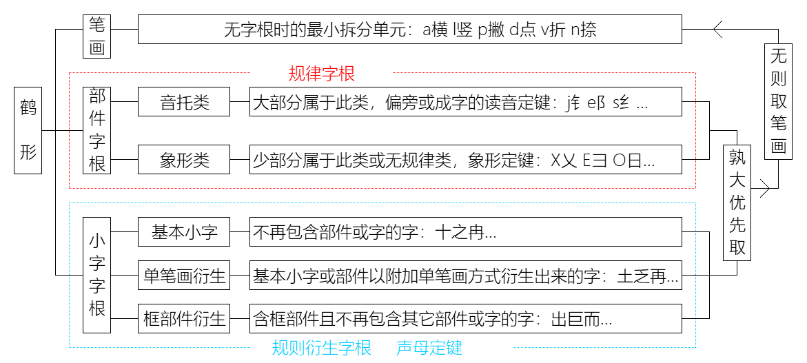

# 小鶴

双拼键位图

qwerty


colemak


table-1

| key | pron | |  key | pron        | | key | pron       |
| --  | --   |-|  --  | --          |-| --  | --         |
| a   | a    | |  j   | an          | | s   | ong / iong |
| b   | in   | |  k   | uai / ing   | | t   | ue / ue    |
| c   | ao   | |  l   | uang / iang | | u   | u          |
| d   | ai   | |  m   | ian         | | v   | ui / u     |
| e   | e    | |  n   | iao         | | w   | ei         |
| f   | en   | |  o   | uo / o      | | x   | ua / ia    |
| g   | eng  | |  p   | ie          | | y   | un         |
| h   | ang  | |  q   | iu          | | z   | ou         |
| i   | i    | |  r   | uan         | |     |            |

秋	闱	软	月	云	梳	翅	松　拥	黛	粉	更	航	安  
快　莺	两　望	奏	夏　蛙	撇	草	追　鱼	滨	鸟	眠


|              |               |              |              | 重複              |
| ------------ | ------------- | ------------ | ------------ | ----------------- |
| **ai**-d 代  | **ia**-x 下   | **u**-v      | **o**-o      | **ui/u**-v        |
| **an**-j     | **ie**-p 撇   |              | **ou**-z     | **uo / o**-o      |
| **ao**-c 操  | **in**-b 賓   | **ua**-x     | **ong**-s 送 | **uai / ing**-k   |
| **ang**-h 航 | **iu**-q 求   | **ue**-t     |              | **ua / ia**-x     |
|              | **ian**-m 面  | **ui**-v 追  |              | **ong / iong**-s  |
|              | **iao**-n 鳥  | **un**-y 雲  |              | **uang / iang**-l |
| **ei**-w     | **ing**-k     | **uo**-o 喔  |              |                   |
| **en**-f 分  | **iang**-l 涼 | **uai**-k 快 |              |                   |
| **eng**-g 耕 | **iong**-s    | **uan**-r 軟 |              |                   |
| --           | --            |              |              |                   |


## 1.2 双形 

### 鹤形概述

双形即从每个字中提取首末两部分形态各异的组字单元，以区分同音字。

鹤形包含以下三类：
 [部件字根](https://help.flypy.com/#/bj) 基本为偏旁部首，日常称谓定其键位，必须掌握！

[小字字根](https://help.flypy.com/#/xz) 基本为小且独立的字，规则推导字根，按其声母定键，理解为主。

---

**鹤形简易入门**：

- 简易入门应该才是精华，体现我的设计思想：
  平常我们对人说某个字怎么写，通常会拆成尽可能大的字，这是为了尽快的表达清楚这个字的全貌，但字根从这个角度设计，分离效果却并不好（所谓分离效果就是同码冲突的机会大小），反而拆成尽可能小的字，分离效果比较好，鹤形就来源于此。
  举例：比如“含”字拆成“人、口”，对应的字母就是“r、k”，那么“含”字的全码就是前两码双拼hj+后两码双形rk得到“hjrk”；也有涉及你日常遇到的偏旁，在鹤形中被归到部件字根类中，比如“蓄”字拆成“艹、田”，对应的字母就是“c、t”（草头定在c键上），那么“蓄”字的全码就是xuct。知道“含蓄”这两个字的拆法，我想大部分字就应该会拆了，通俗的说法就是小字加偏旁。这就是鹤形易学的秘密，即转换小的视角就已经会了大部分字的拆分。
  规则就是为了迎合这种拆法，当然规则不能迎合所有，于是就有了学习规则的过程。规则要解决的是为什么这么拆，不能是你想拆成什么就是什么，那样没有理由，也就没了效率。
  不是所有的小字都定在它声母的键上，比如“日”字就定在O键上，想象是圆的，这也是为了提升拆分的效率，避开放在R键上的同码冲突；也不是所有偏旁都放在它通俗的称呼上，比如“衤”就放在P键上，也是同样的理由；还有不是所有你看到以为是小的字或偏旁，就会是字根，比如“占”里面还有个“口”，所以“战”你不能以为就拆成“占、戈”，这些都是学习规则的理由。
  我想，你看了上面这段话，应该能更好的理解简易入门，也请务必阅读，应该对你的学习有帮助。并祝学习愉快！✌

1. 鹤形包含上面三个分类：小字、部件、笔画。小字字根是灵魂，其尽可能的把字根中能使用规则推导的成字字根归入此类，以减少记忆量；而不能归入小字字根的成字字根和非成字字根则归入部件字根，这是你要记忆掌握的。一个字拆分出首末两个字根，配合前两码双拼，组合成一个字的全码，比如“形” 字，前两码双拼是“xk”，后两码双形的首末字根是“开、撇”，对应的编码是声母“kp”，所以“形”字的全码是“xkkp”

2. 鹤形多数是采用声母定键，即这个字根的声母就是这个字根的键位，小字字根全属此类，部件字根中部分偏旁类采用了其俗称的声母，如：犭反犬的q，卩 阝单双耳的e，冫氵两三点的d；部分成字部件也是取的声母，如：黑h，金j，虫i

3. 鹤形设计的出发点是把一个字中的小且独立的字作为拆分因素，以便于识别，比如：“树” 取“木寸”，而不是 “木对” 或“ 权寸”；“喜”取“士口”而不是“吉口”；“甜”取“千甘”而不是“舌甘”。这些拆分因素即是小字字根

4. 当然也有很多字，并非由独立的小字构成，比如“就”，左边的“京”是个复杂组合，包含了“亠口小”，并不是一个小且独立的字，这时就需要用到另一种字根类型，部件字根，“亠”可以记做“文字头”归于w键，于是“就”的全码是“jqwy亠尤”，又如一些偏旁艹钅阝也同属此类字根

5. 当一个字里你既拆不出小字也拆不出部件时，就用到了笔画，比如“里”没有独立的部分，只能按首末笔画拆分，其它如：丰申寸戈

### 1.2.1 鹤形 拆分规则

#### 一、规则：

1. 字取首末：

   一个字取其首末两个字根（小字或部件），孰大优先，无则取笔画

   释义：这里定义的是所取字根在字中所处的位置，即取字的首字根和末字根（如何定首末详见“[字根序](https://help.flypy.com/#/gz?id=zgx)”说明），字根谁大就取谁，无则取笔画

   示例：“画”拆分为“横田凵”，则取首末“横凵”；“武”拆分成“横弋止”，则取首末“横止”；“鞍”首部有“ 廿”和“革”，“革”大所以首根取“革”不取“廿”，则首末取“革女”

   

2. 相交不拆：

   字根如与其它笔画相交，则不取

   释义：相交不拆，字根如果与其它笔画相交，则此字根即被破坏而不可取，这样就免去了字中找字的麻烦，而可以简单直接取到笔画

   示例：“中”，此字中的“口”与笔画竖相交，则此“口”已被破坏，不能再拆为“口”，只能被拆成首末笔“竖竖”，其它如“未” 不能取“二”，“重” 不能取“千”，“里”不能取“ 甲”，“子” 不能取“ 了”

   

3. **插隔不取：**字根如被单笔画插入或被结构隔离则不再被认为是字根

- 插入释义： 如“平”的拆分，因为取码顺序是字根序而非笔画序，则此字可能被拆分成“干撇”，拆分不太自然， 所以用此条规则的单笔画插入来破坏这个“干”字，此时“干”就因为被单笔画插入而不能取，因此“平”被拆分成“横十”，金人横、番撇田，等字同理。“插入”好比一个三面包围“匚”或四面包围“囗”的结构中间插入一个单笔画，如“丽”字里的“冂”中插入了一个笔画点，则此部件被破坏而不再当作部件，“卵”中的“卩”、“眉”中的“尸”同理
- 隔离释义： 字根只要被一个结构（可能是字也可能不是）隔离，那拆分时就不被认为是字根，如“办”字的“八”因为被“力”隔离， 则只能取“力点”，而不是“力八”，木→十捺、半→点竖，等字同理

1. “廴辶”优先

   ：以“廴 辶”为部首的字，首码先取

   释义：以这两个部件为部首的字先取此部件，因为这两个部件特征明显，优先取更直观。部件并非字的部首时，则按照常规顺序拆分，如：筵，其部首为“⺮”，“廴”部件并非部首，故顺序取“⺮廴”，又如“健→亻廴”。

   示例： “这→辶文，建→廴聿”

> 注：
>
> 1. 单笔画字因无字根可拆，重复自身笔画码补全四码，如：一 yiaa、乙 yivv
> 2. 单笔画字被用做字根时，当笔画解，如：旦 djoa、亿 yirv
> 3. 繁体字根可视同其简体字根，如：鳥鸟，馬马，魚鱼，車车，糹纟，飠饣，門门，釒钅……等


#### 二、小字字根定义：

**基本小字：**

1. 一个字如果不再包含字或部件则为小字
   示例：“十之冉我五也垂中”这些字中都不再包含有其它字或部件，所以本身就是小字

**衍生小字：**

1. 部件或小字以附加单笔画方式衍生出来的字也为小字，如果衍生结果含两字则分取

   ①、单笔画可以是在小字或部件的不同隔离区附加，如“米”就是在“十”的不同区域附加单笔画而成；衍生小字可以在衍生的基础上再衍生，如“十→干→午，十→土→王→主玉”。由于相交不拆的规则，附加单笔画衍生只能是相接相离单笔画衍生方式，如“中”字这种相交单笔画并非衍生，其本身就是基本小字
   示例：小字或部件附加单笔画衍生小字过程：大→天→矢，日→白→百 小字或部件的不同隔离区附加单笔画衍生小字过程：十→木，十→米，人→火，力→办、𠂇→尤、干→平
   ②、衍生小字如果衍生结果含两字则分取：兀→元，因为“元”可分开为两个字：二儿，所以“元”字分拆为“二儿”，其它同理如：示二小，兵丘八
   ③、“日”部件只向上方衍生字根 示例：“→白→百”等字向上方加单笔画衍生的字根为小字字根；而不向其他方向衍生字根，如“→旦→亘，→旧”等字则不为小字字根

2. 一个字除部件“囗匚冂凵勹”之外，不再含其它部件或字，则为小字，含则分取

   示例：“巨臣勿而出击”等字包含框部件外再无其它部件，则为小字；“匝匹句匀同函”等字含框部件外还含其它部件或字，则分取

   另：开口框在字中开口时才为部件
   示例：“同巨击出”等字中的“冂匚凵”没有被封口即为部件；“皿且甲”中的“冂”被封了口，则不被认为是部件

**小字拆分：**

- 附加一个单笔画的方式衍生的小字，作为一个字需要拆分时，分取单笔画与衍生前的部分；其它小字拆分参照主规则

  释义：附加一个单笔画衍生的小字，衍生过程即拆分过程。

  如“玉”是“王”加单笔“点”衍生，所以拆分为“王点”而不受主规则 3 “插单不取”的限制；“主”是由“王”加单笔画点衍生，拆分为“点王”，同样不受主规则 1 “孰大优先”的制约

  
  示例：方→点万，主→点王，白→撇曰，再→横冉，王→横土，禾→撇木，朱→撇未

> 注：
>
> 1. 小字字根范围以《通用规范汉字表》国发〔2013〕23号文规定用字为准
>    超出此范围即不属小字字根，以便识别
> 2. 表外字如符合小字衍生规则，其拆分可参照小字拆分


#### 三、拆分示例：

“鹤”，左部“冖”与“撇”相交，所以拆不出“冖”，取首笔“点”，右部取“鸟”，全码为hedn
“走”，上部取“土”，下部取“人”，全码为zztr
“武”，取首笔“横”，末部取“止”，此字拆分的字根顺序为：横弋止，全码为wuav，同理“或→戈横，戊→戈撇，越→土折”
“难”，左部取“又”，右部“隹”非字根，取“龶”，全码为njyf
“战”，左部“占”非字根，取首笔“竖”，右部取“戈”，全码为vjlg
“豫”，左部“予”非字根，取“龴”，右部“象”非字根，取末笔“捺”，全码yusn

- 更多拆分例字见：[拆分例字](https://help.flypy.com/#/lz)

#### 四、字根序：

首末字根的取码方式通常分三种，下面对比一下优劣（以下例字均用鹤形的字根范围拆分）：

鹤形采用——3.字根序

1. **笔顺序**

   即字根必须在字的笔顺上才为字根，取首末笔顺序字根，“试”的笔顺字根为：讠横工折点，因此按笔顺序取的首末字根应为 讠点，弋字不符合笔顺；
   例：匡→横折 、武→横点 、框→木折 、式→横点 、挂→扌王 、粤→撇亏、潭→氵干、捏→扌王、或→横点、越→ 点

2. **首末笔所在字根序**

   即首末笔能和其它笔画（不论顺序）组成字根则为字根，“试”字首笔丶所在字根为“讠”，末笔丶所在字根为“弋”，因此首末笔所在字根为 讠弋；
   例：匡→匚匚 、武→横弋 、框→木匚 、式→弋弋 、挂→扌王 、粤→撇亏、潭→氵干、捏→扌王、或→戈戈、越→土戈

3. **字根序**

   即从首笔开始与其它笔画（不论顺序）组成字根则为首字根，首字根笔画之外剩余笔画再按剩余首笔画组成字根，直到最末组成的为末字根，“试”按字根的顺序应为：讠弋 工，所以字根序的首末字根为 讠工。
   例：匡→匚王 、武→横止 、框→木王 、式→弋工 、挂→扌土 、粤→撇折、潭→氵十、捏→扌土、或→戈横、越→土折

12 两种取码方式，最大的问题就是取码的直观性容易被破坏，因此一些采用此类规则的方案要加上一条不算规则的规则：“兼顾直观”，意思就是说某些字没按规则来取是因为要照顾直观，比如“挂”字末取“王”就很不直观


3 的取码方式本身就达到了兼顾直观的目的，当然也有部分像“越”字这样的字的末形一时判断不清，但是符合取码规则的，理解了规则也就不是问题


### 1.2.2 鹤形 部件字根

**部件规律字根，请掌握！**


记忆方法如下：


### 1.2.3 鹤形 小字字根

**小字规则字根，免记忆**

小字字根列表（理解[小字规则](https://help.flypy.com/#/gz?id=xzgz)的用户请跳过此表）：

- 一些可能会不认识的小字：`戊wù`、`戌xū`、`耒lěi`、`爿pán`、`豕shǐ`、`臾yú`、`聿yù`、`廿niàn`、`巳sì`、`曳yè`、`夬guài`

`a` 凹  
`b` 百 白 八 卜 匕 卞 不 巴 本 必 丙 半 办  
`c` 寸 才 匆 册  
`d` 大 丁 刀 歹 刁 东 丹 电 氐  
`e` 二 耳 儿 而  
`f` 非 方 飞 夫 凡 甫 弗 乏 丰  
`g` 广 弓 戈 工 瓜 干 个 甘 丐 果 更 夬  
`h` 禾 户 互 乎 火  
`i` 川 厂 车 长 叉 尺 丑 臣 成 垂 斥 串 产 出  
`j` 巾 几 九 斤 久 巨 己 井 及 夹 甲 臼 韭 戋 柬 击  
`k` 口 开 亏  
`l` 了 力 乐 来 良 两 里 吏 耒 卵 丽  
`m` 木 毛 米 门 马 皿 末 灭 母 民 么 面  
`n` 廿 女 牛 鸟 乃 内 农 年  
`p` 片 平 爿  
`q` 七 千 犬 丘 曲 且 气 乞  
`r` 人 入 冉 壬 刃  
`s` 三 巳 肃  
`t` 土 天 太 屯  
`u` 十 尸 士 手 身 水 上 少 术 失 生 世 申 史 升 事 书 束 勺 戍 豕 氏 矢  
`v` 止 爪 主 舟 之 正 丈 中 专 朱 州 重 乍  
`w` 王 瓦 五 无 万 午 亡 未 乌 韦 勿 为 戊 我 丸 兀  
`x` 小 西 心 血 下 夕 乡 戌 习  
`y` 又 酉 已 于 义 与 夭 玉 牙 丫 永 尤 也 业 由 央 亚 严 用 幺 禺 臾 尹 禹 夷 弋 聿 雨 曳  
`z` 再 自 子

### 1.2.4 鹤形 拆分例字

理解下面单字的拆分，就基本掌握鹤形字根了。

学习请用组合键 `ctrl + alt + q` 或者输入 `oqm` 启用＜[简字补全](https://help.flypy.com/#/wt?id=jz)＞分类。

| 例字 | 全码 | 首形 | 末形 |
| ---- | ---- | ---- | ---- |
| 湿   | uidy | 氵   | 业   |
| 例   | lird | 亻   | 刂   |
| 解   | jpdn | ⺈   | 牛   |
| 猜   | cdqo | 犭   | 月   |
| 鞋   | xpgt | 革   | 土   |
| 球   | qqwq | 王   | 求   |
| 具   | juqb | 具上 | 八   |
| 斯   | siqj | 其上 | 斤   |
| 毫   | hcwm | 亠   | 毛   |
| 冬   | dswd | 夂   | 点   |
| 紊   | wfwx | 文   | 小   |
| 却   | qtte | 土   | 卩   |
| 现   | xmwe | 王   | 见下 |
| 佛   | forf | 亻   | 弗   |
| 累   | lwtx | 田   | 小   |
| 雅   | yayf | 牙   | 龶   |
| 裹   | gowy | 亠   | 𧘇   |
| 羹   | ggyd | ⺷   | 大   |
| 差   | iayg | ⺶   | 工   |
| 咩   | mpky | 口   | 羊   |
| 饮   | ybur | 饣   | 人   |
| 看   | kjuo | 龵   | 目   |
| 雄   | xsuf | 𠂇   | 龶   |
| 泰   | tdfu | 寿上 | 氺   |
| 码   | maum | 石   | 马   |
| 行   | xkii | 彳   | 亍   |
| 蛇   | ueib | 虫   | 匕   |
| 服   | fuoy | 月   | 又   |
| 乏   | fapv | 撇   | 之   |
| 禳   | rhpy | 礻   | 𧘇   |
| 袍   | pcps | 衤   | 巳   |
| 鲸   | jkax | 鱼   | 小   |
| 纱   | uasu | 纟   | 少   |
| 公   | gsbs | 八   | 厶   |
| 甬   | yssy | 龴   | 用   |
| 罚   | fasd | 罒   | 刂   |
| 冲   | isdv | 冫   | 中   |
| 泯   | mbdm | 氵   | 民   |
| 色   | sedb | ⺈   | 巴   |
| 寿   | uzfc | 寿上 | 寸   |
| 带   | ddfj | 带上 | 巾   |
| 责   | zefr | 龶   | 人   |
| 缺   | qtfg | 缶   | 夬   |
| 即   | jige | 既左 | 卩   |
| 烝   | vglh | 了   | 灬   |
| 彪   | bnhp | 虍   | 撇   |
| 荼   | tuch | 艹   | 余下 |
| 默   | mohq | 黑   | 犬   |
| 钢   | ghjx | 钅   | 乂   |
| 券   | qrjd | 龹   | 刀   |
| 鉴   | jmlj | 竖   | 金   |
| 匹   | pike | 匚   | 儿   |
| 函   | hjlk | 了   | 凵   |
| 管   | grvk | ⺮   | 㠯   |
| 教   | jnlw | 耂   | 攵   |
| 夏   | xxaw | 横   | 夂   |
| 辣   | lalu | 立   | 束   |
| 聋   | lsle | 龙   | 耳   |
| 迈   | mdzw | 辶   | 万   |
| 建   | jmzy | 廴   | 聿   |
| 踢   | tizw | ⻊   | 勿   |
| 常   | ihxj | ⺌   | 巾   |
| 兴   | xkxb | ⺍   | 八   |
| 添   | tmdx | 氵   | ⺗   |
| 恒   | hgxa | 忄   | 横   |
| 杀   | uaxm | 乂   | 朩   |
| 弄   | nswc | 王   | 廾   |
| 笔   | bivm | ⺮   | 毛   |
| 豺   | idvc | 豸   | 才   |
| 冠   | grbc | 冖   | 寸   |
| 兰   | ljbs | 丷   | 三   |
| 顷   | qkbr | 比左 | 人   |
| 病   | bkbb | 疒   | 丙   |
| 靠   | kcnf | ⺧   | 非   |
| 宿   | subb | 宀   | 百   |
| 皂   | zcbq | 白   | 七   |
| 爸   | babb | 八   | 巴   |
| 卦   | gxtb | 土   | 卜   |
| 丕   | piba | 不   | 横   |
| 体   | tirb | 亻   | 本   |
| 泌   | midb | 氵   | 必   |
| 绊   | bjsb | 纟   | 半   |
| 协   | xpub | 十   | 办   |
| 财   | cdkc | 冂   | 才   |
| 删   | ujcd | 册   | 刂   |
| 死   | sidb | 歹   | 匕   |
| 冻   | dsdd | 冫   | 东   |
| 彤   | tsdp | 丹   | 撇   |
| 庵   | angd | 广   | 电   |
| 抵   | difd | 扌   | 氐   |
| 渣   | vada | 氵   | 横   |
| 示   | uiex | 二   | 小   |
| 耶   | yeee | 耳   | 阝   |
| 兆   | vced | 儿   | 点   |
| 耍   | uxen | 而   | 女   |
| 霏   | fwyf | 雨   | 非   |
| 防   | fhef | 阝   | 方   |
| 替   | tifo | 夫   | 日   |
| 巩   | gsgf | 工   | 凡   |
| 匍   | pubf | 勹   | 甫   |
| 辅   | fuif | 车   | 甫   |
| 泛   | fjdf | 氵   | 乏   |
| 慧   | hvfx | 丰   | 心   |
| 引   | ybgl | 弓   | 竖   |
| 或   | hoga | 戈   | 横   |
| 瓤   | rhwg | 亠   | 瓜   |
| 便   | bmrg | 亻   | 更   |
| 某   | mzgm | 甘   | 木   |
| 钙   | gdjg | 钅   | 丐   |
| 棵   | kemg | 木   | 果   |
| 利   | lihd | 禾   | 刂   |
| 沪   | hudh | 氵   | 户   |
| 呼   | hukh | 口   | 乎   |
| 炒   | ichu | 火   | 少   |
| 训   | xyyi | 讠   | 川   |
| 厌   | yjiq | 厂   | 犬   |
| 张   | vhgi | 弓   | 长   |
| 钗   | idji | 钅   | 叉   |
| 迟   | iizi | 辶   | 尺   |
| 扭   | nqfi | 扌   | 丑   |
| 宦   | hrbi | 宀   | 臣   |
| 城   | igti | 土   | 成   |
| 睡   | uvoi | 目   | 垂   |
| 拆   | idfi | 扌   | 斥   |
| 患   | hrix | 串   | 心   |
| 拙   | vofi | 扌   | 出   |
| 市   | uiwj | 亠   | 巾   |
| 讥   | jiyj | 讠   | 几   |
| 疚   | jqbj | 疒   | 久   |
| 拒   | jufj | 扌   | 巨   |
| 进   | jbzj | 辶   | 井   |
| 吸   | xikj | 口   | 及   |
| 陕   | ujej | 阝   | 夹   |
| 押   | yafj | 扌   | 甲   |
| 鼠   | uujv | 臼   | 折   |
| 浅   | qmdj | 氵   | 戋   |
| 谏   | jmyj | 讠   | 柬   |
| 陆   | luej | 阝   | 击   |
| 并   | bkbk | 丷   | 开   |
| 污   | wudk | 氵   | 亏   |
| 粮   | llml | 米   | 良   |
| 辆   | llil | 车   | 两   |
| 理   | liwl | 王   | 里   |
| 使   | uirl | 亻   | 吏   |
| 耕   | gglj | 耒   | 井   |
| 孵   | fulz | 卵   | 子   |
| 俪   | lirl | 亻   | 丽   |
| 闯   | ilmm | 门   | 马   |
| 盖   | gdym | ⺷   | 皿   |
| 沫   | modm | 氵   | 末   |
| 拇   | mufm | 扌   | 母   |
| 缅   | mmsm | 纟   | 面   |
| 革   | genl | 廿   | 竖   |
| 鹤   | hedn | 点   | 鸟   |
| 浓   | nsdn | 氵   | 农   |
| 版   | bjpy | 片   | 又   |
| 苹   | pkcp | 艹   | 平   |
| 奘   | zhpd | 爿   | 大   |
| 切   | qpqd | 七   | 刀   |
| 邱   | qqqe | 丘   | 阝   |
| 助   | vuql | 且   | 力   |
| 汽   | qidq | 氵   | 气   |
| 吃   | iikq | 口   | 乞   |
| 肉   | rznr | 内   | 人   |
| 再   | zdar | 横   | 冉   |
| 任   | rfrr | 亻   | 壬   |
| 忍   | rfrx | 刃   | 心   |
| 导   | dcsc | 巳   | 寸   |
| 啸   | xnks | 口   | 肃   |
| 起   | qitj | 土   | 己   |
| 关   | grbt | 丷   | 天   |
| 吨   | dykt | 口   | 屯   |
| 丧   | shun | 十   | 捺   |
| 屎   | uium | 尸   | 米   |
| 款   | krur | 士   | 人   |
| 射   | ueuc | 身   | 寸   |
| 冰   | bkdu | 冫   | 水   |
| 叔   | uuuy | 上   | 又   |
| 述   | uuzu | 辶   | 术   |
| 佚   | yiru | 亻   | 失   |
| 屉   | tiuu | 尸   | 世   |
| 呻   | ufku | 口   | 申   |
| 豹   | bcvu | 豸   | 勺   |
| 逐   | vuzu | 辶   | 豕   |
| 氐   | diud | 氏   | 点   |
| 智   | viuo | 矢   | 日   |
| 步   | buvp | 止   | 撇   |
| 抓   | vxfv | 扌   | 爪   |
| 驻   | vumv | 马   | 主   |
| 船   | irvk | 舟   | 口   |
| 政   | vgvw | 正   | 攵   |
| 仗   | vhrv | 亻   | 丈   |
| 忠   | vsvx | 中   | 心   |
| 传   | irrv | 亻   | 专   |
| 株   | vumv | 木   | 朱   |
| 洲   | vzdv | 氵   | 州   |
| 作   | zorv | 亻   | 乍   |
| 玉   | yuwd | 王   | 点   |
| 伍   | wurw | 亻   | 五   |
| 抚   | fufw | 扌   | 无   |
| 趸   | dywr | 万   | 人   |
| 缶   | fzwk | 午   | 凵   |
| 忘   | whwx | 亡   | 心   |
| 妹   | mwnw | 女   | 未   |
| 呜   | wukw | 口   | 乌   |
| 伟   | wwrw | 亻   | 韦   |
| 忽   | huwx | 勿   | 心   |
| 伪   | wwrw | 亻   | 为   |
| 成   | igwv | 戊   | 折   |
| 执   | vifw | 扌   | 丸   |
| 饶   | rcuw | 饣   | 兀   |
| 晒   | udox | 日   | 西   |
| 恤   | xuxx | 忄   | 血   |
| 卞   | bmdx | 点   | 下   |
| 名   | mkxk | 夕   | 口   |
| 咸   | xmxk | 戌   | 口   |
| 羽   | yuxx | 习   | 习   |
| 醒   | xkyu | 酉   | 生   |
| 仪   | yiry | 亻   | 义   |
| 屿   | yuey | 山   | 与   |
| 乔   | qnyl | 夭   | 竖   |
| 呀   | yaky | 口   | 牙   |
| 优   | yzry | 亻   | 尤   |
| 他   | tary | 亻   | 也   |
| 油   | yzdy | 氵   | 由   |
| 秧   | yhhy | 禾   | 央   |
| 哑   | yaky | 口   | 亚   |
| 俑   | ysry | 亻   | 用   |
| 幻   | hryv | 幺   | 折   |
| 偶   | oury | 亻   | 禺   |
| 咦   | yiky | 口   | 夷   |
| 式   | uiyg | 弋   | 工   |
| 律   | lviy | 彳   | 聿   |
| 雪   | xtye | 雨   | 彐   |
| 拽   | vkfy | 扌   | 曳   |
| 咱   | zjkz | 口   | 自   |
| 孟   | mgzm | 子   | 皿   |
| 载   | zdui | 十   | 车   |
| 甜   | tmqg | 千   | 甘   |
| 乘   | igqn | 千   | 捺   |
| 哥   | gedk | 丁   | 口   |


### 1.2.5 鹤形 字根合图


## 2 输入法应用

### 应用

**一、拼音输入法内置——小鹤双拼方案**

- 小鹤官方发布

  『小鹤双拼』方案于2007年1月8日定稿并发布

- 小鹤官方授权

  2010.03.25 搜狗拼音 5.0
  2010.05.07 QQ拼音 3.2
  2010.09.21 谷歌拼音 2.3.14.85
  2018.12.06 iOS12.1.1原生键盘
  2018.12.06 macOS10.14.2原生键盘
  ...

  

  = 小鹤双拼用户可在其设置中选择本方案使用 =

**二、独立输入法——小鹤音形输入法**

- 小鹤官方发布

  鹤形方案：2007年5月6日初稿 - 2008年2月23日定稿

  1.『小鹤音形』输入法Windows版，基于小鹤音形方案与多多输入法生成器生成
  2.『小鹤音形』输入法Android版，基于小鹤音形方案与同文输入法平台生成

- 小鹤官方授权
  小鹤音形尚无授权发布版本，任何第三方内置小鹤音形方案的行为均为侵权

- 挂接第三方
  Windows、iOS、macOS、Linux等各系统亦可通过挂接基于Rime框架的各系统前端（软件平台）实现，或其他平台实现 挂接文件在小鹤官方网盘中提供，见三

　　= 小鹤音形用户可安装或挂接使用 =

**三、下载地址**

- 小鹤音形下载：
  官 网：[https://flypy.com](https://flypy.com/)
  网 盘：[http://flypy.ys168.com](http://flypy.ys168.com/)
  QQ群：[182883808](https://qm.qq.com/cgi-bin/qm/qr?k=XC2HOCVX8H1cWAaVLNjclwXSE1V1s_AD&jump_from=webapi)

- 小鹤双拼下载：
  请到各大拼音输入法官方网站下载其拼音输入法，在其设置中选择小鹤双拼使用


### 2.1 Win版基本功能

一、**常用组合键、直通码**

| 功 能        | 功能键 | 功 能         | 组合键         | 直通码 |
| ------------ | ------ | ------------- | -------------- | ------ |
| 中/英        | Shift  | 全/半角       | Shift + 空格   | oqb    |
| 次选上屏     | ;      | 中/英标点     | Ctrl + .       | ovy    |
| 翻页         | [ ]    | 简/繁         | Ctrl + Alt + j | ojf    |
| [快符][]引导 | ;      | [简字补全][]  | Ctrl + Alt + q | oqm    |
| 便捷引导     | '      | [二重简码][]  | Ctrl + Alt + i | oei    |
| 编码清屏     | Tab    | 在线加词      | Ctrl + Alt + = | ojc    |
| 编码上屏     | Enter  | 在线调频      | Ctrl + 序号    |        |
| －           | －     | 小鹤入门      | 打开手册       | xhrm   |

[快符]: https://help.flypy.com/#/fh
[简字补全]: https://help.flypy.com/#/wt?id=jz
[二重简码]: https://help.flypy.com/#/wt?id=jz

二、**其他常用功能**

1. 离线词库：

   自建一个“词库.txt”文件（名称、位置随意），词条直接在此文件内添加
   输入 `omb` 打开码表项，右键点击对应分类，导入此文件生效

- 编码格式：
  ①常规：词条+Tab符+编码　　　 例： 试试　uiui　（重码默认居后）
  ②居首：词条+Tab符+编码#固　　例：知道　vidc#固　（系统已有词条无效）
  ③删词：词条+Tab符+编码#删　　例：五笔　wb#删
- 直通词库：
  可建一个直通词条用于直接打开离线词库
  例：$ddcmd(run(D:\OneDrive\词库.txt),[我的词库])　ock　注意[替代值](https://help.flypy.com/#/vt?id=tdv)冲突
  即输入 `ock` 打开位于D盘“OneDrive”文件夹内的“词库.txt”文件

> 注意例词条和编码中间是Tab符，但你直接复制出来可能变成空格，所以自己敲 `Tab` 键吧
> 有一定词库量且词库内分类或分段排列，建议采用此方式管理用户词库，词库内可用//引导进行分段备注

------

1. 在线词库

   通过在线加词方式积累的词库，立即生效
   输入 `omb` 打开码表项，右键点击＜用户＞分类，导出文件备份

- 在线加词
  输入要加词，之后使用组合键Ctrl + Alt + =或输入 `ojc` ，可用 ↑↓ 调整词长
  或复制要加字词后使用上述组合键或直通码，之后在弹出窗口勾选剪贴板造词
  此方式所加词，存放于 `omb` 打开的码表项中的＜用户＞分类中

- 在线删词
  Ctrl + Alt + 序号从词库中删除候选栏中序号对应的词条
  Ctrl + Alt + -从词库中删除刚上屏的词条

- 在线调频
  Ctrl + 序号置顶候选栏中序号对应的词条

  

  以上方式所删所调系统词并无记录，下次更新软件需要重新手动处理

> 零星造词删词可用此方式，如增删修改较多建议采用“离线词库”方式

------

1. 反查编码
   不知道编码时的查询方法

- 知形查音： 不知道读音可先输入两位查询字符 **``** 分别替代声韵后继续输入双形， 从候选字中查看双拼编码

- 知音查形： 不知道双形可在双拼后输入两位查询字符

   


   

  分别替代首末形， 从候选字中查看双形编码

  > 查询字符（又称万能键）， **`** 此符号键位于 `Tab` 键上方，替代任一编码

- 复制反查： 将要查的字复制后，输入 `ofi` 查询编码

------

1. 便捷输入

   可快速输入英文、日期、数字、金额或临时启用未开启分类、英文输入等
   **单引号**：引导便捷输入，双击上屏本身

- 任意日期
  输入`'2007.1.8`　候选： a. 二〇〇七年一月八日　b. 2008年1月8日
  输入`'2008.2.`　候选： a. 二〇〇八年二月　b. 2008年2月
  当前日期、时间可使用直通码方式： `ouj` `orq`
- 任意金额
  输入 `'2019.12`　　候选： a. 二千零一十九点一二　b. 贰仟零壹拾玖元壹角贰分
  输入 `'2019`　　候选： a. 二千零一十九　b. 贰仟零壹拾玖元整
- 临时生僻
  临时显示＜简字补全＞（含生僻字）分类，如： `'bulw`　瓿
  也可用组合键Ctrl + Alt + q或输入 `oqm` 显示分类直接输入
- 临时二重
  临时启用＜二重简码＞分类，如： `'a`　按
  也可用组合键Ctrl + Alt + i或直通车 `oei` 启用分类后直接输入
- 临时英文
  临时启用英文模式，完成后用引导键结束，并上屏英文

------

1. 智能标点

   可快速把中文标点转换为英文标点

   如点击句号后半秒内再次点击句号，句号就会变成英文句点，超时则继续打出句号
   高级设置→“智能标点表”，等号后所列标点（英文）即为可转换标点

------

> 注：
>
> 1. 候选项中提示符号包含意义
>    ①［...］表示此为直通命令，选中则执行命令　　　　如：orm　1. [使用入门]
>    ②（...）表示此为转向命令，选中则转向另一条编码　如：of　　1. bd（标点）
>    ③ * ...　表示此词条处于＜简字补全＞分类中　　　　如：qut\`　5. \*去s
> 2. 在线字典中字编码后的符号包含意义
>    ① - 表示此字已有简码让出全码首选位　　　　　　　　　如：去　quts-
>    ② * 表示此字属于生僻字　　　　　　　　　　　　　如：燚　yihh\*
>    ③＋表示此字属于通用规范字表外增补的字　　　　　如：冇　mcuk+
>    ①②两项在隐藏＜简字补全＞分类时可用单引号引导临时显示


### 2.2 简码

#### 一简字：

即一码一字（取字的首码即声母），共26个

```
　去　我　二　人　他　　　一　是　出　哦　平
　啊　三　的　非　个　　　和　就　可　了
　在　小　才　这　不　　　你　没

```

#### 二简字：

即两码一字（取字的首次码即声韵），共382个

```
菜少僧多佛无肉 车新帅老将有云 深山谁能弄风月 水里咋让虐毛熊 黑龙森林闹天地 黄牛大户拨窗泥
阿翁恰好说空话 爱女当面色从容 怒撒红米她先笑 穷困冷囊贼也完 为何楼高汤更暖 凭啥桥坏应对难
目光绕得亲体软 装问跑来您眼前 两间长草各内外 几行热搜求安全 藏传真如修本主 上元太岁共双恩
桌边混吃仍需乐 村中走动且请跟 长路正顺或行久 报表群读谈分成 古怪酷图撇粗乱 特强陈某蹦窜戳
配料过关调算法 嫩排开口要生抽 昂头每次旁若定 顿额经年只等盘 曾早数日听鸟梦 但因差点总卷然
四下帮凑含宁散 最后推却跌碰贴 超贵追买怕卡疼 放浪还看该干吗 亚奥其会忙参与 比赛接连被灭团
费率加增够快否 普系吹落很亏么 占据民调都进组 受到肯夸找靠所 并列均宽纯末况 再而以测滚剖剋
破产另设做事处 挖坑则选横滨区 藏着换代别叫慢 错论白给任捏催 想送那些同样们 刚丢怎办用冲转
品类套票盆克秒 名片副部段批扎 挂拽抗拴托揣握 抓拉挪扫把扩擦 刘苏岑欧周王反 嗯欸喔哟嘎哈呢
得学拆字
```

> 另：补充一二简字90个，做＜二重简码＞使用，如果不介意增加的小指使用率，可通过输入`oei`启用

#### 二简词：

即两码二字词（取两字的首码即声声），共353个

```
首选：273个

难道 一定 因为 拼音 简单 所以 我们 从来 只能 习惯 反正 五笔 出现 可能 需要 解决 非常 问题 成为 结果

双拼 明显 容易 自己 现在 发现 简直 方便 相当 喜欢 本来 准备 首先 统一 了解 一下 目前 知道 根本 浪费

一直 认为 努力 才能 掌握 这样 东西 怎么 这么 随便 而且 唯一 要求 联系 地方 应该 论坛 反应 怎样 完成

云南 美丽 台湾 传统 欧洲 漂亮 日本 安静 湖南 热闹 西安 骄傲 昆明 特别 西欧 奇怪 人类 希望 自然 安定

昨天 烦恼 今天 精彩 明天 洒脱 后天 放松 天天 安逸 日期 正确 下周 安排 每周 天气 人们 热爱 无线 现金

为了 安全 费了 脑子 算了 成本 走了 金额 到了 解放 没有 事情 放弃 索赔 思考 错误 分配 公平 承诺 好处

产品 功能 完全 不同 在线 平台 参考 微软 额外 昂贵 儿子 原来 那些 同学 似乎 开头 认同 几位 偶像 代表

貌似 聪明 而不 郁闷 头发 缺乏 爱惜 脾气 反而 儿科 折腾 重码 为此 千万 保证 讨论 期间 不再 反对 沟通

作品 思想 过程 怎能 害怕 节奏 切换 身体 按错 从不 反馈 亲自 按照 上面 培训 认真 计算 配置 确定 为止

过去 比赛 必须 那样 无奈 不然 回去 只怕 暗自 呕吐 下次 采取 安保 按时 配送 普洱 暂且 随你 索取 恩赐

繁体 文字 儿童 偶尔 看出 其中 一片 认得 安慰 才行 况且 人品 偶然 认可 而非 顺便 玩儿 何必 全额 否认

默认 二者 恩爱 从头 神似 安分 所谓 暧昧 几乎 缘分 而已 按理 后面 耳机 热线 咋不 代替 拗口 奇偶 凹凸

噩梦 恶劣 恶心 恶毒 恶搞 恶评 险恶 不饿 挨饿 饿死 黯然 猥琐 恐怖 恐怕 唯恐 骗人 讽刺 暗算 群殴 必要

并且 欧阳 干嘛 存盘 重启 其次 网盘 最快 相反 方面 而是 收到 什么sm

```


> 前三排可以重点熟悉下，其他使用中积累就好

```
次选：80个

刚刚 慢慢 渐渐 试试 尝尝 恰恰 背景 伤害 程度 附件 支持 选择 学习 情况 每天 电脑 公司 速度 完美 悠闲
修改 修正 回复 感觉 面前 前面 下面 假如 更新 推荐 推倒 达到 链接 追求 困难 极其 极致 与其 束缚 搜索
这些 总算 淘汰 投资 虽然 真正 绝对 任务 发送 规则 否则 尽管 仍然 分别 指定 味道 歧视 从前 征服 世纪
这次 微信 推广 主意 意志 小时 只是 只会 未知 座位 参加 反悔 打算 随着 等着 跟着 分钟 安装 总共 两边

```

------

**另附**：前500单字，即字频最高的500个字

```
的一是了不在有个人这上中大为来我到出要以时和地们得可下对生也子就过能他会多发说而于自之用年行家方后作成开面事好小心前所道法如进着同经分定都然与本还其当起动已两点从问里主实天高去现长此三将无国全文理明日些看只公等十意正外想间把情者没重相那向知因样学应又手但信关使种见力名二处门并口么先位头回话很再由身入内第平被给次别几月真立新通少机打水果最部何安接报声才体今合性西你放表目加常做己老四件解路更走比总金管光工结提任东原便美及教难世至气神山数利书代直色场变记张必受交非服化求风度太万各算边王什快许连五活思该步海指物则女或完马强言条特命感清带认保望转传儿制干计民白住字它义车像反象题却流且即深近形取往系量论告息让决未花收满每华业南觉电空眼听远师元请容她军士百办语期北林识半夫客战院城候单音台死视领失司亲始极双令改功程爱德复切随李员离轻观青足落叫根怎持精送众影八首包准兴红达早尽故房引火站似找备调断设格消拉照布友整术石展紧据终周式举飞片虽易运笑云建谈界务写钱商乐推注越千微若约英集示呢待坐议乎留称品志黑存六造低江念产刻节尔吃势依图共曾响底装具喜严九况跟罗须显热病证刚治绝群市阳确究久除闻答段官政类黄武七支费父统府
```

> 入门捷径 - 练习方法：
>
> 10字一组，使用跟打器练习，组内乱序击键过4则换下一组练习，逐渐提高到5击6击换组（有简打简），目标：10字6击，全500字4击（乱序）


### 2.3 符号编码

#### 一、快符、O符


- **分号键**：引导快符及特殊功能，双击上屏本身
  `;a` 输出感叹号！（其它符号输出类推）
  `;u` 撤销上屏词条
  `;f` 重复上屏词条
  `;n` 模拟End键，可用于光标移出成对符号

> 注：① * 号表示最后上屏的编码或字词，即输出内容后再使用此组合
> 　　② 如不需要此功能，可清空＜快符＞分类表

- **O** 键：引导符号数字等其它符号编码
  `ob` 引导部件字根列表，如：`oba` 则显示 a 字母上的部件字根
  `ox` 引导小字字根列表，如：`oxa` 则显示 a 字母上的小字字根
  `of` 引导成组符号（编码见二）
  `ot` 引导特殊符号（编码见三）
  `oq` 引导QQ表情，如：`oqcy`上屏 
  `ow` 引导微信表情，如：`owwx`

#### 二、成组符号

| 名称               | 编码 | 符号列表                                                                                                    |
| :----------------- | :--- | :-----------------------------------------------------------                                                |
| 圆圈数字           | ofyu | ① ② ③ ④ ⑤ ⑥ ⑦ ⑧ ⑨ ⑩                                                                                         |
| 括号数字           | ofku | ⑴ ⑵ ⑶ ⑷ ⑸ ⑹ ⑺ ⑻ ⑼ ⑽ ⑾ ⑿ ⒀ ⒁ ⒂ ⒃ ⒄ ⒅ ⒆ ⒇                                                                     |
| 点数字             | ofdu | ⒈ ⒉ ⒊ ⒋ ⒌ ⒍ ⒎ ⒏ ⒐ ⒑ ⒒ ⒓ ⒔ ⒕ ⒖ ⒗ ⒘ ⒙ ⒚ ⒛                                                                     |
| 中文数字           | ofvu | ㈠ ㈡ ㈢ ㈣ ㈤ ㈥ ㈦ ㈧ ㈨ ㈩                                                                               |
| 罗马大写           | ofld | Ⅰ Ⅱ Ⅲ Ⅳ Ⅴ Ⅵ Ⅶ Ⅷ Ⅸ Ⅹ Ⅺ Ⅻ                                                                                     |
| 罗马小写           | oflx | ⅰ ⅱ ⅲ ⅳ ⅴ ⅵ ⅶ ⅷ ⅸ ⅹ                                                                                         |
| 上标               | ofub | ¹ ² ³ ⁴ ⁵ ⁶ ⁷ ⁸ ⁹ ⁰ ⁺ ⁻ ⁼ ⁽ ⁾ ⁿ ˣ                                                                           |
| 下标               | ofxb | ₁ ₂ ₃ ₄ ₅ ₆ ₇ ₈ ₉ ₀ ₊ ₋ ₌ ₍ ₎ ₙ ₓ                                                                           |
| 单位符号           | ofdw | ㎎ ㎏ ㎜ ㎝ ㎞ ㎡ nm μm μg ㏄ ㏎ ㏑ ㏒ ㏕                                                                   |
| 拼音字母           | ofpy | ā á ǎ à ō ó ǒ ò ê ē é ě è ī í ǐ ì ǖ ǘ ǚ ǜ ü ū ú ǔ ù                                                         |
| 货币符号           | ofhb | € $ ￠ £ ￡ ¥ ￥ ฿                                                                                          |
| 箭头符号           | ofjt | ← → ↑ ↓ ↗ ↙ ↘ ↖ ↔ ↕                                                                                         |
| 制表符号           | ofvb | ┌ └ ┐ ┘ ─ │ ├ ┤ ┬ ┴ ┼ ┏ ┗ ┓ ┛ ━ ┃ ┣ ┫ ┳ ┻ ╋                                                                 |
| 特殊符号           | oftu | ℃ ° ‰ ♂ ♀ § № ☆ ★ ○ ● ◎ ◇ ◆ □ ■ △ ▲ ※ 〓 ＃ ＆ ＠ ＼ ＾ ＿ ￣                                               |
| 注音符号           | ofvy | ㄅ ㄆ ㄇ ㄈ ㄉ ㄊ ㄋ ㄌ ㄍ ㄎ ㄏ ㄐ ㄑ ㄒ ㄓ ㄔ ㄕ ㄖ ㄗ ㄘ ㄙ ㄧ ㄨ ㄩ ㄚ ㄛ ㄜ ㄝ ㄞ ㄟ ㄠ ㄡ ㄢ ㄣ ㄤ    |
| 偏旁部首           | ofpp | 勹 灬 冫 艹 屮 辶 刂 匚 阝 廾 丨 虍 彐 卩 钅 冂 冖 宀 疒 肀 丿 攵 凵 犭 亻 彡 饣 礻 扌 氵 纟 亠 囗 忄 讠 衤 |
| 标点符号           | ofbd | “” （） 《》 〈〉 〔〕 「」 『』 【】 〖〗［］ ｛｝ ． 。 ， 、 ； ： ？ ！ … — · ˉ ˇ ¨ 々 ～ ‖ ∶ ＂ ＇     |
| 数学符号           | ofux | ＋ － ＜ ＝ ＞ ± × ÷ ∈ ∏ ∑ ∕ √ ∝ ∞ ∟ ∠ ∣ ∥ ∧ ∨ ∩ ∪ ∫ ∮ ∴ ∵ ∶ ∷ ∽ ≈ ≌ ≒ ≠ ≡ ≤ ≥ ≦ ≧ ≮ ≯ ⊕ ⊙ ⊥ ⊿              |
| 希腊大写           | ofxd | Α Β Γ Δ Ε Ζ Η Θ Ι Κ Λ Μ Ν Ξ Ο Π Ρ Σ Τ Υ Φ Χ Ψ Ω                                                             |
| 希腊小写           | ofxx | α β γ δ ε ζ η θ ι κ λ μ ν ξ ο π ρ σ τ υ φ χ ψ ω                                                             |
| 俄文大写           | ofed | А Б В Г Д Е Ж З И Й К Л М Н О П Р С Т У Ф Х Ц Ч Ш Щ Ъ Ы Ь Э Ю Я Ё                                           |
| 俄文小写           | ofex | а б в г д е ж з и й к л м н о п р с т у ф х ц ч ш щ ъ ы ь э ю я ё                                           |
| （日文大写片假名） | ofrd | ァ ア ィ イ ゥ ウ ェ エ ォ オ カ ガ キ ギ ク グ ケ ゲ コ ゴ サ ザ シ ジ ス ズ セ ゼ ソ ゾ タ ダ チ ヂ ッ    |
| （日文小写平假名） | ofrx | ぁ あ ぃ い ぅ う ぇ え ぉ お か が き ぎ ぱ く ぐ け げ こ ご さ ざ し じ す ず せ ぜ そ ぞ た だ ち ぢ    |


#### 三、特殊符号

| 编码 | 符号       | 编码 | 符号     | 编码 | 符号 |
| ---- | :--------- | ---- | :------- | ---- | :--- |
| ota  | ＆ α       | otn  | ♂ ♀ №    | oyy  | ① Ⅰ  |
| otb  | % β ©      | oto  | € Ω      | oye  | ② Ⅱ  |
| otc  | ℃          | otp  | ㎡ π     | oys  | ③ Ⅲ  |
| otd  | ° = ≠ ≥ ＞ | otq  | ‰        | oyd  | ④ Ⅳ  |
| ote  | の ε       | otr  | ¥ ￥     | oyw  | ⑤ Ⅴ  |
| otf  | ′ Φ □ ■    | ots  | ∴ ∵ △ ▲  | oyl  | ⑥ Ⅵ  |
| otg  | √ γ        | ott  | ฿ ℡      | oyq  | ⑦ Ⅶ  |
| oth  | ℉ ※ ¤      | otu  | ™        | oyb  | ⑧ Ⅷ  |
| oti  | × ÷        | otv  | § ® ㈱   | oyj  | ⑨ Ⅸ  |
| otj  | ＋ －      | otw  | ∞ 卍 卐  | oyu  | ⑩ Ⅹ  |
| otl  | m³         | otx  | ≤ ＜ ☆ ★ |      |      |
| otm  | ″ μ ﹩ ￠  | oty  | £ ≈ ○ ●  |      |      |


### 3 相关知识

下面文章会让你对小鹤多一些了解：

[致初学者](https://help.flypy.com/#/ix)

[双拼零声母方案](https://help.flypy.com/#/lu)

[“小字”设计目的](https://help.flypy.com/#/md)

[关于字符集](https://help.flypy.com/#/zf)

[常见问题解答](https://help.flypy.com/#/wt)

#### 3.3 “小字”字根设计目的

对于双拼双形类的方案来说，因主音故其形部多数采用的是音托字根（即以拆分字的声母来设定字根所在键位的编码方式），这个“形”被用在智能拼音里起辅助作用时（搜狗拼音、QQ拼音等），用户习惯叫做“辅助码”，而实际上编码方案是可独立使用的音形码。“鹤形”也是众多音托类字根拆分方案中的一种。


音托字根设计类型：

1. **见字即根**：

   音托类字根拆分方案以自然码为代表，采用见字即根的方式，这种方式是通过字根最大化的办法达到减少记忆量的目的。自然码的见字即根是取的最大字，这是在它的另一个规则的前提下，即部首优先，如果没有这条规则，那最大字的取法就会出问题，如“骗”字取最大字就会取到“驴”，自然码通过“部首优先”避免了这样的尴尬，而达到大中取小的自然。自然码通过无限扩大字根的方式达到减少记忆量的同时，也产生了很多不认识的成字字根反而增加记忆量的副作用，另外还有一些非成字字根的记忆也是避免不了的，有些人说自然码字根不用记那也是很片面的说法。部首优先解决了最大字的问题，但也产生了一个部首不清的问题，这也是自然码容错较多重码较多的一个因素。

2. **限定字根**：

   为了取码清晰减少容错，于是一些音托类字根拆分方案抛弃了部首优先，采用了顺序取码的方式，这时见字即根的方式就会产生上面“骗”字的问题，故多数采用了限制字根范围的方式。限制字根范围即限定字根，这就要求你必须记住这些字根，非成字、成字就都成为了记忆量，字根量少虽然能减少记忆量，但拆分难度就会增加，增加字根量拆分难度减少了，但记忆量却增加了。

3. **规则字根**：

   鹤形的“小字”字根也就是出于解决上述问题而出现的。小字字根灵感来自独体字，因为自然码取大字根的方式重码偏高，所以我想到取小字根的方案，而独体字是个比较好的字根范围，但独体字不是个清晰概念，不能真正区分独和非独，从独体字的构成我找到了单笔画衍生的规律，这一规律让字根基本涵盖了独体字，且根据一两条规则就能推导出所有小字字根，把字根的记忆一下浓缩成对一两句话的理解，极端的降低了学习难度，使得字根记忆量主要集中于部件字根部分，这个规则衍生字根我取名为“小字”字根。

现在比较普遍的字根设计方案均为“规律字根”，即按照一定的规律定义字根键位，五笔以五种笔画定出五个字根分区再定键位，音托形是以字根声母定其键位，以规律降低记忆难度，字根数量的把握成为一个方案的重要考量因素。字根少可以减少记忆量，字根多能增加拆分的直观性，规律字根无法解决这个矛盾，这也是目前各种音托方案跳不出的圈，于是鹤形创新出“规则字根”即“小字”字根，规则字根即按照规则定其字根，字根数量无论多少符合规则即为字根，只要完成对规则的理解即完成对字根的掌握，可以说“小字”字根是字根方案的一种升华，是一种高级字根方案。“鹤形”字根即在“部件”规律字根的基础上增加了“小字”规则字根，这样既解决了增加字根数量不增加记忆量的问题，还达到拆分更直观的目的，两全其美！


归纳如表：

| 分类             | 非成字规律字根量 | 成字规律字根量      | 记忆量                     | GB字符集重码字 |
| ---------------- | ---------------- | ------------------- | -------------------------- | -------------- |
| 自然码见字即根类 | 100              | 所有能组字的字＞500 | 100+不认识的成字字根(＞50) | ＞1500         |
| 其它限定字根类   | 100              | 0-500               | 100+限定成字字根           | ＜1000         |
| 鹤形字根         | 100              | 200（小字规则字根） | 100+不认识的成字字根(＜10) | ＜1000         |


散步的鹤 2010年6月6日

### 3.4 关于字符集

1. GB2312-80收录6763个汉字，GBK收录21003个汉字，GB18030收录27484个汉字。

2. 著名计算语言学家冯志伟教授的统计数据：《信息时代汉字的标准化和共通化》

   7000通用汉字覆盖率和不足率

| 汉字数 | 增加字数 | 覆盖率  | 不足率   |
| ------ | -------- | ------- | -------- |
| 500    |          | 78%     | 其他来源 |
| 1000   |          | 90%     | 10%      |
| 2400   | 1400     | 99%     | 1%       |
| 3800   | 1400     | 99.9%   | 0.1%     |
| 5200   | 1400     | 99.99%  | 0.01%    |
| 6600   | 1400     | 99.999% | 0.001%   |

- 从中可以看出，1000个汉字的覆盖率为90%，以后每增加1400字，覆盖率百分比的最后一个9字之后便增加一个9字。覆盖率达到99.999%的6600个汉字，就构成了现代通用汉字的主体，覆盖率达到99.9%的3800个汉字，就包含了全部现代常用汉字。

1. 据统计，红楼梦书只用了4200个单字，毛泽东选集一至四卷也只用了2981个字。
   从上面的数据可以看到，汉字很多，但常用汉字并不多。常用汉字可以粗略地定为3800(或5200)个，因为其覆盖率达到了99.9%(或99.99%)，因此汉字输入法只要能方便快速地输入这3800(或5200)个常用汉字就基本能满足日常需求。
2. 小鹤音形从5.0版开始，采用《通用规范汉字表》国发〔2013〕23号文制定的通用规范字表。此表收字8105个，分为三级：一级字表为常用字集，收字3500个，主要满足基础教育和文化普及的基本用字。二级字表收字3000个，使用度仅次于一级字。一、二级字表主要满足印刷、辞书编纂和信息处理等方面的一般用字需要。三级字表收字1605个，是姓氏人名、地名、科学技术术语和中小学教材文言文用字中未进入一、二级字表的较通用的字，主要满足信息化时代与大众生活密切相关的专门领域的用字需要。

《通用规范汉字表》8105字的字符集分布情况

| 字符集   | 总字数 | 表字数 | Unicode编码 | 备注         |
| -------- | ------ | ------ | ----------- | ------------ |
| 基本     | 20902  | 7829   | 4E00-9FA5   |              |
| 基本补充 | 74     | 3      | 9FA6-9FEF   | Unicode 8.0  |
| 扩展A    | 6582   | 77     | 3400-4DB5   |              |
| 扩展B    | 42711  | 36     | 20000-2A6D6 | win7         |
| 扩展C    | 4149   | 44     | 2A700-2B734 |              |
| 扩展D    | 222    | 8      | 2B740-2B81D | win8         |
| 扩展E    | 5762   | 108    | 2B820-2CEA1 | win10        |
| 扩展F    | 7473   | -      | 2CEB0-2EBE0 |              |
| 扩展G    | 4939   | -      | 30000-3134A | Unicode 13.0 |
| 合计     | 92814  | 8105   |             |              |

1. 关于小鹤收字范围的思考
   我们知道拼音输入法是个重码罗列的输入法，即同音字会一直罗列下去，即使翻十几二十页，只要这个字有读音我都可收在同音字列表中。而在拼音输入法之外的一个主要的输入法编码方式全码四码方案：小鹤、五笔、郑码……等等都是此类方案，通常会通过选定字集的方式，确定收字范围，比如gb2312集6763字、gbk集21003字、gb18030-2000集27533字...选择各字集各有各的理由，通常你看到的四码方案都不会是收录全集的输入法，拼音倒有可能，但无拼音读音或没有进入unicode标准的字也是无法收录的。
   小鹤在5.0版之前是采用的gb2312字集，5.0开始脱离字集的收字方式，而采用《通用规范汉字表》国发〔2013〕23号文规定用字。 表内字涉及基本集至扩展E，基本集差不多就是gbk集。“《通用规范汉字表》公布后，社会一般应用领域的汉字使用应以《通用规范汉字表》为准，原有相关字表停止使用。”有人说规范是一些专家拍脑袋想出来的，我只能说规范的方向是好的，但收字范围无论如何取舍都不可能得到所有人认同，既然已经通过国务院发文，他就是一种标准。对于规范字表内没收录的可能生活中较有机会用到的字，我们可以采用增补的方式来满足。
   有的拼音用户刚接触四码方案，有人打了个字结果自己打不出，就觉得这方案不好了字少了，但其实四码方案的代表五笔字型，在具体到输入法形态时也会有收字范围，而且很可能是gbk集。
   常见的QQ五笔收字范围是：gbk≈基本，你可以看到gbk之外还有7万多字都未被收录，而包含全集的四码方案输入法你基本接触不到，是不是统统都不好了呢？
   按照字集的收字方法，QQ五笔需要收完ABCDE集才能收录完整规范字表涵盖的字，即还需要增加约6万字，小鹤收录8000余字就完成了规范，五笔要收8万字，而这多收的字基本没有用处。如果要收全集还需要收到G集，以后还可能出HI...集

> 注 ：
>
> 1. GB2312编码：1981年5月1日发布的简体中文汉字编码国家标准。GB2312对汉字采用双字节编码，收录7445个图形字符，其中包括6763个汉字。
> 2. GBK编码：1995年12月发布的汉字编码国家标准，是对GB2312编码的扩充，对汉字采用双字节编码。GBK字符集共收录21003个汉字，包含国家标准GB13000-1中的全部中日韩汉字，和BIG5编码中的所有汉字。
> 3. GB18030编码：2000年3月17日发布的汉字编码国家标准，是对GBK编码的扩充，覆盖中文、日文、朝鲜语和中国少数民族文字，其中收录27484个汉字。GB18030字符集采用单字节、双字节和四字节三种方式对字符编码。兼容GBK和GB2312字符集。
> 4. Unicode编码：国际标准字符集，它将世界各种语言的每个字符定义一个唯一的编码，以满足跨语言、跨平台的文本信息转换。

### 4 小鹤学习指引

初学者请先阅读本文

一、[双拼学习](https://help.flypy.com/#/xup)

二、[音形学习](https://help.flypy.com/#/xyx)

三、[练习](https://help.flypy.com/#/lx)

后续请看[《小鹤入门》](https://help.flypy.com/#/xh)

可以到小鹤QQ群交流和反馈问题

Ｑ群：[182883808](https://qm.qq.com/cgi-bin/qm/qr?k=XC2HOCVX8H1cWAaVLNjclwXSE1V1s_AD&jump_from=webapi)

#### 4.3 练习

1. 提速练习：（这里指的是音形的练习，双拼的练习直接打文章或者聊天就好）

   当你觉得拆分基本没问题，就可以开始练习前500最常用字。这个在跟打器内有，要以最简的方法打，而不是每个字打全码。可以分成10字一组来练，10字乱序击键每秒过4击换组，逐渐提高到5击6击换组，达到常用单字击键的条件反射，当然你也可以在使用中逐渐熟悉，练习的目的只是加快熟悉的过程。

   注意音形码的打字节奏，简码空格上屏，全码不用空格，如果全码只有唯一的候选，则会自动上屏候选字词，如果全码有重码而你想首选上屏，那么继续往后打就好，首选会被后续码顶上屏。小鹤音形的默认主码表重码最多两个，多数都是无重码，简码首选空格上屏，次选分号上屏，更多操作技巧可阅读“应用”篇了解。

2. 词的输入：

   主要以二字词为主，编码取每个字的前两码组成，三字词全码为前两字首码加末字前两码，四字以上词为前三字首码加末字首码。音形码方案的输入是字词结合的输入，字是基础，词基本是标准意义的词，你不能把“我的、我是。。。”这样的也当词来打，打熟简码字之后有些包含一简字的词可能你也会习惯拆开来打，这应该是确定性更重要的体现。

   熟练是个积累的过程，对于这种固定的候选字词，将会随着你的使用越来越熟练，速度也会越来越快，快的原因来源于确定性，最终受限于你的击键速度，击键速度是可以通过练习来提高的。即使不练习，恢复你全拼时代的击键还是容易的。此时你再回头看看你学双拼前测试的那一小段文字的全拼速度，看一下同样击键速度下的小鹤音形是不是已经远超当时的速度。

   通常在不练习击键普通人对一个输入法比较熟练的情况下的击键水平应该在4-5键/秒这个区间，这个击键速度下普通文章全拼的分钟速度应该60-75字的样子，小鹤音形在同样击键速度下的分钟速度应该在100-125字的样子。现在不少全拼用户一说速度就是分钟100好几十字的，也不知道是什么软件测试的，先不管对错，这里只认添雨跟打器的测试。

3. 下面放一篇某打字群的赛文及成绩，可以了解一下。关键信息有：速度[4]、击键[1]、码长[2]。小鹤音形对于普通文章的码长在2左右是比较正常的，排前面部分有三个用小鹤的，都是小鹤音形。你也可以用跟打器测试一下你的水平。

   

   晴天打字日赛第 132 期 赛文：

   如何在人多的稍陌生的聚会场表现得自信、自如、外向？如果你所展现出来的能力或者能量低于这个社交场合的平均水平，你就会找不到存在感，你内心必然缺乏安全感，也无法成为焦点。1、去参加任何一个陌生社交圈的聚会，要尽可能地将客场转换成主场。跟组织者一起布置下场地，然后了解下工作内容，尽可能地去帮他们分担工作，一旦你营造一种你是主人之一的感觉，你跟他们之间的互动会截然不同，即便你去跟陌生妹子搭讪底气也会足一些，因为你被看作主人的话，他人对你的接纳度也会足一些。2、中心点原则：这个原则就是尽可能地要让人群向你靠拢。3、弱者联盟，最容易就是装作自己根本融入不进那个氛围，放心，有这种感觉的肯定不是你一个人，绝对有既漂亮又孤单的妹子落单。这时候你可以上去跟她聊天，之后顺势招呼大家一起来玩。在朋友的局上最大的忌讳有三点：1、抢朋友的风头。2、完全像个凑数的。3、觉得自己总是想做点什么，总是刻意又强行去跟别人搭话、插话。有几类角色你可以扮演：1、黏合剂：比如提议大家打散坐，提议大家玩游戏，活跃气氛。2、保驾护航：负责照顾大家，第一看着地方不要出什么乱子和问题，第二是做好扫尾和善后工作。

> [1]击键：击键是指每秒敲击了多少键，单位：“键/秒”
> [2]码长：码长是指每字用了多少键，单位：“键/字”（实际这个名称应该叫键长）
> [3]回改：按下删除键等键时删除的字符次数
> [4]速度：指每分钟打字数，单位：“字/分钟”
> [5]键准：按键的准确率。


## 其他：注音雙拼對照

**聲母表：**

| 國語注音 | ㄅ | ㄆ | ㄇ | ㄈ | ㄉ | ㄊ | ㄋ | ㄌ | ㄍ | ㄎ | ㄏ | ㄐ | ㄑ | ㄒ | ㄓ | ㄔ | ㄕ | ㄖ | ㄗ | ㄘ | ㄙ |
|----------|----|----|----|----|----|----|----|----|----|----|----|----|----|----|----|----|----|----|----|----|----|
| 漢語拼音 | b  | p  | m  | f  | d  | t  | n  | l  | g  | k  | h  | j  | q  | x  | zh | ch | sh | r  | z  | c  | s  |
|          | b  | p  | m  | f  | d  | t  | n  | l  | g  | k  | h  | j  | q  | x  | v  | i  | u  | r  | z  | c  | s  |

| 國語注音 | ㄚ | ㄛ    | ㄜ | ㄝ | ㄞ | ㄟ | ㄠ | ㄡ | ㄢ | ㄣ | ㄤ  | ㄥ  | ㄦ     |
|----------|----|-------|----|----|----|----|----|----|----|----|-----|-----|--------|
| 漢語拼音 | a  | o     | e  | e  | ai | ei | ao | ou | an | en | ang | eng | er     |
|          | a  | **o** | e  | e  | d  | w  | c  | z  | j  | f  | h   | g   | **er** |

ㄧ：

| 國語注音 | ㄧ | ㄧㄚ  | ㄧㄛ | ㄧㄝ | ㄧㄠ | ㄧㄡ | ㄧㄢ | ㄧㄣ | ㄧㄤ  | ㄧㄥ |
|----------|----|-------|------|------|------|------|------|------|-------|------|
| 前有聲母 | i  | ia    | io   | ie   | iao  | iu   | ian  | in   | iang  | ing  |
|          | i  | **x** |      | p    | n    | q    | m    | b    | **l** | k    |

ㄨ：

| 國語注音 | ㄨ | ㄨㄚ  | ㄨㄛ  | ㄨㄞ  | ㄨㄟ  | ㄨㄢ      | ㄨㄣ | ㄨㄤ  | ㄨㄥ  |
|----------|----|-------|-------|-------|-------|-----------|------|-------|-------|
| 前有聲母 | u  | ua    | uo    | uai   | ui    | uan       | un   | uang  | ong   |
|          | u  | **x** | **o** | **k** | **v** | <u>wj</u> | y    | **l** | **s** |

ㄩ：

| 國語注音 | ㄩ | ㄩㄝ | ㄩㄢ  | ㄩㄣ       | ㄩㄥ | ㄋㄩ      | ㄌㄩ      |
|----------|----|------|-------|------------|------|-----------|-----------|
| 前有聲母 | u  | ue   | uan   | un         | iong | --        | --        |
|          | u  | t    | **r** | <u>yun</u> | iong | <u>nv</u> | <u>lv</u> |

本方案以韵母首字母为零声母，即把韵母的首字母当作声母

1. 单字母韵母，零声母 + 韵母所在键，如： 啊＝aa 哦=oo 额=ee  
   双字母韵母，零声母 + 韵母末字母，如： 爱＝ai 恩=en 欧=ou  
   三字母韵母，零声母 + 韵母所在键，如： 昂＝ah
2. 简单说：**双字母音节保持全拼方式，一三字母音节为首字母加韵母所在键**

